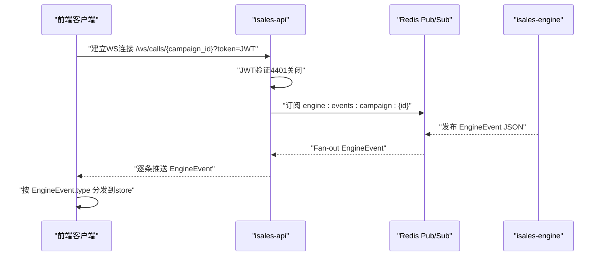
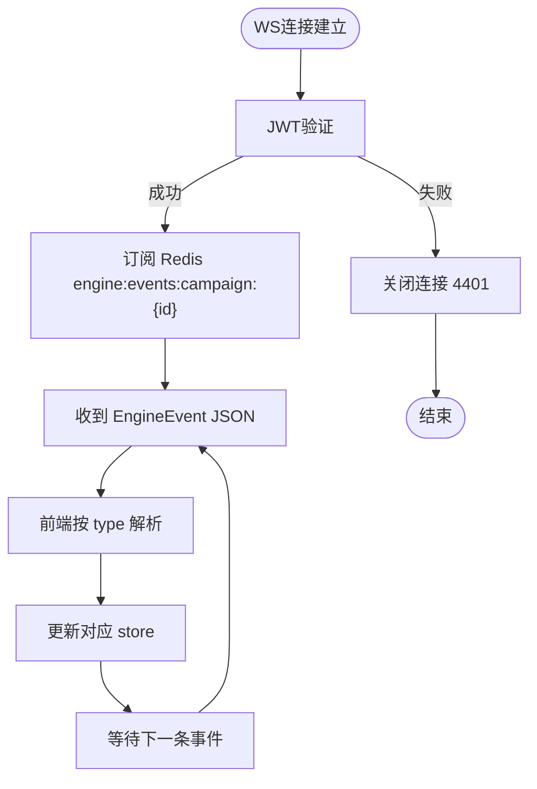
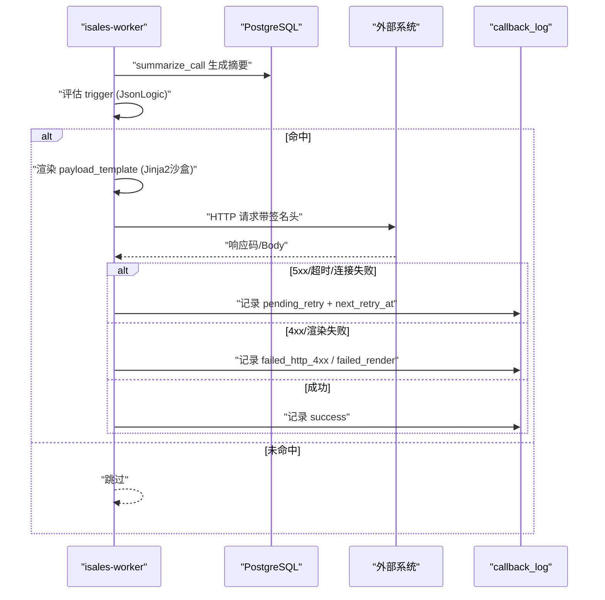
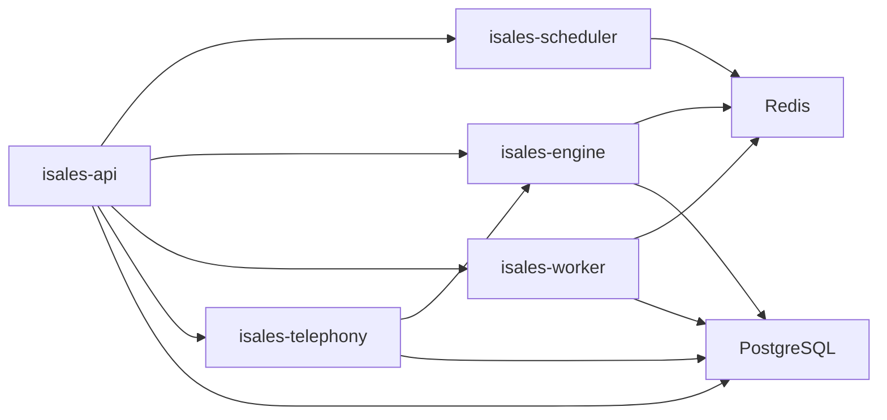

# API接口文档

<cite>
**本文档引用的文件**
- [README.md](file://README.md)
- [DESIGN.md](file://DESIGN.md)
- [openspec/specs/architecture/spec.md](file://openspec/specs/architecture/spec.md)
- [openspec/specs/service-communication/spec.md](file://openspec/specs/service-communication/spec.md)
- [openspec/specs/webhook-callback/spec.md](file://openspec/specs/webhook-callback/spec.md)
- [openspec/specs/message-contract/spec.md](file://openspec/specs/message-contract/spec.md)
- [openspec/specs/data-model/spec.md](file://openspec/specs/data-model/spec.md)
- [openspec/specs/provider-credential/spec.md](file://openspec/specs/provider-credential/spec.md)
</cite>

## 目录
1. [简介](#简介)
2. [项目结构](#项目结构)
3. [核心组件](#核心组件)
4. [架构总览](#架构总览)
5. [详细组件分析](#详细组件分析)
6. [依赖分析](#依赖分析)
7. [性能考虑](#性能考虑)
8. [故障排除指南](#故障排除指南)
9. [结论](#结论)
10. [附录](#附录)

## 简介
本文件面向iSales系统的API接口文档，聚焦以下方面：
- RESTful API端点：HTTP方法、URL模式、请求/响应模式、认证方法
- WebSocket接口：连接处理、消息格式、事件类型、实时交互模式
- gRPC与Socket通信协议：通道矩阵、消息契约、序列化与版本演进
- 协议特定示例：回调签名、重试策略、并发控制
- 错误处理策略、安全考虑、速率限制与版本信息
- 常见用例、客户端实现指南与性能优化技巧
- 调试工具与监控方法
- 已弃用功能的迁移指南与向后兼容性说明
- Webhook回调机制与实时通信接口

## 项目结构
iSales采用7仓微服务架构，API层位于isales-api，负责管理后台CRUD与WebSocket代理，同时作为engine事件的实时推送入口。

```mermaid
graph TB
subgraph "前端"
WEB["isales-web (Vue 3)"]
end
subgraph "API层"
API["isales-api<br/>管理API + WS代理"]
end
subgraph "服务层"
SCH["isales-scheduler<br/>调度器"]
ENG["isales-engine<br/>实时通话引擎"]
WRK["isales-worker<br/>异步后处理"]
TEL["isales-telephony<br/>telephony-api + modem-controller"]
end
subgraph "基础设施"
REDIS["Redis<br/>队列/Pub/Sub/计数器"]
PG["PostgreSQL<br/>数据持久化"]
end
WEB --> API
API --> SCH
API <- --> ENG
API --> WRK
API --> TEL
SCH --> ENG
ENG --> WRK
TEL --> ENG
SCH --> REDIS
ENG --> REDIS
WRK --> REDIS
API --> REDIS
API --> PG
ENG --> PG
WRK --> PG
TEL --> PG
```

**图表来源**
- [openspec/specs/architecture/spec.md:130-168](file://openspec/specs/architecture/spec.md#L130-L168)

**章节来源**
- [README.md:1-86](file://README.md#L1-L86)
- [openspec/specs/architecture/spec.md:1-168](file://openspec/specs/architecture/spec.md#L1-L168)

## 核心组件
- isales-api：提供REST管理API与WebSocket代理端点，负责JWT签发与验证、回调配置校验与轮换、凭据管理等。
- isales-engine：实时通话引擎，产生通话事件并通过Redis Pub/Sub推送到API层。
- isales-scheduler：调度器，负责拨号派发与Campaign启停控制。
- isales-worker：异步后处理，负责通话摘要、字段提取与Webhook回调。
- isales-telephony：包含telephony-api（HTTP）与modem-controller（守护进程），负责设备选择与物理设备控制。

**章节来源**
- [openspec/specs/architecture/spec.md:26-39](file://openspec/specs/architecture/spec.md#L26-L39)
- [openspec/specs/service-communication/spec.md:11-24](file://openspec/specs/service-communication/spec.md#L11-L24)

## 架构总览
服务间通信遵循“队列用于必须送达、Pub/Sub用于实时可丢失”的边界原则；API层提供WebSocket代理，将engine事件以JSON消息形式推送给前端。



**图表来源**
- [openspec/specs/service-communication/spec.md:106-146](file://openspec/specs/service-communication/spec.md#L106-L146)
- [openspec/specs/message-contract/spec.md:43-51](file://openspec/specs/message-contract/spec.md#L43-L51)

**章节来源**
- [openspec/specs/service-communication/spec.md:31-44](file://openspec/specs/service-communication/spec.md#L31-L44)
- [openspec/specs/service-communication/spec.md:106-146](file://openspec/specs/service-communication/spec.md#L106-L146)

## 详细组件分析

### REST API端点与认证
- JWT统一鉴权：isales-api为唯一签发方，telephony-api仅验证；HMAC密钥通过环境变量注入。
- 内部HTTP调用：v1仅scheduler→telephony-api使用HTTP，其余通信走Redis队列/Pub/Sub。
- 端点示例（基于OpenSpec规范）：
  - 回调配置校验与轮换
    - POST /callback-configs/validate
    - POST /callback-configs/{id}/rotate-secret
  - 凭据管理（provider-credential）
    - GET /api/provider-credentials
    - GET /api/provider-credentials/{provider_id}
    - POST /api/provider-credentials
    - DELETE /api/provider-credentials/{id}
    - POST /api/provider-credentials/reload-hint

认证与安全要点
- JWT签发与验证：isales-api签发，telephony-api验证；HMAC密钥通过环境变量分发。
- 回调签名：HMAC-SHA256签名，请求头包含时间戳与签名；secret加密存储，一次性返回明文。
- 凭据安全：统一的Fernet对称加密fabric，掩码展示，禁止明文泄露。

**章节来源**
- [openspec/specs/architecture/spec.md:96-129](file://openspec/specs/architecture/spec.md#L96-L129)
- [openspec/specs/webhook-callback/spec.md:68-100](file://openspec/specs/webhook-callback/spec.md#L68-L100)
- [openspec/specs/provider-credential/spec.md:107-139](file://openspec/specs/provider-credential/spec.md#L107-L139)

### WebSocket接口
- 端点：/ws/calls/{campaign_id}
- 连接处理：鉴权JWT，验证失败立即关闭（4401）；多客户端订阅同一campaign共享Redis订阅。
- 消息格式：直接传递EngineEvent JSON（不重新包装）；前端按discriminated union解析。
- 事件类型：由message-contract定义的EngineEvent联合类型，新增类型需通过OpenSpec变更。
- 实时交互：engine事件fan-out到所有连接客户端，前端按type分发到reactive store。



**图表来源**
- [openspec/specs/service-communication/spec.md:112-141](file://openspec/specs/service-communication/spec.md#L112-L141)
- [openspec/specs/message-contract/spec.md:76-84](file://openspec/specs/message-contract/spec.md#L76-L84)

**章节来源**
- [openspec/specs/service-communication/spec.md:106-146](file://openspec/specs/service-communication/spec.md#L106-L146)
- [openspec/specs/message-contract/spec.md:6-28](file://openspec/specs/message-contract/spec.md#L6-L28)

### gRPC与Socket通信协议
- gRPC：当前v1未采用gRPC；通道矩阵中未列出gRPC通道，新增通道需经OpenSpec变更提案。
- Socket：engine与modem-controller之间使用本地Unix socket进行拨号、挂断与音频流双向通信。
- 通信通道矩阵（部分）：
  - scheduler → engine：Redis Queue
  - engine → worker：Redis Queue
  - api ↔ engine：Redis Pub/Sub
  - api → scheduler：Redis Queue
  - engine → modem-controller：本地Unix socket / WebSocket
  - worker → 外部：HTTP（Webhook）

**章节来源**
- [openspec/specs/service-communication/spec.md:11-24](file://openspec/specs/service-communication/spec.md#L11-L24)

### Webhook回调机制
- 触发时机：summarize_call完成后，再执行process_callbacks。
- 触发表达式：JsonLogic；可引用call_summary、lead、call_record等字段。
- 负载模板：Jinja2沙盒渲染；payload_template存储为text。
- 签名与安全：HMAC-SHA256签名，请求头包含时间戳与签名；secret加密存储。
- 重试策略：指数退避+最大次数；失败分类与状态机明确。
- 超时配置：支持单条配置覆盖全局默认。
- 与其他模块隔离：与lead状态流转、engine主流程完全解耦。



**图表来源**
- [openspec/specs/webhook-callback/spec.md:5-18](file://openspec/specs/webhook-callback/spec.md#L5-L18)
- [openspec/specs/webhook-callback/spec.md:100-133](file://openspec/specs/webhook-callback/spec.md#L100-L133)

**章节来源**
- [openspec/specs/webhook-callback/spec.md:19-46](file://openspec/specs/webhook-callback/spec.md#L19-L46)
- [openspec/specs/webhook-callback/spec.md:47-67](file://openspec/specs/webhook-callback/spec.md#L47-L67)
- [openspec/specs/webhook-callback/spec.md:148-156](file://openspec/specs/webhook-callback/spec.md#L148-L156)

### 数据模型与消息契约
- 数据模型：统一由isales-common管理，所有服务通过依赖访问；JSONB字段需附schema描述。
- 消息契约：跨服务消息体集中定义在isales-common，Producer/Consumer均引用同一Pydantic模型；消息基类包含schema_version、message_id、created_at。
- 演进规则：非破坏性变更可直接合入；破坏性变更需升schema_version并经OpenSpec变更提案。

**章节来源**
- [openspec/specs/data-model/spec.md:5-18](file://openspec/specs/data-model/spec.md#L5-L18)
- [openspec/specs/message-contract/spec.md:6-28](file://openspec/specs/message-contract/spec.md#L6-L28)
- [openspec/specs/message-contract/spec.md:53-66](file://openspec/specs/message-contract/spec.md#L53-L66)

### 并发控制与全局计数
- 全局并发：跨engine实例的并发用Redis原子计数器（INCR/DECR）控制；短时不可用时重连重试。
- 拨号前递增：派发新通话前检查并发上限；通话结束递减；异常崩溃有对账机制。

**章节来源**
- [openspec/specs/service-communication/spec.md:45-63](file://openspec/specs/service-communication/spec.md#L45-L63)

## 依赖分析
- 服务间依赖：API层作为中心枢纽，通过Redis队列/Pub/Sub与各服务交互；telephony-api与modem-controller负责设备侧。
- 数据依赖：所有服务共用PostgreSQL与Redis；数据库迁移由isales-common统一管理。
- 通信故障容错：Redis短暂不可用时重连重试；DB不可用时engine缓存状态或按异常处理；modem-controller不可用时优雅清理受影响会话。



**图表来源**
- [openspec/specs/architecture/spec.md:59-72](file://openspec/specs/architecture/spec.md#L59-L72)
- [openspec/specs/service-communication/spec.md:87-105](file://openspec/specs/service-communication/spec.md#L87-L105)

**章节来源**
- [openspec/specs/architecture/spec.md:59-86](file://openspec/specs/architecture/spec.md#L59-L86)
- [openspec/specs/service-communication/spec.md:87-105](file://openspec/specs/service-communication/spec.md#L87-L105)

## 性能考虑
- 通信通道选择：队列用于必须送达场景，Pub/Sub用于实时可丢失事件；避免在WS层做字段裁剪或重命名。
- 序列化：建议v1全部用JSON（便于调试），后续按需优化。
- 并发控制：使用Redis原子计数器，避免内存计数器替代；异常时有对账机制。
- 重试调度：独立后台task周期扫描pending_retry，按next_retry_at排序取批处理，减少抖动。

**章节来源**
- [openspec/specs/service-communication/spec.md:147-150](file://openspec/specs/service-communication/spec.md#L147-L150)
- [openspec/specs/service-communication/spec.md:45-63](file://openspec/specs/service-communication/spec.md#L45-L63)
- [openspec/specs/webhook-callback/spec.md:100-103](file://openspec/specs/webhook-callback/spec.md#L100-L103)

## 故障排除指南
- WebSocket连接失败（4401）：检查JWT有效性与签名；确认isales-api为唯一签发方。
- Redis不可用：检查连接与重连策略；关注INCR/DECR计数器泄漏风险。
- DB不可用：engine在v1中可能缓存状态或按异常处理；关注对账机制。
- modem-controller中断：受影响会话需优雅清理；scheduler可暂停派发直至恢复。
- Webhook失败：区分4xx与5xx；4xx不重试，5xx按指数退避重试；核对签名头与时间戳。

**章节来源**
- [openspec/specs/service-communication/spec.md:112-126](file://openspec/specs/service-communication/spec.md#L112-L126)
- [openspec/specs/service-communication/spec.md:91-105](file://openspec/specs/service-communication/spec.md#L91-L105)
- [openspec/specs/webhook-callback/spec.md:114-133](file://openspec/specs/webhook-callback/spec.md#L114-L133)

## 结论
iSales的API体系以isales-api为核心，结合Redis队列/Pub/Sub与WebSocket代理，实现了从调度、引擎、后处理到设备控制的全链路通信。通过统一的消息契约、严格的凭据与回调安全机制、以及明确的演进规则，系统在v1阶段提供了高内聚、低耦合的微服务架构基础。未来扩展（如gRPC、多实例WS广播）需严格遵循OpenSpec变更流程。

## 附录

### 常见用例与客户端实现指南
- 前端订阅实时通话事件：使用/ws/calls/{campaign_id}?token=JWT；按EngineEvent.type解析并更新store。
- 创建回调配置：使用POST /callback-configs/validate进行dry-run校验；创建后一次性返回signing_secret_plaintext；后续GET仅返回掩码。
- 凭据管理：通过/JWT鉴权的provider-credentials端点进行CRUD；写入触发审计记录updated_by/updated_at。

**章节来源**
- [openspec/specs/service-communication/spec.md:106-146](file://openspec/specs/service-communication/spec.md#L106-L146)
- [openspec/specs/webhook-callback/spec.md:171-204](file://openspec/specs/webhook-callback/spec.md#L171-L204)
- [openspec/specs/provider-credential/spec.md:107-139](file://openspec/specs/provider-credential/spec.md#L107-L139)

### 调试工具与监控方法
- 日志与追踪：消息基类提供便于日志输出的__str__，含message_id与类名，便于跨服务trace。
- Prometheus/Grafana：参考deploy/monitoring下的配置样例，建立指标采集与告警规则。
- 重试调度：独立后台task扫描pending_retry，建议设置日志级别与告警阈值。

**章节来源**
- [openspec/specs/message-contract/spec.md:76-84](file://openspec/specs/message-contract/spec.md#L76-L84)
- [openspec/specs/webhook-callback/spec.md:100-103](file://openspec/specs/webhook-callback/spec.md#L100-L103)

### 版本信息与迁移指南
- 消息schema版本：schema_version默认1，破坏性升级时+1；消费者需校验并按版本处理。
- 向后兼容：非破坏性变更可直接合入；破坏性变更需同时支持新旧两版反序列化。
- 迁移路径：通过OpenSpec变更提案推进；涉及凭据与回调签名的变更需配合RUNBOOK执行。

**章节来源**
- [openspec/specs/message-contract/spec.md:53-66](file://openspec/specs/message-contract/spec.md#L53-L66)