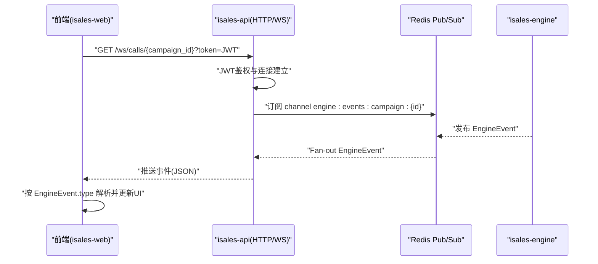
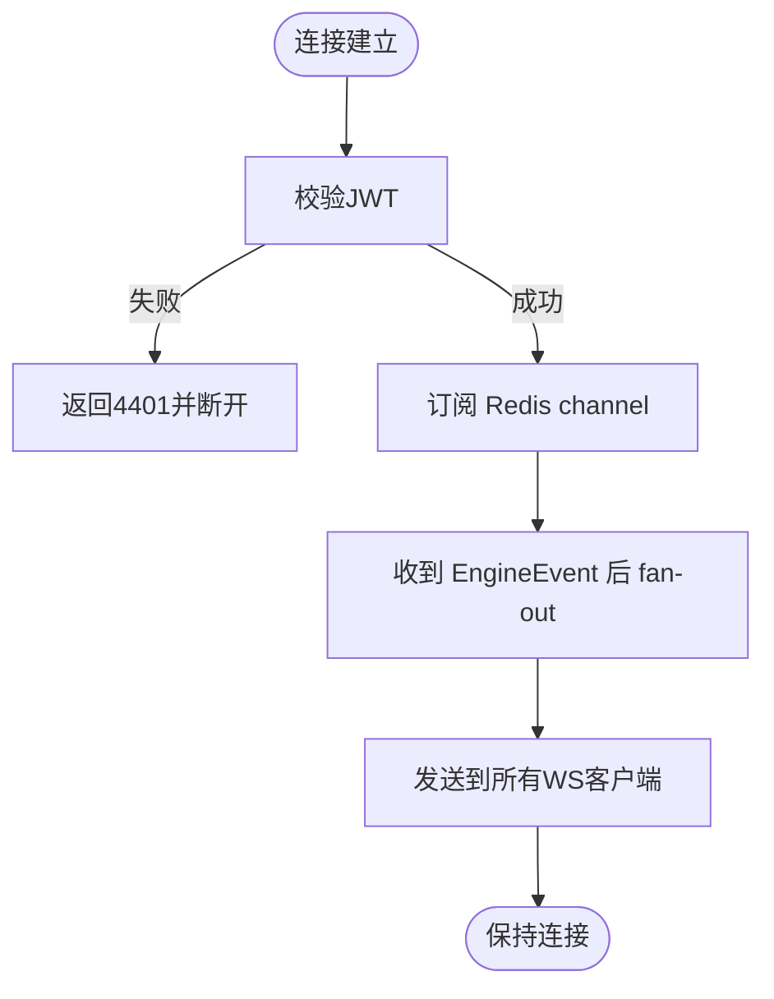
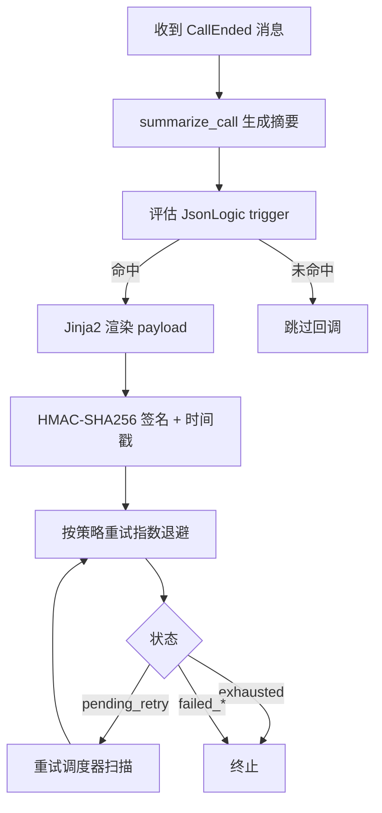
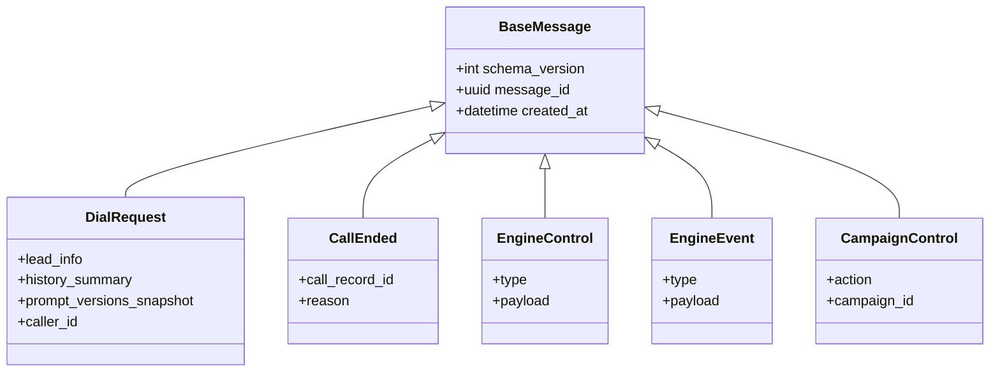
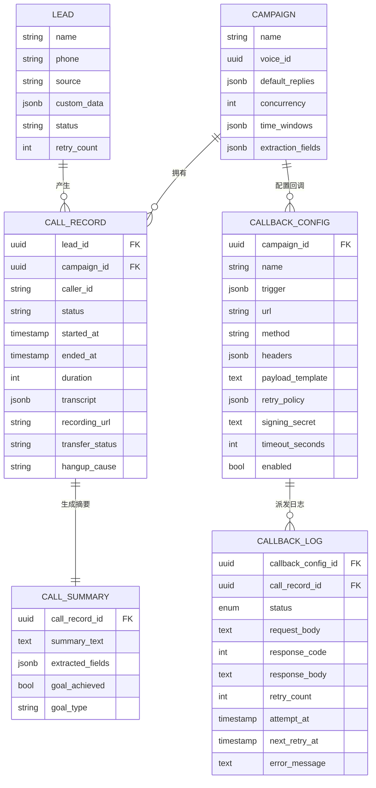
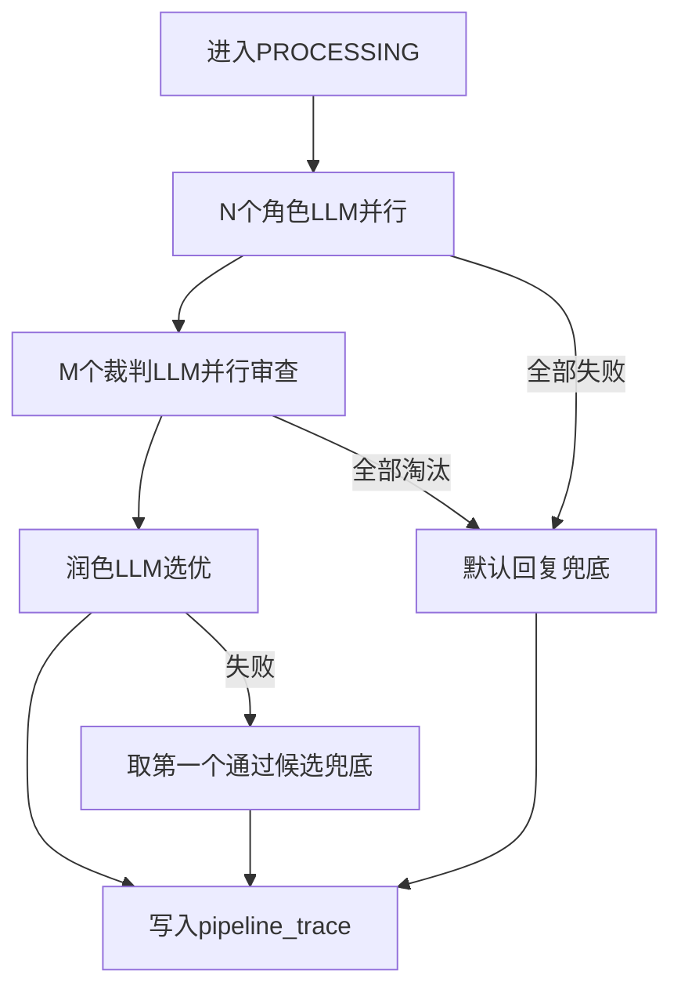
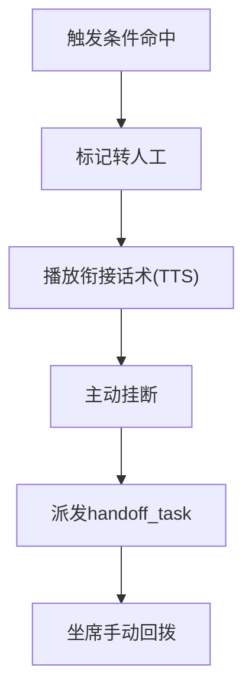
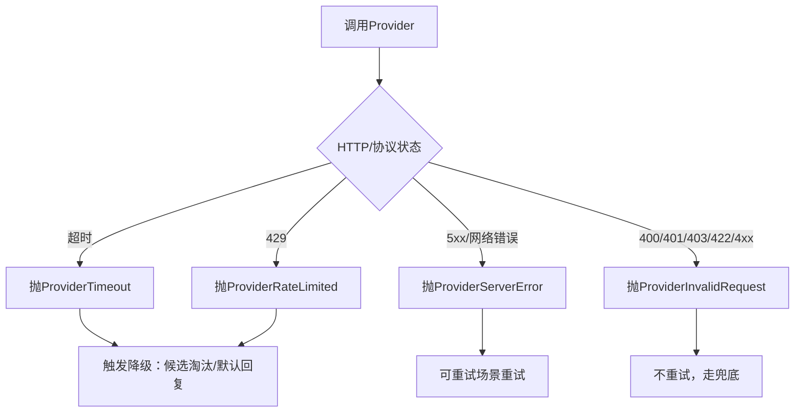
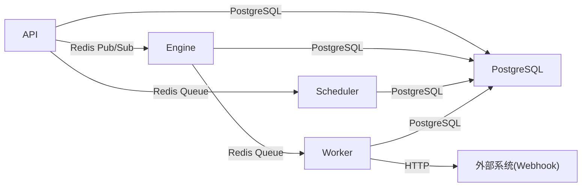

# RESTful API接口

<cite>
**本文档引用的文件**
- [README.md](file://README.md)
- [service-communication/spec.md](file://openspec/specs/service-communication/spec.md)
- [message-contract/spec.md](file://openspec/specs/message-contract/spec.md)
- [webhook-callback/spec.md](file://openspec/specs/webhook-callback/spec.md)
- [data-model/spec.md](file://openspec/specs/data-model/spec.md)
- [ai-pipeline/spec.md](file://openspec/specs/ai-pipeline/spec.md)
- [role-prompt/spec.md](file://openspec/specs/role-prompt/spec.md)
- [human-handoff/spec.md](file://openspec/specs/human-handoff/spec.md)
- [deployment-topology/spec.md](file://openspec/specs/deployment-topology/spec.md)
- [provider-abc/spec.md](file://openspec/changes/archive/2026-05-08-impl-engine-providers/specs/provider-abc/spec.md)
</cite>

## 目录
1. [简介](#简介)
2. [项目结构](#项目结构)
3. [核心组件](#核心组件)
4. [架构总览](#架构总览)
5. [详细组件分析](#详细组件分析)
6. [依赖分析](#依赖分析)
7. [性能考虑](#性能考虑)
8. [故障排查指南](#故障排查指南)
9. [结论](#结论)
10. [附录](#附录)

## 简介
本文件面向iSales系统的RESTful API，基于OpenSpec规范，系统化梳理HTTP端点、认证与权限、安全措施、错误码与异常处理、API版本控制与兼容性、客户端SDK使用指南以及跨服务消息契约与Redis消息体标准化。文档旨在帮助开发者与运维人员快速理解并正确使用API，确保集成的一致性与稳定性。

## 项目结构
iSales采用多仓协作的架构，API服务位于独立仓库，其余组件包括引擎、调度器、工作者、电话API、Modem控制器、Web管理端等。API服务通过FastAPI提供REST接口，并通过Redis与各服务进行消息通信，PostgreSQL存储数据。

```mermaid
graph TB
subgraph "云边一体部署"
WEB["isales-web<br/>Vue 3 SPA"]
NGINX["nginx<br/>反向代理"]
API["isales-api<br/>FastAPI HTTP/WS"]
ENGINE["isales-engine<br/>实时通话引擎"]
SCHED["isales-scheduler<br/>调度器"]
WORKER["isales-worker<br/>后台worker"]
TAPI["isales-telephony-api<br/>设备/卡管理"]
MOD["isales-modem-controller<br/>本地音频/设备控制"]
DB["PostgreSQL"]
REDIS["Redis"]
end
WEB --> NGINX
NGINX --> API
API <- --> REDIS
API --> DB
SCHED --> REDIS
ENGINE --> REDIS
WORKER --> REDIS
TAPI --> REDIS
MOD --> REDIS
ENGINE --> DB
SCHED --> DB
WORKER --> DB
API --> DB
TAPI --> DB
```

图表来源
- [deployment-topology/spec.md:1-414](file://openspec/specs/deployment-topology/spec.md#L1-L414)
- [service-communication/spec.md:1-150](file://openspec/specs/service-communication/spec.md#L1-L150)

章节来源
- [README.md:1-86](file://README.md#L1-L86)
- [deployment-topology/spec.md:1-414](file://openspec/specs/deployment-topology/spec.md#L1-L414)

## 核心组件
- API服务（isales-api）：提供REST接口与WebSocket事件订阅，负责业务编排、回调配置、数据模型访问等。
- 引擎服务（isales-engine）：实时通话引擎，负责AI三层管线、状态机、事件推送。
- 调度器（isales-scheduler）：负责拨号队列与Campaign启停控制。
- 工作者（isales-worker）：处理通话结束后的摘要、回调派发与重试。
- 电话API（isales-telephony-api）：设备与SIM卡管理，拨号前设备选择。
- Modem控制器（isales-modem-controller）：本地音频/设备控制。
- 数据存储：PostgreSQL（统一数据模型由isales-common管理）。
- 消息总线：Redis（队列用于可靠投递，Pub/Sub用于实时事件广播）。

章节来源
- [service-communication/spec.md:1-150](file://openspec/specs/service-communication/spec.md#L1-L150)
- [data-model/spec.md:1-83](file://openspec/specs/data-model/spec.md#L1-L83)

## 架构总览
API通过HTTP与WebSocket与前端交互，内部通过Redis与各服务解耦。WebSocket端点将引擎事件（EngineEvent）直接转发给前端，确保实时性与一致性。



图表来源
- [service-communication/spec.md:106-150](file://openspec/specs/service-communication/spec.md#L106-L150)

章节来源
- [service-communication/spec.md:106-150](file://openspec/specs/service-communication/spec.md#L106-L150)

## 详细组件分析

### WebSocket事件推送（/ws/calls/{campaign_id}）
- 功能：订阅指定Campaign的实时通话事件，包括状态变更、ASR文本、转录增量等。
- 认证：查询参数携带JWT，服务端在握手前验证，失败返回4401并断开。
- 消息来源：引擎通过Redis Pub/Sub发布EngineEvent，API直接转发。
- 并发与资源：多客户端订阅同一campaign共享一个Redis订阅，避免连接膨胀。
- 消息契约：直接传递EngineEvent JSON，前端使用discriminated union解析。



图表来源
- [service-communication/spec.md:112-126](file://openspec/specs/service-communication/spec.md#L112-L126)

章节来源
- [service-communication/spec.md:106-150](file://openspec/specs/service-communication/spec.md#L106-L150)

### 回调配置与Webhook派发
- 触发时机：通话结束后，先生成call_summary再派发回调，避免通话期间误触发。
- 触发表达式：JsonLogic表达式，支持引用call_summary、lead、call_record字段。
- 负载模板：Jinja2沙盒渲染，禁用危险能力，输出合法JSON。
- 签名与防重放：HMAC-SHA256签名，包含时间戳头部，接收方可校验时间差与常量时间比较。
- 重试策略：指数退避+最大次数，失败状态机明确（pending_retry/exhausted/failed_*）。
- 与主流程解耦：回调结果不影响lead状态或engine行为。



图表来源
- [webhook-callback/spec.md:5-231](file://openspec/specs/webhook-callback/spec.md#L5-L231)

章节来源
- [webhook-callback/spec.md:5-231](file://openspec/specs/webhook-callback/spec.md#L5-L231)

### 消息契约与Redis消息体标准化
- 统一基类：所有跨服务消息继承BaseMessage，包含schema_version、message_id、created_at。
- 消息类集中定义：isales-common中定义Pydantic模型，生产者使用model_dump_json序列化，消费者使用model_validate_json反序列化。
- 版本演进：非破坏性变更可直接合入；破坏性变更需升schema_version并通过OpenSpec变更流程。
- 观测性：日志包含message_id，便于跨服务追踪。



图表来源
- [message-contract/spec.md:25-85](file://openspec/specs/message-contract/spec.md#L25-L85)
- [service-communication/spec.md:43-52](file://openspec/specs/service-communication/spec.md#L43-L52)

章节来源
- [message-contract/spec.md:1-85](file://openspec/specs/message-contract/spec.md#L1-L85)
- [service-communication/spec.md:1-150](file://openspec/specs/service-communication/spec.md#L1-L150)

### 数据模型与表关系
- 统一由isales-common管理，其他服务通过依赖访问。
- 表清单覆盖核心业务实体，归属服务明确，跨服务读写遵循“数据库直连”与“归属服务”原则。
- JSONB字段需附schema描述，避免滥用。



图表来源
- [data-model/spec.md:23-51](file://openspec/specs/data-model/spec.md#L23-L51)

章节来源
- [data-model/spec.md:1-83](file://openspec/specs/data-model/spec.md#L1-L83)

### AI三层管线与提示工程
- 三层并行：N个角色LLM并行→M个裁判LLM审查→1个润色LLM选优。
- Prompt三段式组装：system message + 单条user message，强制JSON Mode或后处理。
- 简化管线：WRAPPING_UP阶段单角色+润色，不启用PK与裁判。
- 连续打断保护：short_reply或listen_only策略，保障用户体验。



图表来源
- [ai-pipeline/spec.md:7-166](file://openspec/specs/ai-pipeline/spec.md#L7-L166)
- [role-prompt/spec.md:21-185](file://openspec/specs/role-prompt/spec.md#L21-L185)

章节来源
- [ai-pipeline/spec.md:1-166](file://openspec/specs/ai-pipeline/spec.md#L1-L166)
- [role-prompt/spec.md:1-185](file://openspec/specs/role-prompt/spec.md#L1-L185)

### 转人工（v1衰减实现）
- 触发机制：关键词/意图分类/轮次阈值/独立LLM判定，OR关系。
- 流程：AI礼貌告知→TTS播放→主动挂断→派发handoff_task→坐席手动回拨。
- 与状态机交互：TRANSFERRING期间不调AI管线，直接进入END。



图表来源
- [human-handoff/spec.md:21-128](file://openspec/specs/human-handoff/spec.md#L21-L128)

章节来源
- [human-handoff/spec.md:1-128](file://openspec/specs/human-handoff/spec.md#L1-L128)

### Provider错误模型与降级
- 统一异常分类：ProviderTimeout、ProviderRateLimited、ProviderInvalidRequest、ProviderServerError。
- 降级策略：超时/异常触发候选淘汰、默认回复兜底；限流可触发切换Provider。
- SDK原生异常隔离：在实现层转换为ProviderError再抛出。



图表来源
- [provider-abc/spec.md:1-43](file://openspec/changes/archive/2026-05-08-impl-engine-providers/specs/provider-abc/spec.md#L1-L43)

章节来源
- [provider-abc/spec.md:1-43](file://openspec/changes/archive/2026-05-08-impl-engine-providers/specs/provider-abc/spec.md#L1-L43)

## 依赖分析
- 服务间通信：Redis队列用于“必须送达”的工作派发，Redis Pub/Sub用于“实时可丢失”的事件广播。
- 数据一致性：所有服务直接访问PostgreSQL（通过isales-common模型），避免数据网关层。
- 容错策略：Redis短暂不可用时重连重试；DB不可用时优雅清理受影响的call_session；modem-controller不可用时清理受影响会话。



图表来源
- [service-communication/spec.md:64-105](file://openspec/specs/service-communication/spec.md#L64-L105)
- [data-model/spec.md:5-18](file://openspec/specs/data-model/spec.md#L5-L18)

章节来源
- [service-communication/spec.md:1-150](file://openspec/specs/service-communication/spec.md#L1-L150)
- [data-model/spec.md:1-83](file://openspec/specs/data-model/spec.md#L1-L83)

## 性能考虑
- WebSocket长连接：为避免连接风暴，服务重启顺序严格控制，engine重启需在低峰期执行。
- 队列深度监控：Prometheus指标暴露，告警覆盖engine:dial队列深度、设备flagged比例、回调失败率等。
- 重试退避：回调重试采用指数退避，避免雪崩效应。
- 日志与追踪：消息包含message_id，便于跨服务定位性能瓶颈。

章节来源
- [deployment-topology/spec.md:62-113](file://openspec/specs/deployment-topology/spec.md#L62-L113)
- [webhook-callback/spec.md:100-133](file://openspec/specs/webhook-callback/spec.md#L100-L133)

## 故障排查指南
- WebSocket鉴权失败：检查token有效性与过期时间，确认API端4401断开连接。
- 回调失败：检查JsonLogic表达式语法、Jinja2模板渲染、签名头部与时间戳，查看callback_log状态与error_message。
- Provider错误：根据ProviderError分类采取不同策略（限流切换、服务端错误重试、非法请求兜底）。
- 数据不一致：确认isales-common模型与迁移是否一致，核对JSONB字段schema。

章节来源
- [service-communication/spec.md:112-126](file://openspec/specs/service-communication/spec.md#L112-L126)
- [webhook-callback/spec.md:134-231](file://openspec/specs/webhook-callback/spec.md#L134-L231)
- [provider-abc/spec.md:1-43](file://openspec/changes/archive/2026-05-08-impl-engine-providers/specs/provider-abc/spec.md#L1-L43)

## 结论
本文档基于OpenSpec规范，系统化梳理了iSales的RESTful API与消息契约，明确了认证与权限、安全措施、错误处理、版本控制与兼容性策略，并提供了跨服务通信与Redis消息体标准化的最佳实践。建议在集成过程中严格遵循消息契约与回调配置规范，确保系统的可靠性与可观测性。

## 附录

### API端点与认证（概览）
- WebSocket端点
  - 方法：GET
  - 路径：/ws/calls/{campaign_id}
  - 查询参数：token=JWT
  - 认证：JWT鉴权，失败返回4401
  - 事件：EngineEvent(JSON)，前端按type字段解析
- 辅助端点（回调配置）
  - POST /callback-configs/validate：Dry-run校验trigger与payload模板
  - POST /callback-configs/{id}/rotate-secret：一次性返回明文secret并加密存储

章节来源
- [service-communication/spec.md:106-150](file://openspec/specs/service-communication/spec.md#L106-L150)
- [webhook-callback/spec.md:171-209](file://openspec/specs/webhook-callback/spec.md#L171-L209)

### 安全与权限
- JWT鉴权：WebSocket连接前验证，失败立即断开。
- 回调签名：HMAC-SHA256 + 时间戳，接收方可做时间差校验与常量时间比较。
- Secret存储：Fernet加密存储，仅在创建/旋转时一次性返回明文。

章节来源
- [service-communication/spec.md:112-116](file://openspec/specs/service-communication/spec.md#L112-L116)
- [webhook-callback/spec.md:68-99](file://openspec/specs/webhook-callback/spec.md#L68-L99)

### 错误码与异常处理
- Provider错误分类：ProviderTimeout、ProviderRateLimited、ProviderInvalidRequest、ProviderServerError。
- 回调失败状态：pending_retry/exhausted/failed_render/failed_http_4xx/failed_http_5xx。
- 建议：在SDK中捕获ProviderError并按分类执行降级或重试策略。

章节来源
- [provider-abc/spec.md:1-43](file://openspec/changes/archive/2026-05-08-impl-engine-providers/specs/provider-abc/spec.md#L1-L43)
- [webhook-callback/spec.md:100-133](file://openspec/specs/webhook-callback/spec.md#L100-L133)

### API版本控制与兼容性
- 消息schema版本：schema_version默认1，破坏性升级+1；consumer需校验版本范围。
- 演进规则：非破坏性变更可直接合入；破坏性变更需OpenSpec变更提案并同时支持新旧两版反序列化。
- 建议：客户端在反序列化时严格校验schema_version，避免静默丢弃。

章节来源
- [message-contract/spec.md:53-66](file://openspec/specs/message-contract/spec.md#L53-L66)

### 客户端SDK使用指南与最佳实践
- WebSocket客户端：连接前携带token，按EngineEvent.type解析消息，避免假设字段命名/类型/出现频率。
- 回调配置：使用validate端点进行语法与渲染校验，避免生产环境配置错误。
- Provider调用：捕获ProviderError并按分类处理，超时与限流场景优先兜底或切换。
- 日志追踪：利用message_id串联跨服务调用链，便于定位问题。

章节来源
- [service-communication/spec.md:137-146](file://openspec/specs/service-communication/spec.md#L137-L146)
- [webhook-callback/spec.md:171-209](file://openspec/specs/webhook-callback/spec.md#L171-L209)
- [provider-abc/spec.md:1-43](file://openspec/changes/archive/2026-05-08-impl-engine-providers/specs/provider-abc/spec.md#L1-L43)