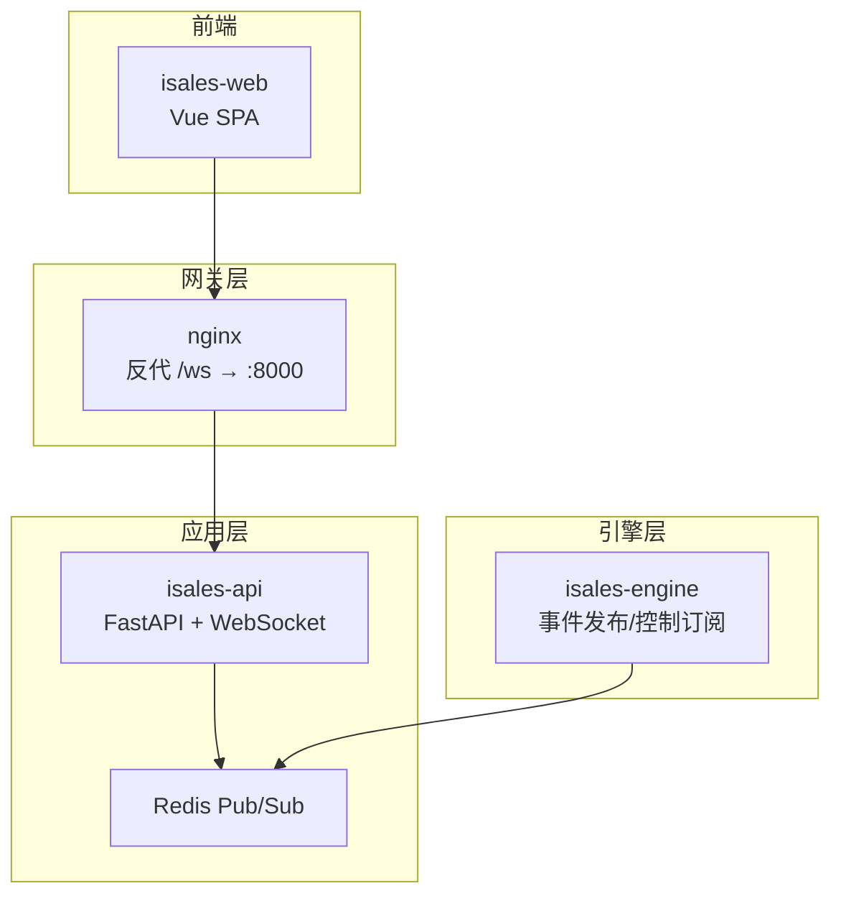
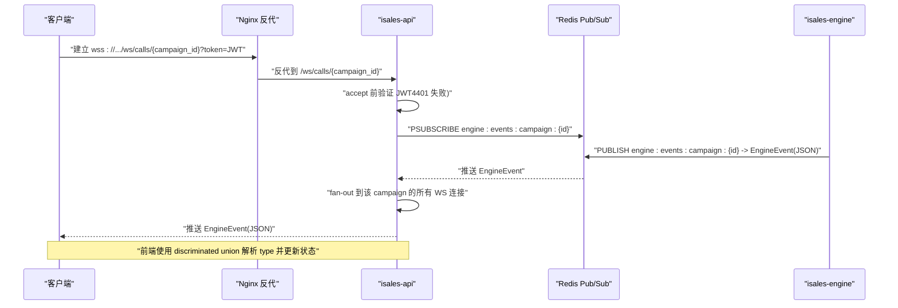
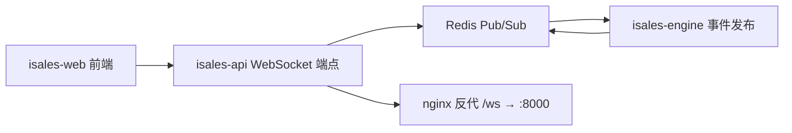

# WebSocket实时通信

<cite>
**本文档引用的文件**
- [service-communication/spec.md](file://openspec/specs/service-communication/spec.md)
- [service-communication/spec.md](file://openspec/changes/arch-cloud-edge-split/specs/service-communication/spec.md)
- [service-communication/spec.md](file://openspec/changes/archive/2026-05-06-impl-api/specs/service-communication/spec.md)
- [message-contract/spec.md](file://openspec/specs/message-contract/spec.md)
- [device-hardware/spec.md](file://openspec/specs/device-hardware/spec.md)
- [design.md](file://openspec/changes/archive/2026-05-06-impl-api/design.md)
- [design.md](file://openspec/changes/archive/2026-05-07-impl-engine/design.md)
- [tasks.md](file://openspec/changes/archive/2026-05-07-impl-engine/tasks.md)
- [deployment-topology/spec.md](file://openspec/changes/archive/2026-05-19-web-admin-deploy/specs/deployment-topology/spec.md)
- [v1-roadmap-a3-context.md](file://openspec/v1-roadmap-a3-context.md)
- [proposal.md](file://openspec/changes/archive/2026-05-08-impl-engine-providers/proposal.md)
- [isales-api.service](file://deploy/cloud/systemd/isales-api.service)
- [isales.conf](file://deploy/cloud/nginx/isales.conf)
- [RUNBOOK.md](file://deploy/RUNBOOK.md)
</cite>

## 目录
1. [简介](#简介)
2. [项目结构](#项目结构)
3. [核心组件](#核心组件)
4. [架构总览](#架构总览)
5. [详细组件分析](#详细组件分析)
6. [依赖关系分析](#依赖关系分析)
7. [性能考虑](#性能考虑)
8. [故障排除指南](#故障排除指南)
9. [结论](#结论)
10. [附录](#附录)

## 简介
本文件系统化梳理 iSales 系统的 WebSocket 实时通信能力，重点覆盖以下方面：
- 连接建立与鉴权流程
- 心跳与长连接维持机制
- 实时消息格式与事件类型
- EngineEvent 与 EngineControl 的处理方式
- 客户端连接管理、重连策略与错误恢复
- 实时通话状态更新、ASR 文本传输与转人工通知等实时功能实现要点
- WebSocket 客户端实现示例与调试工具使用指南

## 项目结构
围绕 WebSocket 的相关规范与实现要点主要分布在如下位置：
- 通信规范：service-communication/spec.md（含 WebSocket 鉴权、Fan-out、消息形状约束等）
- 消息契约：message-contract/spec.md（定义 EngineEvent/EngineControl 等消息基类与版本控制）
- 引擎实现设计：design.md（EngineEvent 发布 fire-and-forget、EngineControl 消费单订阅任务）
- 部署拓扑：deployment-topology/spec.md（nginx 反代 WebSocket，proxy_read_timeout 等）
- 设备硬件协议：device-hardware/spec.md（IPC 帧格式与实时事件字段最小化原则）
- 引擎提供商：proposal.md（ASR/TTS/LLM Provider 接口与流式能力）
- 运维手册：RUNBOOK.md（WebSocket worker 数量与 reload 行为）

图表来源
- [deployment-topology/spec.md:35-59](file://openspec/changes/archive/2026-05-19-web-admin-deploy/specs/deployment-topology/spec.md#L35-L59)
- [service-communication/spec.md:112-136](file://openspec/specs/service-communication/spec.md#L112-L136)
- [design.md:47-53](file://openspec/changes/archive/2026-05-06-impl-api/design.md#L47-L53)

章节来源
- [service-communication/spec.md:112-136](file://openspec/specs/service-communication/spec.md#L112-L136)
- [deployment-topology/spec.md:35-59](file://openspec/changes/archive/2026-05-19-web-admin-deploy/specs/deployment-topology/spec.md#L35-L59)
- [design.md:47-53](file://openspec/changes/archive/2026-05-06-impl-api/design.md#L47-L53)

## 核心组件
- WebSocket 端点与鉴权
  - 端点：/ws/calls/{campaign_id}
  - 鉴权：查询参数携带 JWT，服务端在 accept 前验证，失败返回 4401
- 连接管理
  - 每 campaign_id 维护一组 WebSocket 连接集合
  - 后台单任务订阅 Redis Pub/Sub，收到 EngineEvent 后 fan-out 给该集合内所有连接
- 消息契约
  - EngineEvent/EngineControl 等消息由 isales-common 统一定义，序列化为 JSON 直传
  - 前端使用 TypeScript discriminated union 解析，未知 type 仅警告跳过
- 引擎侧事件与控制
  - EngineEvent 发布采用 fire-and-forget，失败不影响通话主路径
  - EngineControl 消费采用单订阅任务，按 call_id 分派至 SessionManager

章节来源
- [service-communication/spec.md:112-136](file://openspec/specs/service-communication/spec.md#L112-L136)
- [service-communication/spec.md:215-245](file://openspec/changes/arch-cloud-edge-split/specs/service-communication/spec.md#L215-L245)
- [design.md:47-53](file://openspec/changes/archive/2026-05-06-impl-api/design.md#L47-L53)
- [design.md:168-178](file://openspec/changes/archive/2026-05-07-impl-engine/design.md#L168-L178)
- [message-contract/spec.md:25-51](file://openspec/specs/message-contract/spec.md#L25-L51)

## 架构总览
WebSocket 实时通道的端到端流程如下：

图表来源
- [service-communication/spec.md:112-136](file://openspec/specs/service-communication/spec.md#L112-L136)
- [design.md:47-53](file://openspec/changes/archive/2026-05-06-impl-api/design.md#L47-L53)
- [design.md:168-178](file://openspec/changes/archive/2026-05-07-impl-engine/design.md#L168-L178)

## 详细组件分析

### 连接建立与鉴权
- 连接地址：/ws/calls/{campaign_id}
- 鉴权方式：查询参数 token=JWT
- 验证时机：accept 前；失败立即关闭并返回 4401
- 多客户端订阅：共享一个 Redis 订阅，避免每个连接独立订阅导致 Redis 连接膨胀
- 单实例限制：v1 单实例运行，多实例扩展需 OpenSpec 变更提案

章节来源
- [service-communication/spec.md:112-121](file://openspec/specs/service-communication/spec.md#L112-L121)
- [service-communication/spec.md:221-235](file://openspec/changes/arch-cloud-edge-split/specs/service-communication/spec.md#L221-L235)
- [design.md:41-46](file://openspec/changes/archive/2026-05-06-impl-api/design.md#L41-L46)

### 心跳与长连接维持
- 服务端未定义专用心跳帧；前端应基于 WebSocket 层保活与自动重连策略
- nginx 反代对 /ws 路径设置较长 proxy_read_timeout，避免 Monitor/live-status 类长连接被默认 60s 杀掉
- 运维层面：isales-api 服务为单 worker 设计，reload 期间已握手的 HTTP/2/WebSocket 流不断

章节来源
- [deployment-topology/spec.md:35-45](file://openspec/changes/archive/2026-05-19-web-admin-deploy/specs/deployment-topology/spec.md#L35-L45)
- [RUNBOOK.md:174-174](file://deploy/RUNBOOK.md#L174-L174)
- [isales-api.service:1-1](file://deploy/cloud/systemd/isales-api.service#L1-L1)

### 实时消息格式与事件类型
- 消息形状由 message-contract 规范约束：直接传递 EngineEvent JSON，不重新包装
- 前端使用 TypeScript discriminated union（type 字段）解析；未知 type 仅警告跳过，字段缺失/类型错亦仅警告
- 新事件类型引入需经 OpenSpec change 同步 isales-common 的 EngineEvent discriminated union，前端在变更实施时新增对应 handler

章节来源
- [service-communication/spec.md:132-146](file://openspec/specs/service-communication/spec.md#L132-L146)
- [service-communication/spec.md:236-249](file://openspec/changes/arch-cloud-edge-split/specs/service-communication/spec.md#L236-L249)
- [message-contract/spec.md:25-51](file://openspec/specs/message-contract/spec.md#L25-L51)

### EngineEvent 与 EngineControl 处理
- EngineEvent 发布：fire-and-forget，publish 失败仅记录警告，不阻塞通话主路径
- EngineControl 消费：单订阅任务（PSUBSCRIBE engine:control:campaign:*），反序列化为 EngineControl，按 call_id 分派至 SessionManager；不存在 call_id 时记录警告并静默丢弃
- 事件帧字段最小化：modem-controller 发送事件帧仅包含必要字段，避免回显内部值

章节来源
- [design.md:168-178](file://openspec/changes/archive/2026-05-07-impl-engine/design.md#L168-L178)
- [tasks.md:99-107](file://openspec/changes/archive/2026-05-07-impl-engine/tasks.md#L99-L107)
- [device-hardware/spec.md:142-149](file://openspec/specs/device-hardware/spec.md#L142-L149)

### 客户端连接管理、重连策略与错误恢复
- 连接管理：按 campaign_id 维护连接集合；客户端断开后从集合移除；当某 campaign 无连接时可选择保留或关闭 Redis 订阅
- 重连策略：建议前端实现指数退避重连，避免雪崩；在鉴权失败时（4401）提示重新登录获取新 token
- 错误恢复：未知 EngineEvent.type 仅记录警告并跳过；字段缺失/类型错误亦仅警告；新增事件类型需前后端同步演进

章节来源
- [service-communication/spec.md:122-126](file://openspec/specs/service-communication/spec.md#L122-L126)
- [service-communication/spec.md:137-141](file://openspec/specs/service-communication/spec.md#L137-L141)
- [service-communication/spec.md:241-245](file://openspec/changes/arch-cloud-edge-split/specs/service-communication/spec.md#L241-L245)

### 实时功能实现细节
- 实时通话状态更新：engine 通过 Redis Pub/Sub 发布 EngineEvent，前端按 type 分发到 reactive store
- ASR 文本传输：ASR Provider 异步流式接口持续推送中间结果，便于打断检测即时判定
- 转人工通知：EngineControl 中包含转人工指令类型，按 call_id 分派至 SessionManager 执行

章节来源
- [proposal.md:1-5](file://openspec/changes/archive/2026-05-08-impl-engine-providers/proposal.md#L1-L5)
- [design.md:174-178](file://openspec/changes/archive/2026-05-07-impl-engine/design.md#L174-L178)
- [v1-roadmap-a3-context.md:52-77](file://openspec/v1-roadmap-a3-context.md#L52-L77)

### WebSocket 客户端实现示例与调试工具
- 客户端连接示例（概念性流程）
  - 步骤1：构造 URL "/ws/calls/{campaign_id}?token={JWT}"
  - 步骤2：建立连接并监听 onmessage
  - 步骤3：解析 JSON，按 type 字段分发到状态存储
  - 步骤4：实现指数退避重连，处理 4401 鉴权失败
- 调试工具
  - 使用浏览器开发者工具 Network 面板观察 WebSocket 握手与消息
  - 使用 ws/wscat 等命令行工具进行基础连通性测试
  - 查看 nginx 与 isales-api 日志定位反代与服务端问题

章节来源
- [service-communication/spec.md:112-116](file://openspec/specs/service-communication/spec.md#L112-L116)
- [deployment-topology/spec.md:35-45](file://openspec/changes/archive/2026-05-19-web-admin-deploy/specs/deployment-topology/spec.md#L35-L45)
- [RUNBOOK.md:174-174](file://deploy/RUNBOOK.md#L174-L174)

## 依赖关系分析
WebSocket 实时通道的关键依赖关系如下：

图表来源
- [service-communication/spec.md:112-136](file://openspec/specs/service-communication/spec.md#L112-L136)
- [deployment-topology/spec.md:35-45](file://openspec/changes/archive/2026-05-19-web-admin-deploy/specs/deployment-topology/spec.md#L35-L45)
- [design.md:47-53](file://openspec/changes/archive/2026-05-06-impl-api/design.md#L47-L53)

章节来源
- [service-communication/spec.md:112-136](file://openspec/specs/service-communication/spec.md#L112-L136)
- [deployment-topology/spec.md:35-45](file://openspec/changes/archive/2026-05-19-web-admin-deploy/specs/deployment-topology/spec.md#L35-L45)
- [design.md:47-53](file://openspec/changes/archive/2026-05-06-impl-api/design.md#L47-L53)

## 性能考虑
- 序列化与传输：v1 建议使用 JSON，便于调试；后续可按需优化
- Fan-out 策略：共享 Redis 订阅，避免每个 WS 连接独立订阅导致 Redis 连接膨胀
- 发布可靠性：EngineEvent 发布 fire-and-forget，失败不影响通话主路径
- 反代超时：nginx 对 /ws 设置较长 proxy_read_timeout，保障长连接稳定

章节来源
- [service-communication/spec.md:147-149](file://openspec/specs/service-communication/spec.md#L147-L149)
- [design.md:47-53](file://openspec/changes/archive/2026-05-06-impl-api/design.md#L47-L53)
- [design.md:168-171](file://openspec/changes/archive/2026-05-07-impl-engine/design.md#L168-L171)
- [deployment-topology/spec.md:35-45](file://openspec/changes/archive/2026-05-19-web-admin-deploy/specs/deployment-topology/spec.md#L35-L45)

## 故障排除指南
- 连接被拒绝（4401）
  - 原因：JWT 验证失败或过期
  - 处理：提示用户重新登录获取新 token，并确保查询参数正确传递
- 连接频繁断开
  - 原因：网络波动或 nginx/proxy_read_timeout 设置不当
  - 处理：检查 nginx 配置与日志；确认 proxy_read_timeout ≥ 300 秒
- 消息解析异常
  - 原因：未知 type 或字段缺失/类型错误
  - 处理：前端仅记录警告并跳过，等待后端演进；避免整条连接断开
- 事件类型未生效
  - 原因：后端引入新 EngineEvent 子类型但前端尚未同步
  - 处理：等待 OpenSpec change 后端先发新 type、前端后处理的流程完成

章节来源
- [service-communication/spec.md:112-116](file://openspec/specs/service-communication/spec.md#L112-L116)
- [service-communication/spec.md:137-141](file://openspec/specs/service-communication/spec.md#L137-L141)
- [deployment-topology/spec.md:35-45](file://openspec/changes/archive/2026-05-19-web-admin-deploy/specs/deployment-topology/spec.md#L35-L45)
- [service-communication/spec.md:241-249](file://openspec/changes/arch-cloud-edge-split/specs/service-communication/spec.md#L241-L249)

## 结论
iSales 的 WebSocket 实时通信以 service-communication 与 message-contract 为核心规范，结合 isales-api 的共享订阅 fan-out 与 isales-engine 的 fire-and-forget 发布策略，形成高可用、低耦合的实时事件通道。前端通过 discriminated union 解析 EngineEvent，确保在演进过程中具备强健的兼容性与容错能力。部署层面通过 nginx 反代与运维策略保障长连接稳定性。

## 附录
- 术语
  - EngineEvent：引擎侧发布的实时事件（状态变更、ASR 文本、转写增量等）
  - EngineControl：API 向引擎下发的控制指令（如手动挂断、转人工）
  - campaign_id：活动标识，用于区分不同实时事件的订阅域
- 参考配置
  - nginx 反代 /ws → :8000，设置 proxy_read_timeout ≥ 300 秒
  - isales-api systemd 服务启用并处于 active 状态

章节来源
- [deployment-topology/spec.md:35-45](file://openspec/changes/archive/2026-05-19-web-admin-deploy/specs/deployment-topology/spec.md#L35-L45)
- [isales-api.service:1-1](file://deploy/cloud/systemd/isales-api.service#L1-L1)