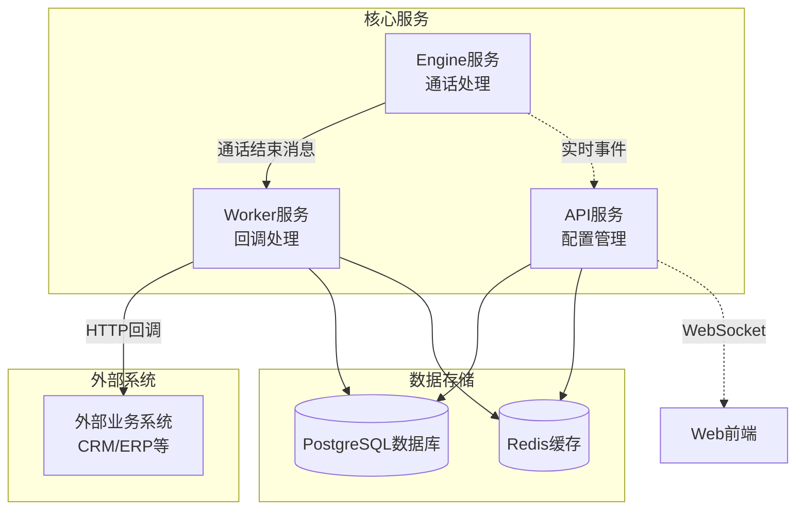
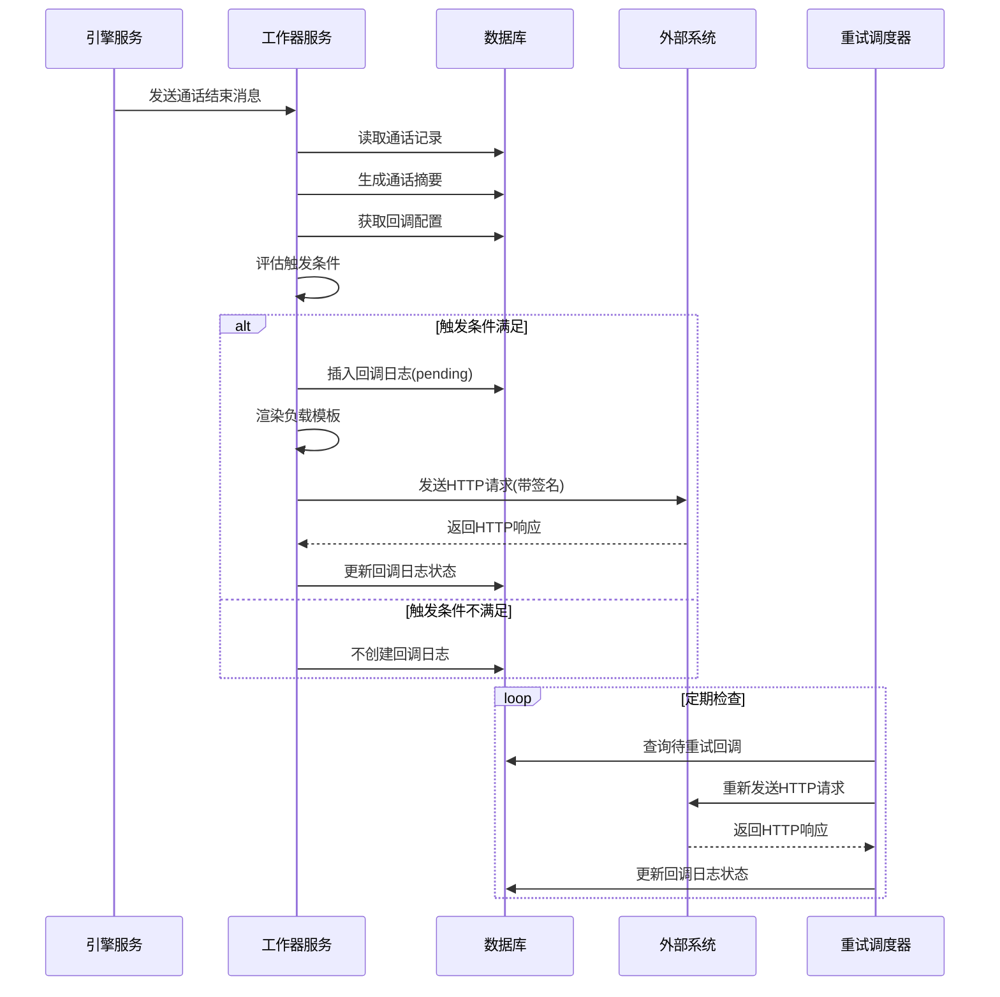
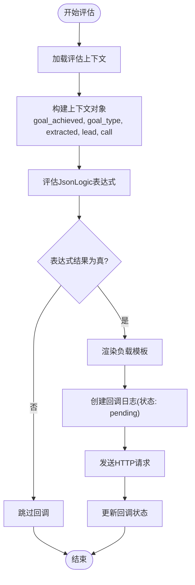
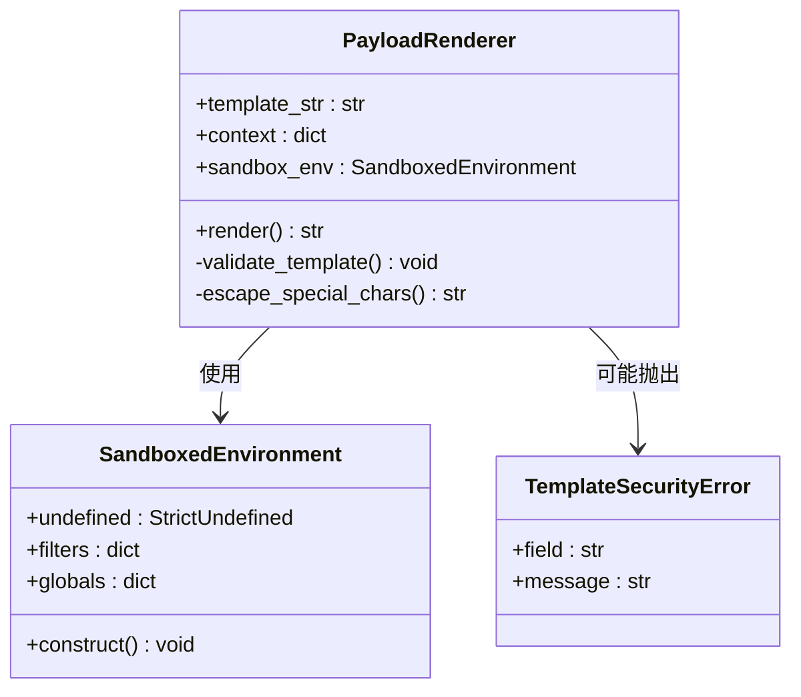
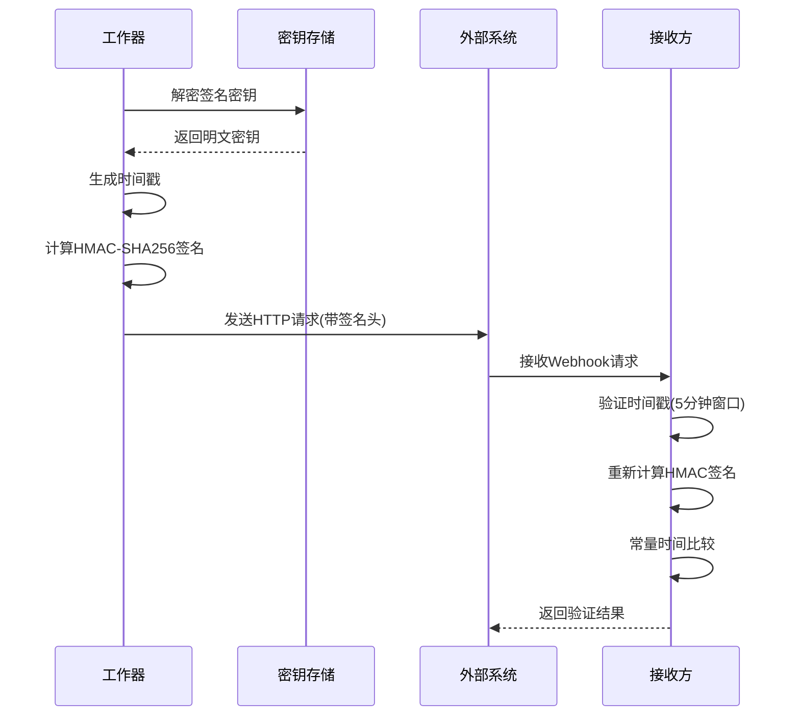
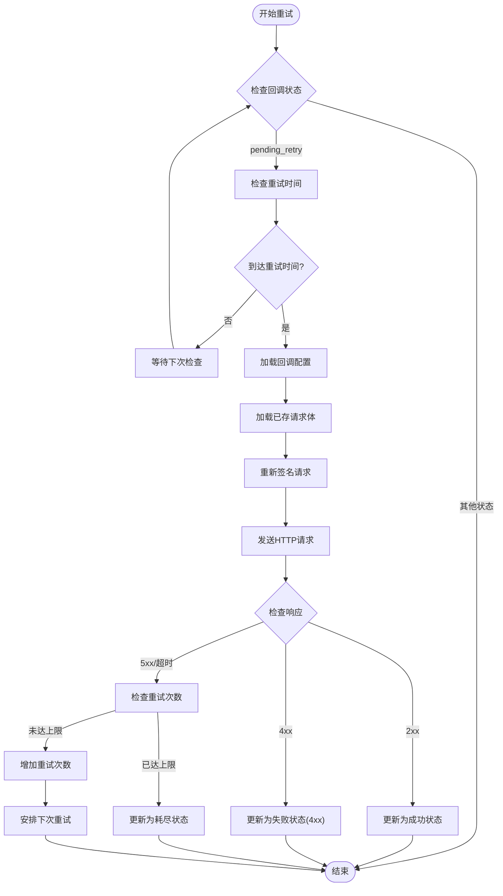
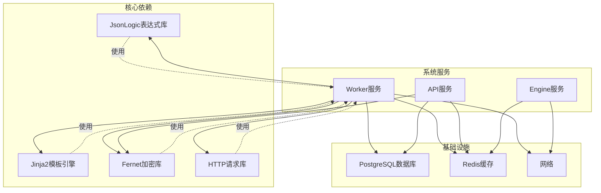

# Webhook回调机制

<cite>
**本文档引用的文件**
- [webhook-callback规范.md](file://openspec/specs/webhook-callback/spec.md)
- [数据模型规范.md](file://openspec/specs/data-model/spec.md)
- [服务通信规范.md](file://openspec/specs/service-communication/spec.md)
- [人类转人工规范.md](file://openspec/specs/human-handoff/spec.md)
- [worker实现提案.md](file://openspec/changes/archive/2026-05-06-impl-worker/proposal.md)
- [worker实现任务.md](file://openspec/changes/archive/2026-05-06-impl-worker/tasks.md)
- [provider-credential规范.md](file://openspec/changes/archive/2026-05-24-impl-provider-credential-db-ssot/specs/provider-credential/spec.md)
- [web实现增强规范.md](file://openspec/changes/archive/2026-05-08-impl-web-polish/specs/webhook-callback/spec.md)
</cite>

## 目录
1. [简介](#简介)
2. [项目结构](#项目结构)
3. [核心组件](#核心组件)
4. [架构概览](#架构概览)
5. [详细组件分析](#详细组件分析)
6. [依赖关系分析](#依赖关系分析)
7. [性能考虑](#性能考虑)
8. [故障排查指南](#故障排查指南)
9. [结论](#结论)
10. [附录](#附录)

## 简介

iSales系统的Webhook回调机制是一个关键的异步事件通知系统，用于在通话结束后向外部业务系统发送实时状态更新。该机制基于JsonLogic表达式触发条件、Jinja2沙盒模板渲染、HMAC-SHA256签名验证和指数退避重试策略，确保了回调的可靠性、安全性和可追溯性。

系统通过worker服务监听engine发出的通话结束消息，在完成通话摘要生成和状态判定后，根据预设的触发条件评估是否需要发送Webhook回调。整个过程完全异步，不影响主业务流程的执行。

## 项目结构

Webhook回调机制涉及多个关键组件和文件：

**图表来源**
- [服务通信规范.md:11-24](file://openspec/specs/service-communication/spec.md#L11-L24)
- [worker实现提案.md:12-16](file://openspec/changes/archive/2026-05-06-impl-worker/proposal.md#L12-L16)

**章节来源**
- [服务通信规范.md:1-150](file://openspec/specs/service-communication/spec.md#L1-L150)
- [数据模型规范.md:25-51](file://openspec/specs/data-model/spec.md#L25-L51)

## 核心组件

### 回调配置表(callback_config)

回调配置表存储了Webhook的所有配置信息，包括触发条件、目标URL、请求方法、请求头、负载模板等关键字段。

| 字段名称 | 数据类型 | 描述 | 约束 |
|---------|---------|------|------|
| trigger | JSONB | JsonLogic表达式，定义触发条件 | 必填，合法JsonLogic |
| url | text | Webhook目标URL | 必填，有效URL |
| method | enum | HTTP方法 | 必填，POST/PUT/PATCH等 |
| headers | JSONB | 额外请求头 | 可选 |
| payload_template | text | Jinja2模板字符串 | 必填，合法模板 |
| retry_policy | JSONB | 重试策略配置 | 必填 |
| signing_secret | text | 加密的签名密钥 | 必填，Fernet加密 |
| timeout_seconds | int | 超时时间(秒) | 可选 |
| enabled | bool | 是否启用 | 必填 |

### 回调日志表(callback_log)

回调日志表记录了每次Webhook调用的完整生命周期，包括状态跟踪、错误信息和重试历史。

| 字段名称 | 数据类型 | 描述 |
|---------|---------|------|
| status | enum | 回调状态：pending/success/failed_render/failed_http_4xx/failed_http_5xx/pending_retry/exhausted |
| request_body | text | HTTP请求体(已渲染) |
| response_code | int | HTTP响应码 |
| response_body | text | HTTP响应体 |
| retry_count | int | 重试次数 |
| attempt_at | timestamp | 首次尝试时间 |
| next_retry_at | timestamp | 下次重试时间 |
| error_message | text | 错误信息 |

**章节来源**
- [数据模型规范.md:44-45](file://openspec/specs/data-model/spec.md#L44-L45)
- [webhook-callback规范.md:210-231](file://openspec/specs/webhook-callback/spec.md#L210-L231)

## 架构概览

Webhook回调机制采用事件驱动的异步架构，通过消息队列实现服务间的解耦。

**图表来源**
- [worker实现提案.md:25-39](file://openspec/changes/archive/2026-05-06-impl-worker/proposal.md#L25-L39)
- [worker实现任务.md:42-49](file://openspec/changes/archive/2026-05-06-impl-worker/tasks.md#L42-L49)

## 详细组件分析

### 触发条件评估系统

触发条件评估系统基于JsonLogic表达式语言，支持复杂的业务逻辑判断。

**图表来源**
- [worker实现任务.md:31-38](file://openspec/changes/archive/2026-05-06-impl-worker/tasks.md#L31-L38)

触发条件支持的字段范围包括：
- `goal_achieved`, `goal_type`：来自通话摘要
- `extracted.*`：来自通话摘要的提取字段
- `lead.name`, `lead.phone`, `lead.source`, `lead.status`, `lead.custom_data.*`：来自潜在客户表
- `call.duration`, `call.started_at`, `call.transfer_status`, `call.hangup_cause`：来自通话记录

**章节来源**
- [webhook-callback规范.md:19-41](file://openspec/specs/webhook-callback/spec.md#L19-L41)
- [worker实现任务.md:32-34](file://openspec/changes/archive/2026-05-06-impl-worker/tasks.md#L32-L34)

### 负载模板渲染系统

负载模板系统使用Jinja2沙盒环境，确保模板渲染的安全性和可控性。

**图表来源**
- [worker实现任务.md:35-36](file://openspec/changes/archive/2026-05-06-impl-worker/tasks.md#L35-L36)

模板渲染特性：
- 使用沙盒环境，禁用文件IO、导入等危险操作
- 支持常用的JSON转换过滤器
- 严格的未定义变量处理
- 模板语法错误的精确报告

**章节来源**
- [webhook-callback规范.md:47-67](file://openspec/specs/webhook-callback/spec.md#L47-L67)
- [worker实现任务.md:35-36](file://openspec/changes/archive/2026-05-06-impl-worker/tasks.md#L35-L36)

### 签名验证系统

签名验证系统确保Webhook请求的完整性和真实性，防止中间人攻击和重放攻击。

**图表来源**
- [provider-credential规范.md:160-165](file://openspec/changes/archive/2026-05-24-impl-provider-credential-db-ssot/specs/provider-credential/spec.md#L160-L165)

签名验证要求：
- 时间戳验证：与当前时间偏差小于5分钟
- 签名算法：HMAC-SHA256
- 请求头格式：`X-Isales-Signature`、`X-Isales-Timestamp`、`Content-Type`
- 签名内容：`<timestamp>.<body_bytes>`

**章节来源**
- [webhook-callback规范.md:68-99](file://openspec/specs/webhook-callback/spec.md#L68-L99)
- [provider-credential规范.md:137-165](file://openspec/changes/archive/2026-05-24-impl-provider-credential-db-ssot/specs/provider-credential/spec.md#L137-L165)

### 重试策略系统

重试策略系统采用指数退避算法，确保在网络不稳定情况下的可靠性。

**图表来源**
- [worker实现任务.md:42-49](file://openspec/changes/archive/2026-05-06-impl-worker/tasks.md#L42-L49)

重试策略配置：
- 指数退避间隔：`[60, 300, 1800]`秒
- 最大重试次数：3次
- 超时处理：使用配置的超时时间或全局默认值
- 重试调度：每分钟扫描一次待重试记录

**章节来源**
- [webhook-callback规范.md:100-133](file://openspec/specs/webhook-callback/spec.md#L100-L133)
- [worker实现提案.md:35-39](file://openspec/changes/archive/2026-05-06-impl-worker/proposal.md#L35-L39)

### 业务场景事件类型

Webhook回调支持多种业务场景的事件类型：

#### 通话结束事件
- **触发条件**：通话正常结束或异常结束
- **适用场景**：通话统计、客户跟进、销售漏斗更新
- **关键字段**：通话时长、结束原因、目标达成状态

#### 状态变更事件
- **触发条件**：潜在客户状态发生变化
- **适用场景**：CRM状态同步、营销活动跟踪
- **关键字段**：新状态、变更原因、变更时间

#### 人工转接事件
- **触发条件**：AI识别需要人工介入
- **适用场景**：客服转接、人工客服系统
- **关键字段**：转接原因、转接类型、转接时间

#### 勿打事件
- **触发条件**：潜在客户标记为勿打
- **适用场景**：合规管理、营销黑名单
- **关键字段**：勿打原因、生效时间、有效期

**章节来源**
- [human-handoff规范.md:45-67](file://openspec/specs/human-handoff/spec.md#L45-L67)
- [webhook-callback规范.md:42-46](file://openspec/specs/webhook-callback/spec.md#L42-L46)

## 依赖关系分析

Webhook回调机制涉及多个服务和组件的协作：

**图表来源**
- [worker实现任务.md:33-36](file://openspec/changes/archive/2026-05-06-impl-worker/tasks.md#L33-L36)
- [provider-credential规范.md:137-143](file://openspec/changes/archive/2026-05-24-impl-provider-credential-db-ssot/specs/provider-credential/spec.md#L137-L143)

**章节来源**
- [service-communication规范.md:78-86](file://openspec/specs/service-communication/spec.md#L78-L86)
- [data-model规范.md:75-83](file://openspec/specs/data-model/spec.md#L75-L83)

## 性能考虑

### 并发处理
- 使用异步并发处理多个回调配置
- 每个回调配置独立处理，互不阻塞
- 支持批量重试调度，提高处理效率

### 缓存策略
- Redis缓存用于消息队列和临时数据
- 数据库连接池优化查询性能
- 模板编译结果缓存减少重复计算

### 超时配置
- 支持每个回调配置独立的超时设置
- 全局默认超时值可配置
- 避免长时间阻塞影响整体性能

## 故障排查指南

### 常见问题诊断

#### 回调未触发
1. **检查触发条件**：验证JsonLogic表达式语法正确性
2. **验证上下文字段**：确认所需字段在通话记录中存在
3. **检查配置状态**：确认回调配置已启用且URL有效

#### 签名验证失败
1. **检查时间戳**：确认服务器时间同步，偏差不超过5分钟
2. **验证密钥配置**：确认使用正确的签名密钥
3. **检查请求头格式**：确认包含必需的签名头字段

#### 重试循环问题
1. **检查重试策略**：验证重试间隔和最大次数配置
2. **监控重试状态**：观察回调日志中的重试次数和状态变化
3. **检查网络连接**：确认外部系统可达性和响应时间

#### 模板渲染错误
1. **验证模板语法**：检查Jinja2模板的语法正确性
2. **检查变量引用**：确认模板中引用的变量在上下文中存在
3. **测试模板渲染**：使用验证API测试模板渲染效果

**章节来源**
- [webhook-callback规范.md:134-194](file://openspec/specs/webhook-callback/spec.md#L134-L194)
- [worker实现任务.md:39-40](file://openspec/changes/archive/2026-05-06-impl-worker/tasks.md#L39-L40)

## 结论

iSales系统的Webhook回调机制通过精心设计的架构和严格的规范，实现了高可靠性的异步事件通知系统。该机制的关键优势包括：

1. **安全性**：基于HMAC-SHA256的签名验证，防止篡改和重放攻击
2. **可靠性**：指数退避重试策略，确保网络不稳定时的稳定性
3. **灵活性**：JsonLogic表达式和Jinja2模板，支持复杂的业务逻辑和数据格式
4. **可观测性**：完整的回调日志记录，便于问题诊断和性能监控
5. **可扩展性**：模块化设计，易于添加新的触发条件和业务场景

该机制为iSales系统提供了强大的外部集成能力，能够与各种CRM、ERP和其他业务系统无缝对接，支持多样化的业务场景和复杂的集成需求。

## 附录

### API接口规范

#### 创建回调配置
- **方法**：POST `/api/callback-configs`
- **参数**：包含触发条件、目标URL、请求方法、负载模板等
- **返回**：包含一次性显示的明文密钥

#### 验证回调配置
- **方法**：POST `/callback-configs/validate`
- **参数**：触发条件、负载模板、示例上下文
- **返回**：验证结果和错误信息

#### 旋转密钥
- **方法**：POST `/callback-configs/{id}/rotate-secret`
- **参数**：回调配置ID
- **返回**：新的明文密钥（一次性）

### 最佳实践建议

1. **触发条件设计**
   - 使用简单的布尔表达式开始，逐步增加复杂度
   - 为每个触发条件添加清晰的注释说明
   - 定期审查和优化触发条件

2. **负载模板优化**
   - 使用必要的字段，避免冗余数据
   - 添加适当的错误处理和默认值
   - 测试模板在各种数据场景下的表现

3. **安全配置**
   - 定期旋转签名密钥
   - 限制回调配置的权限范围
   - 监控异常的回调请求

4. **性能优化**
   - 合理设置重试策略
   - 监控回调成功率和响应时间
   - 定期清理过期的回调日志