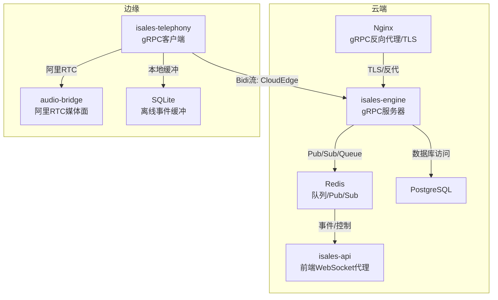
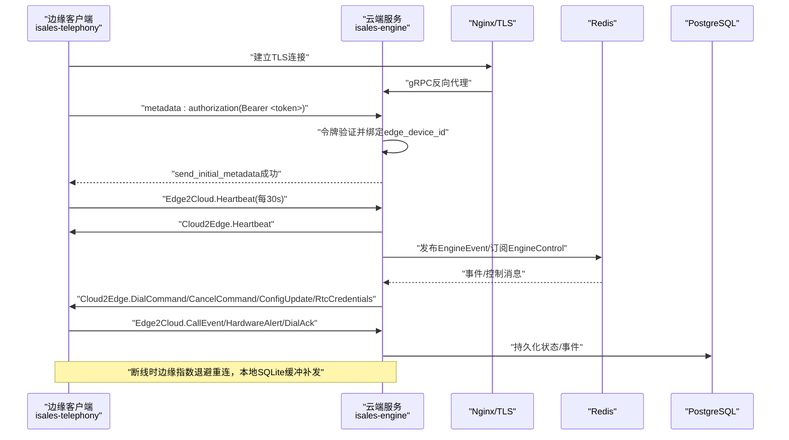
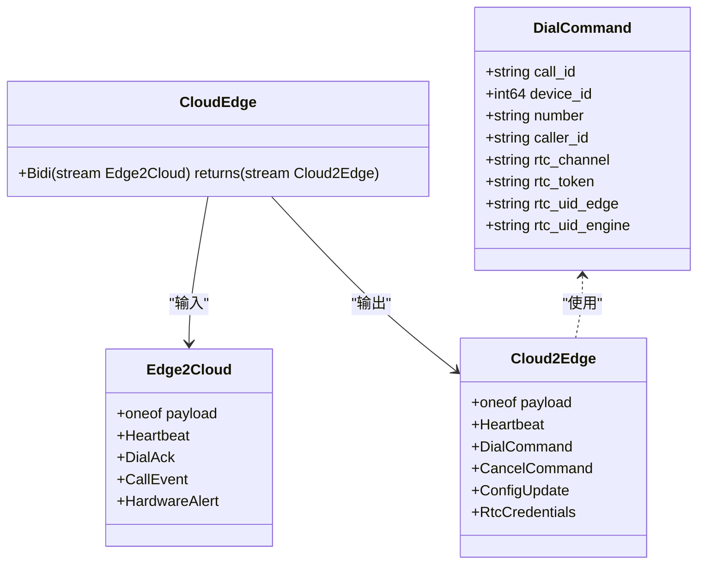
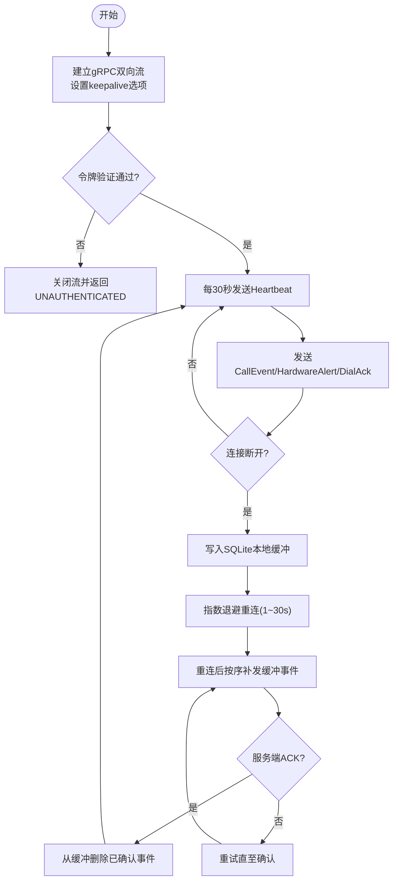
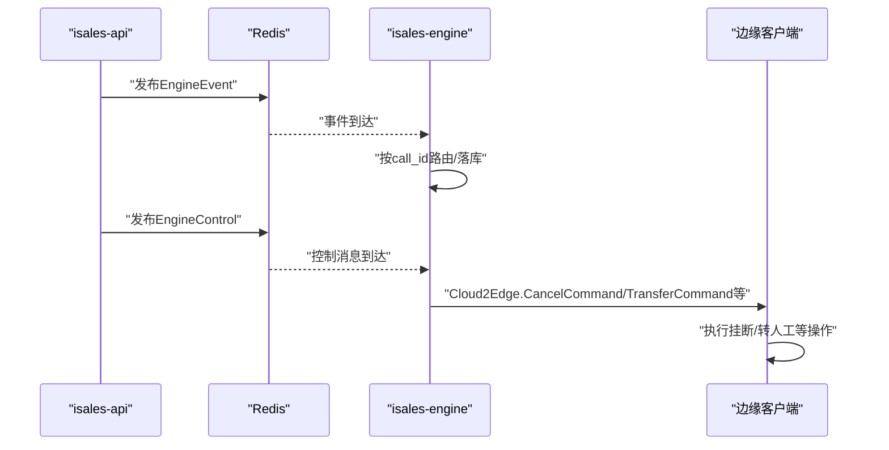
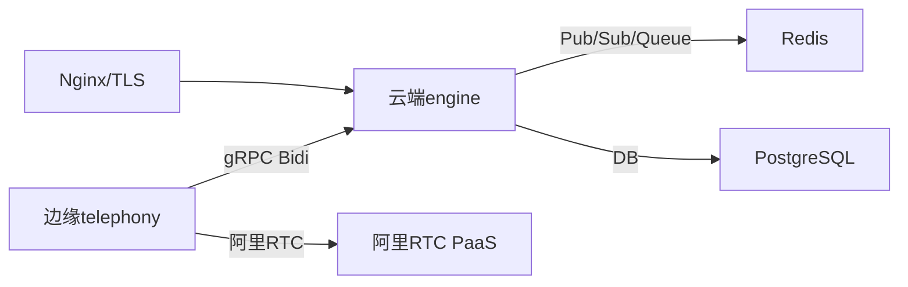

# gRPC服务接口

<cite>
**本文档引用的文件**
- [service-communication/spec.md](file://openspec/changes/arch-cloud-edge-split/specs/service-communication/spec.md)
- [cloud-edge-grpc-keepalive/spec.md](file://openspec/changes/cloud-edge-grpc-keepalive/specs/service-communication/spec.md)
- [design.md](file://openspec/changes/cloud-edge-grpc-keepalive/design.md)
- [STATE.md](file://deploy/cloud/STATE.md)
- [isales.conf](file://deploy/cloud/nginx/isales.conf)
</cite>

## 目录
1. [简介](#简介)
2. [项目结构](#项目结构)
3. [核心组件](#核心组件)
4. [架构总览](#架构总览)
5. [详细组件分析](#详细组件分析)
6. [依赖关系分析](#依赖关系分析)
7. [性能考虑](#性能考虑)
8. [故障排查指南](#故障排查指南)
9. [结论](#结论)

## 简介
本文件面向iSales系统在云-边分离架构下的gRPC服务接口，聚焦云-边控制面的双向流（bidirectional streaming）通信契约、消息格式与调用约定，覆盖EngineControl与EngineEvent等关键服务的交互方式。文档同时阐述连接管理、心跳与断线重连、负载均衡与故障转移、服务发现与通信安全保障，以及客户端实现要点与性能优化建议。

## 项目结构
围绕云-边gRPC通信，相关设计与实现分布在如下位置：
- 通信契约与消息模型：位于service-communication规格文件
- keepalive与idle-stream抗性增强：位于cloud-edge-grpc-keepalive规格与设计文档
- 运维与部署：位于deploy/cloud下的状态文档与nginx配置
- 客户端/服务端实现：位于isales-telephony与isales-engine（仓库中未直接提供源码，本文基于规格与部署文档进行接口说明）

**图表来源**
- [service-communication/spec.md:1-250](file://openspec/changes/arch-cloud-edge-split/specs/service-communication/spec.md#L1-L250)
- [isales.conf:80-102](file://deploy/cloud/nginx/isales.conf#L80-L102)

**章节来源**
- [service-communication/spec.md:1-250](file://openspec/changes/arch-cloud-edge-split/specs/service-communication/spec.md#L1-L250)

## 核心组件
- CloudEdge服务（云端gRPC服务器）
  - 服务入口：唯一的gRPC服务CloudEdge，采用HTTP/2 over TLS，双向流接口Bidi
  - 身份认证：通过gRPC元数据authorization携带Bearer令牌，服务端验证后将流绑定到具体edge_device_id
  - 心跳：边缘每30秒发送Heartbeat，云端回传并更新watchdog状态
  - 事件路由：CallEvent/HardwareAlert/DialAck按call_id路由至会话分发器，落库
  - 命令下发：云端向边缘下发DialCommand/CancelCommand/ConfigUpdate/RtcCredentials
- 边缘gRPC客户端（isales-telephony）
  - 长连接双向流：维持云端到边缘的长连接，指数退避自动重连
  - 本地缓冲：断线期间CallEvent/HardwareAlert写入SQLite顺序缓冲，重连后按序补发
  - 心跳：每30秒发送Heartbeat，接收云端回包
  - 令牌：在metadata中携带authorization: Bearer <EDGE_DEVICE_TOKEN>
- 通信通道矩阵
  - 云内：Redis Queue/Pub/Sub用于工作派发与事件广播
  - 云-边：CloudEdge gRPC双向流承载拨号/挂断/事件/硬件告警/RTC凭证/心跳
  - 媒体会面：阿里RTC PaaS承载PCM双向音频流

**章节来源**
- [service-communication/spec.md:95-214](file://openspec/changes/arch-cloud-edge-split/specs/service-communication/spec.md#L95-L214)
- [STATE.md:471-525](file://deploy/cloud/STATE.md#L471-L525)

## 架构总览
云-边控制面采用gRPC双向流承载控制消息，媒体面通过阿里RTC PaaS承载音频。云端engine负责令牌验证、心跳监控、事件路由与命令下发；边缘telephony负责长连接维护、本地缓冲与媒体桥接。

**图表来源**
- [service-communication/spec.md:95-214](file://openspec/changes/arch-cloud-edge-split/specs/service-communication/spec.md#L95-L214)
- [isales.conf:80-102](file://deploy/cloud/nginx/isales.conf#L80-L102)

## 详细组件分析

### CloudEdge服务（云端gRPC服务器）
- 服务定义与消息格式
  - 服务：CloudEdge，rpc Bidi(stream Edge2Cloud) returns (stream Cloud2Edge)
  - Edge2Cloud载荷：Heartbeat、DialAck、CallEvent、HardwareAlert
  - Cloud2Edge载荷：Heartbeat、DialCommand、CancelCommand、ConfigUpdate、RtcCredentials
  - DialCommand字段：call_id、device_id、number、caller_id、rtc_channel、rtc_token、rtc_uid_edge、rtc_uid_engine
- 身份认证与令牌
  - 客户端在gRPC元数据authorization中携带Bearer <EDGE_DEVICE_TOKEN>
  - 服务端验证失败返回UNAUTHENTICATED并关闭流
- 心跳与watchdog
  - 边缘每30秒发送Heartbeat，云端回传并在120秒无心跳后标记设备为offline
- 事件路由与落库
  - CallEvent/HardwareAlert/DialAck按call_id路由至会话分发器，落PG
- 命令下发
  - DialCommand/CancelCommand/ConfigUpdate/RtcCredentials由云端发起，边缘执行

**图表来源**
- [service-communication/spec.md:101-145](file://openspec/changes/arch-cloud-edge-split/specs/service-communication/spec.md#L101-L145)

**章节来源**
- [service-communication/spec.md:95-214](file://openspec/changes/arch-cloud-edge-split/specs/service-communication/spec.md#L95-L214)

### 边缘gRPC客户端（isales-telephony）
- 连接管理与自动重连
  - 使用grpc.aio.insecure_channel(endpoint, options=...)创建通道，启用keepalive参数
  - 指数退避重连：初始1秒，上限30秒，无限重试
- keepalive与idle-stream抗性
  - 客户端与服务端对称配置HTTP/2 keepalive，避免被中间网络层（如阿里云SLB/NAT）因空闲而断开
  - 服务端max_ping_strikes=0，不主动踢出频繁ping的客户端
- 本地缓冲与补发
  - 断线期间CallEvent/HardwareAlert写入SQLite顺序缓冲，重连后按序补发并显式ACK后删除
- 心跳与令牌
  - 每30秒发送Heartbeat；metadata携带authorization: Bearer <EDGE_DEVICE_TOKEN>
- 日志与可观测性
  - 建立流后打印INFO日志cloud_edge_stream_connected；服务端打印cloud_edge_stream_opened

**图表来源**
- [cloud-edge-grpc-keepalive/spec.md:17-46](file://openspec/changes/cloud-edge-grpc-keepalive/specs/service-communication/spec.md#L17-L46)
- [design.md:80-95](file://openspec/changes/cloud-edge-grpc-keepalive/design.md#L80-L95)
- [STATE.md:471-525](file://deploy/cloud/STATE.md#L471-L525)

**章节来源**
- [cloud-edge-grpc-keepalive/spec.md:1-57](file://openspec/changes/cloud-edge-grpc-keepalive/specs/service-communication/spec.md#L1-L57)
- [design.md:1-95](file://openspec/changes/cloud-edge-grpc-keepalive/design.md#L1-L95)
- [STATE.md:471-525](file://deploy/cloud/STATE.md#L471-L525)

### EngineControl与EngineEvent集成
- EngineEvent发布（云端）
  - fire-and-forget发布，失败仅记录警告，不影响通话主路径
  - 通过Redis Pub/Sub发布到engine:events:campaign:{campaign_id}
- EngineControl消费（云端）
  - 单任务PSUBSCRIBE engine:control:campaign:*，反序列化为EngineControl，按call_id派发至SessionManager
  - 不存在call_id时记录警告并静默丢弃
- 云-边映射
  - 云内Pub/Sub消息不直接跨云-边转发，需由engine内部分发器转译为Cloud2Edge.CancelCommand等protobuf消息，经gRPC下发至边缘

**图表来源**
- [service-communication/spec.md:9-14](file://openspec/changes/arch-cloud-edge-split/specs/service-communication/spec.md#L9-L14)
- [service-communication/spec.md:147-166](file://openspec/changes/arch-cloud-edge-split/specs/service-communication/spec.md#L147-L166)

**章节来源**
- [service-communication/spec.md:9-14](file://openspec/changes/arch-cloud-edge-split/specs/service-communication/spec.md#L9-L14)
- [service-communication/spec.md:147-166](file://openspec/changes/arch-cloud-edge-split/specs/service-communication/spec.md#L147-L166)

## 依赖关系分析
- 通信通道矩阵
  - 云内：Redis Queue（工作派发）、Redis Pub/Sub（事件广播）
  - 云-边：CloudEdge gRPC双向流（控制消息）、阿里RTC PaaS（音频媒体）
  - 云内：PostgreSQL/Redis（数据与缓存）
- 服务间耦合
  - engine依赖redis/pubsub进行事件/控制流转，依赖pg进行状态持久化
  - telephony依赖sqlite进行断线缓冲，依赖nginx进行TLS与反向代理
- 外部依赖
  - grpcio内置HTTP/2 keepalive支持
  - 阿里RTC SDK（Linux/macOS Python版）

**图表来源**
- [service-communication/spec.md:1-22](file://openspec/changes/arch-cloud-edge-split/specs/service-communication/spec.md#L1-L22)
- [isales.conf:80-102](file://deploy/cloud/nginx/isales.conf#L80-L102)

**章节来源**
- [service-communication/spec.md:1-22](file://openspec/changes/arch-cloud-edge-split/specs/service-communication/spec.md#L1-L22)

## 性能考虑
- keepalive与idle-stream抗性
  - 客户端与服务端对称配置keepalive参数，避免被中间网络层因空闲而断开
  - 服务端max_ping_strikes=0，允许客户端30秒周期的频繁ping而不主动踢流
- 连接与重连
  - 指数退避重连（1~30秒），降低网络抖动引发的风暴
  - 本地SQLite缓冲确保断线期间事件有序补发，减少云端重试压力
- 超时与反向代理
  - Nginx对gRPC设置较长读写超时（3600s），适配30秒心跳周期
- 令牌验证与鉴权
  - 令牌验证失败直接返回UNAUTHENTICATED，避免无效流量进入云端处理链
- 媒体会面
  - 媒体面与控制面分离，控制面gRPC承载指令，媒体面通过阿里RTC PaaS承载音频，降低控制面压力

**章节来源**
- [cloud-edge-grpc-keepalive/spec.md:17-46](file://openspec/changes/cloud-edge-grpc-keepalive/specs/service-communication/spec.md#L17-L46)
- [design.md:127-152](file://openspec/changes/cloud-edge-grpc-keepalive/design.md#L127-L152)
- [isales.conf:80-102](file://deploy/cloud/nginx/isales.conf#L80-L102)

## 故障排查指南
- 常见问题定位
  - 断流后teardown阶段出现cloud_edge_stream_error为正常关闭序列现象，非bug
  - 边缘到ECS 50051在握手后极短时间内被切断，疑似中间网络层stateful idle-cleanup
- 诊断信号
  - 客户端INFO日志cloud_edge_stream_connected：确认流真正上线
  - 服务端INFO日志cloud_edge_stream_opened：确认流建立成功
- 排障步骤
  - 确认TCP可达与HTTP/2建立成功
  - 检查阿里云安全组与SLB配置，确保50051端口无stateful idle清理
  - 使用脚本进行soak测试，观察流存活时间分布
- 运维建议
  - 在RUNBOOK中明确“30s ping≠高频RPC”的概念
  - 若中间层仍拦截keepalive，需在控制台侧调整（如开启长连接白名单）

**章节来源**
- [STATE.md:471-525](file://deploy/cloud/STATE.md#L471-L525)
- [cloud-edge-grpc-keepalive/spec.md:48-57](file://openspec/changes/cloud-edge-grpc-keepalive/specs/service-communication/spec.md#L48-L57)
- [design.md:127-152](file://openspec/changes/cloud-edge-grpc-keepalive/design.md#L127-L152)

## 结论
iSales云-边控制面通过CloudEdge gRPC双向流实现高可靠、低延迟的控制消息通道，结合keepalive与idle-stream抗性、指数退避重连与本地缓冲机制，满足商用环境下复杂网络条件下的稳定性需求。配合阿里RTC PaaS的媒体面与云内Redis/PG的数据通道，形成完整的云-边一体化通信体系。建议在生产部署中严格遵循令牌验证、超时配置与中间层网络策略，持续通过soak测试验证流稳定性。