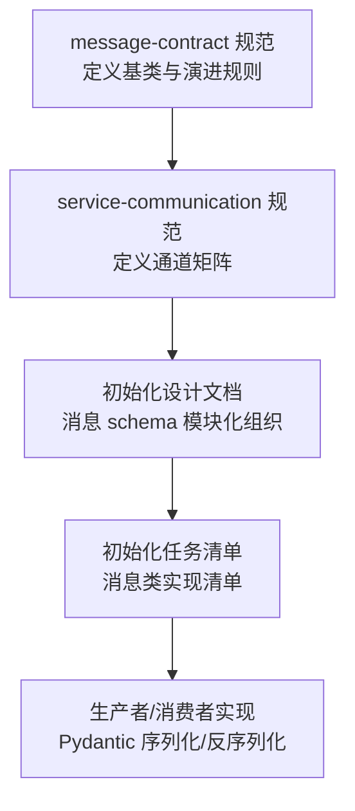
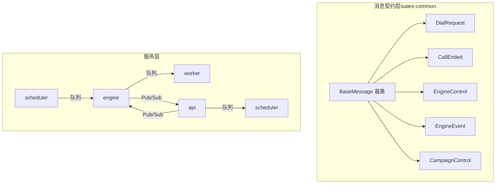
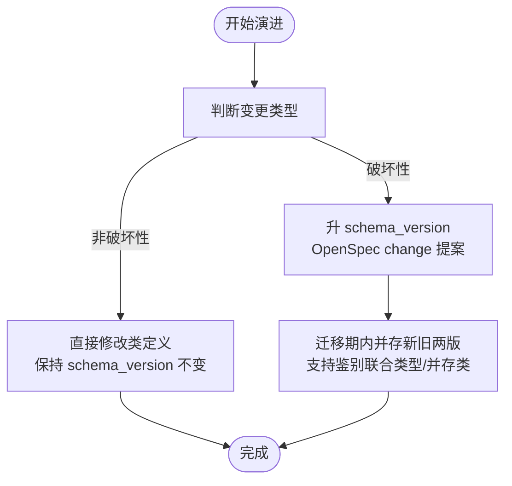
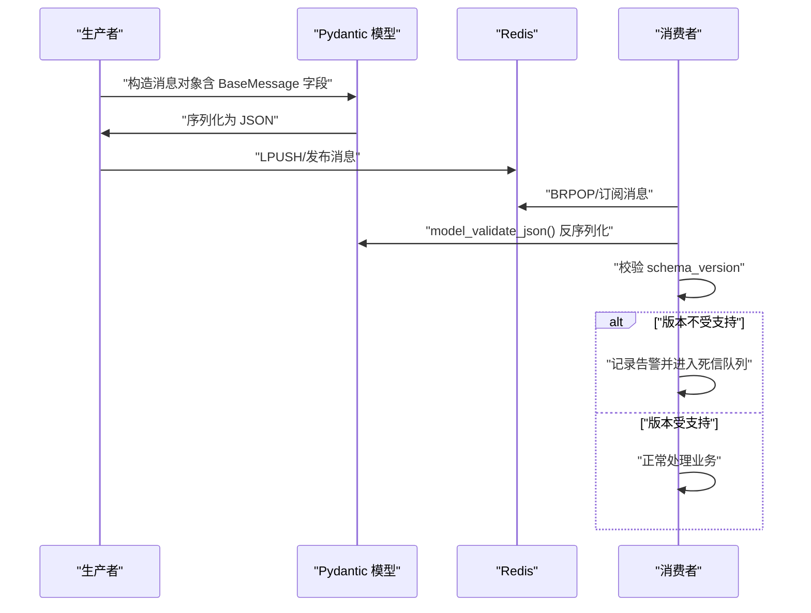
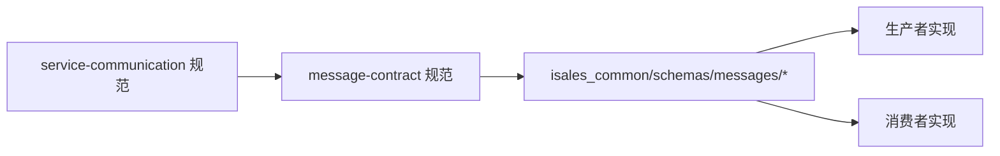

# 消息契约规范

<cite>
**本文档引用的文件**
- [message-contract 规范](file://openspec/specs/message-contract/spec.md)
- [service-communication 规范](file://openspec/specs/service-communication/spec.md)
- [init-isales-common 设计文档](file://openspec/changes/archive/2026-05-01-init-isales-common/design.md)
- [init-isales-common 任务清单](file://openspec/changes/archive/2026-05-01-init-isales-common/tasks.md)
</cite>

## 目录
1. [引言](#引言)
2. [项目结构](#项目结构)
3. [核心组件](#核心组件)
4. [架构总览](#架构总览)
5. [详细组件分析](#详细组件分析)
6. [依赖分析](#依赖分析)
7. [性能考虑](#性能考虑)
8. [故障排查指南](#故障排查指南)
9. [结论](#结论)
10. [附录](#附录)

## 引言
本文件为 iSales 系统跨服务消息契约的权威文档，聚焦于统一的 Pydantic 消息模型设计与演进规则，确保服务间通信的一致性、可观测性与可维护性。文档基于 OpenSpec 规范与初始化实现任务清单，系统阐述 BaseMessage 基类字段规范、消息类定义与继承关系、版本演进策略、序列化与反序列化流程，以及 Pydantic 验证机制与可观测性设计。

## 项目结构
消息契约相关的内容主要分布在以下位置：
- openspec/specs/message-contract/spec.md：消息契约规范，定义统一基类、字段要求、演进规则与序列化/可观测性要求
- openspec/specs/service-communication/spec.md：服务间通信通道矩阵，明确哪些通道含消息体及通信协议
- openspec/changes/archive/2026-05-01-init-isales-common/design.md：初始化实现设计，给出消息 schema 的模块化组织与落地策略
- openspec/changes/archive/2026-05-01-init-isales-common/tasks.md：初始化任务清单，列出消息 schema 的具体实现项

**图表来源**
- [message-contract 规范:1-85](file://openspec/specs/message-contract/spec.md#L1-L85)
- [service-communication 规范:1-150](file://openspec/specs/service-communication/spec.md#L1-L150)
- [init-isales-common 设计文档:78-86](file://openspec/changes/archive/2026-05-01-init-isales-common/design.md#L78-L86)
- [init-isales-common 任务清单:68-78](file://openspec/changes/archive/2026-05-01-init-isales-common/tasks.md#L68-L78)

**章节来源**
- [message-contract 规范:1-85](file://openspec/specs/message-contract/spec.md#L1-L85)
- [service-communication 规范:1-150](file://openspec/specs/service-communication/spec.md#L1-L150)
- [init-isales-common 设计文档:78-86](file://openspec/changes/archive/2026-05-01-init-isales-common/design.md#L78-L86)
- [init-isales-common 任务清单:68-78](file://openspec/changes/archive/2026-05-01-init-isales-common/tasks.md#L68-L78)

## 核心组件
本节聚焦 BaseMessage 基类与关键字段，以及消息类的继承关系与版本演进规则。

- BaseMessage 基类字段
  - schema_version: int，默认 1；破坏性升级时 +1
  - message_id: UUID，由生产者生成，用于追踪与去重
  - created_at: datetime，生产者时间戳
  - __str__: 提供便于日志输出的字符串表示（包含 message_id 与类名）

- 消息类继承关系（v1 必备）
  - DialRequest：scheduler → engine 队列，携带 lead 信息、历史摘要、prompt_versions 快照与 caller_id
  - CallEnded：engine → worker 队列，携带 call_record_id 与终止原因
  - EngineControl：api → engine Pub/Sub，手动挂断/转人工指令（鉴别联合类型）
  - EngineEvent：engine → api Pub/Sub，状态变更/ASR 文本/转写增量（鉴别联合类型）
  - CampaignControl：api → scheduler 队列，启动/暂停 campaign

- 版本演进规则
  - 非破坏性变更：新增可选字段（带默认值）且老消费者忽略不影响业务，可直接修改类定义，不升 schema_version
  - 破坏性变更：删除字段、改字段类型/语义、新增必填字段，需在 OpenSpec change 中明确影响范围，升 schema_version，并在迁移期内同时支持新旧两版反序列化

**章节来源**
- [message-contract 规范:25-66](file://openspec/specs/message-contract/spec.md#L25-L66)
- [service-communication 规范:11-24](file://openspec/specs/service-communication/spec.md#L11-L24)
- [init-isales-common 设计文档:78-86](file://openspec/changes/archive/2026-05-01-init-isales-common/design.md#L78-L86)
- [init-isales-common 任务清单:68-78](file://openspec/changes/archive/2026-05-01-init-isales-common/tasks.md#L68-L78)

## 架构总览
消息契约在系统中的作用是“消息形状的单一来源”，确保跨服务通信的一致性与可追踪性。生产者与消费者均依赖 isales-common 的 Pydantic 模型进行序列化与反序列化，避免散落定义与裸 dict。

**图表来源**
- [service-communication 规范:11-24](file://openspec/specs/service-communication/spec.md#L11-L24)
- [init-isales-common 任务清单:68-78](file://openspec/changes/archive/2026-05-01-init-isales-common/tasks.md#L68-L78)

## 详细组件分析

### BaseMessage 基类设计
- 字段职责
  - schema_version：版本控制，破坏性变更时递增
  - message_id：唯一标识，便于跨服务追踪与幂等处理
  - created_at：生产时间戳，便于审计与排序
  - __str__：统一日志输出格式，便于跨服务串联排查

- 默认值与工厂
  - schema_version 默认 1
  - message_id 使用 UUID 工厂函数生成
  - created_at 使用 UTC 时间工厂函数生成

- 可观测性
  - 基类提供 __str__，关键日志应包含 message_id，便于 grep 串联链路

**章节来源**
- [message-contract 规范:25-38](file://openspec/specs/message-contract/spec.md#L25-L38)
- [init-isales-common 任务清单:68-71](file://openspec/changes/archive/2026-05-01-init-isales-common/tasks.md#L68-L71)

### DialRequest（调度器 → 引擎）
- 用途：派发拨号任务，携带 lead 信息、历史摘要、prompt_versions 快照与 caller_id
- 传输通道：Redis 队列（可靠投递）
- 生产者/消费者：scheduler → engine

**章节来源**
- [message-contract 规范:43-51](file://openspec/specs/message-contract/spec.md#L43-L51)
- [service-communication 规范:11-14](file://openspec/specs/service-communication/spec.md#L11-L14)

### CallEnded（引擎 → 工人）
- 用途：通话结束后通知工人处理后续流程
- 传输通道：Redis 队列（可靠投递）
- 生产者/消费者：engine → worker

**章节来源**
- [message-contract 规范:43-51](file://openspec/specs/message-contract/spec.md#L43-L51)
- [service-communication 规范:11-14](file://openspec/specs/service-communication/spec.md#L11-L14)

### EngineControl（API → 引擎）
- 用途：实时控制指令（手动挂断、转人工）
- 传输通道：Redis Pub/Sub（实时、可丢失）
- 生产者/消费者：api → engine
- 结构：鉴别联合类型，支持多种子类型

**章节来源**
- [message-contract 规范:43-51](file://openspec/specs/message-contract/spec.md#L43-L51)
- [service-communication 规范:11-16](file://openspec/specs/service-communication/spec.md#L11-L16)

### EngineEvent（引擎 → API）
- 用途：通话事件推送（状态变更、ASR 文本、转写增量等）
- 传输通道：Redis Pub/Sub（实时、可丢失）
- 生产者/消费者：engine → api
- 结构：鉴别联合类型，包含多种事件子类型

**章节来源**
- [message-contract 规范:43-51](file://openspec/specs/message-contract/spec.md#L43-L51)
- [service-communication 规范:11-16](file://openspec/specs/service-communication/spec.md#L11-L16)

### CampaignControl（API → 调度器）
- 用途：启动/暂停 campaign
- 传输通道：Redis 队列（可靠投递）
- 生产者/消费者：api → scheduler

**章节来源**
- [message-contract 规范:43-51](file://openspec/specs/message-contract/spec.md#L43-L51)
- [service-communication 规范:11-17](file://openspec/specs/service-communication/spec.md#L11-L17)

### 版本演进与破坏性变更判定
- 非破坏性变更
  - 新增可选字段（带默认值），老消费者忽略不影响业务
  - 可直接修改类定义并合入，不升 schema_version
- 破坏性变更
  - 删除字段、改字段类型/语义、新增必填字段
  - 需在 OpenSpec change 中明确影响范围，升 schema_version，并在迁移期内同时支持新旧两版反序列化（鉴别联合类型或并存类）

**图表来源**
- [message-contract 规范:53-66](file://openspec/specs/message-contract/spec.md#L53-L66)

**章节来源**
- [message-contract 规范:53-66](file://openspec/specs/message-contract/spec.md#L53-L66)

### 序列化与反序列化流程
- 生产者序列化
  - 使用 isales-common 的对应 Pydantic 类构造消息体
  - 调用模型的 JSON 序列化方法（默认 JSON）
- 消费者反序列化
  - 使用 isales-common 的对应类进行 JSON 反序列化
  - 校验 schema_version 是否在支持范围内，不支持则显式日志告警并按死信队列处理

**图表来源**
- [message-contract 规范:10-19](file://openspec/specs/message-contract/spec.md#L10-L19)
- [message-contract 规范:34-38](file://openspec/specs/message-contract/spec.md#L34-L38)

**章节来源**
- [message-contract 规范:10-19](file://openspec/specs/message-contract/spec.md#L10-L19)
- [message-contract 规范:34-38](file://openspec/specs/message-contract/spec.md#L34-L38)

### Pydantic 验证机制与可观测性设计
- Pydantic 验证
  - 消息类仅描述数据形状，不包含业务逻辑或外部依赖
  - 仅允许 Pydantic 的验证器/序列化器/计算字段，禁止直接发起网络调用或数据库操作
- 可观测性
  - 基类提供 __str__，关键日志应包含 message_id，便于跨服务排查
  - 建议生产者/消费者在关键路径打印包含 message_id 的日志，支持 grep 串联完整链路

**章节来源**
- [message-contract 规范:67-84](file://openspec/specs/message-contract/spec.md#L67-L84)
- [init-isales-common 设计文档:115-116](file://openspec/changes/archive/2026-05-01-init-isales-common/design.md#L115-L116)

## 依赖分析
- 通道矩阵覆盖
  - isales-common 的消息 schema 集合需覆盖 service-communication 规范中标注为“含消息体”的所有跨服务通道
  - 任何新增通信场景都必须同步新增对应消息类并通过 OpenSpec change 提案
- 模块化组织
  - 消息 schema 按通道分文件组织，便于维护与演进
  - 基类统一管理版本字段与通用行为

**图表来源**
- [service-communication 规范:39-42](file://openspec/specs/service-communication/spec.md#L39-L42)
- [message-contract 规范:20-24](file://openspec/specs/message-contract/spec.md#L20-L24)
- [init-isales-common 设计文档:78-86](file://openspec/changes/archive/2026-05-01-init-isales-common/design.md#L78-L86)

**章节来源**
- [service-communication 规范:39-42](file://openspec/specs/service-communication/spec.md#L39-L42)
- [message-contract 规范:20-24](file://openspec/specs/message-contract/spec.md#L20-L24)
- [init-isales-common 设计文档:78-86](file://openspec/changes/archive/2026-05-01-init-isales-common/design.md#L78-L86)

## 性能考虑
- 序列化格式
  - 建议 v1 全部使用 JSON（便于调试），后续按需优化
- 通道选择
  - 队列用于“必须送达，可异步处理”的工作派发
  - Pub/Sub 用于“实时、可丢失”的事件广播
- 并发控制
  - 跨引擎实例的全局并发使用 Redis 原子计数器，避免本地内存计数器替代

**章节来源**
- [service-communication 规范:147-150](file://openspec/specs/service-communication/spec.md#L147-L150)
- [service-communication 规范:31-47](file://openspec/specs/service-communication/spec.md#L31-L47)

## 故障排查指南
- 版本不兼容
  - 现象：消费者反序列化失败或版本不受支持
  - 处理：记录显式告警并进入死信队列，检查 schema_version 与 OpenSpec 变更记录
- 日志追踪
  - 现象：跨服务链路排查困难
  - 处理：确保关键日志包含 message_id，使用 grep 串联完整链路
- 通道误用
  - 现象：队列/ Pub/Sub 误用导致消息丢失或延迟
  - 处理：依据通道矩阵选择合适通道，队列用于可靠投递，Pub/Sub 用于实时广播

**章节来源**
- [message-contract 规范:34-38](file://openspec/specs/message-contract/spec.md#L34-L38)
- [message-contract 规范:76-84](file://openspec/specs/message-contract/spec.md#L76-L84)
- [service-communication 规范:31-47](file://openspec/specs/service-communication/spec.md#L31-L47)

## 结论
消息契约规范通过统一的 BaseMessage 基类与 Pydantic 模型，确保 iSales 系统跨服务通信的一致性、可观测性与可演进性。遵循非破坏性与破坏性变更的区分标准，配合严格的序列化/反序列化流程与可观测性设计，能够有效降低服务间耦合，提升系统稳定性与可维护性。

## 附录
- v1 必备消息类清单
  - DialRequest、CallEnded、EngineControl、EngineEvent、CampaignControl
- 通道矩阵要点
  - 队列用于可靠投递，Pub/Sub 用于实时广播
  - 任何新增通道需经 OpenSpec change 提案

**章节来源**
- [message-contract 规范:43-51](file://openspec/specs/message-contract/spec.md#L43-L51)
- [service-communication 规范:11-24](file://openspec/specs/service-communication/spec.md#L11-L24)