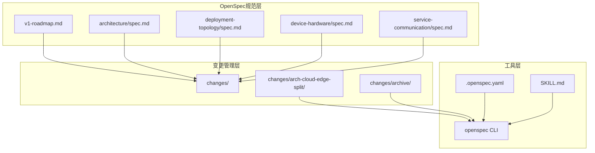
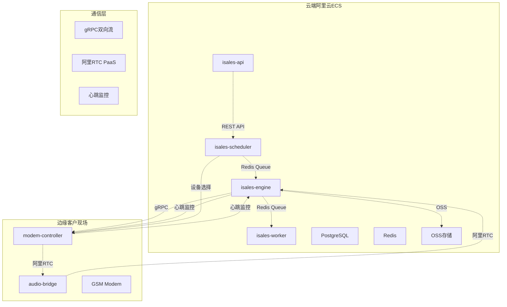
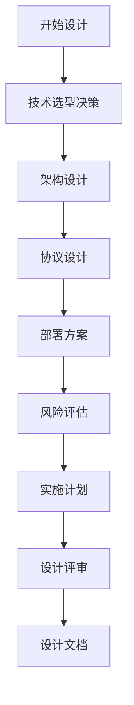
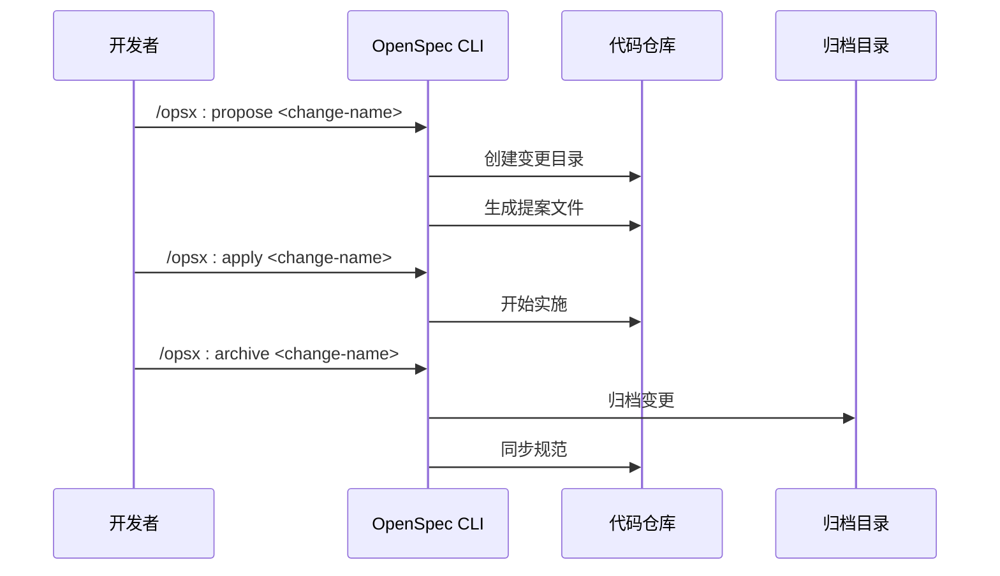
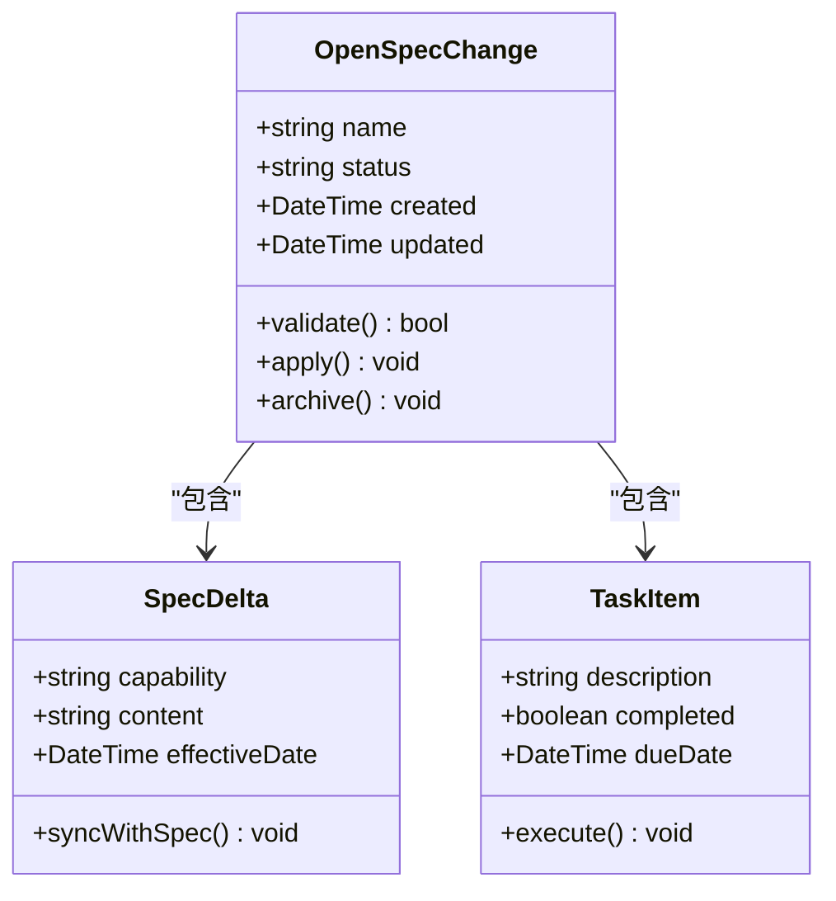
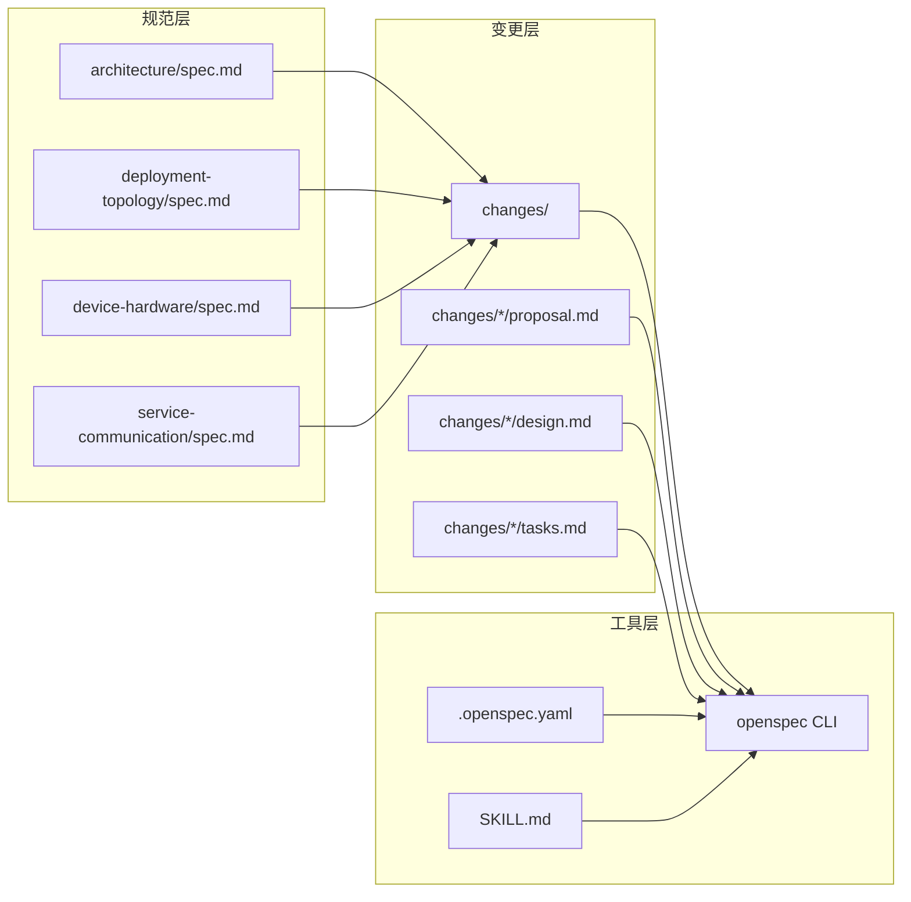
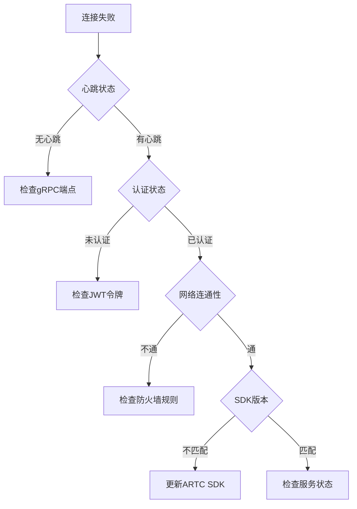
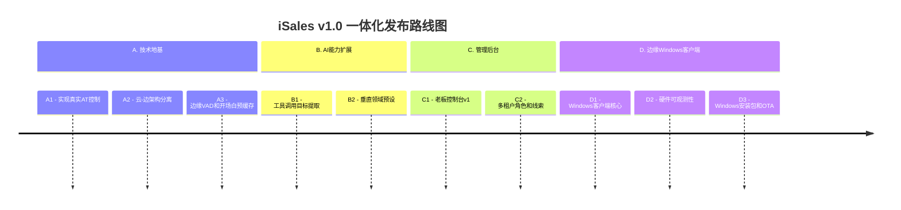
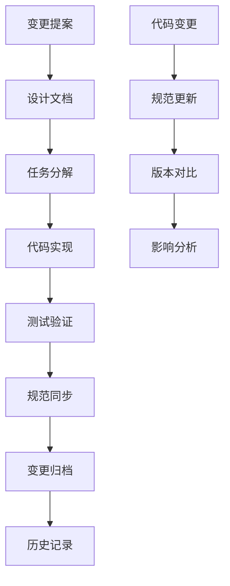

# OpenSpec变更管理

<cite>
**本文档引用的文件**
- [v1-roadmap.md](file://openspec/v1-roadmap.md)
- [v1-roadmap-a3-context.md](file://openspec/v1-roadmap-a3-context.md)
- [v1-roadmap-aliyun-rtc-poc.md](file://openspec/v1-roadmap-aliyun-rtc-poc.md)
- [v1-roadmap-aliyun-rtc-poc-result.md](file://openspec/v1-roadmap-aliyun-rtc-poc-result.md)
- [proposal.md](file://openspec/changes/arch-cloud-edge-split/proposal.md)
- [design.md](file://openspec/changes/arch-cloud-edge-split/design.md)
- [tasks.md](file://openspec/changes/arch-cloud-edge-split/tasks.md)
- [.openspec.yaml](file://openspec/changes/arch-cloud-edge-split/.openspec.yaml)
- [architecture/spec.md](file://openspec/specs/architecture/spec.md)
- [deployment-topology/spec.md](file://openspec/specs/deployment-topology/spec.md)
- [device-hardware/spec.md](file://openspec/specs/device-hardware/spec.md)
- [service-communication/spec.md](file://openspec/specs/service-communication/spec.md)
- [SKILL.md](file://.claude/skills/openspec-propose/SKILL.md)
- [README.md](file://README.md)
- [DESIGN.md](file://DESIGN.md)
</cite>

## 目录
1. [简介](#简介)
2. [项目结构](#项目结构)
3. [核心组件](#核心组件)
4. [架构概览](#架构概览)
5. [详细组件分析](#详细组件分析)
6. [依赖分析](#依赖分析)
7. [性能考虑](#性能考虑)
8. [故障排除指南](#故障排除指南)
9. [结论](#结论)
10. [附录](#附录)

## 简介

iSales的OpenSpec变更管理流程是一个基于规范驱动的系统化变更管理方法论。该方法论通过标准化的变更生命周期管理，确保系统架构的演进质量和可追溯性。

OpenSpec的核心理念是"规范先行，变更驱动"，通过严格的变更提案、设计、实施、归档流程，实现系统的有序演进。这种方法论特别适用于复杂的分布式系统，如iSales的云-边架构。

## 项目结构

iSales项目采用多仓库架构，通过OpenSpec规范实现统一的变更管理：



**图表来源**
- [v1-roadmap.md:1-576](file://openspec/v1-roadmap.md#L1-L576)
- [architecture/spec.md:1-168](file://openspec/specs/architecture/spec.md#L1-L168)

**章节来源**
- [v1-roadmap.md:1-576](file://openspec/v1-roadmap.md#L1-L576)
- [DESIGN.md:1-75](file://DESIGN.md#L1-L75)

## 核心组件

### OpenSpec变更生命周期

OpenSpec变更管理遵循严格的五阶段生命周期：

1. **提案阶段（Proposal）**：定义变更的动机、范围和预期成果
2. **设计阶段（Design）**：详细的技术设计方案和决策记录
3. **任务分解（Tasks）**：具体的实施步骤和验收标准
4. **实施阶段（Implementation）**：代码实现和测试验证
5. **归档阶段（Archive）**：规范同步和历史记录

### 规范驱动架构

系统通过多个核心规范定义架构边界：

- **架构规范**：定义7个仓库的职责边界和部署模型
- **部署拓扑规范**：规定单主机部署和云-边分离的部署策略
- **硬件规范**：USB GSM Modem的自研控制方案
- **服务通信规范**：定义7个服务间的通信通道矩阵

**章节来源**
- [architecture/spec.md:1-168](file://openspec/specs/architecture/spec.md#L1-L168)
- [deployment-topology/spec.md:1-414](file://openspec/specs/deployment-topology/spec.md#L1-L414)
- [device-hardware/spec.md:1-525](file://openspec/specs/device-hardware/spec.md#L1-L525)
- [service-communication/spec.md:1-150](file://openspec/specs/service-communication/spec.md#L1-L150)

## 架构概览

iSales采用云-边分离的架构模式，通过OpenSpec规范实现清晰的职责划分：



**图表来源**
- [v1-roadmap.md:456-491](file://openspec/v1-roadmap.md#L456-L491)
- [design.md:133-179](file://openspec/changes/arch-cloud-edge-split/design.md#L133-L179)

## 详细组件分析

### 变更提案流程

#### 提案起草（Proposal）

提案阶段需要回答三个核心问题：

1. **Why（为什么需要变更）**：明确变更的业务动机和技术背景
2. **What（变更内容）**：详细描述要实现的功能和影响范围
3. **Capabilities（涉及的能力）**：说明变更影响到的OpenSpec能力规范

以A2变更为例，提案明确了云-边分离的必要性和技术方案：

**章节来源**
- [proposal.md:1-77](file://openspec/changes/arch-cloud-edge-split/proposal.md#L1-L77)

#### 设计制定（Design）

设计阶段需要形成详细的技术方案和决策记录：



**图表来源**
- [design.md:42-248](file://openspec/changes/arch-cloud-edge-split/design.md#L42-L248)

#### 任务分配（Tasks）

任务分解阶段将设计转化为具体的实施步骤：

**章节来源**
- [tasks.md:1-135](file://openspec/changes/arch-cloud-edge-split/tasks.md#L1-L135)

### 变更规格编写规范

#### 规范结构

OpenSpec规范采用标准化的结构：

1. **Purpose（目的）**：明确规范的目标和适用范围
2. **Requirements（要求）**：详细的功能和非功能要求
3. **Implementation Notes（实现说明）**：具体的实现指导
4. **Data Schema（数据模式）**：相关的数据结构定义

#### 验证标准

规范需要满足以下验证标准：

- **一致性**：与现有架构和规范保持一致
- **完整性**：涵盖所有必要的功能和约束
- **可测试性**：能够通过测试验证实现
- **可维护性**：便于未来的修改和扩展

**章节来源**
- [architecture/spec.md:1-168](file://openspec/specs/architecture/spec.md#L1-L168)
- [deployment-topology/spec.md:1-414](file://openspec/specs/deployment-topology/spec.md#L1-L414)

### active change管理机制

#### 状态跟踪

Active change通过以下机制进行管理：

1. **状态标识**：使用`.openspec.yaml`文件标识变更状态
2. **进度监控**：通过`tasks.md`跟踪实施进度
3. **版本控制**：与Git版本控制系统集成
4. **归档管理**：变更完成后自动归档到archive目录

#### 进度跟踪方法



**图表来源**
- [README.md:75-86](file://README.md#L75-L86)

**章节来源**
- [.openspec.yaml:1-3](file://openspec/changes/arch-cloud-edge-split/.openspec.yaml#L1-L3)
- [tasks.md:128-135](file://openspec/changes/arch-cloud-edge-split/tasks.md#L128-L135)

### 变更对齐与版本控制策略

#### 变更对齐

OpenSpec确保变更的一致性：

1. **规范对齐**：所有变更必须与现有规范保持一致
2. **架构对齐**：变更不得破坏整体架构设计
3. **实现对齐**：实施过程必须符合设计要求

#### 版本控制策略



**图表来源**
- [v1-roadmap.md:207-219](file://openspec/v1-roadmap.md#L207-L219)

**章节来源**
- [v1-roadmap.md:207-219](file://openspec/v1-roadmap.md#L207-L219)

## 依赖分析

### 组件耦合关系

OpenSpec变更管理体现了良好的模块化设计：



**图表来源**
- [architecture/spec.md:1-168](file://openspec/specs/architecture/spec.md#L1-L168)
- [deployment-topology/spec.md:1-414](file://openspec/specs/deployment-topology/spec.md#L1-L414)

### 外部依赖

系统依赖以下外部组件：

1. **阿里云服务**：ECS、RDS、Redis、OSS、RTC
2. **第三方SDK**：阿里RTC SDK、ARTC SDK
3. **开发工具**：OpenSpec CLI、Git、Python生态系统

**章节来源**
- [v1-roadmap-aliyun-rtc-poc-result.md:172-212](file://openspec/v1-roadmap-aliyun-rtc-poc-result.md#L172-L212)

## 性能考虑

### 时延预算

OpenSpec为云-边架构制定了严格的时延预算：

| 时延阶段 | 预算(ms) | 说明 |
|---------|---------|------|
| modem采音 | 20-40 | 8kHz/20ms帧；GSM AMR解码 |
| 音频桥接 | <5 | 同进程PCM环形缓冲 |
| 边缘编码 | 20-40 | Opus编码+DTLS-SRTP |
| 云端传输 | 40-80 | 跨地域RTT；阿里内网 |
| 云端解码 | 10-30 | Opus解码+Python回调 |
| ASR首字节 | 100-200 | 豆包流式ASR |
| 多角色PK | 200-400 | N角色并发LLM+裁判+润色 |
| TTS出站 | 20-40 | 对称段落 |
| 边缘播放 | 40-80 | 对称段落 |
| 总计P95 | 470-955 | 中位数~600-700ms可达 |

### 性能优化策略

1. **并发控制**：通过ARTC SDK的并发限制和降级策略
2. **缓冲机制**：边缘SQLite缓冲和云端心跳监控
3. **资源优化**：阿里云生态内的内网传输和优化

**章节来源**
- [v1-roadmap.md:26-44](file://openspec/v1-roadmap.md#L26-L44)
- [design.md:115-132](file://openspec/changes/arch-cloud-edge-split/design.md#L115-L132)

## 故障排除指南

### 常见问题诊断

#### 云-边连接问题



#### 性能问题诊断

1. **时延异常**：检查ARTC SDK回调延迟和buffer-full触发频率
2. **并发问题**：监控单进程并发上限和降级策略
3. **资源问题**：检查阿里云资源使用情况和计费套餐

### 运维工具

OpenSpec提供了完善的运维工具支持：

- **OpenSpec CLI**：完整的变更管理命令行工具
- **RUNBOOK文档**：详细的部署和故障排除指南
- **监控告警**：基于Prometheus的监控体系

**章节来源**
- [v1-roadmap-aliyun-rtc-poc.md:152-162](file://openspec/v1-roadmap-aliyun-rtc-poc.md#L152-L162)
- [README.md:75-86](file://README.md#L75-L86)

## 结论

iSales的OpenSpec变更管理流程提供了一个完整的、规范驱动的系统化变更管理方法论。通过标准化的五阶段流程、严格的规范约束和完善的工具支持，确保了复杂分布式系统的有序演进。

该方法论的核心优势包括：

1. **可追溯性**：完整的变更历史和规范同步
2. **一致性**：严格的架构约束和设计评审
3. **可维护性**：模块化的规范结构和工具支持
4. **可扩展性**：灵活的变更管理和版本控制

对于云-边架构的复杂系统，OpenSpec方法论提供了一套经过实践验证的最佳实践，值得在类似的分布式系统项目中推广和应用。

## 附录

### OpenSpec工具命令使用指南

#### 基本命令

```bash
# 列出所有active changes
openspec list

# 查看单个change的进度
openspec status --change <name>

# 起草新change
/opsx:propose <change-name>

# 应用change
/opsx:apply <change-name>

# 归档change
/opsx:archive <change-name>
```

#### OpenSpec技能

OpenSpec还提供了专门的技能支持：

- **openspec-propose技能**：一键生成完整的变更提案
- **自动化的规范生成**：从提案自动生成设计和任务文件

**章节来源**
- [README.md:75-86](file://README.md#L75-L86)
- [SKILL.md:1-23](file://.claude/skills/openspec-propose/SKILL.md#L1-L23)

### v1路线图和里程碑规划

OpenSpec定义了完整的v1路线图，包含10个阶段的变更：



**图表来源**
- [v1-roadmap.md:207-219](file://openspec/v1-roadmap.md#L207-L219)

**章节来源**
- [v1-roadmap.md:207-219](file://openspec/v1-roadmap.md#L207-L219)

### 变更对代码实现的影响和追溯机制

#### 代码影响分析

OpenSpec变更对代码实现的影响通过以下机制进行管理：

1. **规范驱动开发**：所有代码变更必须符合OpenSpec规范
2. **自动化验证**：通过`make spec-validate`确保规范一致性
3. **版本追踪**：Git历史记录完整追踪变更过程
4. **归档机制**：变更完成后自动归档到archive目录

#### 追溯机制



**图表来源**
- [README.md:66-74](file://README.md#L66-L74)

**章节来源**
- [README.md:66-74](file://README.md#L66-L74)