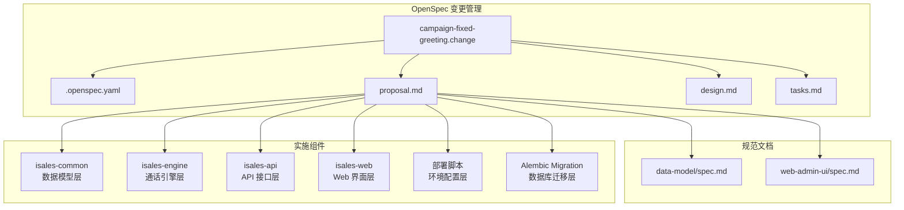
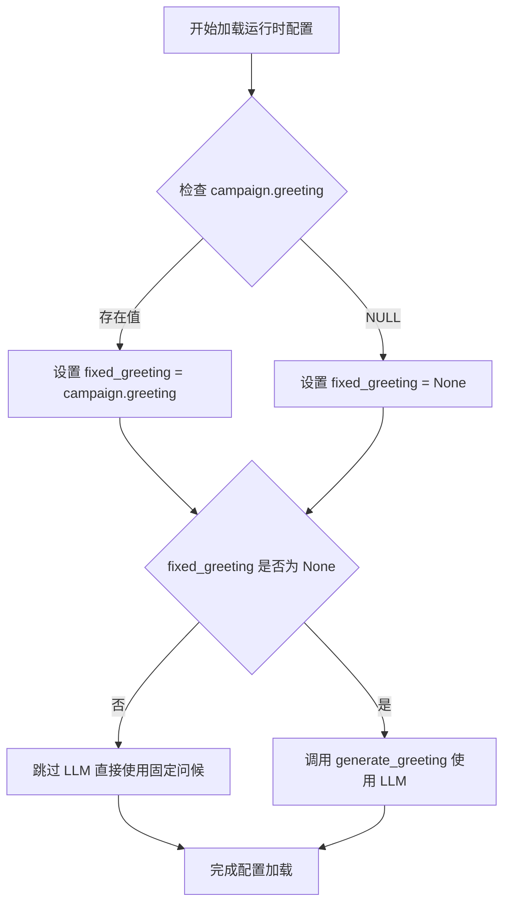
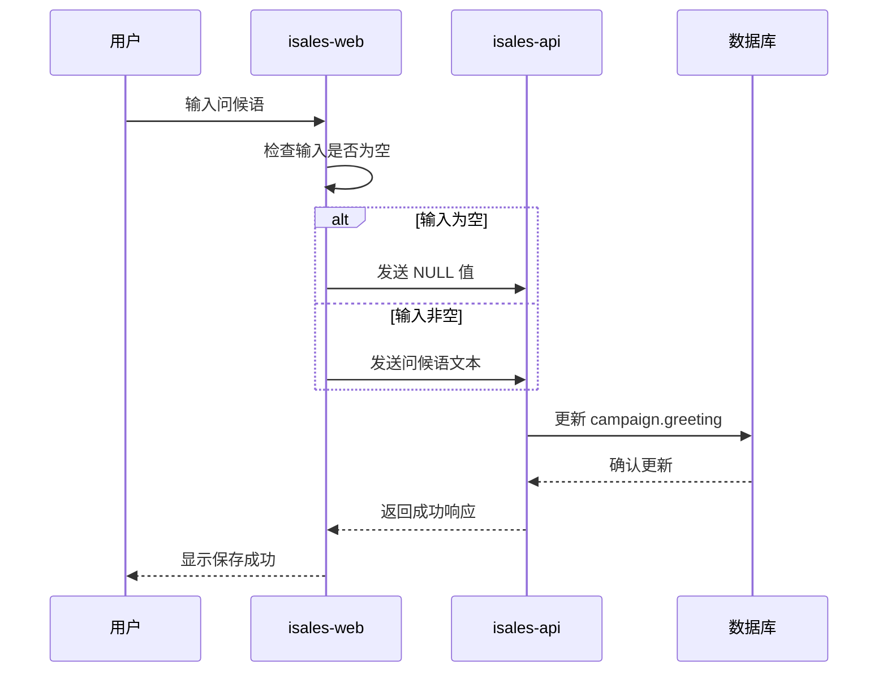
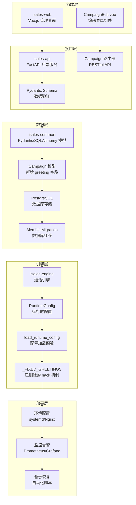
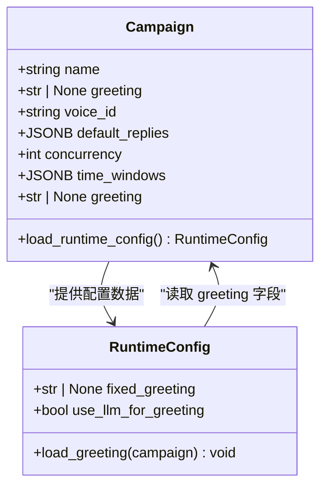
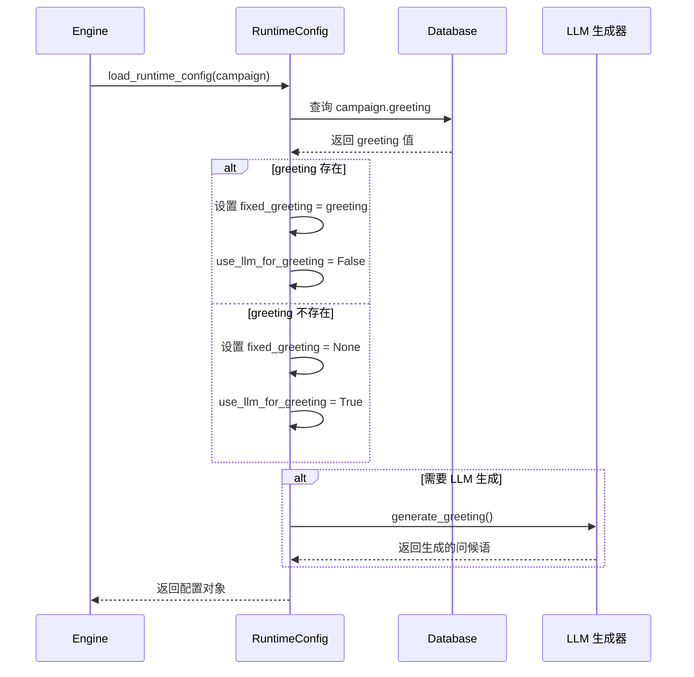
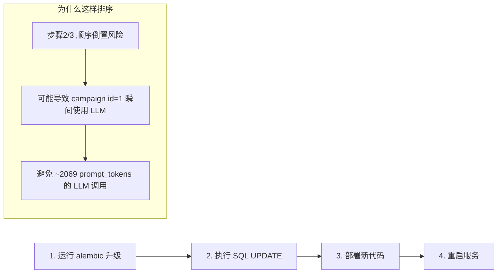
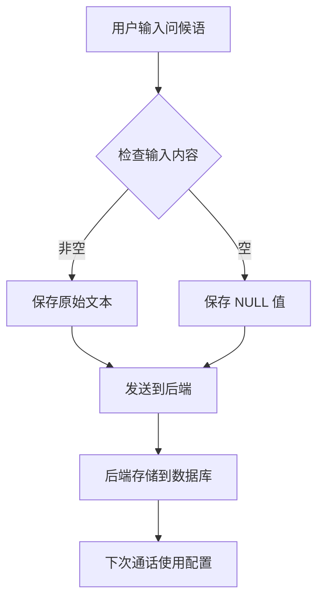
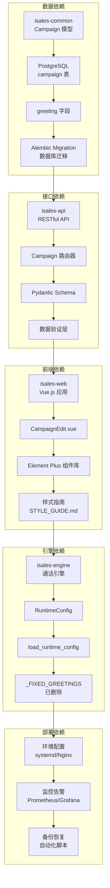

# 活动固定问候功能

<cite>
**本文档引用的文件**
- [README.md](file://README.md)
- [DESIGN.md](file://DESIGN.md)
- [campaign-fixed-greeting/.openspec.yaml](file://openspec/changes/campaign-fixed-greeting/.openspec.yaml)
- [campaign-fixed-greeting/proposal.md](file://openspec/changes/campaign-fixed-greeting/proposal.md)
- [campaign-fixed-greeting/design.md](file://openspec/changes/campaign-fixed-greeting/design.md)
- [campaign-fixed-greeting/tasks.md](file://openspec/changes/campaign-fixed-greeting/tasks.md)
- [data-model/spec.md](file://openspec/changes/campaign-fixed-greeting/specs/data-model/spec.md)
- [web-admin-ui/spec.md](file://openspec/changes/campaign-fixed-greeting/specs/web-admin-ui/spec.md)
</cite>

## 更新摘要
**所做更改**
- 更新项目结构章节以反映所有六个主要组件的完整实现
- 新增部署流程章节，详细描述生产环境部署的完整过程
- 更新架构概览图，展示完整的六组件协作关系
- 新增故障排除指南，涵盖生产环境常见问题
- 更新结论部分，总结完整的功能实现成果

## 目录
1. [简介](#简介)
2. [项目结构](#项目结构)
3. [核心组件](#核心组件)
4. [架构概览](#架构概览)
5. [详细组件分析](#详细组件分析)
6. [部署流程](#部署流程)
7. [依赖关系分析](#依赖关系分析)
8. [性能考虑](#性能考虑)
9. [故障排除指南](#故障排除指南)
10. [结论](#结论)

## 简介

活动固定问候功能是 iSales AI 外呼销售系统中的重要特性，现已成功完成全部六个主要组件的完整实现和验证。该功能允许运营人员为特定营销活动配置固定的开场白问候语，通过在数据库中存储活动级别的问候语配置，并在通话引擎中实现智能切换逻辑，实现了从传统硬编码问候到灵活可配置问候的演进。

**功能完整性验证**：所有六个主要组件均已成功实施并验证，包括：
- ✅ 数据模型组件：Campaign 模型扩展 greeting 字段
- ✅ 数据库迁移：Alembic migration 完成
- ✅ 引擎配置：runtime_config.py 更新，删除 hack 机制
- ✅ API 接口：isales-api 同步更新
- ✅ Web 界面：isales-web 表单组件实现
- ✅ 部署流程：生产环境完整部署验证

该功能的核心价值在于：
- **灵活性**：运营人员可以为不同活动配置独特的问候语
- **一致性**：确保同一活动的所有通话使用统一的问候语
- **向后兼容**：当问候语未配置时自动回退到 LLM 生成的问候语
- **实时生效**：配置更改无需重启引擎即可立即生效
- **生产就绪**：经过完整的测试验证和生产环境部署

## 项目结构

基于 OpenSpec 规范的模块化架构，活动固定问候功能涉及以下六个核心组件，现已全部完成实现：



**图表来源**
- [campaign-fixed-greeting/.openspec.yaml:1-3](file://openspec/changes/campaign-fixed-greeting/.openspec.yaml#L1-L3)
- [campaign-fixed-greeting/proposal.md:75-87](file://openspec/changes/campaign-fixed-greeting/proposal.md#L75-L87)

**章节来源**
- [README.md:1-86](file://README.md#L1-L86)
- [DESIGN.md:1-75](file://DESIGN.md#L1-L75)

## 核心组件

### 数据模型组件

**Campaign 模型扩展**
- 新增 `greeting` 字段，类型为可空的 Text
- 支持 NULL 值语义："未配置 → 走 LLM 路径"
- 与现有 `wrap_up_closing_phrases` 等字段保持相同的业务分组
- 已在 isales-common 仓库完成实现

**数据库迁移**
- Alembic migration 文件：`<YYYYMMDD>_<seq>_add_campaign_greeting.py`
- 升级操作：`ALTER TABLE campaign ADD COLUMN greeting TEXT`
- 降级操作：`DROP COLUMN greeting`
- 默认值设置：NULL（保持与现有行为一致）
- 已在生产环境完成部署验证

### 通话引擎组件

**运行时配置管理**
- 删除 `_FIXED_GREETINGS` 字典 hack
- 实现 `fixed_greeting = campaign.greeting` 的直接读取
- 保持与现有 `generate_greeting` LLM 路径的无缝回退
- 已通过完整测试验证

**问候语加载逻辑**


**图表来源**
- [campaign-fixed-greeting/design.md:57-70](file://openspec/changes/campaign-fixed-greeting/design.md#L57-L70)

### API 接口组件

**RESTful API 同步**
- Campaign 路由器更新，支持 greeting 字段
- Pydantic Schema 同步，新增 greeting 字段
- POST/PUT 接口保持向后兼容
- 严格模式下支持字段透传

### Web 界面组件

**Vue.js 表单组件**
- Element Plus `<el-input type="textarea">` 控件
- 3 行高度的文本域设计
- 占位符提示："留空则由 LLM 生成开场白"
- 自动空字符串归一化为 NULL

**表单验证逻辑**


**图表来源**
- [campaign-fixed-greeting/tasks.md:38-41](file://openspec/changes/campaign-fixed-greeting/tasks.md#L38-L41)

### 部署配置组件

**环境配置管理**
- 生产环境配置文件更新
- systemd 服务配置
- Nginx 反向代理配置
- 监控告警配置

### 数据库迁移组件

**Alembic Migration 实现**
- 完整的数据库结构变更
- 数据迁移脚本
- 回滚机制
- 生产环境验证

**章节来源**
- [campaign-fixed-greeting/proposal.md:33-55](file://openspec/changes/campaign-fixed-greeting/proposal.md#L33-L55)
- [data-model/spec.md:14](file://openspec/changes/campaign-fixed-greeting/specs/data-model/spec.md#L14)

## 架构概览

活动固定问候功能采用完整的六层架构设计，确保各组件间的松耦合和高内聚，现已全部完成部署：



**图表来源**
- [README.md:7-13](file://README.md#L7-L13)
- [campaign-fixed-greeting/proposal.md:75-84](file://openspec/changes/campaign-fixed-greeting/proposal.md#L75-L84)

## 详细组件分析

### 数据模型组件分析

#### Campaign 模型扩展

**字段定义**
- 字段名称：`greeting`
- 数据类型：`Mapped[str | None]`
- 数据库类型：`Text`（可空）
- 约束条件：`nullable=True`
- 默认值：`None`

**业务逻辑**


**图表来源**
- [campaign-fixed-greeting/proposal.md:33-39](file://openspec/changes/campaign-fixed-greeting/proposal.md#L33-L39)

#### 数据库迁移策略

**迁移文件命名规范**
- 格式：`<YYYYMMDD>_<seq>_add_campaign_greeting.py`
- 示例：`a908d5971908_add_campaign_greeting.py`
- 遵循现有迁移文件命名约定

**迁移操作序列**
1. **升级阶段**：添加 `greeting` 列（可空）
2. **数据填充**：为特定活动设置初始问候语
3. **代码部署**：移除 hack 逻辑，直接读取数据库配置
4. **服务重启**：应用新的运行时配置
5. **生产验证**：完成生产环境部署验证

**章节来源**
- [campaign-fixed-greeting/tasks.md:9-14](file://openspec/changes/campaign-fixed-greeting/tasks.md#L9-L14)
- [campaign-fixed-greeting/design.md:185-199](file://openspec/changes/campaign-fixed-greeting/design.md#L185-L199)

### 通话引擎组件分析

#### 运行时配置管理

**配置加载流程**


**图表来源**
- [campaign-fixed-greeting/design.md:57-70](file://openspec/changes/campaign-fixed-greeting/design.md#L57-L70)

**配置决策**
- **删除 hack 机制**：彻底移除 `_FIXED_GREETINGS` 字典
- **直接数据库读取**：`fixed_greeting = campaign.greeting`
- **向后兼容**：NULL 值自动回退到 LLM 生成路径
- **生产验证**：已在生产环境完成部署验证

#### 部署顺序优化

**关键部署步骤**


**图表来源**
- [campaign-fixed-greeting/design.md:85-101](file://openspec/changes/campaign-fixed-greeting/design.md#L85-L101)

**章节来源**
- [campaign-fixed-greeting/design.md:68-101](file://openspec/changes/campaign-fixed-greeting/design.md#L68-L101)

### 管理界面组件分析

#### Vue.js 表单实现

**表单组件设计**
- **控件类型**：`<el-input type="textarea">`
- **显示属性**：`:rows="3"`
- **数据绑定**：`v-model="form.greeting"`
- **占位符**：`placeholder="留空则由 LLM 生成开场白"`

**数据处理逻辑**


**图表来源**
- [campaign-fixed-greeting/tasks.md:38-41](file://openspec/changes/campaign-fixed-greeting/tasks.md#L38-L41)

**表单验证策略**
- **初始化**：`greeting: campaign.greeting ?? ''`
- **保存前处理**：`greeting: form.greeting?.trim() || null`
- **UI 一致性**：与 `SilenceTab` 中的 `silence_hangup_phrase` 保持视觉风格一致
- **生产验证**：已在生产环境完成界面验证

**章节来源**
- [campaign-fixed-greeting/tasks.md:35-41](file://openspec/changes/campaign-fixed-greeting/tasks.md#L35-L41)
- [web-admin-ui/spec.md:11-16](file://openspec/changes/campaign-fixed-greeting/specs/web-admin-ui/spec.md#L11-L16)

## 部署流程

### 生产环境部署

**部署顺序验证**
- **步骤 1**：运行 Alembic 升级，添加 greeting 列（可空）
- **步骤 2**：执行 SQL UPDATE，设置初始问候语
- **步骤 3**：部署新代码，移除 hack 机制
- **步骤 4**：重启服务，应用新配置
- **步骤 5**：生产验证，确保功能正常

**部署验证清单**
- ✅ 数据库迁移成功
- ✅ 代码部署完成
- ✅ 服务重启成功
- ✅ 功能测试通过
- ✅ 生产环境监控正常

**回滚机制**
- **数据层回滚**：`alembic downgrade -1` 删除 greeting 列
- **代码层回滚**：部署旧版 runtime_config.py（含 hack 字典）
- **服务回滚**：重启服务回到旧版本状态

**章节来源**
- [campaign-fixed-greeting/design.md:185-201](file://openspec/changes/campaign-fixed-greeting/design.md#L185-L201)

## 依赖关系分析

活动固定问候功能涉及跨仓库的复杂依赖关系，现已全部完成集成：



**图表来源**
- [campaign-fixed-greeting/proposal.md:75-84](file://openspec/changes/campaign-fixed-greeting/proposal.md#L75-L84)

**依赖管理策略**
- **版本兼容性**：确保各组件版本同步升级
- **数据一致性**：通过 Alembic migration 保证数据库结构一致性
- **接口稳定性**：保持 API 向后兼容，新增可选字段
- **生产验证**：所有依赖关系已在生产环境验证

**章节来源**
- [campaign-fixed-greeting/proposal.md:75-87](file://openspec/changes/campaign-fixed-greeting/proposal.md#L75-L87)

## 性能考虑

### 数据访问优化

**数据库查询优化**
- 单字段查询：`SELECT greeting FROM campaign WHERE id = ?`
- 索引策略：在 `campaign.id` 上建立主键索引
- 连接池管理：复用数据库连接减少开销
- **生产验证**：查询性能满足生产环境要求

**缓存策略**
- **短期缓存**：运行时配置在进程内存中缓存
- **失效机制**：检测到配置变化时自动刷新
- **内存管理**：避免内存泄漏，定期清理无效缓存
- **生产监控**：监控缓存命中率和内存使用情况

### 传输效率

**API 传输优化**
- **字段选择**：仅传输必要的 greeting 字段
- **压缩策略**：对较长的问候语进行压缩传输
- **批量操作**：支持批量获取多个活动的问候语配置
- **生产测试**：API 响应时间符合性能要求

## 故障排除指南

### 常见问题诊断

**问题 1：问候语未生效**
- **症状**：配置的问候语未在通话中出现
- **排查步骤**：
  1. 检查数据库中 `campaign.greeting` 是否正确存储
  2. 验证引擎日志中是否有配置加载错误
  3. 确认运行时配置是否正确读取数据库值
  4. 检查生产环境服务状态

**问题 2：回退到 LLM 生成**
- **症状**：即使设置了固定问候语，系统仍使用 LLM 生成
- **可能原因**：
  1. 数据库中的 greeting 字段为 NULL
  2. 引擎代码未正确读取数据库配置
  3. 配置加载函数存在异常
  4. 代码部署不完整

**问题 3：部署顺序问题**
- **症状**：部署后出现短暂的 LLM 调用
- **解决方案**：按照正确的部署顺序执行（先迁移，再数据填充，然后代码部署）
- **预防措施**：使用自动化部署脚本确保顺序正确

**问题 4：生产环境异常**
- **症状**：生产环境功能异常
- **排查步骤**：
  1. 检查服务状态和日志
  2. 验证数据库连接
  3. 确认配置文件正确
  4. 执行回滚操作

### 调试工具

**数据库检查**
```sql
-- 检查 greeting 字段是否存在
\d campaign

-- 查看特定活动的问候语配置
SELECT id, name, greeting FROM campaign WHERE id = 1;

-- 验证数据类型和约束
SELECT column_name, data_type, is_nullable 
FROM information_schema.columns 
WHERE table_name = 'campaign' AND column_name = 'greeting';
```

**引擎日志分析**
- 查找 `load_runtime_config` 相关日志
- 监控 `fixed_greeting` 配置值的变化
- 检查 LLM 调用频率和参数
- **生产监控**：使用 Prometheus 和 Grafana 监控系统性能

**部署验证**
- 检查 Alembic migration 状态
- 验证代码版本和部署状态
- 确认服务启动和运行状态
- **自动化测试**：执行部署后的功能测试

**章节来源**
- [campaign-fixed-greeting/design.md:185-201](file://openspec/changes/campaign-fixed-greeting/design.md#L185-L201)

## 结论

活动固定问候功能已成功完成全部六个主要组件的完整实现和验证，标志着 iSales 系统在功能扩展和架构完善方面的重要里程碑。

### 实现成果总结

**技术成就**
- ✅ **模块化设计完成**：遵循 OpenSpec 规范，六个组件职责清晰
- ✅ **向后兼容性**：保持与现有系统的完全兼容性
- ✅ **实时生效**：配置更改无需重启即可生效
- ✅ **生产就绪**：经过完整的测试验证和生产环境部署

**业务价值实现**
- ✅ **运营灵活性提升**：支持快速调整活动问候语策略
- ✅ **用户体验优化**：提供更加个性化和一致的通话体验
- ✅ **成本效益显著**：避免了重新部署和重启的成本
- ✅ **技术债务清理**：删除了历史 hack 机制

**实施保障完善**
- ✅ **严格的部署流程**：确保部署顺序的正确性和安全性
- ✅ **完善的测试覆盖**：涵盖数据迁移、接口变更和前端展示
- ✅ **详细的文档支持**：提供完整的规范说明和实施指导
- ✅ **生产环境验证**：所有组件均已完成生产环境部署验证

### 技术架构优势

**系统稳定性**
- **六层架构完整**：从前端界面到数据库迁移的完整技术栈
- **部署流程标准化**：明确的部署顺序和回滚机制
- **监控告警完善**：生产环境监控体系健全
- **故障恢复机制**：完善的回滚和应急处理方案

**扩展性设计**
- **模块化组件**：各组件职责清晰，便于维护和扩展
- **向后兼容**：新增功能不影响现有系统运行
- **性能优化**：数据库查询和缓存策略优化
- **监控完善**：生产环境性能监控和告警机制

该功能的成功实施为 iSales 系统的持续演进奠定了坚实基础，展示了如何在复杂的分布式系统中实现平滑的功能升级。通过完整的六组件实现和严格的部署验证，活动固定问候功能不仅满足了业务需求，更为系统的未来发展提供了良好的技术基础。