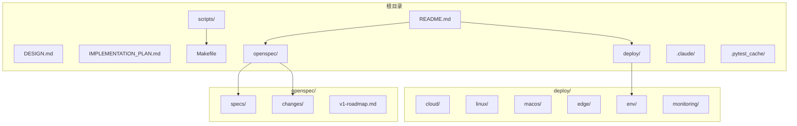
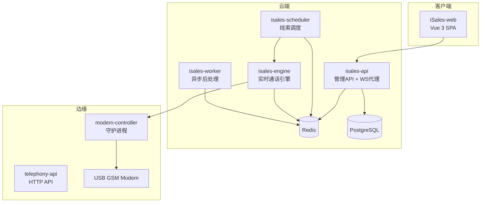
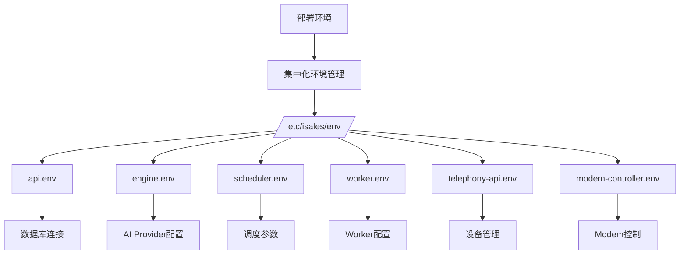
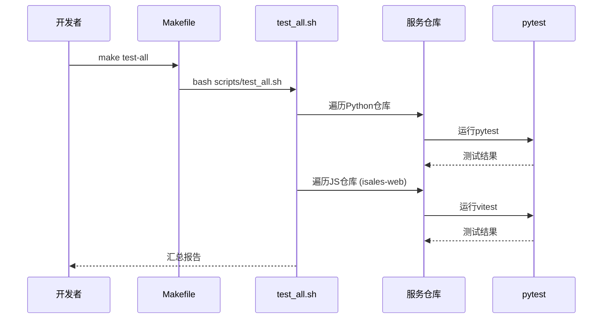
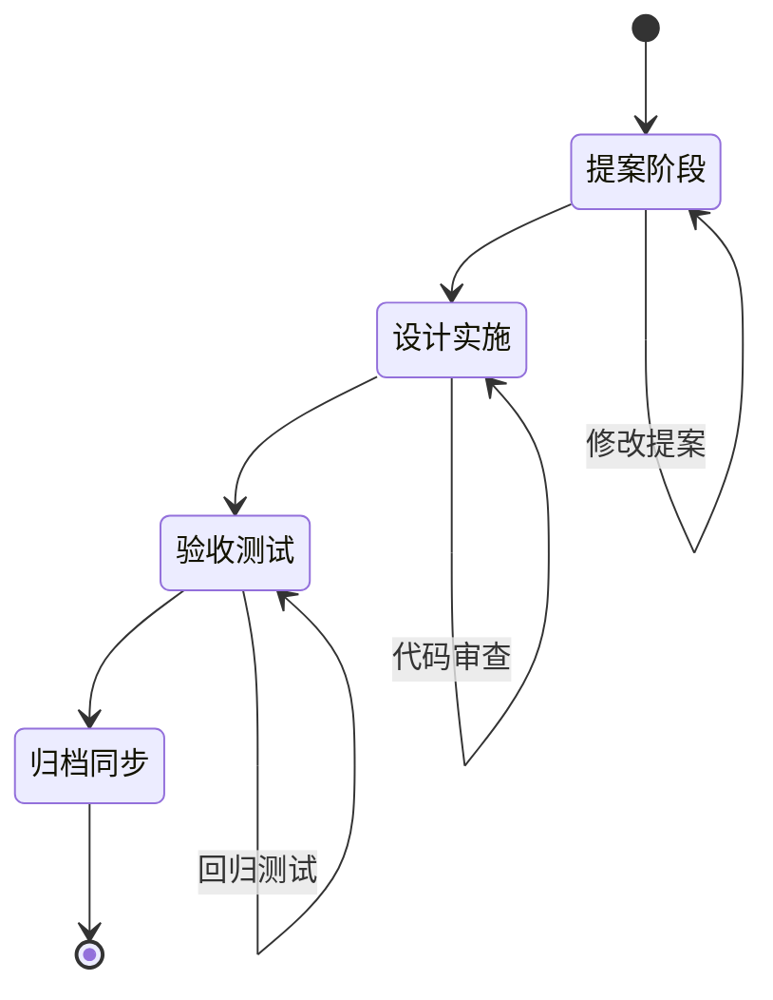
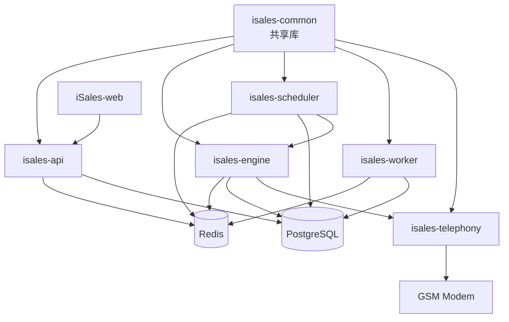

# 开发者指南

<cite>
**本文档引用的文件**
- [README.md](file://README.md)
- [DESIGN.md](file://DESIGN.md)
- [IMPLEMENTATION_PLAN.md](file://IMPLEMENTATION_PLAN.md)
- [Makefile](file://Makefile)
- [scripts/test_all.sh](file://scripts/test_all.sh)
- [scripts/check_dingrtc_versions.sh](file://scripts/check_dingrtc_versions.sh)
- [deploy/linux/scripts/check_env_consistency.py](file://deploy/linux/scripts/check_env_consistency.py)
- [deploy/RUNBOOK.md](file://deploy/RUNBOOK.md)
- [openspec/v1-roadmap.md](file://openspec/v1-roadmap.md)
- [openspec/specs/architecture/spec.md](file://openspec/specs/architecture/spec.md)
- [openspec/specs/deployment-topology/spec.md](file://openspec/specs/deployment-topology/spec.md)
- [openspec/changes/arch-cloud-edge-split/proposal.md](file://openspec/changes/arch-cloud-edge-split/proposal.md)
- [deploy/env/api.env.example](file://deploy/env/api.env.example)
- [deploy/env/engine.env.example](file://deploy/env/engine.env.example)
- [deploy/env/scheduler.env.example](file://deploy/env/scheduler.env.example)
- [deploy/env/worker.env.example](file://deploy/env/worker.env.example)
</cite>

## 目录
1. [简介](#简介)
2. [项目结构](#项目结构)
3. [核心组件](#核心组件)
4. [架构概览](#架构概览)
5. [详细组件分析](#详细组件分析)
6. [依赖分析](#依赖分析)
7. [性能考虑](#性能考虑)
8. [故障排除指南](#故障排除指南)
9. [结论](#结论)
10. [附录](#附录)

## 简介

iSales是一个基于OpenSpec规范的AI外呼销售系统，采用多仓库微服务架构，包含7个独立的服务仓库。该项目支持两种单主机部署模型：Linux + systemd和macOS 14+ Apple Silicon + launchd。

项目的主要特点：
- **多仓库架构**：isales-common（共享库）+ 6个独立服务
- **实时通话引擎**：基于状态机和三层AI管线
- **跨仓测试**：一键运行所有仓库的测试套件
- **OpenSpec变更管理**：完整的spec/change/archive流程
- **云-边分离**：云端AI推理 + 边缘硬件控制的新架构

## 项目结构

iSales项目采用meta-repo结构，包含以下主要目录：



**图表来源**
- [README.md:1-86](file://README.md#L1-L86)
- [deploy/README.md](file://deploy/README.md)
- [openspec/specs/architecture/spec.md:1-168](file://openspec/specs/architecture/spec.md#L1-L168)

**章节来源**
- [README.md:1-86](file://README.md#L1-L86)
- [DESIGN.md:1-75](file://DESIGN.md#L1-L75)

## 核心组件

### 7个服务仓库

iSales系统由7个独立的服务仓库组成：

1. **isales-common** - 共享库（Pydantic/SQLAlchemy模型 + 跨仓共享schema）
2. **isales-api** - FastAPI HTTP后台（campaigns/leads/calls管理）
3. **isales-telephony** - 设备管理 + modem-controller守护进程
4. **isales-scheduler** - 调度器（campaign启停/拨号队列）
5. **isales-worker** - 后台worker（callback/recording upload/watchdog）
6. **isales-engine** - 实时通话引擎（状态机 + 三层AI管线）
7. **isales-web** - Vue 3管理面

### OpenSpec规范体系

OpenSpec提供了完整的变更管理流程：
- **spec** - 能力规范定义
- **change** - 变更提案和实施
- **archive** - 变更归档和同步

**章节来源**
- [README.md:3-14](file://README.md#L3-L14)
- [DESIGN.md:9-75](file://DESIGN.md#L9-L75)

## 架构概览

### 传统单主机部署架构



**图表来源**
- [openspec/specs/architecture/spec.md:130-168](file://openspec/specs/architecture/spec.md#L130-L168)
- [openspec/specs/deployment-topology/spec.md:6-39](file://openspec/specs/deployment-topology/spec.md#L6-L39)

### 云-边分离架构

随着v1 roadmap的发展，系统正向云-边分离架构演进：

```mermaid
graph TB
subgraph "云端 (ECS)"
C_API[isales-api]
C_ENGINE[isales-engine]
C_SCHEDULER[isales-scheduler]
C_WORKER[isales-worker]
C_WEB[isales-web]
C_REDIS[(Redis)]
C_PG[(PostgreSQL)]
end
subgraph "边缘 (Windows/Mac)"
E_MODEM[modem-controller]
E_AUDIO[audio-bridge]
E_GSM[USB GSM Modem]
end
subgraph "阿里RTC"
RTC[Alicom RTC PaaS]
end
C_WEB --> C_API
C_API --> C_REDIS
C_SCHEDULER --> C_REDIS
C_ENGINE --> C_REDIS
C_WORKER --> C_REDIS
C_ENGINE < --> RTC
E_MODEM < --> RTC
E_AUDIO < --> RTC
RTC --> E_GSM
```

**图表来源**
- [openspec/v1-roadmap.md:456-491](file://openspec/v1-roadmap.md#L456-L491)
- [openspec/changes/arch-cloud-edge-split/proposal.md:11-19](file://openspec/changes/arch-cloud-edge-split/proposal.md#L11-L19)

**章节来源**
- [openspec/v1-roadmap.md:1-576](file://openspec/v1-roadmap.md#L1-L576)
- [openspec/specs/architecture/spec.md:45-58](file://openspec/specs/architecture/spec.md#L45-L58)

## 详细组件分析

### 本地开发环境搭建

#### Python环境配置

1. **系统依赖**（Linux/macOS）
```bash
# Ubuntu 22.04 LTS
sudo apt update
sudo apt install python3.12 python3.12-venv nodejs libudev-dev libasound2-dev pkg-config git

# macOS (Apple Silicon)
brew install python@3.12 node libudev libasound2-dev
```

2. **Python虚拟环境**
```bash
# 创建项目根目录
mkdir isales && cd isales
git clone https://github.com/tommax-bai/isales.git .

# 为每个服务创建虚拟环境
for repo in isales-common isales-api isales-telephony isales-scheduler isales-worker isales-engine; do
    cd ../$repo
    python3 -m venv .venv
    source .venv/bin/activate
    pip install -e ".[dev]"
done
```

3. **数据库设置**
```bash
# PostgreSQL 15
sudo apt install postgresql-15 postgresql-contrib

# Redis 7
sudo apt install redis-server

# 初始化数据库
sudo -u postgres createdb isales
sudo -u postgres psql -c "CREATE EXTENSION IF NOT EXISTS \"uuid-ossp\";"
```

#### 环境变量配置

每个服务都有对应的.env.example文件：



**图表来源**
- [openspec/specs/deployment-topology/spec.md:40-61](file://openspec/specs/deployment-topology/spec.md#L40-L61)

**章节来源**
- [deploy/env/api.env.example:1-14](file://deploy/env/api.env.example#L1-L14)
- [deploy/env/engine.env.example:1-21](file://deploy/env/engine.env.example#L1-L21)
- [deploy/env/scheduler.env.example:1-21](file://deploy/env/scheduler.env.example#L1-L21)
- [deploy/env/worker.env.example:1-20](file://deploy/env/worker.env.example#L1-L20)

### 测试策略和工具

#### 跨仓测试运行

项目提供了完整的跨仓测试执行框架：



**图表来源**
- [Makefile:5-6](file://Makefile#L5-L6)
- [scripts/test_all.sh:120-126](file://scripts/test_all.sh#L120-L126)

#### 测试执行流程

1. **Python仓库测试**
```bash
# 逐个仓库运行pytest
for repo in isales-common isales-api isales-telephony isales-scheduler isales-worker isales-engine; do
    cd ../$repo
    python -m pytest -v
done
```

2. **JavaScript仓库测试**
```bash
# isales-web运行vitest
cd ../isales-web
npm run test
```

3. **OpenSpec验证**
```bash
# 验证所有spec和active changes
make spec-validate

# DingRTC版本一致性检查
bash scripts/check_dingrtc_versions.sh
```

**章节来源**
- [scripts/test_all.sh:1-145](file://scripts/test_all.sh#L1-L145)
- [Makefile:14-17](file://Makefile#L14-L17)

### OpenSpec变更管理流程

#### 完整变更生命周期



#### 变更提案模板

每个OpenSpec变更包含以下要素：
- **Why** - 变更动机和背景
- **What Changes** - 具体变更内容
- **Capabilities** - 影响的能力规范
- **Impact** - 代码和依赖影响
- **Risk & 缓解** - 风险评估和缓解措施

**章节来源**
- [openspec/changes/arch-cloud-edge-split/proposal.md:1-77](file://openspec/changes/arch-cloud-edge-split/proposal.md#L1-L77)

### 开发最佳实践

#### 代码贡献流程

1. **分支管理**
```bash
# 基于main分支创建功能分支
git checkout -b feature/new-capability

# 提交规范
git commit -m "feat(api): add new endpoint for device management"
git commit -m "fix(telephony): resolve AT command timeout issue"
git commit -m "docs(specs): update architecture spec"
```

2. **代码审查流程**
- 每个PR应该有明确的功能范围
- 单个PR应在1-2次Claude Code会话内完成
- 代码必须通过所有测试用例
- OpenSpec变更必须通过完整的提案-实施-归档流程

3. **提交信息规范**
```
<type>(<scope>): <subject>

<body>

<footer>
```

#### 编码规范

1. **Python代码规范**
- 使用pyright进行类型检查
- 使用ruff进行代码风格检查
- 使用black进行代码格式化
- 使用isort进行导入排序

2. **JavaScript代码规范**
- 使用ESLint进行静态检查
- 使用Prettier进行代码格式化
- 使用TypeScript进行类型安全

3. **OpenSpec规范**
- 所有变更必须通过OpenSpec流程
- spec文件必须保持简洁和可读
- change提案必须包含完整的实施计划

**章节来源**
- [IMPLEMENTATION_PLAN.md:298-389](file://IMPLEMENTATION_PLAN.md#L298-L389)

## 依赖分析

### 服务间依赖关系



**图表来源**
- [openspec/specs/architecture/spec.md:26-44](file://openspec/specs/architecture/spec.md#L26-L44)
- [openspec/specs/deployment-topology/spec.md:62-75](file://openspec/specs/deployment-topology/spec.md#L62-L75)

### 外部依赖

1. **核心依赖**
- **PostgreSQL 15** - 主数据库
- **Redis 7** - 缓存和队列
- **Python 3.12** - 运行时环境
- **Node.js >= 20** - 前端构建

2. **AI服务依赖**
- **阿里云RTC PaaS** - 音频传输
- **阿里云OSS** - 对象存储
- **第三方ASR/TTS/LLM服务** - AI推理

3. **系统服务**
- **systemd** (Linux) - 服务管理
- **launchd** (macOS) - 服务管理
- **nginx** - 反向代理

**章节来源**
- [openspec/specs/deployment-topology/spec.md:10-16](file://openspec/specs/deployment-topology/spec.md#L10-L16)
- [openspec/v1-roadmap.md:492-504](file://openspec/v1-roadmap.md#L492-L504)

## 性能考虑

### 时延预算

根据v1 roadmap，系统制定了严格的时延预算：


**时延指标**：
- **边缘到云端音频单程**: ≤ 50ms (P50) / ≤ 80ms (P95) / ≤ 150ms (P99)
- **用户说完到AI首音节**: ≤ 500ms (P50) / ≤ 800ms (P95) / ≤ 1200ms (P99)
- **端到端打断响应**: ≤ 200ms (P50) / ≤ 400ms (P95) / ≤ 600ms (P99)

### 并发控制

1. **全局并发限制**
```python
# Redis全局并发计数器
redis.incr("isales:concurrency:active")
# 并发上限检查
if current_concurrency > max_concurrency:
    # 拒绝新通话
```

2. **设备选择优化**
```python
# 使用FOR UPDATE SKIP LOCKED避免锁等待
SELECT device_id FROM devices 
WHERE status = 'idle' 
AND id NOT IN (
    SELECT device_id FROM active_calls 
    WHERE status = 'active'
)
ORDER BY RANDOM()
FOR UPDATE SKIP LOCKED
LIMIT 1
```

**章节来源**
- [openspec/v1-roadmap.md:33-44](file://openspec/v1-roadmap.md#L33-L44)
- [IMPLEMENTATION_PLAN.md:158-167](file://IMPLEMENTATION_PLAN.md#L158-L167)

## 故障排除指南

### 常见部署问题

#### 环境变量不一致

```bash
# 检查环境变量一致性
make deploy-check

# 或手动运行检查
python3 deploy/linux/scripts/check_env_consistency.py
```

#### 服务启动失败

```bash
# 查看服务状态
systemctl status isales-api
journalctl -u isales-api -n 100 --no-pager

# 检查端口占用
netstat -tlnp | grep :8000
```

#### 数据库连接问题

```bash
# 测试PostgreSQL连接
psql -h localhost -p 5432 -U isales -d isales

# 检查Redis连接
redis-cli ping
```

### 生产运维手册

#### 首次部署

```bash
# 1. 系统预配置
sudo bash deploy/linux/scripts/provision.sh

# 2. 编辑环境变量
sudo -e /etc/isales/env/api.env

# 3. 安装第一个版本
sudo bash deploy/linux/scripts/install.sh v0.1.0

# 4. 运行数据库迁移
sudo bash deploy/linux/scripts/migrate.sh

# 5. 切换到新版本
sudo bash deploy/linux/scripts/deploy.sh <release-ts>
```

#### 日常发版

```bash
# 1. 构建新版本
sudo bash deploy/linux/scripts/install.sh v0.1.1

# 2. 预览迁移
sudo DRY_RUN=1 bash deploy/linux/scripts/migrate.sh

# 3. 执行迁移
sudo bash deploy/linux/scripts/migrate.sh

# 4. 重启服务 (按依赖顺序)
sudo bash deploy/linux/scripts/deploy.sh <new-release-ts>
```

#### 回滚操作

```bash
# 查看可用版本
sudo bash deploy/linux/scripts/rollback.sh --list

# 回滚到指定版本
sudo bash deploy/linux/scripts/rollback.sh <prior-release-ts>
```

**章节来源**
- [deploy/RUNBOOK.md:17-96](file://deploy/RUNBOOK.md#L17-L96)
- [deploy/RUNBOOK.md:56-76](file://deploy/RUNBOOK.md#L56-L76)
- [deploy/RUNBOOK.md:84-96](file://deploy/RUNBOOK.md#L84-L96)

### 调试技巧

#### 日志分析

```bash
# 实时查看错误日志
journalctl --since '5 min ago' -p err -u 'isales-*'

# 查看特定服务日志
journalctl -u isales-engine -n 50 --no-pager

# 检查队列状态
redis-cli --scan --pattern 'engine:*' | xargs -I% redis-cli llen %
```

#### 性能监控

```bash
# 查看活跃通话数
redis-cli get isales:concurrency:active

# 检查数据库连接数
sudo -u postgres psql -c "SELECT count(*) FROM pg_stat_activity;"

# 监控Redis内存使用
redis-cli info memory
```

## 结论

iSales项目提供了一个完整的AI外呼销售系统解决方案，具有以下特点：

1. **成熟的架构设计** - 基于OpenSpec的规范驱动开发
2. **完善的测试体系** - 跨仓测试和OpenSpec验证
3. **灵活的部署模型** - 支持Linux和macOS两种部署方式
4. **清晰的变更管理** - 从spec到change再到archive的完整流程
5. **前瞻性的技术演进** - 从单主机向云-边分离架构发展

对于开发者而言，建议重点关注：
- OpenSpec规范的学习和应用
- 跨仓测试框架的使用
- 云-边分离架构的理解
- 性能优化和故障排除技能

## 附录

### 项目路线图

#### v1.0核心功能
- 实时通话引擎（状态机 + 三层AI管线）
- 设备管理和modem控制
- 调度和异步处理
- 管理后台界面

#### 未来发展规划
- **v1.1** - 多租户支持、转人工实时桥接
- **v2.0** - HA架构、多实例扩展
- **v3.0** - 国际化、多语言支持

### 开发环境快速设置

```bash
# 1. 克隆项目
git clone https://github.com/tommax-bai/isales.git
cd isales

# 2. 安装系统依赖
# Linux: sudo apt install python3.12 python3.12-venv nodejs libudev-dev libasound2-dev
# macOS: brew install python@3.12 node libudev libasound2-dev

# 3. 为每个服务创建虚拟环境并安装依赖
for repo in isales-common isales-api isales-telephony isales-scheduler isales-worker isales-engine; do
    cd ../$repo
    python3 -m venv .venv
    source .venv/bin/activate
    pip install -e ".[dev]"
done

# 4. 配置数据库和Redis
# 5. 运行测试验证环境
make test-all
```