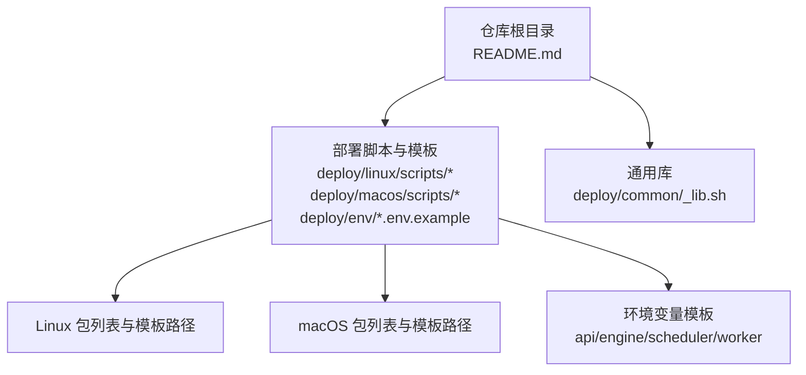
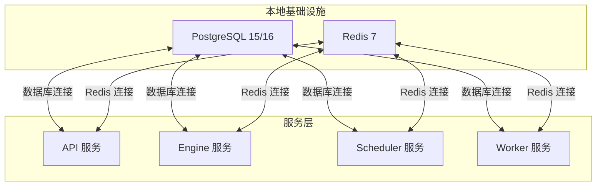
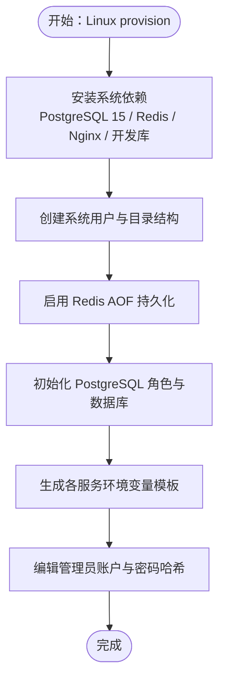
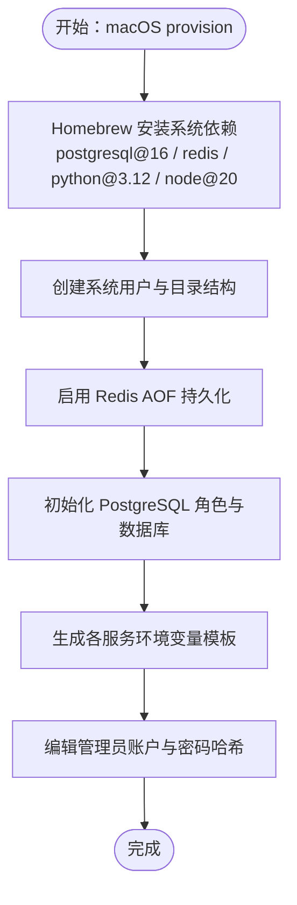
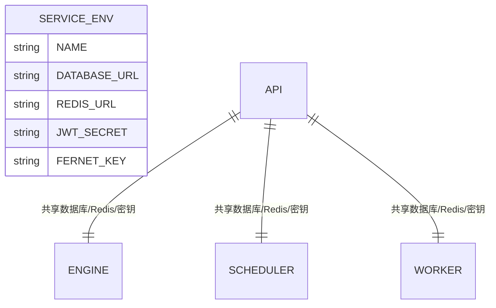
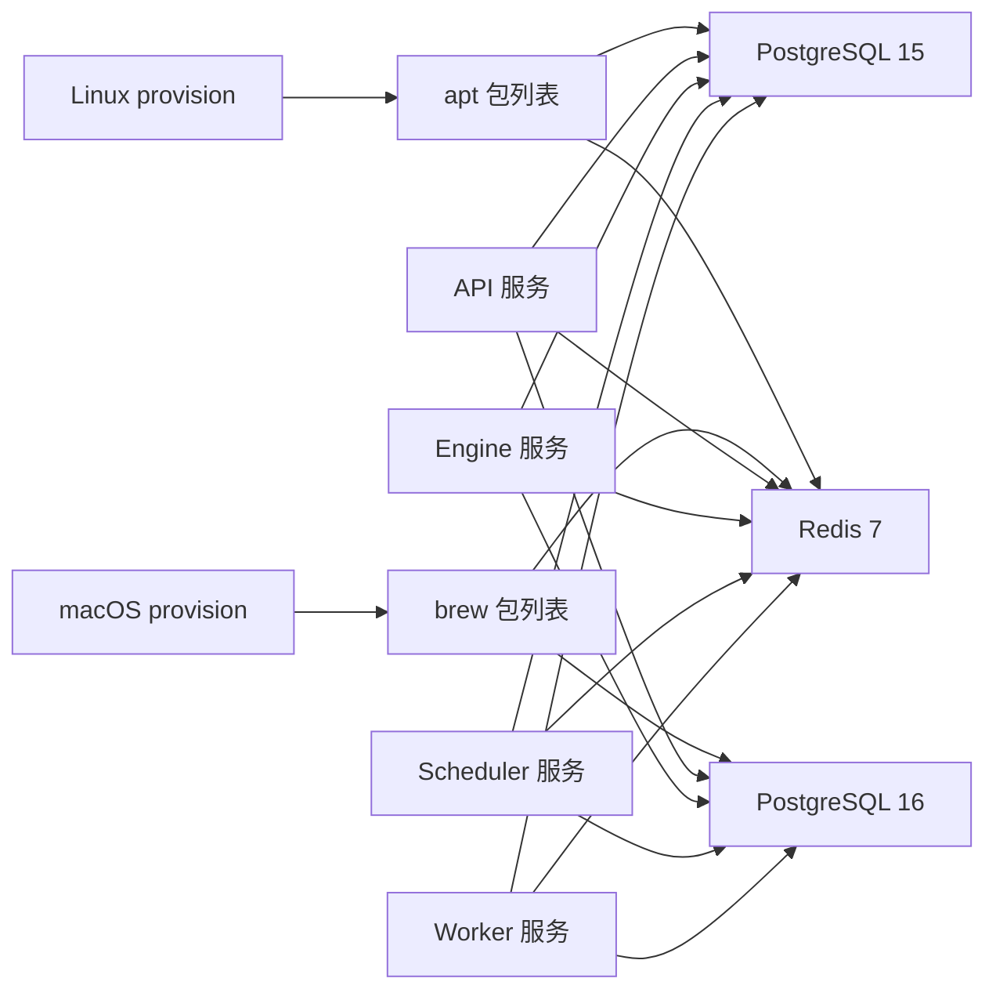

# 环境搭建

<cite>
**本文引用的文件**
- [README.md](file://README.md)
- [deploy/common/_lib.sh](file://deploy/common/_lib.sh)
- [deploy/linux/scripts/_lib.sh](file://deploy/linux/scripts/_lib.sh)
- [deploy/linux/scripts/provision.sh](file://deploy/linux/scripts/provision.sh)
- [deploy/macos/scripts/_lib.sh](file://deploy/macos/scripts/_lib.sh)
- [deploy/macos/scripts/provision.sh](file://deploy/macos/scripts/provision.sh)
- [deploy/env/api.env.example](file://deploy/env/api.env.example)
- [deploy/env/engine.env.example](file://deploy/env/engine.env.example)
- [deploy/env/scheduler.env.example](file://deploy/env/scheduler.env.example)
- [deploy/env/worker.env.example](file://deploy/env/worker.env.example)
- [deploy/cloud/env/api.env.example](file://deploy/cloud/env/api.env.example)
- [deploy/cloud/env/engine.env.example](file://deploy/cloud/env/engine.env.example)
- [deploy/cloud/env/scheduler.env.example](file://deploy/cloud/env/scheduler.env.example)
- [deploy/cloud/env/worker.env.example](file://deploy/cloud/env/worker.env.example)
</cite>

## 目录
1. [简介](#简介)
2. [项目结构](#项目结构)
3. [核心组件](#核心组件)
4. [架构总览](#架构总览)
5. [详细组件分析](#详细组件分析)
6. [依赖关系分析](#依赖关系分析)
7. [性能注意事项](#性能注意事项)
8. [故障排查指南](#故障排查指南)
9. [结论](#结论)
10. [附录](#附录)

## 简介
本指南面向iSales项目的本地开发环境搭建，目标是帮助你在Linux与macOS平台上快速完成Python运行时、系统依赖、数据库与缓存服务的准备，并理解各服务（API、Engine、Scheduler、Worker等）的环境变量配置方式。文档同时覆盖跨平台差异、验证步骤与常见问题排查，确保你能够稳定地启动并调试本地开发流程。

## 项目结构
iSales采用多仓协作与统一部署脚本的组织方式：核心代码分布在多个子仓中，而本仓库提供统一的部署与环境模板。本地开发通常以“单主机 + systemd（Linux）或launchd（macOS）”的方式进行，部署脚本会自动安装系统依赖、初始化数据库与缓存、生成初始环境变量文件，并引导后续安装与迁移流程。

图表来源
- [README.md:1-86](file://README.md#L1-L86)
- [deploy/common/_lib.sh:1-181](file://deploy/common/_lib.sh#L1-L181)
- [deploy/linux/scripts/_lib.sh:1-47](file://deploy/linux/scripts/_lib.sh#L1-L47)
- [deploy/macos/scripts/_lib.sh:1-69](file://deploy/macos/scripts/_lib.sh#L1-L69)

章节来源
- [README.md:1-86](file://README.md#L1-L86)
- [deploy/common/_lib.sh:1-181](file://deploy/common/_lib.sh#L1-L181)

## 核心组件
- Python 3.11/3.12与虚拟环境：Linux使用python3.12与venv，macOS通过Homebrew安装python@3.12，用于构建各服务的Python运行时。
- 系统依赖包：
  - Linux：postgresql-15、redis-server、nginx、libudev-dev、libasound2-dev、pkg-config、nodejs/npm等。
  - macOS：postgresql@16、redis、nginx、python@3.12、node@20、pkg-config、git等。
- 数据库与缓存：
  - PostgreSQL 15（Linux）或postgresql@16（macOS）作为主数据存储。
  - Redis 7作为消息队列与缓存。
- 环境变量模板：提供API、Engine、Scheduler、Worker等服务的示例配置，强调跨服务一致性（如数据库URL、Redis URL、共享密钥等）。

章节来源
- [deploy/linux/scripts/_lib.sh:17-33](file://deploy/linux/scripts/_lib.sh#L17-L33)
- [deploy/macos/scripts/_lib.sh:23-35](file://deploy/macos/scripts/_lib.sh#L23-L35)
- [deploy/env/api.env.example:1-14](file://deploy/env/api.env.example#L1-L14)
- [deploy/env/engine.env.example:1-21](file://deploy/env/engine.env.example#L1-L21)
- [deploy/env/scheduler.env.example:1-21](file://deploy/env/scheduler.env.example#L1-L21)
- [deploy/env/worker.env.example:1-20](file://deploy/env/worker.env.example#L1-L20)

## 架构总览
下图展示了本地开发所需的基础设施与服务关系：数据库与缓存作为底层支撑，API、Engine、Scheduler、Worker等服务通过统一的环境变量模板进行配置，遵循跨服务一致性约束。

图表来源
- [deploy/env/api.env.example:9-13](file://deploy/env/api.env.example#L9-L13)
- [deploy/env/engine.env.example:8-9](file://deploy/env/engine.env.example#L8-L9)
- [deploy/env/scheduler.env.example:12-13](file://deploy/env/scheduler.env.example#L12-L13)
- [deploy/env/worker.env.example:9-11](file://deploy/env/worker.env.example#L9-L11)

## 详细组件分析

### Linux 平台本地环境搭建
- 一次性系统准备
  - 使用Linux provision脚本安装系统依赖（PostgreSQL 15、Redis、Nginx、libudev-dev、libasound2-dev、pkg-config、nodejs/npm等），创建系统用户与目录骨架，启用Redis AOF持久化，并初始化PostgreSQL角色与数据库。
  - 该脚本具备幂等性：重复执行不会重置已有密钥或重复安装包。
- 环境变量生成
  - 在首次运行后，会在指定位置生成各服务的环境变量模板文件，包含数据库URL、Redis URL、JWT密钥、Fernet主密钥等占位符，需按提示补充管理员账户与密码哈希。
- 后续安装与迁移
  - 完成环境变量编辑后，可继续执行安装、迁移与部署流程。

图表来源
- [deploy/linux/scripts/provision.sh:45-186](file://deploy/linux/scripts/provision.sh#L45-L186)
- [deploy/linux/scripts/_lib.sh:17-33](file://deploy/linux/scripts/_lib.sh#L17-L33)
- [deploy/common/_lib.sh:150-180](file://deploy/common/_lib.sh#L150-L180)

章节来源
- [deploy/linux/scripts/provision.sh:1-224](file://deploy/linux/scripts/provision.sh#L1-L224)
- [deploy/linux/scripts/_lib.sh:1-47](file://deploy/linux/scripts/_lib.sh#L1-L47)
- [deploy/common/_lib.sh:143-181](file://deploy/common/_lib.sh#L143-L181)

### macOS 平台本地环境搭建
- 一次性系统准备
  - 使用macOS provision脚本通过Homebrew安装系统依赖（postgresql@16、redis、nginx、python@3.12、node@20、pkg-config、git等），创建系统用户与目录骨架，启用Redis AOF持久化，并初始化PostgreSQL角色与数据库。
  - 该脚本同样具备幂等性，且对旧版本bash做了重定向处理，确保使用bash 4+特性。
- 环境变量生成
  - 生成各服务的环境变量模板文件，包含数据库URL、Redis URL、JWT密钥、Fernet主密钥等占位符，需按提示补充管理员账户与密码哈希。
- 后续安装与迁移
  - 完成环境变量编辑后，可继续执行安装、迁移与部署流程。

图表来源
- [deploy/macos/scripts/provision.sh:64-265](file://deploy/macos/scripts/provision.sh#L64-L265)
- [deploy/macos/scripts/_lib.sh:23-35](file://deploy/macos/scripts/_lib.sh#L23-L35)
- [deploy/common/_lib.sh:150-180](file://deploy/common/_lib.sh#L150-L180)

章节来源
- [deploy/macos/scripts/provision.sh:1-280](file://deploy/macos/scripts/provision.sh#L1-L280)
- [deploy/macos/scripts/_lib.sh:1-69](file://deploy/macos/scripts/_lib.sh#L1-L69)
- [deploy/common/_lib.sh:143-181](file://deploy/common/_lib.sh#L143-L181)

### 环境变量配置方法
- 统一模板与一致性约束
  - API、Engine、Scheduler、Worker等服务均提供.env.example模板，强调跨服务一致性：数据库URL、Redis URL、共享密钥（JWT/Fernet）必须在相关服务间保持一致。
- 关键变量说明
  - 数据库URL：指向本地PostgreSQL实例。
  - Redis URL：指向本地Redis实例。
  - JWT密钥：用于用户会话签名（API与Telephony-API之间需一致）。
  - Fernet主密钥：API、Engine、Worker、Scheduler四者需一致，用于敏感信息加密。
- 示例模板位置
  - 本地开发模板：deploy/env/*.env.example
  - 云边拓扑模板：deploy/cloud/env/*.env.example（如需参考）

图表来源
- [deploy/env/api.env.example:9-13](file://deploy/env/api.env.example#L9-L13)
- [deploy/env/engine.env.example:8-9](file://deploy/env/engine.env.example#L8-L9)
- [deploy/env/scheduler.env.example:12-13](file://deploy/env/scheduler.env.example#L12-L13)
- [deploy/env/worker.env.example:9-11](file://deploy/env/worker.env.example#L9-L11)

章节来源
- [deploy/env/api.env.example:1-14](file://deploy/env/api.env.example#L1-L14)
- [deploy/env/engine.env.example:1-21](file://deploy/env/engine.env.example#L1-L21)
- [deploy/env/scheduler.env.example:1-21](file://deploy/env/scheduler.env.example#L1-L21)
- [deploy/env/worker.env.example:1-20](file://deploy/env/worker.env.example#L1-L20)
- [deploy/cloud/env/api.env.example:1-24](file://deploy/cloud/env/api.env.example#L1-L24)
- [deploy/cloud/env/engine.env.example:1-76](file://deploy/cloud/env/engine.env.example#L1-L76)
- [deploy/cloud/env/scheduler.env.example:1-25](file://deploy/cloud/env/scheduler.env.example#L1-L25)
- [deploy/cloud/env/worker.env.example:1-28](file://deploy/cloud/env/worker.env.example#L1-L28)

### 验证步骤
- 数据库连接测试
  - 使用服务自身的数据库连接字符串（来自环境变量模板）尝试连接本地PostgreSQL实例，确认可建立连接并读取必要元数据。
- Redis连接测试
  - 使用服务自身的Redis连接字符串（来自环境变量模板）尝试连接本地Redis实例，确认可进行基本读写。
- 环境变量一致性检查
  - 对比API、Engine、Scheduler、Worker的数据库URL、Redis URL与共享密钥，确保一致。
- 服务启动验证
  - 在完成环境变量编辑后，按部署脚本指引执行安装、迁移与部署流程，观察服务日志与健康检查输出。

章节来源
- [deploy/env/api.env.example:9-13](file://deploy/env/api.env.example#L9-L13)
- [deploy/env/engine.env.example:8-9](file://deploy/env/engine.env.example#L8-L9)
- [deploy/env/scheduler.env.example:12-13](file://deploy/env/scheduler.env.example#L12-L13)
- [deploy/env/worker.env.example:9-11](file://deploy/env/worker.env.example#L9-L11)

## 依赖关系分析
- 平台差异
  - Linux使用apt安装系统依赖，macOS使用Homebrew安装系统依赖。
  - PostgreSQL版本分别为15（Linux）与16（macOS）。
  - Python版本在两平台均为3.12以上。
- 环境变量模板
  - 本地开发模板与云边拓扑模板在关键变量上保持一致的命名与语义，便于切换拓扑。
- 服务间耦合
  - API、Engine、Scheduler、Worker共享数据库与缓存，因此它们的环境变量必须保持一致，避免运行时连接失败。

图表来源
- [deploy/linux/scripts/_lib.sh:17-33](file://deploy/linux/scripts/_lib.sh#L17-L33)
- [deploy/macos/scripts/_lib.sh:23-35](file://deploy/macos/scripts/_lib.sh#L23-L35)
- [deploy/env/api.env.example:9-13](file://deploy/env/api.env.example#L9-L13)
- [deploy/env/engine.env.example:8-9](file://deploy/env/engine.env.example#L8-L9)
- [deploy/env/scheduler.env.example:12-13](file://deploy/env/scheduler.env.example#L12-L13)
- [deploy/env/worker.env.example:9-11](file://deploy/env/worker.env.example#L9-L11)

章节来源
- [deploy/linux/scripts/_lib.sh:17-33](file://deploy/linux/scripts/_lib.sh#L17-L33)
- [deploy/macos/scripts/_lib.sh:23-35](file://deploy/macos/scripts/_lib.sh#L23-L35)
- [deploy/env/api.env.example:1-14](file://deploy/env/api.env.example#L1-L14)
- [deploy/env/engine.env.example:1-21](file://deploy/env/engine.env.example#L1-L21)
- [deploy/env/scheduler.env.example:1-21](file://deploy/env/scheduler.env.example#L1-L21)
- [deploy/env/worker.env.example:1-20](file://deploy/env/worker.env.example#L1-L20)

## 性能注意事项
- Redis持久化策略：生产建议开启AOF（已由脚本配置），注意磁盘空间与刷盘频率的平衡。
- PostgreSQL连接池与并发：根据服务负载调整连接数与超时参数，避免资源争用。
- 本地开发资源限制：合理分配CPU与内存，避免多服务同时启动导致系统抖动。

## 故障排查指南
- 权限与用户
  - Linux：确保以root或sudo执行provision脚本；系统用户与目录权限需正确。
  - macOS：确保以sudo执行provision脚本，并满足Homebrew运行条件。
- 系统依赖缺失
  - Linux：确认已安装postgresql-15、redis-server、libudev-dev、libasound2-dev等。
  - macOS：确认已安装postgresql@16、redis、python@3.12、node@20等。
- 数据库连接失败
  - 检查数据库URL中的主机、端口、用户名与密码是否与实际一致；确认PostgreSQL服务已启动。
- Redis连接失败
  - 检查Redis URL中的主机、端口与认证设置；确认Redis服务已启动。
- 环境变量不一致
  - 确保API、Engine、Scheduler、Worker的数据库URL、Redis URL与共享密钥完全一致。
- 服务启动异常
  - 查看对应服务的日志输出，定位具体错误；确认Python虚拟环境与依赖安装完整。

章节来源
- [deploy/linux/scripts/provision.sh:45-186](file://deploy/linux/scripts/provision.sh#L45-L186)
- [deploy/macos/scripts/provision.sh:64-265](file://deploy/macos/scripts/provision.sh#L64-L265)
- [deploy/common/_lib.sh:72-104](file://deploy/common/_lib.sh#L72-L104)

## 结论
通过本指南，你可以在Linux与macOS平台上完成iSales本地开发环境的搭建：安装系统依赖、初始化数据库与缓存、生成并校验环境变量模板，最终完成服务的安装与部署。遵循跨服务一致性约束与验证步骤，可显著降低本地开发中的环境问题概率。

## 附录
- 参考命令与入口
  - Linux：参考仓库根README中的部署命令示例。
  - macOS：参考仓库根README中的部署命令示例。
- 模板文件清单
  - 本地开发模板：deploy/env/api.env.example、deploy/env/engine.env.example、deploy/env/scheduler.env.example、deploy/env/worker.env.example。
  - 云边拓扑模板：deploy/cloud/env/api.env.example、deploy/cloud/env/engine.env.example、deploy/cloud/env/scheduler.env.example、deploy/cloud/env/worker.env.example。

章节来源
- [README.md:32-44](file://README.md#L32-L44)
- [deploy/env/api.env.example:1-14](file://deploy/env/api.env.example#L1-L14)
- [deploy/env/engine.env.example:1-21](file://deploy/env/engine.env.example#L1-L21)
- [deploy/env/scheduler.env.example:1-21](file://deploy/env/scheduler.env.example#L1-L21)
- [deploy/env/worker.env.example:1-20](file://deploy/env/worker.env.example#L1-L20)
- [deploy/cloud/env/api.env.example:1-24](file://deploy/cloud/env/api.env.example#L1-L24)
- [deploy/cloud/env/engine.env.example:1-76](file://deploy/cloud/env/engine.env.example#L1-L76)
- [deploy/cloud/env/scheduler.env.example:1-25](file://deploy/cloud/env/scheduler.env.example#L1-L25)
- [deploy/cloud/env/worker.env.example:1-28](file://deploy/cloud/env/worker.env.example#L1-L28)