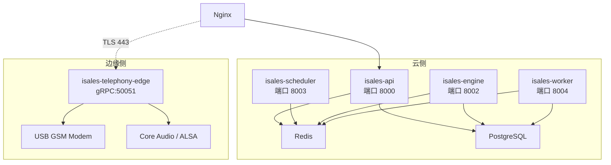
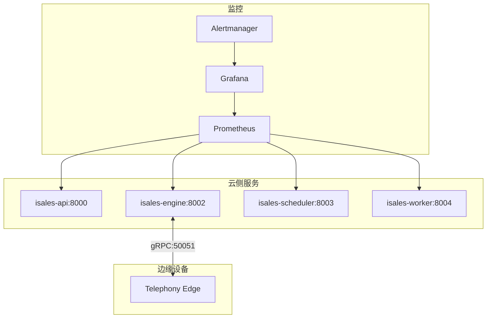
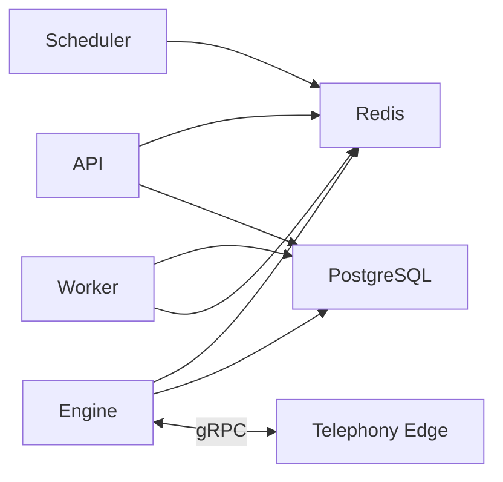
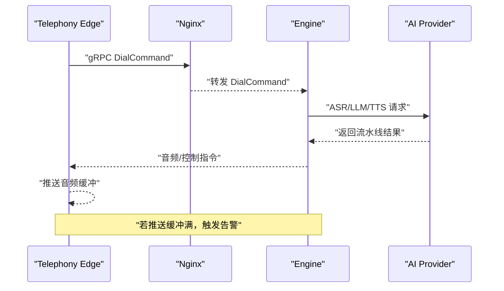

# 调试与故障排查

<cite>
**本文引用的文件**
- [README.md](file://README.md)
- [DESIGN.md](file://DESIGN.md)
- [RUNBOOK.md](file://deploy/RUNBOOK.md)
- [RUNBOOK-edge.md](file://deploy/RUNBOOK-edge.md)
- [monitoring/README.md](file://deploy/monitoring/README.md)
- [monitoring/alert_rules.yml.example](file://deploy/monitoring/alert_rules.yml.example)
- [monitoring/prometheus.yml.example](file://deploy/monitoring/prometheus.yml.example)
- [cloud/monitoring/README.md](file://deploy/cloud/monitoring/README.md)
- [cloud/monitoring/alert_rules.yml.example](file://deploy/cloud/monitoring/alert_rules.yml.example)
- [cloud/monitoring/prometheus.yml.example](file://deploy/cloud/monitoring/prometheus.yml.example)
- [cloud/env/api.env.example](file://deploy/cloud/env/api.env.example)
- [cloud/env/engine.env.example](file://deploy/cloud/env/engine.env.example)
- [cloud/env/scheduler.env.example](file://deploy/cloud/env/scheduler.env.example)
- [cloud/env/worker.env.example](file://deploy/cloud/env/worker.env.example)
- [edge/env/edge.env.example](file://deploy/edge/env/edge.env.example)
</cite>

## 目录
1. [简介](#简介)
2. [项目结构](#项目结构)
3. [核心组件](#核心组件)
4. [架构总览](#架构总览)
5. [详细组件分析](#详细组件分析)
6. [依赖关系分析](#依赖关系分析)
7. [性能考量](#性能考量)
8. [故障排查指南](#故障排查指南)
9. [结论](#结论)
10. [附录](#附录)

## 简介
本指南面向iSales平台的运维与排障工程师，覆盖API、Engine、Scheduler、Worker、Telephony等服务的日志分析方法与常见问题诊断流程，涵盖通话中断、设备连接失败、AI管线异常等场景；同时提供性能问题定位（CPU、内存、数据库锁等待）、监控告警解读与响应流程、调试工具使用（数据库查询、Redis调试、网络连通性测试）以及紧急故障的应急处理与恢复流程。

## 项目结构
iSales采用“多仓协同 + 单主机部署”的架构，核心服务包括：
- isales-api：FastAPI HTTP后台，提供管理面与外部接口
- isales-engine：实时通话引擎（状态机 + 三层AI管线）
- isales-scheduler：调度器（Campaign启停、拨号队列）
- isales-worker：后台任务（回调、录音上传、看门狗）
- isales-telephony：设备与Modem控制（守护进程）
- isales-web：Vue3管理面

部署层面提供Linux systemd与macOS launchd两种运行时，并配套监控模板与运维手册。

图表来源
- [monitoring/prometheus.yml.example:17-46](file://deploy/monitoring/prometheus.yml.example#L17-L46)
- [cloud/monitoring/prometheus.yml.example:21-49](file://deploy/cloud/monitoring/prometheus.yml.example#L21-L49)

章节来源
- [README.md:1-14](file://README.md#L1-L14)
- [DESIGN.md:40-43](file://DESIGN.md#L40-L43)

## 核心组件
- API服务：负责认证、管理面、回调配置与凭证加密（Fernet）。日志通过系统日志或统一日志系统输出，结合健康检查端点验证可用性。
- Engine服务：实时通话引擎，承载状态机与三层AI管线，负责拨号、通话控制、RTC通道管理与流水线指标采集。
- Scheduler服务：周期性扫描Campaign并推送拨号请求至Redis队列，控制并发与批次大小。
- Worker服务：后台任务执行者，负责回调、录音上传、设备看门狗与硬件告警聚合。
- Telephony服务：边缘侧Modem控制器与音频桥接，负责设备注册、拨号、通话质量与离线缓冲。
- 数据与缓存：PostgreSQL存储业务数据，Redis存储队列与并发控制键，边缘侧SQLite用于离线事件缓冲。

章节来源
- [cloud/env/api.env.example:8-21](file://deploy/cloud/env/api.env.example#L8-L21)
- [cloud/env/engine.env.example:8-76](file://deploy/cloud/env/engine.env.example#L8-L76)
- [cloud/env/scheduler.env.example:6-22](file://deploy/cloud/env/scheduler.env.example#L6-L22)
- [cloud/env/worker.env.example:6-25](file://deploy/cloud/env/worker.env.example#L6-L25)
- [edge/env/edge.env.example:7-34](file://deploy/edge/env/edge.env.example#L7-L34)

## 架构总览
- 单主机部署（Linux systemd / macOS launchd）与云边分离拓扑（A2）并行支持。云侧服务通过Nginx终止TLS，边缘侧通过gRPC与云侧建立双向流，边缘设备通过USB GSM Modem与Core Audio/ALSA交互。
- 监控模板定义了Prometheus抓取目标与基础告警规则，覆盖拨号队列堆积、设备标记率、回调失败率、PG连接压力等关键指标。

图表来源
- [monitoring/prometheus.yml.example:17-46](file://deploy/monitoring/prometheus.yml.example#L17-L46)
- [cloud/monitoring/prometheus.yml.example:21-49](file://deploy/cloud/monitoring/prometheus.yml.example#L21-L49)

章节来源
- [monitoring/README.md:10-14](file://deploy/monitoring/README.md#L10-L14)
- [cloud/monitoring/README.md:11-24](file://deploy/cloud/monitoring/README.md#L11-L24)

## 详细组件分析

### API服务日志与关键信息
- 日志位置与格式
  - Linux：systemd journal，可通过journalctl查看；健康检查端点用于快速验证。
  - macOS：统一日志（log），也可通过launchctl打印状态。
- 关键信息
  - 认证与会话：管理员账户与密码哈希、JWT签名密钥一致性。
  - 数据与缓存：数据库URL、Redis URL、时区设置。
- 常见问题
  - 登录失败：核对管理员密码哈希与JWT密钥。
  - API不可达：检查nginx反代与本地8000端口健康检查。
- 诊断步骤
  - 查看最近错误日志与服务状态。
  - 使用curl验证健康检查端点。
  - 对比各服务env中数据库/Redis/JWT一致性。

章节来源
- [RUNBOOK.md:163-179](file://deploy/RUNBOOK.md#L163-L179)
- [RUNBOOK.md:180-196](file://deploy/RUNBOOK.md#L180-L196)
- [cloud/env/api.env.example:8-21](file://deploy/cloud/env/api.env.example#L8-L21)

### Engine服务日志与关键信息
- 日志位置与格式
  - systemd journal（Linux）或统一日志（macOS）。
- 关键信息
  - AI Provider配置（ASR/LLM/TTS）、RTC SDK参数、云边gRPC绑定地址、设备ID与JWT密钥。
  - 管线预算与优雅停机超时。
- 常见问题
  - 拨号队列堆积：检查engine:dial队列深度与engine服务状态。
  - RTC通道异常：关注push_audio缓冲满、首TTS延迟越线等指标。
- 诊断步骤
  - 查看engine相关错误日志与队列长度。
  - 结合监控告警定位Provider延迟或网络拥塞。
  - 核对RTC SDK路径与AppId/AppKey配置。

章节来源
- [RUNBOOK.md:172-173](file://deploy/RUNBOOK.md#L172-L173)
- [cloud/env/engine.env.example:8-76](file://deploy/cloud/env/engine.env.example#L8-L76)
- [cloud/monitoring/alert_rules.yml.example:71-86](file://deploy/cloud/monitoring/alert_rules.yml.example#L71-L86)

### Scheduler服务日志与关键信息
- 日志位置与格式
  - systemd journal（Linux）或统一日志（macOS）。
- 关键信息
  - 数据库URL、Redis URL、批处理大小、并发上限、调度周期。
- 常见问题
  - 拨号队列堆积：检查engine是否消费慢或Provider异常。
  - 并发过高：调整MAX_CONCURRENCY与批次大小。
- 诊断步骤
  - 查看调度tick与批次处理情况。
  - 对比历史队列深度与engine消费速率。

章节来源
- [cloud/env/scheduler.env.example:6-22](file://deploy/cloud/env/scheduler.env.example#L6-L22)

### Worker服务日志与关键信息
- 日志位置与格式
  - systemd journal（Linux）或统一日志（macOS）。
- 关键信息
  - 数据库URL、Redis URL、OSS上传配置、Fernet密钥。
- 常见问题
  - 回调失败率高：核对签名密钥与外部回调端点可用性。
  - 设备看门狗：边缘设备离线计数异常。
- 诊断步骤
  - 使用Celery inspect查看活动任务。
  - 检查engine:worker:call-ended队列与回调日志。

章节来源
- [RUNBOOK.md:173-173](file://deploy/RUNBOOK.md#L173-L173)
- [cloud/env/worker.env.example:6-25](file://deploy/cloud/env/worker.env.example#L6-L25)

### Telephony服务日志与关键信息（边缘侧）
- 日志位置与格式
  - Apple统一日志（log stream）与LaunchAgent状态。
- 关键信息
  - 设备令牌、云边gRPC端点、SQLite离线缓冲路径、Modem串口与驱动、音频后端。
- 常见问题
  - LaunchAgent无法启动：检查退出码与环境变量。
  - gRPC重连失败：校验设备令牌、DNS解析与端口可达性。
  - 拨号失败：检查Modem串口与SIM状态。
- 诊断步骤
  - 使用launchctl打印状态与最近错误日志。
  - 通过nc/openssl验证gRPC连通性与TLS握手。
  - 使用AT指令检查Modem状态。

章节来源
- [RUNBOOK-edge.md:224-233](file://deploy/RUNBOOK-edge.md#L224-L233)
- [RUNBOOK-edge.md:241-251](file://deploy/RUNBOOK-edge.md#L241-L251)
- [edge/env/edge.env.example:7-34](file://deploy/edge/env/edge.env.example#L7-L34)

## 依赖关系分析
- 服务间耦合
  - API与Engine/Scheduler/Worker共享数据库与Redis；Engine与Telephony通过gRPC通信。
  - 调度器将拨号请求推送到Redis队列，Engine消费并下发拨号命令。
- 外部依赖
  - PostgreSQL、Redis、Nginx、Prometheus/Grafana/Alertmanager。
- 潜在环路
  - 通过队列与异步任务避免强耦合，降低循环依赖风险。
- 配置一致性
  - 数据库URL、Redis URL、JWT/Fernet密钥需在所有服务中保持一致。

图表来源
- [cloud/env/api.env.example:8-9](file://deploy/cloud/env/api.env.example#L8-L9)
- [cloud/env/engine.env.example:8-9](file://deploy/cloud/env/engine.env.example#L8-L9)
- [cloud/env/scheduler.env.example:6-7](file://deploy/cloud/env/scheduler.env.example#L6-L7)
- [cloud/env/worker.env.example:6-7](file://deploy/cloud/env/worker.env.example#L6-L7)

章节来源
- [cloud/env/api.env.example:8-21](file://deploy/cloud/env/api.env.example#L8-L21)
- [cloud/env/engine.env.example:8-76](file://deploy/cloud/env/engine.env.example#L8-L76)
- [cloud/env/scheduler.env.example:6-22](file://deploy/cloud/env/scheduler.env.example#L6-L22)
- [cloud/env/worker.env.example:6-25](file://deploy/cloud/env/worker.env.example#L6-L25)

## 性能考量
- CPU使用率
  - 关注Engine的AI Provider吞吐与RTC编码负载；必要时降级为单角色模式以缓解延迟预算。
- 内存泄漏
  - 结合系统内存指标与服务堆栈增长趋势，定位未释放资源或第三方SDK问题。
- 数据库锁等待
  - 使用PostgreSQL统计视图观察锁等待与慢查询；优化事务粒度与索引。
- Redis队列深度
  - 持续高堆积通常意味着消费者处理能力不足或下游阻塞。
- 网络抖动
  - 使用mtr观测WAN路径稳定性；边缘侧gRPC重连风暴需排查DNS与证书。

章节来源
- [cloud/monitoring/alert_rules.yml.example:71-86](file://deploy/cloud/monitoring/alert_rules.yml.example#L71-L86)
- [RUNBOOK.md:163-179](file://deploy/RUNBOOK.md#L163-L179)
- [RUNBOOK-edge.md:190-194](file://deploy/RUNBOOK-edge.md#L190-L194)

## 故障排查指南

### 通话中断
- 云边拓扑
  - 检查gRPC流是否断开、心跳是否持续、边缘设备是否离线。
  - 关注ARTC SDK推送音频缓冲满与会话数漂移告警。
- 边缘侧
  - 核对设备令牌、DNS解析、端口可达性；使用AT指令检查Modem状态。
- 云侧
  - 查看Engine日志中的RTC回调频率与Provider延迟；必要时降级管线。

图表来源
- [cloud/monitoring/alert_rules.yml.example:42-54](file://deploy/cloud/monitoring/alert_rules.yml.example#L42-L54)
- [cloud/env/engine.env.example:32-54](file://deploy/cloud/env/engine.env.example#L32-L54)

章节来源
- [cloud/monitoring/alert_rules.yml.example:14-26](file://deploy/cloud/monitoring/alert_rules.yml.example#L14-L26)
- [cloud/monitoring/alert_rules.yml.example:42-68](file://deploy/cloud/monitoring/alert_rules.yml.example#L42-L68)
- [RUNBOOK-edge.md:166-181](file://deploy/RUNBOOK-edge.md#L166-L181)

### 设备连接失败
- Linux/macOS
  - 检查服务状态与最近错误日志；核对数据库/Redis/JWT一致性。
- 边缘侧
  - 检查LaunchAgent状态、退出码与环境变量；确认gRPC连通性与TLS握手。
  - Modem串口路径变化时需更新环境并重启服务。
- 硬件
  - 使用AT指令检查SIM状态与信号强度；排查串口被系统占用。

章节来源
- [RUNBOOK.md:169-171](file://deploy/RUNBOOK.md#L169-L171)
- [RUNBOOK.md:180-196](file://deploy/RUNBOOK.md#L180-L196)
- [RUNBOOK-edge.md:196-222](file://deploy/RUNBOOK-edge.md#L196-L222)
- [RUNBOOK-edge.md:241-251](file://deploy/RUNBOOK-edge.md#L241-L251)

### AI管线异常
- 指标与告警
  - 关注首TTS P95是否越线；查看Provider延迟分布与队列深度。
- 诊断步骤
  - 降低并发或角色数量；检查网络与上游Provider可用性。
  - 核对Fernet密钥与凭据加载状态。

章节来源
- [cloud/monitoring/alert_rules.yml.example:71-86](file://deploy/cloud/monitoring/alert_rules.yml.example#L71-L86)
- [cloud/env/engine.env.example:11-31](file://deploy/cloud/env/engine.env.example#L11-L31)

### 回调失败率高
- 现象
  - 回调失败率超过阈值，外部端点可能不可用或签名密钥不一致。
- 诊断步骤
  - 检查Worker回调日志与响应码分布；核对Fernet密钥与签名配置。

章节来源
- [cloud/monitoring/alert_rules.yml.example:89-102](file://deploy/cloud/monitoring/alert_rules.yml.example#L89-L102)
- [cloud/env/worker.env.example:21-25](file://deploy/cloud/env/worker.env.example#L21-L25)

### 数据库连接压力
- 现象
  - PG连接数接近上限，存在连接泄漏或池容量不足。
- 诊断步骤
  - 检查应用连接池配置与事务持有时间；优化慢查询与索引。

章节来源
- [cloud/monitoring/alert_rules.yml.example:103-115](file://deploy/cloud/monitoring/alert_rules.yml.example#L103-L115)

### Redis队列堆积
- 现象
  - engine:dial队列深度持续升高。
- 诊断步骤
  - 检查Engine服务状态与消费速率；必要时重启Engine。

章节来源
- [RUNBOOK.md:172-173](file://deploy/RUNBOOK.md#L172-L173)

### 监控告警解读与响应
- 告警类型
  - 拨号队列堆积、设备标记率上升、回调失败率、PG连接压力、边缘离线/重连风暴、ARTC缓冲满、首TTS延迟越线。
- 响应流程
  - 根据告警级别分级处理；结合日志与指标定位根因；必要时降级或回滚。

章节来源
- [monitoring/alert_rules.yml.example:12-24](file://deploy/monitoring/alert_rules.yml.example#L12-L24)
- [cloud/monitoring/alert_rules.yml.example:14-26](file://deploy/cloud/monitoring/alert_rules.yml.example#L14-L26)
- [cloud/monitoring/alert_rules.yml.example:42-68](file://deploy/cloud/monitoring/alert_rules.yml.example#L42-L68)
- [cloud/monitoring/alert_rules.yml.example:71-86](file://deploy/cloud/monitoring/alert_rules.yml.example#L71-L86)
- [cloud/monitoring/alert_rules.yml.example:89-115](file://deploy/cloud/monitoring/alert_rules.yml.example#L89-L115)

### 调试工具使用
- 数据库
  - 使用psql/pg_restore进行备份与恢复演练；核对alembic版本与表数量。
- Redis
  - 使用redis-cli查看队列长度与键空间；核对内存使用与淘汰策略。
- 网络
  - 使用nc/openssl验证gRPC连通性与TLS握手；使用mtr观测WAN路径。
- 日志
  - Linux：journalctl按时间过滤与错误级别筛选。
  - macOS：log show按子系统过滤与错误关键字搜索。

章节来源
- [RUNBOOK.md:124-157](file://deploy/RUNBOOK.md#L124-L157)
- [RUNBOOK.md:188-196](file://deploy/RUNBOOK.md#L188-L196)
- [RUNBOOK-edge.md:166-194](file://deploy/RUNBOOK-edge.md#L166-L194)
- [RUNBOOK-edge.md:347-380](file://deploy/RUNBOOK-edge.md#L347-L380)

### 紧急故障应急处理与恢复
- 回滚
  - 使用rollback脚本切换软链并重启服务；schema默认前向应用，必要时手动降级。
- 备份恢复
  - PG与Redis按计划备份恢复演练；验证版本与关键表数量。
- 发版窗口
  - 优先在低峰时段发版；涉及Modem控制器变更需在维护窗口执行。

章节来源
- [RUNBOOK.md:84-115](file://deploy/RUNBOOK.md#L84-L115)
- [RUNBOOK.md:118-160](file://deploy/RUNBOOK.md#L118-L160)
- [RUNBOOK.md:56-81](file://deploy/RUNBOOK.md#L56-L81)

## 结论
通过统一的日志采集、完善的监控告警与标准化的排障流程，iSales能够在复杂云边拓扑下实现快速定位与恢复。建议在日常运维中持续完善指标体系与自动化演练，确保在真实故障发生时能够高效响应。

## 附录

### 日志位置与查看要点
- Linux systemd：journalctl按服务过滤，按错误级别筛选。
- macOS统一日志：log show按子系统过滤，结合launchctl状态。
- 边缘侧Telephony：Apple统一日志与SQLite离线缓冲。

章节来源
- [RUNBOOK.md:188-196](file://deploy/RUNBOOK.md#L188-L196)
- [RUNBOOK-edge.md:224-233](file://deploy/RUNBOOK-edge.md#L224-L233)
- [RUNBOOK-edge.md:347-380](file://deploy/RUNBOOK-edge.md#L347-L380)