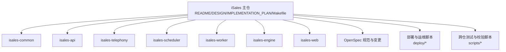
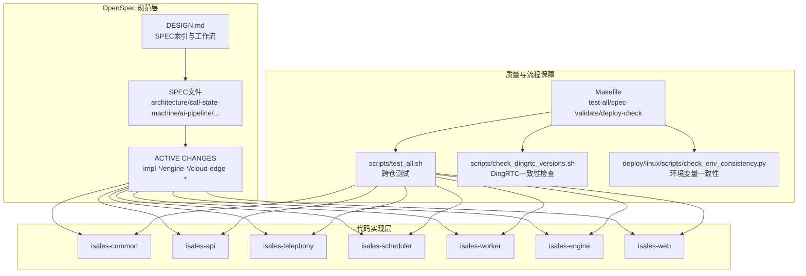
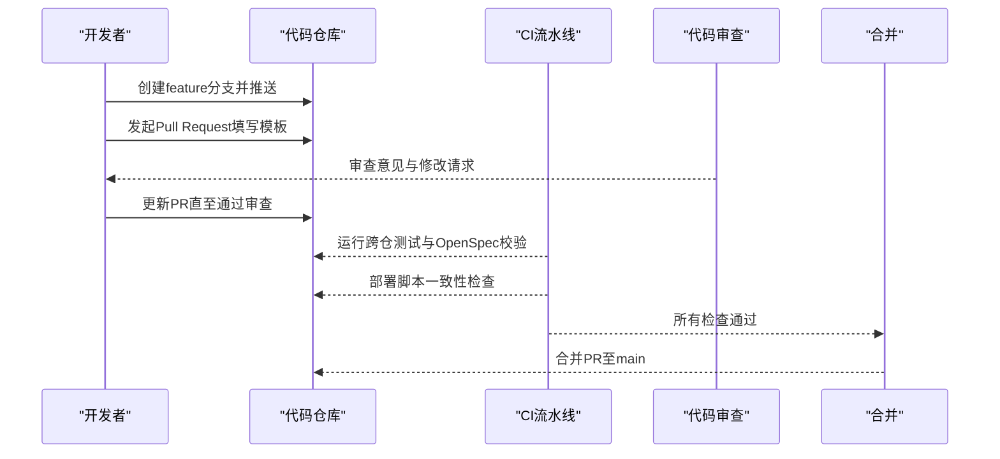
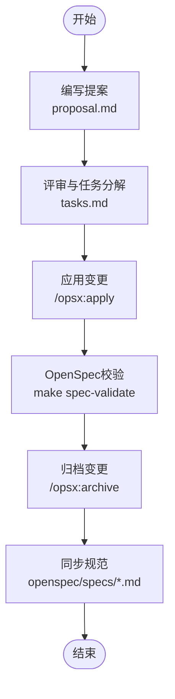
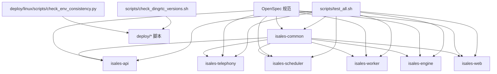

# 贡献流程

<cite>
**本文引用的文件**
- [README.md](file://README.md)
- [DESIGN.md](file://DESIGN.md)
- [IMPLEMENTATION_PLAN.md](file://IMPLEMENTATION_PLAN.md)
- [Makefile](file://Makefile)
- [scripts/test_all.sh](file://scripts/test_all.sh)
- [scripts/check_dingrtc_versions.sh](file://scripts/check_dingrtc_versions.sh)
- [deploy/RUNBOOK.md](file://deploy/RUNBOOK.md)
- [deploy/RUNBOOK-edge.md](file://deploy/RUNBOOK-edge.md)
- [deploy/linux/scripts/check_env_consistency.py](file://deploy/linux/scripts/check_env_consistency.py)
- [openspec/specs/architecture/spec.md](file://openspec/specs/architecture/spec.md)
- [openspec/specs/call-state-machine/spec.md](file://openspec/specs/call-state-machine/spec.md)
- [openspec/specs/ai-pipeline/spec.md](file://openspec/specs/ai-pipeline/spec.md)
- [openspec/specs/role-prompt/spec.md](file://openspec/specs/role-prompt/spec.md)
- [openspec/specs/webhook-callback/spec.md](file://openspec/specs/webhook-callback/spec.md)
- [openspec/specs/retry-followup/spec.md](file://openspec/specs/retry-followup/spec.md)
- [openspec/specs/time-window/spec.md](file://openspec/specs/time-window/spec.md)
- [openspec/specs/device-hardware/spec.md](file://openspec/specs/device-hardware/spec.md)
- [openspec/specs/service-communication/spec.md](file://openspec/specs/service-communication/spec.md)
- [openspec/specs/data-model/spec.md](file://openspec/specs/data-model/spec.md)
- [openspec/specs/web-admin-ui/spec.md](file://openspec/specs/web-admin-ui/spec.md)
- [openspec/v1-roadmap.md](file://openspec/v1-roadmap.md)
- [openspec/v1-roadmap-aliyun-rtc-poc.md](file://openspec/v1-roadmap-aliyun-rtc-poc.md)
- [openspec/v1-roadmap-aliyun-rtc-poc-result.md](file://openspec/v1-roadmap-aliyun-rtc-poc-result.md)
- [openspec/v1-roadmap-a3-context.md](file://openspec/v1-roadmap-a3-context.md)
- [openspec/changes/impl-api/proposal.md](file://openspec/changes/impl-api/proposal.md)
- [openspec/changes/impl-api/tasks.md](file://openspec/changes/impl-api/tasks.md)
- [openspec/changes/impl-scheduler/proposal.md](file://openspec/changes/impl-scheduler/proposal.md)
- [openspec/changes/impl-scheduler/tasks.md](file://openspec/changes/impl-scheduler/tasks.md)
- [openspec/changes/impl-telephony/proposal.md](file://openspec/changes/impl-telephony/proposal.md)
- [openspec/changes/impl-telephony/tasks.md](file://openspec/changes/impl-telephony/tasks.md)
- [openspec/changes/impl-worker/proposal.md](file://openspec/changes/impl-worker/proposal.md)
- [openspec/changes/impl-worker/tasks.md](file://openspec/changes/impl-worker/tasks.md)
- [openspec/changes/impl-engine/proposal.md](file://openspec/changes/impl-engine/proposal.md)
- [openspec/changes/impl-engine/tasks.md](file://openspec/changes/impl-engine/tasks.md)
- [openspec/changes/impl-engine-providers/proposal.md](file://openspec/changes/impl-engine-providers/proposal.md)
- [openspec/changes/impl-engine-providers/tasks.md](file://openspec/changes/impl-engine-providers/tasks.md)
- [openspec/changes/impl-deploy/proposal.md](file://openspec/changes/impl-deploy/proposal.md)
- [openspec/changes/impl-deploy/tasks.md](file://openspec/changes/impl-deploy/tasks.md)
- [openspec/changes/impl-modem-controller/proposal.md](file://openspec/changes/impl-modem-controller/proposal.md)
- [openspec/changes/impl-modem-controller/tasks.md](file://openspec/changes/impl-modem-controller/tasks.md)
- [openspec/changes/impl-deploy-macos/proposal.md](file://openspec/changes/impl-deploy-macos/proposal.md)
- [openspec/changes/impl-deploy-macos/tasks.md](file://openspec/changes/impl-deploy-macos/tasks.md)
- [openspec/changes/impl-real-at/proposal.md](file://openspec/changes/impl-real-at/proposal.md)
- [openspec/changes/impl-real-at/tasks.md](file://openspec/changes/impl-real-at/tasks.md)
- [openspec/changes/impl-web/proposal.md](file://openspec/changes/impl-web/proposal.md)
- [openspec/changes/impl-web/tasks.md](file://openspec/changes/impl-web/tasks.md)
- [openspec/changes/impl-web-polish/tasks.md](file://openspec/changes/impl-web-polish/tasks.md)
- [openspec/changes/impl-provider-credential-db-ssot/proposal.md](file://openspec/changes/impl-provider-credential-db-ssot/proposal.md)
- [openspec/changes/impl-provider-credential-db-ssot/tasks.md](file://openspec/changes/impl-provider-credential-db-ssot/tasks.md)
- [openspec/changes/engine-rtc-dingrtc-migration/proposal.md](file://openspec/changes/engine-rtc-dingrtc-migration/proposal.md)
- [openspec/changes/engine-rtc-dingrtc-migration/design.md](file://openspec/changes/engine-rtc-dingrtc-migration/design.md)
- [openspec/changes/engine-rtc-dingrtc-migration/tasks.md](file://openspec/changes/engine-rtc-dingrtc-migration/tasks.md)
- [openspec/changes/engine-artc-sdk-thread-model/tasks.md](file://openspec/changes/engine-artc-sdk-thread-model/tasks.md)
- [openspec/changes/cloud-edge-grpc-keepalive/proposal.md](file://openspec/changes/cloud-edge-grpc-keepalive/proposal.md)
- [openspec/changes/cloud-edge-grpc-keepalive/tasks.md](file://openspec/changes/cloud-edge-grpc-keepalive/tasks.md)
- [openspec/changes/joint-mvp-gate-13301035545/proposal.md](file://openspec/changes/joint-mvp-gate-13301035545/proposal.md)
- [openspec/changes/joint-mvp-gate-13301035545/tasks.md](file://openspec/changes/joint-mvp-gate-13301035545/tasks.md)
- [openspec/changes/macos-local-audio-dev/proposal.md](file://openspec/changes/macos-local-audio-dev/proposal.md)
- [openspec/changes/macos-local-audio-dev/tasks.md](file://openspec/changes/macos-local-audio-dev/tasks.md)
- [openspec/changes/windows-artc-pybind11/proposal.md](file://openspec/changes/windows-artc-pybind11/proposal.md)
- [openspec/changes/windows-artc-pybind11/tasks.md](file://openspec/changes/windows-artc-pybind11/tasks.md)
- [openspec/changes/windows-artc-pybind11-join-config/proposal.md](file://openspec/changes/windows-artc-pybind11-join-config/proposal.md)
- [openspec/changes/windows-artc-pybind11-join-config/tasks.md](file://openspec/changes/windows-artc-pybind11-join-config/tasks.md)
- [openspec/changes/prompt-template-vars/tasks.md](file://openspec/changes/prompt-template-vars/tasks.md)
</cite>

## 目录
1. [简介](#简介)
2. [项目结构](#项目结构)
3. [核心组件](#核心组件)
4. [架构总览](#架构总览)
5. [详细组件分析](#详细组件分析)
6. [依赖分析](#依赖分析)
7. [性能考虑](#性能考虑)
8. [故障排除指南](#故障排除指南)
9. [结论](#结论)
10. [附录](#附录)

## 简介
本指南面向iSales项目的贡献者，提供从分支策略、Pull Request流程、OpenSpec变更管理到代码质量要求、提交信息规范与版本发布流程的完整说明。iSales采用多仓协作与OpenSpec规范驱动的设计与实施路径，强调“先规范、后编码”，并通过统一的Makefile与脚本保障跨仓测试、OpenSpec校验与部署一致性检查。

## 项目结构
iSales主仓包含OpenSpec规范、实施计划与跨仓工具脚本，核心服务分布在7个子仓中，通过Makefile与脚本进行统一测试与校验。

**图表来源**
- [README.md:75-86](file://README.md#L75-L86)
- [Makefile:1-30](file://Makefile#L1-L30)
- [scripts/test_all.sh:18-29](file://scripts/test_all.sh#L18-L29)

**章节来源**
- [README.md:1-86](file://README.md#L1-L86)
- [Makefile:1-30](file://Makefile#L1-L30)

## 核心组件
- 分支与发布策略
  - main分支保护：禁止直接推送，必须通过Pull Request合并。
  - feature分支：命名形如feature/xxx，建议聚焦单一功能点。
  - hotfix分支：紧急修复场景，命名形如hotfix/xxx，修复后需回并main与release分支。
- Pull Request流程
  - PR模板：包含变更动机、改动范围、测试要点、兼容性影响等。
  - 代码审查：至少一名维护者批准；涉及OpenSpec变更需同步更新spec与active change。
  - CI/CD检查：跨仓测试、OpenSpec校验、部署脚本一致性检查。
- OpenSpec变更管理
  - 提案编写：在openspec/changes/<name>/proposal.md中描述背景、目标、范围与验收。
  - 评审过程：通过变更任务清单tasks.md分解落地，定期status跟踪。
  - 实施与归档：/opsx:apply应用，完成后/opsx:archive归档并同步spec。
- 代码质量要求
  - 单元测试：跨仓统一通过scripts/test_all.sh顺序执行pytest/vitest，失败即阻断。
  - 静态检查：mypy与ruff检查（在各子仓中执行，确保类型与风格一致）。
  - OpenSpec校验：make spec-validate执行openspec validate与DingRTC版本一致性检查。
- 提交信息规范
  - 类型限定：feat、fix、docs、style、refactor、perf、test、build、ci、chore、revert。
  - 范围：可选，如[common]、[api]、[engine]等。
  - 主题：简洁明确，不超过50字符；正文说明动机与影响。
- 版本发布流程
  - 发布前：确保所有变更已在OpenSpec active change中完成并归档；执行跨仓测试与OpenSpec校验。
  - 标签与发布：遵循语义化版本，生成变更日志，同步更新各子仓版本与依赖。
- 社区贡献与行为准则
  - 尊重与包容：遵守开源社区行为准则，保持建设性沟通。
  - 问题反馈：优先搜索已有Issue，新建Issue时提供复现步骤与环境信息。
  - 代码贡献：遵循分支与PR流程，确保测试与文档同步更新。

**章节来源**
- [README.md:75-86](file://README.md#L75-L86)
- [DESIGN.md:49-55](file://DESIGN.md#L49-L55)
- [IMPLEMENTATION_PLAN.md:298-362](file://IMPLEMENTATION_PLAN.md#L298-L362)
- [Makefile:14-17](file://Makefile#L14-L17)
- [scripts/test_all.sh:120-126](file://scripts/test_all.sh#L120-L126)

## 架构总览
下图展示iSales的多仓协作与OpenSpec驱动的实施路径，以及跨仓测试与OpenSpec校验在CI中的位置。

**图表来源**
- [README.md:75-86](file://README.md#L75-L86)
- [DESIGN.md:49-55](file://DESIGN.md#L49-L55)
- [Makefile:14-29](file://Makefile#L14-L29)
- [scripts/test_all.sh:18-29](file://scripts/test_all.sh#L18-L29)

## 详细组件分析

### Git分支管理策略
- main分支保护
  - 禁止直接推送；所有改动通过Pull Request合并。
  - 合并前需通过CI检查（跨仓测试、OpenSpec校验、部署脚本一致性）。
- feature分支命名规范
  - 建议以feature/开头，如feature/new-campaign-ui；聚焦单一功能点，避免大而全的提交。
- hotfix分支使用场景
  - 生产紧急修复；修复后需回并main与release分支，并在OpenSpec中记录归档。

**章节来源**
- [README.md:75-86](file://README.md#L75-L86)

### Pull Request流程
- PR模板填写
  - 变更动机、改动范围、测试要点、兼容性影响、相关Issue链接。
- 代码审查要求
  - 至少一名维护者批准；涉及OpenSpec变更需同步更新spec与active change。
- CI/CD检查项
  - 跨仓测试：scripts/test_all.sh顺序执行pytest/vitest，失败即阻断。
  - OpenSpec校验：make spec-validate执行openspec validate与DingRTC版本一致性检查。
  - 部署脚本一致性：shellcheck与环境变量一致性检查。

**图表来源**
- [Makefile:5-6](file://Makefile#L5-L6)
- [Makefile:14-17](file://Makefile#L14-L17)
- [Makefile:22-29](file://Makefile#L22-L29)
- [scripts/test_all.sh:120-126](file://scripts/test_all.sh#L120-L126)

**章节来源**
- [Makefile:5-6](file://Makefile#L5-L6)
- [Makefile:14-17](file://Makefile#L14-L17)
- [Makefile:22-29](file://Makefile#L22-L29)
- [scripts/test_all.sh:120-126](file://scripts/test_all.sh#L120-L126)

### OpenSpec变更管理流程
- 变更提案编写
  - 在openspec/changes/<name>/proposal.md中描述背景、目标、范围与验收。
- 评审过程
  - 通过变更任务清单tasks.md分解落地，定期status跟踪。
- 实施与归档
  - /opsx:apply应用，完成后/opsx:archive归档并同步spec。
- 常用命令
  - 列出active changes、查看单change进度、起草新change、应用与归档。

**图表来源**
- [DESIGN.md:49-55](file://DESIGN.md#L49-L55)
- [README.md:75-86](file://README.md#L75-L86)

**章节来源**
- [DESIGN.md:49-55](file://DESIGN.md#L49-L55)
- [README.md:75-86](file://README.md#L75-L86)

### 代码质量要求
- 单元测试覆盖率
  - 跨仓统一通过scripts/test_all.sh顺序执行pytest/vitest，失败即阻断。
- mypy静态检查
  - 在各子仓中执行，确保类型注解与静态检查通过。
- ruff代码规范检查
  - 在各子仓中执行，确保代码风格符合团队约定。
- OpenSpec校验
  - make spec-validate执行openspec validate与DingRTC版本一致性检查。

**章节来源**
- [scripts/test_all.sh:120-126](file://scripts/test_all.sh#L120-L126)
- [Makefile:14-17](file://Makefile#L14-L17)

### 提交信息规范
- 类型限定：feat、fix、docs、style、refactor、perf、test、build、ci、chore、revert。
- 范围：可选，如[common]、[api]、[engine]等。
- 主题：简洁明确，不超过50字符；正文说明动机与影响。

**章节来源**
- [README.md:75-86](file://README.md#L75-L86)

### 版本发布流程
- 发布前
  - 确保所有变更已在OpenSpec active change中完成并归档；执行跨仓测试与OpenSpec校验。
- 标签与发布
  - 遵循语义化版本，生成变更日志，同步更新各子仓版本与依赖。

**章节来源**
- [README.md:75-86](file://README.md#L75-L86)

### 社区贡献指南与行为准则
- 尊重与包容：遵守开源社区行为准则，保持建设性沟通。
- 问题反馈：优先搜索已有Issue，新建Issue时提供复现步骤与环境信息。
- 代码贡献：遵循分支与PR流程，确保测试与文档同步更新。

**章节来源**
- [README.md:75-86](file://README.md#L75-L86)

## 依赖分析
- 组件耦合与协作
  - isales-common为上游共享库，被其余6个服务依赖；OpenSpec规范驱动各服务的边界与接口。
  - 跨仓测试脚本scripts/test_all.sh按固定顺序执行各仓测试，确保整体健康。
- 外部依赖与集成点
  - DingRTC SDK版本在多处文档与脚本中交叉引用，通过scripts/check_dingrtc_versions.sh保证一致性。
  - 部署脚本通过shellcheck与环境变量一致性检查，降低运维风险。

**图表来源**
- [scripts/test_all.sh:18-29](file://scripts/test_all.sh#L18-L29)
- [scripts/check_dingrtc_versions.sh:18-33](file://scripts/check_dingrtc_versions.sh#L18-L33)
- [deploy/linux/scripts/check_env_consistency.py](file://deploy/linux/scripts/check_env_consistency.py)

**章节来源**
- [scripts/test_all.sh:18-29](file://scripts/test_all.sh#L18-L29)
- [scripts/check_dingrtc_versions.sh:18-33](file://scripts/check_dingrtc_versions.sh#L18-L33)

## 性能考虑
- 跨仓测试顺序与并行度
  - scripts/test_all.sh按固定顺序执行，避免资源竞争；如需加速可结合子仓内部并行测试策略。
- OpenSpec校验与DingRTC一致性检查
  - make spec-validate在CI中频繁执行，确保规范与实现一致，减少回归风险。
- 部署脚本静态检查
  - shellcheck与环境变量一致性检查有助于提前发现潜在问题，降低生产事故概率。

**章节来源**
- [Makefile:14-17](file://Makefile#L14-L17)
- [scripts/check_dingrtc_versions.sh:18-33](file://scripts/check_dingrtc_versions.sh#L18-L33)

## 故障排除指南
- 跨仓测试失败
  - 使用scripts/test_all.sh定位失败仓库，逐仓修复后再重新触发CI。
- OpenSpec校验失败
  - 执行make spec-validate，根据提示修正spec或active change中的结构问题。
- DingRTC版本不一致
  - 运行scripts/check_dingrtc_versions.sh，核对deploy/cloud/STATE.md与各引用文件中的版本与sha256。
- 部署脚本问题
  - 使用make deploy-check进行shellcheck与环境变量一致性检查，修正警告与不一致项。

**章节来源**
- [scripts/test_all.sh:140-145](file://scripts/test_all.sh#L140-L145)
- [Makefile:14-17](file://Makefile#L14-L17)
- [scripts/check_dingrtc_versions.sh:179-188](file://scripts/check_dingrtc_versions.sh#L179-L188)
- [Makefile:22-29](file://Makefile#L22-L29)

## 结论
iSales通过OpenSpec规范驱动设计与实施，配合统一的Makefile与脚本保障跨仓测试、OpenSpec校验与部署一致性检查，形成从分支策略、PR流程到发布与运维的闭环。贡献者遵循本文档的规范与流程，可高效、高质量地参与项目演进。

## 附录
- OpenSpec规范索引
  - 架构与总体设计：[architecture/spec.md](file://openspec/specs/architecture/spec.md)
  - 通话状态机：[call-state-machine/spec.md](file://openspec/specs/call-state-machine/spec.md)
  - AI三层管线：[ai-pipeline/spec.md](file://openspec/specs/ai-pipeline/spec.md)
  - 角色Prompt：[role-prompt/spec.md](file://openspec/specs/role-prompt/spec.md)
  - Webhook回调：[webhook-callback/spec.md](file://openspec/specs/webhook-callback/spec.md)
  - 重试与跟进：[retry-followup/spec.md](file://openspec/specs/retry-followup/spec.md)
  - 时间窗口：[time-window/spec.md](file://openspec/specs/time-window/spec.md)
  - 硬件层：[device-hardware/spec.md](file://openspec/specs/device-hardware/spec.md)
  - 服务通信：[service-communication/spec.md](file://openspec/specs/service-communication/spec.md)
  - 数据模型：[data-model/spec.md](file://openspec/specs/data-model/spec.md)
  - 管理界面：[web-admin-ui/spec.md](file://openspec/specs/web-admin-ui/spec.md)
- OpenSpec路线图与POC
  - v1路线图：[v1-roadmap.md](file://openspec/v1-roadmap.md)
  - 阿里云RTC POC：[v1-roadmap-aliyun-rtc-poc.md](file://openspec/v1-roadmap-aliyun-rtc-poc.md)、[v1-roadmap-aliyun-rtc-poc-result.md](file://openspec/v1-roadmap-aliyun-rtc-poc-result.md)、[v1-roadmap-a3-context.md](file://openspec/v1-roadmap-a3-context.md)
- OpenSpec变更示例
  - API实施：[proposal.md](file://openspec/changes/impl-api/proposal.md)、[tasks.md](file://openspec/changes/impl-api/tasks.md)
  - 调度器实施：[proposal.md](file://openspec/changes/impl-scheduler/proposal.md)、[tasks.md](file://openspec/changes/impl-scheduler/tasks.md)
  - 电话服务实施：[proposal.md](file://openspec/changes/impl-telephony/proposal.md)、[tasks.md](file://openspec/changes/impl-telephony/tasks.md)
  - Worker实施：[proposal.md](file://openspec/changes/impl-worker/proposal.md)、[tasks.md](file://openspec/changes/impl-worker/tasks.md)
  - 引擎骨架：[proposal.md](file://openspec/changes/impl-engine/proposal.md)、[tasks.md](file://openspec/changes/impl-engine/tasks.md)
  - 引擎Provider接入：[proposal.md](file://openspec/changes/impl-engine-providers/proposal.md)、[tasks.md](file://openspec/changes/impl-engine-providers/tasks.md)
  - 部署实施：[proposal.md](file://openspec/changes/impl-deploy/proposal.md)、[tasks.md](file://openspec/changes/impl-deploy/tasks.md)
  - 调制解调器控制器：[proposal.md](file://openspec/changes/impl-modem-controller/proposal.md)、[tasks.md](file://openspec/changes/impl-modem-controller/tasks.md)
  - macOS部署：[proposal.md](file://openspec/changes/impl-deploy-macos/proposal.md)、[tasks.md](file://openspec/changes/impl-deploy-macos/tasks.md)
  - 真实AT拨号：[proposal.md](file://openspec/changes/impl-real-at/proposal.md)、[tasks.md](file://openspec/changes/impl-real-at/tasks.md)
  - Web管理界面：[proposal.md](file://openspec/changes/impl-web/proposal.md)、[tasks.md](file://openspec/changes/impl-web/tasks.md)
  - Web界面优化：[tasks.md](file://openspec/changes/impl-web-polish/tasks.md)
  - Provider凭据SSOT：[proposal.md](file://openspec/changes/impl-provider-credential-db-ssot/proposal.md)、[tasks.md](file://openspec/changes/impl-provider-credential-db-ssot/tasks.md)
  - DingRTC迁移：[proposal.md](file://openspec/changes/engine-rtc-dingrtc-migration/proposal.md)、[design.md](file://openspec/changes/engine-rtc-dingrtc-migration/design.md)、[tasks.md](file://openspec/changes/engine-rtc-dingrtc-migration/tasks.md)
  - 引擎线程模型：[tasks.md](file://openspec/changes/engine-artc-sdk-thread-model/tasks.md)
  - 云边GRPC保活：[proposal.md](file://openspec/changes/cloud-edge-grpc-keepalive/proposal.md)、[tasks.md](file://openspec/changes/cloud-edge-grpc-keepalive/tasks.md)
  - 联合MVP门禁：[proposal.md](file://openspec/changes/joint-mvp-gate-13301035545/proposal.md)、[tasks.md](file://openspec/changes/joint-mvp-gate-13301035545/tasks.md)
  - macOS本地音频设备：[proposal.md](file://openspec/changes/macos-local-audio-dev/proposal.md)、[tasks.md](file://openspec/changes/macos-local-audio-dev/tasks.md)
  - Windows ARTC绑定：[proposal.md](file://openspec/changes/windows-artc-pybind11/proposal.md)、[tasks.md](file://openspec/changes/windows-artc-pybind11/tasks.md)
  - Windows ARTC加入配置：[proposal.md](file://openspec/changes/windows-artc-pybind11-join-config/proposal.md)、[tasks.md](file://openspec/changes/windows-artc-pybind11-join-config/tasks.md)
  - Prompt模板变量：[tasks.md](file://openspec/changes/prompt-template-vars/tasks.md)

**章节来源**
- [README.md:75-86](file://README.md#L75-L86)
- [DESIGN.md:9-75](file://DESIGN.md#L9-L75)
- [IMPLEMENTATION_PLAN.md:45-389](file://IMPLEMENTATION_PLAN.md#L45-L389)