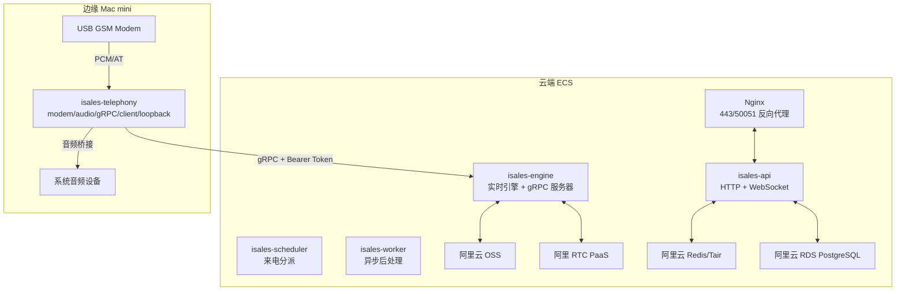
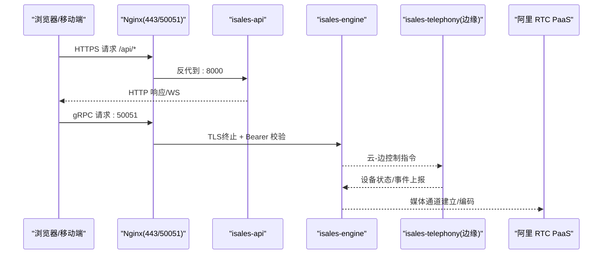
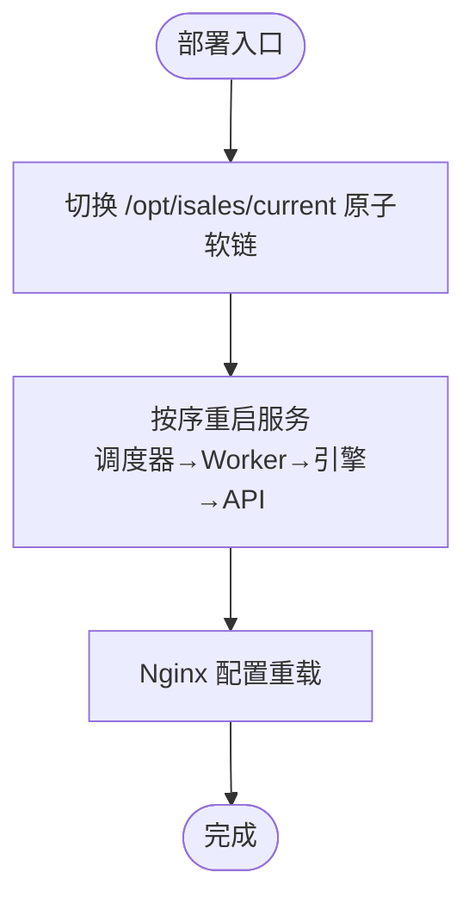
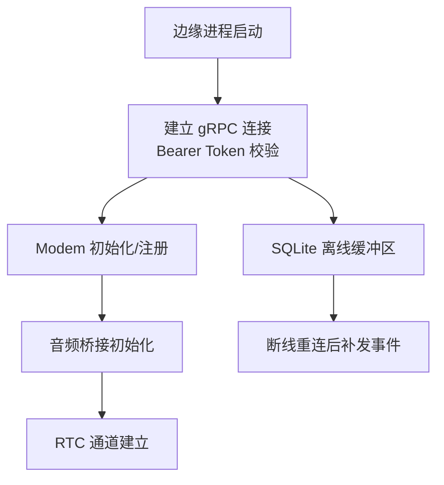
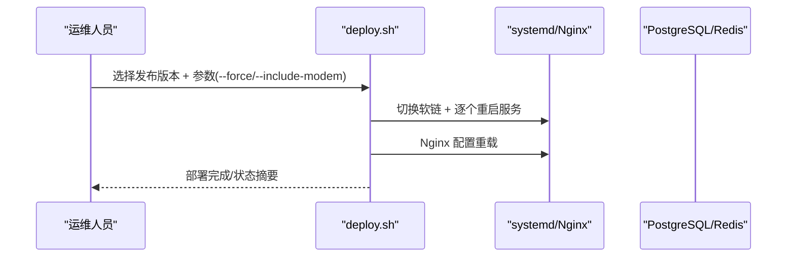
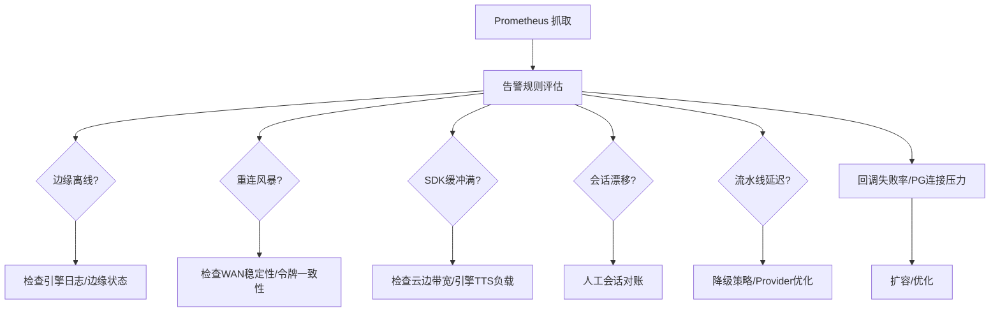
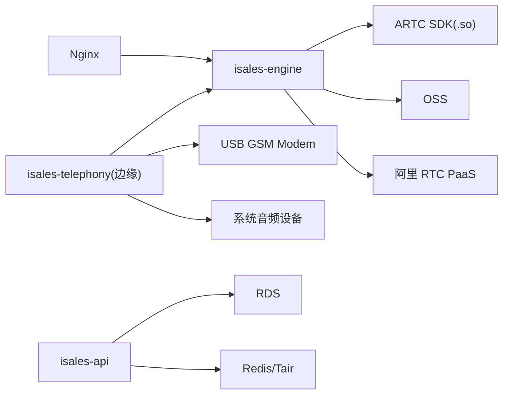

# 故障排查与运维手册

<cite>
**本文引用的文件**
- [RUNBOOK.md](file://deploy/RUNBOOK.md)
- [RUNBOOK-edge.md](file://deploy/RUNBOOK-edge.md)
- [cloud/README.md](file://deploy/cloud/README.md)
- [edge/README.md](file://deploy/edge/README.md)
- [monitoring/README.md](file://deploy/monitoring/README.md)
- [cloud/monitoring/prometheus.yml.example](file://deploy/cloud/monitoring/prometheus.yml.example)
- [cloud/monitoring/alert_rules.yml.example](file://deploy/cloud/monitoring/alert_rules.yml.example)
- [cloud/systemd/isales-api.service](file://deploy/cloud/systemd/isales-api.service)
- [cloud/systemd/isales-engine.service](file://deploy/cloud/systemd/isales-engine.service)
- [cloud/nginx/isales.conf](file://deploy/cloud/nginx/isales.conf)
- [linux/scripts/deploy.sh](file://deploy/linux/scripts/deploy.sh)
- [linux/scripts/rollback.sh](file://deploy/linux/scripts/rollback.sh)
- [cloud/scripts/install.sh](file://deploy/cloud/scripts/install.sh)
- [edge/scripts/install.sh](file://deploy/edge/scripts/install.sh)
- [common/_lib.sh](file://deploy/common/_lib.sh)
</cite>

## 目录
1. [简介](#简介)
2. [项目结构](#项目结构)
3. [核心组件](#核心组件)
4. [架构总览](#架构总览)
5. [详细组件分析](#详细组件分析)
6. [依赖关系分析](#依赖关系分析)
7. [性能考虑](#性能考虑)
8. [故障排查指南](#故障排查指南)
9. [结论](#结论)
10. [附录](#附录)

## 简介
本手册面向iSales系统的生产运维与应急响应，基于RUNBOOK文档提供系统化的故障诊断流程、监控指标与告警阈值、性能调优与容量规划、备份恢复演练、日志分析与调试工具使用、以及云边部署模式下的专项处置方案。内容覆盖部署问题、服务异常、数据库与缓存连接、网络通信、硬件设备故障等常见场景，并提供预防性维护与最佳实践建议。

## 项目结构
iSales采用“云-边”分离的双栈部署形态：
- 云端（ECS）：运行API、引擎、调度器、Worker与Web反向代理，负责业务编排与实时通话引擎。
- 边缘（Mac mini）：运行telephony单一进程，包含modem控制器、音频桥接、云边gRPC客户端与本地telephony API回环，负责设备接入与媒体面处理。
- 监控：Prometheus抓取各服务指标，结合Grafana仪表盘与告警规则，形成闭环观测。

图表来源
- [cloud/README.md:10-53](file://deploy/cloud/README.md#L10-L53)
- [edge/README.md:10-40](file://deploy/edge/README.md#L10-L40)

章节来源
- [cloud/README.md:1-118](file://deploy/cloud/README.md#L1-L118)
- [edge/README.md:1-99](file://deploy/edge/README.md#L1-L99)

## 核心组件
- 云端服务单元与配置
  - systemd服务单元：API、引擎、调度器、Worker，均通过集中化EnvironmentFile加载环境变量。
  - Nginx配置：443反代Web与API，50051反代引擎gRPC（TLS终止与Bearer校验）。
- 边缘进程与状态
  - LaunchAgent单一进程承载modem/audio/gRPC/client/loopback，状态数据存储于用户目录Application Support。
- 部署与回滚脚本
  - Linux/macOS统一的部署/回滚框架，支持低峰窗口门禁、原子软链切换、按序重启与Nginx重载。
- 监控模板
  - Prometheus抓取作业与告警规则示例，定义云边流健康、SDK健康、引擎流水线延迟预算等关键指标。

章节来源
- [cloud/systemd/isales-api.service:1-35](file://deploy/cloud/systemd/isales-api.service#L1-L35)
- [cloud/systemd/isales-engine.service:1-42](file://deploy/cloud/systemd/isales-engine.service#L1-L42)
- [cloud/nginx/isales.conf:1-103](file://deploy/cloud/nginx/isales.conf#L1-L103)
- [edge/scripts/install.sh:1-222](file://deploy/edge/scripts/install.sh#L1-L222)
- [linux/scripts/deploy.sh:1-139](file://deploy/linux/scripts/deploy.sh#L1-L139)
- [linux/scripts/rollback.sh:1-114](file://deploy/linux/scripts/rollback.sh#L1-L114)
- [monitoring/README.md:1-65](file://deploy/monitoring/README.md#L1-L65)

## 架构总览
- 云-边拓扑与端口职责
  - 443：Web SPA + API（HTTPS）
  - 50051：引擎gRPC（云-边双向流，TLS终止于Nginx，身份由Bearer Token携带）
  - 80：HTTP 301至HTTPS
- 服务间通信
  - API/调度器/Worker通过PostgreSQL与Redis交互；引擎与阿里RTC对接媒体面；边缘通过gRPC与云端建立长连接。
- 硬件耦合
  - 边缘Modem与音频设备为关键硬件，需在部署/回滚时评估影响。

图表来源
- [cloud/nginx/isales.conf:26-102](file://deploy/cloud/nginx/isales.conf#L26-L102)
- [cloud/systemd/isales-engine.service:1-42](file://deploy/cloud/systemd/isales-engine.service#L1-L42)
- [edge/README.md:10-40](file://deploy/edge/README.md#L10-L40)

## 详细组件分析

### 云端服务单元与安全加固
- API服务单元
  - 使用集中化EnvironmentFile加载API环境变量，启用严格保护参数，限制地址族与命名空间，增强安全性。
- 引擎服务单元
  - 需要ARTC SDK共享库可见，通过环境变量注入LD_LIBRARY_PATH与PYTHONPATH；设置Graceful Shutdown超时以保障通话完整性。
- 部署与重启顺序
  - 云端部署按调度器→Worker→引擎→API顺序重启，确保依赖链正确；Nginx仅重载配置。

图表来源
- [cloud/scripts/install.sh:68-94](file://deploy/cloud/scripts/install.sh#L68-L94)
- [cloud/systemd/isales-api.service:6-31](file://deploy/cloud/systemd/isales-api.service#L6-L31)
- [cloud/systemd/isales-engine.service:8-38](file://deploy/cloud/systemd/isales-engine.service#L8-L38)

章节来源
- [cloud/systemd/isales-api.service:1-35](file://deploy/cloud/systemd/isales-api.service#L1-L35)
- [cloud/systemd/isales-engine.service:1-42](file://deploy/cloud/systemd/isales-engine.service#L1-L42)
- [cloud/scripts/install.sh:1-300](file://deploy/cloud/scripts/install.sh#L1-L300)

### 边缘进程与硬件诊断
- 单一LaunchAgent进程包含modem控制器、音频桥接、云边gRPC客户端与本地telephony API回环。
- 状态与日志
  - SQLite离线缓冲区位于用户目录Application Support，录音文件存放于同一目录。
  - 日志输出到用户目录Logs，支持结构化日志流。
- 硬件与网络
  - 串口路径变更需更新edge.env中的ISALES_MODEM_SERIAL_PATH；gRPC与TLS握手可通过nc与openssl验证；mtr用于WAN抖动监测。

图表来源
- [edge/README.md:10-40](file://deploy/edge/README.md#L10-L40)
- [RUNBOOK-edge.md:166-195](file://deploy/RUNBOOK-edge.md#L166-L195)

章节来源
- [edge/README.md:1-99](file://deploy/edge/README.md#L1-L99)
- [RUNBOOK-edge.md:1-254](file://deploy/RUNBOOK-edge.md#L1-L254)

### 部署与回滚流程
- 部署（Linux/macOS）
  - 低峰窗口门禁：默认22:00–08:00，非低峰需--force；引擎重启会中断在途通话。
  - 原子软链切换后按序重启服务，Nginx重载。
- 回滚
  - 切换软链后按相同顺序重启；数据库schema默认保持前向应用（必要时参考RUNBOOK手动降级）。

图表来源
- [linux/scripts/deploy.sh:10-114](file://deploy/linux/scripts/deploy.sh#L10-L114)
- [linux/scripts/rollback.sh:78-111](file://deploy/linux/scripts/rollback.sh#L78-L111)

章节来源
- [linux/scripts/deploy.sh:1-139](file://deploy/linux/scripts/deploy.sh#L1-L139)
- [linux/scripts/rollback.sh:1-114](file://deploy/linux/scripts/rollback.sh#L1-L114)

### 监控与告警
- 指标端点现状
  - 当前多数服务尚未实现/metrics端点，建议在后续迭代中补齐，以冻结监控契约。
- 关键告警规则（云-边拓扑）
  - 边缘离线：云边心跳长时间未到达触发。
  - 重连风暴：短时间内频繁断线。
  - SDK健康：push_audio缓冲满频率过高。
  - 会话数量漂移：RTC会话数与活跃通话计数不一致。
  - 引擎流水线延迟预算：首TTS字节P95超阈值。
  - 回调失败率与PG连接压力：继承自单主机监控。

图表来源
- [monitoring/README.md:30-48](file://deploy/monitoring/README.md#L30-L48)
- [cloud/monitoring/prometheus.yml.example:17-77](file://deploy/cloud/monitoring/prometheus.yml.example#L17-L77)
- [cloud/monitoring/alert_rules.yml.example:8-116](file://deploy/cloud/monitoring/alert_rules.yml.example#L8-L116)

章节来源
- [monitoring/README.md:1-65](file://deploy/monitoring/README.md#L1-L65)
- [cloud/monitoring/prometheus.yml.example:1-77](file://deploy/cloud/monitoring/prometheus.yml.example#L1-L77)
- [cloud/monitoring/alert_rules.yml.example:1-116](file://deploy/cloud/monitoring/alert_rules.yml.example#L1-L116)

## 依赖关系分析
- 组件耦合
  - 引擎与ARTC SDK共享库存在运行时依赖；Nginx负责TLS终止与gRPC反代。
  - 边缘进程与Modem/Audio硬件强耦合，升级/回滚需评估影响。
- 外部依赖
  - 阿里云托管中间件（RDS/Redis/OSS）、RTC PaaS；公网出网要求（443/TCP + UDP范围）。
- 配置契约
  - systemd环境文件集中化管理；边缘用户级env文件独立于系统级。

图表来源
- [cloud/systemd/isales-engine.service:20-25](file://deploy/cloud/systemd/isales-engine.service#L20-L25)
- [cloud/nginx/isales.conf:71-102](file://deploy/cloud/nginx/isales.conf#L71-L102)
- [edge/README.md:22-32](file://deploy/edge/README.md#L22-L32)

章节来源
- [cloud/systemd/isales-engine.service:1-42](file://deploy/cloud/systemd/isales-engine.service#L1-L42)
- [cloud/nginx/isales.conf:1-103](file://deploy/cloud/nginx/isales.conf#L1-L103)
- [edge/README.md:1-99](file://deploy/edge/README.md#L1-L99)

## 性能考虑
- 引擎流水线延迟预算
  - 首TTS字节P95超800ms触发告警，建议优先优化Provider延迟，必要时降级多角色为单角色。
- SDK缓冲与带宽
  - push_audio缓冲满频繁告警提示云边链路拥塞或引擎TTS突发，需优化链路或降低TTS速率。
- 会话数量一致性
  - 会话数与活跃通话计数漂移需人工对账，防止资源泄漏。
- 回调失败率与PG连接压力
  - 回调失败率>20%或PG连接>80%需扩容或优化查询。

章节来源
- [cloud/monitoring/alert_rules.yml.example:71-116](file://deploy/cloud/monitoring/alert_rules.yml.example#L71-L116)

## 故障排查指南

### 部署问题
- 低峰窗口门禁
  - 非低峰执行部署需--force，引擎重启会中断在途通话。
- 原子软链切换失败
  - 检查目标发布目录与虚拟环境是否就绪；确认软链权限与属主。
- Nginx重载失败
  - 先语法检查配置，再重载；确认站点启用与SSL证书可用。

章节来源
- [linux/scripts/deploy.sh:51-68](file://deploy/linux/scripts/deploy.sh#L51-L68)
- [cloud/scripts/install.sh:224-243](file://deploy/cloud/scripts/install.sh#L224-L243)

### 服务异常
- API/引擎/调度器/Worker状态异常
  - 使用systemctl/status查看状态与PID；查看journalctl错误日志定位。
- Nginx 502
  - 直接访问后端健康端点验证；确认API服务状态与端口监听。

章节来源
- [RUNBOOK.md:180-196](file://deploy/RUNBOOK.md#L180-L196)
- [cloud/nginx/isales.conf:44-63](file://deploy/cloud/nginx/isales.conf#L44-L63)

### 数据库与缓存连接
- PostgreSQL连接拒绝
  - 检查postgresql服务状态与磁盘空间；查看系统日志。
- Redis内存溢出
  - 使用info memory查看内存使用；调整maxmemory或淘汰策略。

章节来源
- [RUNBOOK.md:167-168](file://deploy/RUNBOOK.md#L167-L168)

### 网络通信
- 云-边gRPC不可达
  - DNS解析与TCP连通性检查；TLS握手验证；使用grpcurl携带Bearer Token进行列表测试。
- WAN抖动
  - 使用mtr监测路径稳定性。

章节来源
- [RUNBOOK-edge.md:166-195](file://deploy/RUNBOOK-edge.md#L166-L195)

### 硬件设备故障
- Modem断连/未识别
  - 查看udev/ioreg事件；重新插拔USB；确认串口路径；检查AT命令返回。
- 音频问题
  - 使用系统音频设备查询工具确认设备；设置ISALES_AUDIO_DEVICE_NAME区分多设备。

章节来源
- [RUNBOOK.md:169-171](file://deploy/RUNBOOK.md#L169-L171)
- [RUNBOOK.md:348-357](file://deploy/RUNBOOK.md#L348-L357)

### 备份与恢复演练
- PG恢复
  - 新建测试库，恢复SQL快照，验证alembic版本与关键表行数。
- Redis恢复
  - 停止服务替换dump.rdb，启动后验证键空间大小与关键键。

章节来源
- [RUNBOOK.md:124-157](file://deploy/RUNBOOK.md#L124-L157)

### 日志分析与调试工具
- Linux
  - journalctl按时间过滤错误日志；systemctl批量状态概览。
- macOS
  - log stream结构化日志；launchctl打印状态；brew services管理。

章节来源
- [RUNBOOK.md:188-196](file://deploy/RUNBOOK.md#L188-L196)
- [RUNBOOK.md:371-379](file://deploy/RUNBOOK.md#L371-L379)

### 应急响应与灾难恢复
- 应急流程
  - 立即确认边缘离线/重连风暴告警；核对gRPC/TLS连通性；检查Modem与音频状态。
- 灾难恢复
  - 回滚至上一稳定版本；执行备份恢复演练；评估数据库schema降级风险。

章节来源
- [RUNBOOK.md:118-119](file://deploy/RUNBOOK.md#L118-L119)
- [RUNBOOK.md:97-115](file://deploy/RUNBOOK.md#L97-L115)

### 云边部署专项
- 边缘进程启动失败
  - 检查LaunchAgent最后退出码；确认edge.env中设备ID/Token/URL正确。
- 升级后崩溃
  - 使用回滚脚本切换到上一版本；检查ARTC SDK路径是否存在。
- 离线缓冲堆积
  - 查询SQLite事件计数与序列范围；必要时停止进程后清空events表并重启。

章节来源
- [RUNBOOK-edge.md:241-251](file://deploy/RUNBOOK-edge.md#L241-L251)
- [RUNBOOK-edge.md:136-164](file://deploy/RUNBOOK-edge.md#L136-L164)

## 结论
本手册提供了iSales系统在云-边部署模式下的全栈运维指南。通过标准化的部署/回滚流程、完善的监控告警、详尽的故障排查步骤与应急响应方案，可有效提升系统的稳定性与可维护性。建议在生产环境中持续完善/metrics端点，细化容量规划与性能基线，并定期开展备份恢复演练与跨团队协同演练。

## 附录

### 监控指标与告警阈值速查
- 边缘离线：心跳超时>120秒
- 重连风暴：5分钟内断线>5次
- SDK缓冲满：30秒窗口>3次
- 会话漂移：会话数与活跃通话差>1
- 引擎流水线延迟：首TTS P95>800ms
- 回调失败率：>20%
- PG连接压力：>80%

章节来源
- [cloud/monitoring/alert_rules.yml.example:14-116](file://deploy/cloud/monitoring/alert_rules.yml.example#L14-L116)

### 预防性维护建议
- 定期演练备份恢复与回滚流程。
- 持续优化Provider与网络链路，控制SDK缓冲满频率。
- 建立跨团队值班与沟通机制，确保告警响应及时。