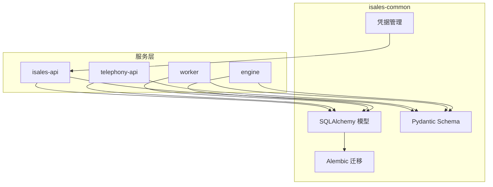
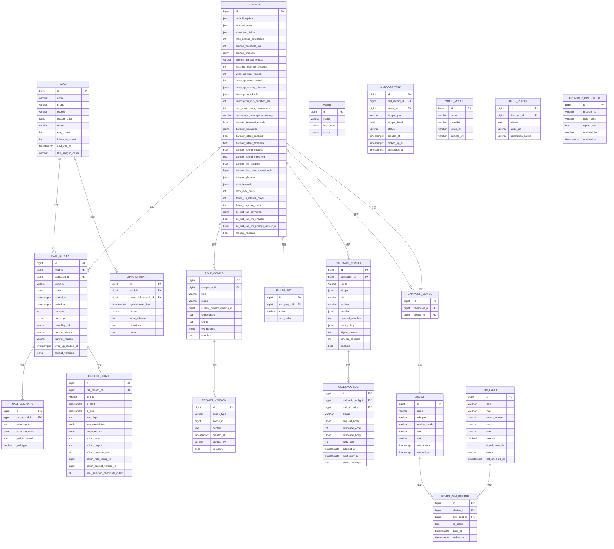
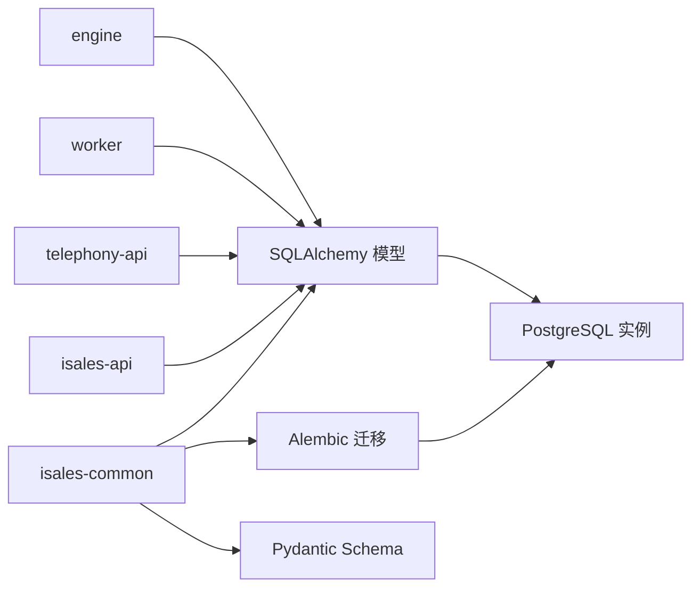

# 数据模型设计

<cite>
**本文引用的文件**
- [数据模型规范](file://openspec/specs/data-model/spec.md)
- [初始化 isales-common 任务清单](file://openspec/changes/archive/2026-05-01-init-isales-common/tasks.md)
- [SSOT 凭据实现任务清单](file://openspec/changes/archive/2026-05-24-impl-provider-credential-db-ssot/tasks.md)
- [重试与跟进能力规范](file://openspec/specs/retry-followup/spec.md)
- [Alembic 迁移脚本（Linux）](file://deploy/linux/scripts/migrate.sh)
- [Alembic 迁移脚本（macOS）](file://deploy/macos/scripts/migrate.sh)
- [设备选择集成任务清单](file://openspec/changes/archive/2026-05-06-impl-scheduler/tasks.md)
</cite>

## 目录
1. [简介](#简介)
2. [项目结构](#项目结构)
3. [核心组件](#核心组件)
4. [架构总览](#架构总览)
5. [详细组件分析](#详细组件分析)
6. [依赖分析](#依赖分析)
7. [性能考虑](#性能考虑)
8. [故障排除指南](#故障排除指南)
9. [结论](#结论)
10. [附录](#附录)

## 简介
本文件为 iSales 数据模型的全面数据建模文档，聚焦核心实体关系、字段定义与数据类型，明确主键/外键、索引与约束，并解释数据验证与业务规则。文档还涵盖数据库模式图、示例数据、数据访问模式、缓存策略、性能考量、数据生命周期与保留策略、归档规则、数据迁移路径与版本管理、数据安全与隐私要求、访问控制，以及 JSONB 字段使用规范与最佳实践。最后提供数据模型演进历史与未来规划。

## 项目结构
iSales 将数据模型统一由 isales-common 管理，其他服务通过依赖访问。数据库采用单一 PostgreSQL 实例，所有表位于同一 schema，跨服务事务使用 PG 事务，避免分布式事务。

**章节来源**
- [数据模型规范: 第52-60条:52-60](file://openspec/specs/data-model/spec.md#L52-L60)

## 核心组件
本节概述核心数据表及其归属服务，字段清单与职责边界。

- campaign：营销活动配置，包含重试策略、时间窗、提取字段、静默激活、打断检测、转接策略、回调触发等 JSONB 配置。
- holiday：节假日信息，支持按地区生效。
- agent：坐席信息，含在线状态。
- handoff_task：人工转接任务，关联通话记录与坐席。
- role_config：角色提示词配置，包含模型参数与提示词版本。
- prompt_version：提示词版本管理。
- pipeline_trace：通话流水追踪，记录每轮对话的开始/结束、输入输出与评分。
- lead：潜在客户，包含重试/跟进计数、下次拨打电话时间、挂断原因与自定义数据。
- call_record：通话记录，包含转写文本、转接状态、包装时间等。
- call_summary：通话摘要与抽取字段。
- appointment：预约管理，关联 lead，支持从通话创建。
- voice_model：语音模型元数据。
- filler_set / filler_phrase：填充短语集合与短语。
- callback_config / callback_log：外呼回调配置与日志。
- device / sim_card / device_sim_binding：设备与 SIM 卡管理及绑定关系。
- campaign_device：活动与设备的关联表。
- provider_credential：第三方提供商凭据的加密存储。

**章节来源**
- [数据模型规范: 第28-50条:28-50](file://openspec/specs/data-model/spec.md#L28-L50)

## 架构总览
下图展示数据模型在服务间的分布与交互，强调归属服务与跨服务读写边界。

**图表来源**
- [数据模型规范: 第28-50条:28-50](file://openspec/specs/data-model/spec.md#L28-L50)

**章节来源**
- [数据模型规范: 第28-50条:28-50](file://openspec/specs/data-model/spec.md#L28-L50)

## 详细组件分析

### campaign 表
- 关键字段：名称、语音模型、默认回复、并发、时间窗、提取字段、静默激活阈值、打断白名单、转接策略、重试间隔、跟进间隔与次数、勿打关键词与 LLM 判定等。
- JSONB 字段：default_replies、time_windows、extraction_fields、silence_phrases、wrap_up_closing_phrases、interruption_whitelist、transfer_keywords、transfer_phrases、retry_intervals、do_not_call_keywords。
- 业务规则：遵循重试与跟进能力规范；节假日尊重策略由 respect_holidays 控制。
- 约束与索引：无显式约束描述，建议对常用过滤字段建立索引以优化查询。

**章节来源**
- [数据模型规范: 第30条](file://openspec/specs/data-model/spec.md#L30)
- [重试与跟进能力规范: 第160-176条:160-176](file://openspec/specs/retry-followup/spec.md#L160-L176)

### lead 表
- 关键字段：姓名、电话、来源、自定义数据、状态、重试/跟进计数、下次拨打电话时间、上次挂断原因。
- JSONB 字段：custom_data。
- 业务规则：状态枚举包含 new/queued/calling/retrying/following_up/completed/failed/follow_up_exhausted/do_not_call/transferred；next_call_at 由调度器根据 campaign 重试策略计算。

**章节来源**
- [数据模型规范: 第37条](file://openspec/specs/data-model/spec.md#L37)
- [重试与跟进能力规范: 第160-176条:160-176](file://openspec/specs/retry-followup/spec.md#L160-L176)

### call_record 表
- 关键字段：关联 lead 与 campaign、主叫号码、状态、开始/结束时间、时长、录音地址、转接状态与原因、包装开始时间、提示词版本快照。
- JSONB 字段：transcript、prompt_versions。
- 业务规则：转接状态与转接原因由引擎驱动；包装阶段由 wrap_up_started_at 标识。

**章节来源**
- [数据模型规范: 第38条](file://openspec/specs/data-model/spec.md#L38)

### call_summary 表
- 关键字段：关联 call_record、摘要文本、抽取字段、目标达成标识与类型。
- JSONB 字段：extracted_fields。
- 业务规则：由 worker 生成，用于后续分析与归档。

**章节来源**
- [数据模型规范: 第39条](file://openspec/specs/data-model/spec.md#L39)

### pipeline_trace 表
- 关键字段：关联 call_record、轮次标识、开始/结束时间、用户输入、候选角色结果、评分结果、润色输入/输出、润色耗时、关联角色配置与提示词版本、最终候选索引。
- JSONB 字段：role_candidates、judge_results。
- 业务规则：记录每次对话轮次的完整轨迹，便于审计与复盘。

**章节来源**
- [数据模型规范: 第36条](file://openspec/specs/data-model/spec.md#L36)

### role_config 与 prompt_version
- role_config：关联 campaign，定义角色类型、模型、当前提示词版本、温度、top_p、扩展参数与启用状态。
- prompt_version：按作用域（如 campaign/role）管理提示词内容、创建者、创建时间与激活状态。
- 业务规则：current_prompt_version_id 指向当前生效的提示词版本。

**章节来源**
- [数据模型规范: 第34-35条:34-35](file://openspec/specs/data-model/spec.md#L34-L35)

### callback_config 与 callback_log
- callback_config：关联 campaign，定义回调触发条件（JsonLogic）、目标 URL、HTTP 方法、请求头、负载模板（Jinja2）、重试策略（JSONB）、签名密钥（加密存储）、超时与启用状态。
- callback_log：记录每次回调尝试的状态、请求/响应体、重试次数、时间戳与错误信息。
- 业务规则：签名密钥与提供商凭据采用相同加密格式（urlsafe base64 Fernet）。

**章节来源**
- [数据模型规范: 第44-45条:44-45](file://openspec/specs/data-model/spec.md#L44-L45)

### device / sim_card / device_sim_binding / campaign_device
- device：设备信息与状态机，包含 last_call_at 用于设备选择负载均衡。
- sim_card：SIM 卡信息与信号强度、余额等。
- device_sim_binding：设备与 SIM 的绑定关系与有效时段。
- campaign_device：活动与设备的关联表，归属 api（生命周期跟随 campaign）。
- 业务规则：设备选择算法利用 last_call_at 进行负载均衡。

**章节来源**
- [数据模型规范: 第46-49条:46-49](file://openspec/specs/data-model/spec.md#L46-L49)
- [设备选择集成任务清单: 第40-45条:40-45](file://openspec/changes/archive/2026-05-06-impl-scheduler/tasks.md#L40-L45)

### provider_credential
- 字段：provider_id、field_name、cipher_text（urlsafe base64 Fernet 加密）、updated_by（JWT sub）、updated_at。
- 约束：UNIQUE(provider_id, field_name)，普通索引 provider_id。
- 业务规则：禁止写入未知 provider_id；UI 写入多字段需分别 upsert。

**章节来源**
- [数据模型规范: 第50条](file://openspec/specs/data-model/spec.md#L50)
- [SSOT 凭据实现任务清单: 第7-12条:7-12](file://openspec/changes/archive/2026-05-24-impl-provider-credential-db-ssot/tasks.md#L7-L12)

### JSONB 字段使用规范与最佳实践
- 用途：用于半结构化配置或事件流，必须附带 JSON Schema 描述。
- 约束：不得替代关系建模；强结构与外键关系应使用独立表与外键。
- 示例：transcript、prompt_versions、role_candidates、judge_results、retry_intervals、time_windows 等均需在对应 capability spec 中给出 schema。

**章节来源**
- [数据模型规范: 第61-74条:61-74](file://openspec/specs/data-model/spec.md#L61-L74)

## 依赖分析
- 统一管理：所有 SQLAlchemy 模型与 Alembic 迁移由 isales-common 管理，其他服务通过依赖访问。
- 迁移单一来源：部署时仅由 isales-common 执行迁移，避免多源迁移冲突。
- 跨服务通信：服务间通过消息契约与 API 交互，数据一致性通过归属服务写入与 PG 事务保障。

**图表来源**
- [数据模型规范: 第9-17条:9-17](file://openspec/specs/data-model/spec.md#L9-L17)
- [初始化 isales-common 任务清单: 第79-86条:79-86](file://openspec/changes/archive/2026-05-01-init-isales-common/tasks.md#L79-L86)

**章节来源**
- [数据模型规范: 第9-17条:9-17](file://openspec/specs/data-model/spec.md#L9-L17)
- [初始化 isales-common 任务清单: 第79-86条:79-86](file://openspec/changes/archive/2026-05-01-init-isales-common/tasks.md#L79-L86)

## 性能考虑
- 单库统一：所有表位于同一 PostgreSQL 实例，减少跨库事务复杂性。
- 索引策略：针对常用过滤字段（如 campaign_id、lead_id、call_record_id、status、updated_at）建立索引，提升查询性能。
- JSONB 查询：对频繁查询的 JSONB 键使用 GIN 索引，结合 @>、?、#>> 等操作符优化。
- 缓存策略：热点数据（如提示词版本、设备选择结果）可使用 Redis 缓存，降低数据库压力。
- 分页与限制：对大表查询设置合理分页与结果集大小限制，避免内存溢出。
- 迁移性能：迁移脚本在部署时执行，建议在低峰期运行，避免影响线上业务。

**章节来源**
- [数据模型规范: 第52-60条:52-60](file://openspec/specs/data-model/spec.md#L52-L60)
- [初始化 isales-common 任务清单: 第13条](file://openspec/changes/archive/2026-05-01-init-isales-common/tasks.md#L13)

## 故障排除指南
- 迁移失败：检查 Alembic 配置与数据库连接字符串，确保仅由 isales-common 执行迁移。
- JSONB 结构异常：核对对应 capability spec 的 JSON Schema，确保写入结构与校验一致。
- 凭据写入失败：确认 provider_id 在已知集合内，且 cipher_text 使用 urlsafe base64 Fernet 格式。
- 设备选择冲突：last_call_at 写入时机需避免并发导致的重复选择。

**章节来源**
- [Alembic 迁移脚本（Linux）: 第44-72条:44-72](file://deploy/linux/scripts/migrate.sh#L44-L72)
- [Alembic 迁移脚本（macOS）: 第44-72条:44-72](file://deploy/macos/scripts/migrate.sh#L44-L72)
- [SSOT 凭据实现任务清单: 第7-12条:7-12](file://openspec/changes/archive/2026-05-24-impl-provider-credential-db-ssot/tasks.md#L7-L12)

## 结论
iSales 数据模型通过 isales-common 统一管理，采用单一 PostgreSQL 实例与清晰的表归属与跨服务读写边界，确保数据一致性与可维护性。JSONB 字段用于半结构化配置，配合严格的 schema 描述与校验，既满足灵活性又保证数据质量。通过合理的索引、缓存与迁移策略，系统具备良好的性能与可演进性。

## 附录

### 数据访问模式
- ORM 访问：通过 SQLAlchemy 模型进行 CRUD 操作，结合 Pydantic Schema 进行序列化与反序列化。
- 查询优化：针对高频查询建立索引，使用分页与投影字段减少网络传输。
- 事务管理：跨服务更新使用 PG 事务，避免分布式事务。

**章节来源**
- [初始化 isales-common 任务清单: 第38-56条:38-56](file://openspec/changes/archive/2026-05-01-init-isales-common/tasks.md#L38-L56)

### 数据生命周期、保留策略与归档规则
- 生命周期：通话记录与摘要按业务需要保留一定周期，到期后进入归档。
- 保留策略：根据法规与业务需求设定保留期限，定期清理过期数据。
- 归档规则：归档前进行数据脱敏与压缩，保留必要索引字段以便检索。

[本节为通用指导，不直接分析特定文件]

### 数据迁移路径与版本管理
- 迁移工具：Alembic 异步迁移，统一由 isales-common 管理。
- 版本管理：通过 Git Tag 与 CHANGELOG 记录版本演进，CI 中包含迁移往返测试。

**章节来源**
- [初始化 isales-common 任务清单: 第79-86条:79-86](file://openspec/changes/archive/2026-05-01-init-isales-common/tasks.md#L79-L86)

### 数据安全、隐私要求与访问控制
- 凭据加密：敏感凭据与签名密钥采用 Fernet 对称加密，密文存储于数据库。
- 访问控制：服务间 JWT 共享鉴权体系，isales-api 为唯一签发方，telephony-api 仅验证。
- 最小权限：数据库用户仅授予必要权限，API 层进行细粒度授权校验。

**章节来源**
- [SSOT 凭据实现任务清单: 第5-12条:5-12](file://openspec/changes/archive/2026-05-24-impl-provider-credential-db-ssot/tasks.md#L5-L12)
- [数据模型规范: 第50条](file://openspec/specs/data-model/spec.md#L50)

### JSONB 字段使用规范与最佳实践
- 必须附带 JSON Schema 描述，明确键、类型、必填/可选。
- 不替代关系建模；强结构字段使用外键表。
- 查询时使用 GIN 索引与合适的操作符，避免全表扫描。

**章节来源**
- [数据模型规范: 第61-74条:61-74](file://openspec/specs/data-model/spec.md#L61-L74)

### 数据模型演进历史与未来规划
- 历史：从 v0.1.0 开始，逐步完善数据模型与迁移机制；v0.1.2 调整设备选择与 campaign_device 归属。
- 规划：持续完善 JSONB 字段的 schema 文档，增强查询与分析能力；优化索引与缓存策略，提升性能。

**章节来源**
- [初始化 isales-common 任务清单: 第88-101条:88-101](file://openspec/changes/archive/2026-05-01-init-isales-common/tasks.md#L88-L101)
- [数据模型规范: 第19-21条:19-21](file://openspec/specs/data-model/spec.md#L19-L21)