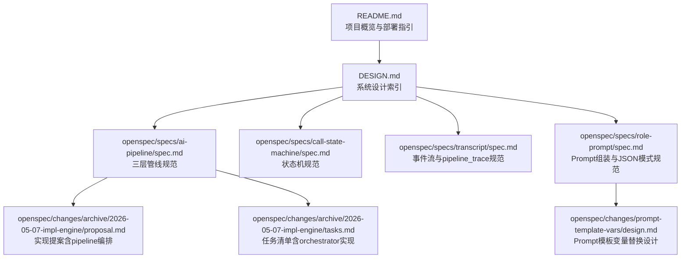
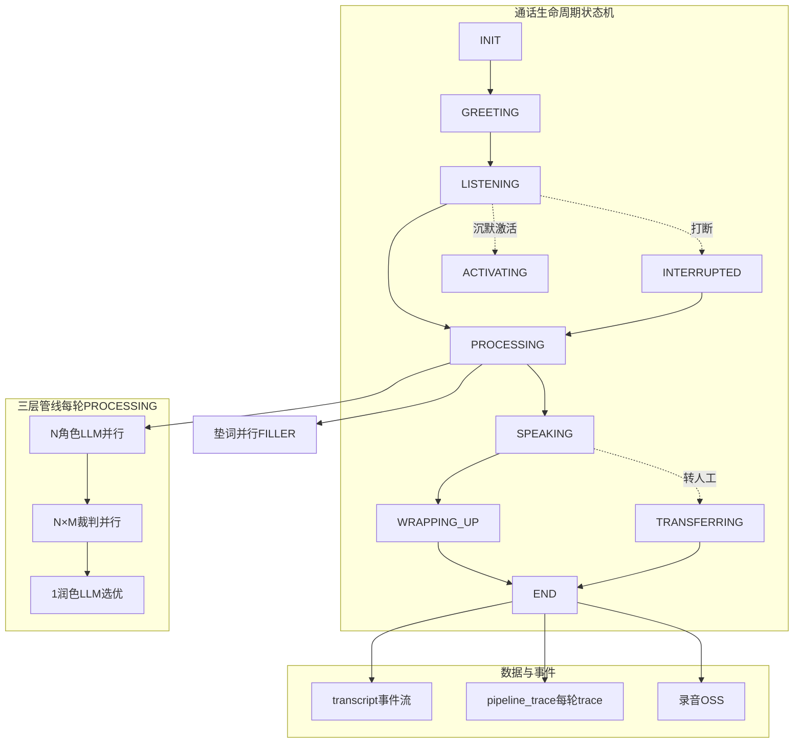
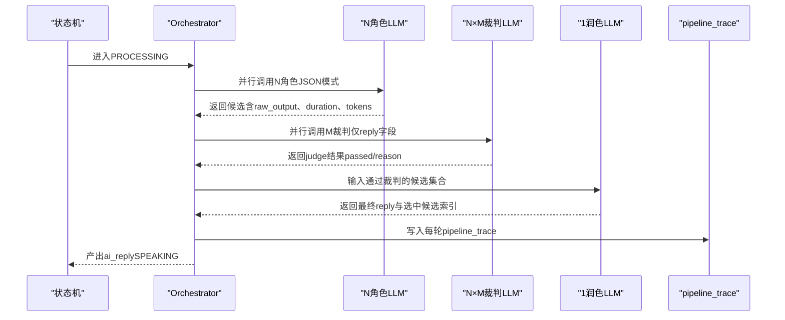
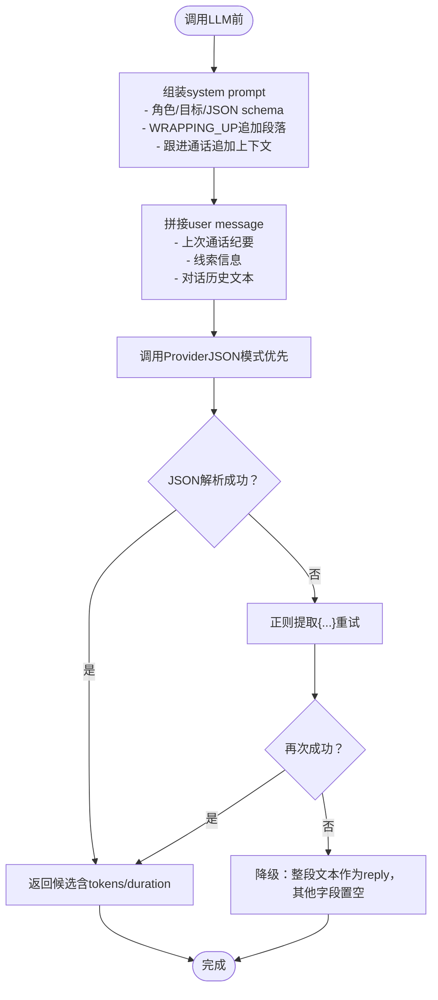
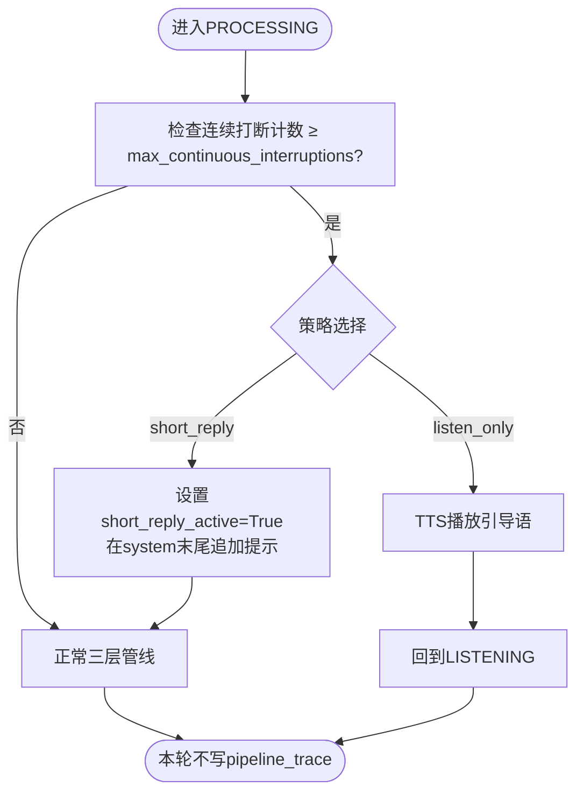
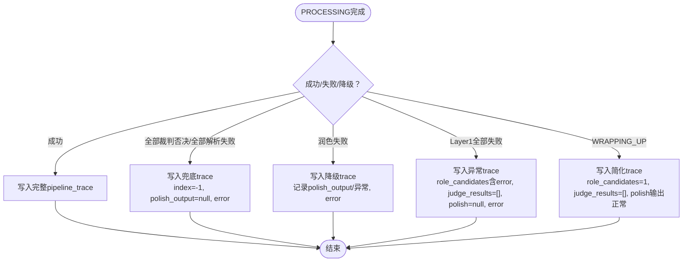
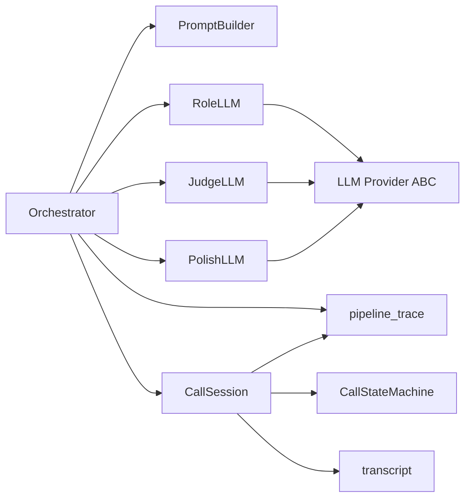

# AI智能对话系统

<cite>
**本文引用的文件**
- [README.md](file://README.md)
- [DESIGN.md](file://DESIGN.md)
- [IMPLEMENTATION_PLAN.md](file://IMPLEMENTATION_PLAN.md)
- [openspec/specs/ai-pipeline/spec.md](file://openspec/specs/ai-pipeline/spec.md)
- [openspec/specs/call-state-machine/spec.md](file://openspec/specs/call-state-machine/spec.md)
- [openspec/specs/transcript/spec.md](file://openspec/specs/transcript/spec.md)
- [openspec/specs/role-prompt/spec.md](file://openspec/specs/role-prompt/spec.md)
- [openspec/changes/archive/2026-05-07-impl-engine/proposal.md](file://openspec/changes/archive/2026-05-07-impl-engine/proposal.md)
- [openspec/changes/archive/2026-05-07-impl-engine/tasks.md](file://openspec/changes/archive/2026-05-07-impl-engine/tasks.md)
- [openspec/changes/prompt-template-vars/design.md](file://openspec/changes/prompt-template-vars/design.md)
</cite>

## 目录
1. [简介](#简介)
2. [项目结构](#项目结构)
3. [核心组件](#核心组件)
4. [架构总览](#架构总览)
5. [详细组件分析](#详细组件分析)
6. [依赖分析](#依赖分析)
7. [性能考虑](#性能考虑)
8. [故障排查指南](#故障排查指南)
9. [结论](#结论)
10. [附录](#附录)

## 简介
本文件面向iSales AI智能对话系统，系统采用三层LLM并行管线架构：N个角色LLM并行PK、N×M个裁判LLM并行审查、1个润色LLM选优拟人化。每轮对话回复均严格遵循“Layer 1候选生成 → Layer 2裁判审查 → Layer 3润色选优”的完整流程，确保输出质量与合规性。系统还提供连续打断保护策略（short_reply与listen_only）、完善的pipeline_trace记录写入机制、失败兜底与降级路径，并在WRAPPING_UP等特殊状态下采用简化管线。

## 项目结构
- 项目为多仓协作架构，核心与本规范相关的模块集中在isales-engine仓库中，通过OpenSpec规范驱动设计与实施。
- 顶层README与DESIGN文档提供了整体概览与索引；具体实现细节在各OpenSpec变更提案与设计文档中落地。

**图表来源**
- [README.md:1-86](file://README.md#L1-L86)
- [DESIGN.md:1-75](file://DESIGN.md#L1-L75)
- [openspec/specs/ai-pipeline/spec.md:1-166](file://openspec/specs/ai-pipeline/spec.md#L1-L166)
- [openspec/specs/call-state-machine/spec.md:1-190](file://openspec/specs/call-state-machine/spec.md#L1-L190)
- [openspec/specs/transcript/spec.md:1-127](file://openspec/specs/transcript/spec.md#L1-L127)
- [openspec/specs/role-prompt/spec.md:1-185](file://openspec/specs/role-prompt/spec.md#L1-L185)
- [openspec/changes/archive/2026-05-07-impl-engine/proposal.md:7-131](file://openspec/changes/archive/2026-05-07-impl-engine/proposal.md#L7-L131)
- [openspec/changes/archive/2026-05-07-impl-engine/tasks.md:59-67](file://openspec/changes/archive/2026-05-07-impl-engine/tasks.md#L59-L67)
- [openspec/changes/prompt-template-vars/design.md:60-85](file://openspec/changes/prompt-template-vars/design.md#L60-L85)

**章节来源**
- [README.md:1-86](file://README.md#L1-L86)
- [DESIGN.md:1-75](file://DESIGN.md#L1-L75)

## 核心组件
- 三层并行管线编排：N角色并行生成候选、N×M裁判并行审查、1润色选优拟人化。
- Prompt组装与JSON模式：三段式system+user消息，强制JSON模式，支持文本约束兜底。
- 状态机：统一事件驱动的状态转换，贯穿GREETING→LISTENING→PROCESSING→SPEAKING→WRAPPING_UP→END。
- pipeline_trace：每轮PROCESSING结束后写入，包含候选、裁判、润色输入输出与最终选优索引。
- 连续打断保护：short_reply（prompt追加“请用一句话回应”）与listen_only（直接TTS引导语后回到LISTENING）。
- 失败兜底与降级：全部角色失败→默认回复；全部裁判否决→默认回复；润色失败→取首个通过裁判的候选；异常路径仍写pipeline_trace。
- WRAPPING_UP简化管线：单角色+润色，不启用PK与裁判。

**章节来源**
- [openspec/specs/ai-pipeline/spec.md:5-166](file://openspec/specs/ai-pipeline/spec.md#L5-L166)
- [openspec/specs/call-state-machine/spec.md:4-190](file://openspec/specs/call-state-machine/spec.md#L4-L190)
- [openspec/specs/transcript/spec.md:77-96](file://openspec/specs/transcript/spec.md#L77-L96)
- [openspec/specs/role-prompt/spec.md:21-144](file://openspec/specs/role-prompt/spec.md#L21-L144)
- [openspec/changes/archive/2026-05-07-impl-engine/proposal.md:24-38](file://openspec/changes/archive/2026-05-07-impl-engine/proposal.md#L24-L38)

## 架构总览
系统以isales-engine为核心，围绕状态机与三层管线展开，辅以实时行为模块（打断检测、沉默激活、转人工、垫词）与数据存储（transcript、pipeline_trace、录音）。

**图表来源**
- [openspec/specs/call-state-machine/spec.md:46-130](file://openspec/specs/call-state-machine/spec.md#L46-L130)
- [openspec/specs/ai-pipeline/spec.md:20-68](file://openspec/specs/ai-pipeline/spec.md#L20-L68)
- [openspec/specs/transcript/spec.md:7-23](file://openspec/specs/transcript/spec.md#L7-L23)

## 详细组件分析

### 三层并行管线编排
- Layer 1（N角色并行PK）：进入PROCESSING时同时调用N个角色LLM，每个角色独立prompt与model，强制JSON模式。
- Layer 2（N×M裁判并行审查）：将通过JSON解析的候选集合交给每个候选的M个裁判并行审查，任一裁判否决即淘汰。
- Layer 3（1润色选优拟人化）：从全部通过裁判的候选中选优并改写reply，标记字段（goal_achieved/goal_type/extracted）直接继承被选中候选，不投票合并。
- 简化管线（WRAPPING_UP）：仅单角色+润色，不启用PK与裁判。

**图表来源**
- [openspec/specs/ai-pipeline/spec.md:20-93](file://openspec/specs/ai-pipeline/spec.md#L20-L93)
- [openspec/changes/archive/2026-05-07-impl-engine/proposal.md:24-31](file://openspec/changes/archive/2026-05-07-impl-engine/proposal.md#L24-L31)

**章节来源**
- [openspec/specs/ai-pipeline/spec.md:20-93](file://openspec/specs/ai-pipeline/spec.md#L20-L93)
- [openspec/changes/archive/2026-05-07-impl-engine/proposal.md:24-31](file://openspec/changes/archive/2026-05-07-impl-engine/proposal.md#L24-L31)

### Prompt组装与JSON模式
- Prompt三段式：system message（角色身份、目标、JSON schema、可选收尾/跟进段落）+ user message（上次通话纪要、线索信息、对话历史）。
- JSON模式强制：优先原生JSON模式；不支持时在system末尾贴schema并进行json.loads与正则提取两步兜底。
- WRAPPING_UP与跟进通话：在system末尾追加收尾指令段落与跟进上下文段落。

**图表来源**
- [openspec/specs/role-prompt/spec.md:21-144](file://openspec/specs/role-prompt/spec.md#L21-L144)
- [openspec/changes/prompt-template-vars/design.md:60-85](file://openspec/changes/prompt-template-vars/design.md#L60-L85)

**章节来源**
- [openspec/specs/role-prompt/spec.md:21-144](file://openspec/specs/role-prompt/spec.md#L21-L144)
- [openspec/changes/prompt-template-vars/design.md:60-85](file://openspec/changes/prompt-template-vars/design.md#L60-L85)

### 连续打断保护策略（short_reply与listen_only）
- 触发条件：当会话连续打断计数达到或超过campaign.max_continuous_interruptions。
- short_reply：在调用常规三层管线之前设置PipelineConfig.short_reply_active=True，在system prompt末尾追加“请用一句话回应”，随后照常运行三层管线并写pipeline_trace。
- listen_only：跳过PROCESSING（不调用任何LLM），直接TTS播放引导语后回到LISTENING，本轮不写pipeline_trace。
- 完整轮次（SPEAKING完整播完未被打断）后清零连续打断计数。

**图表来源**
- [openspec/specs/ai-pipeline/spec.md:13-18](file://openspec/specs/ai-pipeline/spec.md#L13-L18)
- [openspec/specs/ai-pipeline/spec.md:70-79](file://openspec/specs/ai-pipeline/spec.md#L70-L79)

**章节来源**
- [openspec/specs/ai-pipeline/spec.md:13-18](file://openspec/specs/ai-pipeline/spec.md#L13-L18)
- [openspec/specs/ai-pipeline/spec.md:70-79](file://openspec/specs/ai-pipeline/spec.md#L70-L79)

### pipeline_trace记录写入机制与失败兜底
- 每轮PROCESSING完成后写入pipeline_trace，包含：call_record_id、turn_id、ts_start、ts_end、user_input、role_candidates、judge_results、polish_input、polish_output、polish_duration_ms、polish_role_config_id、polish_prompt_version_id、final_selected_candidate_index、error。
- 失败兜底路径仍写pipeline_trace：
  - 全部裁判否决或全部候选解析失败：final_selected_candidate_index=-1，polish_output=null，error标识。
  - 润色超时/异常/JSON错误：polish_output记录尝试的raw_output或异常信息，error标识，取首个通过裁判的候选作为兜底。
  - Layer 1全部失败：role_candidates含error字段，judge_results=[]，polish_output=null，error标识。
  - WRAPPING_UP简化管线：role_candidates仅1条，judge_results=[]，polish_output与final_selected_candidate_index=0，无error。
- 写入失败不影响通话主路径：写入用try/except包裹，失败仅ERROR日志；END时事务批量写pipeline_trace失败重试3次（指数退避）后仍失败则ERROR日志并清理session。

**图表来源**
- [openspec/specs/ai-pipeline/spec.md:40-68](file://openspec/specs/ai-pipeline/spec.md#L40-L68)
- [openspec/specs/transcript/spec.md:77-96](file://openspec/specs/transcript/spec.md#L77-L96)

**章节来源**
- [openspec/specs/ai-pipeline/spec.md:40-68](file://openspec/specs/ai-pipeline/spec.md#L40-L68)
- [openspec/specs/transcript/spec.md:77-96](file://openspec/specs/transcript/spec.md#L77-L96)

### 开场白与WRAPPING_UP简化管线
- 开场白不走裁判与润色：固定模板直接TTS播放；或单角色LLM生成后直接TTS播放，均不调裁判/润色。
- WRAPPING_UP期间：单角色（取sort_order最小或显式指定）+润色，不启用PK与裁判；用户提出新问题/反悔/主动挂机/转人工触发时在WRAPPING_UP内闭环。

**章节来源**
- [openspec/specs/ai-pipeline/spec.md:131-158](file://openspec/specs/ai-pipeline/spec.md#L131-L158)

### 状态机与实时行为模块
- 状态机：统一transition_to API，非法转移抛异常并写transcript；状态转换均写事件。
- 实时行为：打断检测（白名单+时长双条件）、沉默激活（阈值触发+上限挂断）、转人工（4种触发OR关系）、垫词（与PROCESSING并行，可被打断）。

**章节来源**
- [openspec/specs/call-state-machine/spec.md:46-130](file://openspec/specs/call-state-machine/spec.md#L46-L130)
- [openspec/changes/archive/2026-05-07-impl-engine/proposal.md:40-70](file://openspec/changes/archive/2026-05-07-impl-engine/proposal.md#L40-L70)

## 依赖分析
- 组件耦合与职责：
  - Orchestrator负责三层管线编排与错误/降级路径聚合。
  - Role/Judge/Polish模块分别承担角色生成、裁判审查、润色选优。
  - PromptBuilder负责三段式组装与状态追加。
  - CallSession与状态机协调上下文与事件。
  - Transcript与pipeline_trace分别承载事件流与调试trace。
- 外部依赖与集成：
  - Provider ABC：支持原生JSON模式或文本约束兜底。
  - Redis/PostgreSQL：并发计数与持久化。
  - Pub/Sub：EngineEvent推送与EngineControl消费。

**图表来源**
- [openspec/changes/archive/2026-05-07-impl-engine/proposal.md:24-38](file://openspec/changes/archive/2026-05-07-impl-engine/proposal.md#L24-L38)
- [openspec/specs/role-prompt/spec.md:131-144](file://openspec/specs/role-prompt/spec.md#L131-L144)

**章节来源**
- [openspec/changes/archive/2026-05-07-impl-engine/proposal.md:24-38](file://openspec/changes/archive/2026-05-07-impl-engine/proposal.md#L24-L38)
- [openspec/specs/role-prompt/spec.md:131-144](file://openspec/specs/role-prompt/spec.md#L131-L144)

## 性能考虑
- 并行化：N角色与N×M裁判并行调用，覆盖垫词播放时延，缩短端到端延迟。
- Token与成本：长上下文不截断，需监控token用量并设置告警阈值。
- 降级与兜底：润色失败快速降级取首个通过裁判候选，避免重试造成额外延迟。
- 写入隔离：pipeline_trace写入try/except包裹，失败不影响通话主路径；END时批量写入失败重试3次（指数退避）。

**章节来源**
- [openspec/specs/role-prompt/spec.md:43-56](file://openspec/specs/role-prompt/spec.md#L43-L56)
- [openspec/specs/ai-pipeline/spec.md:10-11](file://openspec/specs/ai-pipeline/spec.md#L10-L11)
- [openspec/specs/ai-pipeline/spec.md:50-63](file://openspec/specs/ai-pipeline/spec.md#L50-L63)

## 故障排查指南
- 状态机非法转移：检查LEGAL_TRANSITIONS与事件触发时机，关注transcript中的state_error事件。
- 角色LLM解析失败：确认Provider是否支持原生JSON模式；若不支持，检查system末尾schema描述与后处理逻辑。
- 全部裁判否决：确认default_replies配置与transcript中的default_reply_used事件。
- 润色失败降级：检查polish_output记录与error字段，确认是否取首个通过裁判候选。
- pipeline_trace写入失败：查看ERROR日志与重试记录，确认END时批量写入是否成功。
- 连续打断保护：核对consecutive_interruption_count与策略配置，确认short_reply是否正确追加提示。

**章节来源**
- [openspec/specs/call-state-machine/spec.md:33-44](file://openspec/specs/call-state-machine/spec.md#L33-L44)
- [openspec/specs/role-prompt/spec.md:131-144](file://openspec/specs/role-prompt/spec.md#L131-L144)
- [openspec/specs/ai-pipeline/spec.md:94-130](file://openspec/specs/ai-pipeline/spec.md#L94-L130)
- [openspec/specs/ai-pipeline/spec.md:50-63](file://openspec/specs/ai-pipeline/spec.md#L50-L63)

## 结论
iSales三层LLM管线通过严格的并行编排、Prompt三段式与JSON模式、完备的失败兜底与降级路径，实现了高质量、可审计、可调试的AI对话系统。结合连续打断保护与WRAPPING_UP简化管线，系统在复杂场景下仍能保持稳定与可控。建议在生产环境中重点关注Provider能力适配、token用量监控与pipeline_trace的可观测性建设。

## 附录

### JSON输出契约（pipeline_trace字段）
- 字段说明（按规范）：
  - call_record_id, turn_id, ts_start, ts_end
  - user_input (text)
  - role_candidates (JSONB数组)：每个候选的role_config_id、prompt_version_id、raw_output、parsed_json、duration_ms、prompt_tokens、completion_tokens、error
  - judge_results (JSONB数组)：每个候选×每个裁判的candidate_index、role_config_id、prompt_version_id、passed、reason、duration_ms
  - polish_input (JSONB)、polish_output (text)、polish_duration_ms、polish_role_config_id、polish_prompt_version_id
  - final_selected_candidate_index
  - error (可选)

**章节来源**
- [openspec/specs/transcript/spec.md:77-96](file://openspec/specs/transcript/spec.md#L77-L96)

### 配置示例（概念性说明）
- 角色/裁判/润色配置：包含model、temperature、top_p、prompt_version引用。
- campaign默认回复池：JSONB数组，用于全部裁判否决或全部解析失败时的兜底。
- 连续打断策略：short_reply或listen_only，配合max_continuous_interruptions与策略执行逻辑。

**章节来源**
- [openspec/specs/ai-pipeline/spec.md:13-18](file://openspec/specs/ai-pipeline/spec.md#L13-L18)
- [openspec/specs/ai-pipeline/spec.md:94-102](file://openspec/specs/ai-pipeline/spec.md#L94-L102)