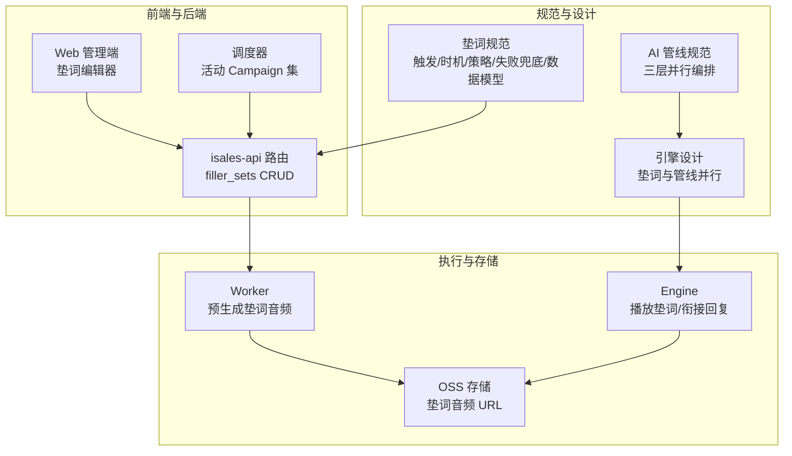
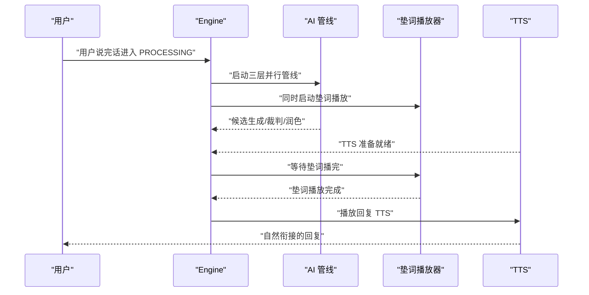
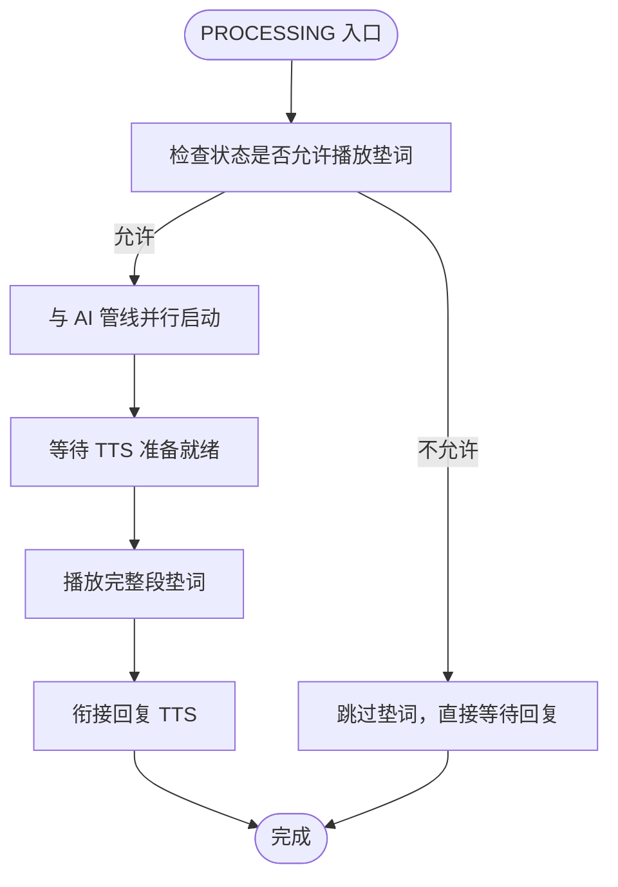
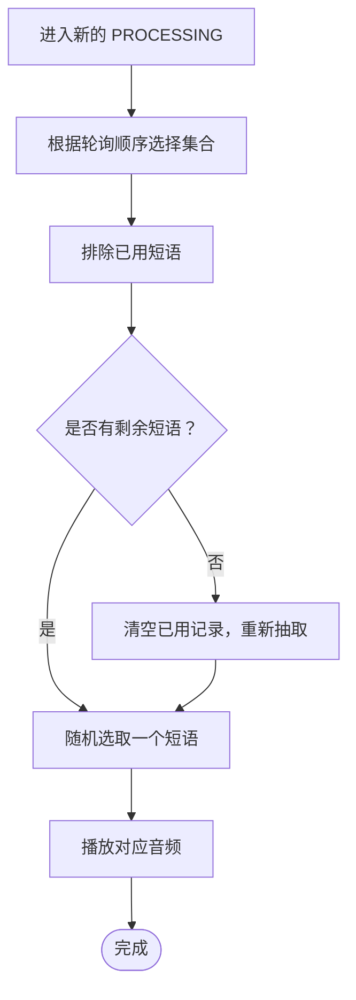
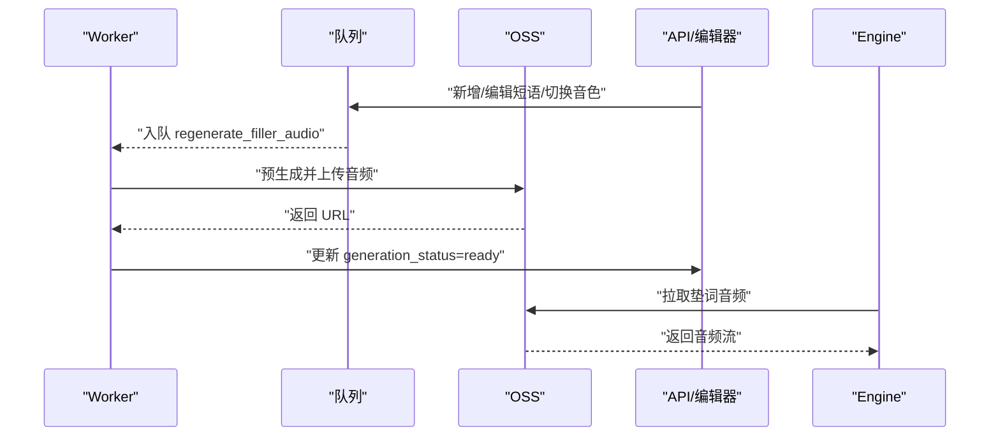
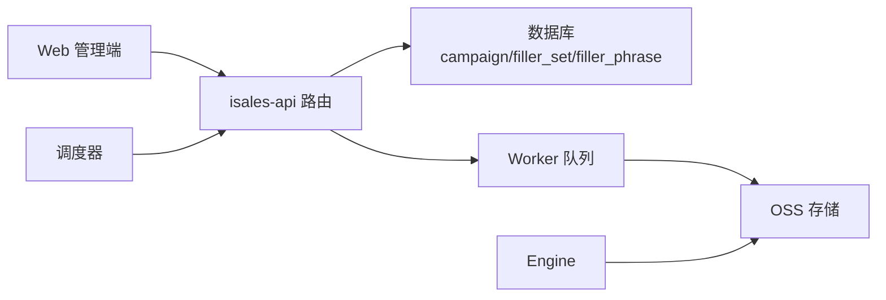

# 垫词管理系统

<cite>
**本文引用的文件**
- [垫词规范](file://openspec/specs/filler/spec.md)
- [AI 管线规范](file://openspec/specs/ai-pipeline/spec.md)
- [变更任务：垫词编辑器与后端路由](file://openspec/changes/archive/2026-05-23-web-admin-campaign-workflow/tasks.md)
- [验收与代码路径：垫词编辑器与后端路由](file://openspec/changes/archive/2026-05-23-web-admin-campaign-workflow/acceptance.md)
- [引擎设计：垫词与管线并行](file://openspec/changes/archive/2026-05-07-impl-engine/design.md)
- [垫词数据模型](file://openspec/specs/filler/spec.md)
</cite>

## 目录
1. [简介](#简介)
2. [项目结构](#项目结构)
3. [核心组件](#核心组件)
4. [架构总览](#架构总览)
5. [详细组件分析](#详细组件分析)
6. [依赖关系分析](#依赖关系分析)
7. [性能考量](#性能考量)
8. [故障排查指南](#故障排查指南)
9. [结论](#结论)
10. [附录](#附录)

## 简介
本文件面向开发者与产品配置人员，系统化阐述垫词管理系统的设计目标、作用机制、生成策略、配置管理、与 AI 管线的集成方式，以及对通话质量的影响。垫词在 AI 管线处理期间播放，用于覆盖 LLM/TTS 延迟，缓解等待焦虑、维持对话流畅性、提供自然停顿。系统通过“预生成 + 动态补充”的音频策略、多集合轮询与集内随机不重复的短语选择策略，确保稳定一致的用户体验。

## 项目结构
围绕垫词能力，仓库中关键位置如下：
- 规范层：openspec/specs/filler/spec.md 定义垫词触发场景、启动时机、选择策略、音频来源、失败兜底与数据模型。
- 规划与实现：openspec/changes/archive/.../2026-05-23-web-admin-campaign-workflow/* 提供前端垫词编辑器与后端路由实现的变更任务与验收说明。
- 引擎集成：openspec/changes/archive/2026-05-07-impl-engine/design.md 描述引擎侧如何与 AI 管线并行启动垫词，并在 TTS 准备就绪后衔接回复。
- 数据模型：垫词规范中给出 campaign、filler_set、filler_phrase 的关系与字段。

图示来源
- [垫词规范:1-132](file://openspec/specs/filler/spec.md#L1-L132)
- [AI 管线规范:1-166](file://openspec/specs/ai-pipeline/spec.md#L1-L166)
- [引擎设计：垫词与管线并行:138-142](file://openspec/changes/archive/2026-05-07-impl-engine/design.md#L138-L142)
- [变更任务：垫词编辑器与后端路由:1-23](file://openspec/changes/archive/2026-05-23-web-admin-campaign-workflow/tasks.md#L1-L23)
- [验收与代码路径：垫词编辑器与后端路由:70-149](file://openspec/changes/archive/2026-05-23-web-admin-campaign-workflow/acceptance.md#L70-L149)

章节来源
- [垫词规范:1-132](file://openspec/specs/filler/spec.md#L1-L132)
- [AI 管线规范:1-166](file://openspec/specs/ai-pipeline/spec.md#L1-L166)
- [引擎设计：垫词与管线并行:138-142](file://openspec/changes/archive/2026-05-07-impl-engine/design.md#L138-L142)
- [变更任务：垫词编辑器与后端路由:1-23](file://openspec/changes/archive/2026-05-23-web-admin-campaign-workflow/tasks.md#L1-L23)
- [验收与代码路径：垫词编辑器与后端路由:70-149](file://openspec/changes/archive/2026-05-23-web-admin-campaign-workflow/acceptance.md#L70-L149)

## 核心组件
- 垫词触发与播放控制：在常规对话 PROCESSING 状态下启动，与 AI 管线并行；TTS 准备好后再衔接回复；快响应场景仍播完整段垫词以保持节奏一致；被打断时立即停止垫词并重启新一轮处理。
- 多集合轮询与集内随机不重复：按 filler_set.sort_order 升序轮询；每通电话在 call_session 内维护已用短语集合，避免重复，直至该集合全部用尽后清空重置。
- 预生成音频与动态补充：垫词音频在拨打前用 Campaign 配置的音色 TTS 预先生成并存储至 OSS；新增/编辑短语或切换音色时触发后台任务重新生成；若预生成未完成或下载失败，允许无声延迟。
- 配置与数据模型：Campaign 关联多个 filler_set；filler_set 关联多个 filler_phrase；字段包括 phrase、audio_url、generation_status 等。

章节来源
- [垫词规范:7-110](file://openspec/specs/filler/spec.md#L7-L110)
- [垫词数据模型:111-132](file://openspec/specs/filler/spec.md#L111-L132)

## 架构总览
垫词系统与 AI 管线的集成遵循“并行启动、延迟对齐、自然衔接”的原则。引擎在 PROCESSING 入口同时启动 AI 管线与垫词播放；当 TTS 准备就绪后，引擎等待垫词播完再接续回复，从而消除等待感知差异，提升对话节奏一致性。

图示来源
- [AI 管线规范:9-11](file://openspec/specs/ai-pipeline/spec.md#L9-L11)
- [引擎设计：垫词与管线并行:138-142](file://openspec/changes/archive/2026-05-07-impl-engine/design.md#L138-L142)
- [垫词规范:31-48](file://openspec/specs/filler/spec.md#L31-L48)

## 详细组件分析

### 组件一：垫词触发与播放控制
- 触发场景白名单：仅在常规对话 PROCESSING 状态播放；开场白后首轮 PROCESSING、收尾 WRAPPING_UP、转人工/沉默激活/收尾告别期间不播。
- 启动时机与衔接：与 AI 管线同时启动；TTS 准备好后等待垫词播完再接 reply；快响应场景仍播完整段垫词。
- 打断与重启：播放中被打断时立即停止垫词、丢弃当前 PROCESSING 的 AI 管线，将用户输入作为新一轮处理。

图示来源
- [垫词规范:7-48](file://openspec/specs/filler/spec.md#L7-L48)

章节来源
- [垫词规范:7-48](file://openspec/specs/filler/spec.md#L7-L48)

### 组件二：多集合轮询与集内随机不重复
- 多集合轮询：按 filler_set.sort_order 升序使用，到末尾后从头循环；每通电话从最小 sort_order 的集合起步。
- 集内随机不重复：每通电话维护已用短语集合；同一通电话不重复使用同一短语，直至该集合全部用尽后清空记录。

图示来源
- [垫词规范:50-77](file://openspec/specs/filler/spec.md#L50-L77)

章节来源
- [垫词规范:50-77](file://openspec/specs/filler/spec.md#L50-L77)

### 组件三：音频生成策略（预生成 + 动态补充）
- 预生成：在拨打前用 Campaign 配置的音色 TTS 生成并存储至 OSS；运行时不实时调用 TTS。
- 动态补充：新增/编辑短语或切换音色时触发后台任务重新生成；完成后写入 audio_url 并置 generation_status=ready。
- 失败兜底：预生成未完成、下载失败或全部集合不可用时跳过垫词，允许“无声延迟”。

图示来源
- [垫词规范:78-110](file://openspec/specs/filler/spec.md#L78-L110)

章节来源
- [垫词规范:78-110](file://openspec/specs/filler/spec.md#L78-L110)

### 组件四：配置管理（类型、播放策略、触发条件）
- 配置入口：Campaign 级别配置，与音色绑定，整通电话不切换。
- 播放策略：多集合轮询、集内随机不重复；每轮 PROCESSING 仅在允许场景播放。
- 触发条件：PROCESSING 状态、非开场白首轮、非 WRAPPING_UP、非转人工/沉默激活/收尾告别。

章节来源
- [垫词规范:1-30](file://openspec/specs/filler/spec.md#L1-L30)

### 组件五：与 AI 管线的集成与通话质量影响
- 并行启动：Layer 1 与垫词同时启动，覆盖整个管线延迟。
- 自然衔接：TTS 准备好后等待垫词播完再接续回复，避免“快响应”破坏对话节拍。
- 质量保障：失败兜底允许无声延迟，不引入“万能兜底垫词”，确保稳定性与一致性。

章节来源
- [AI 管线规范:9-11](file://openspec/specs/ai-pipeline/spec.md#L9-L11)
- [引擎设计：垫词与管线并行:138-142](file://openspec/changes/archive/2026-05-07-impl-engine/design.md#L138-L142)
- [垫词规范:31-48](file://openspec/specs/filler/spec.md#L31-L48)

## 依赖关系分析
- 前端 Web 管理端通过垫词编辑器维护 Campaign 的 filler_set 与 filler_phrase；后端 isales-api 提供 CRUD 路由与嵌套接口。
- Worker 后台任务负责预生成与更新 generation_status；Engine 在通话中读取 OSS 音频并播放。
- 调度器维护活动 Campaign 集，确保配置变更与生成任务生效。

图示来源
- [验收与代码路径：垫词编辑器与后端路由:70-149](file://openspec/changes/archive/2026-05-23-web-admin-campaign-workflow/acceptance.md#L70-L149)
- [变更任务：垫词编辑器与后端路由:1-23](file://openspec/changes/archive/2026-05-23-web-admin-campaign-workflow/tasks.md#L1-L23)

章节来源
- [验收与代码路径：垫词编辑器与后端路由:70-149](file://openspec/changes/archive/2026-05-23-web-admin-campaign-workflow/acceptance.md#L70-L149)
- [变更任务：垫词编辑器与后端路由:1-23](file://openspec/changes/archive/2026-05-23-web-admin-campaign-workflow/tasks.md#L1-L23)

## 性能考量
- 并行启动降低感知延迟：垫词与 AI 管线同时启动，缩短用户等待时间。
- 音频预生成减少实时开销：避免运行时实时合成，降低 CPU 与网络抖动带来的不确定性。
- 集内随机不重复避免重复感：提升长期通话的自然度与新鲜感。
- 失败兜底允许无声延迟：在极端情况下保持通话继续，避免卡顿或异常中断。

## 故障排查指南
- 现象：垫词未播放
  - 检查当前状态是否允许播放（如 WRAPPING_UP、转人工/沉默激活/收尾告别期间不播）。
  - 检查 PROCESSING 是否为首轮开场白后的第一轮（该场景不播垫词）。
- 现象：垫词播放过快或节奏不稳
  - 确认快响应场景仍需播完整段垫词以保持节奏一致。
- 现象：垫词音频下载失败
  - 允许无声延迟，系统会跳过垫词直接等待回复。
- 现象：全部集合不可用
  - 若所有 filler_phrase 均未 ready，整通通话不再尝试垫词。

章节来源
- [垫词规范:92-110](file://openspec/specs/filler/spec.md#L92-L110)

## 结论
垫词管理系统通过严格的触发规则、并行启动与自然衔接策略、多集合轮询与集内随机不重复的选择机制，以及预生成音频与动态补充的生成策略，实现了稳定一致的通话体验。与 AI 管线的深度集成确保了延迟覆盖与节奏统一，失败兜底策略保障了系统的鲁棒性。建议在配置层面遵循“多集合轮询、集内不重复、预生成优先”的原则，并结合业务场景持续优化短语库与播放策略。

## 附录
- 垫词库建设指导
  - 分类与命名：按业务语境与情绪色彩分组，便于轮询与风格匹配。
  - 质量与多样性：确保音频清晰、语速适中、长度合理；短语尽量多样化，避免重复感。
  - 更新与维护：建立变更流程，新增/编辑后及时触发预生成，监控 generation_status。
- 配置优化建议
  - 集合数量与排序：根据业务节奏设置 2–4 个集合，合理分配 sort_order。
  - 音色一致性：与 Campaign 音色保持一致，避免风格割裂。
  - 触发条件：严格限制在 PROCESSING 场景，避免干扰其他状态。
- 使用最佳实践
  - 首轮开场白不播垫词，确保开场节奏自然。
  - 快响应场景坚持播完整段垫词，保持对话节拍稳定。
  - 发生打断时立即停止垫词并重启新一轮处理，保证上下文连贯。