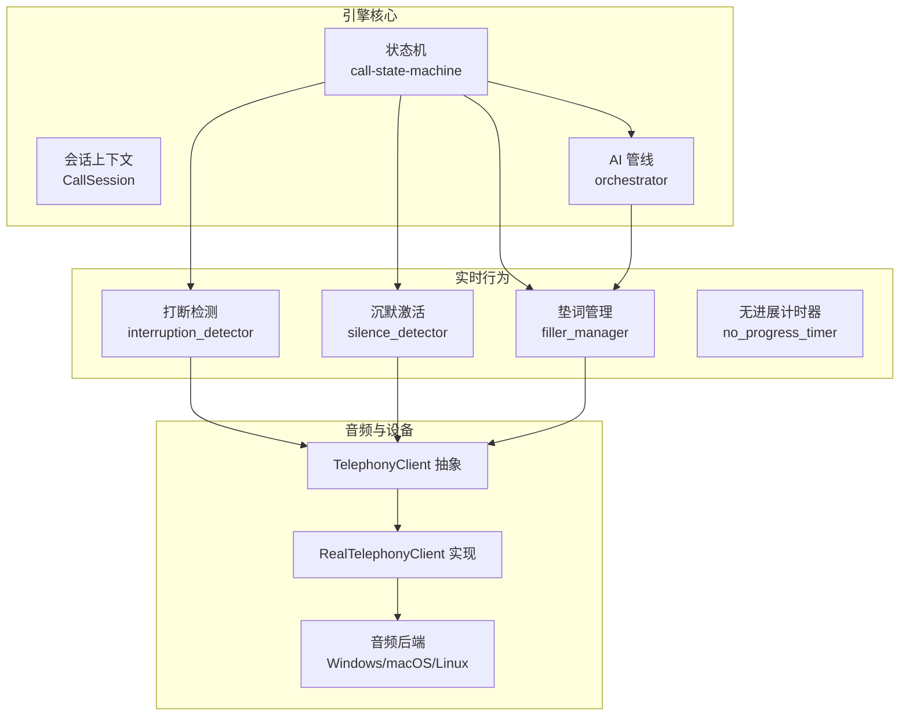
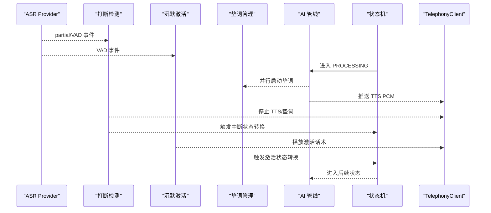
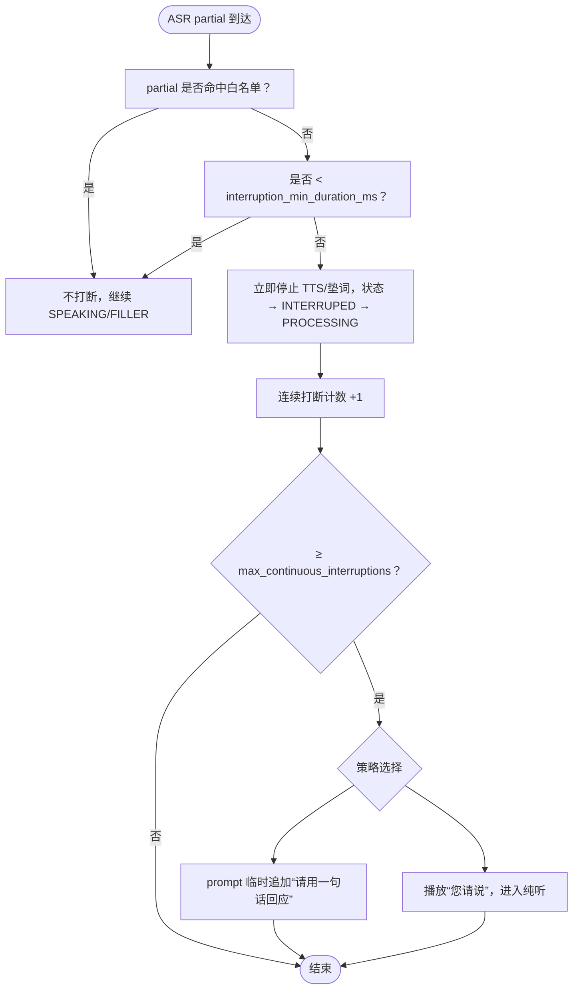
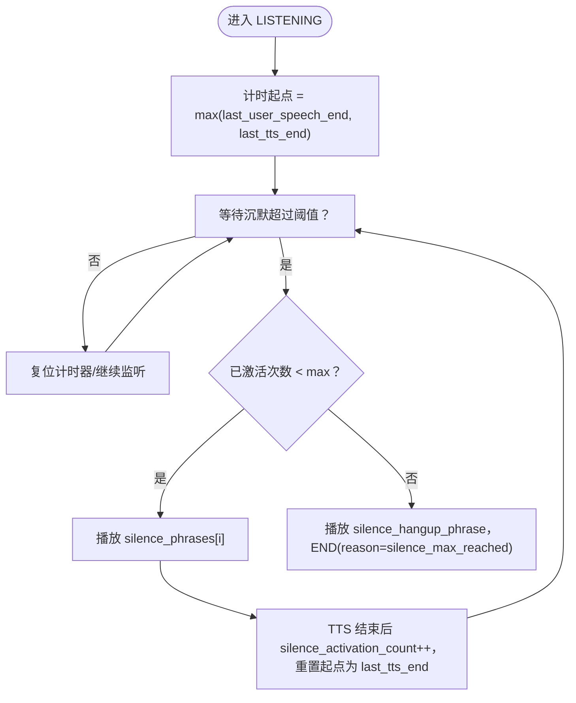
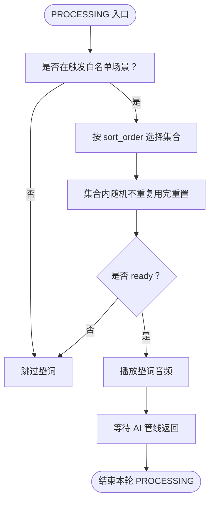
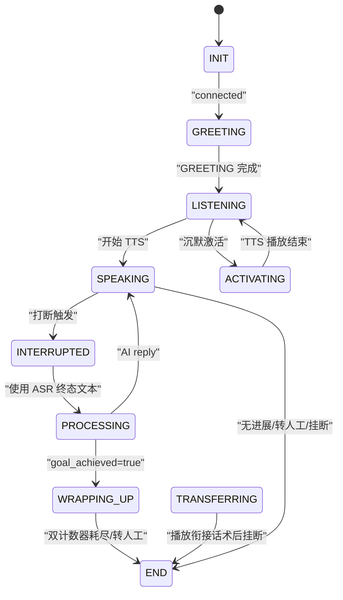
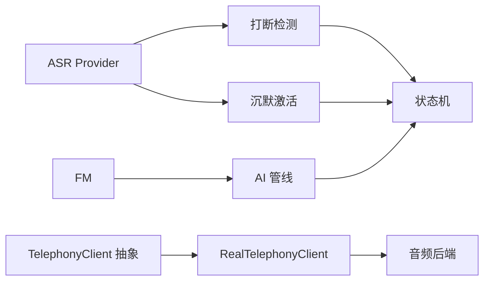

# 实时行为模块

<cite>
**本文档引用的文件**
- [openspec/specs/interruption-detection/spec.md](file://openspec/specs/interruption-detection/spec.md)
- [openspec/specs/silence-activation/spec.md](file://openspec/specs/silence-activation/spec.md)
- [openspec/specs/filler/spec.md](file://openspec/specs/filler/spec.md)
- [openspec/specs/call-state-machine/spec.md](file://openspec/specs/call-state-machine/spec.md)
- [openspec/changes/archive/2026-05-07-impl-engine/proposal.md](file://openspec/changes/archive/2026-05-07-impl-engine/proposal.md)
- [openspec/changes/archive/2026-05-07-impl-engine/design.md](file://openspec/changes/archive/2026-05-07-impl-engine/design.md)
- [openspec/changes/archive/2026-05-07-impl-engine/tasks.md](file://openspec/changes/archive/2026-05-07-impl-engine/tasks.md)
- [openspec/changes/archive/2026-05-08-impl-engine-providers/design.md](file://openspec/changes/archive/2026-05-08-impl-engine-providers/design.md)
- [openspec/changes/archive/2026-05-09-impl-modem-controller/tasks.md](file://openspec/changes/archive/2026-05-09-impl-modem-controller/tasks.md)
- [openspec/changes/macos-local-audio-dev/specs/device-hardware/spec.md](file://openspec/changes/macos-local-audio-dev/specs/device-hardware/spec.md)
- [openspec/changes/macos-local-audio-dev/design.md](file://openspec/changes/macos-local-audio-dev/design.md)
- [openspec/changes/archive/2026-05-17-windows-client-core/design.md](file://openspec/changes/archive/2026-05-17-windows-client-core/design.md)
- [openspec/v1-roadmap-a3-context.md](file://openspec/v1-roadmap-a3-context.md)
- [openspec/changes/archive/2026-05-12-impl-deploy-macos/tasks.md](file://openspec/changes/archive/2026-05-12-impl-deploy-macos/tasks.md)
- [openspec/changes/arch-cloud-edge-split/specs/device-hardware/spec.md](file://openspec/changes/arch-cloud-edge-split/specs/device-hardware/spec.md)
- [openspec/v1-roadmap-aliyun-rtc-poc-result.md](file://openspec/v1-roadmap-aliyun-rtc-poc-result.md)
- [openspec/specs/call-state-machine/spec.md](file://openspec/specs/call-state-machine/spec.md)
- [openspec/changes/archive/2026-05-07-impl-engine/proposal.md](file://openspec/changes/archive/2026-05-07-impl-engine/proposal.md)
- [openspec/changes/archive/2026-05-07-impl-engine/design.md](file://openspec/changes/archive/2026-05-07-impl-engine/design.md)
- [openspec/changes/archive/2026-05-07-impl-engine/tasks.md](file://openspec/changes/archive/2026-05-07-impl-engine/tasks.md)
- [openspec/changes/archive/2026-05-08-impl-engine-providers/design.md](file://openspec/changes/archive/2026-05-08-impl-engine-providers/design.md)
- [openspec/changes/archive/2026-05-09-impl-modem-controller/tasks.md](file://openspec/changes/archive/2026-05-09-impl-modem-controller/tasks.md)
- [openspec/changes/macos-local-audio-dev/specs/device-hardware/spec.md](file://openspec/changes/macos-local-audio-dev/specs/device-hardware/spec.md)
- [openspec/changes/macos-local-audio-dev/design.md](file://openspec/changes/macos-local-audio-dev/design.md)
- [openspec/changes/archive/2026-05-17-windows-client-core/design.md](file://openspec/changes/archive/2026-05-17-windows-client-core/design.md)
- [openspec/v1-roadmap-a3-context.md](file://openspec/v1-roadmap-a3-context.md)
- [openspec/changes/archive/2026-05-12-impl-deploy-macos/tasks.md](file://openspec/changes/archive/2026-05-12-impl-deploy-macos/tasks.md)
- [openspec/changes/arch-cloud-edge-split/specs/device-hardware/spec.md](file://openspec/changes/arch-cloud-edge-split/specs/device-hardware/spec.md)
- [openspec/v1-roadmap-aliyun-rtc-poc-result.md](file://openspec/v1-roadmap-aliyun-rtc-poc-result.md)
</cite>

## 目录
1. [简介](#简介)
2. [项目结构](#项目结构)
3. [核心组件](#核心组件)
4. [架构总览](#架构总览)
5. [详细组件分析](#详细组件分析)
6. [依赖分析](#依赖分析)
7. [性能考虑](#性能考虑)
8. [故障排查指南](#故障排查指南)
9. [结论](#结论)
10. [附录](#附录)

## 简介
本文件面向 iSales 实时行为模块，系统化阐述打断检测、沉默激活与垫词管理三大能力的设计与实现要点，以及它们与状态机的协同机制。文档还覆盖音频处理参数、性能调优建议、常见问题排查与故障恢复策略，并提供配置示例与集成指导，帮助开发者理解并优化实时行为功能。

## 项目结构
实时行为模块位于 isales-engine 的 realtime 子目录，围绕 CallSession 的状态机驱动，结合 ASR partial 事件与 TTS/音频输出进行实时决策。整体结构遵循 OpenSpec 的规范拆分与实施计划，确保可测试、可演进与可运维。

图示来源
- [openspec/changes/archive/2026-05-07-impl-engine/proposal.md:40-61](file://openspec/changes/archive/2026-05-07-impl-engine/proposal.md#L40-L61)
- [openspec/specs/call-state-machine/spec.md:1-21](file://openspec/specs/call-state-machine/spec.md#L1-L21)
- [openspec/changes/archive/2026-05-09-impl-modem-controller/tasks.md:70-80](file://openspec/changes/archive/2026-05-09-impl-modem-controller/tasks.md#L70-L80)

章节来源
- [openspec/changes/archive/2026-05-07-impl-engine/proposal.md:18-23](file://openspec/changes/archive/2026-05-07-impl-engine/proposal.md#L18-L23)
- [openspec/specs/call-state-machine/spec.md:1-21](file://openspec/specs/call-state-machine/spec.md#L1-L21)

## 核心组件
- 打断检测（interruption_detector）：基于 ASR partial 与 VAD 事件，采用双条件（白名单命中或时长小于阈值）判定，满足条件即立即停止 TTS/垫词并进入中断状态，不可撤销；支持连续打断保护与策略切换。
- 沉默激活（silence_detector）：在 LISTENING 状态下以 max(用户 speech_end, AI 上一轮 TTS 结束) 为起点计时，超过阈值触发 ACTIVATING，按顺序播放激活话术；达到上限后播放告别话术并挂断。
- 垫词管理（filler_manager）：与 AI 管线并行启动，在 PROCESSING 触发；多集合轮询、集合内随机不重复；预生成音频，失败允许无声延迟。
- 无进展计时器（no_progress_timer）：当用户持续说话但被判定为“非打断/无效内容”超过阈值，触发挂断，避免通话卡死。

章节来源
- [openspec/changes/archive/2026-05-07-impl-engine/proposal.md:40-61](file://openspec/changes/archive/2026-05-07-impl-engine/proposal.md#L40-L61)
- [openspec/specs/interruption-detection/spec.md:35-70](file://openspec/specs/interruption-detection/spec.md#L35-L70)
- [openspec/specs/silence-activation/spec.md:1-37](file://openspec/specs/silence-activation/spec.md#L1-L37)
- [openspec/specs/filler/spec.md:50-132](file://openspec/specs/filler/spec.md#L50-L132)

## 架构总览
实时行为模块与状态机紧密耦合：状态机统一驱动事件流转，实时行为模块在各状态下订阅 ASR partial/VAD，结合会话上下文（如 speech_start、last_tts_end）做出打断/激活/垫词等决策。音频层通过 TelephonyClient 抽象屏蔽底层差异，支持 mock 与真实 modem-controller 两种模式。

图示来源
- [openspec/changes/archive/2026-05-07-impl-engine/design.md:91-102](file://openspec/changes/archive/2026-05-07-impl-engine/design.md#L91-L102)
- [openspec/changes/archive/2026-05-07-impl-engine/proposal.md:40-61](file://openspec/changes/archive/2026-05-07-impl-engine/proposal.md#L40-L61)

## 详细组件分析

### 打断检测机制
- 输入来源：ASR partial 事件与 VAD（speech_start/speech_end）。
- 判定条件：双条件满足其一即不打断；均不满足则立即触发打断。
  - 条件1：partial 文本命中白名单；
  - 条件2：从 speech_start 到当前时间小于最小持续时长阈值。
- 行为：打断发生时立即取消当前 TTS/垫词任务，状态 SPEAKING → INTERRUPED → PROCESSING（使用 ASR 终态文本）；不可撤销。
- 连续打断保护：超过最大连续次数后，按策略执行 short_reply（prompt 临时追加“请用一句话回应”）或 listen_only（播放“您请说”，进入纯听模式），完整一轮 SPEAKING 无打断后计数清零。
- 与 FILLER/WRAPPING_UP：判定逻辑一致，命中打断时停垫词并丢弃当前 PROCESSING，开启新一轮 PROCESSING。

图示来源
- [openspec/changes/archive/2026-05-07-impl-engine/design.md:144-149](file://openspec/changes/archive/2026-05-07-impl-engine/design.md#L144-L149)
- [openspec/specs/interruption-detection/spec.md:35-70](file://openspec/specs/interruption-detection/spec.md#L35-L70)

章节来源
- [openspec/changes/archive/2026-05-07-impl-engine/design.md:91-102](file://openspec/changes/archive/2026-05-07-impl-engine/design.md#L91-L102)
- [openspec/specs/interruption-detection/spec.md:54-70](file://openspec/specs/interruption-detection/spec.md#L54-L70)

### 沉默激活功能
- 计时起点：max(session.last_user_speech_end_at, session.last_tts_end_at)。
- 触发条件：超过 silence_threshold_ms 且已激活次数 < max_silence_activations。
- 行为：播放 silence_phrases[i]，i 为当前激活次数；TTS 播放结束后 silence_activation_count++，并以 last_tts_end_at 重置计时起点。
- 激活上限：达到上限后播放 silence_hangup_phrase，进入 END(reason=silence_max_reached)。
- 与转人工优先级：转人工触发优先于沉默激活。
- 与无进展计时器：用户持续说话但被判定为“非打断/无效内容”由 no_progress_timer 处理，不触发沉默激活。

图示来源
- [openspec/specs/silence-activation/spec.md:7-37](file://openspec/specs/silence-activation/spec.md#L7-L37)
- [openspec/specs/silence-activation/spec.md:82-99](file://openspec/specs/silence-activation/spec.md#L82-L99)

章节来源
- [openspec/specs/silence-activation/spec.md:1-37](file://openspec/specs/silence-activation/spec.md#L1-L37)
- [openspec/specs/silence-activation/spec.md:82-99](file://openspec/specs/silence-activation/spec.md#L82-L99)

### 垫词管理系统
- 触发场景白名单：仅常规对话 PROCESSING；GREETING 后第 1 轮、WRAPPING_UP、TRANSFERRING、ACTIVATING、收尾告别 MUST NOT 播放。
- 启动策略：与 AI 管线并行启动；管线先返回时，等待垫词播完再接 AI reply。
- 多集合轮询：按 filler_set.sort_order 升序循环，同一轮内集合内随机不重复；用完重置。
- 预生成与失败兜底：垫词音频需预生成并存储到 OSS；生成失败/下载失败跳过，允许无声延迟。
- 事件记录：写 full_transcript（silence_activation 事件不进入 dialog_history）。

图示来源
- [openspec/changes/archive/2026-05-07-impl-engine/proposal.md:41-47](file://openspec/changes/archive/2026-05-07-impl-engine/proposal.md#L41-L47)
- [openspec/specs/filler/spec.md:50-132](file://openspec/specs/filler/spec.md#L50-L132)

章节来源
- [openspec/changes/archive/2026-05-07-impl-engine/proposal.md:41-47](file://openspec/changes/archive/2026-05-07-impl-engine/proposal.md#L41-L47)
- [openspec/specs/filler/spec.md:50-132](file://openspec/specs/filler/spec.md#L50-L132)

### 与状态机的协同
- 状态集合：INIT/GREETING/LISTENING/SPEAKING/INTERRUPTED/FILLER/PROCESSING/WRAPPING_UP/ACTIVATING/TRANSFERRING/END。
- 状态转换：统一事件驱动 API，非法转移抛 IllegalTransition 并写 state_error；可恢复事件忽略，不可恢复事件强制进 END。
- 关键转换：SPEAKING 期间被打断 → INTERRUPED → PROCESSING；ACTIVATING 期间播放激活话术；TRANSFERRING 期间不调 AI 管线。
- 通话结束：写入 transcript/pipeline_trace/录音 URL 等，向 worker 派发 CallEnded，DECR 并发计数器。

图示来源
- [openspec/specs/call-state-machine/spec.md:46-63](file://openspec/specs/call-state-machine/spec.md#L46-L63)
- [openspec/specs/call-state-machine/spec.md:174-190](file://openspec/specs/call-state-machine/spec.md#L174-L190)

章节来源
- [openspec/specs/call-state-machine/spec.md:1-21](file://openspec/specs/call-state-machine/spec.md#L1-L21)
- [openspec/specs/call-state-machine/spec.md:46-63](file://openspec/specs/call-state-machine/spec.md#L46-L63)

## 依赖分析
- Provider 抽象：ASR Provider 必须实现 partial 推送与 VAD 事件；默认火山引擎实时 ASR。
- TelephonyClient 抽象：统一 dial/hangup/audio_in/audio_out/on_event；阶段 6 由 RealTelephonyClient 替换。
- 音频后端：Windows 串口 PCM、macOS 本地音频、Linux ALSA；云端 v1.0 默认 Aliyun RTC 后端。
- 事件发布：EngineEvent 异步 fire-and-forget，失败不影响通话。

图示来源
- [openspec/specs/interruption-detection/spec.md:54-67](file://openspec/specs/interruption-detection/spec.md#L54-L67)
- [openspec/changes/archive/2026-05-09-impl-modem-controller/tasks.md:70-80](file://openspec/changes/archive/2026-05-09-impl-modem-controller/tasks.md#L70-L80)
- [openspec/changes/arch-cloud-edge-split/specs/device-hardware/spec.md:193-205](file://openspec/changes/arch-cloud-edge-split/specs/device-hardware/spec.md#L193-L205)

章节来源
- [openspec/specs/interruption-detection/spec.md:54-67](file://openspec/specs/interruption-detection/spec.md#L54-L67)
- [openspec/changes/archive/2026-05-09-impl-modem-controller/tasks.md:70-80](file://openspec/changes/archive/2026-05-09-impl-modem-controller/tasks.md#L70-L80)
- [openspec/changes/arch-cloud-edge-split/specs/device-hardware/spec.md:193-205](file://openspec/changes/arch-cloud-edge-split/specs/device-hardware/spec.md#L193-L205)

## 性能考虑
- 管线延迟控制：单 LLM 8s 超时；Provider 选择低延迟产品；fillers 覆盖；若尾延迟超 10s，调小超时阈值。
- 发布与对账：EngineEvent fire-and-forget，内部带超时；Redis 并发计数器 INCR/DECR 防泄漏。
- 优雅停机：session 主动 cancel 自身 task；shutdown 超时 30s；必要时强制 SIGKILL。
- 音频节拍与阈值：MockTelephony 与真 modem-controller PCM 流速差异可能导致沉默/打断检测阈值需重新校准；filler/silence/interruption 的阈值均为 Campaign 级配置。

章节来源
- [openspec/changes/archive/2026-05-07-impl-engine/design.md:271-287](file://openspec/changes/archive/2026-05-07-impl-engine/design.md#L271-L287)
- [openspec/changes/archive/2026-05-07-impl-engine/tasks.md:82-87](file://openspec/changes/archive/2026-05-07-impl-engine/tasks.md#L82-L87)

## 故障排查指南
- 打断检测误触发
  - 检查白名单与最小持续时长阈值配置；确认 ASR partial/VAD 事件是否正确推送。
  - 若用户嗯嗯被截断，适当提高 interruption_min_duration_ms。
- 沉默激活未触发或过早触发
  - 确认计时起点是否为 max(last_user_speech_end, last_tts_end)；检查 silence_threshold_ms 与 max_silence_activations。
  - 若达到上限未挂断，核查 silence_hangup_phrase 是否正确下发。
- 垫词播放异常
  - 检查 generation_status 与 audio_url；预生成失败/下载失败将跳过垫词。
  - 确认触发场景白名单与集合轮询/去重逻辑。
- 状态机非法转移
  - 捕获 IllegalTransition 并写 state_error；可恢复事件忽略，不可恢复事件强制进 END。
- 音频问题
  - Windows：确认 COM 端口与 CPCMREG 启停时序；检查串口帧长度与波特率。
  - macOS：确认使用 sounddevice，默认设备索引；注意耳机使用避免回灌与失真。
  - 云端：确认 Aliyun RTC SDK 初始化与 on_audio_frame/push_audio 接口。

章节来源
- [openspec/specs/interruption-detection/spec.md:54-70](file://openspec/specs/interruption-detection/spec.md#L54-L70)
- [openspec/specs/silence-activation/spec.md:77-99](file://openspec/specs/silence-activation/spec.md#L77-L99)
- [openspec/specs/filler/spec.md:92-110](file://openspec/specs/filler/spec.md#L92-L110)
- [openspec/specs/call-state-machine/spec.md:33-45](file://openspec/specs/call-state-machine/spec.md#L33-L45)
- [openspec/changes/archive/2026-05-17-windows-client-core/design.md:132-165](file://openspec/changes/archive/2026-05-17-windows-client-core/design.md#L132-L165)
- [openspec/changes/macos-local-audio-dev/design.md:43-104](file://openspec/changes/macos-local-audio-dev/design.md#L43-L104)
- [openspec/changes/arch-cloud-edge-split/specs/device-hardware/spec.md:193-205](file://openspec/changes/arch-cloud-edge-split/specs/device-hardware/spec.md#L193-L205)

## 结论
实时行为模块通过打断检测、沉默激活与垫词管理三大机制，结合统一的状态机与抽象的 TelephonyClient，实现了对通话节奏的精细化控制。合理的阈值配置、严格的 Provider/音频后端契约以及完善的事件与计时器设计，共同保障了通话质量与用户体验。建议在生产环境中持续监控关键指标（如尾延迟、挂断原因分布），并根据实际设备与网络环境动态调优。

## 附录

### 配置示例与集成指导
- 打断检测相关配置（Campaign 级）
  - interruption_min_duration_ms：打断最小持续时长阈值
  - max_continuous_interruptions：连续打断上限
  - continuous_interruption_strategy：连续打断保护策略（short_reply/listen_only）
- 沉默激活相关配置（Campaign 级）
  - silence_threshold_ms：沉默触发阈值
  - max_silence_activations：单通电话激活上限
  - silence_phrases：激活话术库（顺序使用）
  - silence_hangup_phrase：上限达到后的告别话术
- 垫词相关配置（Campaign 级）
  - filler_set：多集合轮询
  - filler_phrase：预生成音频（generation_status/ready）
- 集成步骤
  - 配置 ASR Provider（默认火山引擎实时 ASR）
  - 配置 TelephonyClient（mock/real 切换）
  - 部署音频后端（Windows/macOS/Linux/云端 RTC）
  - 在 PROCESSING 触发垫词，与 AI 管线并行
  - 监控 EngineEvent 与 transcript，定位问题

章节来源
- [openspec/specs/interruption-detection/spec.md:35-70](file://openspec/specs/interruption-detection/spec.md#L35-L70)
- [openspec/specs/silence-activation/spec.md:82-99](file://openspec/specs/silence-activation/spec.md#L82-L99)
- [openspec/specs/filler/spec.md:111-132](file://openspec/specs/filler/spec.md#L111-L132)
- [openspec/changes/archive/2026-05-07-impl-engine/proposal.md:78-91](file://openspec/changes/archive/2026-05-07-impl-engine/proposal.md#L78-L91)