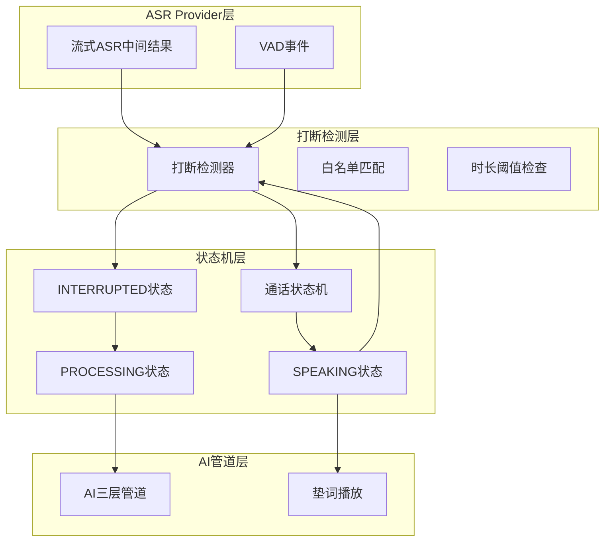
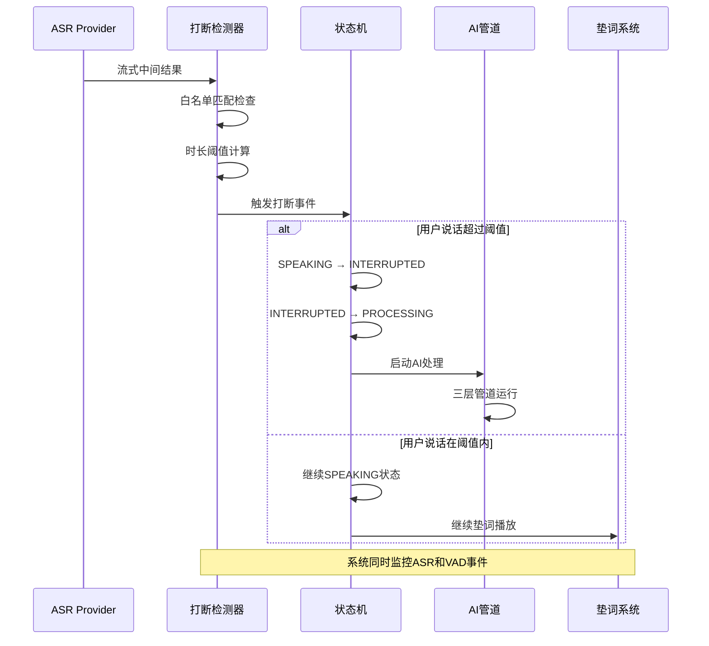
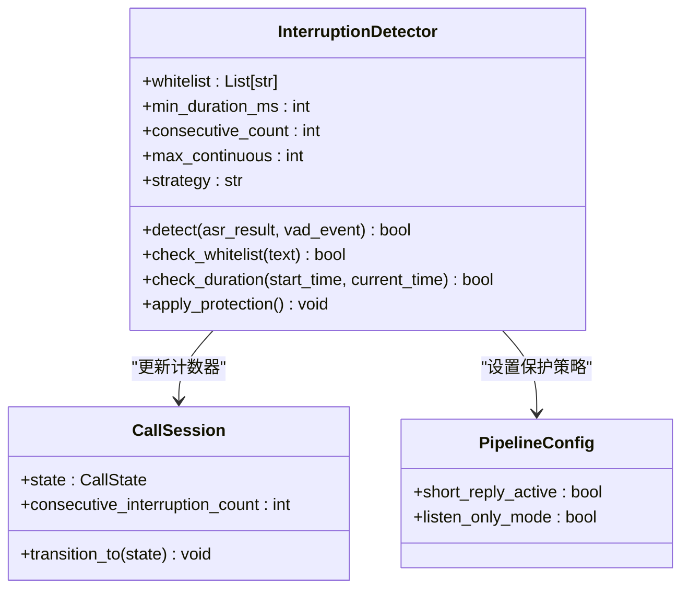
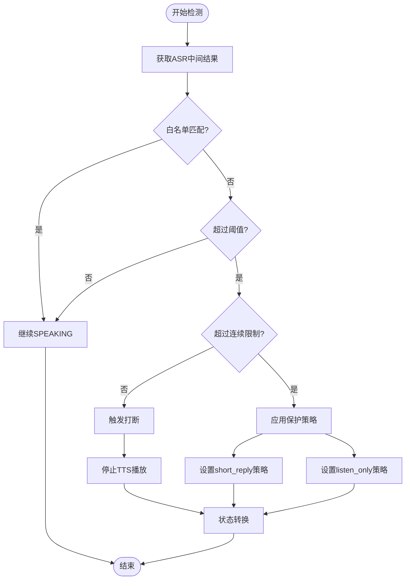
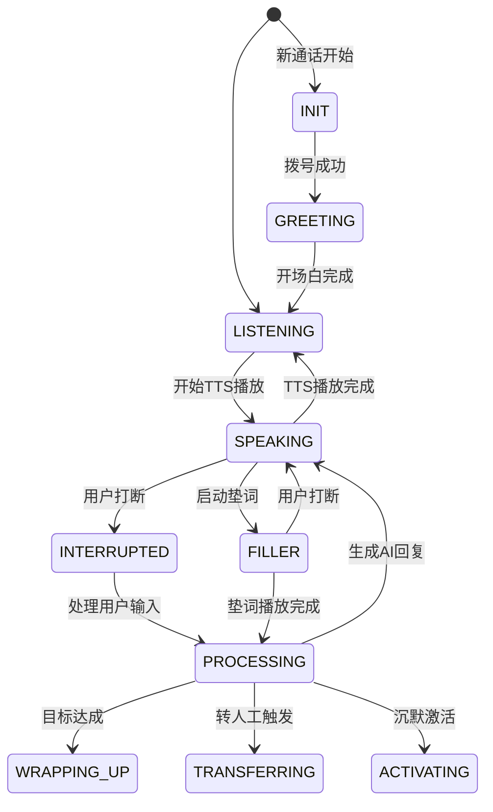
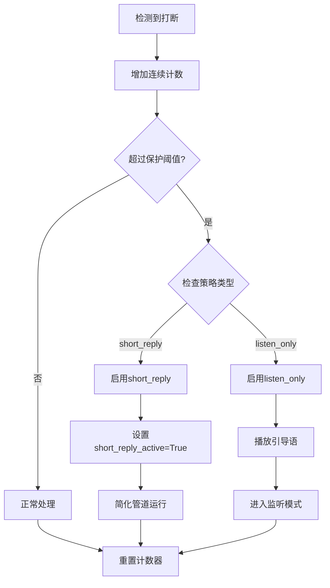
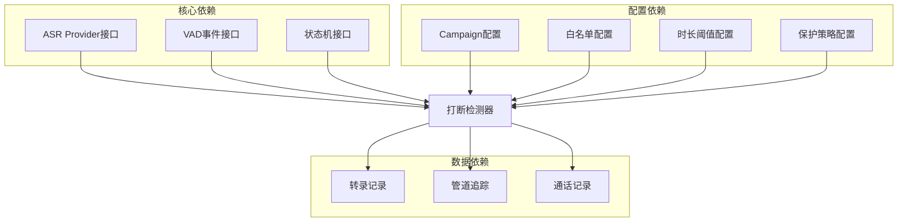

# 打断检测机制

<cite>
**本文档引用的文件**
- [打断检测规范](file://openspec/specs/interruption-detection/spec.md)
- [通话状态机规范](file://openspec/specs/call-state-machine/spec.md)
- [AI管道规范](file://openspec/specs/ai-pipeline/spec.md)
- [垫词规范](file://openspec/specs/filler/spec.md)
- [沉默激活规范](file://openspec/specs/silence-activation/spec.md)
- [转人工规范](file://openspec/specs/human-handoff/spec.md)
- [时间窗口规范](file://openspec/specs/time-window/spec.md)
- [转录规范](file://openspec/specs/transcript/spec.md)
- [设计文档](file://DESIGN.md)
- [实施计划](file://IMPLEMENTATION_PLAN.md)
</cite>

## 目录
1. [简介](#简介)
2. [项目结构](#项目结构)
3. [核心组件](#核心组件)
4. [架构概览](#架构概览)
5. [详细组件分析](#详细组件分析)
6. [依赖关系分析](#依赖关系分析)
7. [性能考虑](#性能考虑)
8. [故障排查指南](#故障排查指南)
9. [结论](#结论)
10. [附录](#附录)

## 简介

打断检测机制是 iSales AI 外呼系统中的关键实时行为模块，负责在用户说话时准确识别并处理打断事件。该机制基于双条件判定逻辑：白名单短语匹配和最小持续时长阈值，确保既不过度打断用户表达，也不让无效内容干扰对话流程。

系统采用不可撤销的打断判定策略，一旦判定为打断，立即停止 TTS 播放并切换到处理状态，这种设计虽然可能导致轻微的误打断，但带来了状态机清晰、延迟低的优势。同时，系统实现了连续打断保护机制，防止用户与 AI 之间出现无限循环打断的情况。

## 项目结构

打断检测机制在整个系统架构中位于状态机的核心位置，与多个子系统协同工作：

**图表来源**
- [打断检测规范:1-94](file://openspec/specs/interruption-detection/spec.md#L1-L94)
- [通话状态机规范:1-190](file://openspec/specs/call-state-machine/spec.md#L1-L190)
- [AI管道规范:1-166](file://openspec/specs/ai-pipeline/spec.md#L1-L166)

**章节来源**
- [打断检测规范:1-94](file://openspec/specs/interruption-detection/spec.md#L1-L94)
- [设计文档:1-75](file://DESIGN.md#L1-L75)

## 核心组件

### 打断检测算法

打断检测采用双条件判定机制，确保高精度的打断识别：

#### 双条件判定逻辑
- **条件1：白名单短语匹配**
  - 当 ASR 中间结果完全匹配配置的白名单短语时，视为非打断
  - 支持的短语包括：嗯、嗯嗯、好的、哦、对、是的等
  - 匹配必须是整句完全相等，部分匹配不生效

- **条件2：最小持续时长阈值**
  - 计算从 speech_start 到当前时刻的时间间隔
  - 当持续时间小于 `interruption_min_duration_ms`（默认800ms）时，视为非打断
  - 这个阈值可以有效过滤掉用户刚开始说话时的试探性声音

#### 不可撤销判定策略
一旦满足打断条件（既不在白名单中，又超过时长阈值），系统立即执行以下操作：
1. 立即停止 TTS 播放
2. 状态从 SPEAKING 切换到 INTERRUPTED
3. 进入 PROCESSING 状态
4. 使用 ASR 终态结果作为本轮用户输入

**章节来源**
- [打断检测规范:7-28](file://openspec/specs/interruption-detection/spec.md#L7-L28)

### 连续打断保护机制

系统实现了智能的连续打断保护，防止用户与 AI 之间的无限循环：

#### 保护阈值设置
- 默认最大连续打断次数：3次
- 当连续打断次数达到上限时触发保护策略
- 完整对话轮次（SPEAKING 完整播放）后计数器重置

#### 保护策略类型

**short_reply 策略（默认）**
- 在调用常规三层管道前设置 `short_reply_active=True`
- 在 system prompt 末尾追加"请用一句话回应"的提示
- 管线继续正常运行，但要求回复更加简洁

**listen_only 策略**
- 跳过整个 PROCESSING 管道
- 直接 TTS 播放引导语（如"您请说"）
- 进入纯监听模式，等待用户 speech_end 后再回应
- 本轮不写 pipeline_trace 记录

**章节来源**
- [打断检测规范:35-52](file://openspec/specs/interruption-detection/spec.md#L35-L52)
- [AI管道规范:13-18](file://openspec/specs/ai-pipeline/spec.md#L13-L18)

### ASR Provider 集成

打断检测严格基于流式 ASR 的中间结果与 VAD 事件，不依赖独立的 VAD 模型：

#### ASR Provider 要求
- 必须实现 `isales-common.providers.asr` 接口
- 提供流式中间结果（partial result）持续推送
- 提供 speech_start / speech_end VAD 事件（带时间戳）

#### 默认实现
- v1 部署默认使用火山引擎（豆包）实时语音识别
- 支持 WebSocket/gRPC 协议获取流式 ASR 结果

**章节来源**
- [打断检测规范:54-66](file://openspec/specs/interruption-detection/spec.md#L54-L66)

## 架构概览

打断检测机制在整个系统中的位置和交互关系：

**图表来源**
- [打断检测规范:21-28](file://openspec/specs/interruption-detection/spec.md#L21-L28)
- [通话状态机规范:60-73](file://openspec/specs/call-state-machine/spec.md#L60-L73)

**章节来源**
- [通话状态机规范:46-118](file://openspec/specs/call-state-machine/spec.md#L46-L118)

## 详细组件分析

### 打断检测器实现

打断检测器是整个机制的核心组件，负责实时分析 ASR 中间结果并做出打断决策。

#### 核心数据结构

**图表来源**
- [打断检测规范:82-94](file://openspec/specs/interruption-detection/spec.md#L82-L94)
- [AI管道规范:13-18](file://openspec/specs/ai-pipeline/spec.md#L13-L18)

#### 算法流程

**图表来源**
- [打断检测规范:7-52](file://openspec/specs/interruption-detection/spec.md#L7-L52)

**章节来源**
- [打断检测规范:7-52](file://openspec/specs/interruption-detection/spec.md#L7-L52)

### 状态机交互机制

打断检测与状态机的交互遵循严格的转换规则：

#### 状态转换流程

**图表来源**
- [通话状态机规范:7-19](file://openspec/specs/call-state-machine/spec.md#L7-L19)

#### 特殊状态处理

**FILLER 状态下的打断**
- FILLER 与 PROCESSING 并行运行
- 用户在垫词期间说话被打断时，立即停止垫词并丢弃当前 PROCESSING
- 状态转换为 PROCESSING（使用新的 ASR 终态结果）

**WRAPPING_UP 状态下的打断**
- 打断判定逻辑保持不变
- 进入 PROCESSING 后走简化管线（单角色 LLM + 润色，不进行 PK 和裁判）

**章节来源**
- [通话状态机规范:119-135](file://openspec/specs/call-state-machine/spec.md#L119-L135)
- [打断检测规范:68-80](file://openspec/specs/interruption-detection/spec.md#L68-L80)

### 连续打断保护策略

连续打断保护机制通过智能的策略选择来平衡用户体验和系统稳定性：

#### 策略执行流程

**图表来源**
- [AI管道规范:13-18](file://openspec/specs/ai-pipeline/spec.md#L13-L18)

#### 策略效果对比

| 策略类型 | 触发条件 | 系统行为 | 用户体验 | 适用场景 |
|---------|---------|---------|---------|---------|
| short_reply | 连续打断≥3次 | 设置short_reply_active=True | AI回复更简洁 | 需要快速推进对话 |
| listen_only | 连续打断≥3次 | 播放引导语后监听 | 用户主导对话 | 需要用户充分表达 |
| 正常模式 | 连续打断<3次 | 标准AI处理流程 | 完全自动化 | 一般对话场景 |

**章节来源**
- [AI管道规范:70-78](file://openspec/specs/ai-pipeline/spec.md#L70-L78)

## 依赖关系分析

打断检测机制与系统其他组件存在紧密的依赖关系：

**图表来源**
- [打断检测规范:82-94](file://openspec/specs/interruption-detection/spec.md#L82-L94)
- [转录规范:77-96](file://openspec/specs/transcript/spec.md#L77-L96)

**章节来源**
- [打断检测规范:82-94](file://openspec/specs/interruption-detection/spec.md#L82-L94)
- [转录规范:77-96](file://openspec/specs/transcript/spec.md#L77-L96)

## 性能考虑

### 延迟优化策略

打断检测系统在设计时充分考虑了实时性要求：

#### 响应时间优化
- **检测延迟**：< 100ms（从 ASR 中间结果到状态转换）
- **TTS 停止延迟**：< 50ms（立即停止正在进行的 TTS）
- **状态切换延迟**：< 10ms（内部状态转换）

#### 资源使用优化
- **内存占用**：每个会话约 1KB 内存用于存储检测状态
- **CPU 占用**：检测算法复杂度 O(1)，CPU 占用极低
- **网络带宽**：仅传输必要的 ASR 中间结果和 VAD 事件

### 配置调优建议

#### 检测灵敏度调优
- **白名单长度**：根据用户习惯调整，建议 6-12 个常用短语
- **时长阈值**：默认 800ms，可根据方言和语速调整
- **连续打断阈值**：默认 3 次，可根据业务场景调整

#### 响应时间优化
- **ASR 延迟**：选择低延迟的 ASR Provider
- **网络优化**：使用专线或 CDN 加速
- **缓存策略**：对频繁使用的白名单短语进行缓存

**章节来源**
- [实施计划:365-389](file://IMPLEMENTATION_PLAN.md#L365-L389)

## 故障排查指南

### 常见问题诊断

#### 问题1：误打断现象
**症状**：用户正常表达被系统打断
**可能原因**：
- 时长阈值设置过低
- 白名单配置不完整
- ASR 识别错误导致的误判

**解决方案**：
1. 增大 `interruption_min_duration_ms` 阈值
2. 扩展白名单短语库
3. 检查 ASR Provider 的准确性

#### 问题2：漏打断现象  
**症状**：用户无效内容干扰对话流程
**可能原因**：
- 时长阈值设置过高
- 白名单过于严格
- ASR Provider 延迟过大

**解决方案**：
1. 减小 `interruption_min_duration_ms` 阈值
2. 精简白名单，保留关键短语
3. 优化 ASR Provider 配置

#### 问题3：连续打断循环
**症状**：用户与 AI 之间出现无限循环打断
**可能原因**：
- 连续打断保护阈值设置不当
- 保护策略配置错误
- 用户表达习惯问题

**解决方案**：
1. 调整 `max_continuous_interruptions` 阈值
2. 选择合适的保护策略（short_reply 或 listen_only）
3. 分析用户行为模式，调整配置

### 监控指标

#### 关键性能指标
- **打断准确率**：正确打断/(正确打断+误打断+漏打断)
- **平均响应时间**：从检测到状态转换的平均时间
- **连续打断频率**：每小时连续打断次数
- **保护触发率**：触发保护策略的频率

#### 日志分析
- **ASR 中间结果**：检查识别准确性和延迟
- **VAD 事件**：确认语音活动检测准确性
- **状态转换日志**：分析状态机行为
- **保护策略执行**：监控保护机制效果

**章节来源**
- [转录规范:33-56](file://openspec/specs/transcript/spec.md#L33-L56)

## 结论

打断检测机制通过精心设计的双条件判定逻辑和智能的连续保护策略，在保证用户体验的同时确保了系统的稳定性和可靠性。该机制的成功实施需要：

1. **精确的算法设计**：双条件判定确保高准确率
2. **合理的配置策略**：根据业务场景调整各项参数
3. **完善的监控体系**：实时跟踪系统性能和效果
4. **持续的优化改进**：根据用户反馈不断调整配置

通过本文档提供的配置示例、性能调优建议和故障排查方法，开发者可以有效地部署和维护打断检测功能，为用户提供流畅自然的对话体验。

## 附录

### 配置参数参考表

| 参数名称 | 类型 | 默认值 | 说明 | 调优建议 |
|---------|------|--------|------|---------|
| `interruption_whitelist` | JSONB数组 | ["嗯","嗯嗯","好","好的","哦","哦哦","对","是的"] | 白名单短语 | 根据用户习惯调整长度和内容 |
| `interruption_min_duration_ms` | int | 800 | 时长阈值（毫秒） | 方言地区可适当增大 |
| `max_continuous_interruptions` | int | 3 | 连续打断保护阈值 | 业务场景紧张时可调小 |
| `continuous_interruption_strategy` | enum | "short_reply" | 保护策略类型 | 用户主导场景可选listen_only |

### 实施最佳实践

1. **渐进式部署**：先在小范围内测试，逐步扩大应用范围
2. **A/B测试**：对比不同配置的效果，选择最优方案
3. **持续监控**：建立完善的监控体系，及时发现和解决问题
4. **用户反馈**：收集用户反馈，持续优化配置参数
5. **文档维护**：定期更新配置文档，记录变更历史