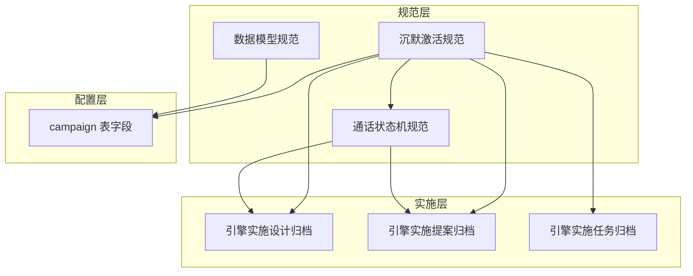
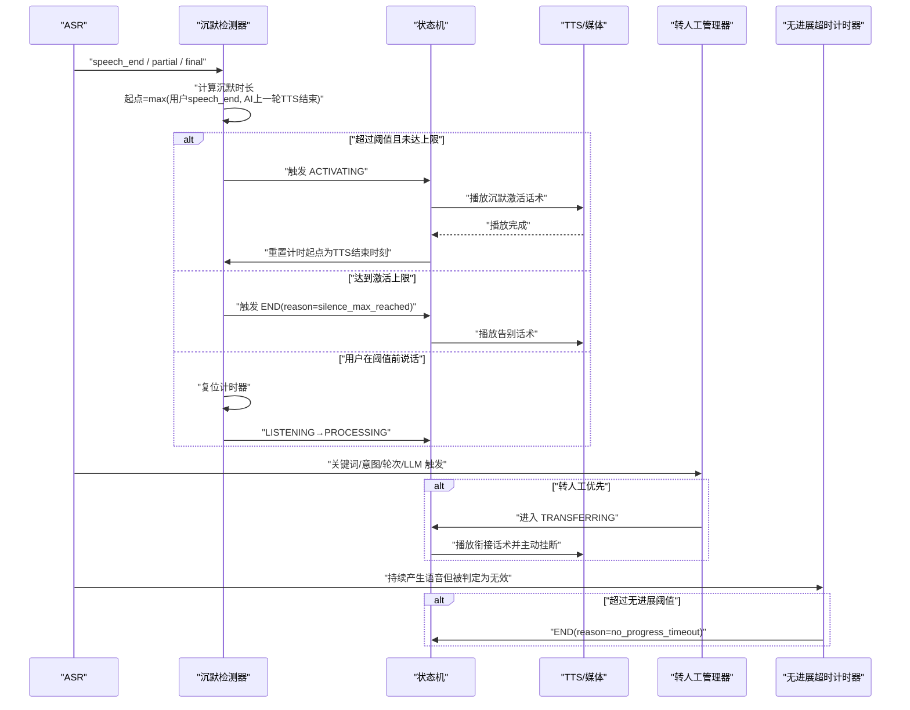
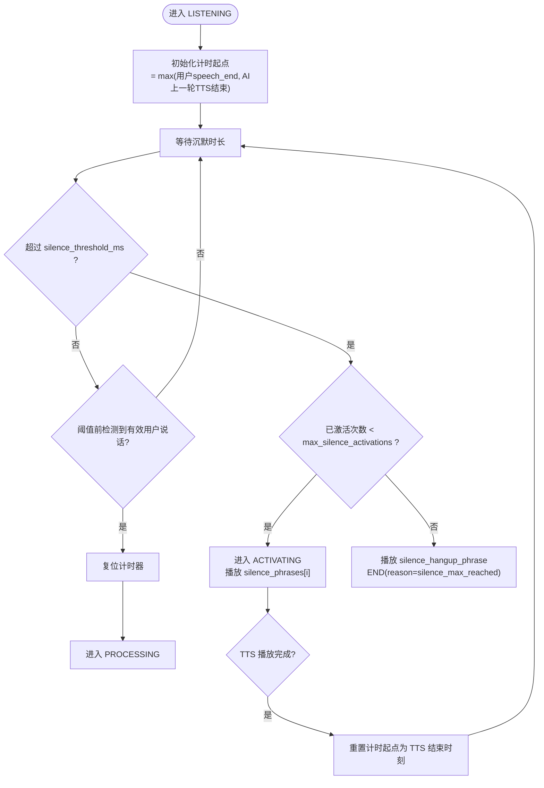
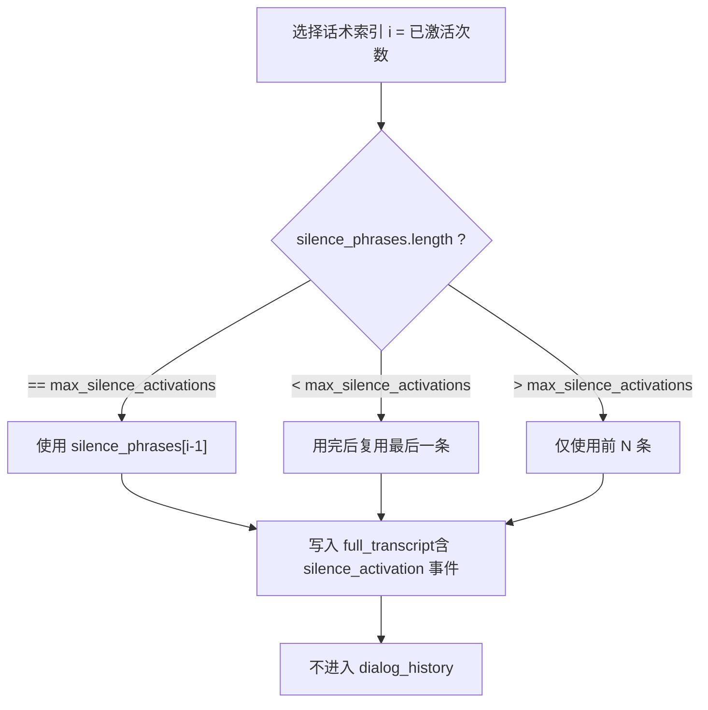
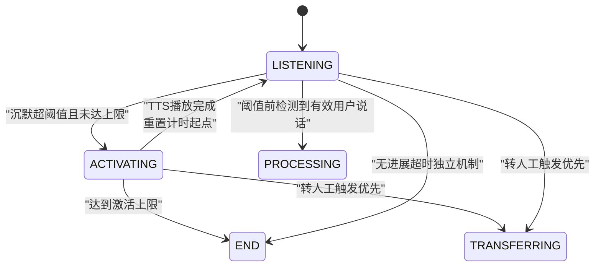
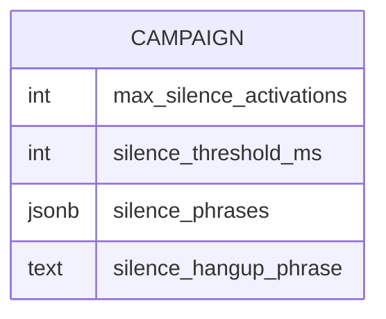
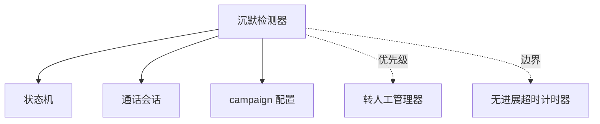

# 沉默激活功能

<cite>
**本文引用的文件**
- [沉默激活规范](file://openspec/specs/silence-activation/spec.md)
- [通话状态机规范](file://openspec/specs/call-state-machine/spec.md)
- [数据模型规范](file://openspec/specs/data-model/spec.md)
- [引擎实施设计（归档）](file://openspec/changes/archive/2026-05-07-impl-engine/design.md)
- [引擎实施提案（归档）](file://openspec/changes/archive/2026-05-07-impl-engine/proposal.md)
- [引擎实施任务（归档）](file://openspec/changes/archive/2026-05-07-impl-engine/tasks.md)
- [V1路线图（上下文）](file://openspec/v1-roadmap-a3-context.md)
- [部署状态（云）](file://deploy/cloud/STATE.md)
</cite>

## 目录
1. [简介](#简介)
2. [项目结构](#项目结构)
3. [核心组件](#核心组件)
4. [架构总览](#架构总览)
5. [详细组件分析](#详细组件分析)
6. [依赖分析](#依赖分析)
7. [性能考虑](#性能考虑)
8. [故障排查指南](#故障排查指南)
9. [结论](#结论)
10. [附录](#附录)

## 简介
沉默激活功能旨在解决通话中因用户长时间不说话导致的“冷场”或“哑通话”问题。当检测到 LISTENING 状态下的沉默时长超过配置阈值且未达到激活上限时，系统会自动播放预设话术，以唤醒用户继续对话；若达到激活上限，则播放告别话术并主动挂断。该功能与状态机紧密协作，在不同通话阶段具备明确的触发条件与优先级边界。

## 项目结构
沉默激活功能属于 isales-engine 的实时行为模块之一，与状态机、转人工、打断检测、无进展超时等模块共同构成完整的通话编排体系。相关实现与规范分布如下：
- 规范层：沉默激活规范、通话状态机规范、数据模型规范
- 实施层：引擎实施设计/提案/任务文档，明确了 silence_detector 的职责与交互
- 配置层：campaign 表新增字段承载沉默激活相关配置

**图表来源**
- [沉默激活规范:1-99](file://openspec/specs/silence-activation/spec.md#L1-L99)
- [通话状态机规范:1-190](file://openspec/specs/call-state-machine/spec.md#L1-L190)
- [数据模型规范:28-30](file://openspec/specs/data-model/spec.md#L28-L30)
- [引擎实施提案（归档）:52-58](file://openspec/changes/archive/2026-05-07-impl-engine/proposal.md#L52-L58)
- [引擎实施设计（归档）:150-154](file://openspec/changes/archive/2026-05-07-impl-engine/design.md#L150-L154)

**章节来源**
- [沉默激活规范:1-99](file://openspec/specs/silence-activation/spec.md#L1-L99)
- [通话状态机规范:1-190](file://openspec/specs/call-state-machine/spec.md#L1-L190)
- [数据模型规范:28-30](file://openspec/specs/data-model/spec.md#L28-L30)
- [引擎实施提案（归档）:52-58](file://openspec/changes/archive/2026-05-07-impl-engine/proposal.md#L52-L58)
- [引擎实施设计（归档）:150-154](file://openspec/changes/archive/2026-05-07-impl-engine/design.md#L150-L154)

## 核心组件
- 沉默检测器（silence_detector）：负责在 LISTENING 状态下持续监测沉默时长，依据计时起点与阈值进行激活或挂断决策。
- 状态机（call-state-machine）：定义状态转换规则，明确沉默激活触发时机与 ACTIVATING/END 等状态的行为。
- 通话会话（call_session）：维护沉默计时起点、已激活次数、计时器等上下文，确保计时起点为 max(用户最后一次 speech_end, AI 上一轮 TTS 播完时刻)。
- 转人工管理器（transfer/manager）：与沉默激活存在明确优先级，转人工触发时优先进入 TRANSFERRING。
- 无进展超时计时器（no_progress_timer）：与沉默激活边界清晰，针对“一直说话但被判定为非打断/无效内容”的场景独立处理。

**章节来源**
- [沉默激活规范:7-34](file://openspec/specs/silence-activation/spec.md#L7-L34)
- [通话状态机规范:85-103](file://openspec/specs/call-state-machine/spec.md#L85-L103)
- [引擎实施设计（归档）:150-154](file://openspec/changes/archive/2026-05-07-impl-engine/design.md#L150-L154)
- [引擎实施提案（归档）:52-60](file://openspec/changes/archive/2026-05-07-impl-engine/proposal.md#L52-L60)

## 架构总览
沉默激活在状态机驱动下与多个模块协同工作，形成“检测-决策-执行-记录”的闭环。其核心交互如下：

**图表来源**
- [沉默激活规范:7-34](file://openspec/specs/silence-activation/spec.md#L7-L34)
- [通话状态机规范:85-103](file://openspec/specs/call-state-machine/spec.md#L85-L103)
- [引擎实施提案（归档）:52-60](file://openspec/changes/archive/2026-05-07-impl-engine/proposal.md#L52-L60)

## 详细组件分析

### 沉默检测算法
- 计时起点：max(用户最后一次 speech_end, AI 上一轮 TTS 播完时刻)。该设计确保沉默时长不累加用户原始沉默，且能准确反映“上次有效语音结束”与“AI回复播放完成”之间的空窗期。
- 触发条件：LISTENING 状态下沉默时长 ≥ silence_threshold_ms 且当前已激活次数 < max_silence_activations。
- 激活上限：达到上限后播放 silence_hangup_phrase 并主动挂断，reason 为 silence_max_reached。
- 用户说话复位：在阈值前检测到有效 speech_start 时，计时器复位，状态进入 PROCESSING。
- 重新计时：每次激活 TTS 播完后，以 TTS 结束时刻作为新起点，不累计之前的沉默时长。

**图表来源**
- [沉默激活规范:7-34](file://openspec/specs/silence-activation/spec.md#L7-L34)

**章节来源**
- [沉默激活规范:7-34](file://openspec/specs/silence-activation/spec.md#L7-L34)
- [引擎实施设计（归档）:150-154](file://openspec/changes/archive/2026-05-07-impl-engine/design.md#L150-L154)

### 话术选择与复用策略
- 顺序使用：按 silence_phrases 数组下标顺序使用，i = 已激活次数。
- 话术数与上限关系：
  - 等于上限：一一对应；
  - 小于上限：用完后复用最后一条直至达到上限；
  - 大于上限：仅使用前 N 条，其余不触发。
- 话术隔离：激活话术写入 full_transcript，但不进入 dialog_history，避免模型误以为需要承接。

**图表来源**
- [沉默激活规范:35-67](file://openspec/specs/silence-activation/spec.md#L35-L67)

**章节来源**
- [沉默激活规范:35-67](file://openspec/specs/silence-activation/spec.md#L35-L67)

### 与状态机的协作关系
- 触发条件：LISTENING 状态下满足沉默阈值且未达上限 → LISTENING → ACTIVATING。
- 激活上限挂断：ACTIVATING → END(reason=silence_max_reached)。
- 用户说话复位：LISTENING → PROCESSING。
- 优先级边界：
  - 转人工触发优先于沉默激活，进入 TRANSFERRING。
  - “一直说话但被判定为无效内容”由无进展超时机制处理，不触发沉默激活。

**图表来源**
- [通话状态机规范:85-103](file://openspec/specs/call-state-machine/spec.md#L85-L103)
- [沉默激活规范:68-81](file://openspec/specs/silence-activation/spec.md#L68-L81)

**章节来源**
- [通话状态机规范:85-103](file://openspec/specs/call-state-machine/spec.md#L85-L103)
- [沉默激活规范:68-81](file://openspec/specs/silence-activation/spec.md#L68-L81)

### 配置参数与示例
- silence_threshold_ms：沉默触发阈值，默认 5000ms。
- max_silence_activations：单通电话激活上限，默认 2。
- silence_phrases：激活话术库（JSONB 数组），默认包含两条常用话术。
- silence_hangup_phrase：达到上限后的告别话术，默认为“那今天就先这样，稍后联系，再见。”
- 话术与激活次数的关系：按数组下标顺序使用，不足时复用最后一条，超出时仅使用前 N 条。

**图表来源**
- [沉默激活规范:82-92](file://openspec/specs/silence-activation/spec.md#L82-L92)
- [数据模型规范:28-30](file://openspec/specs/data-model/spec.md#L28-L30)

**章节来源**
- [沉默激活规范:82-92](file://openspec/specs/silence-activation/spec.md#L82-L92)
- [数据模型规范:28-30](file://openspec/specs/data-model/spec.md#L28-L30)

### 用户体验影响与平衡策略
- 触发频率与阈值：较短阈值可能频繁激活，造成打扰；较长阈值可能错过唤醒时机。建议结合业务场景与用户画像调整。
- 激活上限：限制激活次数，避免过度干预；达到上限后主动挂断，减少无效通话时长。
- 话术多样性：通过 silence_phrases 的顺序使用与复用策略，避免重复单调；在上限允许范围内尽量丰富表达。
- 与转人工优先级：优先保障转人工通道畅通，避免沉默激活掩盖用户明确的人工需求。
- 与无进展超时边界：针对“一直说话但无效”的场景独立处理，避免与沉默激活混淆。

**章节来源**
- [沉默激活规范:68-81](file://openspec/specs/silence-activation/spec.md#L68-L81)
- [通话状态机规范:100-103](file://openspec/specs/call-state-machine/spec.md#L100-L103)

## 依赖分析
沉默激活功能与以下模块存在直接依赖关系：
- 状态机：触发 ACTIVATING/END 的状态转换。
- 转人工管理器：转人工触发时优先进入 TRANSFERRING。
- 无进展超时计时器：独立处理“一直说话但无效”的场景。
- 通话会话：维护计时起点、已激活次数、计时器等上下文。
- campaign 配置：提供阈值、上限、话术库与告别话术。

**图表来源**
- [沉默激活规范:68-81](file://openspec/specs/silence-activation/spec.md#L68-L81)
- [通话状态机规范:85-103](file://openspec/specs/call-state-machine/spec.md#L85-L103)
- [引擎实施设计（归档）:150-154](file://openspec/changes/archive/2026-05-07-impl-engine/design.md#L150-L154)

**章节来源**
- [沉默激活规范:68-81](file://openspec/specs/silence-activation/spec.md#L68-L81)
- [通话状态机规范:85-103](file://openspec/specs/call-state-machine/spec.md#L85-L103)
- [引擎实施设计（归档）:150-154](file://openspec/changes/archive/2026-05-07-impl-engine/design.md#L150-L154)

## 性能考虑
- 计时起点计算：仅在 LISTENING 入口初始化计时器，避免每帧计算带来的开销。
- 激活后重新计时：TTS 播放完成后重置起点，减少累积误差与误触发风险。
- 话术选择：数组顺序访问，O(1) 话术定位；不足/超量处理在初始化时完成，运行时仅做索引计算。
- 优先级与边界：转人工与无进展超时独立处理，避免在沉默检测中进行额外判断，降低耦合与复杂度。
- 并发与资源：与状态机、TTS/媒体、ASR 等模块并行协作，注意资源竞争与事件时序。

[本节为通用性能讨论，无需特定文件来源]

## 故障排查指南
- 症状：沉默激活未触发
  - 检查 silence_threshold_ms 是否过大或过小；确认计时起点是否为 max(用户speech_end, AI上一轮TTS结束)。
  - 确认会话上下文中 silence_activation_count 与已激活次数一致。
- 症状：提前挂断
  - 检查是否达到 max_silence_activations；确认 silence_hangup_phrase 是否被正确播放。
- 症状：频繁激活
  - 调整 silence_threshold_ms；检查是否存在大量无效语音片段导致计时起点频繁更新。
- 症状：与转人工冲突
  - 确认转人工触发优先级高于沉默激活；检查 TRANSFERRING 是否被正确进入。
- 症状：一直说话但被判定为无效
  - 检查无进展超时机制是否生效；确认 max_no_progress_seconds 设置合理。
- 症状：激活话术进入对话历史
  - 确认 full_transcript 写入了 silence_activation 事件，且未进入 dialog_history。

**章节来源**
- [沉默激活规范:54-67](file://openspec/specs/silence-activation/spec.md#L54-L67)
- [通话状态机规范:85-103](file://openspec/specs/call-state-machine/spec.md#L85-L103)
- [引擎实施任务（归档）:82-87](file://openspec/changes/archive/2026-05-07-impl-engine/tasks.md#L82-L87)

## 结论
沉默激活功能通过精确的计时起点、明确的触发条件与优先级边界，有效缓解了通话中的“冷场”问题。配合合理的配置与边界处理，可在提升用户体验的同时避免过度干预。建议在实际部署中结合业务场景与用户反馈，动态调整阈值、上限与话术库，以获得最佳效果。

[本节为总结性内容，无需特定文件来源]

## 附录
- 配置示例（基于规范字段）
  - silence_threshold_ms：默认 5000ms，建议根据业务场景调整。
  - max_silence_activations：默认 2，建议结合转人工率与用户耐心设定。
  - silence_phrases：默认包含两条常用话术，建议按品牌风格与用户画像扩展。
  - silence_hangup_phrase：默认告别话术，建议体现品牌温度与礼貌。
- 相关实现参考
  - 引擎实施提案与任务文档中明确了 silence_detector 的职责与测试覆盖。
  - V1路线图提及 silence_detector 在云端与边缘的部署位置。

**章节来源**
- [沉默激活规范:82-92](file://openspec/specs/silence-activation/spec.md#L82-L92)
- [引擎实施提案（归档）:52-58](file://openspec/changes/archive/2026-05-07-impl-engine/proposal.md#L52-L58)
- [引擎实施任务（归档）:82-87](file://openspec/changes/archive/2026-05-07-impl-engine/tasks.md#L82-L87)
- [V1路线图（上下文）:70-70](file://openspec/v1-roadmap-a3-context.md#L70-L70)
- [部署状态（云）:386-387](file://deploy/cloud/STATE.md#L386-L387)