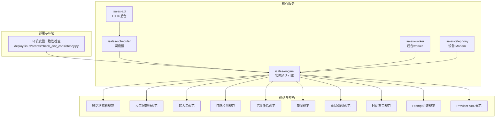
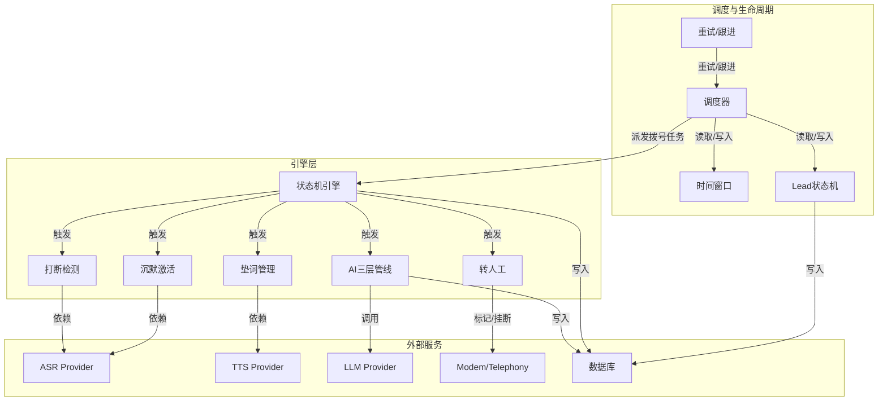
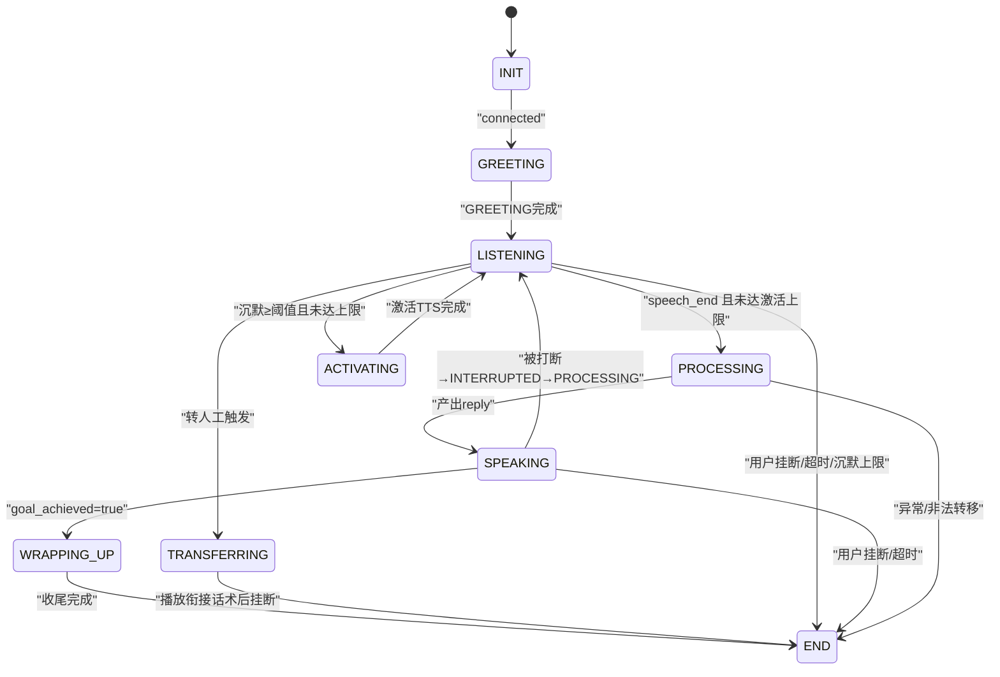
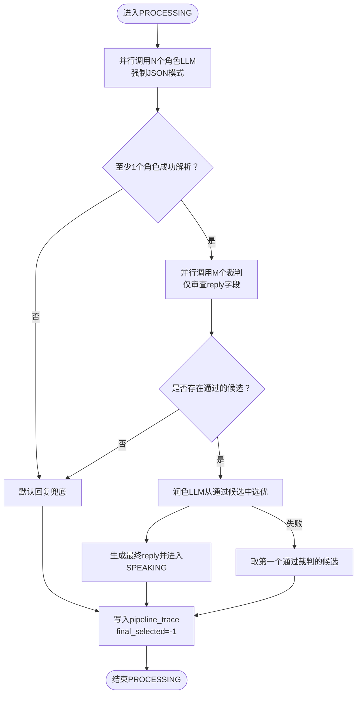
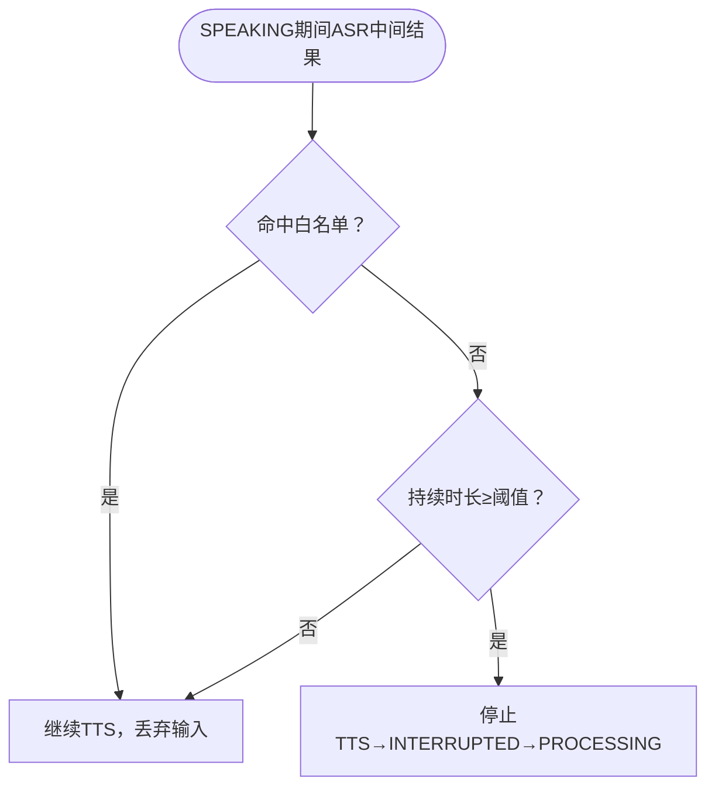
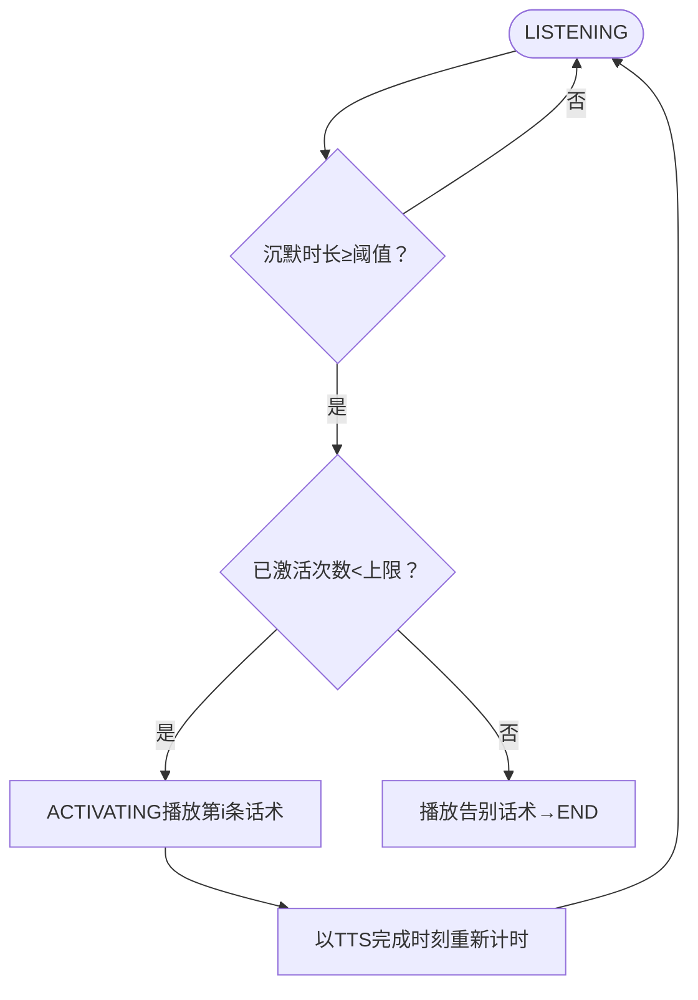
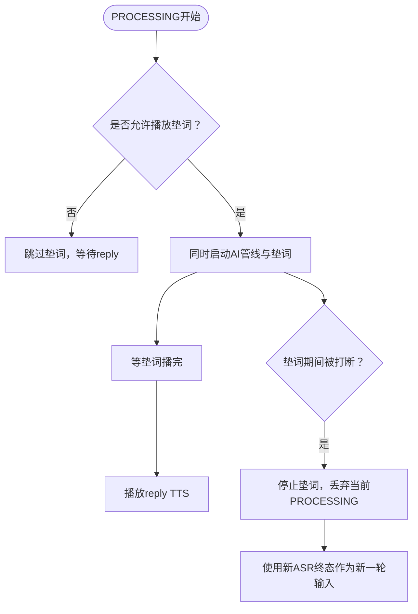
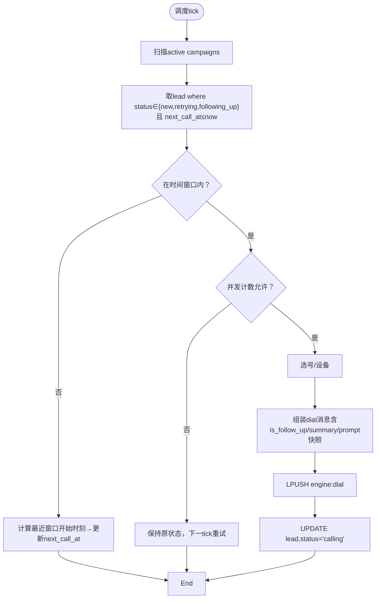
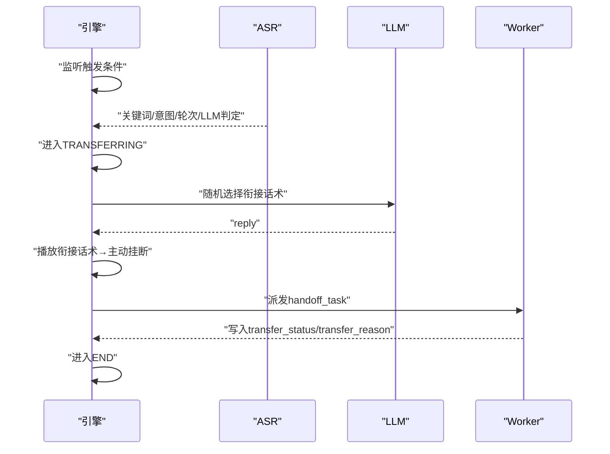
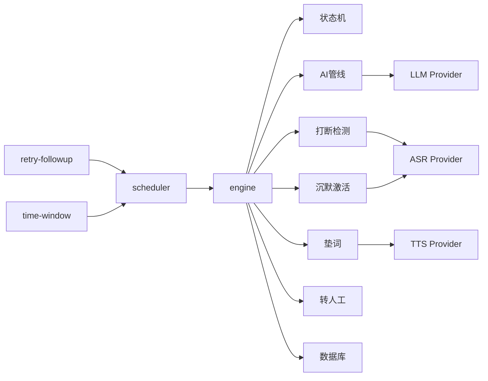

# 核心功能模块

<cite>
**本文引用的文件**
- [README.md](file://README.md)
- [call-state-machine/spec.md](file://openspec/specs/call-state-machine/spec.md)
- [ai-pipeline/spec.md](file://openspec/specs/ai-pipeline/spec.md)
- [human-handoff/spec.md](file://openspec/specs/human-handoff/spec.md)
- [interruption-detection/spec.md](file://openspec/specs/interruption-detection/spec.md)
- [silence-activation/spec.md](file://openspec/specs/silence-activation/spec.md)
- [filler/spec.md](file://openspec/specs/filler/spec.md)
- [retry-followup/spec.md](file://openspec/specs/retry-followup/spec.md)
- [time-window/spec.md](file://openspec/specs/time-window/spec.md)
- [role-prompt/spec.md](file://openspec/specs/role-prompt/spec.md)
- [provider-abc/spec.md](file://openspec/specs/provider-abc/spec.md)
- [check_env_consistency.py](file://deploy/linux/scripts/check_env_consistency.py)
</cite>

## 目录
1. [简介](#简介)
2. [项目结构](#项目结构)
3. [核心组件](#核心组件)
4. [架构总览](#架构总览)
5. [详细组件分析](#详细组件分析)
6. [依赖分析](#依赖分析)
7. [性能考量](#性能考量)
8. [故障排查指南](#故障排查指南)
9. [结论](#结论)
10. [附录](#附录)

## 简介
本文件面向iSales核心功能模块，系统化梳理并文档化以下能力：
- AI智能对话系统：三层并行管线（角色LLM并行+裁判LLM审查+润色LLM选优）
- 通话管理系统：状态机引擎与生命周期管理
- 实时行为模块：打断检测、沉默激活、垫词管理
- 调度与生命周期管理：重试、跟进、时间窗口
- 转人工机制：v1衰减为标记+通知，不实时桥接
- Provider抽象与配置：统一接口契约、错误模型与JSON模式

目标是帮助初学者建立概念理解，同时为高级开发者提供实现细节、配置选项与最佳实践。

## 项目结构
iSales采用多仓协作的分布式架构，核心模块位于isales-engine，其余模块分别承担API、调度、通话设备、Worker、Web管理面等职责。核心功能模块围绕engine展开，通过OpenSpec规格文件定义行为契约与数据模型。

图表来源
- [README.md:1-86](file://README.md#L1-L86)
- [check_env_consistency.py:1-161](file://deploy/linux/scripts/check_env_consistency.py#L1-L161)

章节来源
- [README.md:1-86](file://README.md#L1-L86)

## 核心组件
- 通话状态机引擎：定义11种通话状态及合法转换，承载所有实时行为（打断、垫词、沉默激活、转人工）的入口与出口。
- AI三层管线：角色LLM并行候选→裁判LLM并行审查→润色LLM选优，贯穿常规对话与收尾阶段。
- 实时行为模块：打断检测、沉默激活、垫词管理，协同状态机与Provider。
- 调度与生命周期：重试/跟进策略、时间窗口、lead状态机，保障业务闭环。
- 转人工机制：v1衰减为标记+通知，不实时桥接。
- Provider抽象：统一ASR/TTS/LLM接口、错误模型与JSON模式，便于供应商替换与测试。

章节来源
- [call-state-machine/spec.md:1-190](file://openspec/specs/call-state-machine/spec.md#L1-L190)
- [ai-pipeline/spec.md:1-166](file://openspec/specs/ai-pipeline/spec.md#L1-L166)
- [interruption-detection/spec.md:1-94](file://openspec/specs/interruption-detection/spec.md#L1-L94)
- [silence-activation/spec.md:1-99](file://openspec/specs/silence-activation/spec.md#L1-L99)
- [filler/spec.md:1-132](file://openspec/specs/filler/spec.md#L1-L132)
- [retry-followup/spec.md:1-176](file://openspec/specs/retry-followup/spec.md#L1-L176)
- [time-window/spec.md:1-86](file://openspec/specs/time-window/spec.md#L1-L86)
- [human-handoff/spec.md:1-128](file://openspec/specs/human-handoff/spec.md#L1-L128)
- [provider-abc/spec.md:1-131](file://openspec/specs/provider-abc/spec.md#L1-L131)

## 架构总览
下图展示核心模块间的交互关系与数据流，突出engine作为中枢协调AI管线、实时行为与调度/生命周期的能力。

图表来源
- [ai-pipeline/spec.md:1-166](file://openspec/specs/ai-pipeline/spec.md#L1-L166)
- [call-state-machine/spec.md:1-190](file://openspec/specs/call-state-machine/spec.md#L1-L190)
- [retry-followup/spec.md:1-176](file://openspec/specs/retry-followup/spec.md#L1-L176)
- [time-window/spec.md:1-86](file://openspec/specs/time-window/spec.md#L1-L86)
- [provider-abc/spec.md:1-131](file://openspec/specs/provider-abc/spec.md#L1-L131)

## 详细组件分析

### 通话状态机引擎
- 状态集合：INIT、GREETING、LISTENING、SPEAKING、INTERRUPTED、FILLER、PROCESSING、WRAPPING_UP、ACTIVATING、TRANSFERRING、END。
- 合法转移：由统一事件驱动，每次转换写入transcript；非法转移抛出异常并记录state_error。
- 关键转换：
  - 拨号成功→开场白→监听
  - 监听→处理（AI管线）→回复（SPEAKING）
  - 目标达成→播放收尾→结束
  - 沉默激活→播放激活话术→继续或挂断
  - 转人工→播放衔接话术→主动挂断→结束
  - 长时间无进展→挂断→结束
  - 用户挂断→结束
- 连续打断保护：超过阈值触发short_reply或listen_only策略；完整轮次后计数器清零。
- FILLER与PROCESSING并行：打断时立即停止垫词、丢弃当前PROCESSING，使用新ASR终态作为输入。
- WRAPPING_UP简化管线：单角色+润色，不启用PK/裁判。
- TRANSFERRING期间不调用AI管线，仅播放衔接话术后进入END。

图表来源
- [call-state-machine/spec.md:46-149](file://openspec/specs/call-state-machine/spec.md#L46-L149)

章节来源
- [call-state-machine/spec.md:1-190](file://openspec/specs/call-state-machine/spec.md#L1-L190)

### AI三层管线架构
- 三层编排：N个角色LLM并行→N×M个裁判LLM并行审查→1个润色LLM选优拟人化。
- 启动时机：与垫词同时启动，覆盖管线延迟；首轮PROCESSING写入pipeline_trace。
- 兜底/降级：全部角色失败→默认回复；全部裁判否决→默认回复；润色失败→取第一个通过裁判的候选；异常路径仍写pipeline_trace。
- 简化管线：WRAPPING_UP仅单角色+润色，不启用PK/裁判。
- 连续打断保护：short_reply在prompt追加“一句话回应”；listen_only跳过PROCESSING，直接TTS短引导语回LISTENING。
- 开场白：固定模板直接TTS；LLM生成开场白不走裁判/润色，但计入对话历史。

图表来源
- [ai-pipeline/spec.md:7-166](file://openspec/specs/ai-pipeline/spec.md#L7-L166)

章节来源
- [ai-pipeline/spec.md:1-166](file://openspec/specs/ai-pipeline/spec.md#L1-L166)

### 打断检测
- 双条件判定：命中白名单短语或说话时长低于阈值→不视为打断；否则视为打断，立即停止TTS并进入INTERRUPTED→PROCESSING。
- 不可撤销：已判定打断后命中白名单也不恢复TTS。
- 连续打断保护：超过阈值触发策略；完整轮次后计数器清零。
- 与FILLER/WRAPPING_UP：逻辑一致，仅后续PROCESSING路径调整。

图表来源
- [interruption-detection/spec.md:7-81](file://openspec/specs/interruption-detection/spec.md#L7-L81)

章节来源
- [interruption-detection/spec.md:1-94](file://openspec/specs/interruption-detection/spec.md#L1-L94)

### 沉默激活
- 触发条件：LISTENING状态下沉默时长≥阈值且未达激活上限→进入ACTIVATING，播放第i条激活话术。
- 激活上限：达到上限→播放告别话术后挂断→END（reason=silence_max_reached）。
- 计时规则：每次激活TTS完成后以TTS完成时刻重新计时。
- 话术选择：按数组下标顺序使用；不足时复用最后一条；多余时仅使用前N条。
- 上下文隔离：激活话术写入transcript但不进入角色LLM对话历史。

图表来源
- [silence-activation/spec.md:7-76](file://openspec/specs/silence-activation/spec.md#L7-L76)

章节来源
- [silence-activation/spec.md:1-99](file://openspec/specs/silence-activation/spec.md#L1-L99)

### 垫词管理
- 触发场景：常规PROCESSING；开场白首轮、WRAPPING_UP、转人工/激活/告别时不播放。
- 启动时机：与AI管线同时启动，TTS准备就绪后等垫词播完再接reply；即便管线快速返回也播完整段垫词。
- 打断处理：垫词期间被打断→立即停止垫词、丢弃当前PROCESSING，使用新ASR终态作为新一轮输入。
- 集合轮询：按sort_order升序轮询多个filler_set；同一通电话内集合内不重复使用，用尽后清空记录。
- 音频来源：预生成至OSS，运行时不实时TTS；新增/编辑触发再生任务；切换音色级联再生。
- 失败兜底：音频未就绪/下载失败→跳过垫词，直接等待reply。

图表来源
- [filler/spec.md:7-110](file://openspec/specs/filler/spec.md#L7-L110)

章节来源
- [filler/spec.md:1-132](file://openspec/specs/filler/spec.md#L1-L132)

### 调度与生命周期管理
- 重试与跟进：
  - 重试：技术失败（no_answer/user_busy/network_out_of_order/temporary_failure）→进入retrying，按retry_intervals指数退避，达到上限→failed。
  - 跟进：正常结束且未达成目标→进入following_up，按follow_up_interval_days固定间隔，达到上限→follow_up_exhausted。
  - 不重试：call_rejected或用户立即挂断→不重试。
- lead状态机：new/queued/calling→retrying/following_up→completed/failed/follow_up_exhausted/do_not_call/transferred。
- 调度循环：扫描active campaigns，筛选lead（status∈{new,retrying,following_up}且next_call_at≤now），检查时间窗口与并发，选号与设备，组装dial消息推送到engine队列；成功仅写status='calling'，后续由worker写回终态与下次时间。
- 跟进上下文：system prompt末尾追加上次通话摘要（由scheduler注入）。
- “勿打”识别：关键词命中或独立LLM判定任一成立→标记do_not_call并礼貌告别后挂断，清理未来调度任务。

图表来源
- [retry-followup/spec.md:119-159](file://openspec/specs/retry-followup/spec.md#L119-L159)
- [time-window/spec.md:51-78](file://openspec/specs/time-window/spec.md#L51-L78)

章节来源
- [retry-followup/spec.md:1-176](file://openspec/specs/retry-followup/spec.md#L1-L176)
- [time-window/spec.md:1-86](file://openspec/specs/time-window/spec.md#L1-L86)

### 转人工机制
- v1衰减为标记+通知：AI识别→礼貌告知→主动结束通话→派发handoff_task→坐席手动外呼。
- 四种独立触发机制（OR关系）：关键词、意图分类、轮次阈值、独立LLM判定。
- TRANSFERRING流程：播放衔接话术→TTS完成后主动挂断→写入transfer_status/transfer_reason→进入END。
- 与状态机交互：TRANSFERRING期间不调用AI管线；不存在转接成功/失败二级分支。

图表来源
- [human-handoff/spec.md:45-101](file://openspec/specs/human-handoff/spec.md#L45-L101)

章节来源
- [human-handoff/spec.md:1-128](file://openspec/specs/human-handoff/spec.md#L1-L128)

### Prompt组装与Provider抽象
- Prompt三段式：system message（角色身份/目标/JSON schema/收尾指令）+ user message（上次通话纪要/线索信息/对话历史）。
- WRAPPING_UP在system末尾追加收尾指令；跟进通话在system末尾追加跟进上下文。
- JSON Mode强制：优先原生JSON Mode，不支持时在system末尾贴schema并后处理。
- Provider ABC：ASR/TTS/LLM统一接口、异步流式、错误模型标准化（ProviderTimeout/RateLimited/InvalidRequest/ServerError）。
- Mock测试：提供mock实现与fixture，便于本地与CI测试。

章节来源
- [role-prompt/spec.md:1-185](file://openspec/specs/role-prompt/spec.md#L1-L185)
- [provider-abc/spec.md:1-131](file://openspec/specs/provider-abc/spec.md#L1-L131)

## 依赖分析
- 组件耦合：
  - 状态机引擎是中枢，实时行为模块（打断/沉默/垫词）与AI管线通过事件驱动接入。
  - 调度器与生命周期管理通过队列与数据库写回解耦engine。
  - Provider抽象隔离外部服务差异，便于替换与测试。
- 外部依赖：
  - ASR Provider：提供流式中间结果与VAD事件。
  - TTS Provider：提供流式PCM输出。
  - LLM Provider：支持chat接口与JSON Mode。
- 数据契约：
  - pipeline_trace：每轮PROCESSING写入，包含候选、裁判、润色与错误信息。
  - transcript：记录事件与状态转换，含state_error兜底。
  - hangup_cause：统一枚举，避免歧义。

图表来源
- [provider-abc/spec.md:20-107](file://openspec/specs/provider-abc/spec.md#L20-L107)
- [ai-pipeline/spec.md:40-69](file://openspec/specs/ai-pipeline/spec.md#L40-L69)
- [retry-followup/spec.md:119-159](file://openspec/specs/retry-followup/spec.md#L119-L159)

章节来源
- [provider-abc/spec.md:1-131](file://openspec/specs/provider-abc/spec.md#L1-L131)
- [ai-pipeline/spec.md:1-166](file://openspec/specs/ai-pipeline/spec.md#L1-L166)
- [retry-followup/spec.md:1-176](file://openspec/specs/retry-followup/spec.md#L1-L176)

## 性能考量
- 延迟优化：
  - 垫词与AI管线并行启动，缩短感知延迟。
  - TTS首包尽快返回，减少端到端延迟。
  - Prompt组装避免截断，依赖LLM长上下文能力，避免额外截断开销。
- 可靠性：
  - pipeline_trace写入失败重试与降级，不影响通话主路径。
  - Provider错误模型统一，便于快速降级与切换。
- 资源控制：
  - 调度器并发计数与时间窗口限制，避免资源过载。
  - 重试/跟进指数/固定间隔策略，平衡成功率与资源消耗。

## 故障排查指南
- 状态机异常：
  - 现象：非法状态转移或不可忽略事件导致异常。
  - 排查：检查transcript中的state_error事件，定位触发事件与当前状态；必要时强制进入END并跳过合法性校验。
- Provider错误：
  - 现象：超时/限流/非法请求/服务端错误。
  - 排查：依据ProviderError子类触发降级路径（候选淘汰/默认回复/首个通过裁判的候选）。
- 调度异常：
  - 现象：并发上限/选号失败/队列推送失败。
  - 排查：检查scheduler循环步骤与回滚逻辑，确认并发计数回滚与状态保持。
- 环境一致性：
  - 工具：使用环境变量一致性检查脚本，确保deploy/env与各服务README声明一致。

章节来源
- [call-state-machine/spec.md:33-45](file://openspec/specs/call-state-machine/spec.md#L33-L45)
- [provider-abc/spec.md:67-107](file://openspec/specs/provider-abc/spec.md#L67-L107)
- [retry-followup/spec.md:140-159](file://openspec/specs/retry-followup/spec.md#L140-L159)
- [check_env_consistency.py:118-156](file://deploy/linux/scripts/check_env_consistency.py#L118-L156)

## 结论
iSales核心功能模块以状态机引擎为中心，通过Provider抽象与OpenSpec规范实现高内聚、低耦合的实时通话系统。AI三层管线提供高质量回复，实时行为模块保障自然流畅的交互体验，调度与生命周期管理确保业务闭环与资源可控。v1转人工机制采用“标记+通知”，为后续实时桥接预留空间。建议在生产环境中结合时间窗口、重试/跟进策略与Provider错误模型，持续优化成功率与用户体验。

## 附录
- 配置要点速览（按模块）：
  - 打断检测：白名单短语、最小持续时长、连续打断上限、保护策略（short_reply/listen_only）
  - 沉默激活：沉默阈值、最大激活次数、激活话术序列、上限后的告别话术
  - 垫词：触发场景白名单、集合轮询与去重、预生成音频与失败兜底
  - AI三层管线：角色/裁判/润色配置、默认回复池、简化管线（WRAPPING_UP）
  - 调度与生命周期：重试间隔数组与上限、跟进间隔与上限、勿打识别关键词/LLM
  - 时间窗口：多窗口配置、节假日开关、跨边界保护
  - 转人工：关键词/意图/轮次/LLM四类触发器与衔接话术池
  - Prompt组装：system/user消息结构、收尾与跟进上下文追加、JSON Mode强制
  - Provider ABC：接口契约、错误模型、mock测试