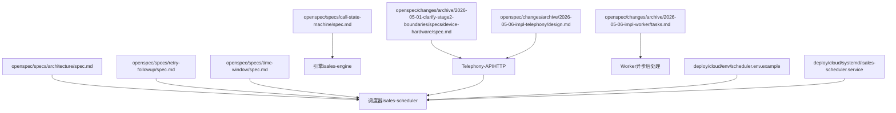
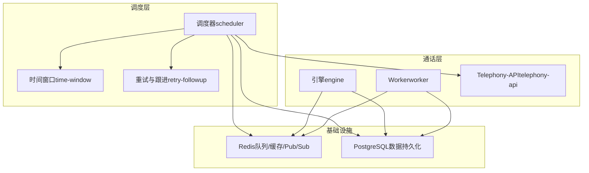
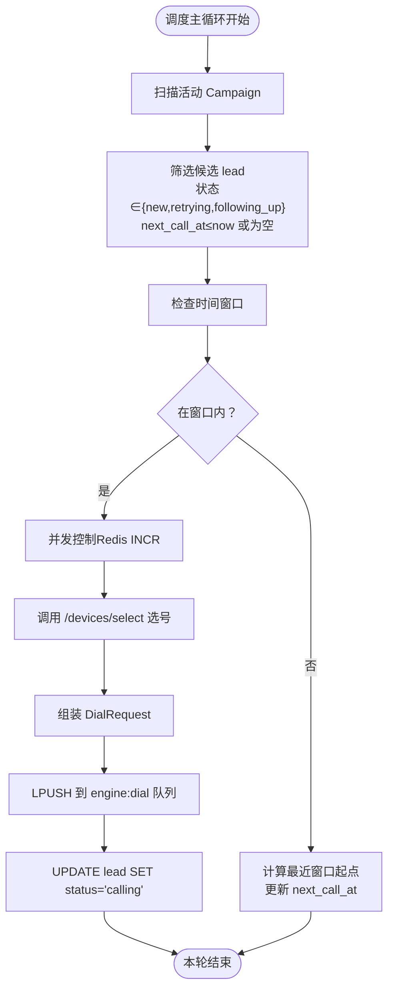
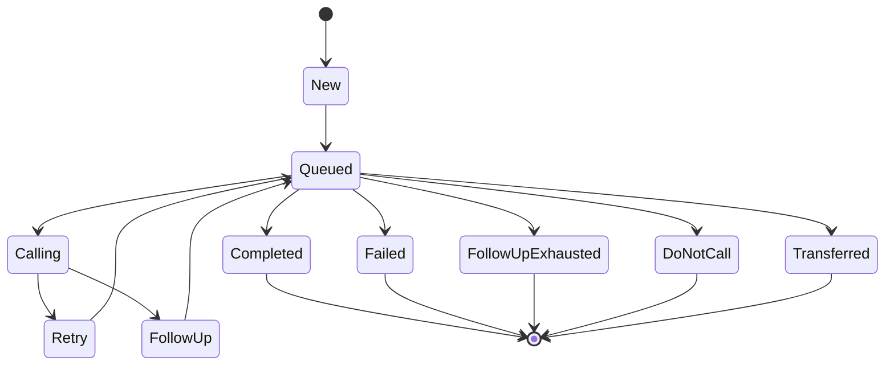
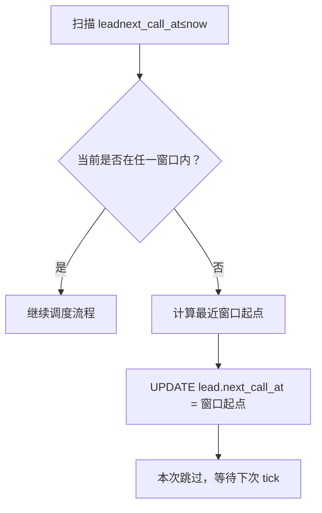
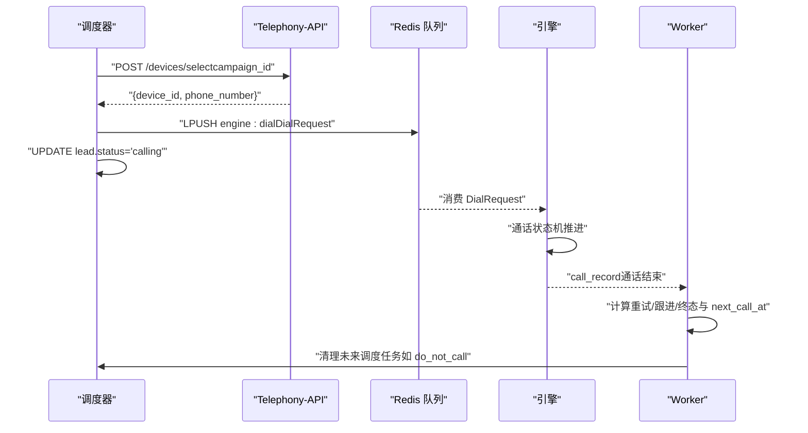
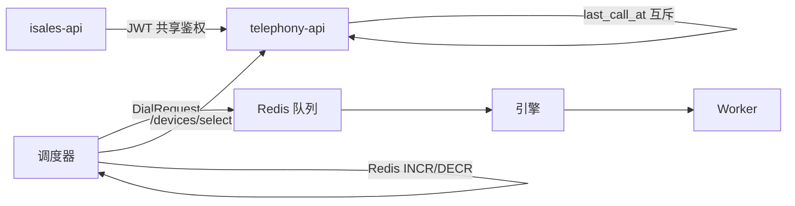

# 调度和生命周期管理

<cite>
**本文引用的文件**
- [架构规范](file://openspec/specs/architecture/spec.md)
- [重试与跟进规范](file://openspec/specs/retry-followup/spec.md)
- [时间窗口规范](file://openspec/specs/time-window/spec.md)
- [通话状态机规范](file://openspec/specs/call-state-machine/spec.md)
- [设备与选号规范（边界澄清）](file://openspec/changes/archive/2026-05-01-clarify-stage2-boundaries/specs/device-hardware/spec.md)
- [调度器实施提案（边界澄清）](file://openspec/changes/archive/2026-05-06-impl-scheduler/proposal.md)
- [Telephony 实施设计](file://openspec/changes/archive/2026-05-06-impl-telephony/design.md)
- [Worker 实施任务清单](file://openspec/changes/archive/2026-05-06-impl-worker/tasks.md)
- [调度器环境配置示例](file://deploy/cloud/env/scheduler.env.example)
- [调度器 systemd 服务](file://deploy/cloud/systemd/isales-scheduler.service)
</cite>

## 目录
1. [简介](#简介)
2. [项目结构](#项目结构)
3. [核心组件](#核心组件)
4. [架构总览](#架构总览)
5. [详细组件分析](#详细组件分析)
6. [依赖关系分析](#依赖关系分析)
7. [性能考虑](#性能考虑)
8. [故障排查指南](#故障排查指南)
9. [结论](#结论)
10. [附录](#附录)

## 简介
本文件面向 iSales 调度与生命周期管理，系统化阐述线索调度算法、重试与跟进策略、时间窗口管理、调度与通话系统的集成关系及性能影响。文档同时提供策略配置示例、优化建议、故障处理方案与监控指标，帮助初学者快速理解调度概念，为高级开发者提供定制与扩展指导。

## 项目结构
围绕调度与生命周期管理，相关规范与部署配置主要分布在以下位置：
- openspec/specs：系统架构、调度、时间窗口、通话状态机等规范
- openspec/changes/archive：阶段性实施提案与设计，明确调度器职责边界与实施顺序
- deploy/cloud/env：调度器环境变量示例
- deploy/cloud/systemd：调度器 systemd 服务配置

**图表来源**
- [架构规范](file://openspec/specs/architecture/spec.md)
- [重试与跟进规范](file://openspec/specs/retry-followup/spec.md)
- [时间窗口规范](file://openspec/specs/time-window/spec.md)
- [通话状态机规范](file://openspec/specs/call-state-machine/spec.md)
- [设备与选号规范（边界澄清）](file://openspec/changes/archive/2026-05-01-clarify-stage2-boundaries/specs/device-hardware/spec.md)
- [Telephony 实施设计](file://openspec/changes/archive/2026-05-06-impl-telephony/design.md)
- [Worker 实施任务清单](file://openspec/changes/archive/2026-05-06-impl-worker/tasks.md)
- [调度器环境配置示例](file://deploy/cloud/env/scheduler.env.example)
- [调度器 systemd 服务](file://deploy/cloud/systemd/isales-scheduler.service)

**章节来源**
- [架构规范](file://openspec/specs/architecture/spec.md)
- [调度器环境配置示例](file://deploy/cloud/env/scheduler.env.example)
- [调度器 systemd 服务](file://deploy/cloud/systemd/isales-scheduler.service)

## 核心组件
- 调度器（isales-scheduler）：负责扫描活动活动、过滤时间窗口、并发控制、设备选择、组装 DialRequest 并推送到引擎队列。严格遵守“仅写入 calling 状态”的契约，其他状态与 next_call_at 由 Worker 写回。
- Telephony-API：提供 /devices/select 选号接口，基于设备 last_call_at 实现负载均衡；并发选号采用互斥策略避免冲突。
- 引擎（isales-engine）：接收 DialRequest，驱动通话状态机，按状态机规则推进通话生命周期，最终落盘 call_record 并通知 Worker。
- Worker：消费 call_record，依据 hangup_cause 与目标达成情况决定重试/跟进/终态，计算并写回 next_call_at，清理未来调度任务。
- 时间窗口（time-window）：定义 Campaign 级多窗口、节假日、时区策略与窗外推迟规则。
- 重试与跟进（retry-followup）：定义重试/跟进的间隔策略、上限、勿打识别、状态机流转与调度数据流契约。

**章节来源**
- [重试与跟进规范](file://openspec/specs/retry-followup/spec.md)
- [时间窗口规范](file://openspec/specs/time-window/spec.md)
- [通话状态机规范](file://openspec/specs/call-state-machine/spec.md)
- [设备与选号规范（边界澄清）](file://openspec/changes/archive/2026-05-01-clarify-stage2-boundaries/specs/device-hardware/spec.md)

## 架构总览
调度系统在单主机部署模型下，通过 Redis 队列与 Pub/Sub 实现服务间解耦；调度器与引擎、Worker、Telephony-API 的交互遵循统一的消息契约与职责边界。

**图表来源**
- [架构规范](file://openspec/specs/architecture/spec.md)
- [重试与跟进规范](file://openspec/specs/retry-followup/spec.md)
- [时间窗口规范](file://openspec/specs/time-window/spec.md)

## 详细组件分析

### 调度算法与生命周期契约
调度器主循环每分钟执行一次，按以下步骤选取并派发线索：
1) 扫描活动 Campaign
2) 选取 lead（状态 ∈ {new, retrying, following_up} 且 next_call_at ≤ now 或为空）
3) 检查时间窗口
4) 并发控制（Redis INCR）
5) 调用 Telephony-API /devices/select 选择设备与主叫
6) 组装 DialRequest（携带历史摘要、是否跟进、跟进轮次、prompt 版本快照）
7) 推送至引擎队列

派发成功后仅写入 lead.status='calling'，不写终态或重试/跟进 next_call_at；失败则保持原状态并回滚并发计数。

**图表来源**
- [重试与跟进规范](file://openspec/specs/retry-followup/spec.md)
- [设备与选号规范（边界澄清）](file://openspec/changes/archive/2026-05-01-clarify-stage2-boundaries/specs/device-hardware/spec.md)

**章节来源**
- [重试与跟进规范](file://openspec/specs/retry-followup/spec.md)
- [调度器实施提案（边界澄清）](file://openspec/changes/archive/2026-05-06-impl-scheduler/proposal.md)

### 重试与跟进策略
- 重试策略：指数退避数组 + 最大次数。第 N 次重试间隔 = retry_intervals[N-1]；超出数组长度时使用最后一项。达到上限后 lead 状态进入 failed。
- 跟进策略：固定间隔 + 最大次数。下次跟进时间 = 上次通话结束时间 + N × follow_up_interval_days。达到上限后 lead 状态进入 follow_up_exhausted。
- 勿打识别：关键词命中或独立 LLM 判定任一成立即标记 do_not_call，并清理未来调度任务。
- 状态机：new → queued → calling → retrying → queued 或 following_up → queued；终态包括 completed、failed、follow_up_exhausted、do_not_call、transferred。

**图表来源**
- [重试与跟进规范](file://openspec/specs/retry-followup/spec.md)

**章节来源**
- [重试与跟进规范](file://openspec/specs/retry-followup/spec.md)

### 时间窗口管理
- Campaign 级多窗口配置：支持周一至周五双时段、周末单时段等组合。
- 时区策略：统一按服务器时区（如 Asia/Shanghai）解析窗口与 next_call_at。
- 节假日：维护全局 holiday 表，Campaign 可选择是否遵从；启用时节假日当天视为窗外。
- 窗口外推迟：若 lead 应拨但当前不在任何窗口内，则计算最近窗口起点并更新 next_call_at。
- 跨边界保护：通话进行中跨过窗口结束时刻不强制中断，仅不再分配新任务。

**图表来源**
- [时间窗口规范](file://openspec/specs/time-window/spec.md)

**章节来源**
- [时间窗口规范](file://openspec/specs/time-window/spec.md)

### 调度与通话系统集成
- 选号与负载均衡：Telephony-API 的 /devices/select 基于 device.last_call_at 最早优先，实现设备间负载均衡；并发选号采用互斥策略，避免重复占用。
- 选号失败回滚：调度器在选号失败时回滚并发计数，保持 lead 状态不变，等待下一 tick。
- 引擎状态机：调度器派发后，引擎按状态机推进通话生命周期，最终落盘 call_record 并通知 Worker。
- Worker 写回：Worker 根据 hangup_cause 与目标达成决定后续状态与 next_call_at，清理未来调度任务。

**图表来源**
- [设备与选号规范（边界澄清）](file://openspec/changes/archive/2026-05-01-clarify-stage2-boundaries/specs/device-hardware/spec.md)
- [通话状态机规范](file://openspec/specs/call-state-machine/spec.md)
- [重试与跟进规范](file://openspec/specs/retry-followup/spec.md)

**章节来源**
- [设备与选号规范（边界澄清）](file://openspec/changes/archive/2026-05-01-clarify-stage2-boundaries/specs/device-hardware/spec.md)
- [Telephony 实施设计](file://openspec/changes/archive/2026-05-06-impl-telephony/design.md)
- [Worker 实施任务清单](file://openspec/changes/archive/2026-05-06-impl-worker/tasks.md)

## 依赖关系分析
- 服务边界：调度器依赖 Telephony-API 的 /devices/select 与 isales-common 的消息契约；引擎与 Worker 通过 Redis 队列解耦；API 与 Telephony-API 共享 JWT 鉴权体系。
- 数据一致性：调度器仅写入 calling 状态，其他状态与 next_call_at 由 Worker 写回，形成硬契约，避免竞态。
- 并发与负载：Redis 全局并发计数器与 Telephony-API 的选号互斥保障系统稳定性；设备 last_call_at 实现负载均衡。

**图表来源**
- [架构规范](file://openspec/specs/architecture/spec.md)
- [设备与选号规范（边界澄清）](file://openspec/changes/archive/2026-05-01-clarify-stage2-boundaries/specs/device-hardware/spec.md)

**章节来源**
- [架构规范](file://openspec/specs/architecture/spec.md)
- [设备与选号规范（边界澄清）](file://openspec/changes/archive/2026-05-01-clarify-stage2-boundaries/specs/device-hardware/spec.md)

## 性能考虑
- 并发控制：使用 Redis INCR 限制并发，避免超配导致设备争用与系统抖动。建议根据设备数量与 CPU 资源设置合理上限。
- 负载均衡：Telephony-API 以 last_call_at 最早优先选号，结合设备空闲状态过滤，降低热点设备压力。
- 队列吞吐：确保 Redis 队列与消费者（引擎/Worker）具备足够吞吐能力，避免积压。
- 时间窗口优化：合理配置 time_windows 与节假日策略，减少无效调度与设备空转。
- I/O 与 CPU：Worker 的摘要与回调处理应异步化，避免阻塞调度主循环。

## 故障排查指南
- 调度失败回滚：若并发控制、选号、消息构造或入队失败，lead 状态保持原值，调度器回滚并发计数。检查 Redis 连接、Telephony-API 健康与队列可用性。
- 窗口外推迟：若 lead 被推迟，确认 time_windows 配置与时区设置；检查 holiday 表是否正确加载。
- 重试/跟进异常：核对 campaign.retry_intervals 与 follow_up_interval_days 配置；确认 Worker 是否正确写回 next_call_at。
- 勿打识别：检查 do_not_call_keywords 与 LLM 判定开关；确认 Worker 清理未来调度任务。
- 引擎状态机异常：关注 transcript 中 state_error 事件，定位非法状态转移；核对事件来源与模块处理逻辑。

**章节来源**
- [重试与跟进规范](file://openspec/specs/retry-followup/spec.md)
- [时间窗口规范](file://openspec/specs/time-window/spec.md)
- [通话状态机规范](file://openspec/specs/call-state-machine/spec.md)

## 结论
iSales 调度与生命周期管理通过明确的职责边界与硬契约，实现了可预测的调度、可靠的重试/跟进与灵活的时间窗口控制。调度器专注于“选号+派发”，Worker 负责“状态写回”，引擎专注“通话状态机”，配合 Telephony-API 的负载均衡与互斥选号，形成高可靠、易扩展的通话自动化流水线。建议在生产环境中结合监控指标与告警策略，持续优化并发与时间窗口配置，确保系统稳定与性能。

## 附录

### 策略配置示例（路径）
- 调度器环境变量示例：[调度器环境配置示例](file://deploy/cloud/env/scheduler.env.example)
- 调度器 systemd 服务：[调度器 systemd 服务](file://deploy/cloud/systemd/isales-scheduler.service)

### 监控指标建议
- 调度器
  - 调度循环耗时（秒）
  - 成功派发数/失败数
  - 并发计数器峰值
  - 窗口外推迟率
- Telephony-API
  - /devices/select 响应时间与成功率
  - 设备空闲率与 last_call_at 分布
- 引擎
  - 状态机各状态停留时长分布
  - 通话时长与目标达成率
- Worker
  - 摘要生成耗时与成功率
  - 重试/跟进状态写回延迟