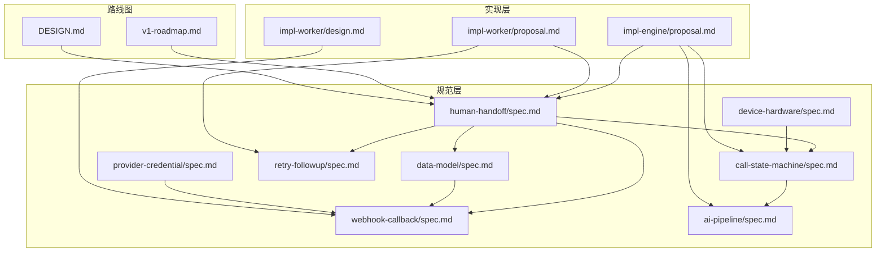
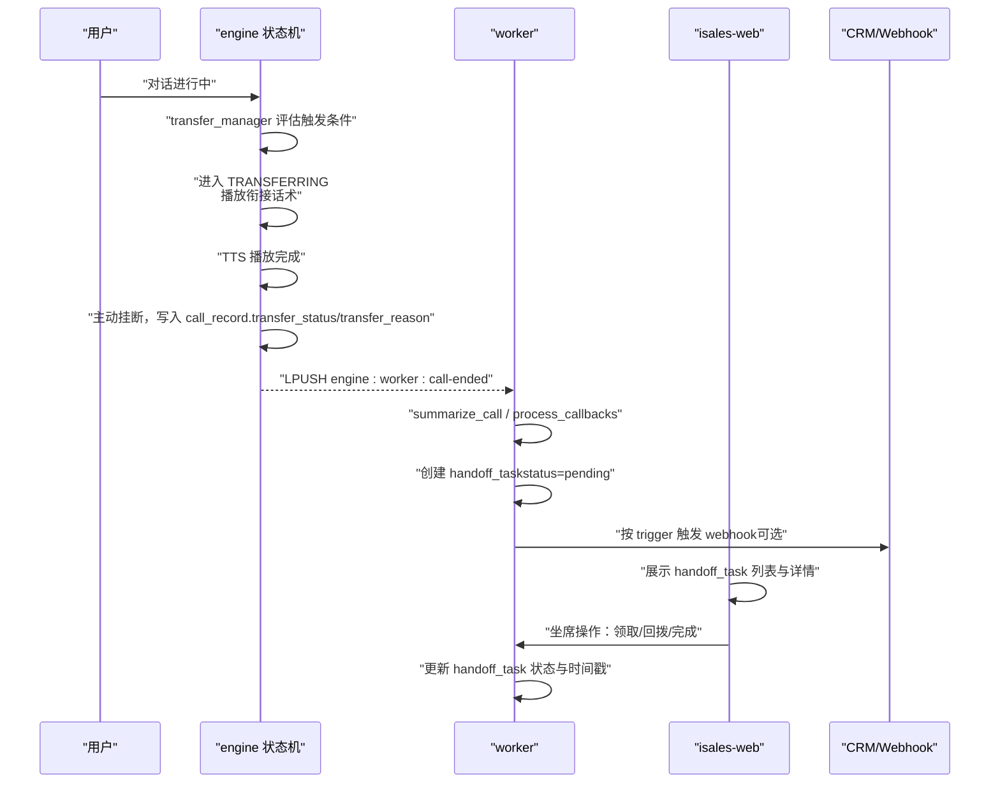
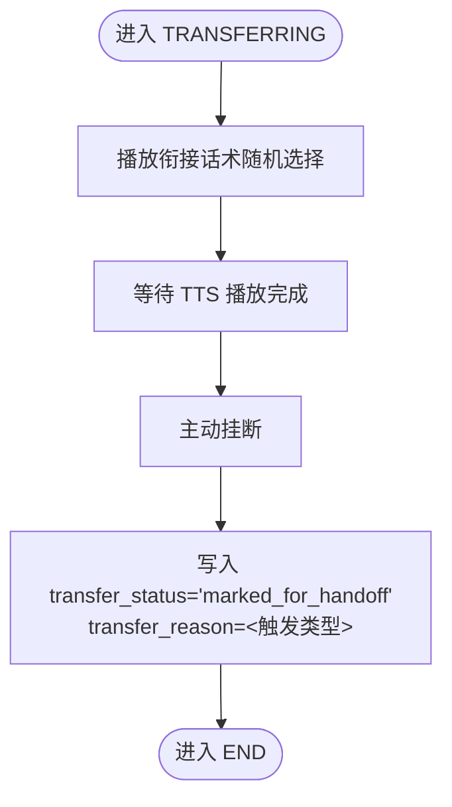
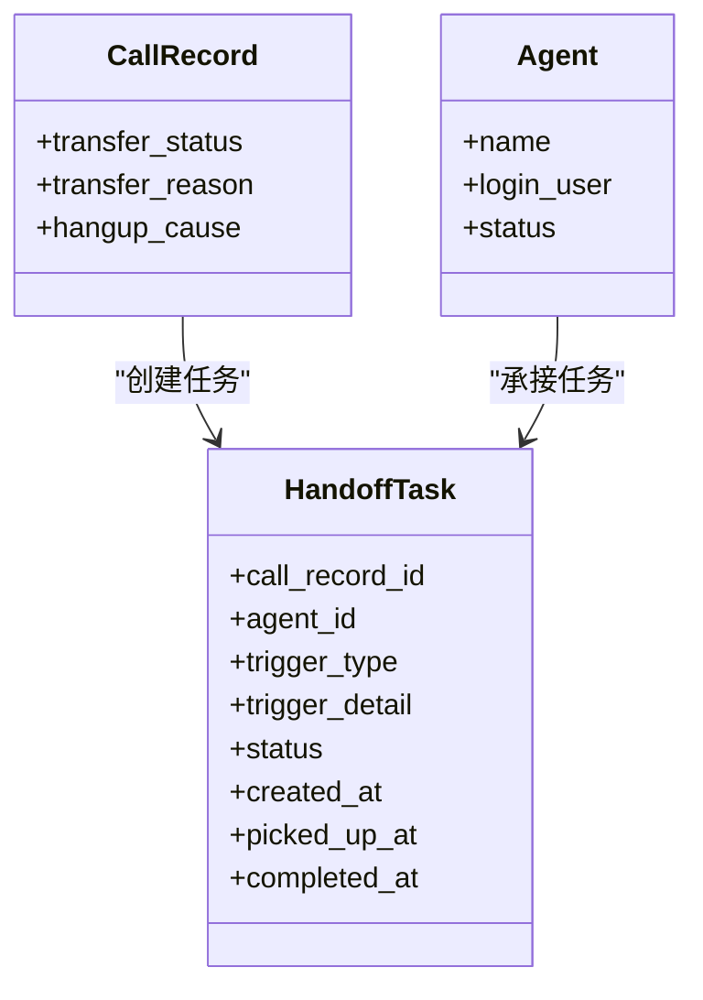
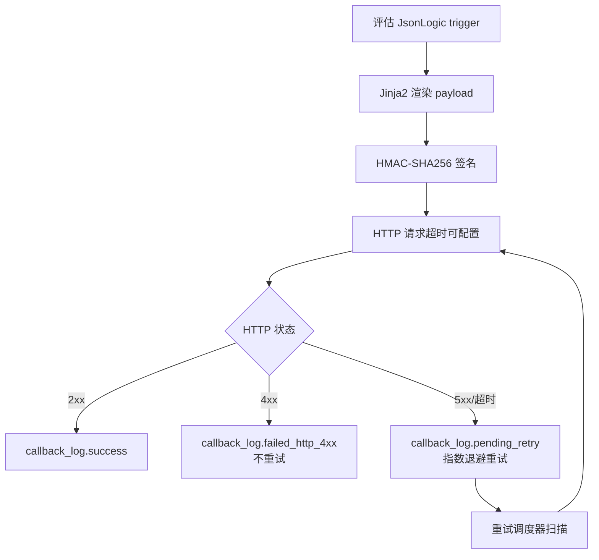
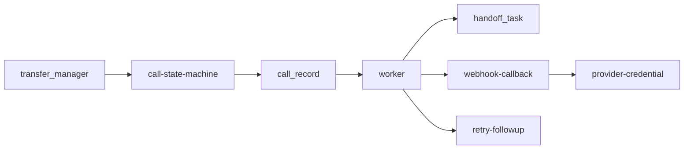

# 转人工机制

<cite>
**本文档引用的文件**
- [human-handoff/spec.md](file://openspec/specs/human-handoff/spec.md)
- [call-state-machine/spec.md](file://openspec/specs/call-state-machine/spec.md)
- [data-model/spec.md](file://openspec/specs/data-model/spec.md)
- [retry-followup/spec.md](file://openspec/specs/retry-followup/spec.md)
- [webhook-callback/spec.md](file://openspec/specs/webhook-callback/spec.md)
- [v1-roadmap.md](file://openspec/v1-roadmap.md)
- [DESIGN.md](file://DESIGN.md)
- [ai-pipeline/spec.md](file://openspec/specs/ai-pipeline/spec.md)
- [device-hardware/spec.md](file://openspec/specs/device-hardware/spec.md)
- [impl-engine/proposal.md](file://openspec/changes/archive/2026-05-07-impl-engine/proposal.md)
- [impl-worker/proposal.md](file://openspec/changes/archive/2026-05-06-impl-worker/proposal.md)
- [impl-worker/design.md](file://openspec/changes/archive/2026-05-06-impl-worker/design.md)
- [provider-credential/spec.md](file://openspec/changes/archive/2026-05-24-impl-provider-credential-db-ssot/specs/provider-credential/spec.md)
</cite>

## 目录
1. [简介](#简介)
2. [项目结构](#项目结构)
3. [核心组件](#核心组件)
4. [架构概览](#架构概览)
5. [详细组件分析](#详细组件分析)
6. [依赖分析](#依赖分析)
7. [性能考虑](#性能考虑)
8. [故障排查指南](#故障排查指南)
9. [结论](#结论)
10. [附录](#附录)

## 简介
本文件系统化阐述 iSales 转人工机制（v1 衰减实现），涵盖触发条件设计与实现、标记与通知流程、与 AI 系统的协同、配置参数、v1 限制与 v2 规划，以及面向开发者的最佳实践与故障排查方法。v1 采用"标记 + 通知 + 主动挂断"的非实时桥接路径，强调用户体验与通话质量的平衡，并通过 worker 阶段 3B 派发 handoff_task，由坐席在 isales-web 中手动回拨。

## 项目结构
围绕转人工机制的关键规范与实现分布在以下模块：
- 业务规范：human-handoff、call-state-machine、data-model、retry-followup、webhook-callback、ai-pipeline、device-hardware、provider-credential
- 实现阶段：impl-engine、impl-worker（含 proposal 与 design）
- 路线图与范围：v1-roadmap、DESIGN

**图表来源**
- [human-handoff/spec.md:1-128](file://openspec/specs/human-handoff/spec.md#L1-L128)
- [call-state-machine/spec.md:1-190](file://openspec/specs/call-state-machine/spec.md#L1-L190)
- [data-model/spec.md:28-51](file://openspec/specs/data-model/spec.md#L28-L51)
- [retry-followup/spec.md:90-138](file://openspec/specs/retry-followup/spec.md#L90-L138)
- [webhook-callback/spec.md:1-231](file://openspec/specs/webhook-callback/spec.md#L1-L231)
- [ai-pipeline/spec.md:1-166](file://openspec/specs/ai-pipeline/spec.md#L1-L166)
- [device-hardware/spec.md:1-31](file://openspec/specs/device-hardware/spec.md#L1-L31)
- [impl-engine/proposal.md:62-70](file://openspec/changes/archive/2026-05-07-impl-engine/proposal.md#L62-L70)
- [impl-worker/proposal.md:12-16](file://openspec/changes/archive/2026-05-06-impl-worker/proposal.md#L12-L16)
- [v1-roadmap.md:526-530](file://openspec/v1-roadmap.md#L526-L530)
- [DESIGN.md:57-75](file://DESIGN.md#L57-L75)

**章节来源**
- [human-handoff/spec.md:1-128](file://openspec/specs/human-handoff/spec.md#L1-L128)
- [call-state-machine/spec.md:1-190](file://openspec/specs/call-state-machine/spec.md#L1-L190)
- [data-model/spec.md:28-51](file://openspec/specs/data-model/spec.md#L28-L51)
- [retry-followup/spec.md:90-138](file://openspec/specs/retry-followup/spec.md#L90-L138)
- [webhook-callback/spec.md:1-231](file://openspec/specs/webhook-callback/spec.md#L1-L231)
- [ai-pipeline/spec.md:1-166](file://openspec/specs/ai-pipeline/spec.md#L1-L166)
- [device-hardware/spec.md:1-31](file://openspec/specs/device-hardware/spec.md#L1-L31)
- [impl-engine/proposal.md:62-70](file://openspec/changes/archive/2026-05-07-impl-engine/proposal.md#L62-L70)
- [impl-worker/proposal.md:12-16](file://openspec/changes/archive/2026-05-06-impl-worker/proposal.md#L12-L16)
- [v1-roadmap.md:526-530](file://openspec/v1-roadmap.md#L526-L530)
- [DESIGN.md:57-75](file://DESIGN.md#L57-L75)

## 核心组件
- 转人工触发器（transfer_manager）：实现关键词、意图分类、轮次阈值、独立 LLM 四类触发，OR 关系短路评估，命中后驱动状态机进入 TRANSFERRING。
- 状态机（call-state-machine）：定义 TRANSFERRING 状态下的行为边界（不调用 AI 管线、仅补录 transcript、无转接成功/失败二级分支）。
- 通话记录（call_record）：写入 transfer_status 与 transfer_reason，作为 worker 派发 handoff_task 的依据。
- 任务派发（worker）：在收到 CallEnded 消息后，基于 hangup_cause 与 transfer_status 创建 handoff_task，并按需触发 webhook。
- 坐席工作流（isales-web）：展示 handoff_task 列表与详情，支持领取/回拨/完成等状态流转。
- 通知与回调（webhook-callback）：基于 JsonLogic trigger 与 Jinja2 payload 模板，配合 HMAC-SHA256 签名与指数退避重试。

**章节来源**
- [impl-engine/proposal.md:62-70](file://openspec/changes/archive/2026-05-07-impl-engine/proposal.md#L62-L70)
- [call-state-machine/spec.md:137-145](file://openspec/specs/call-state-machine/spec.md#L137-L145)
- [data-model/spec.md:38-38](file://openspec/specs/data-model/spec.md#L38-L38)
- [impl-worker/proposal.md:12-16](file://openspec/changes/archive/2026-05-06-impl-worker/proposal.md#L12-L16)
- [webhook-callback/spec.md:5-18](file://openspec/specs/webhook-callback/spec.md#L5-L18)

## 架构概览
v1 的转人工机制遵循"AI 触发 → 主动挂断 → 标记写库 → worker 派发任务 → 坐席回拨"的链路，不引入 SIP/PBX 设施，确保与硬件/网络环境解耦。

**图表来源**
- [impl-engine/proposal.md:62-70](file://openspec/changes/archive/2026-05-07-impl-engine/proposal.md#L62-L70)
- [impl-worker/proposal.md:12-16](file://openspec/changes/archive/2026-05-06-impl-worker/proposal.md#L12-L16)
- [webhook-callback/spec.md:5-18](file://openspec/specs/webhook-callback/spec.md#L5-L18)
- [data-model/spec.md:32-33](file://openspec/specs/data-model/spec.md#L32-L33)

## 详细组件分析

### 触发条件与评估流程
- 四类触发机制（独立启用/OR 短路）：
  - 关键词触发：ASR 终态包含 campaign.transfer_keywords 且 transfer_keyword_enabled=true
  - 意图分类触发：轻量意图分类器概率 > threshold 且 transfer_intent_enabled=true
  - 轮次阈值触发：对话轮次 > threshold 且未达成目标且 transfer_round_enabled=true
  - 独立 LLM 触发：独立 LLM 输出 {"transfer": true} 且 transfer_llm_enabled=true
- 评估顺序：keyword → round → intent → llm，命中即进入 TRANSFERRING
- TRANSFERRING 期间：不调用 AI 管线，仅补录 transcript；TTS 播放完成后主动挂断并写入 call_record

**图表来源**
- [human-handoff/spec.md:49-57](file://openspec/specs/human-handoff/spec.md#L49-L57)
- [call-state-machine/spec.md:137-145](file://openspec/specs/call-state-machine/spec.md#L137-L145)

**章节来源**
- [human-handoff/spec.md:21-44](file://openspec/specs/human-handoff/spec.md#L21-L44)
- [impl-engine/proposal.md:62-69](file://openspec/changes/archive/2026-05-07-impl-engine/proposal.md#L62-L69)
- [call-state-machine/spec.md:95-99](file://openspec/specs/call-state-machine/spec.md#L95-L99)

### 标记与通知流程
- 标记状态管理：
  - call_record.transfer_status 写入 "marked_for_handoff"
  - call_record.transfer_reason 记录触发类型
- 任务派发：
  - worker 收到 CallEnded 后创建 handoff_task（status=pending，agent_id=null）
  - 如配置了 callback_config 且 trigger 命中，触发 webhook
- 坐席工作流：
  - isales-web 展示 pending 列表，按创建时间倒序
  - 详情包含用户线索、转接原因、完整 transcript、已提取字段、触发时刻、距今时长
  - 状态流转：pending → in_progress → completed，记录 picked_up_at/completed_at

**图表来源**
- [data-model/spec.md:32-33](file://openspec/specs/data-model/spec.md#L32-L33)
- [impl-worker/proposal.md:12-16](file://openspec/changes/archive/2026-05-06-impl-worker/proposal.md#L12-L16)
- [human-handoff/spec.md:78-87](file://openspec/specs/human-handoff/spec.md#L78-L87)

**章节来源**
- [impl-worker/proposal.md:12-16](file://openspec/changes/archive/2026-05-06-impl-worker/proposal.md#L12-L16)
- [human-handoff/spec.md:59-87](file://openspec/specs/human-handoff/spec.md#L59-L87)

### 与 AI 系统的协调
- TRANSFERRING 期间不调用 AI 管线，避免与实时桥接冲突
- ASR 可继续流式工作以补录最后一条 transcript
- WRAPPING_UP 简化管线（单角色 + 润色），不启用 PK/裁判
- pipeline_trace 在 TRANSFERRING 期间不写（v1 简化），但在 END 时按规范落库

**章节来源**
- [call-state-machine/spec.md:137-145](file://openspec/specs/call-state-machine/spec.md#L137-L145)
- [ai-pipeline/spec.md:150-158](file://openspec/specs/ai-pipeline/spec.md#L150-L158)

### 通知渠道与回调配置
- 触发表达式：JsonLogic，字段范围包括 goal_achieved、goal_type、extracted.*、lead.*、call.*
- 负载模板：Jinja2 SandboxedEnvironment，StrictUndefined 防止静默错误
- 签名机制：HMAC-SHA256，X-Isales-Signature + X-Isales-Timestamp + Content-Type
- 重试策略：指数退避 + 最大次数，独立重试调度器按 next_retry_at 扫描
- 安全存储：signing_secret 通过 Fernet 加密存储，一次性返回明文

**图表来源**
- [webhook-callback/spec.md:100-133](file://openspec/specs/webhook-callback/spec.md#L100-L133)
- [impl-worker/design.md:74-88](file://openspec/changes/archive/2026-05-06-impl-worker/design.md#L74-L88)
- [provider-credential/spec.md:137-165](file://openspec/changes/archive/2026-05-24-impl-provider-credential-db-ssot/specs/provider-credential/spec.md#L137-L165)

**章节来源**
- [webhook-callback/spec.md:5-18](file://openspec/specs/webhook-callback/spec.md#L5-L18)
- [impl-worker/design.md:74-88](file://openspec/changes/archive/2026-05-06-impl-worker/design.md#L74-L88)
- [provider-credential/spec.md:137-165](file://openspec/changes/archive/2026-05-24-impl-provider-credential-db-ssot/specs/provider-credential/spec.md#L137-L165)

### v1 限制与 v2 规划
- v1 限制：
  - 不引入 SIP/PBX 设施，不做实时话路桥接
  - 转人工仅做"标记 + 通知 + 主动挂断"，无实时桥接
  - boss console v1.0 不暴露转人工配置 UI（代码保留，触发默认关闭）
- v2 候选方案（三选一）：
  - GSM 呼叫转接（AT+CHLD=4）
  - 自研 SIP 软话机集成
  - 引入 FreeSWITCH 仅做 bridge

**章节来源**
- [human-handoff/spec.md:1-3](file://openspec/specs/human-handoff/spec.md#L1-L3)
- [v1-roadmap.md:526-530](file://openspec/v1-roadmap.md#L526-L530)
- [DESIGN.md:69-74](file://DESIGN.md#L69-L74)

## 依赖分析
- 状态机与触发器：transfer_manager 依赖 call-state-machine 的 TRANSFERRING 状态边界
- 数据模型：handoff_task 与 agent 表支撑坐席工作流
- 通知系统：webhook-callback 与 provider-credential 共同保障安全与可靠性
- 调度与重试：retry-followup 决策矩阵与 worker lead 状态写回

**图表来源**
- [impl-engine/proposal.md:62-70](file://openspec/changes/archive/2026-05-07-impl-engine/proposal.md#L62-L70)
- [impl-worker/proposal.md:40-51](file://openspec/changes/archive/2026-05-06-impl-worker/proposal.md#L40-L51)
- [webhook-callback/spec.md:100-133](file://openspec/specs/webhook-callback/spec.md#L100-L133)
- [provider-credential/spec.md:137-165](file://openspec/changes/archive/2026-05-24-impl-provider-credential-db-ssot/specs/provider-credential/spec.md#L137-L165)

**章节来源**
- [impl-engine/proposal.md:62-70](file://openspec/changes/archive/2026-05-07-impl-engine/proposal.md#L62-L70)
- [impl-worker/proposal.md:40-51](file://openspec/changes/archive/2026-05-06-impl-worker/proposal.md#L40-L51)
- [webhook-callback/spec.md:100-133](file://openspec/specs/webhook-callback/spec.md#L100-L133)

## 性能考虑
- v1 降低复杂度：不引入实时桥接，避免 SIP/PBX 带来的网络与设备耦合
- 通话质量保障：TRANSFERRING 期间不调用 AI 管线，确保 TTS 播放与挂断的确定性
- 回调可靠性：独立重试调度器与指数退避，避免对主流程的干扰
- 并发与资源：engine 与 worker 的并发计数器与状态机边界，防止资源泄漏

[本节为通用指导，无需特定文件来源]

## 故障排查指南
- 触发未生效
  - 检查 campaign 配置项是否启用（transfer_keyword_enabled/transfer_intent_enabled/transfer_round_enabled/transfer_llm_enabled）
  - 确认评估顺序与 OR 短路逻辑
- TRANSFERRING 未触发
  - 核对 ASR 终态是否包含关键词
  - 意图分类概率是否超过阈值
  - 轮次阈值与目标达成状态
- 标记未写入
  - 确认 call_record 字段写入逻辑（transfer_status/transfer_reason）
- 任务未派发
  - 检查 worker 是否收到 CallEnded 消息
  - 校验 lead 状态写回逻辑（retry-followup 决策矩阵）
- 回调失败
  - JsonLogic 语法与字段引用是否正确
  - Jinja2 模板是否存在未定义变量
  - 签名与超时配置是否正确
  - 重试策略是否达到上限

**章节来源**
- [impl-engine/proposal.md:62-70](file://openspec/changes/archive/2026-05-07-impl-engine/proposal.md#L62-L70)
- [impl-worker/proposal.md:40-51](file://openspec/changes/archive/2026-05-06-impl-worker/proposal.md#L40-L51)
- [webhook-callback/spec.md:134-170](file://openspec/specs/webhook-callback/spec.md#L134-L170)

## 结论
iSales v1 的转人工机制以"标记 + 通知 + 主动挂断"为核心，通过严格的触发评估与状态机边界，确保通话质量与用户体验。worker 阶段 3B 的 handoff_task 派发与 isales-web 的坐席工作流形成闭环，配合 webhook-callback 的安全可靠通知，满足企业级部署要求。v2 将探索实时桥接方案，进一步提升转人工效率与用户体验。

[本节为总结，无需特定文件来源]

## 附录

### 配置参数清单
- 关键词触发
  - transfer_keyword_enabled: 布尔
  - transfer_keywords: JSONB 数组
- 意图分类触发
  - transfer_intent_enabled: 布尔
  - transfer_intent_threshold: 数值（概率阈值）
- 轮次阈值触发
  - transfer_round_enabled: 布尔
  - transfer_round_threshold: 数值（轮次阈值）
- 独立 LLM 触发
  - transfer_llm_enabled: 布尔
  - transfer_llm_prompt_version_id: 字符串（prompt 版本引用）
- 衔接话术
  - transfer_phrases: JSONB 数组（至少 1 条非空字符串）

**章节来源**
- [human-handoff/spec.md:111-123](file://openspec/specs/human-handoff/spec.md#L111-L123)

### 转人工配置示例（步骤说明）
- 启用关键词触发：在 campaign 中开启 transfer_keyword_enabled，并配置 transfer_keywords
- 设置意图分类阈值：transfer_intent_enabled=true，transfer_intent_threshold=0.8
- 配置轮次阈值：transfer_round_enabled=true，transfer_round_threshold=5
- 配置独立 LLM：transfer_llm_enabled=true，transfer_llm_prompt_version_id 指向对应 prompt 版本
- 衔接话术池：transfer_phrases 至少包含 1 条话术

**章节来源**
- [human-handoff/spec.md:25-43](file://openspec/specs/human-handoff/spec.md#L25-L43)
- [impl-engine/proposal.md:62-69](file://openspec/changes/archive/2026-05-07-impl-engine/proposal.md#L62-L69)

### 最佳实践建议
- 触发策略：四类触发独立启用，OR 短路评估，避免过度触发
- 话术设计：衔接话术简洁礼貌，体现品牌专业度
- 回调配置：JsonLogic 与 Jinja2 模板严格校验，启用失败渲染与 4xx 不重试策略
- 安全与合规：signing_secret 加密存储，一次性返回明文，后续仅掩码展示
- 监控与告警：关注 callback_log 状态与 retry_count，及时发现异常

**章节来源**
- [webhook-callback/spec.md:171-204](file://openspec/specs/webhook-callback/spec.md#L171-L204)
- [provider-credential/spec.md:137-165](file://openspec/changes/archive/2026-05-24-impl-provider-credential-db-ssot/specs/provider-credential/spec.md#L137-L165)