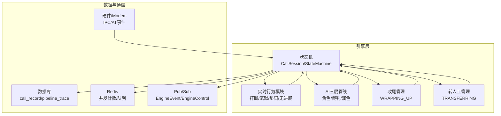
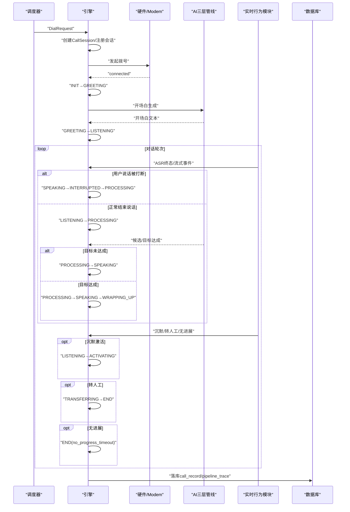
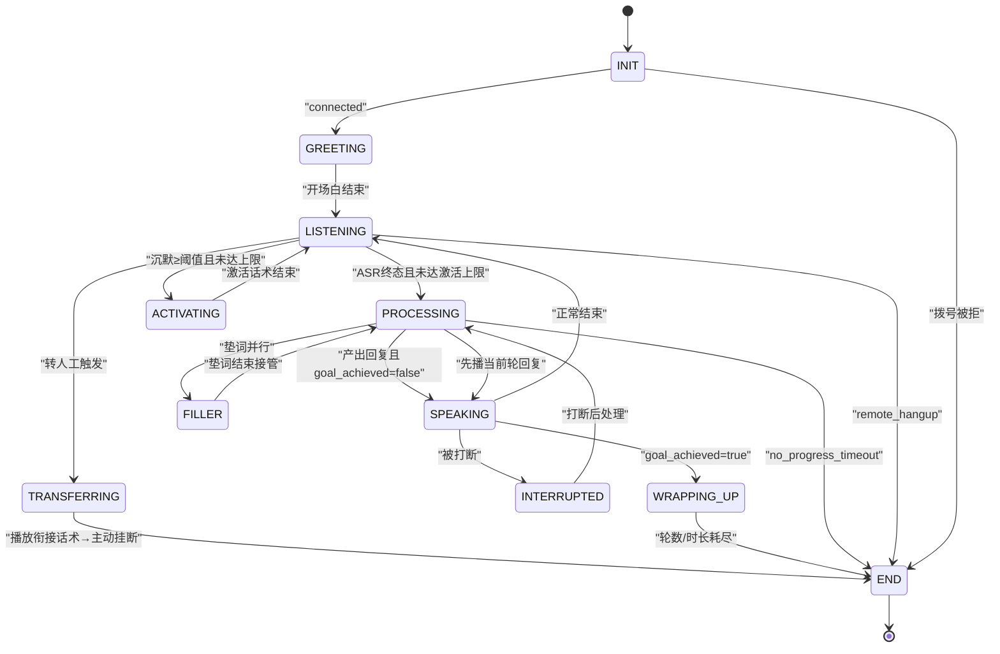
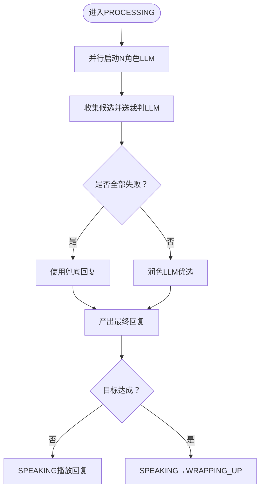
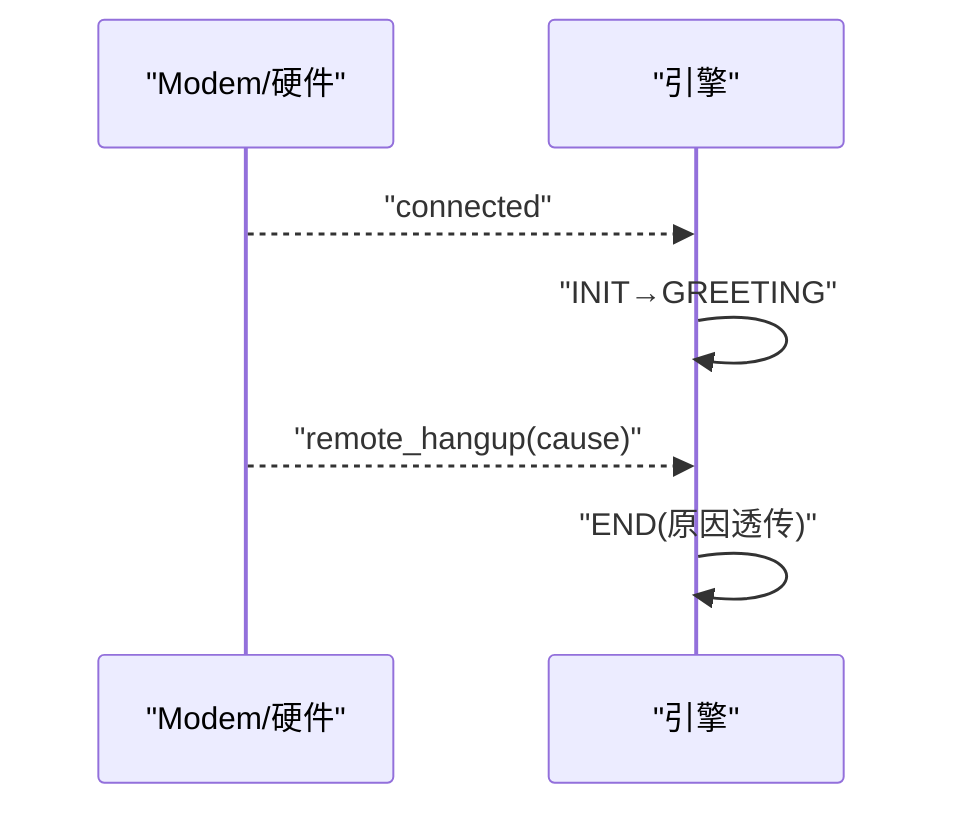
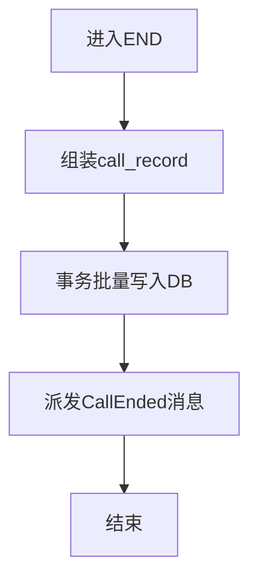
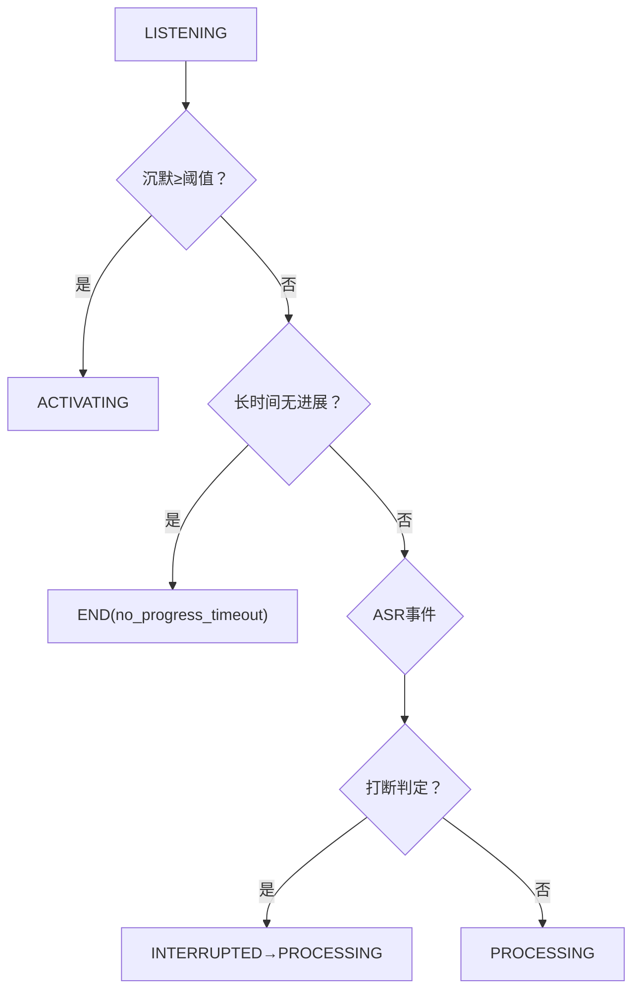
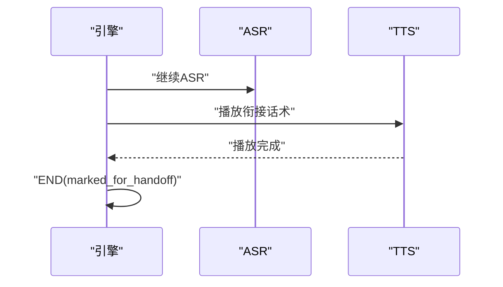
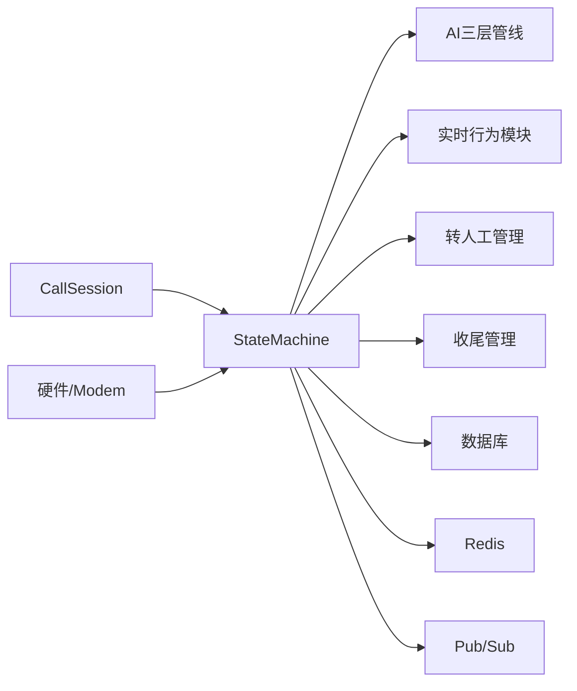

# 通话管理系统

<cite>
**本文引用的文件**
- [README.md](file://README.md)
- [DESIGN.md](file://DESIGN.md)
- [call-state-machine/spec.md](file://openspec/specs/call-state-machine/spec.md)
- [ai-pipeline/spec.md](file://openspec/specs/ai-pipeline/spec.md)
- [role-prompt/spec.md](file://openspec/specs/role-prompt/spec.md)
- [goal-achievement/spec.md](file://openspec/specs/goal-achievement/spec.md)
- [interruption-detection/spec.md](file://openspec/specs/interruption-detection/spec.md)
- [filler/spec.md](file://openspec/specs/filler/spec.md)
- [silence-activation/spec.md](file://openspec/specs/silence-activation/spec.md)
- [human-handoff/spec.md](file://openspec/specs/human-handoff/spec.md)
- [transcript/spec.md](file://openspec/specs/transcript/spec.md)
- [webhook-callback/spec.md](file://openspec/specs/webhook-callback/spec.md)
- [retry-followup/spec.md](file://openspec/specs/retry-followup/spec.md)
- [time-window/spec.md](file://openspec/specs/time-window/spec.md)
- [architecture/spec.md](file://openspec/specs/architecture/spec.md)
- [device-hardware/spec.md](file://openspec/specs/device-hardware/spec.md)
- [data-model/spec.md](file://openspec/specs/data-model/spec.md)
- [service-communication/spec.md](file://openspec/specs/service-communication/spec.md)
- [engine.env.example](file://deploy/env/engine.env.example)
- [engine.env.cloud.example](file://deploy/cloud/env/engine.env)
- [2026-05-07-impl-engine/proposal.md](file://openspec/changes/archive/2026-05-07-impl-engine/proposal.md)
- [2026-05-07-impl-engine/design.md](file://openspec/changes/archive/2026-05-07-impl-engine/design.md)
- [2026-05-07-impl-engine/tasks.md](file://openspec/changes/archive/2026-05-07-impl-engine/tasks.md)
</cite>

## 目录
1. [简介](#简介)
2. [项目结构](#项目结构)
3. [核心组件](#核心组件)
4. [架构总览](#架构总览)
5. [详细组件分析](#详细组件分析)
6. [依赖分析](#依赖分析)
7. [性能考虑](#性能考虑)
8. [故障排查指南](#故障排查指南)
9. [结论](#结论)
10. [附录](#附录)

## 简介
本文件面向iSales通话管理系统，聚焦“状态机引擎”的设计与实现，系统化阐述11种通话状态（INIT、GREETING、LISTENING、SPEAKING、INTERRUPTED、FILLER、PROCESSING、WRAPPING_UP、ACTIVATING、TRANSFERRING、END）及其转换规则；解释状态机如何管理通话生命周期（状态转换条件、触发事件、状态持续时间等）；文档化状态机与AI管线的交互关系，以及与硬件设备的状态同步机制；说明通话记录的生成、存储与查询方式；提供状态转换图、状态机配置示例、常见状态异常处理与调试方法，并为初学者提供状态机理论基础，为高级开发者提供扩展与定制指导。

## 项目结构
- 项目采用多仓协作与OpenSpec规范驱动的架构，核心能力通过多文件规范进行沉淀与演进。
- 与状态机相关的关键模块分布在以下规范与变更文档中：
  - call-state-machine：定义状态集合、转换规则与异常处理契约
  - ai-pipeline：三层AI管线（角色/裁判/润色）与WRAPPING_UP简化管线
  - realtime子系统：打断检测、沉默激活、垫词管理、无进展定时器
  - transfer：转人工管理
  - transcript：事件流与对话历史的数据模型与持久化
  - hardware与service-communication：硬件设备与服务间通信契约
  - engine环境配置：运行参数与部署拓扑

**章节来源**
- [README.md:1-86](file://README.md#L1-L86)
- [DESIGN.md:9-44](file://DESIGN.md#L9-L44)

## 核心组件
- 状态机与会话
  - CallSession：承载状态、计时器、上下文、对话历史、管道追踪、提示版本快照、任务句柄等
  - StateMachine：统一事件驱动的状态转换入口，维护合法转移集合与非法转移异常
- AI三层管线
  - 角色LLM：多角色并行调用，结合角色Prompt与JSON模式
  - 裁判LLM：对候选回复进行二元判定
  - 润色LLM：对通过裁判的候选进行优选与改写
  - WRAPPING_UP简化管线：单角色+润色，禁用PK/裁判
- 实时行为模块
  - 打断检测：白名单+时长双条件，触发INTERRUPTED→PROCESSING
  - 沉默激活：基于上次speech_end与上轮TTS结束的计时起点，超阈值进入ACTIVATING
  - 垫词管理：与PROCESSING并行，打断时停止垫词并重新PROCESSING
  - 无进展定时器：长时间无效对话触发no_progress_timeout
- 转人工管理
  - TRANSFERRING：播放衔接话术→标记派发→主动挂断→END
- 通话记录与事件
  - transcript：full_transcript记录所有事件；dialog_history仅记录有效对话
  - call_record：通话结束时落库，包含hangup_cause、ended_at、transfer_status、wrap_up_started_at等

**章节来源**
- [call-state-machine/spec.md:5-21](file://openspec/specs/call-state-machine/spec.md#L5-L21)
- [2026-05-07-impl-engine/design.md:56-73](file://openspec/changes/archive/2026-05-07-impl-engine/design.md#L56-L73)
- [2026-05-07-impl-engine/proposal.md:24-39](file://openspec/changes/archive/2026-05-07-impl-engine/proposal.md#L24-L39)

## 架构总览
状态机引擎位于isales-engine仓库，负责单通通话的生命周期编排。其与AI管线、实时行为模块、硬件设备、数据库与消息通道协同工作，形成“事件驱动、状态机编排、模块并行”的整体架构。

**图表来源**
- [2026-05-07-impl-engine/proposal.md:12-16](file://openspec/changes/archive/2026-05-07-impl-engine/proposal.md#L12-L16)
- [2026-05-07-impl-engine/proposal.md:40-61](file://openspec/changes/archive/2026-05-07-impl-engine/proposal.md#L40-L61)
- [2026-05-07-impl-engine/proposal.md:102-106](file://openspec/changes/archive/2026-05-07-impl-engine/proposal.md#L102-L106)

**章节来源**
- [2026-05-07-impl-engine/proposal.md:12-16](file://openspec/changes/archive/2026-05-07-impl-engine/proposal.md#L12-L16)
- [2026-05-07-impl-engine/proposal.md:40-61](file://openspec/changes/archive/2026-05-07-impl-engine/proposal.md#L40-L61)
- [2026-05-07-impl-engine/proposal.md:102-106](file://openspec/changes/archive/2026-05-07-impl-engine/proposal.md#L102-L106)

## 详细组件分析

### 状态机与通话生命周期
- 状态集合与起止
  - 起始：INIT（拨号尝试中）
  - 终止：END（通话结束），落库call_record并派发“通话结束”消息
- 合法转移与非法转移
  - 状态机维护LEGAL_TRANSITIONS，非法转移抛IllegalTransition并在transcript写state_error事件
  - 非法转移可恢复（可忽略）或不可恢复（强制END）
- 事件驱动与转录
  - 每次状态转换均写transcript事件，包含相对时间戳与事件类型

**图表来源**
- [call-state-machine/spec.md:7-21](file://openspec/specs/call-state-machine/spec.md#L7-L21)
- [call-state-machine/spec.md:50-108](file://openspec/specs/call-state-machine/spec.md#L50-L108)

**章节来源**
- [call-state-machine/spec.md:23-31](file://openspec/specs/call-state-machine/spec.md#L23-L31)
- [call-state-machine/spec.md:33-44](file://openspec/specs/call-state-machine/spec.md#L33-L44)
- [call-state-machine/spec.md:46-108](file://openspec/specs/call-state-machine/spec.md#L46-L108)

### 状态机与AI管线的交互
- PROCESSING阶段并行执行：
  - 多角色LLM并行调用，收集候选
  - 裁判LLM对候选进行二元判定，淘汰失败候选
  - 润色LLM对通过裁判的候选进行优选与改写
- WRAPPING_UP阶段简化：
  - 仅单角色+润色，不启用PK/裁判
- FILLER与PROCESSING并行：
  - 垫词播完后接管管线回复
  - 垫词期间被打断：停止垫词、丢弃当前PROCESSING、以新ASR终态重新PROCESSING

**图表来源**
- [2026-05-07-impl-engine/proposal.md:24-39](file://openspec/changes/archive/2026-05-07-impl-engine/proposal.md#L24-L39)
- [ai-pipeline/spec.md](file://openspec/specs/ai-pipeline/spec.md)
- [goal-achievement/spec.md](file://openspec/specs/goal-achievement/spec.md)

**章节来源**
- [2026-05-07-impl-engine/proposal.md:24-39](file://openspec/changes/archive/2026-05-07-impl-engine/proposal.md#L24-L39)
- [ai-pipeline/spec.md](file://openspec/specs/ai-pipeline/spec.md)
- [goal-achievement/spec.md](file://openspec/specs/goal-achievement/spec.md)

### 状态机与硬件设备的状态同步
- 硬件事件来源：
  - connected：INIT→GREETING
  - remote_hangup：直接进入END（原因透传）
- 严格遵循“由AT事件翻译并通过IPC上报”驱动状态转换，避免ATD命令ACK/中间URC单独触发
- 拨号被拒：INIT→END，记录state_error事件以便分析

**图表来源**
- [call-state-machine/spec.md:146-169](file://openspec/specs/call-state-machine/spec.md#L146-L169)

**章节来源**
- [call-state-machine/spec.md:146-169](file://openspec/specs/call-state-machine/spec.md#L146-L169)

### 通话记录的生成、存储与查询
- 生成与落库时机：
  - 进入END时写入call_record（包含transcript、pipeline_trace、hangup_cause、ended_at、transfer_status、wrap_up_started_at等）
- 存储与事务：
  - 使用事务批量写入call_record与N条pipeline_trace，失败仅记录ERROR日志
- 查询：
  - 通过API服务查询call_record与pipeline_trace，结合transcript进行调试与审计

**图表来源**
- [2026-05-07-impl-engine/proposal.md:102-106](file://openspec/changes/archive/2026-05-07-impl-engine/proposal.md#L102-L106)
- [transcript/spec.md](file://openspec/specs/transcript/spec.md)
- [data-model/spec.md](file://openspec/specs/data-model/spec.md)

**章节来源**
- [2026-05-07-impl-engine/proposal.md:102-106](file://openspec/changes/archive/2026-05-07-impl-engine/proposal.md#L102-L106)
- [transcript/spec.md](file://openspec/specs/transcript/spec.md)
- [data-model/spec.md](file://openspec/specs/data-model/spec.md)

### 实时行为模块与状态转换
- 打断检测（interruption-detection）
  - 白名单+时长双条件，满足即打断，立即停止SPEAKING→INTERRUPTED→PROCESSING
  - 连续打断保护：超过阈值触发短回复或只听策略
- 沉默激活（silence-activation）
  - 计时起点：max(用户最后一次speech_end, AI上一轮TTS结束)
  - 超阈值进入ACTIVATING；达到上限播放沉默挂断话术→END
- 垫词管理（filler）
  - 与PROCESSING并行；被打断停止垫词并重新PROCESSING
- 无进展定时器（call-state-machine）
  - 用户一直说但全被判定为非打断/无效内容超过阈值→END

**图表来源**
- [interruption-detection/spec.md](file://openspec/specs/interruption-detection/spec.md)
- [silence-activation/spec.md](file://openspec/specs/silence-activation/spec.md)
- [filler/spec.md](file://openspec/specs/filler/spec.md)
- [call-state-machine/spec.md:100-104](file://openspec/specs/call-state-machine/spec.md#L100-L104)

**章节来源**
- [interruption-detection/spec.md](file://openspec/specs/interruption-detection/spec.md)
- [silence-activation/spec.md](file://openspec/specs/silence-activation/spec.md)
- [filler/spec.md](file://openspec/specs/filler/spec.md)
- [call-state-machine/spec.md:100-104](file://openspec/specs/call-state-machine/spec.md#L100-L104)

### 转人工与收尾流程
- 转人工（human-handoff）
  - TRANSFERRING：播放衔接话术→标记派发→主动挂断→END
  - 期间ASR继续，不调用AI管线
- 收尾（goal-achievement）
  - WRAPPING_UP：双计数器（轮数/时长）任一耗尽→播放告别话术→END
  - WRAPPING_UP期间走简化管线，用户新问题在WRAPPING_UP内闭环

**图表来源**
- [human-handoff/spec.md](file://openspec/specs/human-handoff/spec.md)
- [goal-achievement/spec.md](file://openspec/specs/goal-achievement/spec.md)

**章节来源**
- [human-handoff/spec.md](file://openspec/specs/human-handoff/spec.md)
- [goal-achievement/spec.md](file://openspec/specs/goal-achievement/spec.md)

## 依赖分析
- 组件耦合与内聚
  - CallSession集中承载状态与上下文，降低模块间耦合，便于测试与调试
  - 状态机通过统一事件驱动API进行转换，保证transcript一致性
- 外部依赖与集成点
  - Redis：并发计数器与队列（DialRequest/CallEnded）
  - 数据库：call_record与pipeline_trace
  - Pub/Sub：EngineEvent/EngineControl
  - 硬件/Modem：IPC事件（connected/remote_hangup）

**图表来源**
- [2026-05-07-impl-engine/design.md:56-73](file://openspec/changes/archive/2026-05-07-impl-engine/design.md#L56-L73)
- [service-communication/spec.md](file://openspec/specs/service-communication/spec.md)
- [device-hardware/spec.md](file://openspec/specs/device-hardware/spec.md)

**章节来源**
- [2026-05-07-impl-engine/design.md:56-73](file://openspec/changes/archive/2026-05-07-impl-engine/design.md#L56-L73)
- [service-communication/spec.md](file://openspec/specs/service-communication/spec.md)
- [device-hardware/spec.md](file://openspec/specs/device-hardware/spec.md)

## 性能考虑
- 并行与异步
  - 多角色LLM并行调用，缩短端到端响应时间
  - 异步任务管理（tasks字典）与超时控制（pipeline默认超时、无进展超时）
- 资源控制
  - 并发计数器（INCR/DECR）防止资源泄漏
  - graceful shutdown时取消所有会话任务，确保资源回收
- I/O与网络
  - 异步发布EngineEvent，fire-and-forget，避免阻塞通话主流程
  - 事务批量写入DB，减少锁竞争与IO抖动

**章节来源**
- [2026-05-07-impl-engine/proposal.md:16](file://openspec/changes/archive/2026-05-07-impl-engine/proposal.md#L16)
- [2026-05-07-impl-engine/proposal.md:92-96](file://openspec/changes/archive/2026-05-07-impl-engine/proposal.md#L92-L96)
- [engine.env.example:15-18](file://deploy/env/engine.env.example#L15-L18)

## 故障排查指南
- 非法状态转移
  - 现象：IllegalTransition异常，transcript写state_error事件
  - 处理：检查当前状态的LEGAL_TRANSITIONS；必要时使用force=True强制进入END
- 拨号被拒
  - 现象：INIT→END，transcript记录state_error
  - 处理：确认modem控制器上报的remote_hangup原因，定位拨号策略
- 远端挂机原因
  - 现象：END.reason透传hangup_cause枚举值
  - 处理：区分user_hangup与其他GSM-side原因，避免误判
- 本端主动挂断
  - 现象：manual_hangup不参与重试逻辑
  - 处理：确认触发hangup的业务理由（wrap_up_completed/no_progress_timeout/marked_for_handoff）
- 并发泄漏
  - 现象：并发计数器不归零
  - 处理：检查SessionManager注销与异常清理路径，确保DECR执行

**章节来源**
- [call-state-machine/spec.md:33-44](file://openspec/specs/call-state-machine/spec.md#L33-L44)
- [call-state-machine/spec.md:155-169](file://openspec/specs/call-state-machine/spec.md#L155-L169)
- [call-state-machine/spec.md:182-186](file://openspec/specs/call-state-machine/spec.md#L182-L186)
- [2026-05-07-impl-engine/tasks.md:23](file://openspec/changes/archive/2026-05-07-impl-engine/tasks.md#L23)

## 结论
iSales状态机引擎以“事件驱动、统一契约、模块并行”为核心设计原则，将AI三层管线与实时行为模块无缝编织进通话生命周期，通过严格的transcript与call_record保障可观测性与可审计性。借助清晰的配置项与规范化的硬件/服务通信契约，系统在复杂业务场景下仍能保持高可靠与高扩展性。

## 附录

### 状态机配置示例
- 基础环境变量（本地/开发）
  - 数据库与Redis连接
  - AI提供商（mock/openai/volcengine/dashscope）
  - 电话模式（mock/real/rtc）
  - 管线默认超时、无进展超时、优雅停机超时
- 云边拓扑（cloud-edge）
  - DingRTC AppId/AppKey、SDK路径、gRPC绑定、边缘设备ID、JWT密钥

**章节来源**
- [engine.env.example:8-18](file://deploy/env/engine.env.example#L8-L18)
- [engine.env.cloud.example:11-76](file://deploy/cloud/env/engine.env#L11-L76)

### 状态转换图（补充）
- 11种状态与关键转换条件已在“架构总览”与“状态机与通话生命周期”中给出，建议结合具体场景（打断/沉默/转人工/收尾）细化分支条件与计时器参数。

**章节来源**
- [call-state-machine/spec.md:7-21](file://openspec/specs/call-state-machine/spec.md#L7-L21)
- [call-state-machine/spec.md:50-108](file://openspec/specs/call-state-machine/spec.md#L50-L108)