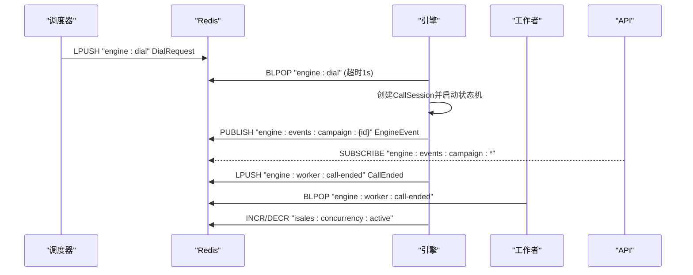
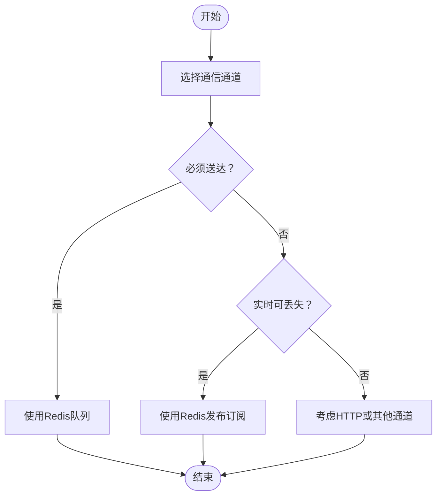
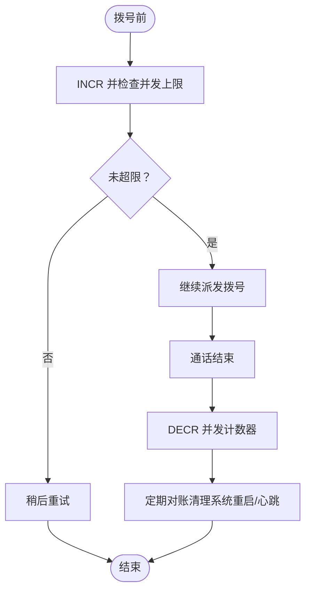
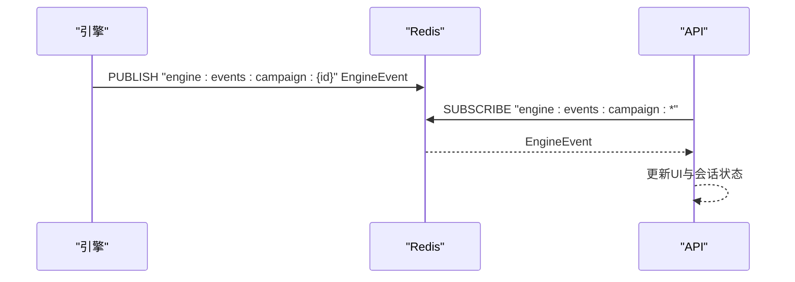
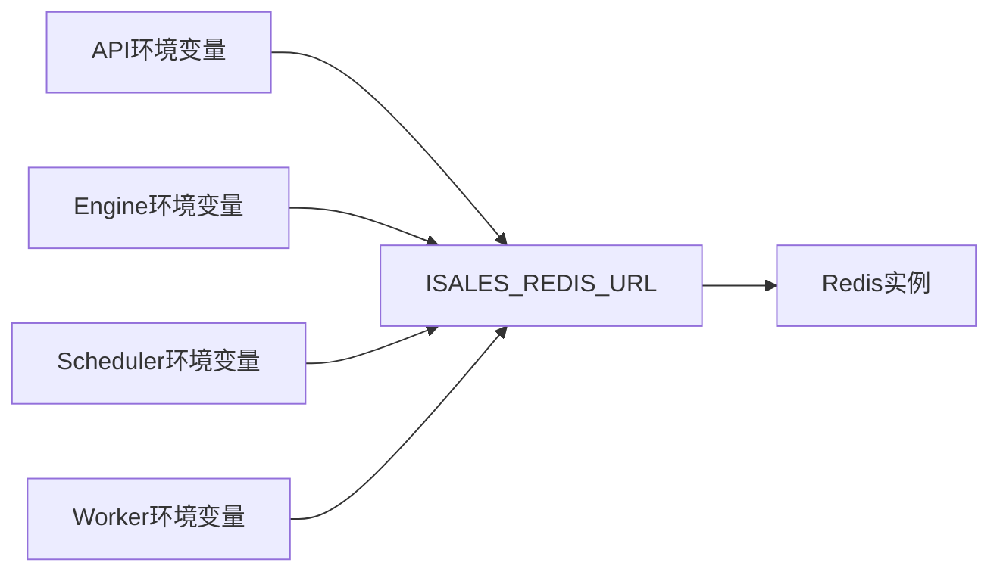

# Redis缓存策略

<cite>
**本文档引用的文件**
- [backup_redis.sh](file://deploy/linux/scripts/backup_redis.sh)
- [backup_redis.sh](file://deploy/macos/scripts/backup_redis.sh)
- [RUNBOOK.md](file://deploy/RUNBOOK.md)
- [api.env](file://deploy/cloud/env/api.env)
- [engine.env](file://deploy/cloud/env/engine.env)
- [scheduler.env](file://deploy/cloud/env/scheduler.env)
- [worker.env](file://deploy/cloud/env/worker.env)
- [api.env.example](file://deploy/env/api.env.example)
- [service-communication/spec.md](file://openspec/specs/service-communication/spec.md)
- [message-contract/spec.md](file://openspec/specs/message-contract/spec.md)
- [architecture/spec.md](file://openspec/specs/architecture/spec.md)
- [2026-05-07-impl-engine/proposal.md](file://openspec/changes/archive/2026-05-07-impl-engine/proposal.md)
- [arch-cloud-edge-split/specs/service-communication/spec.md](file://openspec/changes/arch-cloud-edge-split/specs/service-communication/spec.md)
</cite>

## 目录
1. [引言](#引言)
2. [项目结构](#项目结构)
3. [核心组件](#核心组件)
4. [架构总览](#架构总览)
5. [详细组件分析](#详细组件分析)
6. [依赖关系分析](#依赖关系分析)
7. [性能考虑](#性能考虑)
8. [故障排查指南](#故障排查指南)
9. [结论](#结论)
10. [附录](#附录)

## 引言
本文件面向iSales系统，系统化阐述Redis在分布式系统中的多重用途与缓存策略，重点覆盖：
- 作为消息队列、发布订阅系统与全局并发控制的实现机制
- 在微服务架构中的服务间通信、状态同步与会话管理
- 缓存数据生命周期管理（过期策略、更新机制、失效处理）
- 集群配置与高可用部署方案
- 性能优化策略（连接池、批量操作、内存优化）
- 在实时通话系统中的关键作用（通话状态同步、并发控制）

## 项目结构
iSales采用多服务协同的微服务体系，Redis贯穿服务间通信与状态管理。核心要点：
- 服务间通信通道矩阵明确：Redis队列用于“必须送达”的工作派发；Redis发布订阅用于“实时、可丢失”的事件广播
- 全局并发控制通过Redis原子计数器实现，确保跨实例一致性
- Redis作为缓存与会话存储，支撑API与Web的会话管理与状态同步

```mermaid
graph TB
subgraph "云内服务"
API["isales-api"]
SCHED["isales-scheduler"]
ENGINE["isales-engine"]
WORKER["isales-worker"]
TELEPH_API["telephony-api"]
MODEM["modem-controller"]
end
REDIS["Redis"]
PG["PostgreSQL"]
API < --> |Redis Pub/Sub| ENGINE
SCHED < --> |Redis Queue| ENGINE
ENGINE < --> |Redis Queue| WORKER
API < --> |Redis Queue| SCHED
ENGINE < --> |本地IPC| MODEM
MODEM < --> |直连| PG
API < --> |直连| PG
SCHED < --> |直连| PG
ENGINE < --> |直连| PG
WORKER < --> |直连| PG
REDIS --- PG
```

图示来源
- [service-communication/spec.md:11-24](file://openspec/specs/service-communication/spec.md#L11-L24)
- [architecture/spec.md:130-168](file://openspec/specs/architecture/spec.md#L130-L168)

章节来源
- [service-communication/spec.md:11-24](file://openspec/specs/service-communication/spec.md#L11-L24)
- [architecture/spec.md:130-168](file://openspec/specs/architecture/spec.md#L130-L168)

## 核心组件
- Redis队列（Queue）：用于“必须送达、可异步处理”的工作派发，如调度器向引擎派发拨号请求、引擎向工作者派发通话结束事件
- Redis发布订阅（Pub/Sub）：用于“实时、可丢失”的事件广播，如引擎向API推送通话状态变更与ASR文本
- 全局并发控制：通过Redis原子计数器实现跨实例的并发上限控制，防止资源过载
- 缓存与会话：API与Web通过Redis进行会话管理与状态同步（结合JWT与Redis会话存储）

章节来源
- [service-communication/spec.md:31-44](file://openspec/specs/service-communication/spec.md#L31-L44)
- [service-communication/spec.md:45-63](file://openspec/specs/service-communication/spec.md#L45-L63)
- [2026-05-07-impl-engine/proposal.md:12-16](file://openspec/changes/archive/2026-05-07-impl-engine/proposal.md#L12-L16)

## 架构总览
Redis在iSales中的角色定位：
- 服务间通信枢纽：队列承载可靠的消息派发，发布订阅承载实时事件
- 全局状态与计数：并发计数器保障跨实例一致性
- 生命周期管理：配合备份与恢复流程，确保数据可追溯与可恢复



图示来源
- [service-communication/spec.md:11-24](file://openspec/specs/service-communication/spec.md#L11-L24)
- [2026-05-07-impl-engine/proposal.md:92-106](file://openspec/changes/archive/2026-05-07-impl-engine/proposal.md#L92-L106)

## 详细组件分析

### 组件A：Redis队列与发布订阅通道
- 队列职责：承载必须送达的任务派发，具备重试与确认能力
- 发布订阅职责：承载实时事件广播，强调低延迟与可丢失容忍
- 通道边界：严格区分“必须送达”与“实时可丢失”，避免误用导致性能或可靠性问题



图示来源
- [service-communication/spec.md:31-44](file://openspec/specs/service-communication/spec.md#L31-L44)

章节来源
- [service-communication/spec.md:31-44](file://openspec/specs/service-communication/spec.md#L31-L44)

### 组件B：全局并发控制（原子计数器）
- 并发控制策略：拨号前INCR检查并发上限，通话结束DECR，异常崩溃时通过定期对账机制清理
- 计数器位置：统一使用Redis原子计数器，避免本地内存计数器导致的不一致



图示来源
- [service-communication/spec.md:45-63](file://openspec/specs/service-communication/spec.md#L45-L63)
- [2026-05-07-impl-engine/proposal.md:16-16](file://openspec/changes/archive/2026-05-07-impl-engine/proposal.md#L16-L16)

章节来源
- [service-communication/spec.md:45-63](file://openspec/specs/service-communication/spec.md#L45-L63)
- [2026-05-07-impl-engine/proposal.md:16-16](file://openspec/changes/archive/2026-05-07-impl-engine/proposal.md#L16-L16)

### 组件C：实时通话事件推送与订阅
- 事件推送：引擎将通话状态变更、ASR文本、AI回复等事件通过发布订阅推送给API
- 订阅模型：API侧按活动通话订阅相应频道，实现前端实时状态展示
- 可靠性：发布订阅为fire-and-forget模式，失败不影响通话主路径



图示来源
- [2026-05-07-impl-engine/proposal.md:92-96](file://openspec/changes/archive/2026-05-07-impl-engine/proposal.md#L92-L96)
- [2026-05-07-impl-engine/proposal.md:174-178](file://openspec/changes/archive/2026-05-07-impl-engine/proposal.md#L174-L178)

章节来源
- [2026-05-07-impl-engine/proposal.md:92-96](file://openspec/changes/archive/2026-05-07-impl-engine/proposal.md#L92-L96)
- [2026-05-07-impl-engine/proposal.md:174-178](file://openspec/changes/archive/2026-05-07-impl-engine/proposal.md#L174-L178)

### 组件D：缓存数据生命周期管理
- 数据过期策略：结合业务特性设置TTL，避免无限增长；对热点数据采用合理的过期策略
- 缓存更新机制：采用写后失效或写时更新策略，保证一致性
- 缓存失效处理：提供主动失效与被动淘汰两种机制，确保缓存与源数据一致

章节来源
- [message-contract/spec.md:25-32](file://openspec/specs/message-contract/spec.md#L25-L32)

### 组件E：微服务架构中的Redis应用
- 服务间通信：API与调度器通过队列启动/暂停Campaign；调度器与引擎通过队列派发拨号任务；引擎与工作者通过队列传递通话结束事件
- 状态同步：引擎通过发布订阅向API推送通话事件，实现前端实时状态展示
- 会话管理：API与Web通过Redis进行会话管理与状态同步（结合JWT）

章节来源
- [service-communication/spec.md:11-24](file://openspec/specs/service-communication/spec.md#L11-L24)
- [architecture/spec.md:130-168](file://openspec/specs/architecture/spec.md#L130-L168)

## 依赖关系分析
- 环境变量一致性：各服务的Redis连接串需保持一致，确保跨服务通信正常
- 通道边界：云内通信仅使用Redis队列与发布订阅，云-边通信通过gRPC与RTC PaaS实现，避免跨边界误用Redis



图示来源
- [api.env:6-7](file://deploy/cloud/env/api.env#L6-L7)
- [engine.env:5-5](file://deploy/cloud/env/engine.env#L5-L5)
- [scheduler.env:5-5](file://deploy/cloud/env/scheduler.env#L5-L5)
- [worker.env:8-8](file://deploy/cloud/env/worker.env#L8-L8)
- [api.env.example:10-10](file://deploy/env/api.env.example#L10-L10)

章节来源
- [api.env:6-7](file://deploy/cloud/env/api.env#L6-L7)
- [engine.env:5-5](file://deploy/cloud/env/engine.env#L5-L5)
- [scheduler.env:5-5](file://deploy/cloud/env/scheduler.env#L5-L5)
- [worker.env:8-8](file://deploy/cloud/env/worker.env#L8-L8)
- [api.env.example:6-7](file://deploy/env/api.env.example#L6-L7)

## 性能考虑
- 连接池管理：建议在应用侧维护Redis连接池，减少连接建立开销；合理设置最大连接数与空闲超时
- 批量操作：对频繁的键操作采用批量命令（如MGET/MSET、管道化命令）降低RTT
- 内存优化：启用合适的淘汰策略（如allkeys-lru），定期分析内存使用；对热数据设置合理TTL
- 队列深度监控：通过监控队列长度（如engine:dial）及时发现积压，采取扩容或降载措施

章节来源
- [RUNBOOK.md:172-173](file://deploy/RUNBOOK.md#L172-L173)
- [RUNBOOK.md:191-196](file://deploy/RUNBOOK.md#L191-L196)

## 故障排查指南
- Redis OOM：通过内存信息查看内存压力，调整maxmemory或淘汰策略
- 队列积压：检查engine:dial等关键队列长度，确认引擎服务状态
- 并发异常：核对并发计数器isales:concurrency:active，排查异常退出导致的计数泄漏
- 恢复演练：定期执行Redis恢复演练，验证RDB快照可加载与数据完整性

章节来源
- [RUNBOOK.md:168-168](file://deploy/RUNBOOK.md#L168-L168)
- [RUNBOOK.md:172-173](file://deploy/RUNBOOK.md#L172-L173)
- [RUNBOOK.md:192-192](file://deploy/RUNBOOK.md#L192-L192)
- [RUNBOOK.md:144-157](file://deploy/RUNBOOK.md#L144-L157)

## 结论
Redis在iSales中承担了服务间通信枢纽、全局并发控制与实时事件广播的关键角色。通过严格的通道边界划分、统一的环境变量配置与完善的生命周期管理，系统实现了高可靠、低延迟的服务协作。结合性能优化与故障排查实践，可进一步提升Redis在生产环境中的稳定性与可维护性。

## 附录
- 备份与恢复：每日RDB快照备份，支持离线恢复与验证
- 通道规范：服务间通信必须遵循OpenSpec规范，不得擅自引入未定义通道
- 云-边隔离：云内通信使用Redis，云-边通信通过gRPC与RTC PaaS实现

章节来源
- [backup_redis.sh:1-60](file://deploy/linux/scripts/backup_redis.sh#L1-L60)
- [backup_redis.sh:1-65](file://deploy/macos/scripts/backup_redis.sh#L1-L65)
- [RUNBOOK.md:118-162](file://deploy/RUNBOOK.md#L118-L162)
- [arch-cloud-edge-split/specs/service-communication/spec.md:23-45](file://openspec/changes/arch-cloud-edge-split/specs/service-communication/spec.md#L23-L45)