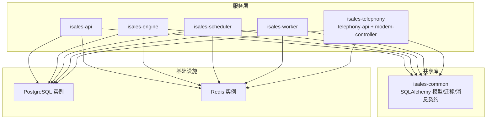
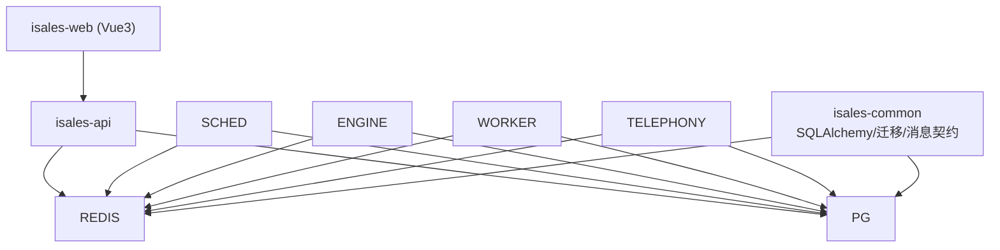
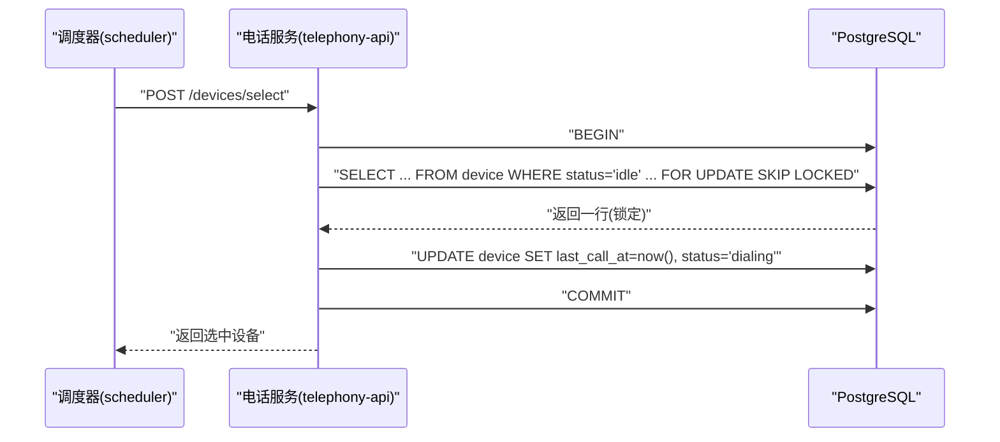
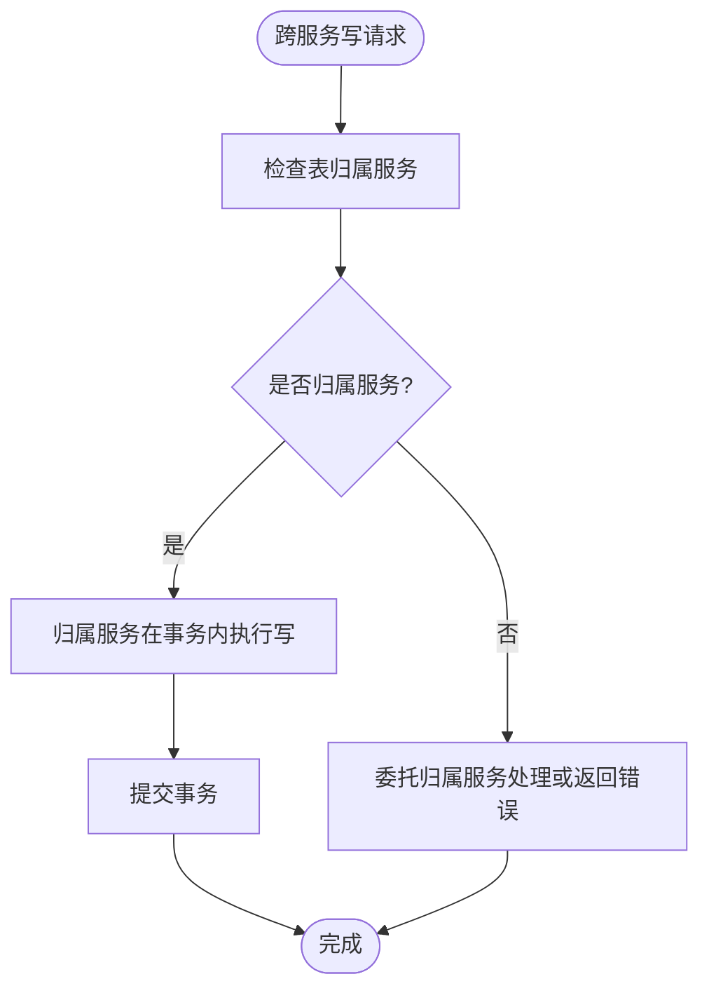
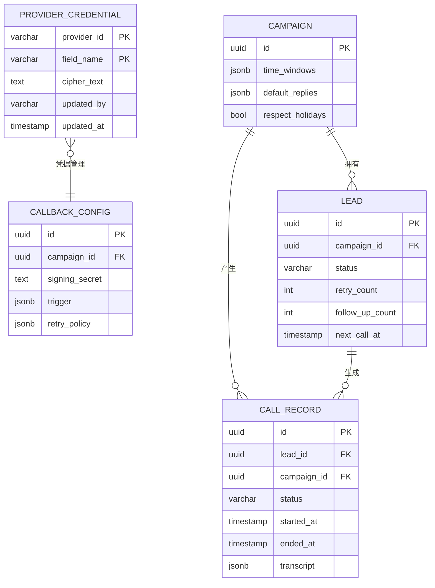
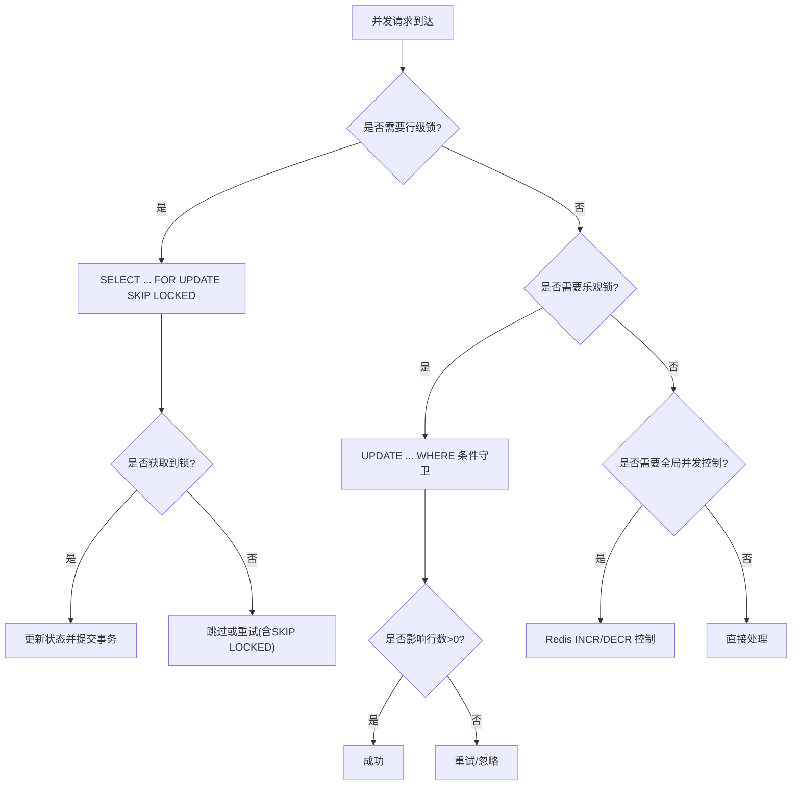
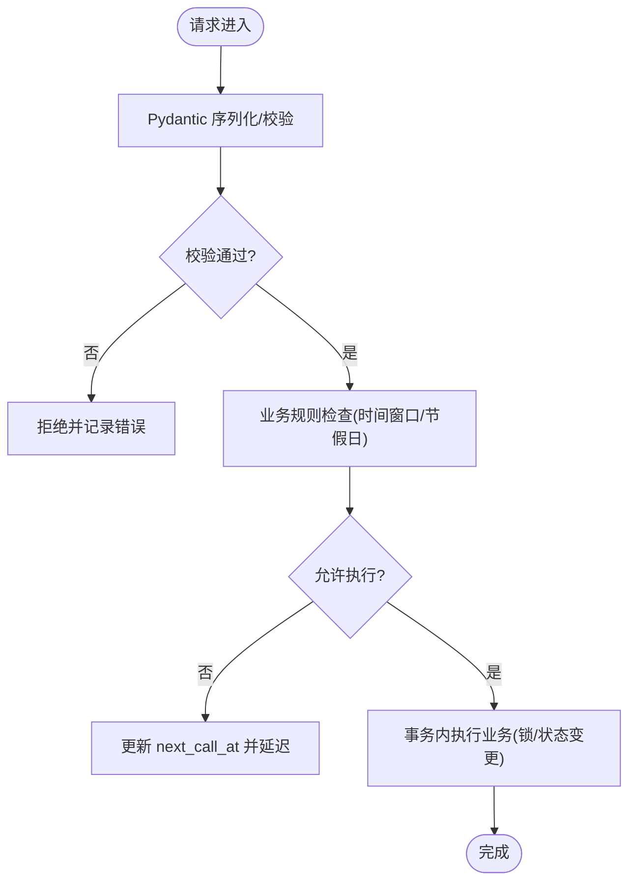
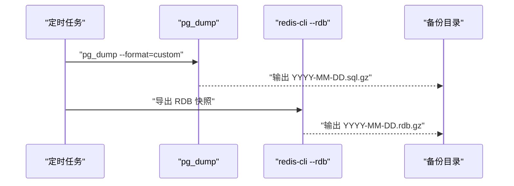
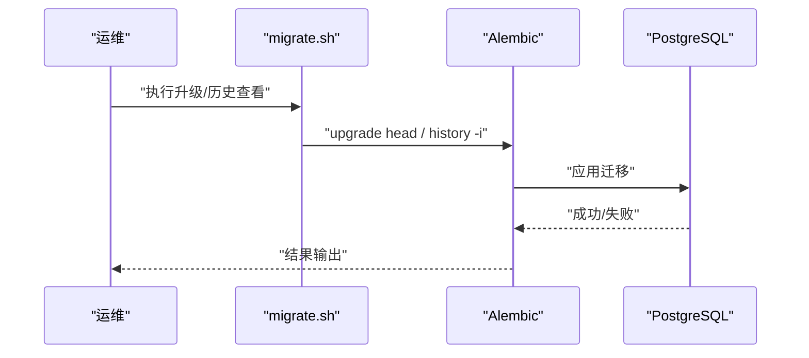
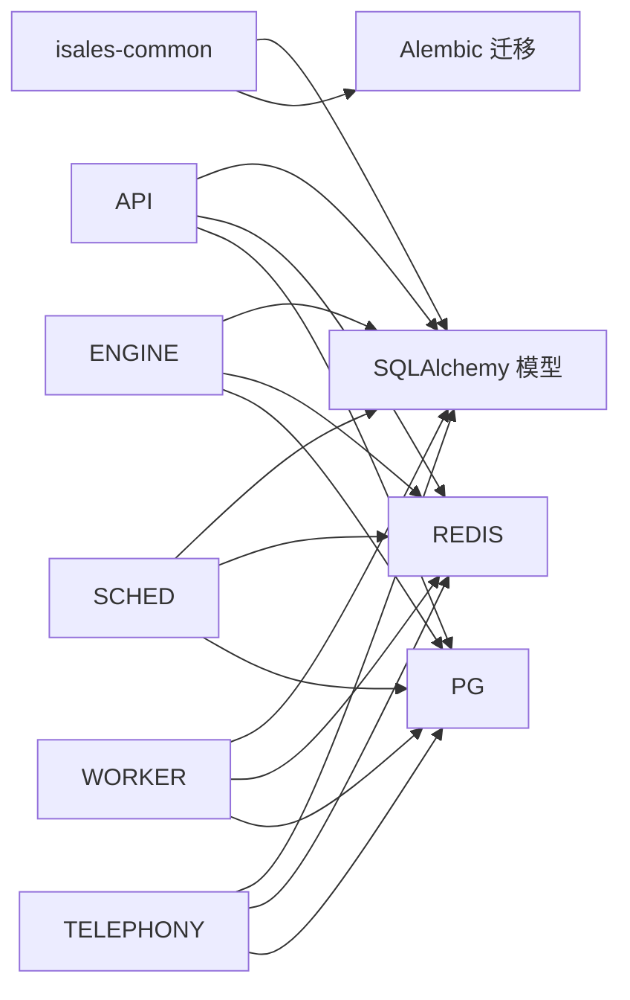

# 数据一致性与完整性

<cite>
**本文引用的文件**
- [架构规范](file://openspec/specs/architecture/spec.md)
- [数据模型规范](file://openspec/specs/data-model/spec.md)
- [服务通信规范](file://openspec/specs/service-communication/spec.md)
- [时间窗口规范](file://openspec/specs/time-window/spec.md)
- [通话状态机规范](file://openspec/specs/call-state-machine/spec.md)
- [macOS 备份脚本](file://deploy/macos/scripts/backup_pg.sh)
- [Linux 备份脚本](file://deploy/linux/scripts/backup_pg.sh)
- [macOS Redis 备份脚本](file://deploy/macos/scripts/backup_redis.sh)
- [Linux Redis 备份脚本](file://deploy/linux/scripts/backup_redis.sh)
- [macOS 迁移脚本](file://deploy/macos/scripts/migrate.sh)
- [Linux 迁移脚本](file://deploy/linux/scripts/migrate.sh)
- [macOS Provision 脚本](file://deploy/macos/scripts/provision.sh)
- [Linux Provision 脚本](file://deploy/linux/scripts/provision.sh)
- [运行手册（备份与恢复）](file://deploy/RUNBOOK.md)
- [定时备份计划](file://deploy/cron/isales-backup.cron)
</cite>

## 目录
1. [引言](#引言)
2. [项目结构](#项目结构)
3. [核心组件](#核心组件)
4. [架构总览](#架构总览)
5. [详细组件分析](#详细组件分析)
6. [依赖分析](#依赖分析)
7. [性能考虑](#性能考虑)
8. [故障排查指南](#故障排查指南)
9. [结论](#结论)
10. [附录](#附录)

## 引言
本文件聚焦 iSales 系统的数据一致性与完整性保障，围绕 PostgreSQL 事务与 ACID 特性、跨服务事务协作、外键/唯一性/检查约束设计、并发控制（行级锁、乐观锁、悲观锁）、数据验证策略（输入/业务规则/质量监控）、备份与恢复（全量/增量/灾难恢复）、以及数据迁移过程中的完整性与校验方法展开。文档基于仓库中已有的架构、数据模型与运维脚本进行归纳总结，并提供可视化图示帮助理解。

## 项目结构
- 数据层与一致性保障主要体现在：
  - 统一 PostgreSQL 实例与迁移管理（isales-common/alembic）
  - 跨服务读写边界与归属（data-model）
  - 事务内行级锁与业务状态转换（telephony 与 call-state-machine）
  - 备份与恢复脚本（pg_dump/pg_restore、Redis RDB）
  - 运行手册与定时任务（cron）

**图表来源**
- [架构规范:59-71](file://openspec/specs/architecture/spec.md#L59-L71)
- [数据模型规范:52-59](file://openspec/specs/data-model/spec.md#L52-L59)

**章节来源**
- [架构规范:59-71](file://openspec/specs/architecture/spec.md#L59-L71)
- [数据模型规范:52-59](file://openspec/specs/data-model/spec.md#L52-L59)

## 核心组件
- 统一数据库与迁移
  - 所有服务共享同一 PostgreSQL 实例，迁移由 isales-common/alembic 管理，避免跨服务直接 DDL。
- 表归属与跨服务读写
  - 每张表标记主要业务归属；跨服务读可直读，写由归属服务承担，确保数据主从关系清晰。
- 事务与并发控制
  - 事务内使用行级锁（SELECT ... FOR UPDATE SKIP LOCKED）保证并发选号一致性；通过 Redis 全局并发计数器实现跨进程/跨服务的并发上限协调。
- 数据验证与质量
  - JSONB 字段附带 schema 描述；消息契约严格限制副作用；时间窗口与节假日策略在调度前执行，避免无效业务操作。
- 备份与恢复
  - 定时全量备份（pg_dump/custom + gzip），保留 14 天；Redis 采用 RDB 快照；提供恢复演练流程与命令参考。

**章节来源**
- [数据模型规范:19-59](file://openspec/specs/data-model/spec.md#L19-L59)
- [服务通信规范:82-108](file://openspec/specs/service-communication/spec.md#L82-L108)
- [macOS 备份脚本:1-55](file://deploy/macos/scripts/backup_pg.sh#L1-L55)
- [Linux 备份脚本:1-49](file://deploy/linux/scripts/backup_pg.sh#L1-L49)
- [macOS Redis 备份脚本:42-65](file://deploy/macos/scripts/backup_redis.sh#L42-L65)
- [Linux Redis 备份脚本:42-60](file://deploy/linux/scripts/backup_redis.sh#L42-L60)
- [运行手册（备份与恢复）:118-157](file://deploy/RUNBOOK.md#L118-L157)

## 架构总览
iSales v1 采用单主机部署，7 个服务进程共享 PostgreSQL 与 Redis。isales-common 作为共享库，统一模型、迁移与消息契约；服务间通过 Redis Pub/Sub 与队列交互，内部 HTTP 调用在单主机环境下可免 JWT，但需限制监听地址。

**图表来源**
- [架构规范:130-167](file://openspec/specs/architecture/spec.md#L130-L167)

**章节来源**
- [架构规范:130-167](file://openspec/specs/architecture/spec.md#L130-L167)

## 详细组件分析

### PostgreSQL 事务与 ACID 保证
- 单库统一：所有服务在同一 PostgreSQL 实例内，跨服务事务通过 PG 事务实现，避免分布式事务复杂性。
- 事务边界：关键业务（如设备选号、状态变更）在事务内完成，确保原子性与一致性。
- 隔离与持久性：通过标准事务隔离级别与 WAL 保障持久性；并发冲突通过行级锁与重试策略解决。

**图表来源**
- [服务通信规范:82-108](file://openspec/specs/service-communication/spec.md#L82-L108)
- [Telephony 设计决策:31-42](file://openspec/changes/archive/2026-05-06-impl-telephony/design.md#L31-L42)

**章节来源**
- [服务通信规范:82-108](file://openspec/specs/service-communication/spec.md#L82-L108)
- [Telephony 设计决策:31-42](file://openspec/changes/archive/2026-05-06-impl-telephony/design.md#L31-L42)

### 跨服务事务协作机制
- 读写边界：多服务可读同一表，写由归属服务承担；避免跨服务直接写导致的竞态与不一致。
- 通信容错：DB 短暂不可用时，服务重连重试；通话中状态通过 Redis 缓存，保证异常场景下的可观测与可恢复。

**图表来源**
- [数据模型规范:19-21](file://openspec/specs/data-model/spec.md#L19-L21)
- [服务通信规范:82-108](file://openspec/specs/service-communication/spec.md#L82-L108)

**章节来源**
- [数据模型规范:19-21](file://openspec/specs/data-model/spec.md#L19-L21)
- [服务通信规范:82-108](file://openspec/specs/service-communication/spec.md#L82-L108)

### 外键约束、唯一性约束与检查约束
- 唯一性约束：如 provider_credential 的 (provider_id, field_name) 唯一，防止重复凭据字段。
- JSONB 字段约束：新引入 JSONB 字段需附带 schema 描述，确保结构化配置的一致性与可演进性。
- 检查约束：通过业务规则与状态机约束（如 lead 状态变更的行级守卫）实现软约束，避免非法状态转换。

**图表来源**
- [数据模型规范:30-49](file://openspec/specs/data-model/spec.md#L30-L49)
- [Telephony 设计决策:106-112](file://openspec/changes/archive/2026-05-06-impl-telephony/design.md#L106-L112)

**章节来源**
- [数据模型规范:61-74](file://openspec/specs/data-model/spec.md#L61-L74)
- [Telephony 设计决策:106-112](file://openspec/changes/archive/2026-05-06-impl-telephony/design.md#L106-L112)

### 并发控制：行级锁、乐观锁与悲观锁
- 行级锁（PostgreSQL）：设备选号使用 SELECT ... FOR UPDATE SKIP LOCKED，在事务内锁定并更新状态，避免重复选中与竞态。
- 乐观锁（CAS）：在无版本号字段时，采用行级守卫（WHERE 条件）确保仅修改属于自身的资源，减少锁竞争。
- 悲观锁（Redis）：全局并发计数器通过 INCR/DECR 控制并发上限，避免超发任务。

**图表来源**
- [Telephony 设计决策:31-42](file://openspec/changes/archive/2026-05-06-impl-telephony/design.md#L31-L42)
- [Telephony 设计决策:106-112](file://openspec/changes/archive/2026-05-06-impl-telephony/design.md#L106-L112)
- [服务通信规范:82-108](file://openspec/specs/service-communication/spec.md#L82-L108)

**章节来源**
- [Telephony 设计决策:31-42](file://openspec/changes/archive/2026-05-06-impl-telephony/design.md#L31-L42)
- [Telephony 设计决策:106-112](file://openspec/changes/archive/2026-05-06-impl-telephony/design.md#L106-L112)
- [服务通信规范:82-108](file://openspec/specs/service-communication/spec.md#L82-L108)

### 数据验证策略：输入验证、业务规则与质量监控
- 输入验证：消息契约要求仅纯数据类，禁止携带业务逻辑与副作用；序列化使用 Pydantic，日志包含 message_id 便于追踪。
- 业务规则检查：时间窗口与节假日策略在调度前计算并更新 lead.next_call_at；通话状态机对非法状态转移抛出异常并记录。
- 质量监控：Prometheus/Grafana 监控队列深度、设备 flag 比例、回调失败率、PG 连接数等指标。

**图表来源**
- [消息契约规范:62-85](file://openspec/specs/message-contract/spec.md#L62-L85)
- [时间窗口规范:51-77](file://openspec/specs/time-window/spec.md#L51-L77)
- [通话状态机规范:33-44](file://openspec/specs/call-state-machine/spec.md#L33-L44)

**章节来源**
- [消息契约规范:62-85](file://openspec/specs/message-contract/spec.md#L62-L85)
- [时间窗口规范:51-77](file://openspec/specs/time-window/spec.md#L51-L77)
- [通话状态机规范:33-44](file://openspec/specs/call-state-machine/spec.md#L33-L44)

### 数据备份与恢复策略
- 备份类型与保留
  - PostgreSQL：每日全量备份（pg_dump custom 格式 + gzip），保留 14 天。
  - Redis：每日 RDB 快照备份，保留 14 天。
- 触发方式：Linux 使用 cron；macOS 使用 launchd。
- 恢复流程：先恢复数据库，再核对 alembic 版本与关键表计数，最后验证服务可用性。

**图表来源**
- [定时备份计划:1-13](file://deploy/cron/isales-backup.cron#L1-L13)
- [macOS 备份脚本:1-55](file://deploy/macos/scripts/backup_pg.sh#L1-L55)
- [Linux 备份脚本:1-49](file://deploy/linux/scripts/backup_pg.sh#L1-L49)
- [macOS Redis 备份脚本:42-65](file://deploy/macos/scripts/backup_redis.sh#L42-L65)
- [Linux Redis 备份脚本:42-60](file://deploy/linux/scripts/backup_redis.sh#L42-L60)

**章节来源**
- [运行手册（备份与恢复）:118-157](file://deploy/RUNBOOK.md#L118-L157)
- [定时备份计划:1-13](file://deploy/cron/isales-backup.cron#L1-L13)

### 数据迁移过程中的完整性保证与校验
- 迁移来源：统一由 isales-common/alembic 管理，避免服务各自维护迁移。
- 迁移执行：通过 migrate.sh 在当前发布版本上调用 alembic upgrade head；支持 dry-run 查看历史。
- 回滚策略：若需降级，先 pg_dump 备份，再执行 downgrade；必要时可选择“前向修复”而非降级。

**图表来源**
- [Linux 迁移脚本:49-60](file://deploy/linux/scripts/migrate.sh#L49-L60)
- [macOS 迁移脚本:61-72](file://deploy/macos/scripts/migrate.sh#L61-L72)
- [运行手册（备份与恢复）:97-114](file://deploy/RUNBOOK.md#L97-L114)

**章节来源**
- [数据模型规范:9-17](file://openspec/specs/data-model/spec.md#L9-L17)
- [Linux 迁移脚本:49-60](file://deploy/linux/scripts/migrate.sh#L49-L60)
- [macOS 迁移脚本:61-72](file://deploy/macos/scripts/migrate.sh#L61-L72)
- [运行手册（备份与恢复）:97-114](file://deploy/RUNBOOK.md#L97-L114)

## 依赖分析
- 服务依赖
  - 所有服务通过 isales-common 访问 SQLAlchemy 模型与 Alembic 迁移，避免直接写 SQL。
  - Redis 用于队列、Pub/Sub 与全局并发控制。
- 数据库初始化
  - provision 脚本负责创建数据库与角色，确保部署幂等与安全。

**图表来源**
- [架构规范:59-71](file://openspec/specs/architecture/spec.md#L59-L71)
- [Linux Provision 脚本:143-167](file://deploy/linux/scripts/provision.sh#L143-L167)
- [macOS Provision 脚本:200-223](file://deploy/macos/scripts/provision.sh#L200-L223)

**章节来源**
- [架构规范:59-71](file://openspec/specs/architecture/spec.md#L59-L71)
- [Linux Provision 脚本:143-167](file://deploy/linux/scripts/provision.sh#L143-L167)
- [macOS Provision 脚本:200-223](file://deploy/macos/scripts/provision.sh#L200-L223)

## 性能考虑
- 事务粒度：尽量缩小事务范围，减少锁持有时间；对只读查询避免不必要的事务包裹。
- 锁策略：优先使用 PostgreSQL 行级锁（SKIP LOCKED）与乐观锁（行级守卫），降低锁竞争；全局并发通过 Redis INCR/DECR 控制。
- 备份开销：pg_dump custom 格式压缩传输，保留 14 天；Redis RDB 快照按日生成，避免频繁全量同步。
- 监控告警：队列深度、设备 flag 比例、回调失败率、PG 连接数等指标纳入监控，提前发现性能瓶颈。

## 故障排查指南
- DB 不可用
  - 服务重连重试；通话中状态通过 Redis 缓存，异常时按规范处理。
- 备份失败
  - 检查 pg_dump/redis-cli 可用性、环境变量与权限；查看统一日志标签（syslog）。
- 迁移失败
  - 使用 dry-run 查看历史；必要时先 pg_dump 备份再 downgrade；遵循 RUNBOOK 的回滚步骤。
- 并发超限
  - 检查 Redis 全局并发计数器；确认 scheduler 与 engine 的计数逻辑一致。

**章节来源**
- [服务通信规范:96-104](file://openspec/specs/service-communication/spec.md#L96-L104)
- [运行手册（备份与恢复）:118-157](file://deploy/RUNBOOK.md#L118-L157)
- [Linux 迁移脚本:49-60](file://deploy/linux/scripts/migrate.sh#L49-L60)
- [macOS 迁移脚本:61-72](file://deploy/macos/scripts/migrate.sh#L61-L72)

## 结论
iSales 通过“统一数据库、统一迁移、明确归属、事务内行级锁、Redis 全局并发控制、严格的输入与业务规则校验、完善的备份与恢复流程”，构建了面向 v1 的数据一致性与完整性保障体系。建议在后续版本中继续强化监控与自动化演练，确保在高并发与复杂业务场景下仍能维持稳定可靠的数据状态。

## 附录
- 备份与恢复命令参考
  - PostgreSQL 恢复：创建测试库、pg_restore 恢复、核对 alembic 版本与表计数。
  - Redis 恢复：停止服务、替换 dump.rdb、启动服务、验证键空间。
- 运维最佳实践
  - 定期演练恢复流程；在重大发布前执行备份与校验；对关键指标设置告警阈值。

**章节来源**
- [运行手册（备份与恢复）:118-157](file://deploy/RUNBOOK.md#L118-L157)