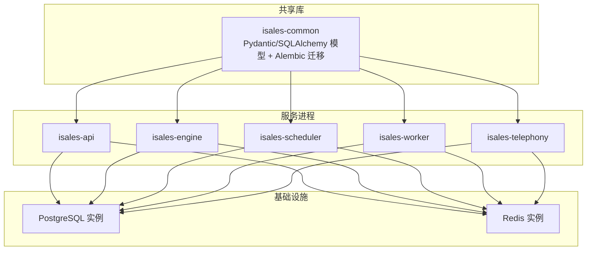
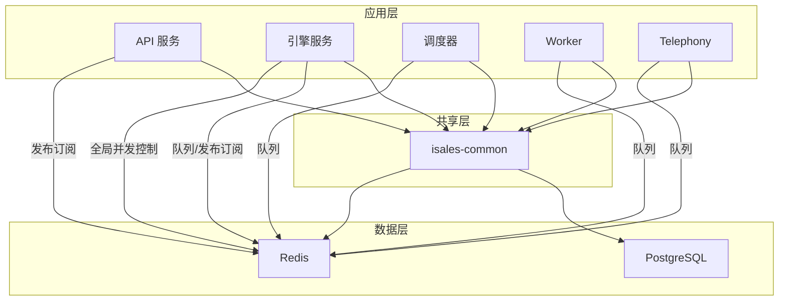
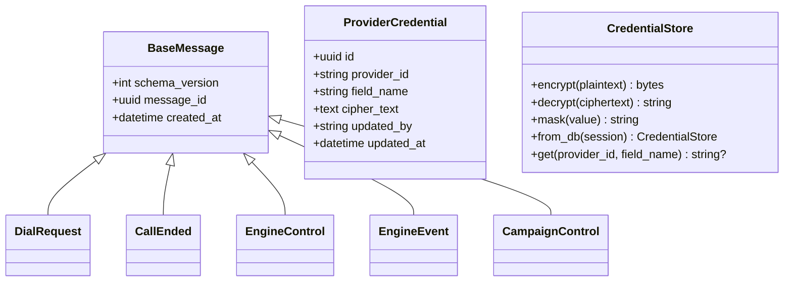
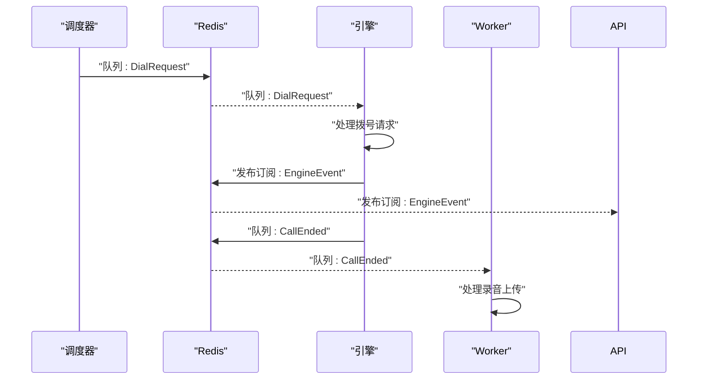
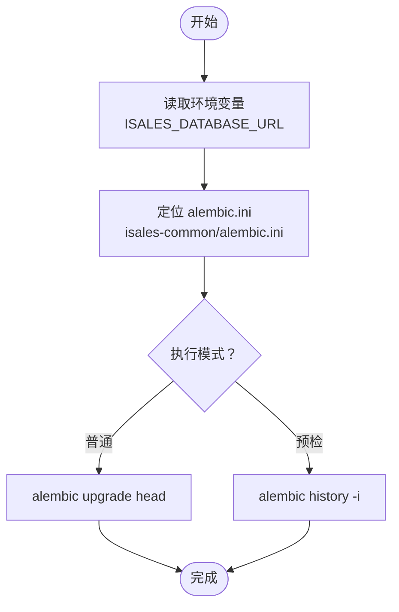
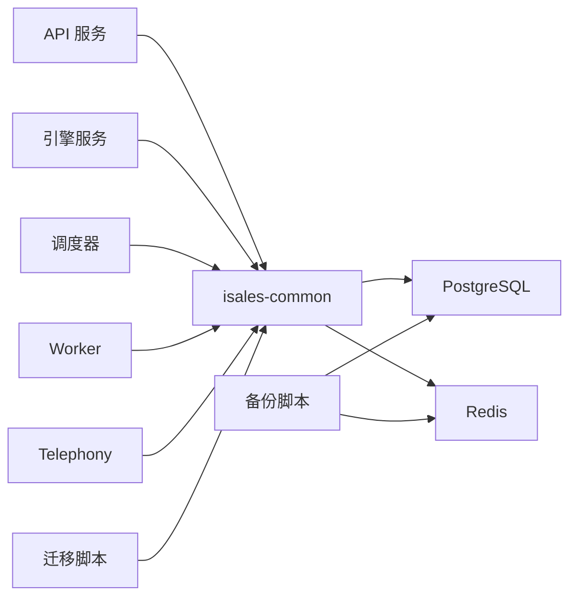

# 数据存储架构

<cite>
**本文引用的文件**
- [README.md](file://README.md)
- [架构规范.md](file://openspec/specs/architecture/spec.md)
- [消息契约规范.md](file://openspec/specs/message-contract/spec.md)
- [服务通信规范.md](file://openspec/specs/service-communication/spec.md)
- [init-isales-common 提案.md](file://openspec/changes/archive/2026-05-01-init-isales-common/proposal.md)
- [engine 设计.md](file://openspec/changes/archive/2026-05-07-impl-engine/design.md)
- [api 环境变量示例](file://deploy/cloud/env/api.env)
- [engine 环境变量示例](file://deploy/cloud/env/engine.env)
- [scheduler 环境变量示例](file://deploy/cloud/env/scheduler.env)
- [worker 环境变量示例](file://deploy/cloud/env/worker.env)
- [Linux 迁移脚本](file://deploy/linux/scripts/migrate.sh)
- [macOS 迁移脚本](file://deploy/macos/scripts/migrate.sh)
- [Linux PostgreSQL 备份脚本](file://deploy/linux/scripts/backup_pg.sh)
- [Linux Redis 备份脚本](file://deploy/linux/scripts/backup_redis.sh)
- [备份定时任务](file://deploy/cron/isales-backup.cron)
</cite>

## 目录
1. [简介](#简介)
2. [项目结构](#项目结构)
3. [核心组件](#核心组件)
4. [架构总览](#架构总览)
5. [详细组件分析](#详细组件分析)
6. [依赖关系分析](#依赖关系分析)
7. [性能考虑](#性能考虑)
8. [故障排查指南](#故障排查指南)
9. [结论](#结论)
10. [附录](#附录)

## 简介
本文件面向iSales系统的数据存储架构，聚焦以下目标：
- 统一数据库设计原则与集中式PostgreSQL管理
- isales-common共享库的数据访问模式与ORM/Pydantic模型体系
- Redis在分布式系统中的多重用途：消息队列、发布订阅、全局并发控制
- 数据库迁移管理策略：Alembic迁移工具与版本控制机制
- 数据一致性保证、缓存策略与性能优化
- 数据备份恢复、监控告警与容量规划最佳实践

## 项目结构
iSales采用多仓库微服务架构，isales-common作为共享库被多个服务依赖。生产部署支持Linux systemd与macOS launchd两种模式，并通过统一的环境变量与运维脚本进行集中管理。

**图表来源**
- [架构规范.md:130-168](file://openspec/specs/architecture/spec.md#L130-L168)

**章节来源**
- [README.md:1-86](file://README.md#L1-L86)
- [架构规范.md:54-94](file://openspec/specs/architecture/spec.md#L54-L94)

## 核心组件
- 统一数据库与Redis管理
  - 所有服务共享同一PostgreSQL与Redis实例，避免数据孤岛与跨服务数据网关。
  - 数据库迁移统一由isales-common/alembic管理，确保schema演进的一致性与可追溯性。
- isales-common共享库
  - 提供跨服务共享的Pydantic模型、SQLAlchemy ORM模型、Provider抽象、加密工具与Redis客户端工厂。
  - 所有服务均通过isales-common的模型与工具访问数据库与Redis，禁止绕过共享库直接写SQL或使用裸dict消息体。
- Redis多用途
  - 队列：保证关键业务不丢失的消息传递（如拨号调度、通话结束处理等）
  - 发布订阅：用于实时事件推送（如engine→api的通话状态）
  - 全局并发控制：基于Redis原子计数器实现跨实例的并发上限控制
  - 缓存：热点数据缓存与会话状态存储
- Alembic迁移
  - 通过isales-common/alembic.ini集中管理迁移脚本，支持upgrade head与历史检查。
  - 迁移脚本在Linux/macOS环境下读取统一的数据库连接字符串，确保迁移执行环境一致。

**章节来源**
- [架构规范.md:59-94](file://openspec/specs/architecture/spec.md#L59-L94)
- [init-isales-common 提案.md:1-14](file://openspec/changes/archive/2026-05-01-init-isales-common/proposal.md#L1-L14)
- [Linux 迁移脚本:1-60](file://deploy/linux/scripts/migrate.sh#L1-L60)
- [macOS 迁移脚本:1-72](file://deploy/macos/scripts/migrate.sh#L1-L72)

## 架构总览
下图展示了服务与共享库、数据库、缓存之间的交互关系，以及Redis在不同场景下的角色定位。

**图表来源**
- [架构规范.md:130-168](file://openspec/specs/architecture/spec.md#L130-L168)
- [服务通信规范.md:35-80](file://openspec/specs/service-communication/spec.md#L35-L80)

## 详细组件分析

### 统一数据库设计原则
- 集中式PostgreSQL实例
  - 所有服务通过isales-common的SQLAlchemy模型访问数据库，避免直接手写SQL绕过ORM。
  - 数据库连接字符串统一从环境变量读取，确保各服务连接参数一致。
- 数据一致性与事务边界
  - 服务内部通过事务保证单次操作的原子性；跨服务一致性通过消息队列与幂等设计保障。
  - 关键状态变更（如通话结束）需在数据库更新完成后，再进行Redis计数器递减，防止计数器泄漏。
- Schema演进与版本控制
  - 所有迁移脚本位于isales-common/alembic，通过Alembic管理版本；迁移执行由部署脚本统一触发。

**章节来源**
- [架构规范.md:59-94](file://openspec/specs/architecture/spec.md#L59-L94)
- [服务通信规范.md:78-80](file://openspec/specs/service-communication/spec.md#L78-L80)
- [Linux 迁移脚本:38-60](file://deploy/linux/scripts/migrate.sh#L38-L60)
- [macOS 迁移脚本:38-72](file://deploy/macos/scripts/migrate.sh#L38-L72)

### isales-common共享库的数据访问模式
- 模型与序列化
  - Pydantic模型用于请求/响应与跨服务消息体，确保消息结构稳定与强类型校验。
  - Redis消息体统一继承BaseMessage基类，包含schema_version、message_id、created_at等基础字段。
- 数据访问
  - 所有数据库访问通过SQLAlchemy ORM模型完成，禁止裸SQL；异常与边界条件在共享库中集中处理。
- 工具与安全
  - 提供Fernet对称加解密工具，密钥来自统一的环境变量；回调签名与凭据存储遵循安全规范。

**图表来源**
- [消息契约规范.md:25-32](file://openspec/specs/message-contract/spec.md#L25-L32)
- [init-isales-common 提案.md:1-14](file://openspec/changes/archive/2026-05-01-init-isales-common/proposal.md#L1-L14)

**章节来源**
- [消息契约规范.md:1-32](file://openspec/specs/message-contract/spec.md#L1-L32)
- [init-isales-common 提案.md:1-14](file://openspec/changes/archive/2026-05-01-init-isales-common/proposal.md#L1-L14)

### Redis在分布式系统中的多重用途
- 消息队列
  - 用于保证关键业务不丢失的消息传递，如调度器→引擎的拨号请求、引擎→Worker的录音处理等。
  - 队列消息体严格使用isales-common的Pydantic模型序列化与反序列化，确保结构一致。
- 发布订阅
  - 用于实时事件推送，如引擎向API推送通话状态变化；消息体同样来自共享库模型。
- 全局并发控制
  - 通过Redis原子计数器实现跨实例的并发上限控制；引擎进程内不再使用本地计数器替代。
- 缓存
  - 用于热点数据与会话状态缓存，提升响应速度与降低数据库压力。

**图表来源**
- [服务通信规范.md:35-80](file://openspec/specs/service-communication/spec.md#L35-L80)
- [engine 设计.md:168-177](file://openspec/changes/archive/2026-05-07-impl-engine/design.md#L168-L177)

**章节来源**
- [服务通信规范.md:35-80](file://openspec/specs/service-communication/spec.md#L35-L80)
- [engine 设计.md:168-177](file://openspec/changes/archive/2026-05-07-impl-engine/design.md#L168-L177)

### 数据库迁移管理策略与版本控制
- 集中式迁移管理
  - 迁移脚本位于isales-common/alembic，统一由Alembic管理；Linux与macOS部署脚本均指向同一配置。
- 执行流程
  - 迁移脚本读取统一的数据库连接字符串，切换到/opt/isales/current目录后执行upgrade head。
  - 支持--dry-run模式查看迁移历史，便于预检与审计。
- 版本控制与回滚
  - 通过Alembic版本号管理schema演进；回滚可通过降级脚本实现，部署脚本支持跳过迁移以适应回滚场景。

**图表来源**
- [Linux 迁移脚本:38-60](file://deploy/linux/scripts/migrate.sh#L38-L60)
- [macOS 迁移脚本:38-72](file://deploy/macos/scripts/migrate.sh#L38-L72)

**章节来源**
- [Linux 迁移脚本:1-60](file://deploy/linux/scripts/migrate.sh#L1-L60)
- [macOS 迁移脚本:1-72](file://deploy/macos/scripts/migrate.sh#L1-L72)

### 数据一致性保证方案
- 事务与锁
  - 关键写操作在单事务中完成；涉及跨服务的状态变更通过消息队列与幂等设计保证最终一致。
- Redis计数器与对账
  - 全局并发计数器在通话结束时立即递减；异常情况下通过定期对账与心跳机制修复计数器偏差。
- 消息契约
  - 所有跨服务消息体使用统一的Pydantic模型，避免结构漂移导致的解析错误与数据不一致。

**章节来源**
- [服务通信规范.md:45-63](file://openspec/specs/service-communication/spec.md#L45-L63)
- [消息契约规范.md:10-19](file://openspec/specs/message-contract/spec.md#L10-L19)

### 缓存策略与性能优化
- Redis缓存
  - 热点查询结果与会话状态缓存至Redis，减少数据库压力；结合TTL与淘汰策略控制内存占用。
- 队列与发布订阅
  - 将高延迟或非实时需求放入队列，实时需求使用发布订阅，平衡吞吐与延迟。
- ORM与索引
  - 使用SQLAlchemy ORM提升开发效率与一致性；针对高频查询建立合适索引，避免全表扫描。
- 并发控制
  - 全局并发上限通过Redis原子计数器实现，避免局部限流导致的不一致。

**章节来源**
- [服务通信规范.md:35-80](file://openspec/specs/service-communication/spec.md#L35-L80)
- [engine 设计.md:265-269](file://openspec/changes/archive/2026-05-07-impl-engine/design.md#L265-L269)

## 依赖关系分析
- 服务与共享库
  - 所有服务均依赖isales-common提供的模型、工具与迁移配置，形成稳定的依赖闭环。
- 数据与缓存
  - 服务通过共享库访问数据库与Redis，避免重复实现与配置漂移。
- 运维脚本
  - 迁移与备份脚本统一读取环境变量，确保执行环境一致，降低运维复杂度。

**图表来源**
- [架构规范.md:130-168](file://openspec/specs/architecture/spec.md#L130-L168)
- [Linux 迁移脚本:38-60](file://deploy/linux/scripts/migrate.sh#L38-L60)
- [Linux PostgreSQL 备份脚本:1-50](file://deploy/linux/scripts/backup_pg.sh#L1-L50)
- [Linux Redis 备份脚本:1-61](file://deploy/linux/scripts/backup_redis.sh#L1-L61)

**章节来源**
- [架构规范.md:59-94](file://openspec/specs/architecture/spec.md#L59-L94)
- [Linux 迁移脚本:1-60](file://deploy/linux/scripts/migrate.sh#L1-L60)
- [Linux PostgreSQL 备份脚本:1-50](file://deploy/linux/scripts/backup_pg.sh#L1-L50)
- [Linux Redis 备份脚本:1-61](file://deploy/linux/scripts/backup_redis.sh#L1-L61)

## 性能考虑
- 数据库层面
  - 合理设计索引与分区，避免热点表成为瓶颈；批量写入与事务拆分降低锁竞争。
- 缓存与队列
  - 队列深度与消费者并发需与数据库写入能力匹配，避免背压导致堆积。
- Redis优化
  - 使用合适的过期策略与内存淘汰策略；对热点键进行分片或拆分，降低单实例压力。
- 迁移与回滚
  - 迁移期间尽量避开业务高峰期；回滚时优先考虑数据一致性与可用性的平衡。

## 故障排查指南
- 数据库连接问题
  - 检查环境变量中的数据库URL是否正确；确认isales-common版本与部署脚本一致。
- 迁移失败
  - 使用--dry-run模式查看迁移历史；核对alembic.ini路径与权限；确认数据库可达。
- Redis不可用
  - 检查Redis URL与认证信息；确认网络连通性与防火墙规则；验证备份脚本能否正常导出RDB。
- 备份失败
  - 查看系统日志中isales-backup标签的错误信息；确认pg_dump与redis-cli可用性与权限。
- 并发异常
  - 检查Redis计数器是否递减；核对异常重启后的对账机制是否生效。

**章节来源**
- [Linux 迁移脚本:44-60](file://deploy/linux/scripts/migrate.sh#L44-L60)
- [macOS 迁移脚本:44-72](file://deploy/macos/scripts/migrate.sh#L44-L72)
- [Linux PostgreSQL 备份脚本:17-41](file://deploy/linux/scripts/backup_pg.sh#L17-L41)
- [Linux Redis 备份脚本:21-53](file://deploy/linux/scripts/backup_redis.sh#L21-L53)
- [备份定时任务:1-14](file://deploy/cron/isales-backup.cron#L1-L14)

## 结论
iSales的数据存储架构通过isales-common共享库实现了统一的数据模型与访问模式，配合集中式的PostgreSQL与Redis，确保了跨服务的一致性与可维护性。借助Alembic的集中迁移管理、严格的Redis消息契约与全局并发控制，系统在高并发场景下具备良好的稳定性与扩展性。结合完善的备份与监控告警机制，能够有效支撑生产环境的持续运营与容量规划。

## 附录
- 环境变量示例
  - 数据库URL与Redis URL在各服务环境中保持一致，确保连接参数统一。
- 运维脚本
  - 迁移与备份脚本均支持dry-run与错误日志输出，便于排障与审计。

**章节来源**
- [api 环境变量示例:6-7](file://deploy/cloud/env/api.env#L6-L7)
- [engine 环境变量示例:4-5](file://deploy/cloud/env/engine.env#L4-L5)
- [scheduler 环境变量示例:4-5](file://deploy/cloud/env/scheduler.env#L4-L5)
- [worker 环境变量示例:7-8](file://deploy/cloud/env/worker.env#L7-L8)
- [Linux 迁移脚本:1-60](file://deploy/linux/scripts/migrate.sh#L1-L60)
- [Linux PostgreSQL 备份脚本:1-50](file://deploy/linux/scripts/backup_pg.sh#L1-L50)
- [Linux Redis 备份脚本:1-61](file://deploy/linux/scripts/backup_redis.sh#L1-L61)
- [备份定时任务:1-14](file://deploy/cron/isales-backup.cron#L1-L14)