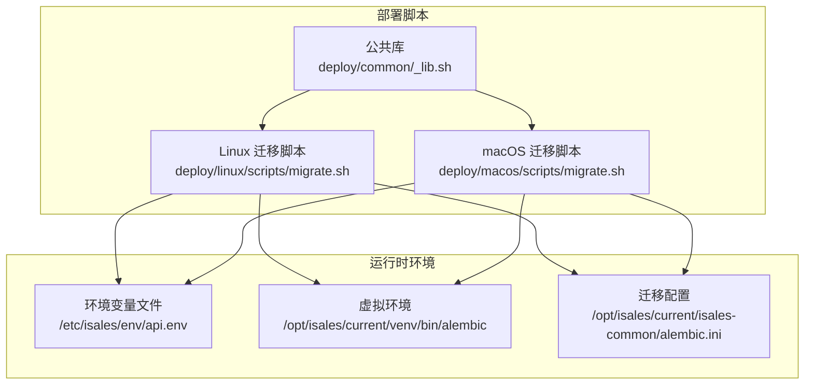
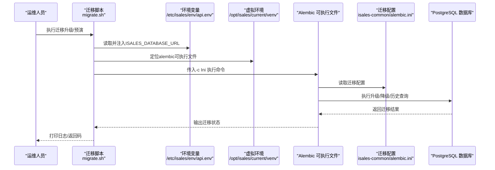
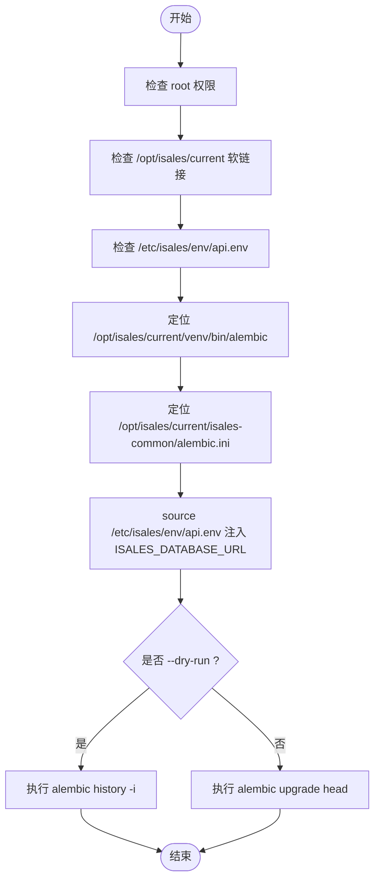
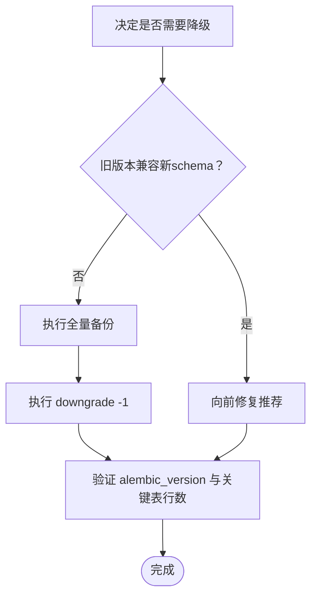
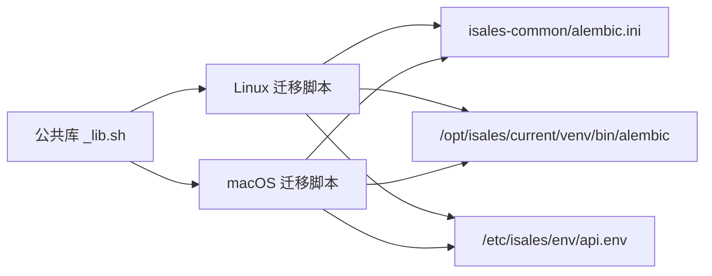

# 数据库迁移管理

<cite>
**本文引用的文件**
- [README.md](file://README.md)
- [CLAUDE.md](file://CLAUDE.md)
- [deploy/RUNBOOK.md](file://deploy/RUNBOOK.md)
- [deploy/RUNBOOK-cloud.md](file://deploy/RUNBOOK-cloud.md)
- [deploy/linux/scripts/migrate.sh](file://deploy/linux/scripts/migrate.sh)
- [deploy/macos/scripts/migrate.sh](file://deploy/macos/scripts/migrate.sh)
- [deploy/common/_lib.sh](file://deploy/common/_lib.sh)
</cite>

## 目录
1. [简介](#简介)
2. [项目结构](#项目结构)
3. [核心组件](#核心组件)
4. [架构总览](#架构总览)
5. [详细组件分析](#详细组件分析)
6. [依赖关系分析](#依赖关系分析)
7. [性能考量](#性能考量)
8. [故障排查指南](#故障排查指南)
9. [结论](#结论)
10. [附录](#附录)

## 简介
本文件面向iSales平台的数据库迁移管理，系统化阐述基于Alembic的迁移工具使用方法与最佳实践，覆盖迁移文件生成、版本控制、部署流程、风险控制与回滚策略、数据迁移与约束处理、命名规范与多服务协作一致性管理，并提供常见问题排查与解决方案。iSales采用“isales-common统一管理迁移”的设计理念：所有服务通过isales-common集中维护数据库schema变更，确保跨服务一致性与可审计性。

## 项目结构
iSales为跨仓元仓库，包含7个子仓库（isales-common与其他服务），迁移管理集中在isales-common并通过部署脚本统一触发。部署脚本位于deploy/linux/scripts/migrate.sh与deploy/macos/scripts/migrate.sh，二者均通过isales-common的alembic.ini定位迁移配置，并在运行时注入数据库连接字符串ISALES_DATABASE_URL。

**图表来源**
- [deploy/linux/scripts/migrate.sh:1-61](file://deploy/linux/scripts/migrate.sh#L1-L61)
- [deploy/macos/scripts/migrate.sh:1-73](file://deploy/macos/scripts/migrate.sh#L1-L73)
- [deploy/common/_lib.sh:1-181](file://deploy/common/_lib.sh#L1-L181)

**章节来源**
- [README.md:1-86](file://README.md#L1-L86)
- [CLAUDE.md:9-19](file://CLAUDE.md#L9-L19)
- [deploy/linux/scripts/migrate.sh:1-61](file://deploy/linux/scripts/migrate.sh#L1-L61)
- [deploy/macos/scripts/migrate.sh:1-73](file://deploy/macos/scripts/migrate.sh#L1-L73)

## 核心组件
- Alembic迁移工具：统一在isales-common中定义迁移配置与版本历史，所有服务通过isales-common的alembic.ini执行升级/降级。
- 迁移脚本：Linux与macOS分别提供独立脚本，职责一致，均读取环境变量与虚拟环境中的alembic可执行文件，执行upgrade head或history -i（dry-run）。
- 公共库：提供日志、参数解析、权限校验、交互确认等通用能力，保证脚本行为一致与可审计。
- 环境变量：通过/ etc/isales/env/api.env提供数据库连接字符串ISALES_DATABASE_URL，脚本在执行前注入该变量。

关键点
- 迁移脚本不直接修改数据库schema，而是委托isales-common中的Alembic配置与迁移文件。
- 迁移脚本支持--dry-run用于预演迁移历史，便于发布前验证。
- 迁移脚本要求当前软链接存在且环境文件就绪，否则报错退出，避免误操作。

**章节来源**
- [deploy/linux/scripts/migrate.sh:32-61](file://deploy/linux/scripts/migrate.sh#L32-L61)
- [deploy/macos/scripts/migrate.sh:38-73](file://deploy/macos/scripts/migrate.sh#L38-L73)
- [deploy/common/_lib.sh:50-103](file://deploy/common/_lib.sh#L50-L103)

## 架构总览
下图展示迁移流程在系统中的位置与交互：部署脚本负责准备环境与执行Alembic命令，Alembic依据isales-common的配置与迁移文件对数据库进行版本迁移。

**图表来源**
- [deploy/linux/scripts/migrate.sh:44-60](file://deploy/linux/scripts/migrate.sh#L44-L60)
- [deploy/macos/scripts/migrate.sh:61-72](file://deploy/macos/scripts/migrate.sh#L61-L72)
- [deploy/RUNBOOK.md:66-76](file://deploy/RUNBOOK.md#L66-L76)

**章节来源**
- [deploy/RUNBOOK.md:40-46](file://deploy/RUNBOOK.md#L40-L46)
- [deploy/RUNBOOK.md:66-76](file://deploy/RUNBOOK.md#L66-L76)

## 详细组件分析

### 组件A：迁移脚本（Linux与macOS）
- 功能职责
  - 校验运行环境：要求root权限、当前软链接存在、环境文件存在。
  - 定位资源：/opt/isales/current/venv/bin/alembic与/opt/isales/current/isales-common/alembic.ini。
  - 注入环境变量：从/etc/isales/env/api.env读取ISALES_DATABASE_URL并传递给alembic。
  - 执行命令：--dry-run时执行history -i；否则执行upgrade head。
- 设计要点
  - 通过公共库统一参数解析与日志输出，保证跨平台一致性。
  - macOS脚本额外处理工作目录权限问题，避免Python导入sys.path包含不可读路径导致PermissionError。
- 使用方式
  - 升级：sudo bash deploy/linux/scripts/migrate.sh
  - 预演：sudo DRY_RUN=1 bash deploy/linux/scripts/migrate.sh

**图表来源**
- [deploy/linux/scripts/migrate.sh:32-61](file://deploy/linux/scripts/migrate.sh#L32-L61)
- [deploy/macos/scripts/migrate.sh:38-73](file://deploy/macos/scripts/migrate.sh#L38-L73)

**章节来源**
- [deploy/linux/scripts/migrate.sh:1-61](file://deploy/linux/scripts/migrate.sh#L1-L61)
- [deploy/macos/scripts/migrate.sh:1-73](file://deploy/macos/scripts/migrate.sh#L1-L73)
- [deploy/common/_lib.sh:50-103](file://deploy/common/_lib.sh#L50-L103)

### 组件B：公共库（_lib.sh）
- 功能职责
  - 参数解析：支持--dry-run与--force标志，将非标志参数收集到REST数组。
  - 日志输出：提供log_info、log_warn、log_err、log_dry等彩色输出函数。
  - 权限校验：require_root与require_user确保以正确身份运行。
  - 交互确认：confirm在非强制模式下询问用户确认。
  - 效果执行：run在dry-run模式下仅打印命令，否则执行并记录日志。
- 最佳实践
  - 在脚本中统一使用parse_common_flags解析参数，减少重复逻辑。
  - 使用log_*系列函数输出状态与警告，便于排障与审计。

**章节来源**
- [deploy/common/_lib.sh:1-181](file://deploy/common/_lib.sh#L1-L181)

### 组件C：回滚策略与风险控制
- 默认策略
  - 发布回滚：rollback.sh仅切换软链接并重启服务，不触碰数据库schema。
- Schema降级（手动、高危）
  - 若旧版本期望更低的alembic修订，可执行downgrade -1，但必须先进行全量备份。
  - 降级前务必评估是否存在新列/新数据写入，避免数据不一致。
- 备份与恢复
  - PostgreSQL提供pg_dump自定义格式备份，支持恢复验证（如alembic_version与关键表行数）。
  - Redis提供RDB快照备份与恢复演练，验证dbsize与键空间。

**图表来源**
- [deploy/RUNBOOK.md:97-115](file://deploy/RUNBOOK.md#L97-L115)
- [deploy/RUNBOOK.md:124-142](file://deploy/RUNBOOK.md#L124-L142)

**章节来源**
- [deploy/RUNBOOK.md:97-115](file://deploy/RUNBOOK.md#L97-L115)
- [deploy/RUNBOOK.md:124-142](file://deploy/RUNBOOK.md#L124-L142)

### 组件D：迁移脚本编写指南（数据迁移/索引/约束）
- 数据迁移
  - 使用迁移脚本中的Python环境与SQLAlchemy模型，编写数据迁移逻辑，确保幂等与可回滚。
  - 对大表数据迁移，建议分批处理并保留事务边界，降低锁竞争与内存峰值。
- 索引创建
  - 在迁移中显式创建索引，避免隐式索引导致的长时间DDL锁。
  - 对高频查询字段优先建立索引，定期评估索引使用率并清理无效索引。
- 约束添加
  - 新增NOT NULL/唯一/外键约束前，先清洗历史数据，确保满足约束条件。
  - 对已有数据的约束，建议先添加可延迟约束或使用部分唯一索引过渡。

[本节为通用指导，不直接分析具体文件，故无章节来源]

### 组件E：迁移版本命名规范与管理流程
- 命名规范
  - 建议采用“YYYYMMDD_desc”或“YYYYMMDD_HHMMSS_desc”的时间戳前缀，确保全局唯一与自然排序。
  - 描述语义清晰，体现变更目的与影响范围（如“add_campaign_status_index”、“migrate_provider_keys_to_db”）。
- 版本管理
  - 所有服务通过isales-common集中管理迁移文件，避免跨服务版本漂移。
  - 跨服务变更需在isales-common中同步推进，确保消费者服务能够正确升级/降级。
  - 发布前通过--dry-run预演，核对历史与目标revision一致。

**章节来源**
- [CLAUDE.md:106-107](file://CLAUDE.md#L106-L107)
- [deploy/RUNBOOK.md:66-76](file://deploy/RUNBOOK.md#L66-L76)

## 依赖关系分析
- 迁移脚本依赖isales-common的alembic.ini与虚拟环境中的alembic可执行文件。
- 迁移脚本通过环境变量ISALES_DATABASE_URL与数据库建立连接。
- 公共库提供跨平台一致的日志、参数与交互能力。

**图表来源**
- [deploy/linux/scripts/migrate.sh:38-48](file://deploy/linux/scripts/migrate.sh#L38-L48)
- [deploy/macos/scripts/migrate.sh:44-49](file://deploy/macos/scripts/migrate.sh#L44-L49)
- [deploy/common/_lib.sh:1-181](file://deploy/common/_lib.sh#L1-L181)

**章节来源**
- [deploy/linux/scripts/migrate.sh:38-48](file://deploy/linux/scripts/migrate.sh#L38-L48)
- [deploy/macos/scripts/migrate.sh:44-49](file://deploy/macos/scripts/migrate.sh#L44-L49)
- [deploy/common/_lib.sh:1-181](file://deploy/common/_lib.sh#L1-L181)

## 性能考量
- 迁移窗口选择：尽量在低峰时段执行，避免影响在线业务。
- 大表DDL：分批处理、并行扫描、合理索引，减少锁时间。
- 连接池：严格控制数据库连接数，避免迁移过程中连接池耗尽。
- 预演与验证：通过--dry-run提前发现潜在问题，减少生产风险。

[本节提供通用建议，不直接分析具体文件，故无章节来源]

## 故障排查指南
- 迁移失败
  - 检查环境变量是否正确注入（ISALES_DATABASE_URL）。
  - 确认alembic可执行文件与alembic.ini路径存在且可读。
  - 使用--dry-run预演，核对历史与目标revision。
- 权限问题
  - 确保以root或sudo运行脚本。
  - macOS脚本在特定场景下需调整工作目录，避免Python导入sys.path包含不可读路径。
- 回滚schema
  - 仅在确需降级时执行downgrade -1，并事先进行全量备份。
  - 通过pg_dump恢复验证alembic_version与关键表行数。

**章节来源**
- [deploy/linux/scripts/migrate.sh:32-48](file://deploy/linux/scripts/migrate.sh#L32-L48)
- [deploy/macos/scripts/migrate.sh:38-49](file://deploy/macos/scripts/migrate.sh#L38-L49)
- [deploy/RUNBOOK.md:97-115](file://deploy/RUNBOOK.md#L97-L115)
- [deploy/RUNBOOK.md:124-142](file://deploy/RUNBOOK.md#L124-L142)

## 结论
iSales通过isales-common统一管理数据库迁移，结合标准化的迁移脚本与严格的回滚策略，实现了跨服务的一致性与可审计性。遵循本文的命名规范、风险控制与最佳实践，可在保障业务连续性的前提下高效推进schema演进。

## 附录
- 常用命令参考
  - 升级：sudo bash deploy/linux/scripts/migrate.sh
  - 预演：sudo DRY_RUN=1 bash deploy/linux/scripts/migrate.sh
  - 降级（高危）：sudo -u isales /opt/isales/current/venv/bin/alembic -c /opt/isales/current/isales-common/alembic.ini downgrade -1
- 相关文档
  - 运维手册：deploy/RUNBOOK.md、deploy/RUNBOOK-cloud.md
  - 项目布局：README.md、CLAUDE.md