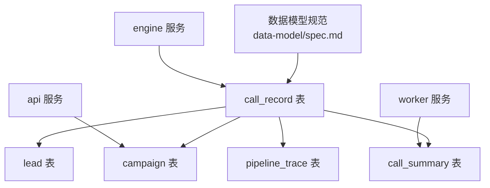
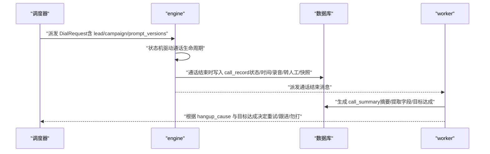
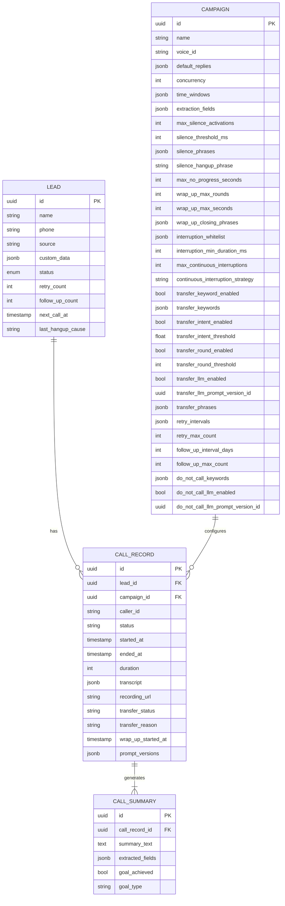
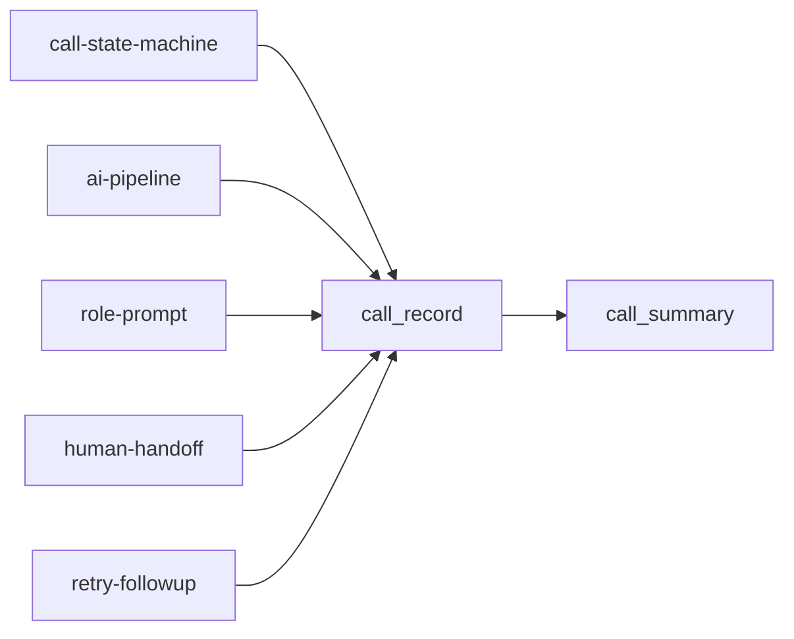

# CallRecord表

<cite>
**本文引用的文件**
- [openspec/specs/data-model/spec.md](file://openspec/specs/data-model/spec.md)
- [openspec/specs/ai-pipeline/spec.md](file://openspec/specs/ai-pipeline/spec.md)
- [openspec/specs/role-prompt/spec.md](file://openspec/specs/role-prompt/spec.md)
- [openspec/specs/call-state-machine/spec.md](file://openspec/specs/call-state-machine/spec.md)
- [openspec/specs/retry-followup/spec.md](file://openspec/specs/retry-followup/spec.md)
- [openspec/specs/human-handoff/spec.md](file://openspec/specs/human-handoff/spec.md)
</cite>

## 目录
1. [简介](#简介)
2. [项目结构](#项目结构)
3. [核心组件](#核心组件)
4. [架构总览](#架构总览)
5. [详细组件分析](#详细组件分析)
6. [依赖分析](#依赖分析)
7. [性能考虑](#性能考虑)
8. [故障排查指南](#故障排查指南)
9. [结论](#结论)
10. [附录](#附录)

## 简介
本文件围绕 iSales 系统中通话记录核心表 call_record 的数据模型进行系统化说明。依据 openspec 中的数据模型规范，call_record 由 engine 服务负责，承载一次完整通话生命周期的关键事实数据，并与 lead、campaign、call_summary 等表形成清晰的关联关系。本文将逐项解释关键字段的数据类型与业务含义，详述 JSONB 字段 transcript 与 prompt_versions 的结构与用途，给出典型使用场景、数据验证规则、索引策略与性能优化建议。

## 项目结构
- 数据模型规范集中于 openspec/specs/data-model/spec.md，其中列出 call_record 的关键字段与归属服务为 engine。
- 与 call_record 直接相关的业务行为与数据契约分布在多个 capability 规范中：
  - 通话状态机与转人工：call-state-machine、human-handoff
  - AI 三层管线与提示词版本：ai-pipeline、role-prompt
  - 重试与跟进：retry-followup
- 本节为概览性说明，不直接分析具体代码文件，故不附“章节来源”。

## 核心组件
- 表归属：call_record 归属 engine，体现其在通话生命周期管理中的核心地位。
- 关键字段概览（来自数据模型规范）：
  - lead_id：外键，指向线索表
  - campaign_id：外键，指向活动表
  - caller_id：主叫号码标识
  - status：通话状态（由状态机驱动）
  - started_at / ended_at：通话起止时间戳
  - duration：通话时长（秒或毫秒，取决于存储口径）
  - transcript(JSONB)：通话过程事件与对话片段的结构化记录
  - recording_url：录音文件访问地址
  - transfer_status / transfer_reason：转人工标记与触发原因
  - wrap_up_started_at：收尾阶段开始时间
  - prompt_versions(JSONB)：通话开始时各 LLM prompt 版本快照

**章节来源**
- [openspec/specs/data-model/spec.md:38](file://openspec/specs/data-model/spec.md#L38)

## 架构总览
- call_record 与上下游服务的交互：
  - 与 engine：落库时机在通话结束（END），写入状态、时间、录音、转人工标记、prompt 快照等
  - 与 api：通过 campaign 提供转人工关键词、意图阈值、轮次阈值、LLM 触发配置等
  - 与 worker：在通话结束后写回 call_summary，驱动重试/跟进/勿打等后续流程
  - 与 lead：作为重试/跟进/勿打识别的载体，记录 hangup_cause、retry_count、follow_up_count 等

**图表来源**
- [openspec/specs/call-state-machine/spec.md:28-31](file://openspec/specs/call-state-machine/spec.md#L28-L31)
- [openspec/specs/retry-followup/spec.md:155-158](file://openspec/specs/retry-followup/spec.md#L155-L158)
- [openspec/specs/human-handoff/spec.md:59-62](file://openspec/specs/human-handoff/spec.md#L59-L62)

## 详细组件分析

### 字段定义与业务含义
- lead_id：外键，标识本次通话对应的线索
- campaign_id：外键，标识活动配置（影响转人工阈值、沉默激活、垫词、提示词版本等）
- caller_id：主叫号码标识，用于设备选择与计费
- status：通话状态，由状态机驱动，涵盖 INIT/GREETING/LISTENING/SPEAKING/INTERRUPTED/FILLER/PROCESSING/WRAPPING_UP/ACTIVATING/TRANSFERRING/END 等
- started_at / ended_at：通话起止时间戳，用于统计与报表
- duration：通话时长，通常为秒或毫秒，取决于存储口径
- transcript(JSONB)：结构化记录通话过程事件（如状态转换、打断、沉默激活、转人工等），以及对话片段与标记
- recording_url：录音文件访问地址，便于回放与审计
- transfer_status：标记是否转人工（如 marked_for_handoff），null 表示未触发
- transfer_reason：触发转人工的原因（关键词/意图/轮次/独立 LLM）
- wrap_up_started_at：进入收尾阶段的时间点
- prompt_versions(JSONB)：通话开始时各 LLM prompt 版本快照，包含角色/裁判/润色的版本信息及 wrap_up_appended 标记

**章节来源**
- [openspec/specs/data-model/spec.md:38](file://openspec/specs/data-model/spec.md#L38)
- [openspec/specs/call-state-machine/spec.md:7-19](file://openspec/specs/call-state-machine/spec.md#L7-L19)
- [openspec/specs/human-handoff/spec.md:115-125](file://openspec/specs/human-handoff/spec.md#L115-L125)
- [openspec/specs/role-prompt/spec.md:150-170](file://openspec/specs/role-prompt/spec.md#L150-L170)

### JSONB 字段结构说明

#### transcript(JSONB)
- 用途：记录通话过程事件与对话片段，支撑调试回放、质量分析与合规审计
- 结构要点（结合规范）：
  - 事件类型：如 state_error、打断、沉默激活、转人工标记等
  - 对话片段：按“用户/AI”前缀拼接的历史文本
  - 标记字段：如 default_reply_used、wrap_up_appended 等
- 写入时机：状态机每次合法/非法状态转换都会追加事件；AI 处理完成也会写入候选/裁判/润色结果（通过 pipeline_trace 与 transcript 的协作）

**章节来源**
- [openspec/specs/call-state-machine/spec.md:33-44](file://openspec/specs/call-state-machine/spec.md#L33-L44)
- [openspec/specs/ai-pipeline/spec.md:40-68](file://openspec/specs/ai-pipeline/spec.md#L40-L68)

#### prompt_versions(JSONB)
- 用途：记录通话开始时各 LLM prompt 版本快照，便于调试回放与审计
- 结构要点（来自 role-prompt 规范）：
  - role_llms：角色 LLM 的 prompt_version_id 列表
  - judge_llms：裁判 LLM 的 prompt_version_id 列表
  - polish_llm：润色 LLM 的 prompt_version_id
  - wrap_up_appended：是否在收尾阶段追加了系统指令
- 写入时机：call_session 初始化时一次性写入

**章节来源**
- [openspec/specs/role-prompt/spec.md:159-170](file://openspec/specs/role-prompt/spec.md#L159-L170)

### 关联关系与外键约束
- 与 lead 的关系：call_record.lead_id → lead.id；用于重试/跟进/勿打识别与线索画像
- 与 campaign 的关系：call_record.campaign_id → campaign.id；用于转人工阈值、沉默激活、垫词、提示词版本等配置
- 与 call_summary 的关系：call_summary.call_record_id → call_record.id；由 worker 在通话结束后生成摘要与提取字段
- 与 pipeline_trace 的关系：engine 在每轮 PROCESSING 结束后写入 pipeline_trace，记录候选、裁判、润色等中间结果，便于回溯

**图表来源**
- [openspec/specs/data-model/spec.md:38](file://openspec/specs/data-model/spec.md#L38)
- [openspec/specs/retry-followup/spec.md:160-176](file://openspec/specs/retry-followup/spec.md#L160-L176)
- [openspec/specs/human-handoff/spec.md:115-127](file://openspec/specs/human-handoff/spec.md#L115-L127)

**章节来源**
- [openspec/specs/data-model/spec.md:38](file://openspec/specs/data-model/spec.md#L38)
- [openspec/specs/retry-followup/spec.md:160-176](file://openspec/specs/retry-followup/spec.md#L160-L176)
- [openspec/specs/human-handoff/spec.md:115-127](file://openspec/specs/human-handoff/spec.md#L115-L127)

### 典型使用场景
- 查询通话详情：按 call_record.id 或 (lead_id, started_at) 范围查询，读取 transcript、recording_url、prompt_versions 与转人工标记
- 分析通话质量：基于 transcript 的事件分布（打断、沉默激活、状态错误）与 pipeline_trace 的候选/裁判/润色结果进行统计
- 生成通话摘要：由 worker 基于 call_record 与 pipeline_trace 生成 call_summary，提取结构化字段并标注目标达成情况
- 重试/跟进决策：依据 hangup_cause 与 goal_achieved，结合 campaign 配置与 lead 状态，决定重试间隔、跟进周期或勿打标记

**章节来源**
- [openspec/specs/retry-followup/spec.md:14-17](file://openspec/specs/retry-followup/spec.md#L14-L17)
- [openspec/specs/ai-pipeline/spec.md:40-68](file://openspec/specs/ai-pipeline/spec.md#L40-L68)

### 数据验证规则
- JSONB 字段约束：transcript 与 prompt_versions 为 JSONB，需遵循相应 capability 规范中的 schema 描述；新增 JSONB 字段须附带 schema 文档
- 外键约束：lead_id、campaign_id 必须指向存在的记录
- 状态机约束：状态转换必须符合 call-state-machine 的合法转移集合，非法转移应记录 state_error 事件
- 转人工标记：transfer_status 仅在命中转人工触发条件时写入，且 transfer_reason 必须与触发类型一致

**章节来源**
- [openspec/specs/data-model/spec.md:61-74](file://openspec/specs/data-model/spec.md#L61-L74)
- [openspec/specs/call-state-machine/spec.md:21-44](file://openspec/specs/call-state-machine/spec.md#L21-L44)
- [openspec/specs/human-handoff/spec.md:21-44](file://openspec/specs/human-handoff/spec.md#L21-L44)

### 索引策略与性能优化
- 常用查询维度：
  - lead_id + started_at：用于按线索检索通话明细
  - campaign_id + started_at：用于按活动维度统计
  - status：用于筛选进行中/已完成通话
  - transfer_status：用于转人工分析
  - wrap_up_started_at：用于收尾阶段统计
- 建议索引：
  - (lead_id, started_at)
  - (campaign_id, started_at)
  - (status, started_at)
  - (transfer_status, started_at)
  - (wrap_up_started_at, started_at)
- JSONB 查询：
  - 对 transcript/prompt_versions 的高频过滤可考虑 GIN 索引；针对特定键（如 transcript 中的事件类型）建立表达式索引以提升查询效率
- 性能优化：
  - 控制 transcript 的体量：避免将过长对话历史无界拼接；必要时采用分页或外部存储
  - 分批写入 pipeline_trace：批量提交减少事务开销
  - 归档策略：对历史通话设置归档/分区，降低热数据表扫描压力

**章节来源**
- [openspec/specs/ai-pipeline/spec.md:11-18](file://openspec/specs/ai-pipeline/spec.md#L11-L18)
- [openspec/specs/role-prompt/spec.md:43-50](file://openspec/specs/role-prompt/spec.md#L43-L50)

## 依赖分析
- 与状态机的耦合：call_record 的状态变化由 call-state-machine 驱动，非法状态转换会被记录到 transcript
- 与 AI 管线的耦合：pipeline_trace 与 transcript 协作记录每轮 PROCESSING 的候选/裁判/润色结果
- 与转人工机制的耦合：human-handoff 在命中触发条件时写入 transfer_status/transfer_reason，并在通话结束时派发 handoff_task
- 与重试/跟进的耦合：retry-followup 基于 hangup_cause 与目标达成决定重试/跟进流程，影响 lead 状态与下次拨打电话时间

**图表来源**
- [openspec/specs/call-state-machine/spec.md:46-118](file://openspec/specs/call-state-machine/spec.md#L46-L118)
- [openspec/specs/ai-pipeline/spec.md:11-84](file://openspec/specs/ai-pipeline/spec.md#L11-L84)
- [openspec/specs/role-prompt/spec.md:150-170](file://openspec/specs/role-prompt/spec.md#L150-L170)
- [openspec/specs/human-handoff/spec.md:45-62](file://openspec/specs/human-handoff/spec.md#L45-L62)
- [openspec/specs/retry-followup/spec.md:155-158](file://openspec/specs/retry-followup/spec.md#L155-L158)

**章节来源**
- [openspec/specs/call-state-machine/spec.md:46-118](file://openspec/specs/call-state-machine/spec.md#L46-L118)
- [openspec/specs/ai-pipeline/spec.md:11-84](file://openspec/specs/ai-pipeline/spec.md#L11-L84)
- [openspec/specs/role-prompt/spec.md:150-170](file://openspec/specs/role-prompt/spec.md#L150-L170)
- [openspec/specs/human-handoff/spec.md:45-62](file://openspec/specs/human-handoff/spec.md#L45-L62)
- [openspec/specs/retry-followup/spec.md:155-158](file://openspec/specs/retry-followup/spec.md#L155-L158)

## 性能考虑
- JSONB 查询与索引：对频繁过滤的 JSONB 键建立 GIN/表达式索引，避免全表扫描
- 事务批量写入：pipeline_trace 与 call_record 的落库尽量批量提交，减少锁竞争
- 数据裁剪：对 transcript 的历史对话进行合理裁剪或外部化存储，避免单条记录过大
- 并发控制：结合 campaign 的并发限制与全局并发计数器，避免资源争用导致的延迟

[本节为通用指导，不直接分析具体文件，故不附“章节来源”]

## 故障排查指南
- 非法状态转移：检查 transcript 中是否存在 state_error 事件，定位触发事件与当前状态，修正状态机逻辑或输入条件
- 转人工未生效：核对 campaign 的转人工配置（关键词/意图/轮次/LLM）与实际触发条件，确认 transfer_status/transfer_reason 是否正确写入
- prompt 版本不一致：核对 prompt_versions 快照，确保各角色/裁判/润色的 prompt_version_id 与当前生效版本一致
- 重试/跟进异常：检查 hangup_cause 与 goal_achieved，确认 retry-followup 的间隔策略与上限配置是否正确

**章节来源**
- [openspec/specs/call-state-machine/spec.md:33-44](file://openspec/specs/call-state-machine/spec.md#L33-L44)
- [openspec/specs/human-handoff/spec.md:54-57](file://openspec/specs/human-handoff/spec.md#L54-L57)
- [openspec/specs/role-prompt/spec.md:159-170](file://openspec/specs/role-prompt/spec.md#L159-L170)
- [openspec/specs/retry-followup/spec.md:14-17](file://openspec/specs/retry-followup/spec.md#L14-L17)

## 结论
call_record 作为 iSales 通话生命周期的核心事实表，承载状态、时间、录音、转人工标记与 prompt 版本快照等关键信息。其与 engine、api、worker 的协作，以及与 lead、campaign、call_summary 的关联，共同构成了完整的外呼自动化与智能分析体系。通过合理的索引策略、JSONB 结构设计与批量写入优化，可有效保障高并发场景下的稳定性与可扩展性。

[本节为总结性内容，不直接分析具体文件，故不附“章节来源”]

## 附录
- 相关 capability 规范要点速览：
  - call-state-machine：状态集合、合法转移、非法转移处理
  - ai-pipeline：三层管线、兜底/降级路径、pipeline_trace 写入
  - role-prompt：prompt 版本管理、prompt_versions 结构
  - human-handoff：转人工触发机制、标记与派发
  - retry-followup：重试/跟进策略、lead 状态机

[本节为概览性附录，不直接分析具体文件，故不附“章节来源”]