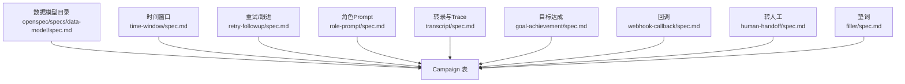
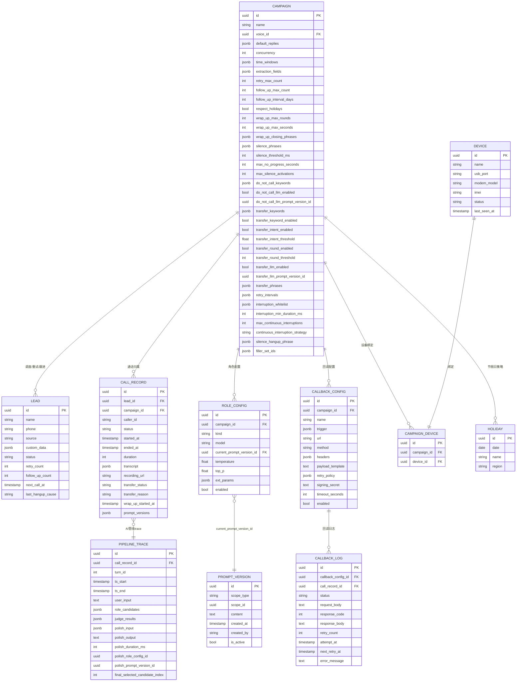
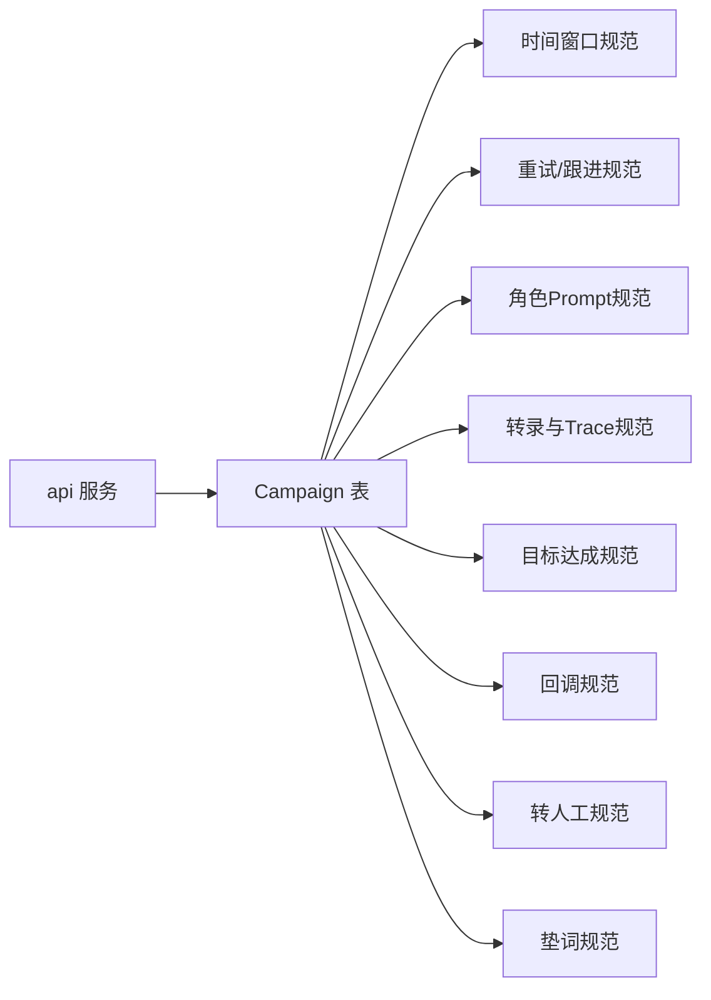

# Campaign表

<cite>
**本文引用的文件**
- [openspec/specs/data-model/spec.md](file://openspec/specs/data-model/spec.md)
- [openspec/specs/time-window/spec.md](file://openspec/specs/time-window/spec.md)
- [openspec/specs/retry-followup/spec.md](file://openspec/specs/retry-followup/spec.md)
- [openspec/specs/role-prompt/spec.md](file://openspec/specs/role-prompt/spec.md)
- [openspec/specs/transcript/spec.md](file://openspec/specs/transcript/spec.md)
- [openspec/specs/goal-achievement/spec.md](file://openspec/specs/goal-achievement/spec.md)
- [openspec/specs/webhook-callback/spec.md](file://openspec/specs/webhook-callback/spec.md)
- [openspec/specs/human-handoff/spec.md](file://openspec/specs/human-handoff/spec.md)
- [openspec/specs/filler/spec.md](file://openspec/specs/filler/spec.md)
</cite>

## 目录
1. [简介](#简介)
2. [项目结构](#项目结构)
3. [核心组件](#核心组件)
4. [架构总览](#架构总览)
5. [详细组件分析](#详细组件分析)
6. [依赖分析](#依赖分析)
7. [性能考虑](#性能考虑)
8. [故障排查指南](#故障排查指南)
9. [结论](#结论)
10. [附录](#附录)

## 简介
本文件面向iSales系统中的Campaign表，基于openspec规范，系统化梳理其作为营销活动核心配置表的关键字段、数据类型、业务含义、取值范围与约束，以及与lead、call_record、role_config等表的关联关系。Campaign表归属服务为api，是调度与通话生命周期的“配置中枢”，贯穿时间窗口、重试/跟进、目标达成、垫词、转人工、回调等全流程。

## 项目结构
- Campaign表位于数据模型“目录视图”中，作为核心配置表之一，由isales-common统一管理，其他服务通过依赖访问。
- Campaign表的字段与行为由多个capability spec细化：时间窗口、重试/跟进、角色prompt、转录与管线trace、目标达成、回调、转人工、垫词等。

**图表来源**
- [openspec/specs/data-model/spec.md:28-50](file://openspec/specs/data-model/spec.md#L28-L50)
- [openspec/specs/time-window/spec.md:1-86](file://openspec/specs/time-window/spec.md#L1-L86)
- [openspec/specs/retry-followup/spec.md:1-176](file://openspec/specs/retry-followup/spec.md#L1-L176)
- [openspec/specs/role-prompt/spec.md:1-238](file://openspec/specs/role-prompt/spec.md#L1-L238)
- [openspec/specs/transcript/spec.md:1-127](file://openspec/specs/transcript/spec.md#L1-L127)
- [openspec/specs/goal-achievement/spec.md:1-126](file://openspec/specs/goal-achievement/spec.md#L1-L126)
- [openspec/specs/webhook-callback/spec.md:1-231](file://openspec/specs/webhook-callback/spec.md#L1-L231)
- [openspec/specs/human-handoff/spec.md:1-128](file://openspec/specs/human-handoff/spec.md#L1-L128)
- [openspec/specs/filler/spec.md:1-132](file://openspec/specs/filler/spec.md#L1-L132)

**章节来源**
- [openspec/specs/data-model/spec.md:1-83](file://openspec/specs/data-model/spec.md#L1-L83)

## 核心组件
- 表归属：api（负责Campaign配置、调度策略与跨模块协调）
- 字段概览（部分关键字段）：
  - name：活动名称
  - voice_id：音色标识（与voice_model关联）
  - default_replies(JSONB)：默认回复模板池
  - concurrency：并发控制
  - time_windows(JSONB)：时间窗口配置（见时间窗口规范）
  - extraction_fields(JSONB)：字段抽取配置参考（具体抽取由角色LLM完成）
  - 其他：重试/跟进、沉默激活、转人工、收尾、勿打识别、节假日等策略字段

**章节来源**
- [openspec/specs/data-model/spec.md:28-50](file://openspec/specs/data-model/spec.md#L28-L50)
- [openspec/specs/time-window/spec.md:79-86](file://openspec/specs/time-window/spec.md#L79-L86)
- [openspec/specs/retry-followup/spec.md:160-176](file://openspec/specs/retry-followup/spec.md#L160-L176)
- [openspec/specs/goal-achievement/spec.md:110-122](file://openspec/specs/goal-achievement/spec.md#L110-L122)
- [openspec/specs/human-handoff/spec.md:111-128](file://openspec/specs/human-handoff/spec.md#L111-L128)
- [openspec/specs/filler/spec.md:111-132](file://openspec/specs/filler/spec.md#L111-L132)

## 架构总览
Campaign表是调度与通话生命周期的“配置中枢”。它与以下表形成强关联：
- lead：重试/跟进、下次拨打时间、勿打识别
- call_record：通话状态、转人工标记、转录与录音、prompt版本快照
- role_config：角色/裁判/润色prompt版本与调参
- callback_config/callback_log：通话结束后的异步回调与重试
- device/campaign_device：设备选择与绑定
- holiday：节假日策略

**图表来源**
- [openspec/specs/data-model/spec.md:28-50](file://openspec/specs/data-model/spec.md#L28-L50)
- [openspec/specs/retry-followup/spec.md:160-176](file://openspec/specs/retry-followup/spec.md#L160-L176)
- [openspec/specs/role-prompt/spec.md:230-238](file://openspec/specs/role-prompt/spec.md#L230-L238)
- [openspec/specs/transcript/spec.md:77-91](file://openspec/specs/transcript/spec.md#L77-L91)
- [openspec/specs/webhook-callback/spec.md:210-231](file://openspec/specs/webhook-callback/spec.md#L210-L231)
- [openspec/specs/time-window/spec.md:79-86](file://openspec/specs/time-window/spec.md#L79-L86)
- [openspec/specs/goal-achievement/spec.md:110-122](file://openspec/specs/goal-achievement/spec.md#L110-L122)
- [openspec/specs/human-handoff/spec.md:111-128](file://openspec/specs/human-handoff/spec.md#L111-L128)
- [openspec/specs/filler/spec.md:111-132](file://openspec/specs/filler/spec.md#L111-L132)

## 详细组件分析

### 字段定义与业务含义

- 基础字段
  - name：活动名称，字符串，用于运营识别
  - voice_id：音色标识，外键指向voice_model
  - concurrency：并发控制，限制同一时间的外呼数量

- JSONB字段详解
  - default_replies(JSONB)：默认回复模板池，用于在特定场景（如全部裁判否决）回退
  - time_windows(JSONB)：时间窗口数组，元素包含days（星期数组）、start/end（HH:mm字符串），用于调度器判断是否允许外呼
  - extraction_fields(JSONB)：字段抽取配置参考，具体抽取由角色LLM在prompt中定义并完成

- 重试/跟进策略
  - retry_intervals(JSONB)：各次重试间隔（分钟）数组，支持指数退避
  - retry_max_count：重试上限
  - follow_up_interval_days：跟进间隔（天）
  - follow_up_max_count：跟进上限

- 勿打识别
  - do_not_call_keywords(JSONB)：关键词列表
  - do_not_call_llm_enabled：是否启用独立LLM判定
  - do_not_call_llm_prompt_version_id：LLM prompt版本引用

- 沉默激活与静音策略
  - silence_threshold_ms：静音阈值（毫秒）
  - max_no_progress_seconds：无进展最大时长
  - max_silence_activations：沉默激活最大次数
  - silence_phrases(JSONB)：沉默激活话术池
  - silence_hangup_phrase(JSONB)：沉默挂断话术

- 转人工策略
  - transfer_keyword_enabled/transfer_keywords(JSONB)：关键词触发
  - transfer_intent_enabled/transfer_intent_threshold：意图分类触发
  - transfer_round_enabled/transfer_round_threshold：轮次触发
  - transfer_llm_enabled/transfer_llm_prompt_version_id：独立LLM触发
  - transfer_phrases(JSONB)：衔接话术池

- 收尾策略
  - wrap_up_max_rounds/wrap_up_max_seconds：收尾轮数与时长上限
  - wrap_up_closing_phrases(JSONB)：收尾挂断话术池

- 干扰检测
  - interruption_whitelist(JSONB)：干扰白名单
  - interruption_min_duration_ms：最小干扰时长
  - max_continuous_interruptions：连续最大干扰次数
  - continuous_interruption_strategy：连续干扰策略

- 节假日与时间窗口
  - respect_holidays：是否尊重节假日
  - holiday表：全局节假日，按地区维护

**章节来源**
- [openspec/specs/data-model/spec.md:28-50](file://openspec/specs/data-model/spec.md#L28-L50)
- [openspec/specs/time-window/spec.md:7-86](file://openspec/specs/time-window/spec.md#L7-L86)
- [openspec/specs/retry-followup/spec.md:24-90](file://openspec/specs/retry-followup/spec.md#L24-L90)
- [openspec/specs/goal-achievement/spec.md:44-122](file://openspec/specs/goal-achievement/spec.md#L44-L122)
- [openspec/specs/human-handoff/spec.md:21-128](file://openspec/specs/human-handoff/spec.md#L21-L128)
- [openspec/specs/filler/spec.md:31-132](file://openspec/specs/filler/spec.md#L31-L132)

### JSONB字段结构与使用场景

- time_windows(JSONB)：数组元素包含days（星期缩写数组）、start/end（HH:mm字符串）
  - 使用场景：调度器在派发前判断是否在窗口内；跨边界保护：通话进行中跨过窗口结束时刻不强制中断
  - 参考：时间窗口规范

- default_replies(JSONB)：数组或对象，用于在全部裁判否决时播放默认回复
  - 使用场景：AI候选均不满足时的兜底话术

- extraction_fields(JSONB)：字段抽取配置参考，具体抽取由角色LLM在prompt中实现
  - 使用场景：目标达成后，call_summary.extracted_fields写入结构化字段

- 其他JSONB字段（如callback_config.trigger、retry_policy、prompt_versions等）在各自规范中定义

**章节来源**
- [openspec/specs/time-window/spec.md:7-86](file://openspec/specs/time-window/spec.md#L7-L86)
- [openspec/specs/goal-achievement/spec.md:110-122](file://openspec/specs/goal-achievement/spec.md#L110-L122)
- [openspec/specs/webhook-callback/spec.md:19-128](file://openspec/specs/webhook-callback/spec.md#L19-L128)
- [openspec/specs/role-prompt/spec.md:150-170](file://openspec/specs/role-prompt/spec.md#L150-L170)

### 典型使用场景

- 创建营销活动
  - 配置name、voice_id、concurrency
  - 配置time_windows（工作日/周末时段）
  - 配置default_replies、extraction_fields
  - 配置重试/跟进策略（retry_intervals、retry_max_count、follow_up_interval_days、follow_up_max_count）
  - 配置勿打识别（do_not_call_keywords、do_not_call_llm_enabled）
  - 配置沉默激活（silence_*相关）
  - 配置转人工（transfer_*相关）
  - 配置收尾（wrap_up_*相关）

- 配置通话参数
  - 通过role_config与prompt_version管理角色/裁判/润色prompt版本与调参
  - 通过callback_config配置回调触发与payload模板

- 设置时间窗口
  - time_windows配置多时段，respect_holidays控制是否启用节假日
  - 调度器在派发前检查窗口与节假日，跨边界保护

- 与lead的交互
  - scheduler按窗口与并发控制选取lead，按重试/跟进策略更新next_call_at
  - worker根据hangup_cause与goal_achieved写回lead状态与下次拨打时间

- 与call_record的交互
  - 通话开始记录prompt_versions快照
  - 通话结束写transcript、recording_url、transfer_status/transfer_reason、wrap_up_started_at等

- 与role_config的交互
  - role_config.campaign_id关联Campaign
  - current_prompt_version_id指向生效prompt版本

- 与callback_config/callback_log的交互
  - 通话结束后按trigger表达式与payload模板异步回调，失败按retry_policy重试

**章节来源**
- [openspec/specs/retry-followup/spec.md:119-176](file://openspec/specs/retry-followup/spec.md#L119-L176)
- [openspec/specs/role-prompt/spec.md:150-170](file://openspec/specs/role-prompt/spec.md#L150-L170)
- [openspec/specs/webhook-callback/spec.md:5-133](file://openspec/specs/webhook-callback/spec.md#L5-L133)
- [openspec/specs/transcript/spec.md:77-127](file://openspec/specs/transcript/spec.md#L77-L127)

### 关联关系与外键约束

- 与lead
  - call_record.lead_id → lead.id
  - lead.campaign_id（若存在）→ campaign.id
  - lead.next_call_at受time_windows与重试/跟进策略影响

- 与call_record
  - call_record.campaign_id → campaign.id
  - call_record.prompt_versions(JSONB)记录prompt版本快照
  - call_record.transfer_status/transfer_reason用于转人工标记

- 与role_config
  - role_config.campaign_id → campaign.id
  - role_config.current_prompt_version_id → prompt_version.id

- 与callback_config/callback_log
  - callback_config.campaign_id → campaign.id
  - callback_log.callback_config_id → callback_config.id
  - callback_log.call_record_id → call_record.id

- 与device/campaign_device
  - campaign_device.campaign_id → campaign.id
  - campaign_device.device_id → device.id

- 与holiday
  - campaign.respect_holidays控制是否启用节假日
  - holiday.date/name/region用于窗口判定

**章节来源**
- [openspec/specs/data-model/spec.md:28-50](file://openspec/specs/data-model/spec.md#L28-L50)
- [openspec/specs/retry-followup/spec.md:160-176](file://openspec/specs/retry-followup/spec.md#L160-L176)
- [openspec/specs/role-prompt/spec.md:230-238](file://openspec/specs/role-prompt/spec.md#L230-L238)
- [openspec/specs/webhook-callback/spec.md:210-231](file://openspec/specs/webhook-callback/spec.md#L210-L231)
- [openspec/specs/time-window/spec.md:79-86](file://openspec/specs/time-window/spec.md#L79-L86)

### 数据验证规则与索引策略

- 数据验证规则
  - JSONB字段需附schema描述（来自capability规范）
  - JSONB不替代关系建模：如callback_log不应塞进callback_config的JSONB
  - time_windows为空数组时，调度器应视为全天禁止外呼（极端情况应在创建时校验阻止）
  - 重试/跟进策略需满足非负整数与数组长度约束
  - 转人工相关阈值需在合理范围内

- 索引策略建议
  - 常用查询字段（如name、voice_id、concurrency）可考虑适当索引
  - JSONB字段查询建议使用GIN索引（如time_windows、extraction_fields、default_replies等）
  - 对于高频过滤字段（如status、next_call_at）建立复合索引以提升调度效率
  - 对外键字段（如campaign_id、lead_id、device_id）建立索引以加速JOIN

- 性能优化建议
  - 使用JSONB查询函数（如@>、?、#>>）时配合GIN索引
  - 将大型JSONB字段拆分为独立表或减少嵌套深度（遵循“JSONB不替代关系建模”原则）
  - 控制time_windows数组长度与复杂度，避免调度器判定开销过大
  - 对callback_config.trigger使用JsonLogic表达式缓存与预编译（应用层）

**章节来源**
- [openspec/specs/data-model/spec.md:61-74](file://openspec/specs/data-model/spec.md#L61-L74)
- [openspec/specs/time-window/spec.md:23-27](file://openspec/specs/time-window/spec.md#L23-L27)

## 依赖分析

**图表来源**
- [openspec/specs/data-model/spec.md:75-83](file://openspec/specs/data-model/spec.md#L75-L83)
- [openspec/specs/time-window/spec.md:1-86](file://openspec/specs/time-window/spec.md#L1-L86)
- [openspec/specs/retry-followup/spec.md:1-176](file://openspec/specs/retry-followup/spec.md#L1-L176)
- [openspec/specs/role-prompt/spec.md:1-238](file://openspec/specs/role-prompt/spec.md#L1-L238)
- [openspec/specs/transcript/spec.md:1-127](file://openspec/specs/transcript/spec.md#L1-L127)
- [openspec/specs/goal-achievement/spec.md:1-126](file://openspec/specs/goal-achievement/spec.md#L1-L126)
- [openspec/specs/webhook-callback/spec.md:1-231](file://openspec/specs/webhook-callback/spec.md#L1-L231)
- [openspec/specs/human-handoff/spec.md:1-128](file://openspec/specs/human-handoff/spec.md#L1-L128)
- [openspec/specs/filler/spec.md:1-132](file://openspec/specs/filler/spec.md#L1-L132)

**章节来源**
- [openspec/specs/data-model/spec.md:75-83](file://openspec/specs/data-model/spec.md#L75-L83)

## 性能考虑
- JSONB查询与索引：对频繁过滤的JSONB字段使用GIN索引，避免全表扫描
- 调度器判定：time_windows数组应简洁，避免过多嵌套与冗余配置
- 并发控制：concurrency与Redis全局并发计数器协同，防止超卖
- 回调重试：指数退避策略与独立重试调度器降低峰值压力
- 转录与Trace：三段式存储分离，避免transcript污染pipeline_trace

[本节为通用指导，无需具体文件来源]

## 故障排查指南
- 调度不生效
  - 检查time_windows是否为空数组或配置错误
  - 检查respect_holidays与当前日期是否命中节假日
  - 检查lead.next_call_at是否被正确更新（窗外仅在该场景允许写入）

- 通话未按预期触发回调
  - 检查callback_config.trigger的JsonLogic表达式是否合法
  - 检查payload_template的Jinja2沙盒渲染是否报错
  - 检查callback_log.status与retry_policy是否达到exhausted

- 目标达成判定异常
  - 检查角色prompt是否正确输出goal_achieved/goal_type/extracted
  - 检查WRAPPING_UP状态下的收尾轮数与时长上限

- 转人工未触发
  - 检查关键词/意图/轮次/LLM触发开关与阈值
  - 检查transfer_phrases是否配置

- 勿打识别误判
  - 检查do_not_call_keywords与do_not_call_llm_enabled配置
  - 检查ASR终态结果是否包含关键词

**章节来源**
- [openspec/specs/retry-followup/spec.md:140-176](file://openspec/specs/retry-followup/spec.md#L140-L176)
- [openspec/specs/webhook-callback/spec.md:134-170](file://openspec/specs/webhook-callback/spec.md#L134-L170)
- [openspec/specs/goal-achievement/spec.md:44-122](file://openspec/specs/goal-achievement/spec.md#L44-L122)
- [openspec/specs/human-handoff/spec.md:21-128](file://openspec/specs/human-handoff/spec.md#L21-L128)

## 结论
Campaign表是iSales系统营销活动的“配置中枢”，贯穿调度、通话、目标达成、回调、转人工、节假日与并发控制等关键环节。通过清晰的字段定义、严格的JSONB schema约束与合理的索引策略，可确保系统在高并发场景下的稳定性与可维护性。与其他表的强关联关系进一步凸显其在api服务中的核心地位。

[本节为总结，无需具体文件来源]

## 附录

### 字段与取值范围速查
- name：字符串，建议唯一性约束（业务层面）
- voice_id：UUID，外键指向voice_model
- concurrency：正整数
- time_windows：JSONB数组，元素含days/start/end
- extraction_fields：JSONB，字段抽取配置参考
- retry_intervals：JSONB数组（分钟），非负
- retry_max_count：非负整数
- follow_up_interval_days：正整数
- follow_up_max_count：非负整数
- do_not_call_keywords：JSONB数组
- silence_*：静音相关阈值与时长，正整数
- transfer_*：转人工相关开关与阈值
- wrap_up_*：收尾轮数与时长，正整数
- callback_config：trigger（JsonLogic）、retry_policy（JSONB）、payload_template（Jinja2）

**章节来源**
- [openspec/specs/data-model/spec.md:28-50](file://openspec/specs/data-model/spec.md#L28-L50)
- [openspec/specs/retry-followup/spec.md:160-176](file://openspec/specs/retry-followup/spec.md#L160-L176)
- [openspec/specs/time-window/spec.md:79-86](file://openspec/specs/time-window/spec.md#L79-L86)
- [openspec/specs/goal-achievement/spec.md:110-122](file://openspec/specs/goal-achievement/spec.md#L110-L122)
- [openspec/specs/webhook-callback/spec.md:210-231](file://openspec/specs/webhook-callback/spec.md#L210-L231)
- [openspec/specs/human-handoff/spec.md:111-128](file://openspec/specs/human-handoff/spec.md#L111-L128)
- [openspec/specs/filler/spec.md:111-132](file://openspec/specs/filler/spec.md#L111-L132)