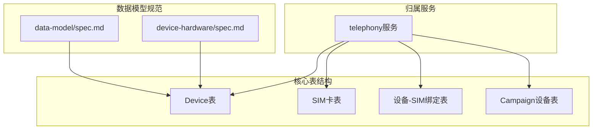
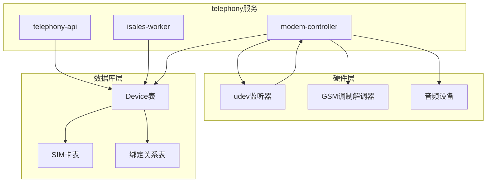
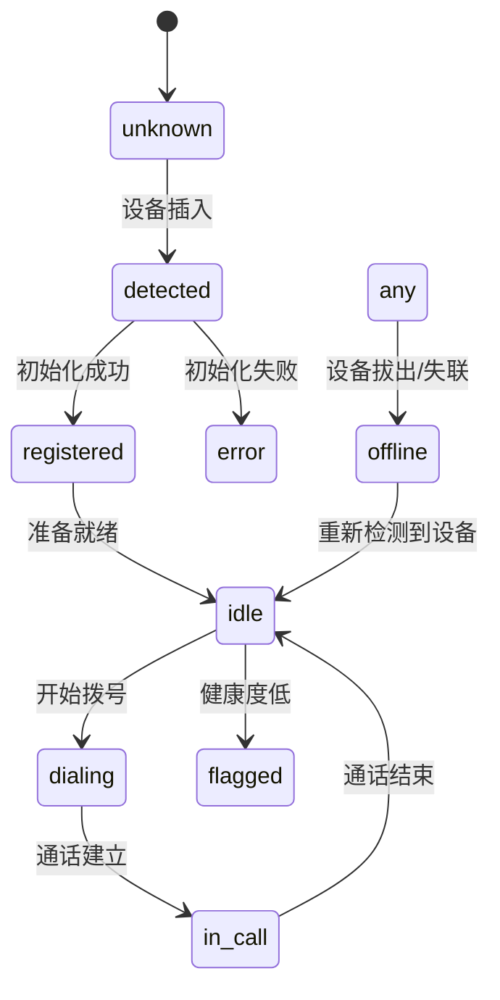
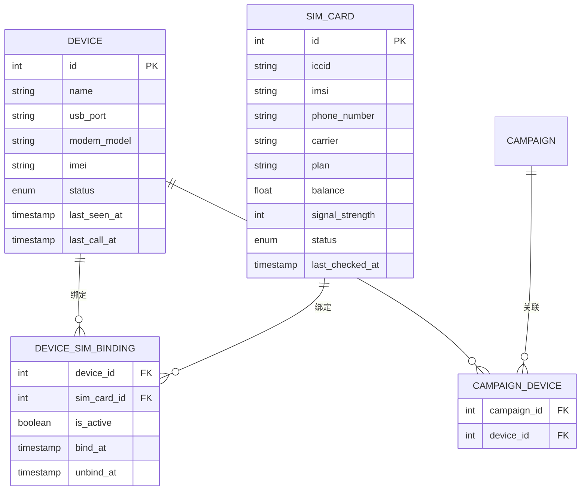
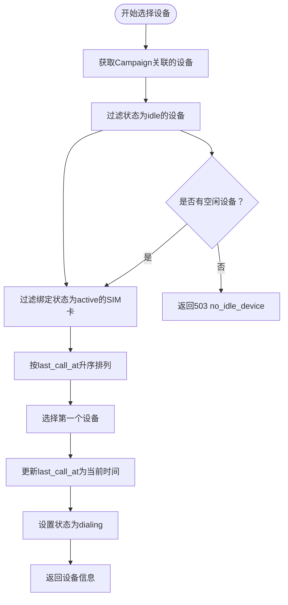
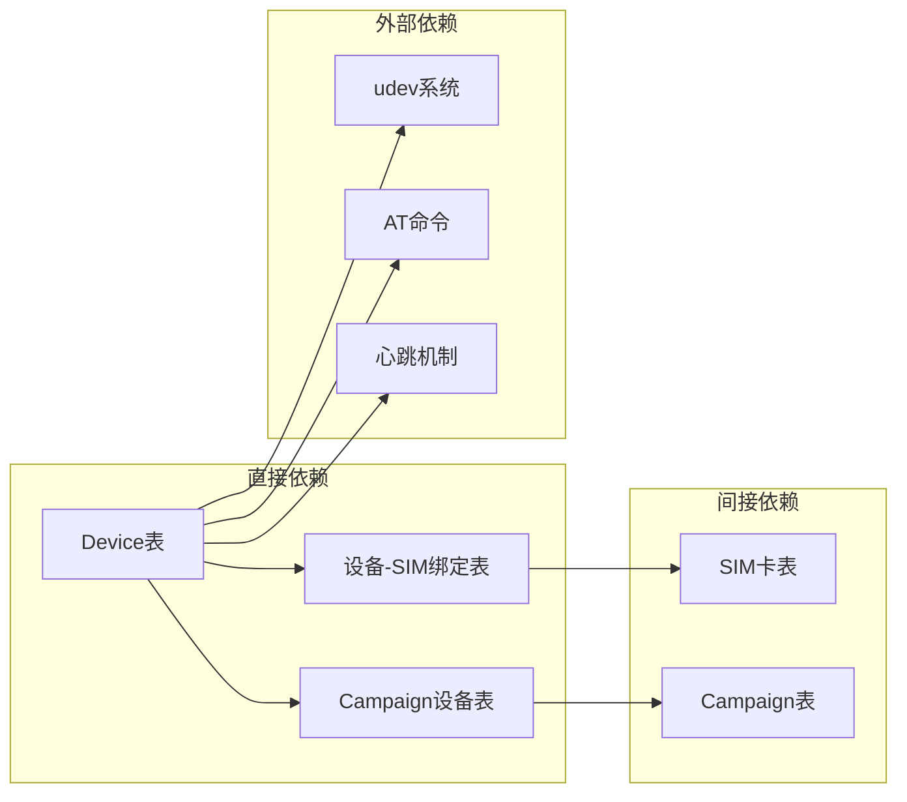

# Device表

<cite>
**本文档引用的文件**
- [openspec/specs/data-model/spec.md](file://openspec/specs/data-model/spec.md)
- [openspec/specs/device-hardware/spec.md](file://openspec/specs/device-hardware/spec.md)
- [openspec/changes/archive/2026-05-01-clarify-stage2-boundaries/specs/data-model/spec.md](file://openspec/changes/archive/2026-05-01-clarify-stage2-boundaries/specs/data-model/spec.md)
- [openspec/changes/archive/2026-05-06-impl-telephony/design.md](file://openspec/changes/archive/2026-05-06-impl-telephony/design.md)
- [openspec/changes/arch-cloud-edge-split/specs/device-hardware/spec.md](file://openspec/changes/arch-cloud-edge-split/specs/device-hardware/spec.md)
</cite>

## 目录
1. [简介](#简介)
2. [项目结构](#项目结构)
3. [核心组件](#核心组件)
4. [架构概览](#架构概览)
5. [详细组件分析](#详细组件分析)
6. [依赖关系分析](#依赖关系分析)
7. [性能考虑](#性能考虑)
8. [故障排除指南](#故障排除指南)
9. [结论](#结论)

## 简介

Device表是iSales系统中硬件设备信息的核心数据表，专门用于管理USB GSM调制解调器设备。该表属于telephony服务，负责跟踪设备的物理状态、连接状态和使用历史。Device表不仅存储设备的基本硬件信息，还维护设备的状态机转换逻辑，确保系统能够准确反映设备的实际工作状态。

在iSales系统中，Device表扮演着设备管理的核心角色，为电话呼出功能提供基础设施支持。它与SIM卡管理、通话调度等功能紧密集成，形成了完整的硬件设备管理体系。

## 项目结构

Device表位于iSales系统的数据模型规范中，作为核心业务表之一，与其他相关表共同构成完整的设备管理系统。

**图表来源**
- [openspec/specs/data-model/spec.md:28-49](file://openspec/specs/data-model/spec.md#L28-L49)
- [openspec/specs/device-hardware/spec.md:517-525](file://openspec/specs/device-hardware/spec.md#L517-L525)

**章节来源**
- [openspec/specs/data-model/spec.md:28-49](file://openspec/specs/data-model/spec.md#L28-L49)
- [openspec/specs/device-hardware/spec.md:517-525](file://openspec/specs/device-hardware/spec.md#L517-L525)

## 核心组件

Device表包含以下关键字段：

### 基础硬件信息字段

| 字段名 | 数据类型 | 业务含义 | 约束条件 |
|--------|----------|----------|----------|
| name | string | 设备显示名称 | 必填，唯一标识 |
| usb_port | string | USB端口号 | 必填，格式：/dev/ttyUSB* |
| modem_model | string | 调制解调器型号 | 必填，厂商型号 |
| imei | string | 设备国际移动设备识别码 | 必填，15位数字 |

### 状态管理字段

| 字段名 | 数据类型 | 业务含义 | 约束条件 |
|--------|----------|----------|----------|
| status | enum | 设备当前状态 | 必填，默认：unknown |
| last_seen_at | datetime | 最后心跳时间 | 可空，默认：NULL |

### 使用统计字段

| 字段名 | 数据类型 | 业务含义 | 约束条件 |
|--------|----------|----------|----------|
| last_call_at | datetime | 最后通话时间 | 可空，默认：NULL |

**章节来源**
- [openspec/specs/data-model/spec.md:46](file://openspec/specs/data-model/spec.md#L46)
- [openspec/specs/device-hardware/spec.md:519-521](file://openspec/specs/device-hardware/spec.md#L519-L521)

## 架构概览

Device表在整个iSales系统中处于核心地位，与多个组件协同工作：

**图表来源**
- [openspec/specs/device-hardware/spec.md:26-44](file://openspec/specs/device-hardware/spec.md#L26-L44)
- [openspec/specs/device-hardware/spec.md:106-146](file://openspec/specs/device-hardware/spec.md#L106-L146)

## 详细组件分析

### 设备状态机

Device表实现了完整的设备状态管理机制，涵盖设备从插入到离线的整个生命周期：

**图表来源**
- [openspec/specs/device-hardware/spec.md:45-67](file://openspec/specs/device-hardware/spec.md#L45-L67)

#### 状态转换规则详解

| 状态 | 转换条件 | 触发事件 | 业务含义 |
|------|----------|----------|----------|
| unknown | 初始状态 | 设备创建 | 设备尚未被系统识别 |
| detected | 设备插入 | udev add事件 | 系统检测到新设备，开始识别 |
| registered | 初始化成功 | AT命令成功 | 设备完成初始化，准备使用 |
| idle | 设备就绪 | 空闲状态 | 设备可用，等待拨号请求 |
| dialing | 开始拨号 | 调用拨号接口 | 正在进行拨号操作 |
| in_call | 通话建立 | 连接成功 | 设备正在进行通话 |
| flagged | 健康度低 | 系统检测到异常 | 设备存在潜在问题，需要关注 |
| error | 初始化失败 | AT命令失败 | 设备初始化过程中发生错误 |
| offline | 设备离线 | 设备拔出/失联 | 设备不可用，可能是物理拔出或通信中断 |

**章节来源**
- [openspec/specs/device-hardware/spec.md:45-67](file://openspec/specs/device-hardware/spec.md#L45-L67)
- [openspec/specs/device-hardware/spec.md:208-236](file://openspec/specs/device-hardware/spec.md#L208-L236)

### 设备与SIM卡的关系

Device表与SIM卡管理通过绑定关系表建立联系：

**图表来源**
- [openspec/specs/data-model/spec.md:47-49](file://openspec/specs/data-model/spec.md#L47-L49)
- [openspec/specs/device-hardware/spec.md:519-525](file://openspec/specs/device-hardware/spec.md#L519-L525)

**章节来源**
- [openspec/specs/data-model/spec.md:47-49](file://openspec/specs/data-model/spec.md#L47-L49)
- [openspec/specs/device-hardware/spec.md:69-87](file://openspec/specs/device-hardware/spec.md#L69-L87)

### 设备选择算法

telephony-api提供了设备选择功能，用于在拨号前选择合适的设备：

**图表来源**
- [openspec/specs/device-hardware/spec.md:180-193](file://openspec/specs/device-hardware/spec.md#L180-L193)

**章节来源**
- [openspec/specs/device-hardware/spec.md:180-193](file://openspec/specs/device-hardware/spec.md#L180-L193)

## 依赖关系分析

Device表与其他表之间存在复杂的依赖关系：

**图表来源**
- [openspec/specs/data-model/spec.md:47-49](file://openspec/specs/data-model/spec.md#L47-L49)
- [openspec/specs/device-hardware/spec.md:88-105](file://openspec/specs/device-hardware/spec.md#L88-L105)

**章节来源**
- [openspec/specs/data-model/spec.md:47-49](file://openspec/specs/data-model/spec.md#L47-L49)
- [openspec/specs/device-hardware/spec.md:88-105](file://openspec/specs/device-hardware/spec.md#L88-L105)

## 性能考虑

### 心跳机制优化

Device表实现了双重心跳保护机制：

1. **udev心跳**：每30秒发送一次心跳，确保设备状态的实时性
2. **watchdog心跳**：每120秒检查一次，作为udev心跳的兜底保护

### 并发控制

设备选择操作采用行级锁机制，确保在高并发场景下不会出现设备被重复分配的情况：

- 使用`SELECT ... FOR UPDATE SKIP LOCKED`锁定目标设备
- 在同一事务中更新`last_call_at`和`status`字段
- 支持`NULLS FIRST`排序，优先选择从未使用的设备

**章节来源**
- [openspec/specs/device-hardware/spec.md:208-236](file://openspec/specs/device-hardware/spec.md#L208-L236)
- [openspec/changes/archive/2026-05-06-impl-telephony/design.md#L32](file://openspec/changes/archive/2026-05-06-impl-telephony/design.md#L32)

## 故障排除指南

### 常见状态异常处理

| 异常状态 | 可能原因 | 处理建议 |
|----------|----------|----------|
| offline | 设备物理拔出或通信中断 | 检查USB连接，重启modem-controller |
| error | AT命令初始化失败 | 检查设备兼容性，更新驱动程序 |
| flagged | 健康度低警告 | 监控信号强度，检查设备老化程度 |
| unknown | 设备未被识别 | 检查udev权限，重新插拔设备 |

### 心跳监控

系统提供了多重心跳监控机制：

1. **udev心跳**：设备热插拔时的即时响应
2. **modem-controller心跳**：每30秒发送一次
3. **watchdog心跳**：每120秒检查一次

### 维护建议

1. **定期检查**：监控设备状态变化，及时发现异常
2. **备份策略**：定期备份设备配置和使用历史
3. **升级计划**：定期更新modem驱动和固件
4. **容量规划**：根据使用情况合理配置设备数量

**章节来源**
- [openspec/specs/device-hardware/spec.md:208-236](file://openspec/specs/device-hardware/spec.md#L208-L236)

## 结论

Device表作为iSales系统硬件设备管理的核心组件，通过完善的字段设计、状态管理和关联关系，为系统的电话呼出功能提供了可靠的基础设施支持。其设计充分考虑了实际使用场景中的各种复杂情况，包括设备热插拔、并发访问、故障恢复等。

通过与SIM卡管理、Campaign设备关联等功能的深度集成，Device表不仅满足了当前的功能需求，也为未来的扩展奠定了良好的基础。其标准化的状态机设计和严格的约束机制，确保了系统在复杂环境下的稳定性和可靠性。