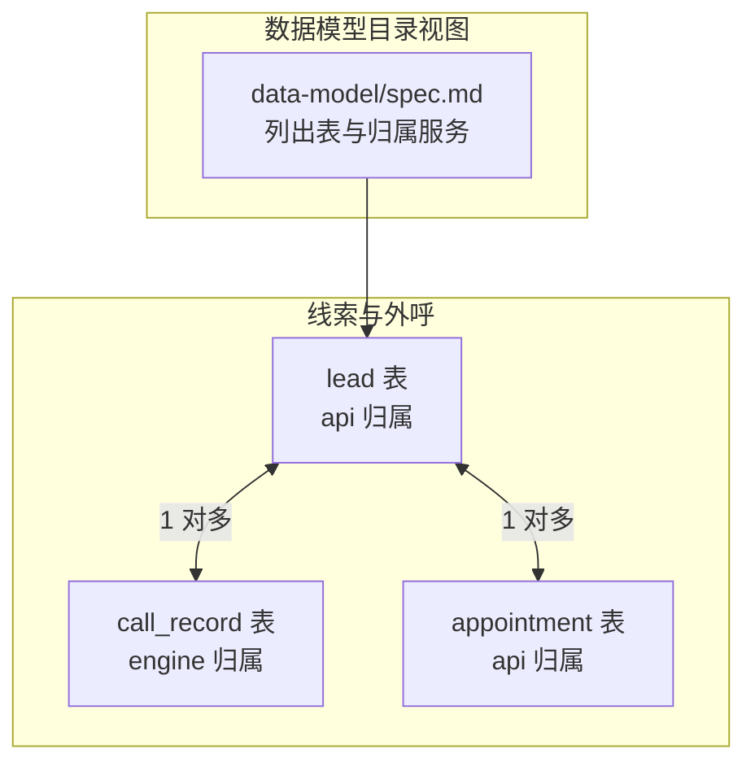
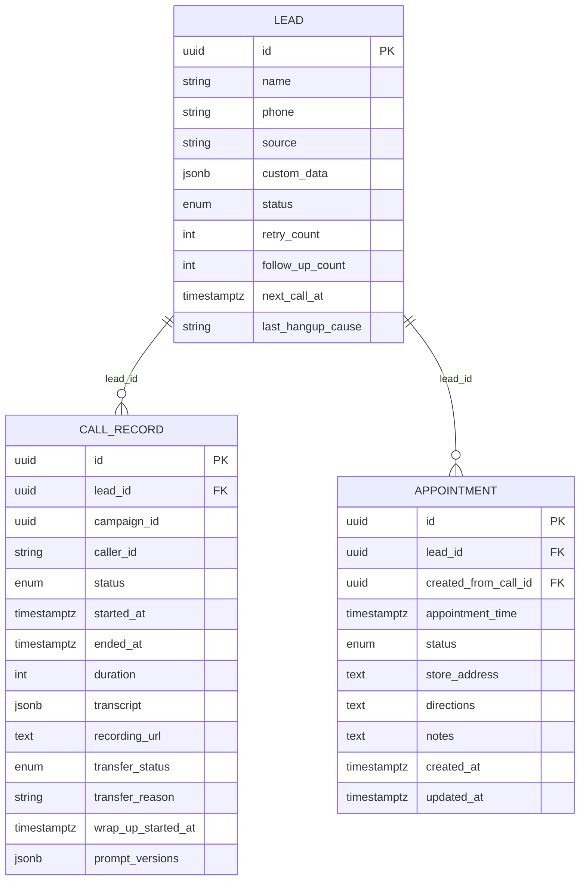
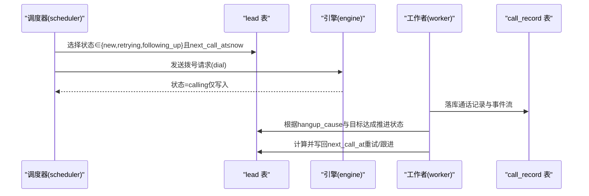
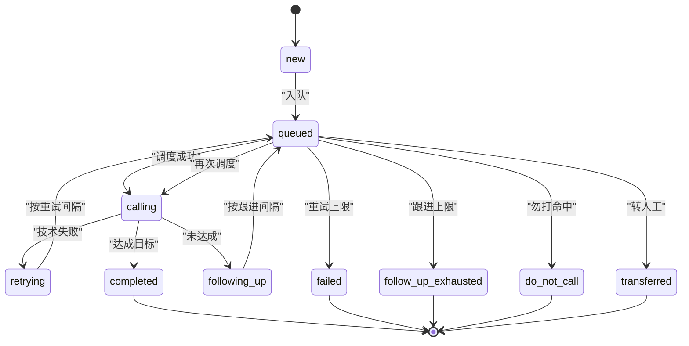
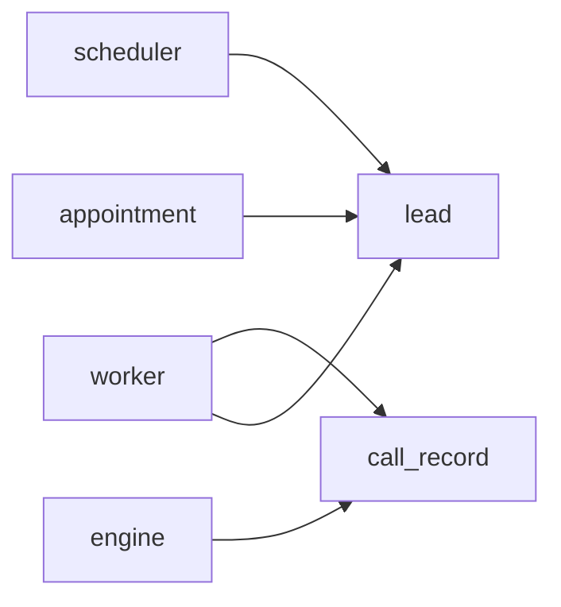

# Lead表

<cite>
**本文引用的文件**
- [openspec/specs/data-model/spec.md](file://openspec/specs/data-model/spec.md)
- [openspec/specs/retry-followup/spec.md](file://openspec/specs/retry-followup/spec.md)
- [openspec/specs/call-state-machine/spec.md](file://openspec/specs/call-state-machine/spec.md)
- [openspec/specs/transcript/spec.md](file://openspec/specs/transcript/spec.md)
- [openspec/specs/appointment/spec.md](file://openspec/specs/appointment/spec.md)
</cite>

## 目录
1. [简介](#简介)
2. [项目结构](#项目结构)
3. [核心组件](#核心组件)
4. [架构总览](#架构总览)
5. [详细组件分析](#详细组件分析)
6. [依赖分析](#依赖分析)
7. [性能考虑](#性能考虑)
8. [故障排查指南](#故障排查指南)
9. [结论](#结论)
10. [附录](#附录)

## 简介
本文件面向iSales系统的“潜在客户”数据模型，聚焦Lead表的字段定义、业务含义、状态流转与使用场景，并结合相关能力规范说明其在线索管理中的作用。Lead表归属服务为api，是调度与跟进流程的关键实体。

## 项目结构
- Lead表位于数据模型“目录视图”中，明确其关键字段与归属服务。
- Lead表与call_record存在一对多关系：一次外呼产生一条call_record，多次外呼形成多条记录。
- Lead表状态机由retry-followup规范定义，涵盖重试、跟进、勿打等业务规则。

图表来源
- [openspec/specs/data-model/spec.md:37-38](file://openspec/specs/data-model/spec.md#L37-L38)
- [openspec/specs/appointment/spec.md:12](file://openspec/specs/appointment/spec.md#L12)

章节来源
- [openspec/specs/data-model/spec.md:28-51](file://openspec/specs/data-model/spec.md#L28-L51)

## 核心组件
- 表名：lead
- 归属服务：api
- 关键字段与业务含义
  - name：潜在客户姓名
  - phone：联系电话
  - source：线索来源标识
  - custom_data(JSONB)：自定义扩展字段，承载半结构化配置或业务扩展属性
  - status：线索状态，遵循状态机规则
  - retry_count：已重试次数
  - follow_up_count：已跟进次数
  - next_call_at：下次拨打时间
  - last_hangup_cause：上次通话挂断原因

章节来源
- [openspec/specs/data-model/spec.md:37](file://openspec/specs/data-model/spec.md#L37)
- [openspec/specs/retry-followup/spec.md:160-176](file://openspec/specs/retry-followup/spec.md#L160-L176)

## 架构总览
- Lead表与call_record表通过lead_id建立一对多关系，call_record承载每次外呼的详细事件流与结果。
- Lead表状态机由retry-followup规范定义，调度器（scheduler）依据状态与next_call_at进行拨号调度，worker在通话结束后写回最终状态与下次调度时间。
- Lead表与appointment表存在业务关联：预约创建推进lead状态至appointed，预约完成推进至visited。

图表来源
- [openspec/specs/data-model/spec.md:37-40](file://openspec/specs/data-model/spec.md#L37-L40)
- [openspec/specs/appointment/spec.md:12](file://openspec/specs/appointment/spec.md#L12)

## 详细组件分析

### 字段定义与业务含义
- name：潜在客户姓名，用于展示与检索
- phone：联系方式，用于外呼与去重
- source：线索来源，便于统计与归因
- custom_data(JSONB)：半结构化扩展字段，承载业务自定义属性。其schema由具体能力规范定义，用于配置或事件流，不得替代强结构与外键关系的独立表设计
- status：线索状态，遵循状态机规则，包括new、queued、calling、retrying、following_up、completed、failed、follow_up_exhausted、do_not_call、transferred等
- retry_count：已重试次数，配合重试间隔策略使用
- follow_up_count：已跟进次数，配合跟进间隔策略使用
- next_call_at：下次拨打时间，由调度器与worker共同维护
- last_hangup_cause：上次通话挂断原因，来源于call-state-machine规范定义的枚举

章节来源
- [openspec/specs/data-model/spec.md:37](file://openspec/specs/data-model/spec.md#L37)
- [openspec/specs/retry-followup/spec.md:160-176](file://openspec/specs/retry-followup/spec.md#L160-L176)
- [openspec/specs/call-state-machine/spec.md:170-181](file://openspec/specs/call-state-machine/spec.md#L170-L181)

### JSONB字段custom_data的结构与使用
- 结构与约束
  - custom_data为JSONB类型，用于承载半结构化配置或事件流
  - 新引入的JSONB字段必须附带schema描述，并放置在对应能力规范中
  - JSONB不替代强结构与外键关系的独立表设计
- 使用方式
  - 通过能力规范定义键、值类型、必填可选等约束
  - 在API层进行校验与落库，避免在其他表的JSONB中存放应独立建模的数据
- 配置示例（示意）
  - 示例键：渠道标识、客户等级、备注、附加标签等
  - 建议在能力规范中给出JSON Schema，明确必填/可选与类型

章节来源
- [openspec/specs/data-model/spec.md:61-74](file://openspec/specs/data-model/spec.md#L61-L74)

### 与call_record表的一对多关系
- 关系说明
  - 一条lead可对应多条call_record，每次外呼产生一条记录
  - call_record包含通话事件流（transcript）、录音URL、转人工状态等
- 事件流与挂断原因
  - 挂断原因由call-state-machine规范定义的枚举统一来源，确保跨模块一致
  - worker根据hangup_cause与目标达成情况推进lead状态，并计算next_call_at

图表来源
- [openspec/specs/retry-followup/spec.md:119-159](file://openspec/specs/retry-followup/spec.md#L119-L159)
- [openspec/specs/call-state-machine/spec.md:170-181](file://openspec/specs/call-state-machine/spec.md#L170-L181)
- [openspec/specs/transcript/spec.md:120-127](file://openspec/specs/transcript/spec.md#L120-L127)

章节来源
- [openspec/specs/data-model/spec.md:37-38](file://openspec/specs/data-model/spec.md#L37-L38)
- [openspec/specs/retry-followup/spec.md:119-159](file://openspec/specs/retry-followup/spec.md#L119-L159)
- [openspec/specs/transcript/spec.md:120-127](file://openspec/specs/transcript/spec.md#L120-L127)

### 状态机与业务规则
- 状态集合与流转
  - new → queued → calling
  - 重试场景：retrying → queued
  - 重试上限：failed（终态）
  - 通话完成+达成：completed（终态）
  - 通话完成+未达：following_up → queued
  - 跟进上限：follow_up_exhausted（终态）
  - 勿打命中：do_not_call（终态）
  - 转人工触发：transferred
- 终态判定
  - 终态后调度器不再扫描该lead
- 调度与写回边界
  - 调度器仅写入“calling”，不写终态或重试/跟进状态
  - worker根据hangup_cause与目标达成写回具体状态与next_call_at

图表来源
- [openspec/specs/retry-followup/spec.md:90-112](file://openspec/specs/retry-followup/spec.md#L90-L112)

章节来源
- [openspec/specs/retry-followup/spec.md:90-112](file://openspec/specs/retry-followup/spec.md#L90-L112)

### 典型使用场景
- 导入潜在客户
  - 通过API批量创建lead，初始状态为new，next_call_at为空表示可立即调度
- 更新联系状态
  - 通话结束后worker根据hangup_cause推进状态，如retrying或following_up
- 安排回访计划
  - 跟进场景下，按follow_up_interval_days与follow_up_max_count推进
- 预约联动
  - 创建appointment推进lead至appointed，完成appointment推进至visited

章节来源
- [openspec/specs/retry-followup/spec.md:135-149](file://openspec/specs/retry-followup/spec.md#L135-L149)
- [openspec/specs/appointment/spec.md:39-72](file://openspec/specs/appointment/spec.md#L39-L72)

## 依赖分析
- 与调度器（scheduler）的耦合
  - 仅在调度成功时写入calling，其余状态由worker写回
- 与引擎（engine）与工作者（worker）的耦合
  - 通话事件流与录音由engine与worker协作产生，影响lead状态推进
- 与call_record的依赖
  - 通过hangup_cause与目标达成情况推进状态与next_call_at
- 与appointment的依赖
  - 预约创建推进appointed，完成推进visited

图表来源
- [openspec/specs/retry-followup/spec.md:119-159](file://openspec/specs/retry-followup/spec.md#L119-L159)
- [openspec/specs/appointment/spec.md:54-72](file://openspec/specs/appointment/spec.md#L54-L72)

章节来源
- [openspec/specs/retry-followup/spec.md:119-159](file://openspec/specs/retry-followup/spec.md#L119-L159)
- [openspec/specs/appointment/spec.md:54-72](file://openspec/specs/appointment/spec.md#L54-L72)

## 性能考虑
- 查询优化建议
  - 为status与next_call_at建立复合索引，加速调度器扫描
  - 为phone建立索引，便于去重与快速查找
  - custom_data字段避免频繁全文检索，必要时使用GIN索引并限制查询范围
- 写入优化建议
  - 调度器仅写入calling，减少冲突与锁竞争
  - worker批量写回状态与next_call_at，降低IO压力

## 故障排查指南
- 状态未推进
  - 检查worker是否正确根据hangup_cause与目标达成写回状态
  - 核对call-state-machine规范中的挂断原因枚举是否一致
- next_call_at异常
  - 确认重试/跟进间隔策略配置与retry_max_count/follow_up_max_count
  - 检查调度器仅在窗外重排时写入next_call_at的规则
- 预约状态未联动
  - 确认appointment创建与完成事务中对lead状态的推进逻辑

章节来源
- [openspec/specs/retry-followup/spec.md:140-159](file://openspec/specs/retry-followup/spec.md#L140-L159)
- [openspec/specs/call-state-machine/spec.md:170-181](file://openspec/specs/call-state-machine/spec.md#L170-L181)
- [openspec/specs/appointment/spec.md:39-72](file://openspec/specs/appointment/spec.md#L39-L72)

## 结论
Lead表作为线索管理的核心实体，通过明确的字段定义、严格的JSONB约束与清晰的状态机规则，支撑调度、重试、跟进与勿打识别等关键业务流程。其与call_record、appointment等表的协作，形成了完整的外呼与转化闭环。在实现层面，应严格遵循数据模型与能力规范，确保跨服务一致性与可维护性。

## 附录
- 数据验证规则
  - JSONB字段需附schema描述，遵循“不替代关系建模”的原则
  - 挂断原因统一来源于call-state-machine规范的枚举
- 索引策略
  - 建议对status、next_call_at、phone建立索引，保障调度与查询性能
- 相关规范交叉引用
  - retry-followup：重试/跟进策略与状态机
  - call-state-machine：挂断原因与状态转换
  - transcript：通话事件流与录音存储
  - appointment：预约与lead状态联动

章节来源
- [openspec/specs/data-model/spec.md:61-74](file://openspec/specs/data-model/spec.md#L61-L74)
- [openspec/specs/retry-followup/spec.md:90-112](file://openspec/specs/retry-followup/spec.md#L90-L112)
- [openspec/specs/call-state-machine/spec.md:170-181](file://openspec/specs/call-state-machine/spec.md#L170-L181)
- [openspec/specs/transcript/spec.md:120-127](file://openspec/specs/transcript/spec.md#L120-L127)
- [openspec/specs/appointment/spec.md:39-72](file://openspec/specs/appointment/spec.md#L39-L72)