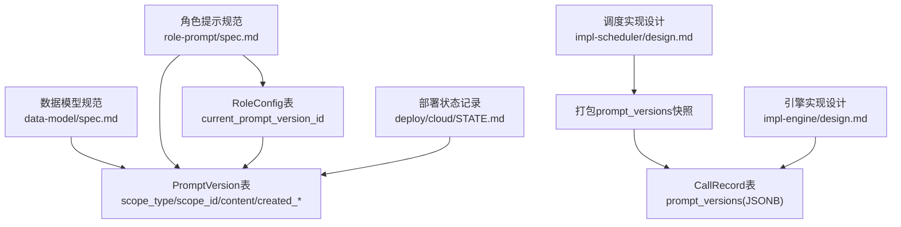
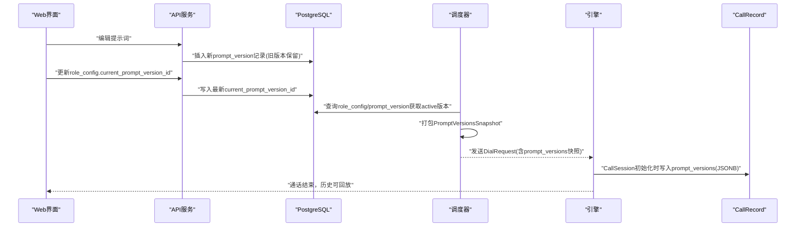
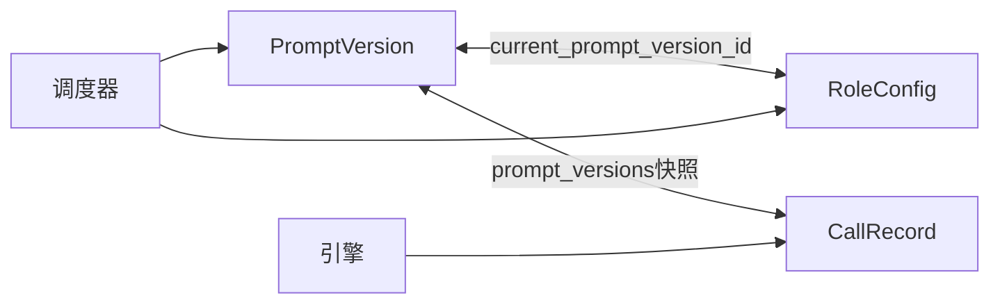

# PromptVersion表

<cite>
**本文引用的文件**
- [openspec/specs/data-model/spec.md](file://openspec/specs/data-model/spec.md)
- [openspec/specs/role-prompt/spec.md](file://openspec/specs/role-prompt/spec.md)
- [openspec/changes/archive/2026-05-01-init-isales-common/tasks.md](file://openspec/changes/archive/2026-05-01-init-isales-common/tasks.md)
- [openspec/changes/archive/2026-05-01-init-isales-common/design.md](file://openspec/changes/archive/2026-05-01-init-isales-common/design.md)
- [openspec/changes/archive/2026-05-06-impl-scheduler/design.md](file://openspec/changes/archive/2026-05-06-impl-scheduler/design.md)
- [openspec/changes/archive/2026-05-07-impl-engine/design.md](file://openspec/changes/archive/2026-05-07-impl-engine/design.md)
- [deploy/cloud/STATE.md](file://deploy/cloud/STATE.md)
</cite>

## 目录
1. [简介](#简介)
2. [项目结构](#项目结构)
3. [核心组件](#核心组件)
4. [架构总览](#架构总览)
5. [详细组件分析](#详细组件分析)
6. [依赖分析](#依赖分析)
7. [性能考虑](#性能考虑)
8. [故障排查指南](#故障排查指南)
9. [结论](#结论)
10. [附录](#附录)

## 简介
PromptVersion表是iSales系统中用于提示词版本管理的核心数据表，归属服务为api。它记录了角色(role)、裁判(judge)、润色(polish)三类提示词的历史版本，配合role_config.current_prompt_version_id实现“当前生效版本”的精确指向，并在通话开始时固化到call_record.prompt_versions中，确保历史通话可回放、可审计、可复现。

## 项目结构
围绕PromptVersion表的关键文件与职责如下：
- 数据模型清单与归属：openspec/specs/data-model/spec.md明确列出prompt_version表及归属服务
- 版本管理策略与使用场景：openspec/specs/role-prompt/spec.md定义版本控制、快照写入与调试回放机制
- 模型实现与批次依赖：openspec/changes/archive/2026-05-01-init-isales-common/tasks.md与design.md给出isales-common中prompt.py与role_config.py的实现计划与依赖顺序
- 快照打包与派发：openspec/changes/archive/2026-05-06-impl-scheduler/design.md描述DialRequest构建时的prompt_versions快照生成
- 通话初始化与固化：openspec/changes/archive/2026-05-07-impl-engine/design.md说明CallSession初始化时写入call_record.prompt_versions
- 运行时变更示例：deploy/cloud/STATE.md展示对prompt_version.content的运行时修正（无迁移）

**图表来源**
- [openspec/specs/data-model/spec.md:35](file://openspec/specs/data-model/spec.md#L35)
- [openspec/specs/role-prompt/spec.md:234](file://openspec/specs/role-prompt/spec.md#L234)
- [openspec/changes/archive/2026-05-06-impl-scheduler/design.md:121](file://openspec/changes/archive/2026-05-06-impl-scheduler/design.md#L121)
- [openspec/changes/archive/2026-05-07-impl-engine/design.md:22](file://openspec/changes/archive/2026-05-07-impl-engine/design.md#L22)
- [deploy/cloud/STATE.md:436](file://deploy/cloud/STATE.md#L436)

**章节来源**
- [openspec/specs/data-model/spec.md:28-35](file://openspec/specs/data-model/spec.md#L28-L35)
- [openspec/specs/role-prompt/spec.md:230-238](file://openspec/specs/role-prompt/spec.md#L230-L238)
- [openspec/changes/archive/2026-05-01-init-isales-common/tasks.md:32](file://openspec/changes/archive/2026-05-01-init-isales-common/tasks.md#L32)
- [openspec/changes/archive/2026-05-01-init-isales-common/design.md:47-52](file://openspec/changes/archive/2026-05-01-init-isales-common/design.md#L47-L52)
- [openspec/changes/archive/2026-05-06-impl-scheduler/design.md:121-125](file://openspec/changes/archive/2026-05-06-impl-scheduler/design.md#L121-L125)
- [openspec/changes/archive/2026-05-07-impl-engine/design.md:22-62](file://openspec/changes/archive/2026-05-07-impl-engine/design.md#L22-L62)
- [deploy/cloud/STATE.md:436-440](file://deploy/cloud/STATE.md#L436-L440)

## 核心组件
- PromptVersion表
  - scope_type：作用域类型，取值为role/judge/polish
  - scope_id：作用域ID，与scope_type共同构成“在哪个业务对象上”的定位
  - content：提示词内容（文本）
  - created_at：创建时间
  - created_by：创建人标识
  - is_active：是否激活（用于快速禁用而不删除）
- RoleConfig表
  - current_prompt_version_id：指向当前生效的prompt_version记录
- CallRecord表
  - prompt_versions(JSONB)：通话开始时的prompt版本快照，包含各角色/裁判/润色的版本引用及wrap_up_appended标记

**章节来源**
- [openspec/specs/data-model/spec.md:35](file://openspec/specs/data-model/spec.md#L35)
- [openspec/specs/role-prompt/spec.md:234](file://openspec/specs/role-prompt/spec.md#L234)
- [openspec/specs/role-prompt/spec.md:150-170](file://openspec/specs/role-prompt/spec.md#L150-L170)

## 架构总览
PromptVersion在系统中的作用链路：
- 编辑提示词时自动创建新版本，旧版本保留
- 通过role_config.current_prompt_version_id切换当前生效版本
- 调度阶段打包prompt_versions快照，随拨号请求下发
- 引擎初始化时将快照固化到call_record.prompt_versions
- 历史通话可通过prompt_version_id精准复现当时prompt

**图表来源**
- [openspec/specs/role-prompt/spec.md:154-170](file://openspec/specs/role-prompt/spec.md#L154-L170)
- [openspec/changes/archive/2026-05-06-impl-scheduler/design.md:121-125](file://openspec/changes/archive/2026-05-06-impl-scheduler/design.md#L121-L125)
- [openspec/changes/archive/2026-05-07-impl-engine/design.md:22-62](file://openspec/changes/archive/2026-05-07-impl-engine/design.md#L22-L62)

## 详细组件分析

### PromptVersion表字段与业务含义
- scope_type
  - 类型：枚举，取值role/judge/polish
  - 含义：指示该版本所属的提示词类型（角色/裁判/润色）
- scope_id
  - 类型：整数或业务ID
  - 含义：与scope_type共同定位“在哪个业务对象上”（如某个campaign下的role_config）
- content
  - 类型：文本
  - 含义：提示词正文内容
- created_at
  - 类型：时间戳
  - 含义：记录创建时间
- created_by
  - 类型：文本
  - 含义：创建人标识（通常来自JWT sub）
- is_active
  - 类型：布尔
  - 含义：是否激活；用于快速禁用而不删除

**章节来源**
- [openspec/specs/data-model/spec.md:35](file://openspec/specs/data-model/spec.md#L35)
- [openspec/specs/role-prompt/spec.md:234](file://openspec/specs/role-prompt/spec.md#L234)

### scope_type与scope_id的组合使用
- 组合策略
  - scope_type + scope_id唯一确定一个“作用域”，即“在哪个业务对象上”的提示词版本
  - 不同作用域可并行维护多套版本，互不影响
- 典型作用域
  - campaign：在某个活动(campaign)下，针对不同角色/裁判/润色分别维护版本
  - role_config：在某个角色配置下维护版本（与role_config.current_prompt_version_id形成直接关联）
- 版本管理策略
  - 同一scope内可有多条历史版本，仅一条处于is_active=true
  - 切换生效版本通过更新role_config.current_prompt_version_id完成

**章节来源**
- [openspec/specs/role-prompt/spec.md:150-170](file://openspec/specs/role-prompt/spec.md#L150-L170)

### 与RoleConfig的关联关系
- 关联方式
  - role_config.current_prompt_version_id指向prompt_version.id
- 作用机制
  - 当需要切换当前生效版本时，仅更新role_config.current_prompt_version_id即可
  - 旧版本保留，便于审计与回溯
- 业务意义
  - 保证提示词变更的可追溯性与可控性，避免误操作影响线上流量

**章节来源**
- [openspec/specs/data-model/spec.md:34](file://openspec/specs/data-model/spec.md#L34)
- [openspec/specs/role-prompt/spec.md:235](file://openspec/specs/role-prompt/spec.md#L235)

### 通话开始时的prompt_versions快照
- 快照内容
  - 包含各角色/裁判/润色的role_config_id与prompt_version_id映射
  - 包含wrap_up_appended标记，用于区分是否追加了收尾指令
- 写入时机
  - 引擎在CallSession初始化时一次性写入call_record.prompt_versions
- 价值
  - 历史通话可按当时版本精准复现prompt，便于调试与审计

**章节来源**
- [openspec/specs/role-prompt/spec.md:159-170](file://openspec/specs/role-prompt/spec.md#L159-L170)
- [openspec/changes/archive/2026-05-07-impl-engine/design.md:22-62](file://openspec/changes/archive/2026-05-07-impl-engine/design.md#L22-L62)

### 典型使用场景
- 创建提示词版本
  - 场景：编辑角色/裁判/润色提示词
  - 流程：系统自动创建新prompt_version记录，旧版本保留；用户决定启用新版本时更新role_config.current_prompt_version_id
- 切换活动版本
  - 场景：希望立即切换到新版本而不影响历史通话
  - 流程：更新role_config.current_prompt_version_id，后续新通话使用新版本
- 管理版本历史
  - 场景：需要回看某次通话使用的是哪版提示词
  - 流程：通过call_record.prompt_versions中的版本ID查询prompt_version，还原当时prompt

**章节来源**
- [openspec/specs/role-prompt/spec.md:154-170](file://openspec/specs/role-prompt/spec.md#L154-L170)

### 数据验证规则与约束
- 字段约束
  - scope_type限定为role/judge/polish之一
  - scope_id与scope_type共同定位作用域
  - content为必填文本
  - created_at/created_by为必填
  - is_active为布尔，用于快速禁用
- 业务约束
  - 同一作用域下仅允许一条有效版本（is_active=true）
  - 通过role_config.current_prompt_version_id实现“当前生效版本”的唯一指向
- JSONB字段
  - prompt_versions为JSONB，承载快照结构，需遵循role-prompt规范中的键名与结构

**章节来源**
- [openspec/specs/role-prompt/spec.md:234](file://openspec/specs/role-prompt/spec.md#L234)
- [openspec/specs/role-prompt/spec.md:159-170](file://openspec/specs/role-prompt/spec.md#L159-L170)

### 版本控制策略与最佳实践
- 策略
  - “编辑即新建版本”：每次编辑提示词均创建新版本，旧版本保留
  - “显式切换生效版本”：通过更新role_config.current_prompt_version_id切换生效版本
  - “快照固化”：通话开始时将版本快照写入call_record，确保历史可复现
- 最佳实践
  - 为提示词变更设置审批流程，减少误切生效版本
  - 对关键提示词建立灰度发布策略，逐步扩大生效范围
  - 定期清理长期未使用的旧版本，降低存储与查询开销
  - 在回放/审计场景中，优先使用prompt_versions快照而非实时查询，避免状态漂移

**章节来源**
- [openspec/specs/role-prompt/spec.md:150-170](file://openspec/specs/role-prompt/spec.md#L150-L170)

## 依赖分析
PromptVersion与上下游模块的依赖关系：
- 与RoleConfig：通过current_prompt_version_id关联，形成“当前生效版本”的指向
- 与CallRecord：通过prompt_versions(JSONB)快照关联，形成“通话时点版本”的固化
- 与调度器：在派发拨号请求时，调度器查询role_config/prompt_version生成快照
- 与引擎：引擎在初始化时将快照写入call_record，确保版本不可变

**图表来源**
- [openspec/specs/data-model/spec.md:34-35](file://openspec/specs/data-model/spec.md#L34-L35)
- [openspec/specs/role-prompt/spec.md:159-170](file://openspec/specs/role-prompt/spec.md#L159-L170)
- [openspec/changes/archive/2026-05-06-impl-scheduler/design.md:121-125](file://openspec/changes/archive/2026-05-06-impl-scheduler/design.md#L121-L125)
- [openspec/changes/archive/2026-05-07-impl-engine/design.md:22-62](file://openspec/changes/archive/2026-05-07-impl-engine/design.md#L22-L62)

**章节来源**
- [openspec/specs/data-model/spec.md:34-35](file://openspec/specs/data-model/spec.md#L34-L35)
- [openspec/specs/role-prompt/spec.md:159-170](file://openspec/specs/role-prompt/spec.md#L159-L170)
- [openspec/changes/archive/2026-05-06-impl-scheduler/design.md:121-125](file://openspec/changes/archive/2026-05-06-impl-scheduler/design.md#L121-L125)
- [openspec/changes/archive/2026-05-07-impl-engine/design.md:22-62](file://openspec/changes/archive/2026-05-07-impl-engine/design.md#L22-L62)

## 性能考虑
- 查询路径优化
  - 为scope_type/scope_id建立复合索引，加速“当前生效版本”查询
  - 为is_active建立索引，提升筛选活跃版本的效率
- 写入路径优化
  - 编辑提示词时采用批量写入，减少事务次数
  - 快照写入call_record为一次性写入，避免多次往返
- 历史版本管理
  - 定期归档长期未使用的历史版本，减少主表膨胀
  - 对频繁回放的场景，缓存常用prompt_versions快照

## 故障排查指南
- 现象：通话使用了错误版本的提示词
  - 排查要点：检查call_record.prompt_versions中的版本ID是否正确；核对对应prompt_version.content是否符合预期
  - 参考：运行时修正示例展示了对prompt_version.content的直接更新（无迁移）
- 现象：切换生效版本后新通话未生效
  - 排查要点：确认role_config.current_prompt_version_id已更新；检查调度器是否重新打包了prompt_versions快照
- 现象：历史回放结果与预期不符
  - 排查要点：确认prompt_versions快照中wrap_up_appended标记是否正确；核对prompt_version是否被意外禁用(is_active=false)

**章节来源**
- [deploy/cloud/STATE.md:436-440](file://deploy/cloud/STATE.md#L436-L440)
- [openspec/specs/role-prompt/spec.md:159-170](file://openspec/specs/role-prompt/spec.md#L159-L170)

## 结论
PromptVersion表通过“作用域+版本”的双维度建模，实现了提示词的精细化版本控制与可追溯管理。结合role_config.current_prompt_version_id与call_record.prompt_versions快照，系统在保证线上稳定性的同时，提供了强大的审计与回放能力。遵循“编辑即新建版本、显式切换生效版本、快照固化”的策略，可有效降低提示词变更带来的风险。

## 附录
- 相关文件与职责
  - 数据模型清单与归属：openspec/specs/data-model/spec.md
  - 版本管理策略与使用场景：openspec/specs/role-prompt/spec.md
  - 模型实现与批次依赖：openspec/changes/archive/2026-05-01-init-isales-common/tasks.md、design.md
  - 快照打包与派发：openspec/changes/archive/2026-05-06-impl-scheduler/design.md
  - 通话初始化与固化：openspec/changes/archive/2026-05-07-impl-engine/design.md
  - 运行时变更示例：deploy/cloud/STATE.md