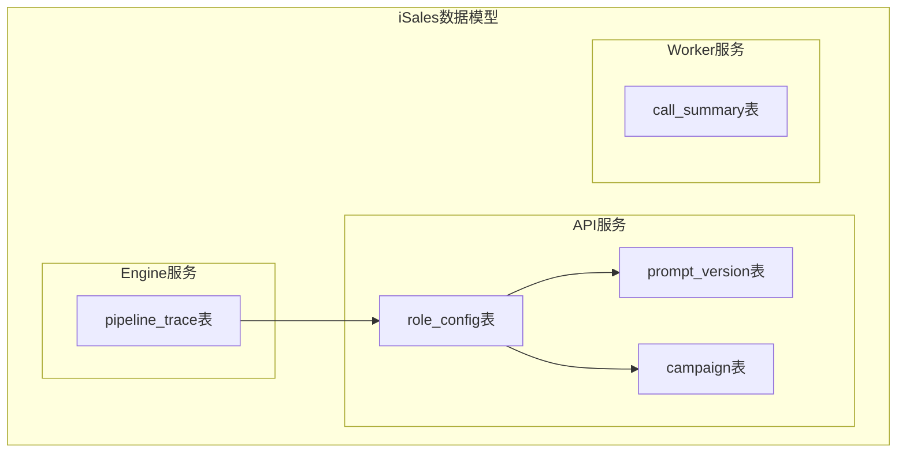
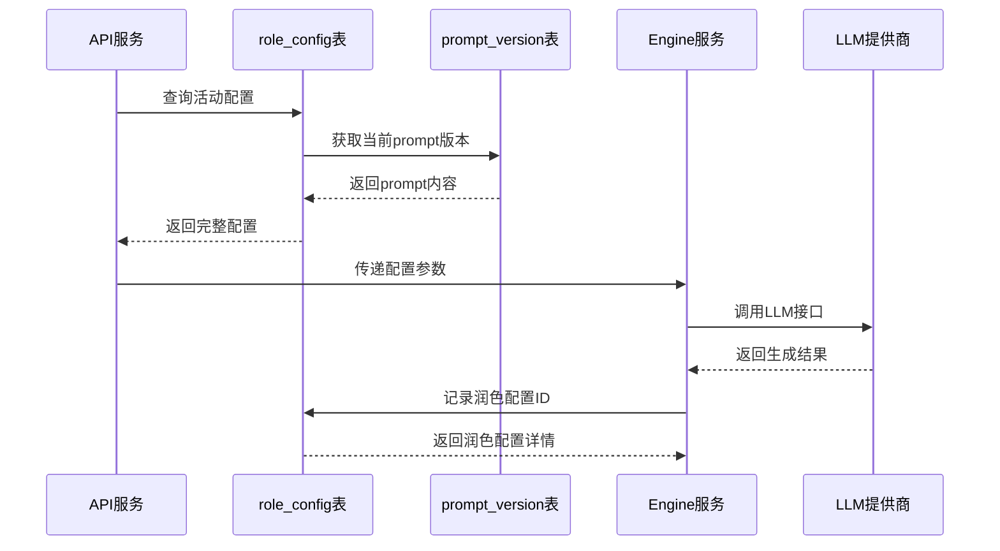
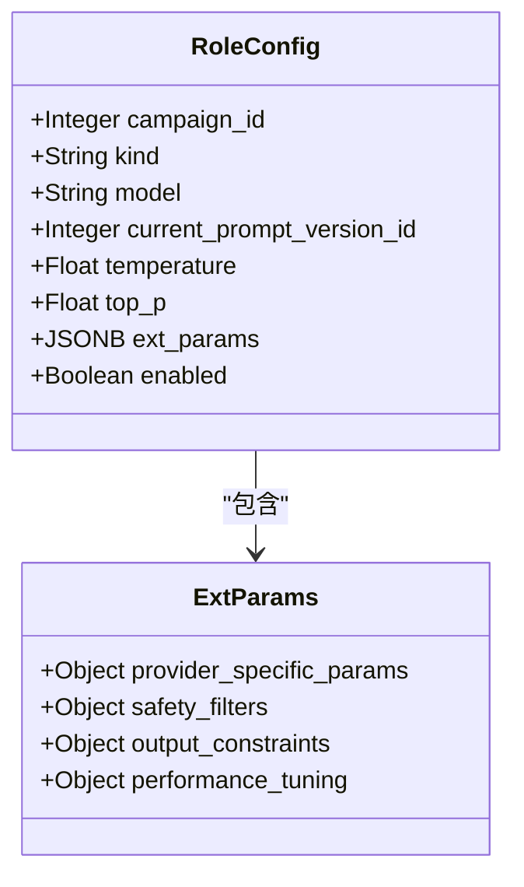
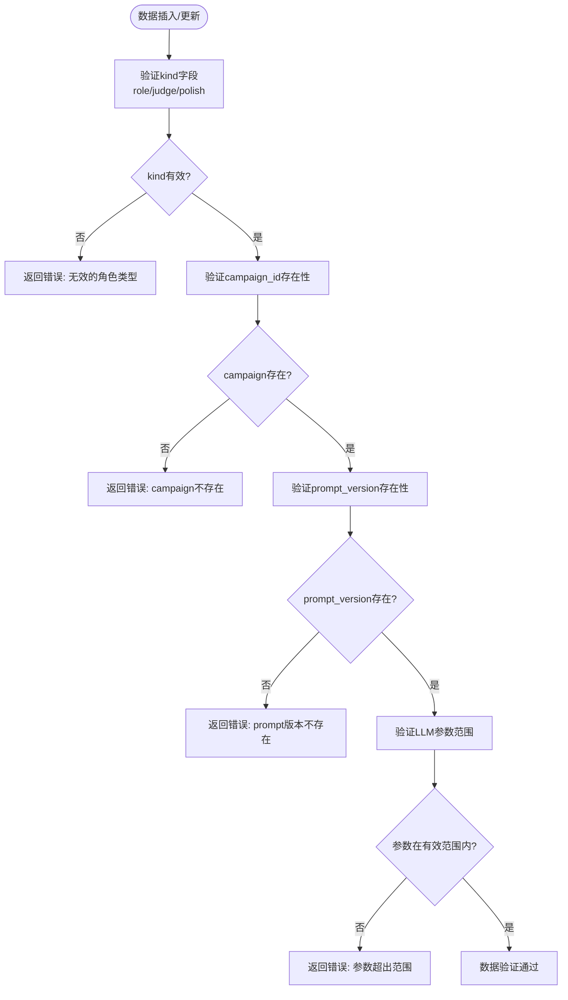
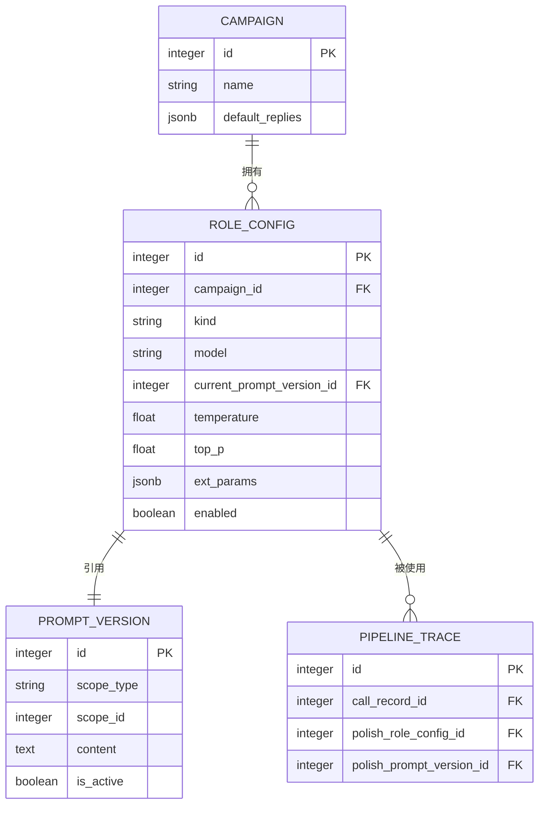

# RoleConfig表

<cite>
**本文档引用的文件**
- [data-model/spec.md](file://openspec/specs/data-model/spec.md)
- [role-prompt/spec.md](file://openspec/specs/role-prompt/spec.md)
- [ai-pipeline/spec.md](file://openspec/specs/ai-pipeline/spec.md)
- [init-isales-common/tasks.md](file://openspec/changes/archive/2026-05-01-init-isales-common/tasks.md)
</cite>

## 目录
1. [简介](#简介)
2. [项目结构](#项目结构)
3. [核心组件](#核心组件)
4. [架构概览](#架构概览)
5. [详细组件分析](#详细组件分析)
6. [依赖关系分析](#依赖关系分析)
7. [性能考虑](#性能考虑)
8. [故障排除指南](#故障排除指南)
9. [结论](#结论)

## 简介

RoleConfig表是iSales系统中AI角色配置管理的核心数据表，负责存储和管理AI角色、裁判和润色三个层级的LLM配置参数。该表属于API服务，为整个AI对话管道提供基础配置支撑。

根据OpenSpec规范，RoleConfig表在数据模型中扮演着关键角色，它不仅存储LLM调用的基本参数，还通过JSONB字段ext_params提供了灵活的扩展配置能力，使得系统能够适应各种复杂的业务场景需求。

## 项目结构

RoleConfig表作为数据模型的一部分，位于iSales系统的统一数据架构中：

**图表来源**
- [data-model/spec.md:34](file://openspec/specs/data-model/spec.md#L34)
- [data-model/spec.md:35](file://openspec/specs/data-model/spec.md#L35)

**章节来源**
- [data-model/spec.md:28-51](file://openspec/specs/data-model/spec.md#L28-L51)

## 核心组件

RoleConfig表包含以下关键字段：

### 基础字段

| 字段名 | 数据类型 | 业务含义 | 约束条件 |
|--------|----------|----------|----------|
| campaign_id | INTEGER | 关联的活动ID | NOT NULL, 外键指向campaign表 |
| kind | ENUM | 角色类型 | NOT NULL, 值域: role/judge/polish |
| model | TEXT | LLM提供商标识 | NOT NULL |
| current_prompt_version_id | INTEGER | 当前生效的prompt版本ID | 外键指向prompt_version表 |

### LLM参数字段

| 字段名 | 数据类型 | 业务含义 | 默认值 | 有效范围 |
|--------|----------|----------|--------|----------|
| temperature | FLOAT | 采样温度系数 | 0.7 | 0.0-2.0 |
| top_p | FLOAT | 核采样概率阈值 | 0.9 | 0.0-1.0 |
| enabled | BOOLEAN | 是否启用该配置 | TRUE | 布尔值 |

### 扩展配置字段

| 字段名 | 数据类型 | 业务含义 | 结构特点 |
|--------|----------|----------|----------|
| ext_params | JSONB | 扩展配置参数 | 半结构化, 可动态扩展 |

**章节来源**
- [data-model/spec.md:34](file://openspec/specs/data-model/spec.md#L34)

## 架构概览

RoleConfig表在整个iSales系统架构中发挥着承上启下的关键作用：

**图表来源**
- [role-prompt/spec.md:150-176](file://openspec/specs/role-prompt/spec.md#L150-L176)
- [ai-pipeline/spec.md:159-166](file://openspec/specs/ai-pipeline/spec.md#L159-L166)

**章节来源**
- [role-prompt/spec.md:150-176](file://openspec/specs/role-prompt/spec.md#L150-L176)
- [ai-pipeline/spec.md:159-166](file://openspec/specs/ai-pipeline/spec.md#L159-L166)

## 详细组件分析

### 角色类型配置差异

RoleConfig表支持三种不同的角色类型，每种类型都有其特定的配置要求：

#### 角色(LM)配置
- **用途**: 生成候选回复的主要AI角色
- **特点**: 并行产生多个候选回复，供裁判评估
- **参数重点**: temperature和top_p直接影响创意性和多样性

#### 裁判(Judge)配置  
- **用途**: 评估和筛选候选回复的质量
- **特点**: 对候选回复进行质量审查和合规性检查
- **参数重点**: 更注重稳定性和准确性

#### 润色(Polish)配置
- **用途**: 将候选回复改写为更自然、拟人化的最终输出
- **特点**: 专注于语言表达的优化和改进
- **参数重点**: 平衡创意性和语言质量

### JSONB扩展参数(ext_params)设计

ext_params字段采用JSONB数据类型，提供了强大的扩展配置能力：

**图表来源**
- [data-model/spec.md:34](file://openspec/specs/data-model/spec.md#L34)

#### 扩展参数配置示例

| 参数类别 | 示例键名 | 数据类型 | 用途说明 |
|----------|----------|----------|----------|
| Provider特定 | max_tokens | Integer | LLM最大生成长度限制 |
| Safety过滤 | prohibited_keywords | Array | 禁止词汇列表 |
| Output约束 | response_format | String | 输出格式要求(json/text) |
| 性能调优 | timeout_ms | Integer | 请求超时时间(ms) |

**章节来源**
- [data-model/spec.md:61-74](file://openspec/specs/data-model/spec.md#L61-L74)

### 数据验证规则

RoleConfig表遵循严格的验证规则确保数据一致性：

**图表来源**
- [data-model/spec.md:61-74](file://openspec/specs/data-model/spec.md#L61-L74)

**章节来源**
- [data-model/spec.md:61-74](file://openspec/specs/data-model/spec.md#L61-L74)

## 依赖关系分析

RoleConfig表与其他核心表存在密切的依赖关系：

**图表来源**
- [data-model/spec.md:30](file://openspec/specs/data-model/spec.md#L30)
- [data-model/spec.md:34](file://openspec/specs/data-model/spec.md#L34)
- [data-model/spec.md:35](file://openspec/specs/data-model/spec.md#L35)

### 关联关系详解

1. **与Campaign表的关系**: 一对多关系，每个活动可以配置多个角色配置
2. **与PromptVersion表的关系**: 多对一关系，指向当前生效的prompt版本
3. **与PipelineTrace表的关系**: 多对一关系，记录润色阶段使用的配置

**章节来源**
- [data-model/spec.md:30-35](file://openspec/specs/data-model/spec.md#L30-L35)

## 性能考虑

### 索引策略建议

为了优化RoleConfig表的查询性能，建议建立以下索引：

| 索引类型 | 字段组合 | 用途 | 性能收益 |
|----------|----------|------|----------|
| 主键索引 | id | 唯一标识符 | O(log n)查找 |
| 复合索引 | (campaign_id, kind) | 活动角色查询 | 高效的角色类型筛选 |
| 复合索引 | (current_prompt_version_id) | prompt版本关联 | 快速prompt内容获取 |
| 复合索引 | (enabled, campaign_id) | 启用状态查询 | 快速启用配置检索 |

### 查询优化建议

1. **批量查询优化**: 对于活动级别的配置查询，使用IN子句批量获取
2. **缓存策略**: 对常用的配置进行内存缓存，减少数据库访问
3. **分页查询**: 对于大量配置的场景，使用LIMIT和OFFSET进行分页

## 故障排除指南

### 常见问题及解决方案

#### 问题1: 角色配置不生效
**症状**: 新配置更新后，通话中仍然使用旧配置
**原因**: current_prompt_version_id未正确更新
**解决方案**: 确保在prompt版本更新后同步更新current_prompt_version_id

#### 问题2: LLM调用失败
**症状**: 角色LLM调用超时或返回错误
**原因**: ext_params配置不当或LLM参数超出范围
**解决方案**: 检查ext_params中的timeout_ms设置和LLM参数的有效性

#### 问题3: 配置冲突
**症状**: 多个角色配置同时生效导致冲突
**原因**: 未正确设置enabled字段
**解决方案**: 确保同一活动下只有一个enabled=true的配置

**章节来源**
- [role-prompt/spec.md:131-149](file://openspec/specs/role-prompt/spec.md#L131-L149)

## 结论

RoleConfig表作为iSales系统AI角色配置管理的核心组件，通过精心设计的字段结构和灵活的扩展机制，为整个AI对话管道提供了强大的配置支撑。其基于OpenSpec规范的设计确保了数据模型的一致性和可维护性。

通过合理利用ext_params字段的扩展能力，系统能够适应各种复杂的业务场景需求，同时通过严格的验证规则和索引策略确保了数据的完整性和查询性能。对于API服务而言，RoleConfig表不仅是技术实现的基础，更是业务逻辑的重要载体。

在未来的发展中，RoleConfig表将继续发挥关键作用，为iSales系统的AI能力提供持续的配置支持和优化空间。