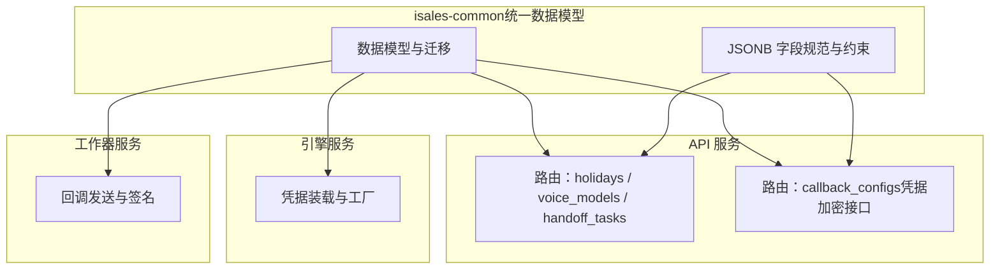
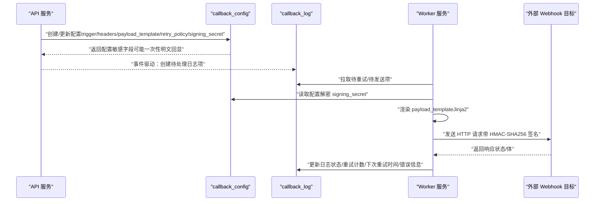
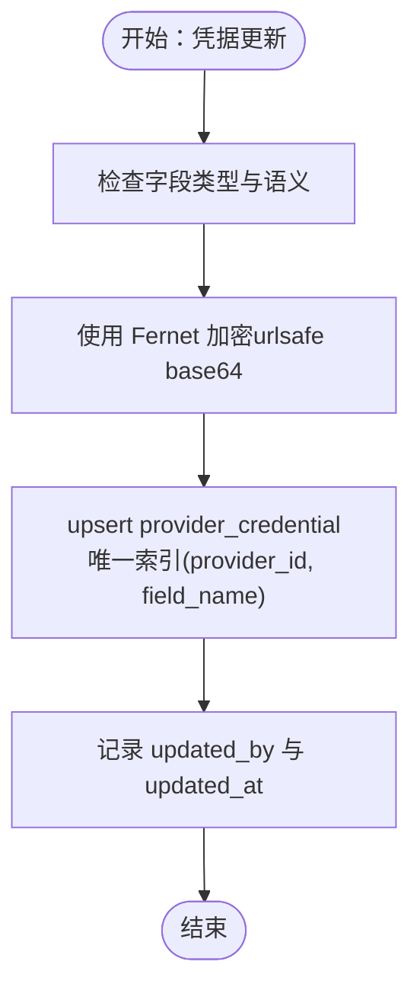
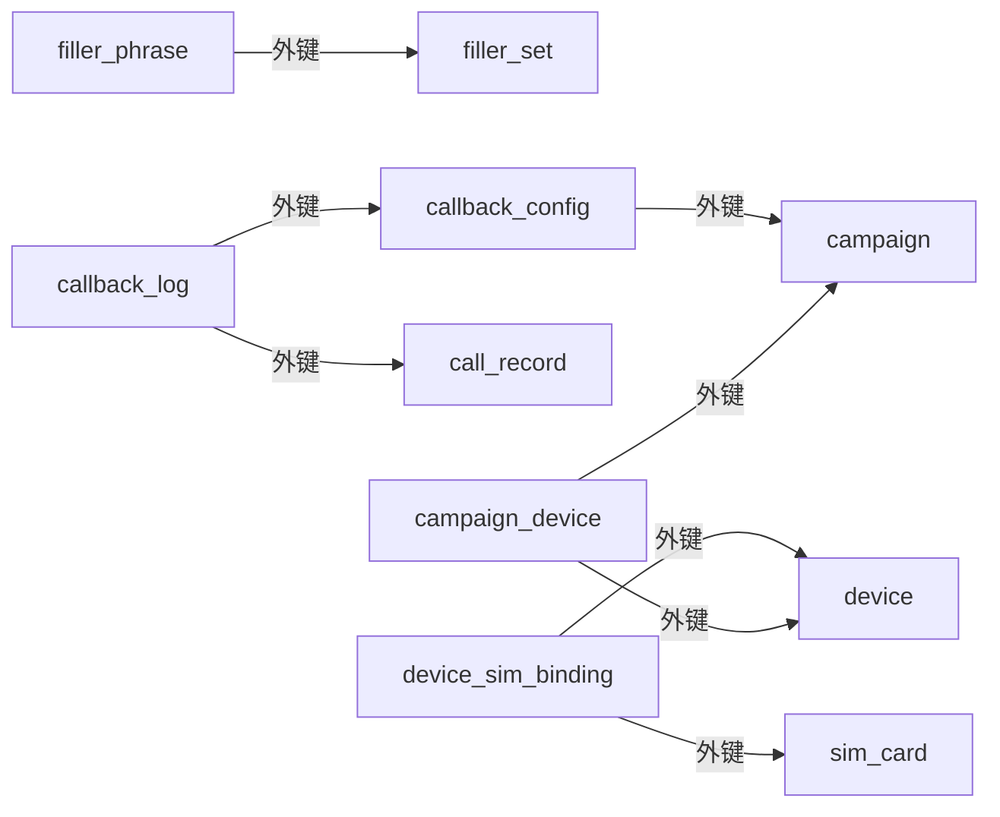

# 其他核心表

<cite>
**本文引用的文件**
- [openspec/specs/data-model/spec.md](file://openspec/specs/data-model/spec.md)
- [openspec/specs/webhook-callback/spec.md](file://openspec/specs/webhook-callback/spec.md)
- [openspec/specs/provider-credential/spec.md](file://openspec/specs/provider-credential/spec.md)
- [openspec/changes/archive/2026-05-01-init-isales-common/tasks.md](file://openspec/changes/archive/2026-05-01-init-isales-common/tasks.md)
- [openspec/changes/archive/2026-05-24-impl-provider-credential-db-ssot/tasks.md](file://openspec/changes/archive/2026-05-24-impl-provider-credential-db-ssot/tasks.md)
- [openspec/changes/archive/2026-05-24-impl-provider-credential-db-ssot/acceptance.md](file://openspec/changes/archive/2026-05-24-impl-provider-credential-db-ssot/acceptance.md)
- [openspec/changes/archive/2026-05-06-impl-api/tasks.md](file://openspec/changes/archive/2026-05-06-impl-api/tasks.md)
</cite>

## 目录
1. [简介](#简介)
2. [项目结构](#项目结构)
3. [核心组件](#核心组件)
4. [架构总览](#架构总览)
5. [详细组件分析](#详细组件分析)
6. [依赖分析](#依赖分析)
7. [性能考虑](#性能考虑)
8. [故障排查指南](#故障排查指南)
9. [结论](#结论)
10. [附录](#附录)

## 简介
本文件面向 iSales 系统中的“其他核心表”，围绕 openspec/specs/data-model/spec.md 中列出的 holiday、agent、handoff_task、voice_model、filler_set、filler_phrase、callback_config、callback_log、sim_card、device_sim_binding、campaign_device、provider_credential 等表，给出字段语义、业务归属、JSONB 结构与使用方式、表间关系、数据流与业务逻辑、典型使用场景与操作示例、数据校验规则、索引策略与性能优化建议。目标是帮助开发者与运维人员快速理解这些辅助性核心表的设计意图与运行机制。

## 项目结构
- 数据模型由 isales-common 统一管理，其他服务通过依赖该包间接访问数据库。
- 表的归属服务决定了 schema 演进与主责权，多服务可读写但归属唯一。
- JSONB 字段用于半结构化配置或事件流，需配套 capability 规范提供 JSON Schema 描述。



章节来源
- [openspec/specs/data-model/spec.md:19-21](file://openspec/specs/data-model/spec.md#L19-L21)
- [openspec/specs/data-model/spec.md:52-54](file://openspec/specs/data-model/spec.md#L52-L54)
- [openspec/specs/data-model/spec.md:61-74](file://openspec/specs/data-model/spec.md#L61-L74)

## 核心组件
- holiday：节假日管理，支持按地区维护日期、名称。
- agent：坐席管理，记录登录账号与在线状态。
- handoff_task：转人工任务管理，记录触发来源、分配与完成状态。
- voice_model：语音模型元数据，提供供应商、标识与示例音频。
- filler_set / filler_phrase：填充短语集合与条目，支撑通话中的自然停顿与过渡。
- callback_config / callback_log：Webhook 回调配置与执行日志，含触发条件、请求模板、重试策略与签名。
- sim_card：SIM 卡信息与状态，承载运营商、余额、信号强度等。
- device_sim_binding：设备与 SIM 的绑定关系与生命周期。
- campaign_device：活动与设备的绑定关系。
- provider_credential：凭据集中存储与轮换，支持 webhook 回调签名密钥的加密存储。

章节来源
- [openspec/specs/data-model/spec.md:28-50](file://openspec/specs/data-model/spec.md#L28-L50)

## 架构总览
下图展示“其他核心表”在系统中的角色与交互关系，以及 JSONB 字段在回调配置中的关键作用。

```mermaid
erDiagram
HOLIDAY {
date date PK
string name
string region
}
AGENT {
uuid id PK
string name
string login_user
enum status
}
HANDOFF_TASK {
uuid id PK
uuid call_record_id
uuid agent_id
enum trigger_type
jsonb trigger_detail
enum status
timestamp created_at
timestamp picked_up_at
timestamp completed_at
}
VOICE_MODEL {
uuid id PK
string name
string provider
string voice_id
string sample_url
}
FILLER_SET {
uuid id PK
uuid campaign_id
string name
int sort_order
}
FILLER_PHRASE {
uuid id PK
uuid filler_set_id FK
string phrase
string audio_url
enum generation_status
}
CALLBACK_CONFIG {
uuid id PK
uuid campaign_id
string name
jsonb trigger
string url
enum method
jsonb headers
text payload_template
jsonb retry_policy
text signing_secret
int timeout_seconds
boolean enabled
}
CALLBACK_LOG {
uuid id PK
uuid callback_config_id FK
uuid call_record_id FK
enum status
jsonb request_body
int response_code
text response_body
int retry_count
timestamp attempt_at
timestamp next_retry_at
text error_message
}
SIM_CARD {
uuid id PK
string iccid
string imsi
string phone_number
string carrier
string plan
decimal balance
int signal_strength
enum status
timestamp last_checked_at
}
DEVICE_SIM_BINDING {
uuid id PK
uuid device_id FK
uuid sim_card_id FK
boolean is_active
timestamp bind_at
timestamp unbind_at
}
CAMPAIGN_DEVICE {
uuid id PK
uuid campaign_id FK
uuid device_id FK
}
PROVIDER_CREDENTIAL {
uuid id PK
string provider_id
string field_name
text cipher_text
string updated_by
timestamp updated_at
unique(provider_id, field_name)
}
HOLIDAY ||--o{ HANDOFF_TASK : "节假日不打扰"
AGENT ||--o{ HANDOFF_TASK : "分配人工"
VOICE_MODEL ||--o{ FILLER_PHRASE : "填充短语依赖"
FILLER_SET ||--o{ FILLER_PHRASE : "集合包含条目"
CAMPAIGN_DEVICE ||--o{ SIM_CARD : "活动绑定设备"
DEVICE_SIM_BINDING ||--|| SIM_CARD : "绑定到卡"
DEVICE_SIM_BINDING ||--|| DEVICE : "绑定到设备"
CALLBACK_CONFIG ||--o{ CALLBACK_LOG : "产生日志"
CAMPAIGN_DEVICE ||--o{ CALLBACK_CONFIG : "按活动配置"
```

图表来源
- [openspec/specs/data-model/spec.md:28-50](file://openspec/specs/data-model/spec.md#L28-L50)

## 详细组件分析

### holiday 表
- 业务含义：维护节假日日期、名称与适用区域，用于在通话调度与重试策略中避开节假日。
- 关键字段：date（主键）、name、region。
- 使用场景：在时间窗口与重试策略中读取节假日列表，避免在节假日触发自动拨出或转人工。
- JSONB 使用：本表不涉及 JSONB 字段。
- 归属服务：API。
- 典型操作：新增/修改节假日记录；按地区过滤节假日；在 campaign 的 time_windows 或 do_not_call 逻辑中引用。

章节来源
- [openspec/specs/data-model/spec.md:31](file://openspec/specs/data-model/spec.md#L31)
- [openspec/specs/data-model/spec.md:79](file://openspec/specs/data-model/spec.md#L79)

### agent 表
- 业务含义：坐席信息与在线状态，支持人工转接任务的分配与追踪。
- 关键字段：id（主键）、name、login_user、status（枚举）。
- 使用场景：转人工任务 pick-up 时选择可用坐席；查询坐席在线状态；统计人工接话量。
- JSONB 使用：本表不涉及 JSONB 字段。
- 归属服务：Telephony。
- 典型操作：创建/更新坐席；设置在线/离线；handoff_task 分配 agent_id。

章节来源
- [openspec/specs/data-model/spec.md:32](file://openspec/specs/data-model/spec.md#L32)
- [openspec/specs/data-model/spec.md:79](file://openspec/specs/data-model/spec.md#L79)

### handoff_task 表
- 业务含义：转人工任务的生命周期管理，记录触发来源、分配与完成状态。
- 关键字段：id（主键）、call_record_id、agent_id（可空）、trigger_type、trigger_detail（JSONB）、status、created_at、picked_up_at、completed_at。
- 使用场景：根据 AI 判定或用户意图触发人工转接；坐席接单与完成；查询任务状态与耗时。
- JSONB 使用：trigger_detail 存储触发条件的结构化描述，便于扩展不同触发器。
- 归属服务：API（worker 创建，API 提供查询/状态变更）。
- 典型操作：创建任务（触发类型与详情）、派发给 agent、标记完成；按状态与时间过滤。

章节来源
- [openspec/specs/data-model/spec.md:33](file://openspec/specs/data-model/spec.md#L33)
- [openspec/specs/data-model/spec.md:79](file://openspec/specs/data-model/spec.md#L79)

### voice_model 表
- 业务含义：语音模型元数据，记录供应商、标识与示例音频地址。
- 关键字段：id（主键）、name、provider、voice_id、sample_url。
- 使用场景：在活动配置中选择合适的 TTS 语音；前端展示语音样例。
- JSONB 使用：本表不涉及 JSONB 字段。
- 归属服务：API。
- 典型操作：新增/编辑语音模型；按供应商筛选；与 filler_phrase 关联。

章节来源
- [openspec/specs/data-model/spec.md:41](file://openspec/specs/data-model/spec.md#L41)
- [openspec/specs/data-model/spec.md:79](file://openspec/specs/data-model/spec.md#L79)

### filler_set 与 filler_phrase 表
- 业务含义：填充短语集合与条目，支撑通话中的自然停顿与过渡，提升自然度。
- 关键字段：
  - filler_set：id（主键）、campaign_id、name、sort_order。
  - filler_phrase：id（主键）、filler_set_id（外键，CASCADE 删除）、phrase、audio_url、generation_status。
- 使用场景：为活动配置一组填充短语；在引擎生成中间停顿时随机/有序选取。
- JSONB 使用：本表不涉及 JSONB 字段。
- 归属服务：API。
- 典型操作：创建集合与条目；批量导入；按活动与排序检索。

章节来源
- [openspec/specs/data-model/spec.md:42-43](file://openspec/specs/data-model/spec.md#L42-L43)
- [openspec/specs/data-model/spec.md:79](file://openspec/specs/data-model/spec.md#L79)

### callback_config 与 callback_log 表
- 业务含义：Webhook 回调配置与执行日志，支持按 JsonLogic 条件触发、Jinja2 模板化负载、重试策略与签名。
- 关键字段：
  - callback_config：id（主键）、campaign_id、name、trigger（JSONB，JsonLogic）、url、method、headers（JSONB）、payload_template（text，Jinja2）、retry_policy（JSONB）、signing_secret（Text，Fernet 加密）、timeout_seconds（可空）、enabled。
  - callback_log：id（主键）、callback_config_id（外键）、call_record_id、status、request_body（JSONB）、response_code、response_body、retry_count、attempt_at、next_retry_at、error_message。
- JSONB 使用：
  - trigger：JsonLogic 条件表达式，定义何时触发回调。
  - headers：HTTP 请求头，可包含认证或自定义字段。
  - payload_template：Jinja2 模板，渲染为最终请求体。
  - retry_policy：重试策略（次数、间隔、退避等）。
- 归属服务：API（配置）与 Worker（执行与日志）。
- 典型操作：
  - 创建/更新配置：设置 trigger、headers、payload_template、retry_policy、signing_secret、timeout_seconds、enabled。
  - 触发回调：根据 call_record 事件匹配 trigger，渲染 payload_template，发送 HTTP 请求。
  - 查看重试：Worker 按 retry_policy 推进 callback_log，记录状态与错误。
- 安全与合规：
  - signing_secret 采用 urlsafe base64 Fernet 加密存储，worker 发送前解密并计算 HMAC-SHA256 签名。
  - once-only 明文回显与旋转密钥机制，避免长期暴露。



图表来源
- [openspec/specs/data-model/spec.md:44-45](file://openspec/specs/data-model/spec.md#L44-L45)
- [openspec/specs/webhook-callback/spec.md](file://openspec/specs/webhook-callback/spec.md)
- [openspec/specs/provider-credential/spec.md:140-168](file://openspec/specs/provider-credential/spec.md#L140-L168)

章节来源
- [openspec/specs/data-model/spec.md:44-45](file://openspec/specs/data-model/spec.md#L44-L45)
- [openspec/specs/webhook-callback/spec.md](file://openspec/specs/webhook-callback/spec.md)
- [openspec/specs/provider-credential/spec.md:140-168](file://openspec/specs/provider-credential/spec.md#L140-L168)

### sim_card 表
- 业务含义：SIM 卡信息与状态，承载 ICCID、IMSI、手机号、运营商、套餐、余额、信号强度等。
- 关键字段：id（主键）、iccid、imsi、phone_number、carrier、plan、balance、signal_strength、status、last_checked_at。
- 使用场景：设备绑定前的卡信息校验；监控卡状态与用量；与 device_sim_binding 关联。
- JSONB 使用：本表不涉及 JSONB 字段。
- 归属服务：Telephony。
- 典型操作：新增/更新卡信息；按状态与运营商过滤；查询最近检查时间。

章节来源
- [openspec/specs/data-model/spec.md:47](file://openspec/specs/data-model/spec.md#L47)
- [openspec/specs/data-model/spec.md:79](file://openspec/specs/data-model/spec.md#L79)

### device_sim_binding 表
- 业务含义：设备与 SIM 的绑定关系与生命周期，记录激活/解绑时间。
- 关键字段：id（主键）、device_id（外键）、sim_card_id（外键）、is_active、bind_at、unbind_at。
- 使用场景：设备插卡/换卡时建立/结束绑定；统计活跃绑定；与 campaign_device 关联。
- JSONB 使用：本表不涉及 JSONB 字段。
- 归属服务：Telephony。
- 典型操作：创建绑定；更新激活状态；查询历史绑定记录。

章节来源
- [openspec/specs/data-model/spec.md:48](file://openspec/specs/data-model/spec.md#L48)
- [openspec/specs/data-model/spec.md:79](file://openspec/specs/data-model/spec.md#L79)

### campaign_device 表
- 业务含义：活动与设备的绑定关系，决定活动可使用的设备集。
- 关键字段：id（主键）、campaign_id（外键）、device_id（外键）。
- 使用场景：为活动指定可用设备；在调度与拨号时过滤设备。
- JSONB 使用：本表不涉及 JSONB 字段。
- 归属服务：API。
- 典型操作：添加/移除活动绑定的设备；查询活动可用设备列表。

章节来源
- [openspec/specs/data-model/spec.md:49](file://openspec/specs/data-model/spec.md#L49)
- [openspec/specs/data-model/spec.md:79](file://openspec/specs/data-model/spec.md#L79)

### provider_credential 表
- 业务含义：凭据集中存储与轮换，支持 webhook 回调签名密钥等敏感字段的加密存储。
- 关键字段：id（主键）、provider_id、field_name、cipher_text（Fernet 加密）、updated_by（字符串，JWT sub）、updated_at；唯一索引 (provider_id, field_name)。
- 使用场景：安全存储第三方密钥；按 provider_id + field_name 查询；轮换密钥时幂等更新。
- JSONB 使用：本表不直接使用 JSONB，但 callback_config 的 signing_secret 字段语义与加密存储在此表的凭据装载/解密流程中协同。
- 归属服务：API。
- 典型操作：新增/更新凭据；按 provider 查询；mask 预览与 once-only 明文回显；轮换密钥。



图表来源
- [openspec/specs/provider-credential/spec.md:140-168](file://openspec/specs/provider-credential/spec.md#L140-L168)

章节来源
- [openspec/specs/data-model/spec.md:50](file://openspec/specs/data-model/spec.md#L50)
- [openspec/specs/provider-credential/spec.md:140-168](file://openspec/specs/provider-credential/spec.md#L140-L168)

## 依赖分析
- 外键与级联：
  - filler_phrase → filler_set（ON DELETE CASCADE）
  - callback_config → campaign（ON DELETE CASCADE，见变更记录）
  - callback_log → callback_config（外键）
  - callback_log → call_record（外键）
  - device_sim_binding → device / sim_card（外键）
  - campaign_device → campaign / device（外键）
- JSONB 字段约束：
  - JSONB 用于半结构化配置或事件流，需配套 capability 规范提供 JSON Schema。
  - 不替代强结构与外键关系（如 callback_log 不能塞进 callback_config 的 JSONB）。
- 归属与演进：
  - 每张表标记主要业务归属，归属决定 schema 演进与 PR 主导权。
  - 多服务可读写但归属唯一；具体读写权由 service-communication 规范约束。



图表来源
- [openspec/specs/data-model/spec.md:28-50](file://openspec/specs/data-model/spec.md#L28-L50)
- [openspec/changes/archive/2026-05-06-impl-api/tasks.md:28](file://openspec/changes/archive/2026-05-06-impl-api/tasks.md#L28)

章节来源
- [openspec/specs/data-model/spec.md:19-21](file://openspec/specs/data-model/spec.md#L19-L21)
- [openspec/specs/data-model/spec.md:61-74](file://openspec/specs/data-model/spec.md#L61-L74)
- [openspec/changes/archive/2026-05-06-impl-api/tasks.md:28](file://openspec/changes/archive/2026-05-06-impl-api/tasks.md#L28)

## 性能考虑
- 索引策略建议：
  - callback_config：按 campaign_id、enabled 建二级索引，加速按活动筛选与启用状态过滤。
  - callback_log：按 callback_config_id、status、attempt_at 建复合索引，支持按配置与状态扫描与重试推进。
  - device_sim_binding：按 device_id、sim_card_id、is_active 建复合索引，支持快速查询当前绑定与历史记录。
  - campaign_device：按 campaign_id、device_id 建复合索引，支持活动设备集查询。
  - provider_credential：按 provider_id、field_name 建唯一索引，保证幂等更新与快速查询。
- JSONB 查询：
  - 对 JSONB 字段使用 GIN 索引以提升复杂查询性能（如 trigger、headers、retry_policy）。
  - 将常用过滤条件下沉到关系字段，减少 JSONB 查询压力。
- 缓存与批处理：
  - 回调配置与凭据可在服务启动时批量装载至内存缓存，降低频繁 IO。
  - 回调日志的重试队列采用分片与限速策略，避免对下游造成瞬时冲击。
- 数据分区与归档：
  - 回调日志按时间分区归档，保留近期高活跃数据，降低热数据膨胀。

## 故障排查指南
- 回调签名失败：
  - 确认 callback_config.signing_secret 是否正确加密与解密；检查 once-only 明文回显是否已使用。
  - 核对 HMAC-SHA256 计算输入（时间戳 + 请求体）与头部 X-Isales-Signature 格式。
- 回调超时或重试过多：
  - 检查 timeout_seconds 设置与 retry_policy；核对 callback_log.retry_count 与 next_retry_at。
  - 下游服务是否稳定，是否存在限流或熔断。
- 凭据加载失败：
  - engine/worker 启动时凭据装载失败会触发退出或降级；确认 ISALES_FERNET_KEY 与数据库连接。
  - provider_credential 是否存在重复 provider_id + field_name 冲突。
- 设备/卡状态异常：
  - device_sim_binding 的 is_active 与 bind/unbind 时间是否正确；sim_card 的 status 与 last_checked_at 是否过期。
- 转人工任务异常：
  - handoff_task.agent_id 是否为空导致无法派发；status 状态机是否符合预期流转。

章节来源
- [openspec/specs/provider-credential/spec.md:140-168](file://openspec/specs/provider-credential/spec.md#L140-L168)
- [openspec/changes/archive/2026-05-24-impl-provider-credential-db-ssot/tasks.md:37-59](file://openspec/changes/archive/2026-05-24-impl-provider-credential-db-ssot/tasks.md#L37-L59)

## 结论
“其他核心表”在 iSales 系统中承担着节假日、坐席、转人工、语音模型、填充短语、回调、SIM/设备绑定、活动设备与凭据管理等关键职能。通过统一的数据模型与 JSONB 字段规范，系统实现了灵活的配置与可观测的日志追踪。遵循归属服务原则与单一迁移来源，确保了跨服务的一致性与可演进性。结合合理的索引与缓存策略，可有效保障回调与设备调度的性能与稳定性。

## 附录
- API 路由与实现要点：
  - holidays/voice_models/handoff_tasks 的 CRUD 与过滤能力由 API 服务提供。
  - callback_configs 的创建/更新包含 signing_secret 的加密与一次性明文回显。
- 变更与落地：
  - isales-common 初始化了上述表的 SQLAlchemy 模型与初始迁移。
  - provider_credential 的凭据装载/解密流程在 engine/worker 启动阶段执行。

章节来源
- [openspec/changes/archive/2026-05-01-init-isales-common/tasks.md:20-36](file://openspec/changes/archive/2026-05-01-init-isales-common/tasks.md#L20-L36)
- [openspec/changes/archive/2026-05-24-impl-provider-credential-db-ssot/tasks.md:28-59](file://openspec/changes/archive/2026-05-24-impl-provider-credential-db-ssot/tasks.md#L28-L59)
- [openspec/changes/archive/2026-05-06-impl-api/tasks.md:32-39](file://openspec/changes/archive/2026-05-06-impl-api/tasks.md#L32-L39)