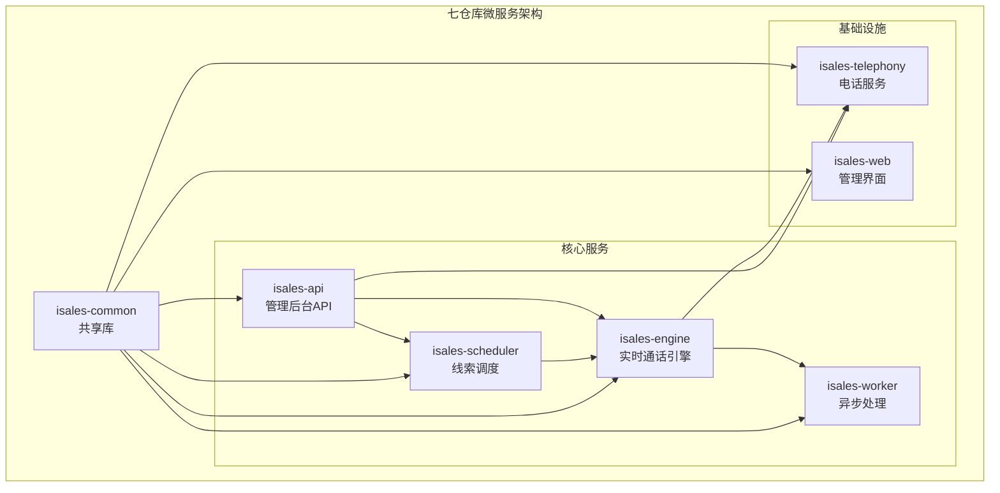
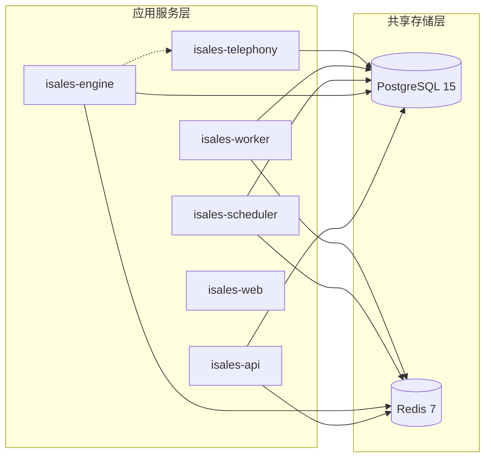
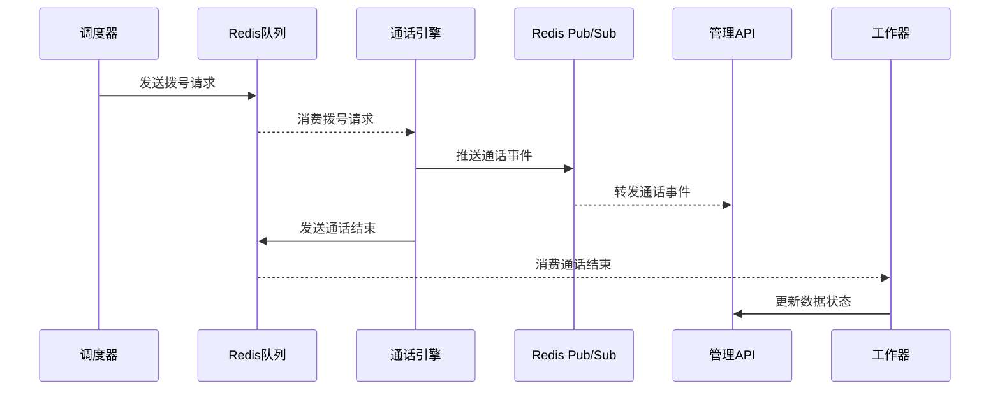
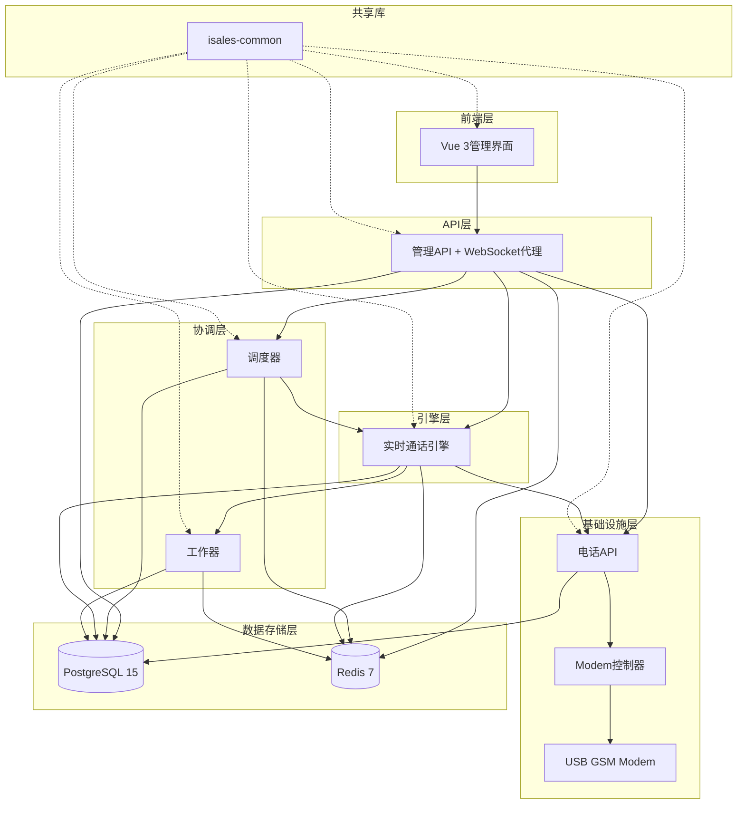
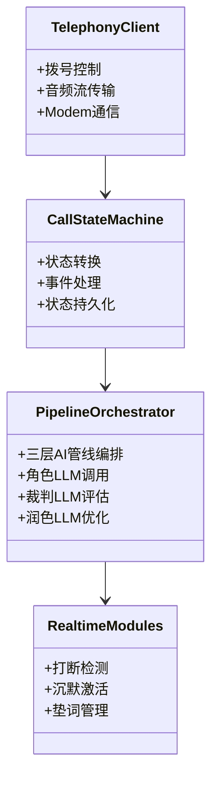
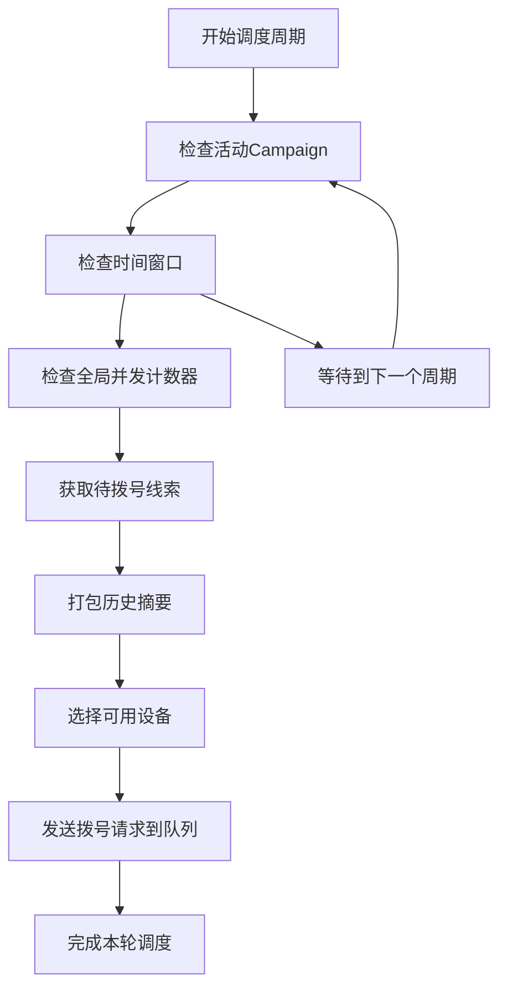
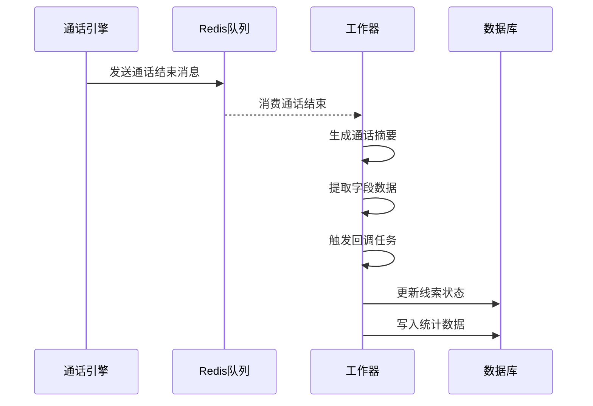
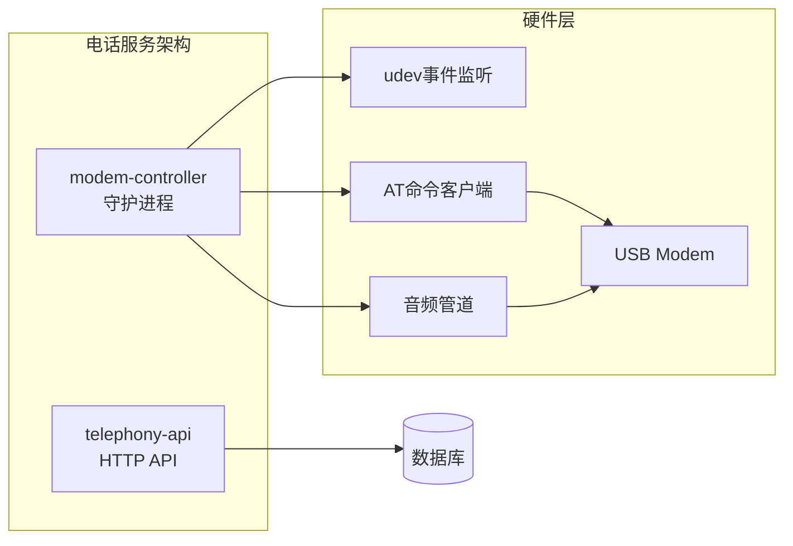
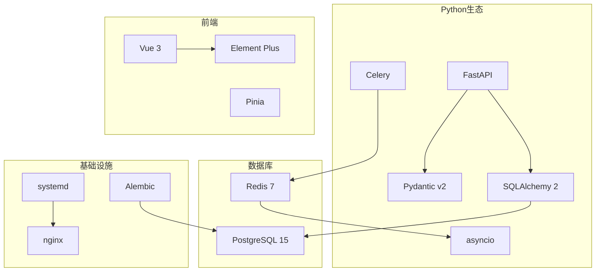
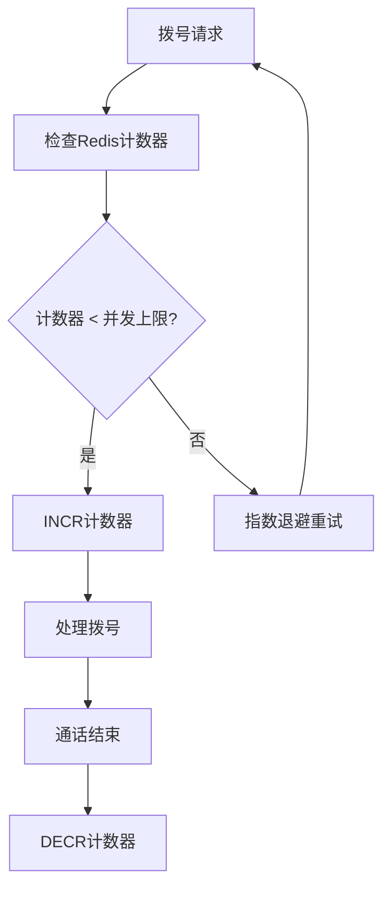

# 整体架构概览

<cite>
**本文档引用的文件**
- [README.md](file://README.md)
- [DESIGN.md](file://DESIGN.md)
- [IMPLEMENTATION_PLAN.md](file://IMPLEMENTATION_PLAN.md)
- [architecture/spec.md](file://openspec/specs/architecture/spec.md)
- [deployment-topology/spec.md](file://openspec/specs/deployment-topology/spec.md)
- [service-communication/spec.md](file://openspec/specs/service-communication/spec.md)
- [data-model/spec.md](file://openspec/specs/data-model/spec.md)
- [message-contract/spec.md](file://openspec/specs/message-contract/spec.md)
- [provider-abc/spec.md](file://openspec/specs/provider-abc/spec.md)
- [deploy/README.md](file://deploy/README.md)
</cite>

## 目录
1. [简介](#简介)
2. [项目结构](#项目结构)
3. [核心组件](#核心组件)
4. [架构概览](#架构概览)
5. [详细组件分析](#详细组件分析)
6. [依赖关系分析](#依赖关系分析)
7. [性能考虑](#性能考虑)
8. [故障排查指南](#故障排查指南)
9. [结论](#结论)
10. [附录](#附录)

## 简介

iSales是一个基于七仓库微服务架构的AI外呼销售系统。该系统采用单主机部署模型，在一台服务器上运行全部服务进程，包括实时通话引擎、调度器、工作器、电话服务、Web管理界面等。

### 系统设计理念

系统采用"自下而上"的实施策略，首先建立共享库，然后逐步构建各个服务。这种架构设计的核心目标是：

- **模块化分离**：每个服务都有明确的职责边界，避免功能耦合
- **开发效率提升**：独立的Git仓库允许并行开发和独立部署
- **部署灵活性**：支持Linux systemd和macOS launchd两种部署模型
- **技术栈统一**：通过共享库确保各服务间的技术一致性

### 七仓库微服务架构

系统由七个独立的Git仓库组成，每个仓库专注于特定的功能领域：

1. **isales-common**：共享库，包含数据模型、Provider接口、消息契约
2. **isales-api**：管理后台API和WebSocket代理
3. **isales-engine**：实时通话引擎（状态机 + AI三层管线）
4. **isales-scheduler**：线索调度和拨号队列管理
5. **isales-worker**：异步后处理任务
6. **isales-telephony**：电话设备管理和modem控制器
7. **isales-web**：Vue 3管理界面

## 项目结构

### 仓库组织方式

**图表来源**
- [architecture/spec.md:9-19](file://openspec/specs/architecture/spec.md#L9-L19)
- [README.md:3-14](file://README.md#L3-L14)

### 单主机部署模型

系统支持两种单主机部署模型：

1. **Linux + systemd模型**（主线）
   - Ubuntu 22.04 LTS或更新版本
   - 7个服务进程通过systemd管理
   - PostgreSQL 15 + Redis 7 + nginx作为系统服务

2. **macOS 14+ + launchd模型**（门店/现场场景）
   - Apple Silicon处理器
   - 通过launchd管理服务进程
   - 适用于现场部署场景

**章节来源**
- [deploy/README.md:1-112](file://deploy/README.md#L1-L112)
- [deployment-topology/spec.md:6-38](file://openspec/specs/deployment-topology/spec.md#L6-L38)

## 核心组件

### 数据存储架构

系统采用统一的数据存储策略，所有服务共享同一PostgreSQL实例和Redis实例：

**图表来源**
- [architecture/spec.md:59-71](file://openspec/specs/architecture/spec.md#L59-L71)
- [data-model/spec.md:52-59](file://openspec/specs/data-model/spec.md#L52-L59)

### 通信架构

服务间的通信通过Redis实现，采用队列和Pub/Sub两种模式：

**图表来源**
- [service-communication/spec.md:11-24](file://openspec/specs/service-communication/spec.md#L11-L24)

**章节来源**
- [service-communication/spec.md:31-44](file://openspec/specs/service-communication/spec.md#L31-L44)
- [message-contract/spec.md:6-28](file://openspec/specs/message-contract/spec.md#L6-L28)

## 架构概览

### 系统整体架构图

**图表来源**
- [architecture/spec.md:130-168](file://openspec/specs/architecture/spec.md#L130-L168)

### 服务职责边界

每个服务都有明确的职责边界，避免功能重叠：

| 仓库 | 职责 | 规模 | 关键功能 |
|------|------|------|----------|
| isales-common | SQLAlchemy模型/Pydantic Schema/Provider ABC/Alembic迁移 | 小 | 跨服务共享接口 |
| isales-api | 管理后台CRUD/WebSocket代理 | 中 | Campaign/Lead管理 |
| isales-engine | 实时通话引擎/状态机/AI管线 | 大 | 通话控制/智能对话 |
| isales-scheduler | 线索分发/时间窗口/重试跟进 | 小 | 拨号调度/并发控制 |
| isales-worker | 异步处理/摘要生成/回调 | 中 | 后处理任务 |
| isales-telephony | 电话API/Modem控制 | 中 | 设备管理/硬件控制 |
| isales-web | Vue3管理界面 | 中 | 用户界面/数据展示 |

**章节来源**
- [architecture/spec.md:26-44](file://openspec/specs/architecture/spec.md#L26-L44)

## 详细组件分析

### 实时通话引擎（isales-engine）

实时通话引擎是系统的核心组件，负责处理所有通话相关的逻辑：

**图表来源**
- [IMPLEMENTATION_PLAN.md:190-224](file://IMPLEMENTATION_PLAN.md#L190-L224)

引擎的主要特性包括：

1. **状态机驱动**：完整的通话生命周期状态管理
2. **AI三层管线**：角色对话 + 裁判评估 + 结果润色
3. **实时处理**：打断检测、沉默激活、垫词管理
4. **硬件集成**：与USB GSM Modem的双向音频通信

**章节来源**
- [IMPLEMENTATION_PLAN.md:190-261](file://IMPLEMENTATION_PLAN.md#L190-L261)

### 调度器（isales-scheduler）

调度器负责管理线索的分发和通话的并发控制：

**图表来源**
- [IMPLEMENTATION_PLAN.md:151-172](file://IMPLEMENTATION_PLAN.md#L151-L172)

调度器的关键功能：

1. **时间窗口管理**：根据Campaign配置的时间窗口分发线索
2. **并发控制**：通过Redis原子计数器控制全局并发
3. **历史摘要**：为每次通话提供上下文信息
4. **设备选择**：智能选择可用的通话设备

**章节来源**
- [IMPLEMENTATION_PLAN.md:151-172](file://IMPLEMENTATION_PLAN.md#L151-L172)

### 工作器（isales-worker）

工作器处理通话结束后的异步任务：

**图表来源**
- [IMPLEMENTATION_PLAN.md:173-187](file://IMPLEMENTATION_PLAN.md#L173-L187)

工作器的主要任务：

1. **通话摘要**：使用LLM生成通话内容摘要
2. **字段提取**：从对话中提取关键业务字段
3. **回调处理**：向外部系统发送Webhook通知
4. **数据分析**：聚合统计信息供管理界面使用

**章节来源**
- [IMPLEMENTATION_PLAN.md:173-187](file://IMPLEMENTATION_PLAN.md#L173-L187)

### 电话服务（isales-telephony）

电话服务包含两个进程：HTTP API和Modem控制器：

**图表来源**
- [IMPLEMENTATION_PLAN.md:101-126](file://IMPLEMENTATION_PLAN.md#L101-L126)

电话服务的功能：

1. **设备管理**：CRUD设备和SIM卡信息
2. **设备选择**：为通话分配合适的设备
3. **硬件控制**：通过AT命令控制Modem
4. **音频处理**：双向音频流处理和重采样

**章节来源**
- [IMPLEMENTATION_PLAN.md:101-126](file://IMPLEMENTATION_PLAN.md#L101-L126)

## 依赖关系分析

### 技术栈依赖

系统采用统一的技术栈，确保各服务间的一致性和互操作性：

**图表来源**
- [IMPLEMENTATION_PLAN.md:60-92](file://IMPLEMENTATION_PLAN.md#L60-L92)

### 架构决策记录

系统采用了多项关键架构决策：

1. **选择七仓库而非monorepo的原因**：
   - 单仓库代码量在Claude Code单会话上下文中难以高效迭代
   - isales-common通过pip包分发可清晰隔离边界

2. **单主机部署模型的选择**：
   - 满足≤8路并发的目标
   - 简化部署和运维复杂度
   - 便于监控和故障排查

3. **统一JWT认证体系**：
   - isales-api作为唯一JWT签发方
   - telephony-api仅验证JWT
   - 通过环境变量分发HMAC密钥

**章节来源**
- [architecture/spec.md:87-119](file://openspec/specs/architecture/spec.md#L87-L119)

## 性能考虑

### 并发控制机制

系统通过Redis原子计数器实现全局并发控制：

**图表来源**
- [service-communication/spec.md:45-63](file://openspec/specs/service-communication/spec.md#L45-L63)

### 性能优化策略

1. **异步处理**：所有I/O密集型操作使用asyncio
2. **流式处理**：ASR和TTS采用流式接口减少延迟
3. **缓存机制**：Redis缓存热点数据和配置
4. **队列处理**：通过Redis队列实现异步解耦

## 故障排查指南

### 常见问题及解决方案

1. **服务启动失败**
   - 检查systemd服务状态：`systemctl status isales-<service>`
   - 查看服务日志：`journalctl -u isales-<service> -f`
   - 验证环境变量配置：`cat /etc/isales/env/<service>.env`

2. **数据库连接问题**
   - 检查PostgreSQL服务状态：`systemctl status postgresql`
   - 验证连接字符串：`echo $ISALES_DATABASE_URL`
   - 运行数据库迁移：`alembic upgrade head`

3. **Redis连接问题**
   - 检查Redis服务状态：`systemctl status redis-server`
   - 验证连接字符串：`echo $ISALES_REDIS_URL`
   - 测试Redis连接：`redis-cli ping`

4. **硬件设备问题**
   - 检查udev事件：`journalctl -u isales-modem-controller -f`
   - 验证USB设备权限：`ls -la /dev/ttyUSB*`
   - 测试Modem通信：`echo "AT" > /dev/ttyUSB0`

**章节来源**
- [deploy/README.md:104-112](file://deploy/README.md#L104-L112)

### 监控和告警

系统提供了完善的监控和告警机制：

1. **Prometheus指标**：各服务提供/metrics端点
2. **Grafana仪表板**：实时监控系统状态
3. **告警规则**：关键指标异常自动告警
4. **日志聚合**：集中化日志收集和分析

## 结论

iSales系统通过七仓库微服务架构实现了高度模块化的AI外呼解决方案。该架构具有以下优势：

1. **开发效率提升**：独立仓库支持并行开发，提高迭代速度
2. **部署灵活性**：支持多种部署模型，适应不同场景需求
3. **技术一致性**：通过共享库确保各服务间的技术统一
4. **运维简便性**：单主机部署简化了运维复杂度
5. **扩展性良好**：清晰的职责边界为未来扩展奠定基础

系统采用的monorepo方案被明确排除，原因是单仓库代码量过大，不利于高效的开发协作。通过七仓库分离和isales-common共享库的设计，系统在保持技术一致性的同时，最大化了开发效率和部署灵活性。

## 附录

### 架构决策文档

系统的所有重大架构决策都通过OpenSpec变更提案流程进行记录和管理，确保决策的可追溯性和可审计性。

### 实施路线图

系统按照"自下而上"的策略分阶段实施，从共享库开始，逐步构建各个服务，确保每个阶段的质量和稳定性。