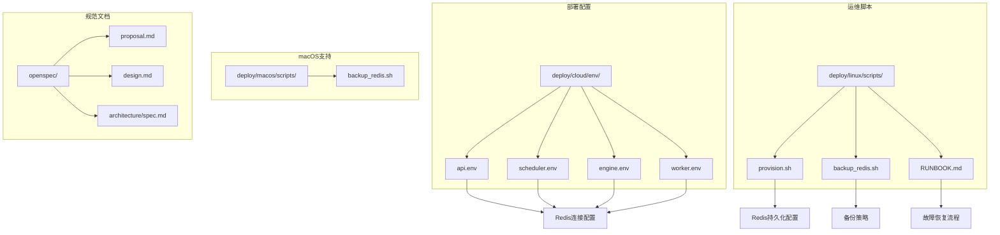
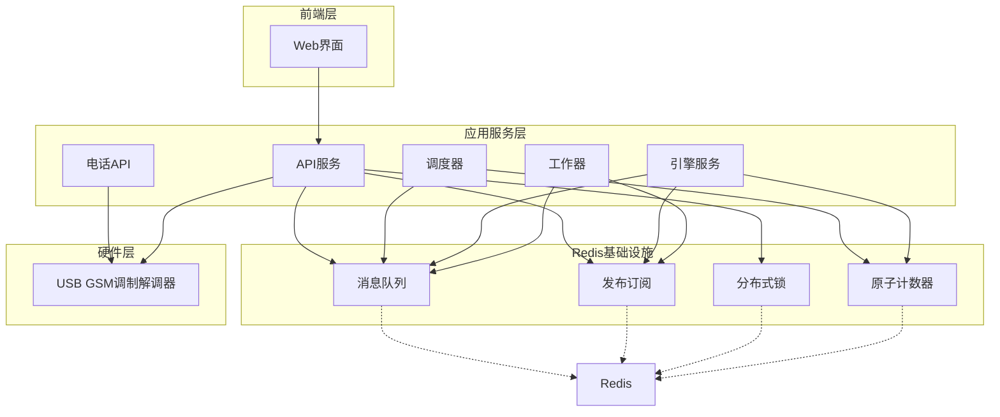
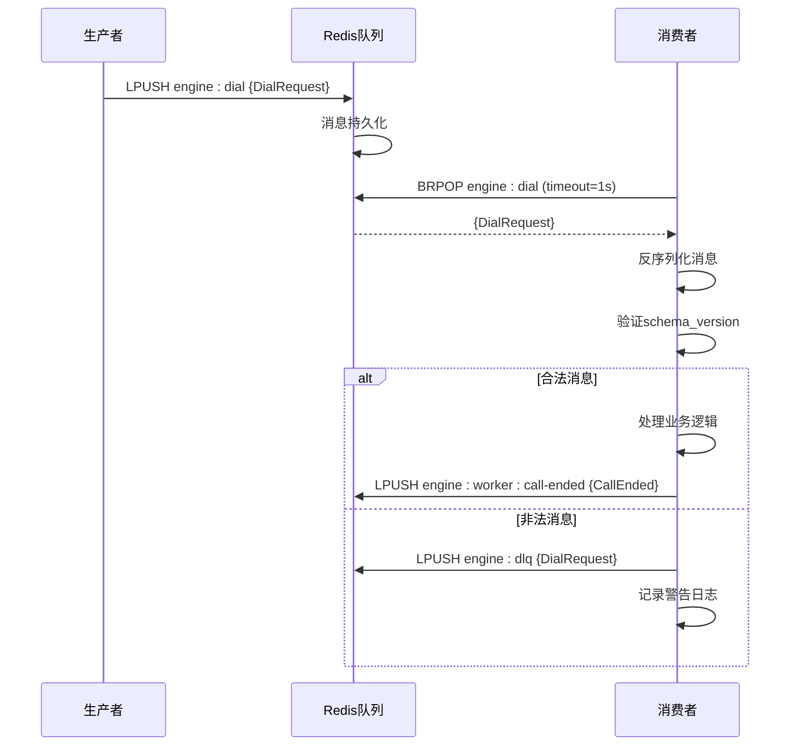
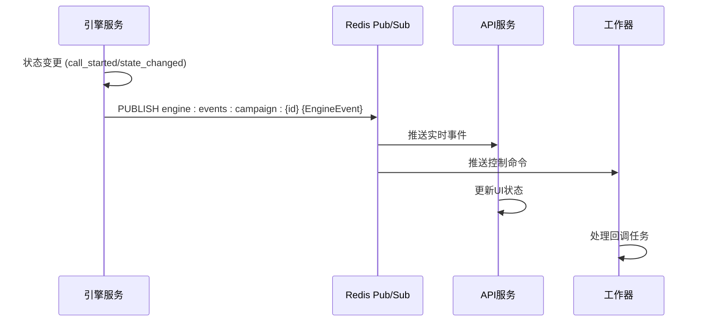
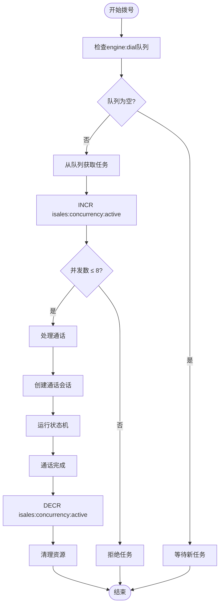
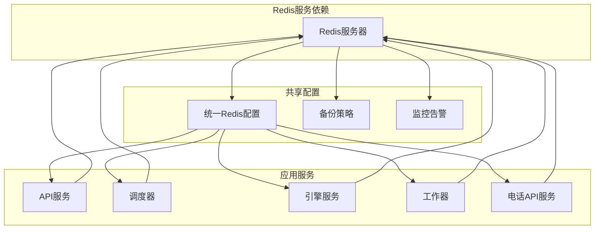
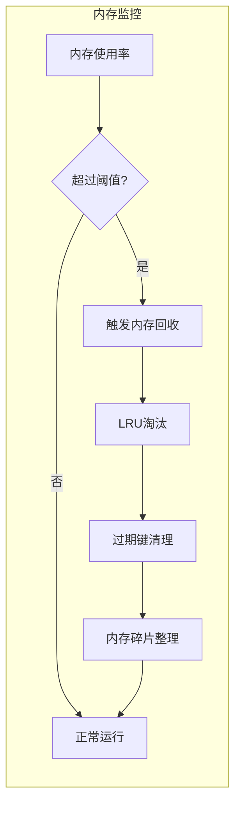
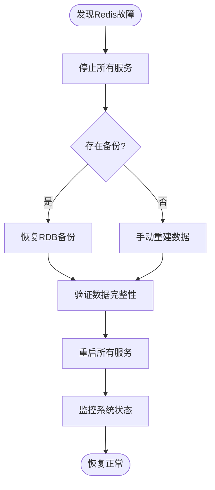

# Redis架构设计

<cite>
**本文档引用的文件**
- [provision.sh](file://deploy/linux/scripts/provision.sh)
- [backup_redis.sh](file://deploy/linux/scripts/backup_redis.sh)
- [backup_redis.sh](file://deploy/macos/scripts/backup_redis.sh)
- [RUNBOOK.md](file://deploy/RUNBOOK.md)
- [api.env](file://deploy/cloud/env/api.env)
- [engine.env](file://deploy/cloud/env/engine.env)
- [scheduler.env](file://deploy/cloud/env/scheduler.env)
- [worker.env](file://deploy/cloud/env/worker.env)
- [proposal.md](file://openspec/changes/archive/2026-05-07-impl-engine/proposal.md)
- [design.md](file://openspec/changes/archive/2026-05-07-impl-engine/design.md)
- [architecture/spec.md](file://openspec/specs/architecture/spec.md)
</cite>

## 目录
1. [引言](#引言)
2. [项目结构](#项目结构)
3. [核心组件](#核心组件)
4. [架构概览](#架构概览)
5. [详细组件分析](#详细组件分析)
6. [依赖关系分析](#依赖关系分析)
7. [性能考虑](#性能考虑)
8. [故障排除指南](#故障排除指南)
9. [结论](#结论)

## 引言

iSales系统采用Redis作为核心基础设施组件，在服务通信中发挥着多重关键作用。本文档详细阐述了Redis在iSales中的架构设计，包括其作为消息队列实现可靠任务派发、作为发布订阅系统实现实时事件广播、以及作为分布式锁和原子计数器实现全局并发控制的完整方案。

系统通过Redis实现了云边分离的部署架构，支持多服务间的高效通信和协调。每个服务（API、Engine、Worker、Scheduler、Telephony-API）都通过统一的Redis连接进行交互，确保了系统的整体性和一致性。

## 项目结构

iSales项目的Redis相关配置和部署分布在多个关键位置：

**图表来源**
- [provision.sh:97-127](file://deploy/linux/scripts/provision.sh#L97-L127)
- [backup_redis.sh:1-61](file://deploy/linux/scripts/backup_redis.sh#L1-L61)
- [RUNBOOK.md:144-162](file://deploy/RUNBOOK.md#L144-L162)

**章节来源**
- [provision.sh:97-127](file://deploy/linux/scripts/provision.sh#L97-L127)
- [backup_redis.sh:1-61](file://deploy/linux/scripts/backup_redis.sh#L1-L61)
- [RUNBOOK.md:144-162](file://deploy/RUNBOOK.md#L144-L162)

## 核心组件

### Redis持久化配置

系统采用AOF（Append Only File）持久化策略，确保数据的高可靠性：

- **AOF启用**: `appendonly yes` - 启用AOF持久化模式
- **同步策略**: `appendfsync everysec` - 每秒同步一次，平衡性能和安全性
- **配置管理**: 通过`/etc/redis/redis.conf.d/isales.conf`集中管理

### 数据备份策略

系统实现了自动化的Redis备份机制：

- **备份频率**: 每日自动执行
- **备份格式**: RDB快照压缩存储（.rdb.gz）
- **保留策略**: 14天历史备份保留
- **备份位置**: `/opt/isales/backups/redis/`

### 故障恢复机制

提供了完整的Redis故障恢复流程：

- **RDB恢复**: 支持基于快照的快速恢复
- **验证机制**: 恢复后自动验证数据完整性
- **演练要求**: 至少每季度执行一次恢复演练

**章节来源**
- [provision.sh:114-118](file://deploy/linux/scripts/provision.sh#L114-L118)
- [backup_redis.sh:10-14](file://deploy/linux/scripts/backup_redis.sh#L10-L14)
- [RUNBOOK.md:144-157](file://deploy/RUNBOOK.md#L144-L157)

## 架构概览

iSales系统采用云边分离的Redis架构，实现了服务间的高效通信：

**图表来源**
- [architecture/spec.md:130-168](file://openspec/specs/architecture/spec.md#L130-L168)
- [proposal.md:12-16](file://openspec/changes/archive/2026-05-07-impl-engine/proposal.md#L12-L16)

## 详细组件分析

### 消息队列实现

#### 队列设计原则

系统采用Redis列表（List）实现可靠的消息队列，遵循以下设计原则：

- **生产者-消费者模式**: 通过LPUSH和BRPOP实现异步消息传递
- **死信队列**: 不合规消息进入DLQ，避免阻塞正常流程
- **消息版本控制**: 支持消息格式版本检查和迁移

#### 核心队列结构

**图表来源**
- [proposal.md:12-16](file://openspec/changes/archive/2026-05-07-impl-engine/proposal.md#L12-L16)

#### 队列边界划分

| 队列名称 | 使用场景 | 数据结构 | 消费模式 |
|---------|----------|----------|----------|
| `engine:dial` | 拨号请求队列 | List | BLPOP (1秒超时) |
| `engine:worker:call-ended` | 通话结束通知 | List | BRPOP (无超时) |
| `engine:dlq` | 死信队列 | List | 按需消费 |

**章节来源**
- [proposal.md:12-16](file://openspec/changes/archive/2026-05-07-impl-engine/proposal.md#L12-L16)

### 发布订阅系统

#### 实时事件广播

系统利用Redis发布订阅机制实现服务间实时通信：

- **事件类型**: `engine:events:campaign:{campaign_id}`
- **控制类型**: `engine:control:campaign:*`
- **异步fire-and-forget**: 不影响主要业务流程

#### 事件流设计

**图表来源**
- [proposal.md:92-96](file://openspec/changes/archive/2026-05-07-impl-engine/proposal.md#L92-L96)

#### 订阅边界划分

| 通道类型 | 前缀 | 使用场景 | 订阅模式 |
|---------|------|----------|----------|
| 事件通道 | `engine:events:campaign:` | 实时状态更新 | SUBSCRIBE |
| 控制通道 | `engine:control:campaign:` | 远程控制命令 | SUBSCRIBE |
| 广播通道 | `engine:events:broadcast` | 系统级通知 | SUBSCRIBE |

**章节来源**
- [proposal.md:92-101](file://openspec/changes/archive/2026-05-07-impl-engine/proposal.md#L92-L101)

### 分布式锁和原子计数器

#### 全局并发控制

系统通过Redis原子操作实现全局并发控制：

- **并发计数器**: `isales:concurrency:active`
- **分布式锁**: 基于SET NX EX实现
- **一致性保证**: 所有服务共享同一计数器

#### 并发控制流程

**图表来源**
- [proposal.md:16](file://openspec/changes/archive/2026-05-07-impl-engine/proposal.md#L16)
- [design.md:265-269](file://openspec/changes/archive/2026-05-07-impl-engine/design.md#L265-L269)

#### 锁实现策略

| 锁类型 | 实现方式 | 过期时间 | 用途 |
|--------|----------|----------|------|
| 任务锁 | SET key value NX EX 300 | 5分钟 | 防止重复处理 |
| 会话锁 | SET session:{id} lock NX EX 1800 | 30分钟 | 通话会话管理 |
| 配置锁 | SET config:lock lock NX EX 600 | 10分钟 | 配置更新保护 |

**章节来源**
- [design.md:265-269](file://openspec/changes/archive/2026-05-07-impl-engine/design.md#L265-L269)

### 数据结构选择策略

#### 列表（List）的应用

- **消息队列**: LPUSH/BRPOP实现FIFO队列
- **任务调度**: 支持优先级和批量处理
- **历史记录**: 自动截断和轮转

#### 字符串（String）的应用

- **原子计数器**: INCR/DECR实现并发控制
- **配置缓存**: 快速读取和更新
- **状态标志**: 简单状态管理

#### 哈希（Hash）的应用

- **会话元数据**: 结构化存储通话信息
- **统计信息**: 多维度指标收集
- **配置参数**: 动态配置管理

**章节来源**
- [proposal.md:16](file://openspec/changes/archive/2026-05-07-impl-engine/proposal.md#L16)

## 依赖关系分析

### 服务间依赖

**图表来源**
- [api.env:7](file://deploy/cloud/env/api.env#L7)
- [engine.env:5](file://deploy/cloud/env/engine.env#L5)
- [scheduler.env:5](file://deploy/cloud/env/scheduler.env#L5)
- [worker.env:8](file://deploy/cloud/env/worker.env#L8)

### 环境配置管理

所有服务通过统一的环境变量配置Redis连接：

| 服务 | 环境变量 | 默认值 | 说明 |
|------|----------|--------|------|
| API | ISALES_REDIS_URL | redis://127.0.0.1:6379/0 | 管理API连接 |
| Scheduler | ISALES_REDIS_URL | redis://127.0.0.1:6379/0 | 调度任务队列 |
| Engine | ISALES_REDIS_URL | redis://127.0.0.1:6379/0 | 通话处理引擎 |
| Worker | ISALES_REDIS_URL | redis://127.0.0.1:6379/0 | 回调任务处理 |
| Telephony-API | ISALES_REDIS_URL | redis://127.0.0.1:6379/0 | 电话接口服务 |

**章节来源**
- [api.env:7](file://deploy/cloud/env/api.env#L7)
- [engine.env:5](file://deploy/cloud/env/engine.env#L5)
- [scheduler.env:5](file://deploy/cloud/env/scheduler.env#L5)
- [worker.env:8](file://deploy/cloud/env/worker.env#L8)

## 性能考虑

### 持久化优化

系统采用AOF持久化策略，在性能和可靠性之间取得平衡：

- **同步策略**: 每秒同步一次，减少磁盘I/O开销
- **重写机制**: 自动BGREWRITEAOF，避免文件过大
- **内存优化**: AOF重写时不使用fork，降低内存峰值

### 内存管理

### 连接池管理

- **连接复用**: 每个服务维护独立的Redis连接池
- **超时设置**: 读超时1秒，写超时5秒
- **重连机制**: 自动检测连接断开并重连

## 故障排除指南

### 常见问题诊断

| 问题症状 | 可能原因 | 解决步骤 |
|----------|----------|----------|
| 队列深度异常增长 | 消费者宕机或处理缓慢 | 检查消费者状态，增加实例数量 |
| 并发计数器不准确 | 异常退出未正确释放 | 执行DECR修复，检查异常处理 |
| 发布订阅消息丢失 | 订阅者离线 | 检查订阅状态，实现重连机制 |
| Redis内存不足 | 键值过多或过期键堆积 | 清理过期键，调整淘汰策略 |

### 恢复流程

#### Redis故障恢复

**图表来源**
- [RUNBOOK.md:144-157](file://deploy/RUNBOOK.md#L144-L157)

#### 备份验证

- **数据大小检查**: `redis-cli dbsize`
- **关键键验证**: `redis-cli keys 'campaign:*' | head`
- **连接测试**: `redis-cli ping`

**章节来源**
- [RUNBOOK.md:144-196](file://deploy/RUNBOOK.md#L144-L196)

## 结论

iSales系统的Redis架构设计体现了现代分布式系统的核心理念：通过统一的基础设施实现服务间的高效通信和协调。系统通过精心设计的数据结构选择、完善的持久化策略和严格的故障恢复机制，确保了在高并发场景下的稳定性和可靠性。

### 设计亮点

1. **多用途架构**: 同一套Redis实例同时支持队列、Pub/Sub、锁和计数器功能
2. **强一致性**: 通过原子操作和事务保证数据一致性
3. **高可用性**: 自动备份和快速恢复机制
4. **可观测性**: 完善的监控和告警体系

### 未来改进方向

1. **集群化部署**: 考虑Redis Cluster实现水平扩展
2. **监控增强**: 集成更详细的性能指标监控
3. **自动化运维**: 实现Redis配置的自动化管理
4. **安全加固**: 添加访问控制和数据加密机制

通过持续优化和演进，iSales的Redis架构将为系统的长期稳定运行提供坚实的技术基础。