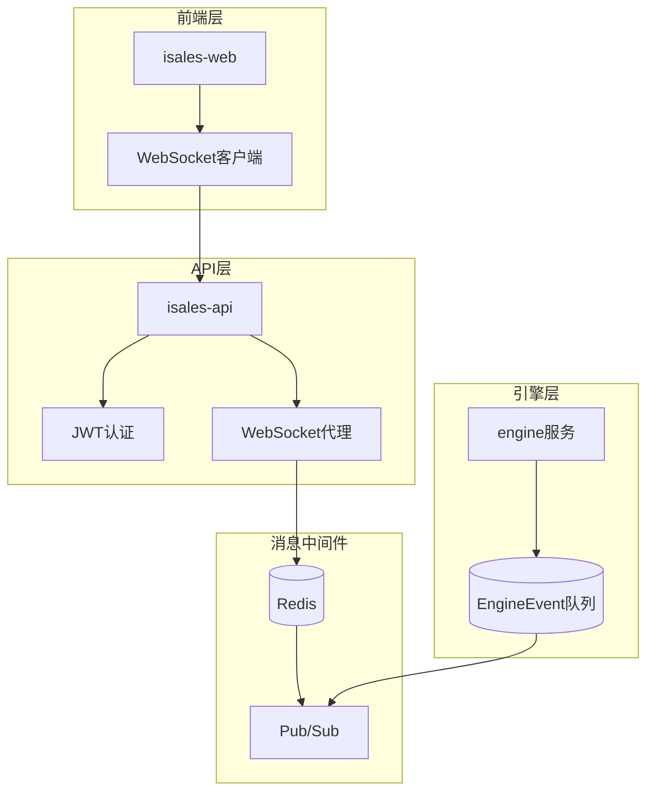
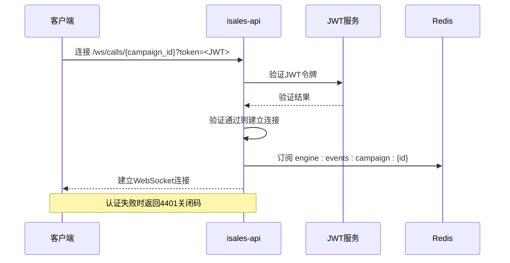
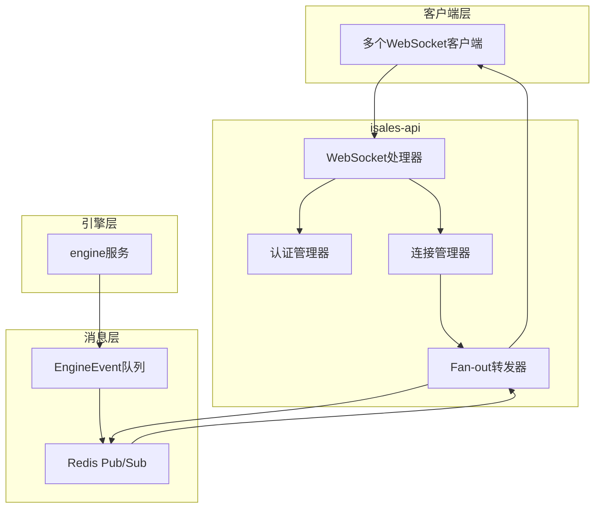
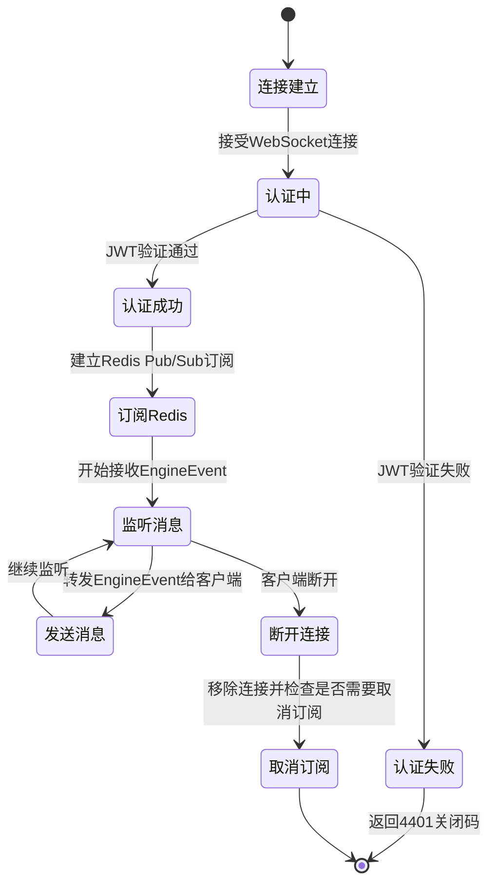
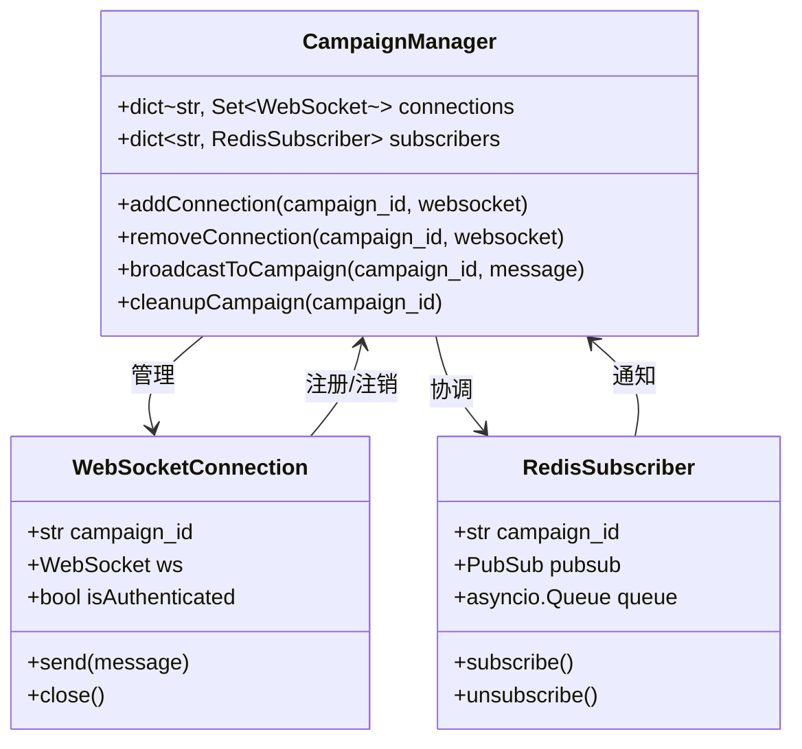
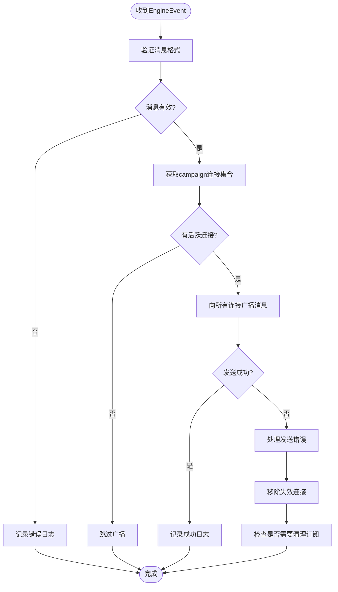
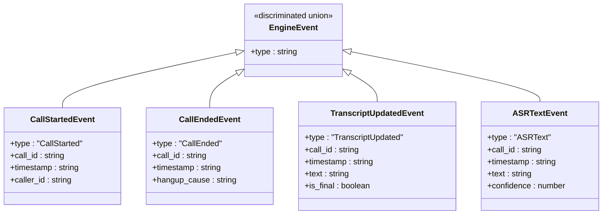
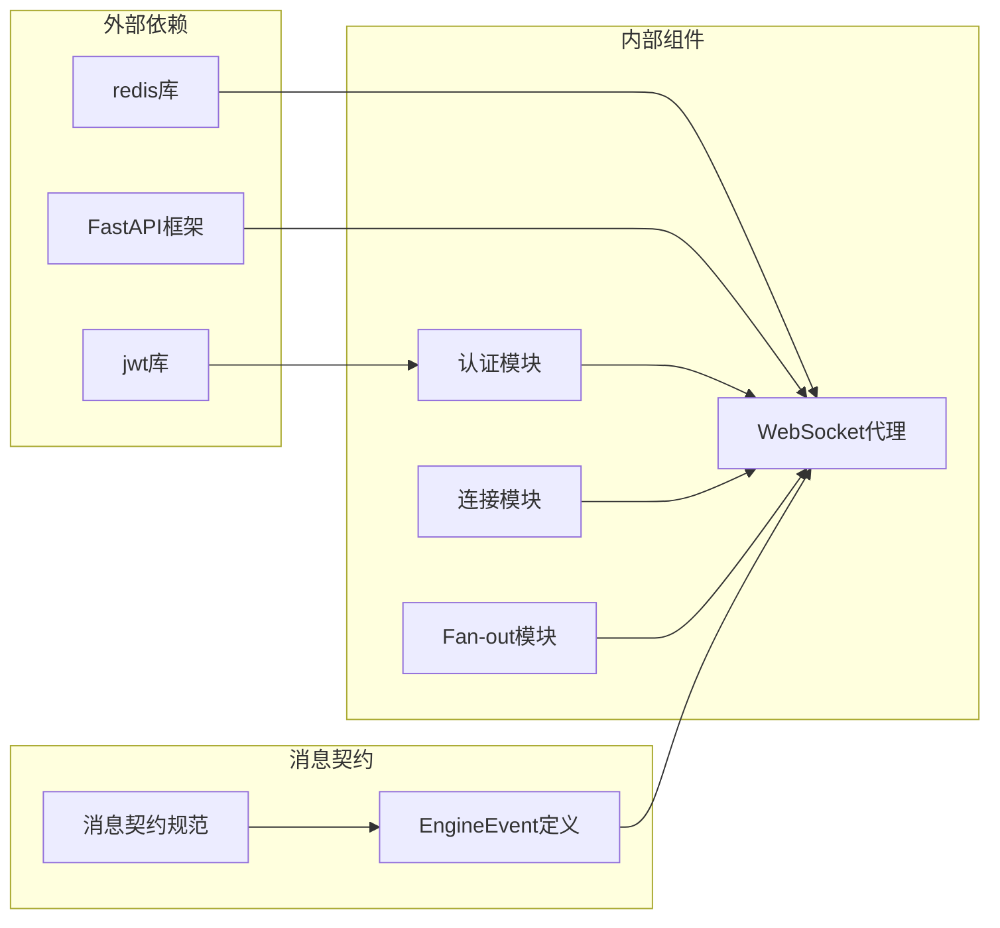

# WebSocket代理机制

<cite>
**本文档引用的文件**
- [service-communication/spec.md](file://openspec/specs/service-communication/spec.md)
- [2026-05-06-impl-api/design.md](file://openspec/changes/archive/2026-05-06-impl-api/design.md)
- [2026-05-06-impl-api/tasks.md](file://openspec/changes/archive/2026-05-06-impl-api/tasks.md)
- [architecture/spec.md](file://openspec/specs/architecture/spec.md)
- [message-contract/spec.md](file://openspec/specs/message-contract/spec.md)
- [2026-05-07-impl-engine/design.md](file://openspec/changes/archive/2026-05-07-impl-engine/design.md)
</cite>

## 目录
1. [简介](#简介)
2. [项目结构](#项目结构)
3. [核心组件](#核心组件)
4. [架构概览](#架构概览)
5. [详细组件分析](#详细组件分析)
6. [依赖关系分析](#依赖关系分析)
7. [性能考虑](#性能考虑)
8. [故障排除指南](#故障排除指南)
9. [结论](#结论)

## 简介

本文档详细说明了iSales系统中isales-api提供的WebSocket代理机制。该机制实现了从Redis Pub/Sub到WebSocket的fan-out转发，为前端提供实时的通话状态更新。系统通过JWT认证确保连接安全，并采用高效的连接管理策略来处理多客户端订阅场景。

## 项目结构

基于OpenSpec规范，iSales系统的WebSocket代理机制涉及以下关键组件：

**图表来源**
- [architecture/spec.md:130-168](file://openspec/specs/architecture/spec.md#L130-L168)
- [service-communication/spec.md:110-150](file://openspec/specs/service-communication/spec.md#L110-L150)

**章节来源**
- [architecture/spec.md:130-168](file://openspec/specs/architecture/spec.md#L130-L168)
- [service-communication/spec.md:110-150](file://openspec/specs/service-communication/spec.md#L110-L150)

## 核心组件

### WebSocket端点设计

系统提供`/ws/calls/{campaign_id}` WebSocket端点，该端点具有以下特性：

- **端点格式**: `wss://your-domain/ws/calls/{campaign_id}?token=<JWT>`
- **认证方式**: 查询参数传递JWT令牌
- **连接管理**: 每个campaign_id维护独立的连接集合
- **消息转发**: 将Redis Pub/Sub中的EngineEvent直接转发给所有订阅客户端

### JWT认证流程

**图表来源**
- [service-communication/spec.md:112-116](file://openspec/specs/service-communication/spec.md#L112-L116)
- [2026-05-06-impl-api/design.md:41-46](file://openspec/changes/archive/2026-05-06-impl-api/design.md#L41-L46)

### 连接管理策略

系统采用进程内字典和异步队列的组合策略：

- **进程内字典**: 每个campaign_id对应一个WebSocket连接集合
- **异步队列**: 解耦Redis订阅者与转发者，避免断线阻塞Redis订阅
- **共享订阅**: 多个客户端订阅同一campaign时，只维持一个Redis Pub/Sub订阅

**章节来源**
- [2026-05-06-impl-api/design.md:47-53](file://openspec/changes/archive/2026-05-06-impl-api/design.md#L47-L53)

## 架构概览

WebSocket代理机制的整体架构如下：

**图表来源**
- [service-communication/spec.md:117-121](file://openspec/specs/service-communication/spec.md#L117-L121)
- [2026-05-06-impl-api/design.md:47-53](file://openspec/changes/archive/2026-05-06-impl-api/design.md#L47-L53)

## 详细组件分析

### WebSocket连接生命周期

**图表来源**
- [service-communication/spec.md:117-126](file://openspec/specs/service-communication/spec.md#L117-L126)

### 多客户端订阅实现

系统通过以下机制实现多客户端订阅：

**图表来源**
- [2026-05-06-impl-api/design.md:47-53](file://openspec/changes/archive/2026-05-06-impl-api/design.md#L47-L53)

### 消息分发机制

消息分发遵循严格的协议约束：

**图表来源**
- [service-communication/spec.md:132-136](file://openspec/specs/service-communication/spec.md#L132-L136)

**章节来源**
- [service-communication/spec.md:117-146](file://openspec/specs/service-communication/spec.md#L117-L146)

### 前端EngineEvent解析

前端使用TypeScript discriminated union进行EngineEvent解析：

**图表来源**
- [service-communication/spec.md:137-141](file://openspec/specs/service-communication/spec.md#L137-L141)

**章节来源**
- [service-communication/spec.md:137-146](file://openspec/specs/service-communication/spec.md#L137-L146)

## 依赖关系分析

WebSocket代理机制的关键依赖关系：

**图表来源**
- [2026-05-06-impl-api/tasks.md:15-21](file://openspec/changes/archive/2026-05-06-impl-api/tasks.md#L15-L21)

**章节来源**
- [2026-05-06-impl-api/tasks.md:15-21](file://openspec/changes/archive/2026-05-06-impl-api/tasks.md#L15-L21)

## 性能考虑

### 连接管理优化

1. **共享订阅策略**: 避免为每个WebSocket连接独立订阅Redis，减少Redis连接数
2. **异步队列解耦**: 使用asyncio.Queue解耦订阅者与转发者
3. **内存管理**: 进程内字典存储连接信息，适合单实例部署

### 消息处理优化

1. **直接转发**: EngineEvent JSON直接传递，不做额外包装
2. **并发处理**: 多客户端订阅时使用并发广播
3. **错误隔离**: 单个客户端发送失败不影响其他客户端

## 故障排除指南

### 常见问题及解决方案

| 问题类型 | 症状 | 可能原因 | 解决方案 |
|---------|------|----------|----------|
| 认证失败 | 连接立即关闭，返回4401 | JWT令牌无效或过期 | 检查JWT生成和验证逻辑 |
| 连接超时 | 客户端无法连接到WebSocket端点 | 网络配置或Nginx代理问题 | 检查WebSocket代理配置 |
| 消息丢失 | 部分客户端未收到EngineEvent | Redis连接异常 | 检查Redis Pub/Sub订阅状态 |
| 内存泄漏 | 连接数持续增长 | 连接清理机制失效 | 实施连接超时和清理策略 |

### 错误处理最佳实践

1. **前端错误处理**: 使用TypeScript discriminated union解析EngineEvent，遇到未知type仅记录警告并跳过
2. **后端错误处理**: Redis发布失败不影响通话主路径，使用fire-and-forget模式
3. **连接监控**: 实施连接超时检测和自动清理机制

**章节来源**
- [service-communication/spec.md:137-146](file://openspec/specs/service-communication/spec.md#L137-L146)
- [2026-05-07-impl-engine/design.md:168-178](file://openspec/changes/archive/2026-05-07-impl-engine/design.md#L168-L178)

## 结论

iSales系统的WebSocket代理机制通过精心设计的架构实现了高效、可靠的实时消息传输。该机制满足了以下关键要求：

1. **安全性**: 通过JWT认证确保只有授权用户能够订阅特定campaign的实时更新
2. **效率性**: 采用共享订阅和异步队列策略，避免Redis连接膨胀和消息阻塞
3. **可靠性**: 实现了完整的连接生命周期管理和错误处理机制
4. **可扩展性**: 为未来的多实例部署预留了扩展路径

该实现为前端提供了稳定、低延迟的通话状态更新能力，同时保持了系统的高性能和可维护性。