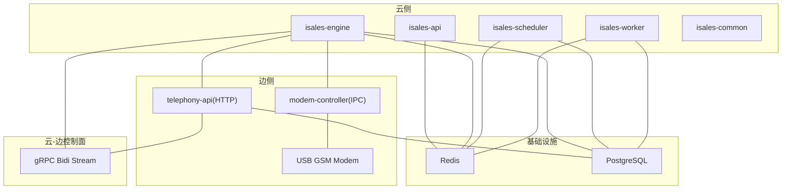
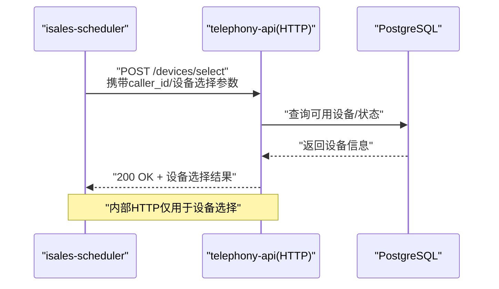
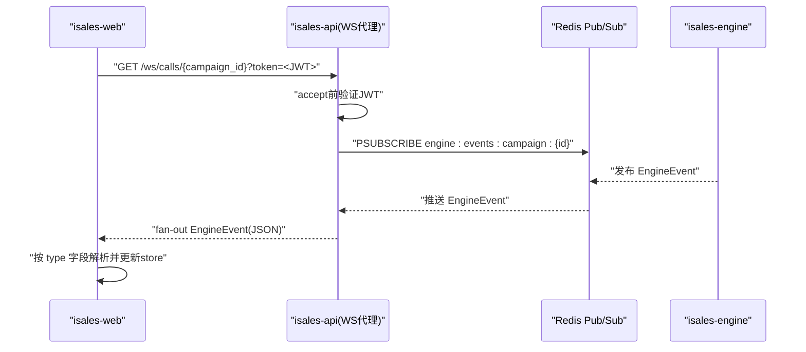
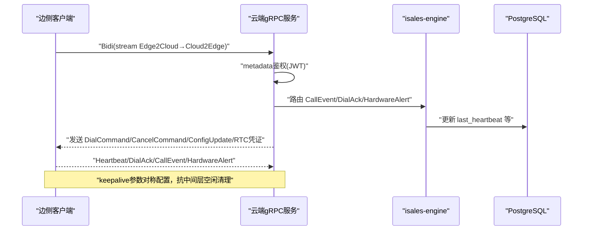
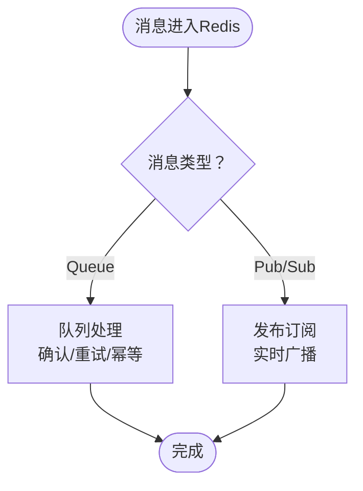
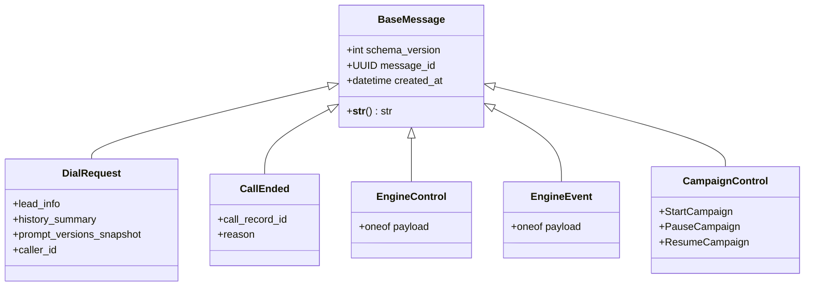
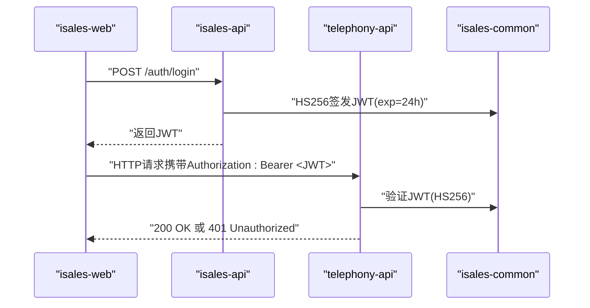
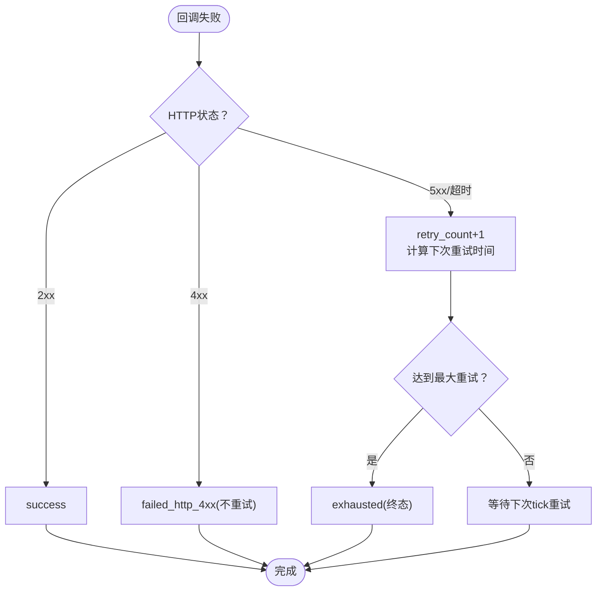
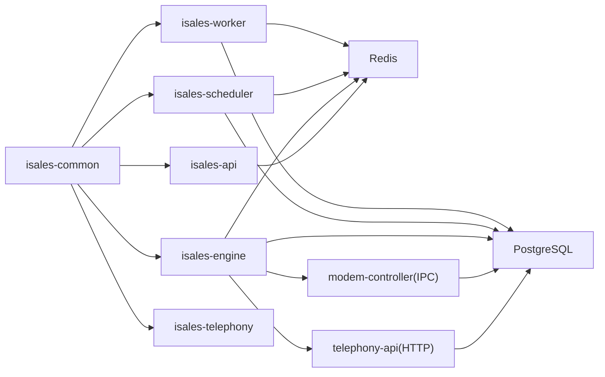

# 服务通信架构

<cite>
**本文档引用的文件**
- [README.md](file://README.md)
- [DESIGN.md](file://DESIGN.md)
- [架构规范](file://openspec/specs/architecture/spec.md)
- [服务通信规范](file://openspec/specs/service-communication/spec.md)
- [消息契约规范](file://openspec/specs/message-contract/spec.md)
- [云边gRPC保活](file://openspec/changes/cloud-edge-grpc-keepalive/specs/service-communication/spec.md)
- [云边gRPC保活提案](file://openspec/changes/cloud-edge-grpc-keepalive/proposal.md)
- [云边拆分架构](file://openspec/changes/arch-cloud-edge-split/specs/service-communication/spec.md)
- [API实现设计](file://openspec/changes/archive/2026-05-06-impl-api/design.md)
- [API变更需求](file://openspec/changes/archive/2026-05-06-impl-api/proposal.md)
- [调度器实现任务](file://openspec/changes/archive/2026-05-06-impl-scheduler/tasks.md)
- [Worker实现设计](file://openspec/changes/archive/2026-05-06-impl-worker/design.md)
- [Worker实现任务](file://openspec/changes/archive/2026-05-06-impl-worker/tasks.md)
- [引擎实现设计](file://openspec/changes/archive/2026-05-07-impl-engine/design.md)
- [Provider ABC规范](file://openspec/changes/archive/2026-05-08-impl-engine-providers/specs/provider-abc/spec.md)
- [Webhook回调规范](file://openspec/specs/webhook-callback/spec.md)
- [API环境示例](file://deploy/env/api.env.example)
- [云环境示例](file://deploy/cloud/env/api.env)
</cite>

## 目录
1. [简介](#简介)
2. [项目结构](#项目结构)
3. [核心组件](#核心组件)
4. [架构总览](#架构总览)
5. [详细组件分析](#详细组件分析)
6. [依赖关系分析](#依赖关系分析)
7. [性能考虑](#性能考虑)
8. [故障排查指南](#故障排查指南)
9. [结论](#结论)
10. [附录](#附录)

## 简介
本文件面向iSales系统的服务通信架构，系统性阐述服务间通信协议设计与实现机制，涵盖HTTP REST API、WebSocket实时通信、gRPC接口的使用场景与契约规范。文档还详细说明消息契约规范、请求响应格式、错误处理机制与版本兼容策略，Redis在服务通信中的多重作用（队列、发布订阅、缓存），以及服务发现与负载均衡、JWT认证体系在服务间调用中的应用。最后提供通信安全、性能优化与故障恢复的最佳实践。

## 项目结构
iSales采用7仓微服务架构，核心服务包括：
- isales-api：管理后台与WebSocket代理
- isales-engine：实时通话引擎
- isales-scheduler：线索调度
- isales-worker：异步后处理与Webhook回调
- isales-telephony：telephony-api（HTTP）与modem-controller（守护进程）
- isales-web：Vue 3前端
- isales-common：共享库（Pydantic模型、Provider ABC、数据库迁移）

```mermaid
graph TB
subgraph "前端"
WEB["isales-web<br/>Vue 3"]
end
subgraph "管理与通信"
API["isales-api<br/>管理API + WS代理"]
ENGINE["isales-engine<br/>实时通话引擎"]
SCHED["isales-scheduler<br/>线索调度"]
WORKER["isales-worker<br/>后处理/回调"]
TELEPHONY["isales-telephony<br/>telephony-api + modem-controller"]
end
subgraph "基础设施"
REDIS["Redis<br/>队列/发布订阅/缓存"]
PG["PostgreSQL<br/>数据持久化"]
end
WEB --> API
API <- --> REDIS
API <- --> PG
SCHED --> REDIS
ENGINE --> REDIS
WORKER --> REDIS
ENGINE --> PG
SCHED --> PG
WORKER --> PG
TELEPHONY --> PG
ENGINE --> TELEPHONY
```

**图表来源**
- [架构规范:130-168](file://openspec/specs/architecture/spec.md#L130-L168)

**章节来源**
- [README.md:1-86](file://README.md#L1-L86)
- [DESIGN.md:1-75](file://DESIGN.md#L1-L75)

## 核心组件
- 通信通道矩阵：定义7个服务间的通信通道与用途，确保协议选型与全局一致性。
- 消息契约：统一跨服务消息体定义，基于Pydantic模型，提供版本字段与序列化规范。
- Redis通道：队列（必须送达）、发布订阅（实时可丢失）、全局并发计数器、缓存。
- gRPC云边控制面：双向流传输，结合keepalive抗中间层空闲清理。
- WebSocket代理：前端订阅引擎事件，JWT鉴权，消息形状由契约约束。
- HTTP REST API：内部HTTP仅用于设备选择，外部回调走HTTP。

**章节来源**
- [服务通信规范:7-25](file://openspec/specs/service-communication/spec.md#L7-L25)
- [消息契约规范:6-24](file://openspec/specs/message-contract/spec.md#L6-L24)
- [架构规范:68-72](file://openspec/specs/architecture/spec.md#L68-L72)

## 架构总览
系统采用"云-边分离"的控制面与媒体面分工：
- 云侧：isales-api、isales-engine、isales-scheduler、isales-worker、isales-common
- 边侧：isales-telephony（telephony-api + modem-controller）
- 通信边界：云内使用Redis队列/发布订阅；云-边通过gRPC双向流与阿里RTC PaaS



**图表来源**
- [云边拆分架构:101-145](file://openspec/changes/arch-cloud-edge-split/specs/service-communication/spec.md#L101-L145)
- [架构规范:130-168](file://openspec/specs/architecture/spec.md#L130-L168)

## 详细组件分析

### HTTP REST API 与内部HTTP规范
- 内部HTTP调用限制：v1仅scheduler→telephony-api的设备选择调用，其他服务间通信必须走Redis队列或发布订阅。
- telephony-api：提供设备选择等HTTP接口，v1单主机部署下可免JWT，但需限制监听地址。
- 外部回调：worker触发回调通过HTTP，遵循webhook-callback规范。



**图表来源**
- [服务通信规范:64-77](file://openspec/specs/service-communication/spec.md#L64-L77)

**章节来源**
- [服务通信规范:64-77](file://openspec/specs/service-communication/spec.md#L64-L77)
- [Webhook回调规范:7-17](file://openspec/specs/webhook-callback/spec.md#L7-L17)

### WebSocket 实时通信（API ↔ 前端）
- WebSocket端点：/ws/calls/{campaign_id}，服务端订阅Redis发布订阅频道，fan-out给所有连接客户端。
- 鉴权：查询参数携带JWT，验证失败立即关闭连接（4401）。
- 连接管理：进程内字典维护每campaign的连接集合，后台任务订阅Redis频道，使用异步队列解耦。
- 消息形状：直接传递EngineEvent JSON，前端使用discriminated union解析，不进行字段裁剪或重命名。



**图表来源**
- [API实现设计:41-53](file://openspec/changes/archive/2026-05-06-impl-api/design.md#L41-L53)
- [服务通信规范:106-131](file://openspec/specs/service-communication/spec.md#L106-L131)

**章节来源**
- [API实现设计:30-53](file://openspec/changes/archive/2026-05-06-impl-api/design.md#L30-L53)
- [服务通信规范:106-131](file://openspec/specs/service-communication/spec.md#L106-L131)

### gRPC 接口（云-边控制面）
- 协议：CloudEdge.Bidi双向流，payload包含心跳、拨号确认、通话事件、硬件告警、拨号/取消/配置更新/RTC凭证等。
- 认证：gRPC元数据authorization携带JWT，验证失败返回UNAUTHENTICATED。
- Keepalive：客户端与服务端均启用HTTP/2 keepalive，避免中间层空闲清理导致的连接断开。
- 传输：支持nginx反代或grpcio内置TLS，日志区分"stream建立成功"与"后续异常"。



**图表来源**
- [云边gRPC保活:1-57](file://openspec/changes/cloud-edge-grpc-keepalive/specs/service-communication/spec.md#L1-L57)
- [云边拆分架构:101-145](file://openspec/changes/arch-cloud-edge-split/specs/service-communication/spec.md#L101-L145)

**章节来源**
- [云边gRPC保活提案:29-144](file://openspec/changes/cloud-edge-grpc-keepalive/proposal.md#L29-L144)
- [云边gRPC保活:1-57](file://openspec/changes/cloud-edge-grpc-keepalive/specs/service-communication/spec.md#L1-L57)
- [云边拆分架构:101-145](file://openspec/changes/arch-cloud-edge-split/specs/service-communication/spec.md#L101-L145)

### Redis 在服务通信中的多重作用
- 队列（Queue）：必须送达的消息派发，如scheduler→engine拨号请求、engine→worker通话结束处理、api→scheduler启动/暂停Campaign。
- 发布订阅（Pub/Sub）：实时事件广播，如api↔engine的控制指令与通话事件推送。
- 全局并发控制：跨engine实例的并发用Redis原子计数器（INCR/DECR），防止泄漏。
- 缓存：临时数据与热点信息缓存。



**图表来源**
- [服务通信规范:31-44](file://openspec/specs/service-communication/spec.md#L31-L44)
- [服务通信规范:45-63](file://openspec/specs/service-communication/spec.md#L45-L63)

**章节来源**
- [服务通信规范:31-63](file://openspec/specs/service-communication/spec.md#L31-L63)

### 消息契约与版本兼容策略
- 统一定义：跨服务Redis消息体在isales-common中定义为Pydantic模型，生产者使用.model_dump_json()序列化，消费者使用model_validate_json()反序列化。
- 基类字段：schema_version（破坏性升级+1）、message_id（去重追踪）、created_at（时间戳）。
- 版本演进：非破坏性变更可直接合入；破坏性变更需升版本并通过OpenSpec变更流程。
- 观测性：日志包含message_id，便于跨服务追踪。



**图表来源**
- [消息契约规范:25-38](file://openspec/specs/message-contract/spec.md#L25-L38)
- [消息契约规范:43-52](file://openspec/specs/message-contract/spec.md#L43-L52)

**章节来源**
- [消息契约规范:6-38](file://openspec/specs/message-contract/spec.md#L6-L38)
- [消息契约规范:53-85](file://openspec/specs/message-contract/spec.md#L53-L85)

### JWT 认证体系与安全
- 签发与验证：isales-api为唯一签发方，telephony-api仅验证；HMAC密钥通过环境变量分发。
- 前端直连：isales-web可直接调用telephony-api，使用从isales-api获取的JWT。
- 内部HTTP：v1单主机部署下scheduler→telephony-api可免JWT，但需限制监听地址。
- API凭据管理：/api/provider-credentials使用Fernet加密存储敏感字段，支持一次性返回明文与轮换。



**图表来源**
- [架构规范:96-129](file://openspec/specs/architecture/spec.md#L96-L129)
- [API实现设计:32-40](file://openspec/changes/archive/2026-05-06-impl-api/design.md#L32-L40)

**章节来源**
- [架构规范:96-129](file://openspec/specs/architecture/spec.md#L96-L129)
- [API实现设计:32-40](file://openspec/changes/archive/2026-05-06-impl-api/design.md#L32-L40)
- [API变更需求:48-66](file://openspec/changes/archive/2026-05-06-impl-api/proposal.md#L48-L66)

### 错误处理与重试机制
- Provider错误模型：统一为ProviderError体系（超时/限流/非法请求/服务端错误），便于降级与切换。
- Webhook回调：指数退避重试，达到上限置exhausted；失败渲染不重试；HTTP 4xx不重试。
- 引擎事件发布：fire-and-forget，失败不影响通话主路径。
- 调度器控制：BLPOP超时响应取消，schema_version不支持时进入DLQ。



**图表来源**
- [Webhook回调规范:100-133](file://openspec/specs/webhook-callback/spec.md#L100-L133)
- [引擎实现设计:168-178](file://openspec/changes/archive/2026-05-07-impl-engine/design.md#L168-L178)

**章节来源**
- [Provider ABC规范:1-43](file://openspec/changes/archive/2026-05-08-impl-engine-providers/specs/provider-abc/spec.md#L1-L43)
- [Webhook回调规范:100-133](file://openspec/specs/webhook-callback/spec.md#L100-L133)
- [Worker实现设计:90-104](file://openspec/changes/archive/2026-05-06-impl-worker/design.md#L90-L104)
- [调度器实现任务:16-23](file://openspec/changes/archive/2026-05-06-impl-scheduler/tasks.md#L16-L23)

## 依赖关系分析
- 服务间依赖：通过Redis队列/发布订阅实现松耦合；数据库直连由isales-common模型统一管理。
- 共享库：isales-common提供Pydantic模型、Provider ABC、数据库迁移，避免重复实现。
- 云边边界：云内通信走Redis，云-边通信走gRPC与RTC PaaS，避免跨云直连。



**图表来源**
- [架构规范:73-86](file://openspec/specs/architecture/spec.md#L73-L86)
- [服务通信规范:26-34](file://openspec/specs/service-communication/spec.md#L26-L34)

**章节来源**
- [架构规范:73-86](file://openspec/specs/architecture/spec.md#L73-L86)
- [服务通信规范:26-34](file://openspec/specs/service-communication/spec.md#L26-L34)

## 性能考虑
- 通道选型：队列用于必须送达的异步处理，发布订阅用于实时可丢失事件，避免阻塞主路径。
- 异步解耦：WebSocket代理使用异步队列解耦Redis订阅者与转发者，减少断线影响。
- Fire-and-forget：引擎事件发布不阻塞通话主路径，降低网络抖动影响。
- Keepalive：gRPC双向流启用keepalive，抗中间层空闲清理，减少断连检测延迟。
- 并发控制：全局并发用Redis原子计数器，防止泄漏与过度并发。

**章节来源**
- [服务通信规范:31-44](file://openspec/specs/service-communication/spec.md#L31-L44)
- [API实现设计:47-53](file://openspec/changes/archive/2026-05-06-impl-api/design.md#L47-L53)
- [引擎实现设计:168-178](file://openspec/changes/archive/2026-05-07-impl-engine/design.md#L168-L178)
- [云边gRPC保活:1-57](file://openspec/changes/cloud-edge-grpc-keepalive/specs/service-communication/spec.md#L1-L57)

## 故障排查指南
- Redis不可用：各服务重连重试（带退避）；engine中断重连期间不接受新拨号但可完成当前通话。
- PostgreSQL不可用：各服务重连重试；DB不可用时engine将通话状态缓存至Redis（v2优化）。
- modem-controller不可用：优雅清理受影响的call_session；scheduler可暂停派发直至恢复。
- WebSocket鉴权失败：立即关闭连接并返回4401，检查JWT有效性与密钥一致性。
- gRPC连接断开：依赖keepalive与重连路径；查看INFO日志定位上线时刻与异常。

**章节来源**
- [服务通信规范:87-105](file://openspec/specs/service-communication/spec.md#L87-L105)
- [API实现设计:41-45](file://openspec/changes/archive/2026-05-06-impl-api/design.md#L41-L45)
- [云边gRPC保活提案:127-144](file://openspec/changes/cloud-edge-grpc-keepalive/proposal.md#L127-L144)

## 结论
iSales服务通信架构以"云-边分离"为核心，通过Redis实现云内高吞吐、低耦合的异步通信，通过gRPC保障云-边控制面的可靠与低延迟，通过WebSocket提供前端实时事件订阅。统一的消息契约与JWT认证体系确保跨服务交互的一致性与安全性。在性能方面，采用异步解耦、fire-and-forget发布与keepalive抗空闲清理等策略；在可靠性方面，通过队列确认、发布订阅、指数退避重试与对账机制实现容错与恢复。

## 附录
- 环境变量示例：API/JWT/Redis/数据库等关键配置参考部署环境示例文件。
- 变更流程：所有协议与契约变更需通过OpenSpec变更提案流程，确保可追溯与一致性。

**章节来源**
- [API环境示例:1-14](file://deploy/env/api.env.example#L1-L14)
- [云环境示例:1-24](file://deploy/cloud/env/api.env.example#L1-L24)