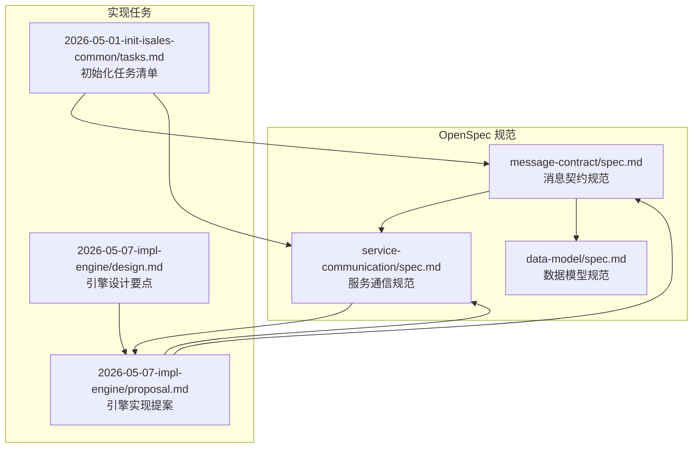
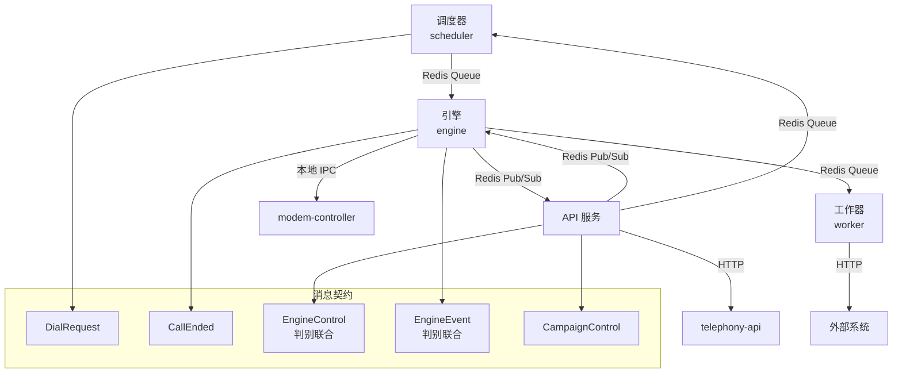
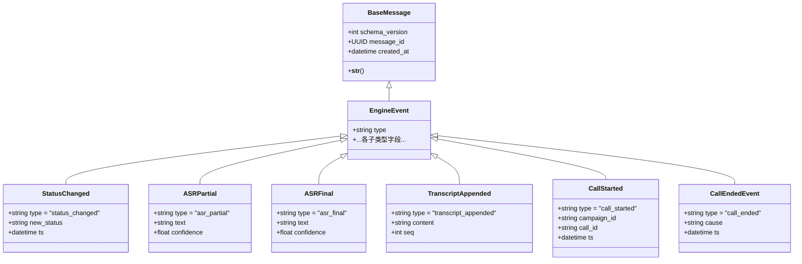
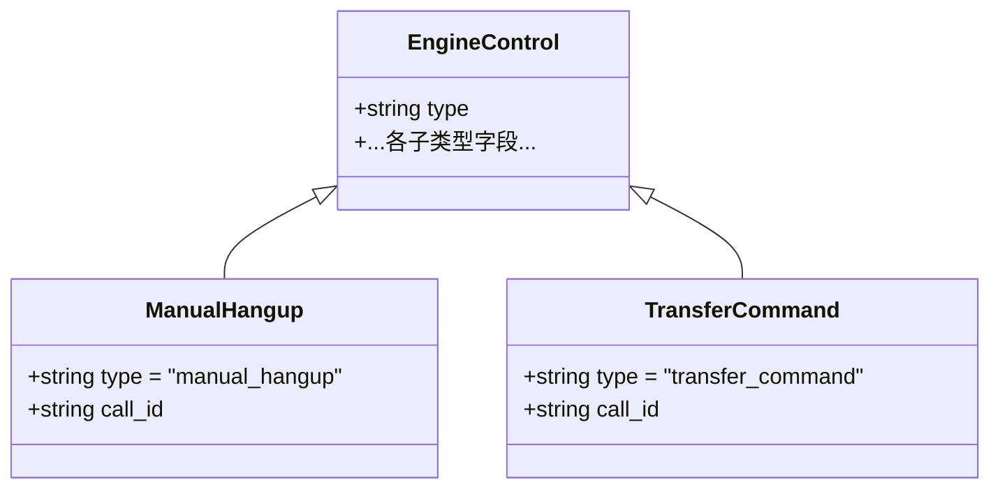
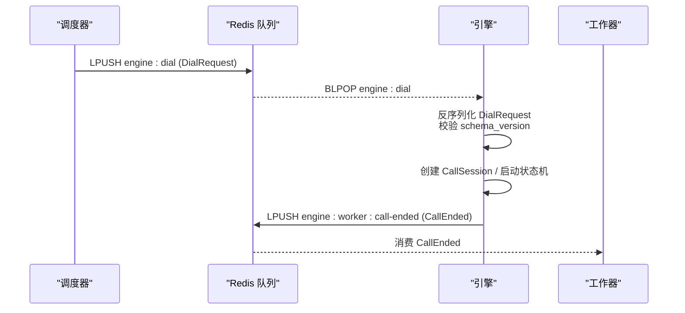
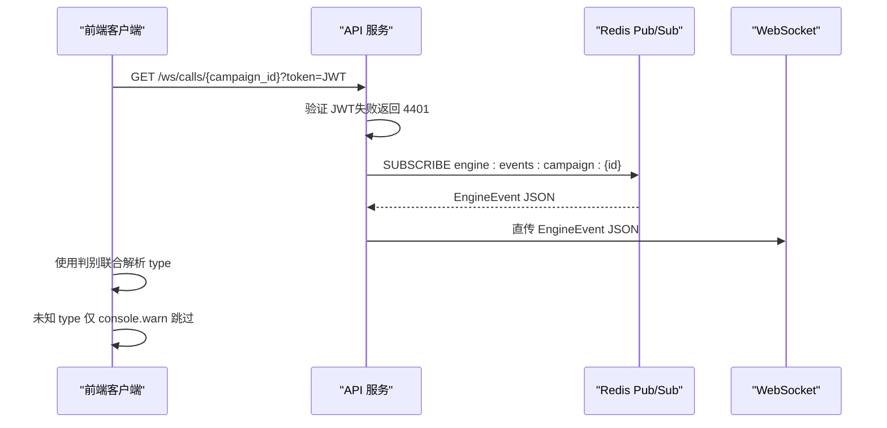
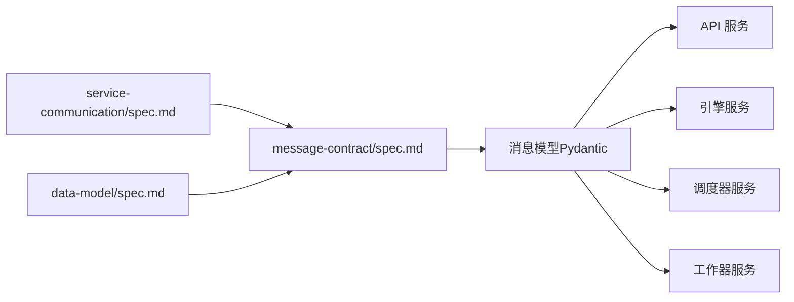
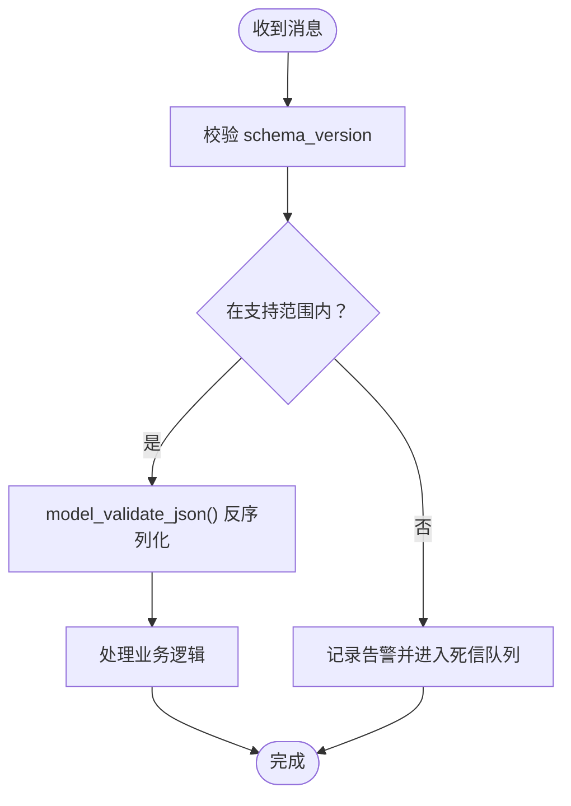

# 消息契约规范

<cite>
**本文档引用的文件**
- [message-contract/spec.md](file://openspec/specs/message-contract/spec.md)
- [service-communication/spec.md](file://openspec/specs/service-communication/spec.md)
- [data-model/spec.md](file://openspec/specs/data-model/spec.md)
- [2026-05-01-init-isales-common/tasks.md](file://openspec/changes/archive/2026-05-01-init-isales-common/tasks.md)
- [2026-05-07-impl-engine/proposal.md](file://openspec/changes/archive/2026-05-07-impl-engine/proposal.md)
- [2026-05-07-impl-engine/design.md](file://openspec/changes/archive/2026-05-07-impl-engine/design.md)
</cite>

## 目录
1. [引言](#引言)
2. [项目结构](#项目结构)
3. [核心组件](#核心组件)
4. [架构总览](#架构总览)
5. [详细组件分析](#详细组件分析)
6. [依赖分析](#依赖分析)
7. [性能考虑](#性能考虑)
8. [故障排查指南](#故障排查指南)
9. [结论](#结论)

## 引言
本规范定义 iSales 系统服务间通信的消息契约，聚焦 Redis 消息体的数据结构、序列化标准与演进策略。依据 OpenSpec 规范，所有跨服务的 Redis 消息体（队列消息与 Pub/Sub 事件）均在 isales-common 中以 Pydantic 模型集中定义，确保 producer/consumer 使用同一套模型，杜绝裸 dict 与平行结构，提升一致性与可维护性。

## 项目结构
- 消息契约与通道规范位于 openspec/specs 与 openspec/changes 下的相关 spec 文件中
- 消息模型的实现与任务清单在 archive 任务文档中有详细记录
- 服务间通信通道与前端 WebSocket 代理在 service-communication 中定义
- 数据模型与 JSONB 字段约束在 data-model 中定义

**图表来源**
- [message-contract/spec.md:1-85](file://openspec/specs/message-contract/spec.md#L1-L85)
- [service-communication/spec.md:1-150](file://openspec/specs/service-communication/spec.md#L1-L150)
- [data-model/spec.md:1-83](file://openspec/specs/data-model/spec.md#L1-L83)
- [2026-05-01-init-isales-common/tasks.md:68-78](file://openspec/changes/archive/2026-05-01-init-isales-common/tasks.md#L68-L78)
- [2026-05-07-impl-engine/proposal.md:92-105](file://openspec/changes/archive/2026-05-07-impl-engine/proposal.md#L92-L105)
- [2026-05-07-impl-engine/design.md:203-212](file://openspec/changes/archive/2026-05-07-impl-engine/design.md#L203-L212)

**章节来源**
- [message-contract/spec.md:1-85](file://openspec/specs/message-contract/spec.md#L1-L85)
- [service-communication/spec.md:1-150](file://openspec/specs/service-communication/spec.md#L1-L150)
- [data-model/spec.md:1-83](file://openspec/specs/data-model/spec.md#L1-L83)
- [2026-05-01-init-isales-common/tasks.md:68-78](file://openspec/changes/archive/2026-05-01-init-isales-common/tasks.md#L68-L78)
- [2026-05-07-impl-engine/proposal.md:92-105](file://openspec/changes/archive/2026-05-07-impl-engine/proposal.md#L92-L105)
- [2026-05-07-impl-engine/design.md:203-212](file://openspec/changes/archive/2026-05-07-impl-engine/design.md#L203-L212)

## 核心组件
- 消息基类 BaseMessage：统一 schema_version、message_id、created_at 字段，并提供便于日志追踪的字符串表示
- 关键消息类型：
  - DialRequest：调度器 → 引擎队列，携带线索信息、历史摘要、prompt_versions 快照与 caller_id
  - CallEnded：引擎 → 工作器队列，携带 call_record_id 与终止原因
  - EngineControl：API → 引擎 Pub/Sub，手动挂断/转人工指令（使用判别联合类型）
  - EngineEvent：引擎 → API Pub/Sub，状态变更、ASR 文本、transcript 增量（使用判别联合类型）
  - CampaignControl：API → 调度器队列，启动/暂停 campaign
- 序列化与可观测性：统一使用 Pydantic 的 model_dump_json，默认 JSON；日志包含 message_id 以便跨服务追踪

**章节来源**
- [message-contract/spec.md:25-51](file://openspec/specs/message-contract/spec.md#L25-L51)
- [2026-05-01-init-isales-common/tasks.md:68-78](file://openspec/changes/archive/2026-05-01-init-isales-common/tasks.md#L68-L78)
- [service-communication/spec.md:106-136](file://openspec/specs/service-communication/spec.md#L106-L136)

## 架构总览
消息在服务间的流转遵循“通道矩阵”与“判别联合类型”的契约，Producer 与 Consumer 通过 isales-common 的 Pydantic 模型进行序列化/反序列化，确保跨服务一致性与演进可控。

**图表来源**
- [service-communication/spec.md:11-24](file://openspec/specs/service-communication/spec.md#L11-L24)
- [message-contract/spec.md:43-51](file://openspec/specs/message-contract/spec.md#L43-L51)
- [2026-05-07-impl-engine/proposal.md:92-105](file://openspec/changes/archive/2026-05-07-impl-engine/proposal.md#L92-L105)

## 详细组件分析

### EngineEvent 判别联合类型
EngineEvent 采用判别联合类型（discriminated union），通过 type 字段区分不同事件子类型，前端与后端均需严格遵循该 union 的定义。新增事件类型必须通过 OpenSpec 变更同步到 isales-common 的 EngineEvent union，并在前端相应增加处理器，避免前端裸用未知 type 导致破坏性升级。

**图表来源**
- [message-contract/spec.md:49-50](file://openspec/specs/message-contract/spec.md#L49-L50)
- [2026-05-01-init-isales-common/tasks.md:74-74](file://openspec/changes/archive/2026-05-01-init-isales-common/tasks.md#L74-L74)
- [2026-05-07-impl-engine/proposal.md:92-95](file://openspec/changes/archive/2026-05-07-impl-engine/proposal.md#L92-L95)

**章节来源**
- [message-contract/spec.md:49-50](file://openspec/specs/message-contract/spec.md#L49-L50)
- [service-communication/spec.md:132-146](file://openspec/specs/service-communication/spec.md#L132-L146)
- [2026-05-01-init-isales-common/tasks.md:74-74](file://openspec/changes/archive/2026-05-01-init-isales-common/tasks.md#L74-L74)
- [2026-05-07-impl-engine/proposal.md:92-95](file://openspec/changes/archive/2026-05-07-impl-engine/proposal.md#L92-L95)

### EngineControl 判别联合类型
EngineControl 用于 API 对引擎的实时控制，包括手动挂断与转人工指令。该类型同样采用判别联合，consumer 必须严格匹配 type 字段并按子类型处理。

**图表来源**
- [message-contract/spec.md:49-49](file://openspec/specs/message-contract/spec.md#L49-L49)
- [2026-05-01-init-isales-common/tasks.md:73-73](file://openspec/changes/archive/2026-05-01-init-isales-common/tasks.md#L73-L73)
- [2026-05-07-impl-engine/proposal.md:97-100](file://openspec/changes/archive/2026-05-07-impl-engine/proposal.md#L97-L100)

**章节来源**
- [message-contract/spec.md:49-49](file://openspec/specs/message-contract/spec.md#L49-L49)
- [2026-05-01-init-isales-common/tasks.md:73-73](file://openspec/changes/archive/2026-05-01-init-isales-common/tasks.md#L73-L73)
- [2026-05-07-impl-engine/proposal.md:97-100](file://openspec/changes/archive/2026-05-07-impl-engine/proposal.md#L97-L100)

### DialRequest 与 CallEnded
- DialRequest：调度器向引擎派发拨号任务，消息体包含线索信息、历史摘要、prompt_versions 快照与 caller_id
- CallEnded：引擎在通话结束后向工作器派发处理任务，包含 call_record_id 与终止原因

**图表来源**
- [service-communication/spec.md:13-14](file://openspec/specs/service-communication/spec.md#L13-L14)
- [service-communication/spec.md:14-14](file://openspec/specs/service-communication/spec.md#L14-L14)
- [2026-05-07-impl-engine/proposal.md:12-16](file://openspec/changes/archive/2026-05-07-impl-engine/proposal.md#L12-L16)
- [2026-05-07-impl-engine/proposal.md:102-105](file://openspec/changes/archive/2026-05-07-impl-engine/proposal.md#L102-L105)
- [2026-05-07-impl-engine/design.md:205-211](file://openspec/changes/archive/2026-05-07-impl-engine/design.md#L205-L211)

**章节来源**
- [service-communication/spec.md:13-14](file://openspec/specs/service-communication/spec.md#L13-L14)
- [service-communication/spec.md:14-14](file://openspec/specs/service-communication/spec.md#L14-L14)
- [2026-05-07-impl-engine/proposal.md:12-16](file://openspec/changes/archive/2026-05-07-impl-engine/proposal.md#L12-L16)
- [2026-05-07-impl-engine/proposal.md:102-105](file://openspec/changes/archive/2026-05-07-impl-engine/proposal.md#L102-L105)
- [2026-05-07-impl-engine/design.md:205-211](file://openspec/changes/archive/2026-05-07-impl-engine/design.md#L205-L211)

### API ↔ 前端 WebSocket 代理
API 服务提供 /ws/calls/{campaign_id} WebSocket 端点，订阅 Redis Pub/Sub channel 并将 EngineEvent JSON 直传给前端。前端通过判别联合解析 type 字段，未知 type 仅警告跳过，避免整连接断开。

**图表来源**
- [service-communication/spec.md:106-136](file://openspec/specs/service-communication/spec.md#L106-L136)
- [service-communication/spec.md:137-146](file://openspec/specs/service-communication/spec.md#L137-L146)

**章节来源**
- [service-communication/spec.md:106-136](file://openspec/specs/service-communication/spec.md#L106-L136)
- [service-communication/spec.md:137-146](file://openspec/specs/service-communication/spec.md#L137-L146)

## 依赖分析
- 消息契约依赖于 service-communication 的通道矩阵，确保 isales-common 的消息 schema 覆盖所有标注为“含消息体”的跨服务通道
- 数据模型与 JSONB 字段约束由 data-model 规范定义，消息中的复杂字段（如 transcript、pipeline_trace）应遵循对应 capability spec 的 JSON Schema

**图表来源**
- [service-communication/spec.md:39-41](file://openspec/specs/service-communication/spec.md#L39-L41)
- [message-contract/spec.md:39-41](file://openspec/specs/message-contract/spec.md#L39-L41)
- [data-model/spec.md:61-74](file://openspec/specs/data-model/spec.md#L61-L74)

**章节来源**
- [service-communication/spec.md:39-41](file://openspec/specs/service-communication/spec.md#L39-L41)
- [message-contract/spec.md:39-41](file://openspec/specs/message-contract/spec.md#L39-L41)
- [data-model/spec.md:61-74](file://openspec/specs/data-model/spec.md#L61-L74)

## 性能考虑
- 序列化与传输：建议 v1 全部使用 JSON（便于调试），后续按需优化
- 队列与 Pub/Sub 边界：队列用于“必须送达”的工作派发，Pub/Sub 用于“实时、可丢失”的事件广播，避免不必要的阻塞
- 并发控制：全局并发使用 Redis 原子计数器，避免本地内存计数器替代

**章节来源**
- [service-communication/spec.md:147-149](file://openspec/specs/service-communication/spec.md#L147-L149)
- [service-communication/spec.md:31-44](file://openspec/specs/service-communication/spec.md#L31-L44)
- [service-communication/spec.md:45-62](file://openspec/specs/service-communication/spec.md#L45-L62)

## 故障排查指南
- 消息版本不兼容：consumer 反序列化时校验 schema_version，不在支持范围内的版本应显式日志告警并按死信队列处理，不得静默丢弃
- 日志追踪：关键日志需包含 message_id，便于跨服务排查
- 通道与协议：确保使用通道矩阵中定义的通道与协议风格，新增通道需经 OpenSpec 变更提案
- 容错策略：Redis/PostgreSQL/modem-controller 短暂不可用时，服务应重连重试并优雅清理受影响的 call_session

**图表来源**
- [message-contract/spec.md:34-38](file://openspec/specs/message-contract/spec.md#L34-L38)
- [message-contract/spec.md:76-84](file://openspec/specs/message-contract/spec.md#L76-L84)

**章节来源**
- [message-contract/spec.md:34-38](file://openspec/specs/message-contract/spec.md#L34-L38)
- [message-contract/spec.md:76-84](file://openspec/specs/message-contract/spec.md#L76-L84)
- [service-communication/spec.md:87-105](file://openspec/specs/service-communication/spec.md#L87-L105)

## 结论
通过集中定义消息模型、强制使用判别联合类型、严格的版本管理与可观测性要求，iSales 的消息契约规范确保了服务间通信的一致性、可演进性与可维护性。遵循本规范与 OpenSpec 变更流程，可在不破坏现有系统的情况下安全地引入新消息类型与演进既有消息结构。