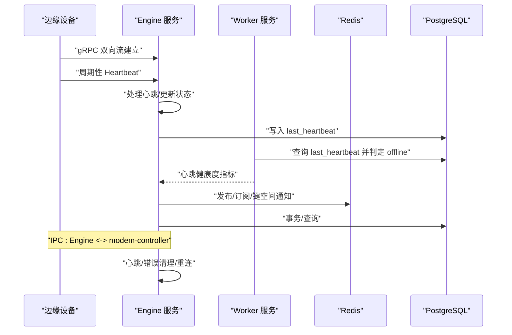
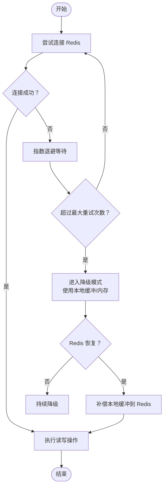
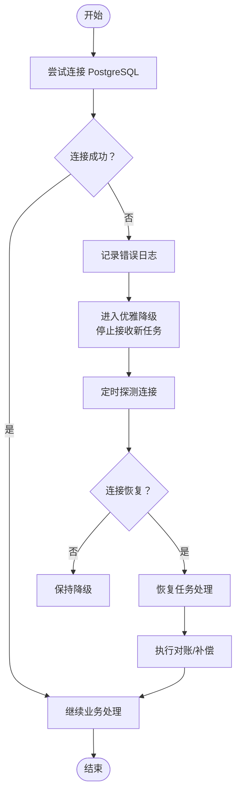
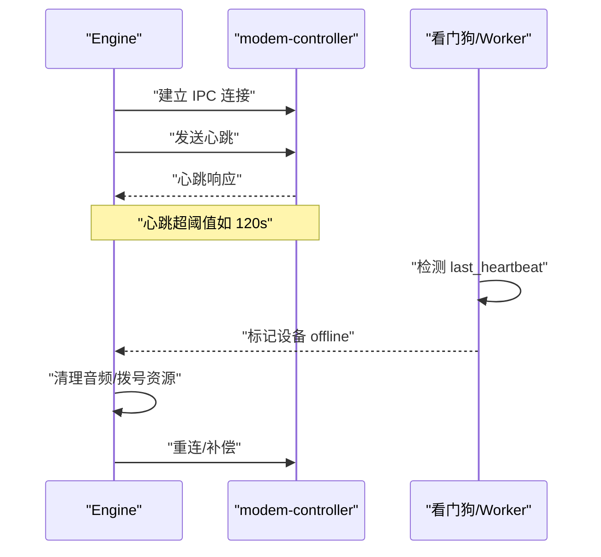
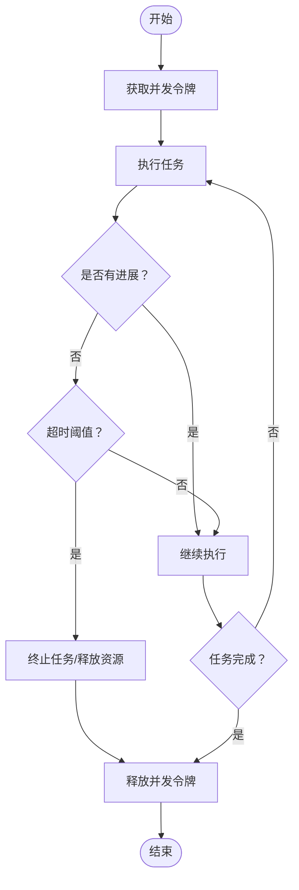
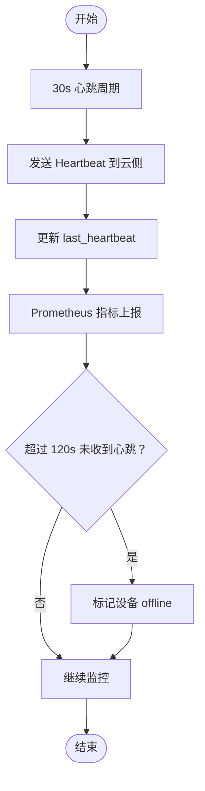
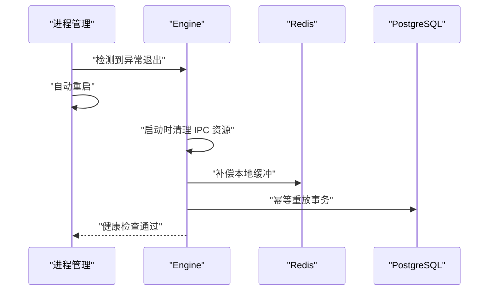
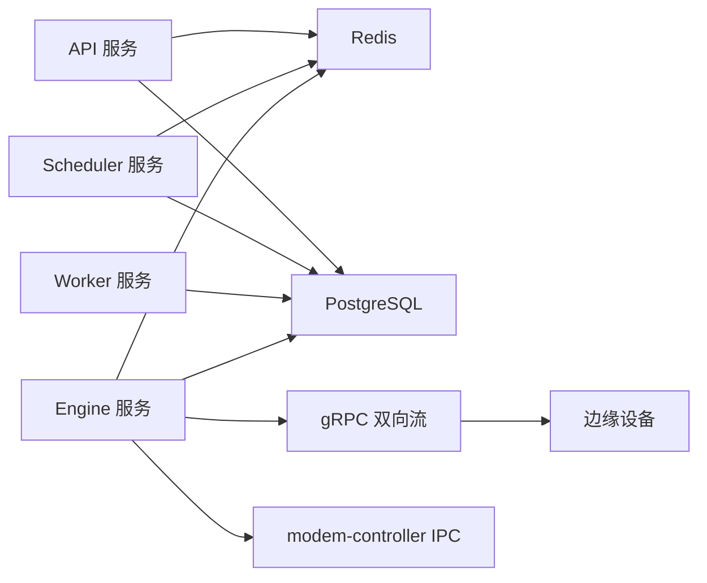

# 通信容错机制

<cite>
**本文引用的文件**
- [deploy/cloud/env/api.env](file://deploy/cloud/env/api.env)
- [deploy/cloud/env/engine.env](file://deploy/cloud/env/engine.env)
- [deploy/cloud/env/scheduler.env](file://deploy/cloud/env/scheduler.env)
- [deploy/cloud/env/worker.env](file://deploy/cloud/env/worker.env)
- [deploy/env/modem-controller.env.example](file://deploy/env/modem-controller.env.example)
- [deploy/cloud/monitoring/alert_rules.yml.example](file://deploy/cloud/monitoring/alert_rules.yml.example)
- [deploy/cloud/monitoring/prometheus.yml.example](file://deploy/cloud/monitoring/prometheus.yml.example)
- [openspec/changes/arch-cloud-edge-split/specs/service-communication/spec.md](file://openspec/changes/arch-cloud-edge-split/specs/service-communication/spec.md)
- [openspec/changes/arch-cloud-edge-split/specs/device-hardware/spec.md](file://openspec/changes/arch-cloud-edge-split/specs/device-hardware/spec.md)
- [openspec/changes/arch-cloud-edge-split/tasks.md](file://openspec/changes/arch-cloud-edge-split/tasks.md)
- [openspec/changes/cloud-edge-grpc-keepalive/specs/service-communication/spec.md](file://openspec/changes/cloud-edge-grpc-keepalive/specs/service-communication/spec.md)
- [deploy/RUNBOOK-cloud.md](file://deploy/RUNBOOK-cloud.md)
- [openspec/changes/arch-cloud-edge-split/design.md](file://openspec/changes/arch-cloud-edge-split/design.md)
- [openspec/changes/arch-cloud-edge-split/proposal.md](file://openspec/changes/arch-cloud-edge-split/proposal.md)
- [openspec/changes/archive/2026-05-06-impl-telephony/design.md](file://openspec/changes/archive/2026-05-06-impl-telephony/design.md)
- [deploy/cloud/nginx/isales.conf](file://deploy/cloud/nginx/isales.conf)
</cite>

## 目录
1. [引言](#引言)
2. [项目结构](#项目结构)
3. [核心组件](#核心组件)
4. [架构总览](#架构总览)
5. [详细组件分析](#详细组件分析)
6. [依赖关系分析](#依赖关系分析)
7. [性能考虑](#性能考虑)
8. [故障排查指南](#故障排查指南)
9. [结论](#结论)
10. [附录](#附录)

## 引言
本文件聚焦 iSales 系统的通信容错机制，覆盖以下关键场景：
- Redis 短暂不可用的重连与重试策略
- PostgreSQL 连接失败的优雅降级与恢复
- modem-controller 与 engine 之间 IPC 中断的清理与恢复
- 全局并发控制的防泄漏机制
- 定期对账与心跳检测方案
- 服务实例异常崩溃时的清理流程与数据一致性保障

上述能力在多处设计文档与监控告警模板中得到明确规范，并在云-边 gRPC 控制面、设备硬件与 Telephony 子系统中协同实现。

## 项目结构
围绕通信容错的关键目录与文件：
- 部署与环境配置：各服务的数据库与缓存连接字符串、令牌与密钥、gRPC 绑定地址、心跳与并发参数等
- 通信与设备硬件规范：云-边 gRPC 控制面、心跳与离线判定、IPC 通信契约
- 监控与告警：Prometheus 指标与告警规则，用于心跳缺失与连接异常的观测与告警
- 运行手册：数据库连接失败的诊断步骤与建议

```mermaid
graph TB
subgraph "云侧服务"
API["API 服务<br/>数据库/缓存连接"]
ENGINE["Engine 服务<br/>gRPC 服务器/心跳/并发"]
SCHED["Scheduler 服务<br/>队列/批处理/并发"]
WORKER["Worker 服务<br/>设备看门狗/对账"]
end
subgraph "边缘侧"
EDGE["边缘设备<br/>设备状态/心跳"]
end
subgraph "硬件与IPC"
MODEM["modem-controller<br/>Unix Socket IPC"]
end
REDIS["Redis 缓存"]
PG["PostgreSQL 数据库"]
ENGINE --- REDIS
API --- REDIS
SCHED --- REDIS
WORKER --- PG
ENGINE --- PG
API --- PG
SCHED --- PG
ENGINE <-- "gRPC 双向流">--- EDGE
ENGINE --- MODEM
MODEM --- EDGE
```

**章节来源**
- [deploy/cloud/env/api.env:1-18](file://deploy/cloud/env/api.env#L1-L18)
- [deploy/cloud/env/engine.env:1-62](file://deploy/cloud/env/engine.env#L1-L62)
- [deploy/cloud/env/scheduler.env:1-17](file://deploy/cloud/env/scheduler.env#L1-L17)
- [deploy/cloud/env/worker.env:1-17](file://deploy/cloud/env/worker.env#L1-L17)
- [deploy/env/modem-controller.env.example:1-15](file://deploy/env/modem-controller.env.example#L1-L15)

## 核心组件
- 云-边 gRPC 控制面：Engine 作为服务端，边缘设备作为客户端，使用 bearer token 认证与长连接双向流，周期性发送心跳，支持断线重连与本地缓冲补发
- 设备硬件与看门狗：边缘设备上报心跳，云侧 Worker 基于 last_heartbeat 超阈值将设备置为 offline，避免状态反转由心跳触发
- IPC 通信：Engine 与 modem-controller 通过 Unix Socket 交互，提供拨号、挂断与音频通道，支持心跳与错误清理
- 缓存与数据库：统一的 Redis/PG 连接字符串与密钥，确保跨服务一致性；数据库连接失败时采用优雅降级与重试

**章节来源**
- [openspec/changes/arch-cloud-edge-split/specs/service-communication/spec.md:114-123](file://openspec/changes/arch-cloud-edge-split/specs/service-communication/spec.md#L114-L123)
- [openspec/changes/arch-cloud-edge-split/specs/device-hardware/spec.md:125-130](file://openspec/changes/arch-cloud-edge-split/specs/device-hardware/spec.md#L125-L130)
- [openspec/changes/arch-cloud-edge-split/tasks.md:43-50](file://openspec/changes/arch-cloud-edge-split/tasks.md#L43-L50)
- [openspec/changes/arch-cloud-edge-split/tasks.md:97-100](file://openspec/changes/arch-cloud-edge-split/tasks.md#L97-L100)

## 架构总览
下图展示云-边控制面、心跳与 IPC 的整体交互，以及 Redis/PG 的依赖关系。



**图表来源**
- [openspec/changes/arch-cloud-edge-split/specs/service-communication/spec.md:114-123](file://openspec/changes/arch-cloud-edge-split/specs/service-communication/spec.md#L114-L123)
- [openspec/changes/arch-cloud-edge-split/specs/device-hardware/spec.md:125-130](file://openspec/changes/arch-cloud-edge-split/specs/device-hardware/spec.md#L125-L130)
- [openspec/changes/arch-cloud-edge-split/tasks.md:97-100](file://openspec/changes/arch-cloud-edge-split/tasks.md#L97-L100)

**章节来源**
- [openspec/changes/arch-cloud-edge-split/specs/service-communication/spec.md:15-16](file://openspec/changes/arch-cloud-edge-split/specs/service-communication/spec.md#L15-L16)
- [openspec/changes/arch-cloud-edge-split/design.md:143-165](file://openspec/changes/arch-cloud-edge-split/design.md#L143-L165)

## 详细组件分析

### Redis 短暂不可用的重连与重试机制
- 连接与认证：各服务通过统一的 Redis URL 连接本地实例，URL 中包含认证信息，确保连接安全
- 重连策略：在连接失败或网络抖动时，应具备指数退避与最大重试次数限制，避免“惊群效应”
- 重试范围：对关键写操作（如发布/订阅、键空间通知、计数器/锁）进行幂等重试；对读操作可采用快速失败并降级
- 降级与隔离：当 Redis 不可用时，将相关功能切换至本地内存或磁盘缓冲，待恢复后批量补偿



**章节来源**
- [deploy/cloud/env/api.env:6-7](file://deploy/cloud/env/api.env#L6-L7)
- [deploy/cloud/env/engine.env:4-5](file://deploy/cloud/env/engine.env#L4-L5)
- [deploy/cloud/env/scheduler.env:4-5](file://deploy/cloud/env/scheduler.env#L4-L5)
- [deploy/cloud/env/worker.env:7-8](file://deploy/cloud/env/worker.env#L7-L8)

### PostgreSQL 连接失败的优雅降级与恢复
- 连接字符串：各服务使用统一的 asyncpg 连接字符串，包含主机、端口、数据库名与密码
- 优雅降级：当连接失败时，拒绝新任务进入队列，返回“服务不可用”错误；对已有事务进行回滚或中止
- 恢复策略：定时探测连接可用性，成功后逐步恢复任务处理；对长时间不可用的场景，记录日志并触发告警
- 对账与一致性：在恢复后执行增量对账，确保状态与数据库一致



**章节来源**
- [deploy/cloud/env/api.env:6](file://deploy/cloud/env/api.env#L6-L6)
- [deploy/cloud/env/engine.env:4](file://deploy/cloud/env/engine.env#L4-L4)
- [deploy/cloud/env/scheduler.env:4](file://deploy/cloud/env/scheduler.env#L4-L4)
- [deploy/cloud/env/worker.env:7](file://deploy/cloud/env/worker.env#L7-L7)

### modem-controller IPC 中断的清理与恢复
- IPC 通信：Engine 与 modem-controller 通过 Unix Socket 通信，提供拨号、挂断与音频通道
- 心跳与健康检查：IPC 心跳用于检测对方存活，若超时未收到心跳，触发清理流程
- 清理策略：关闭音频通道、释放拨号资源、重置设备状态；在恢复后重建连接并补偿未完成的呼叫
- 设备状态：心跳超阈值（例如 120 秒）将设备置为 offline，避免状态反转由心跳触发



**章节来源**
- [openspec/changes/arch-cloud-edge-split/specs/service-communication/spec.md:15-16](file://openspec/changes/arch-cloud-edge-split/specs/service-communication/spec.md#L15-L16)
- [openspec/changes/arch-cloud-edge-split/specs/device-hardware/spec.md:125-130](file://openspec/changes/arch-cloud-edge-split/specs/device-hardware/spec.md#L125-L130)
- [openspec/changes/archive/2026-05-06-impl-telephony/design.md:26](file://openspec/changes/archive/2026-05-06-impl-telephony/design.md#L26-L26)

### 全局并发控制的防泄漏机制
- 并发上限：通过 MAX_CONCURRENCY 控制全局并发，避免资源耗尽
- 超时与优雅停机：引擎设置默认超时与优雅停机窗口，防止任务长期占用资源
- 泄漏防护：对长时间无进度的任务进行强制终止与清理，释放锁与缓冲区



**章节来源**
- [deploy/cloud/env/scheduler.env:11-14](file://deploy/cloud/env/scheduler.env#L11-L14)
- [deploy/cloud/env/engine.env:57-59](file://deploy/cloud/env/engine.env#L57-L59)

### 定期对账与心跳检测方案
- 心跳频率：30 秒一次，与现有硬件心跳节拍一致
- 离线阈值：120 秒无心跳视为离线，云侧 Worker 将设备状态置为 offline
- 指标与告警：Prometheus 指标记录自上次心跳以来的秒数，告警规则在超过阈值时触发
- 查询与修复：提供 SQL 查询 last_heartbeat 的视图，便于人工巡检与修复



**章节来源**
- [openspec/changes/arch-cloud-edge-split/design.md:143-165](file://openspec/changes/arch-cloud-edge-split/design.md#L143-L165)
- [openspec/changes/arch-cloud-edge-split/tasks.md:97-100](file://openspec/changes/arch-cloud-edge-split/tasks.md#L97-L100)
- [deploy/cloud/monitoring/alert_rules.yml.example:15-20](file://deploy/cloud/monitoring/alert_rules.yml.example#L15-L20)
- [deploy/RUNBOOK-cloud.md:330-333](file://deploy/RUNBOOK-cloud.md#L330-L333)

### 服务实例异常崩溃时的清理流程与数据一致性
- 崩溃检测：通过 systemd/launchd 管理的服务进程监控，发现异常退出时自动重启
- IPC 清理：Engine 在重启前清理音频通道与拨号资源，避免遗留句柄导致资源泄漏
- 数据一致性：重启后执行补偿逻辑，将本地缓冲中的消息补发至 Redis/PG；对数据库事务进行幂等重放
- 告警与恢复：Prometheus 告警规则在服务不可用时触发，运维人员可结合日志与对账脚本进行恢复



**章节来源**
- [openspec/changes/arch-cloud-edge-split/proposal.md:37](file://openspec/changes/arch-cloud-edge-split/proposal.md#L37-L37)
- [openspec/changes/cloud-edge-grpc-keepalive/specs/service-communication/spec.md:1-20](file://openspec/changes/cloud-edge-grpc-keepalive/specs/service-communication/spec.md#L1-L20)

## 依赖关系分析
- 服务间依赖：API/Scheduler/Worker/Engine 均依赖 Redis 与 PostgreSQL；Engine 与边缘设备通过 gRPC 双向流通信；Engine 与 modem-controller 通过 IPC 通信
- 外部依赖：gRPC 服务器绑定公网接口，Nginx 提供长连接超时配置以适配心跳周期
- 监控依赖：Prometheus 指标与告警规则依赖心跳与连接状态



**图表来源**
- [deploy/cloud/env/api.env:6-7](file://deploy/cloud/env/api.env#L6-L7)
- [deploy/cloud/env/engine.env:4-5](file://deploy/cloud/env/engine.env#L4-L5)
- [deploy/cloud/env/scheduler.env:4-5](file://deploy/cloud/env/scheduler.env#L4-L5)
- [deploy/env/modem-controller.env.example:9-10](file://deploy/env/modem-controller.env.example#L9-L10)
- [deploy/cloud/nginx/isales.conf:83](file://deploy/cloud/nginx/isales.conf#L83-L83)

**章节来源**
- [deploy/cloud/env/api.env:1-18](file://deploy/cloud/env/api.env#L1-L18)
- [deploy/cloud/env/engine.env:1-62](file://deploy/cloud/env/engine.env#L1-L62)
- [deploy/cloud/env/scheduler.env:1-17](file://deploy/cloud/env/scheduler.env#L1-L17)
- [deploy/cloud/env/worker.env:1-17](file://deploy/cloud/env/worker.env#L1-L17)
- [deploy/env/modem-controller.env.example:1-15](file://deploy/env/modem-controller.env.example#L1-L15)
- [deploy/cloud/nginx/isales.conf:83](file://deploy/cloud/nginx/isales.conf#L83-L83)

## 性能考虑
- gRPC 超时与心跳：Nginx 配置为长连接保留足够超时时间，以适应 30 秒心跳周期
- 并发与吞吐：MAX_CONCURRENCY 与引擎超时参数需根据硬件与网络条件调优，避免过载
- 缓存与数据库：热点数据尽量走 Redis，冷数据走 PG；对高频写操作采用批量与去抖策略

**章节来源**
- [deploy/cloud/nginx/isales.conf:83](file://deploy/cloud/nginx/isales.conf#L83-L83)
- [deploy/cloud/env/scheduler.env:11-14](file://deploy/cloud/env/scheduler.env#L11-L14)
- [deploy/cloud/env/engine.env:57-59](file://deploy/cloud/env/engine.env#L57-L59)

## 故障排查指南
- PostgreSQL 连接失败
  - 使用 systemd 状态检查与日志查看，定位磁盘空间与最近日志
  - 参考运行手册中的诊断步骤
- Redis 连接失败
  - 检查 Redis 服务状态与认证信息是否正确
  - 观察补偿与降级流程是否生效
- IPC 中断
  - 检查 Unix Socket 权限与路径
  - 关注心跳超时与设备离线状态
- 心跳缺失
  - 查看 Prometheus 指标与告警规则
  - 使用提供的查询语句核对 last_heartbeat

**章节来源**
- [deploy/RUNBOOK-cloud.md:166](file://deploy/RUNBOOK-cloud.md#L166-L166)
- [deploy/cloud/monitoring/alert_rules.yml.example:15-20](file://deploy/cloud/monitoring/alert_rules.yml.example#L15-L20)
- [deploy/RUNBOOK-cloud.md:330-333](file://deploy/RUNBOOK-cloud.md#L330-L333)

## 结论
iSales 的通信容错机制通过“云-边 gRPC 控制面 + 心跳与看门狗 + IPC 健康检查 + 缓存/数据库优雅降级 + 并发与超时控制 + 监控告警”的组合，实现了在复杂网络与硬件环境下稳定的服务交付。建议在生产环境中持续优化超时与并发参数，完善补偿与对账流程，并加强自动化恢复与告警联动。

## 附录
- 关键环境变量与参数位置
  - Redis/PG 连接字符串与密钥：[deploy/cloud/env/api.env:6-7](file://deploy/cloud/env/api.env#L6-L7)、[deploy/cloud/env/engine.env:4-5](file://deploy/cloud/env/engine.env#L4-L5)、[deploy/cloud/env/scheduler.env:4-5](file://deploy/cloud/env/scheduler.env#L4-L5)、[deploy/cloud/env/worker.env:7-8](file://deploy/cloud/env/worker.env#L7-L8)
  - gRPC 绑定与设备 ID：[deploy/cloud/env/engine.env:52-53](file://deploy/cloud/env/engine.env#L52-L53)
  - 心跳与离线阈值：[openspec/changes/arch-cloud-edge-split/design.md:143-165](file://openspec/changes/arch-cloud-edge-split/design.md#L143-L165)
  - IPC Socket 路径：[deploy/env/modem-controller.env.example:9-10](file://deploy/env/modem-controller.env.example#L9-L10)
  - 并发与超时：[deploy/cloud/env/scheduler.env:11-14](file://deploy/cloud/env/scheduler.env#L11-L14)、[deploy/cloud/env/engine.env:57-59](file://deploy/cloud/env/engine.env#L57-L59)
  - 监控与告警：[deploy/cloud/monitoring/alert_rules.yml.example:15-20](file://deploy/cloud/monitoring/alert_rules.yml.example#L15-L20)、[deploy/cloud/monitoring/prometheus.yml.example:32](file://deploy/cloud/monitoring/prometheus.yml.example#L32-L32)