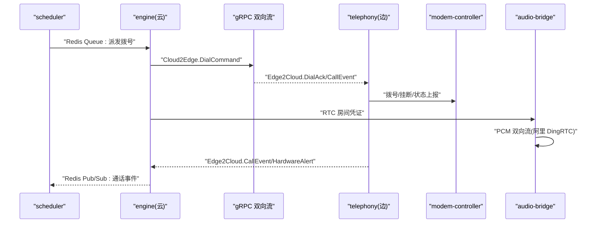
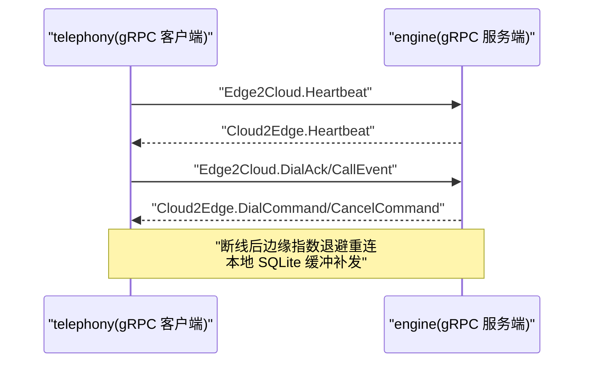
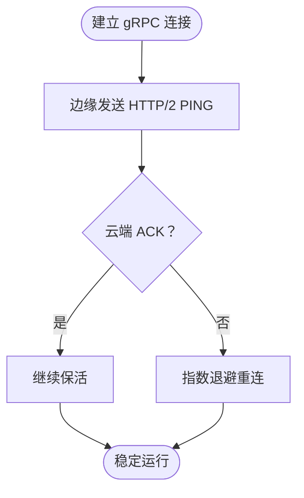
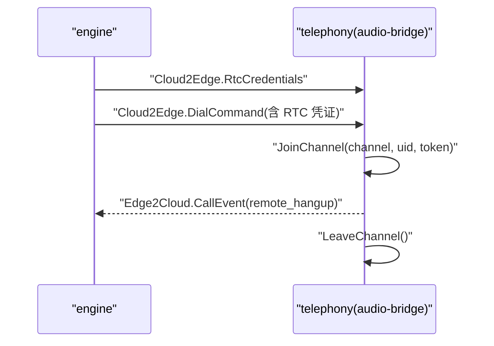

# 通信通道矩阵

<cite>
**本文引用的文件**
- [service-communication/spec.md](file://openspec/specs/service-communication/spec.md)
- [arch-cloud-edge-split/spec.md](file://openspec/changes/arch-cloud-edge-split/specs/service-communication/spec.md)
- [cloud-edge-grpc-keepalive/spec.md](file://openspec/changes/cloud-edge-grpc-keepalive/specs/service-communication/spec.md)
- [engine-rtc-dingrtc-migration/spec.md](file://openspec/changes/engine-rtc-dingrtc-migration/specs/service-communication/spec.md)
- [isales-api.service](file://deploy/cloud/systemd/isales-api.service)
- [isales-engine.service](file://deploy/cloud/systemd/isales-engine.service)
- [isales-scheduler.service](file://deploy/cloud/systemd/isales-scheduler.service)
- [isales-worker.service](file://deploy/cloud/systemd/isales-worker.service)
- [com.isales.telephony.plist](file://deploy/edge/launchd/com.isales.telephony.plist)
- [api.env](file://deploy/cloud/env/api.env)
- [engine.env](file://deploy/cloud/env/engine.env)
- [scheduler.env](file://deploy/cloud/env/scheduler.env)
- [worker.env](file://deploy/cloud/env/worker.env)
- [edge.env.example](file://deploy/edge/env/edge.env.example)
</cite>

## 目录
1. [引言](#引言)
2. [项目结构](#项目结构)
3. [核心组件](#核心组件)
4. [架构总览](#架构总览)
5. [详细组件分析](#详细组件分析)
6. [依赖分析](#依赖分析)
7. [性能考虑](#性能考虑)
8. [故障排查指南](#故障排查指南)
9. [结论](#结论)
10. [附录](#附录)

## 引言
本文件基于 iSales 开放规范（OpenSpec）定义的“服务通信通道矩阵”，系统化梳理 7 个核心服务之间的通信方式、适用场景、性能特征与可靠性保障，并给出通道选型一致性原则与变更流程，帮助团队在设计与实现中统一标准、避免引入未列通道类型。

## 项目结构
围绕通信通道矩阵，iSales 采用“云-边分离”的部署拓扑：
- 云内服务：api、engine、scheduler、worker
- 边缘服务：telephony（含 modem-controller、audio-bridge、cloud-edge gRPC client、telephony-api loopback）
- 通信边界：云内使用 Redis 队列/发布订阅；云-边使用 gRPC 双向流 + 阿里 DingRTC 媒体会话

```mermaid
graph TB
subgraph "云内"
API["isales-api"]
ENGINE["isales-engine"]
SCHED["isales-scheduler"]
WORKER["isales-worker"]
REDIS["Redis"]
PG["PostgreSQL"]
end
subgraph "边缘"
EDGE["isales-telephony<br/>modem-controller / audio-bridge / gRPC client / telephony-api"]
MODEM["USB GSM Modem"]
AUDIO["本地音频设备"]
SQLITE["边缘本地 SQLite 缓冲"]
end
SCHED --> |"Redis Queue"| ENGINE
ENGINE --> |"Redis Queue"| WORKER
API --> |"Redis Pub/Sub"| ENGINE
ENGINE --> |"Redis Pub/Sub"| API
API --> |"Redis Queue"| SCHED
ENGINE < --> |"gRPC 双向流"| EDGE
ENGINE < --> |"阿里 DingRTC PaaS"| EDGE
EDGE --> |"AT 命令/音频"| MODEM
EDGE --> |"本地缓冲"| SQLITE
API --> |"WebSocket"| WEB["前端 isales-web"]
ENGINE --> PG
ENGINE --> REDIS
API --> REDIS
SCHED --> REDIS
WORKER --> REDIS
```

图示来源
- [arch-cloud-edge-split/spec.md:7-21](file://openspec/changes/arch-cloud-edge-split/specs/service-communication/spec.md#L7-L21)
- [isales-api.service:10](file://deploy/cloud/systemd/isales-api.service#L10)
- [isales-engine.service:12](file://deploy/cloud/systemd/isales-engine.service#L12)
- [isales-scheduler.service:10](file://deploy/cloud/systemd/isales-scheduler.service#L10)
- [isales-worker.service:10](file://deploy/cloud/systemd/isales-worker.service#L10)
- [com.isales.telephony.plist:6-10](file://deploy/edge/launchd/com.isales.telephony.plist#L6-L10)

章节来源
- [arch-cloud-edge-split/spec.md:7-21](file://openspec/changes/arch-cloud-edge-split/specs/service-communication/spec.md#L7-L21)
- [isales-api.service:10](file://deploy/cloud/systemd/isales-api.service#L10)
- [isales-engine.service:12](file://deploy/cloud/systemd/isales-engine.service#L12)
- [isales-scheduler.service:10](file://deploy/cloud/systemd/isales-scheduler.service#L10)
- [isales-worker.service:10](file://deploy/cloud/systemd/isales-worker.service#L10)
- [com.isales.telephony.plist:6-10](file://deploy/edge/launchd/com.isales.telephony.plist#L6-L10)

## 核心组件
- 云内服务职责
  - api：对外 HTTP + WebSocket，实时事件代理；内部通过 Redis Pub/Sub 与 engine 交互
  - engine：实时引擎，负责并发控制、云-边 gRPC 服务端、阿里 DingRTC 媒体会话
  - scheduler：线索派发器，使用 Redis 队列向 engine 派发任务
  - worker：异步后处理器，接收 engine 结束事件并处理后续业务
- 边缘服务职责
  - telephony：统一入口，承载 modem-controller、audio-bridge、cloud-edge gRPC 客户端、telephony-api loopback
  - modem-controller：物理设备控制（AT 命令、音频）、与边缘本地 SQLite 缓冲交互
  - audio-bridge：与阿里 DingRTC PaaS 会话桥接，完成 PCM 双向流
  - telephony-api：本地查询接口（仅限回环）

章节来源
- [arch-cloud-edge-split/spec.md:7-21](file://openspec/changes/arch-cloud-edge-split/specs/service-communication/spec.md#L7-L21)
- [com.isales.telephony.plist:6-10](file://deploy/edge/launchd/com.isales.telephony.plist#L6-L10)

## 架构总览
云-边通信采用双通道：
- 控制面：gRPC 双向流，承载拨号/取消/心跳/硬件告警/配置更新/RTC 凭证等
- 媒体面：阿里 DingRTC PaaS，承载 PCM 双向音频流



图示来源
- [arch-cloud-edge-split/spec.md:14-18](file://openspec/changes/arch-cloud-edge-split/specs/service-communication/spec.md#L14-L18)
- [engine-rtc-dingrtc-migration/spec.md:3-5](file://openspec/changes/engine-rtc-dingrtc-migration/specs/service-communication/spec.md#L3-L5)

章节来源
- [arch-cloud-edge-split/spec.md:14-18](file://openspec/changes/arch-cloud-edge-split/specs/service-communication/spec.md#L14-L18)
- [engine-rtc-dingrtc-migration/spec.md:3-5](file://openspec/changes/engine-rtc-dingrtc-migration/specs/service-communication/spec.md#L3-L5)

## 详细组件分析

### 通道矩阵与用途
- 云内队列/发布订阅
  - scheduler → engine：Redis Queue（派发“拨打这条线索”）
  - engine → worker：Redis Queue（通话结束处理）
  - api ↔ engine：Redis Pub/Sub（实时控制/事件推送）
  - api → scheduler：Redis Queue（启动/暂停 Campaign）
- 云-边通信
  - engine ↔ telephony：gRPC 双向流（拨号/取消/心跳/硬件告警/配置/RTC 凭证）
  - engine ↔ telephony：阿里 DingRTC PaaS（PCM 双向音频）
- 边缘本地通信
  - modem-controller ↔ telephony：Unix socket/WebSocket（拨号/挂断/PCM 音频流）
  - modem-controller ↔ telephony DB：直连（设备/ SIM 状态回写）
  - modem-controller ↔ USB GSM modem：AT 命令 + 音频（ALSA/macOS 音频）
- 外部集成
  - worker → 外部：HTTP（Webhook 回调）

章节来源
- [service-communication/spec.md:11-24](file://openspec/specs/service-communication/spec.md#L11-L24)
- [arch-cloud-edge-split/spec.md:7-21](file://openspec/changes/arch-cloud-edge-split/specs/service-communication/spec.md#L7-L21)

### 通道选型一致性原则
- 新服务间调用必须复用既有通道与协议风格；新增通道需经 OpenSpec 变更提案论证
- 云-边通信仅允许 gRPC 双向流与阿里 DingRTC PaaS，禁止在云-边引入 HTTP/Redis 直连
- 云内 Pub/Sub 不得跨云-边转发；实时控制需由 engine 内部转译为 Cloud2Edge 消息

章节来源
- [service-communication/spec.md:26-29](file://openspec/specs/service-communication/spec.md#L26-L29)
- [arch-cloud-edge-split/spec.md:23-31](file://openspec/changes/arch-cloud-edge-split/specs/service-communication/spec.md#L23-L31)
- [arch-cloud-edge-split/spec.md:47-50](file://openspec/changes/arch-cloud-edge-split/specs/service-communication/spec.md#L47-L50)

### 变更流程
- 任何通道类型的引入或调整，必须通过 OpenSpec 变更提案，明确论证必要性、性能与可靠性影响
- 变更需覆盖消息契约、序列化格式、鉴权与安全、容错与重试策略、监控与可观测性

章节来源
- [service-communication/spec.md:26-29](file://openspec/specs/service-communication/spec.md#L26-L29)
- [arch-cloud-edge-split/spec.md:23-26](file://openspec/changes/arch-cloud-edge-split/specs/service-communication/spec.md#L23-L26)

### 队列与发布订阅边界
- Redis Queue：必须送达、可异步处理（工作派发）
- Redis Pub/Sub：实时、可丢失（事件广播）
- 云内使用；云-边禁止直接转发 Pub/Sub

章节来源
- [service-communication/spec.md:31-44](file://openspec/specs/service-communication/spec.md#L31-L44)
- [arch-cloud-edge-split/spec.md:33-46](file://openspec/changes/arch-cloud-edge-split/specs/service-communication/spec.md#L33-L46)

### HTTP 调用规范
- 云内服务间同步 HTTP 仅限 scheduler → telephony-api（v1.0 云-边拆分后已取消）
- 边缘 telephony-api 仅提供本地查询接口（回环/内网监听）
- 外部 webhook 通过 HTTP

章节来源
- [service-communication/spec.md:64-77](file://openspec/specs/service-communication/spec.md#L64-L77)
- [arch-cloud-edge-split/spec.md:52-70](file://openspec/changes/arch-cloud-edge-split/specs/service-communication/spec.md#L52-L70)

### 云-边 gRPC 双向流
- 控制面：CloudEdge 服务，Edge2Cloud/Cloud2Edge oneof 消息
- 鉴权：gRPC 元数据 Authorization: Bearer <EDGE_DEVICE_TOKEN>
- 心跳：边缘 30s 心跳，云端 watchdog 超时标记离线
- 断线重连：指数退避，本地 SQLite 缓冲顺序补发
- 命令丢失语义：Dial/Cancel 命令丢失由调度兜底，不设计“上线补发”



图示来源
- [arch-cloud-edge-split/spec.md:97-166](file://openspec/changes/arch-cloud-edge-split/specs/service-communication/spec.md#L97-L166)

章节来源
- [arch-cloud-edge-split/spec.md:97-166](file://openspec/changes/arch-cloud-edge-split/specs/service-communication/spec.md#L97-L166)

### 云-边 gRPC keepalive 抗性
- 边缘客户端启用 HTTP/2 keepalive（30s ping，10s 超时，允许无活动）
- 云端服务端对称配置，不踢出客户端 ping
- 提供 smoke 工具进行长时间 soak 验证



图示来源
- [cloud-edge-grpc-keepalive/spec.md:17-46](file://openspec/changes/cloud-edge-grpc-keepalive/specs/service-communication/spec.md#L17-L46)

章节来源
- [cloud-edge-grpc-keepalive/spec.md:17-46](file://openspec/changes/cloud-edge-grpc-keepalive/specs/service-communication/spec.md#L17-L46)

### 云-边媒体面（阿里 DingRTC PaaS）
- 一通通话一个 RTC 房间，双方以 publisher_subscriber 角色加入
- PCM 双向流：启用外部音频源，逐帧推送/订阅，处理反压回调
- 通话结束离会，避免“僵尸”参会者计费



图示来源
- [arch-cloud-edge-split/spec.md:167-195](file://openspec/changes/arch-cloud-edge-split/specs/service-communication/spec.md#L167-L195)
- [engine-rtc-dingrtc-migration/spec.md:3-27](file://openspec/changes/engine-rtc-dingrtc-migration/specs/service-communication/spec.md#L3-L27)

章节来源
- [arch-cloud-edge-split/spec.md:167-195](file://openspec/changes/arch-cloud-edge-split/specs/service-communication/spec.md#L167-L195)
- [engine-rtc-dingrtc-migration/spec.md:3-27](file://openspec/changes/engine-rtc-dingrtc-migration/specs/service-communication/spec.md#L3-L27)

### 本地 IPC（Unix socket/WebSocket）
- 用于 modem-controller 与 telephony 进程内通信（拨号/挂断/PCM 音频流）
- 云-边拆分后，IPC 仅限进程内，跨主机通信统一走 gRPC + RTC

章节来源
- [arch-cloud-edge-split/spec.md:16](file://openspec/changes/arch-cloud-edge-split/specs/service-communication/spec.md#L16)
- [arch-cloud-edge-split/spec.md:28-31](file://openspec/changes/arch-cloud-edge-split/specs/service-communication/spec.md#L28-L31)

### 数据库与缓存直连
- 云内服务均直连 PostgreSQL（通过 isales-common 模型）
- Redis 用于队列、缓存、计数器
- 全局并发控制使用 Redis 原子计数器

章节来源
- [service-communication/spec.md:78-86](file://openspec/specs/service-communication/spec.md#L78-L86)
- [service-communication/spec.md:45-63](file://openspec/specs/service-communication/spec.md#L45-L63)
- [arch-cloud-edge-split/spec.md:196-214](file://openspec/changes/arch-cloud-edge-split/specs/service-communication/spec.md#L196-L214)

### API ↔ 前端 WebSocket 代理
- isales-api 提供 /ws/calls/{campaign_id} WebSocket，订阅 Redis Pub/Sub 并 fan-out
- 鉴权：JWT token；多客户端共享订阅；v1.0 单实例限制

章节来源
- [service-communication/spec.md:106-131](file://openspec/specs/service-communication/spec.md#L106-L131)
- [arch-cloud-edge-split/spec.md:215-235](file://openspec/changes/arch-cloud-edge-split/specs/service-communication/spec.md#L215-L235)

## 依赖分析
- 服务依赖
  - 云内：api、engine、scheduler、worker 依赖 Redis 与 PostgreSQL
  - 云-边：engine 作为 gRPC 服务端，telephony 作为客户端
  - 边缘：telephony 依赖 modem-controller、audio-bridge、本地 SQLite
- 通信边界
  - 云内：Redis 队列/发布订阅
  - 云-边：gRPC 双向流 + 阿里 DingRTC PaaS
  - 边缘本地：Unix socket/WebSocket、直连数据库

```mermaid
graph LR
SCHED["scheduler"] --> |Redis Queue| ENGINE["engine"]
ENGINE --> |Redis Queue| WORKER["worker"]
API["api"] < --> |Redis Pub/Sub| ENGINE
API --> |Redis Queue| SCHED
ENGINE < --> |gRPC| TELE["telephony"]
ENGINE < --> |阿里 DingRTC| TELE
TELE --> |Unix socket/WebSocket| MODEM["modem-controller"]
MODEM --> |直连| DB["telephony DB"]
MODEM --> |AT/音频| MODEMDEV["USB GSM modem"]
WORKER --> |"HTTP"| EXTERNAL["外部系统"]
```

图示来源
- [service-communication/spec.md:11-24](file://openspec/specs/service-communication/spec.md#L11-L24)
- [arch-cloud-edge-split/spec.md:7-21](file://openspec/changes/arch-cloud-edge-split/specs/service-communication/spec.md#L7-L21)

章节来源
- [service-communication/spec.md:11-24](file://openspec/specs/service-communication/spec.md#L11-L24)
- [arch-cloud-edge-split/spec.md:7-21](file://openspec/changes/arch-cloud-edge-split/specs/service-communication/spec.md#L7-L21)

## 性能考虑
- 队列与发布订阅
  - Redis Queue：高可靠、异步处理，适合必须送达的任务派发
  - Redis Pub/Sub：低延迟、可丢失，适合前端实时事件
- 云-边 gRPC
  - keepalive 与抗 idle 清理：确保长链路稳定
  - 断线重连与本地缓冲：降低云-边网络抖动影响
- 媒体会话
  - PCM 双向流：严格处理反压回调，避免阻塞
  - 离会及时：避免计费与资源浪费

章节来源
- [service-communication/spec.md:31-44](file://openspec/specs/service-communication/spec.md#L31-L44)
- [cloud-edge-grpc-keepalive/spec.md:17-46](file://openspec/changes/cloud-edge-grpc-keepalive/specs/service-communication/spec.md#L17-L46)
- [arch-cloud-edge-split/spec.md:167-195](file://openspec/changes/arch-cloud-edge-split/specs/service-communication/spec.md#L167-L195)

## 故障排查指南
- Redis 短暂不可用
  - 云内服务重连重试（带退避）；engine 中断期间不接受新拨号
- PostgreSQL 短暂不可用
  - 云内服务重连重试；DB 不可用时按异常通话处理
- 云-边 gRPC 中断
  - 边缘自动重连（指数退避），本地 SQLite 缓冲顺序补发；超时未恢复按挂断处理
- 阿里 DingRTC 媒体会话中断
  - SDK 内部重连；超时触发回调，engine/audio-bridge 标记 media_lost 并挂断
- 边缘 telephony-api 本地查询
  - 仅监听回环/内网；禁止公网暴露

章节来源
- [service-communication/spec.md:87-105](file://openspec/specs/service-communication/spec.md#L87-L105)
- [arch-cloud-edge-split/spec.md:71-95](file://openspec/changes/arch-cloud-edge-split/specs/service-communication/spec.md#L71-L95)

## 结论
通过将通信通道固化为“云内 Redis 队列/发布订阅 + 云-边 gRPC 双向流 + 阿里 DingRTC 媒体会话”，iSales 在可靠性、实时性与可运维性之间取得平衡。通道选型一致性原则与变更流程确保了系统演进的可控性，避免引入未列通道类型带来的复杂性风险。

## 附录
- 服务与配置要点
  - 云内服务通过 systemd 管理，环境变量集中于 /etc/isales/env/*.env
  - 边缘服务通过 LaunchAgent 管理，环境变量集中于 ~/.config/isales/edge.env
  - gRPC 服务端绑定地址与鉴权令牌在环境变量中配置

章节来源
- [isales-api.service:10](file://deploy/cloud/systemd/isales-api.service#L10)
- [isales-engine.service:20-25](file://deploy/cloud/systemd/isales-engine.service#L20-L25)
- [isales-scheduler.service:15](file://deploy/cloud/systemd/isales-scheduler.service#L15)
- [isales-worker.service:15](file://deploy/cloud/systemd/isales-worker.service#L15)
- [com.isales.telephony.plist:40-46](file://deploy/edge/launchd/com.isales.telephony.plist#L40-L46)
- [api.env:6-7](file://deploy/cloud/env/api.env#L6-L7)
- [engine.env:4-5](file://deploy/cloud/env/engine.env#L4-L5)
- [scheduler.env:4-5](file://deploy/cloud/env/scheduler.env#L4-L5)
- [worker.env:7-8](file://deploy/cloud/env/worker.env#L7-L8)
- [edge.env.example:11-14](file://deploy/edge/env/edge.env.example#L11-L14)