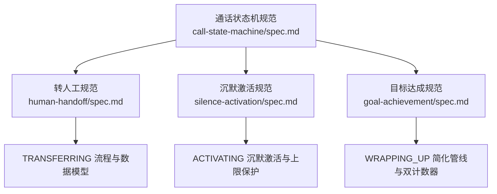
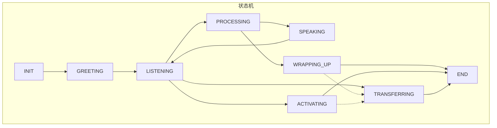
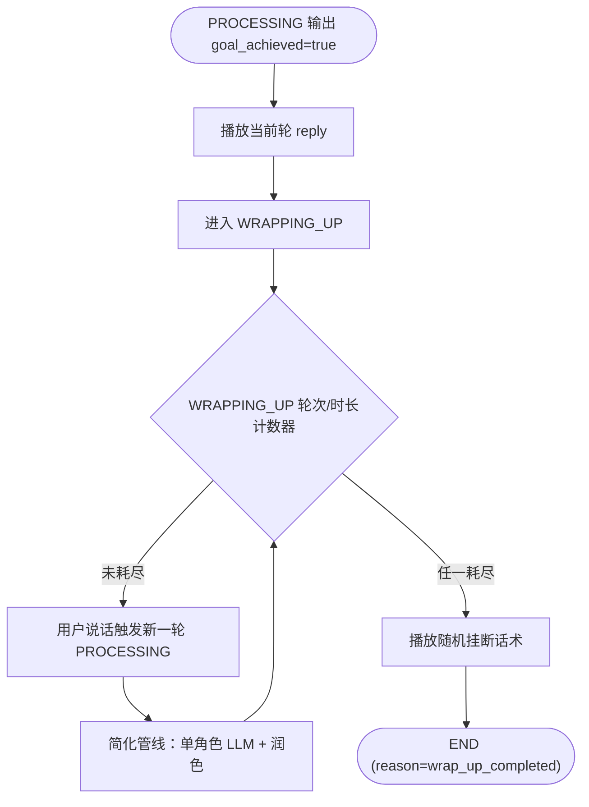
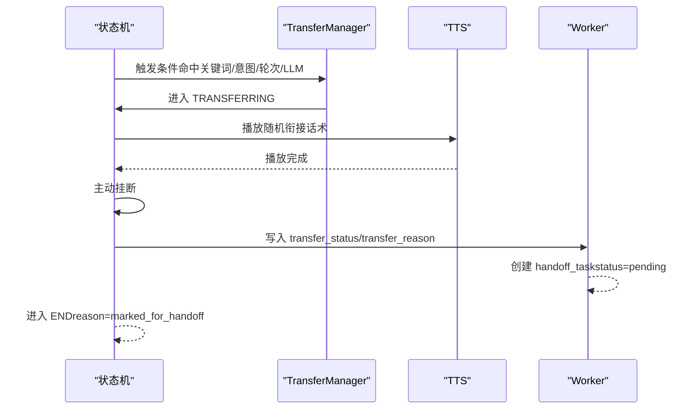
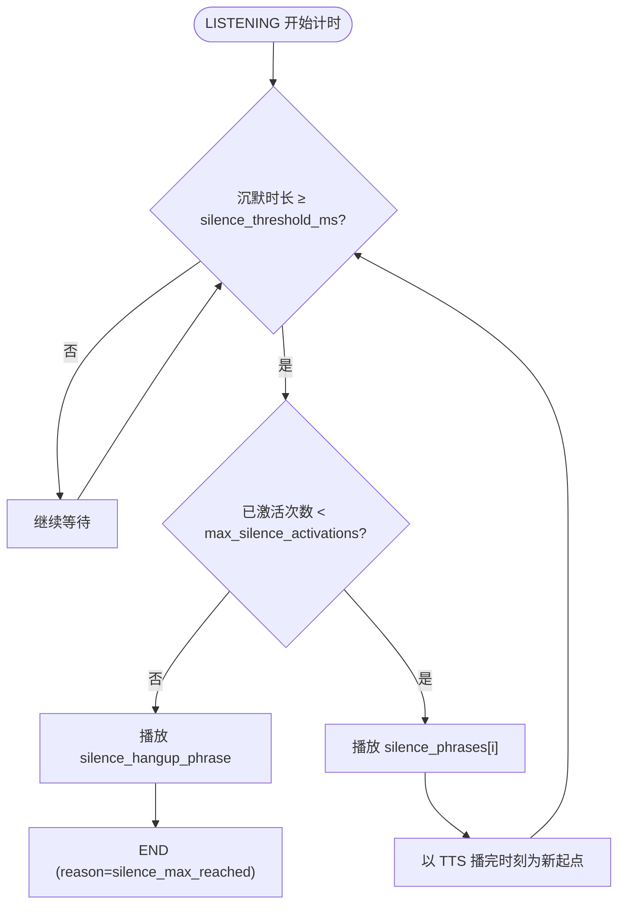
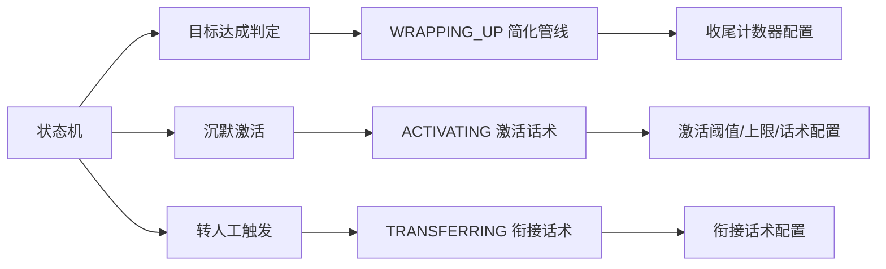

# 特殊状态处理

<cite>
**本文引用的文件**
- [call-state-machine/spec.md](file://openspec/specs/call-state-machine/spec.md)
- [human-handoff/spec.md](file://openspec/specs/human-handoff/spec.md)
- [silence-activation/spec.md](file://openspec/specs/silence-activation/spec.md)
- [goal-achievement/spec.md](file://openspec/specs/goal-achievement/spec.md)
</cite>

## 目录
1. [引言](#引言)
2. [项目结构](#项目结构)
3. [核心组件](#核心组件)
4. [架构总览](#架构总览)
5. [详细组件分析](#详细组件分析)
6. [依赖分析](#依赖分析)
7. [性能考虑](#性能考虑)
8. [故障排查指南](#故障排查指南)
9. [结论](#结论)
10. [附录](#附录)

## 引言
本文件面向 iSales 系统的“特殊状态”处理，聚焦三种状态的进入与退出条件、处理机制与状态守卫策略：
- WRAPPING_UP：目标达成后的收尾对话，采用简化 AI 管线（单角色 LLM + 润色），不启用 PK/裁判/垫词。
- TRANSFERRING：转人工流程（v1：播放衔接话术 → 标记派发 → 主动挂断），期间不调用 AI 管线，仅可保留 ASR 补录最后一条 transcript。
- ACTIVATING：沉默激活（播放激活话术），受激活上限保护；与转人工触发存在优先级关系。

文档基于仓库内规范文件进行系统化梳理，结合状态机契约与各专项规范，给出流程图、状态守卫与最佳实践建议。

## 项目结构
围绕“特殊状态”的相关规范主要分布在以下文件：
- 通话状态机规范：定义状态集合、转换规则与特殊状态边界
- 转人工规范：定义 v1 衰减为“标记 + 通知”，以及 TRANSFERRING 的流程与数据模型
- 沉默激活规范：定义沉默检测、激活话术选择、激活上限与与角色 LLM 上下文隔离
- 目标达成规范：定义 WRAPPING_UP 的进入条件、简化管线与收尾双计数器

**图表来源**
- [call-state-machine/spec.md](file://openspec/specs/call-state-machine/spec.md)
- [human-handoff/spec.md](file://openspec/specs/human-handoff/spec.md)
- [silence-activation/spec.md](file://openspec/specs/silence-activation/spec.md)
- [goal-achievement/spec.md](file://openspec/specs/goal-achievement/spec.md)

**章节来源**
- [call-state-machine/spec.md](file://openspec/specs/call-state-machine/spec.md)
- [human-handoff/spec.md](file://openspec/specs/human-handoff/spec.md)
- [silence-activation/spec.md](file://openspec/specs/silence-activation/spec.md)
- [goal-achievement/spec.md](file://openspec/specs/goal-achievement/spec.md)

## 核心组件
- 状态机（CallStateMachine）：统一的状态转换入口，维护合法转移集合，非法转移抛出异常并写入 transcript 的 state_error 事件。
- WRAPPING_UP 管线（Wrap-up Pipeline）：在目标达成后走简化管线（单角色 LLM + 润色），不启用 PK/裁判/垫词；维护轮数与时长双计数器，任一耗尽触发挂断。
- TRANSFERRING 管线（Transfer Manager）：4 种独立触发机制（关键词/意图/轮次/独立 LLM）OR 命中即进入 TRANSFERRING；播放衔接话术后主动挂断，写入 call_record.transfer_status/transfer_reason 并进入 END。
- ACTIVATING 管线（Silence Activation）：LISTENING 状态下沉默超过阈值且未达激活上限时进入 ACTIVATING；按顺序使用 silence_phrases，超出上限播放 silence_hangup_phrase 后挂断；激活话术写 full_transcript，不进入 dialog_history。
- 状态守卫（Guard）：非法转移抛异常；沉默激活与转人工存在优先级；WRAPPING_UP/TRANSFERRING 期间禁用 AI 管线；目标达成后必须先播放当前轮 reply 再进入 WRAPPING_UP。

**章节来源**
- [call-state-machine/spec.md](file://openspec/specs/call-state-machine/spec.md)
- [goal-achievement/spec.md](file://openspec/specs/goal-achievement/spec.md)
- [human-handoff/spec.md](file://openspec/specs/human-handoff/spec.md)
- [silence-activation/spec.md](file://openspec/specs/silence-activation/spec.md)

## 架构总览
下图展示三种特殊状态在状态机中的位置与相互关系，以及与关键模块的交互：

**图表来源**
- [call-state-machine/spec.md](file://openspec/specs/call-state-machine/spec.md)

## 详细组件分析

### WRAPPING_UP：目标达成后的收尾对话
- 进入条件
  - PROCESSING 输出 goal_achieved=true，先正常播放当前轮 reply，再进入 WRAPPING_UP。
- 处理机制
  - 简化管线：单角色 LLM 直出 + 润色，不启用 PK/裁判/垫词。
  - prompt 末尾追加“目标已达成”的收尾指令，避免推进新议题。
  - 维护双计数器：轮数（wrap_up_max_rounds，默认 2）与时长（wrap_up_max_seconds，默认 15s），任一耗尽播放随机挂断话术后进入 END（reason=wrap_up_completed）。
- 退出条件
  - 双计数器任一耗尽；用户主动挂断；转人工触发让位至 TRANSFERRING。
- 状态守卫
  - WRAPPING_UP 期间不退回主管线；用户提出新问题继续简化管线闭环；反悔/挂机按规范处理。

**图表来源**
- [goal-achievement/spec.md](file://openspec/specs/goal-achievement/spec.md)
- [call-state-machine/spec.md](file://openspec/specs/call-state-machine/spec.md)

**章节来源**
- [goal-achievement/spec.md](file://openspec/specs/goal-achievement/spec.md)
- [call-state-machine/spec.md](file://openspec/specs/call-state-machine/spec.md)

### TRANSFERRING：转人工流程（v1：播衔接话术 + 标记派发 + 主动挂断）
- 触发机制
  - 4 种独立触发（关键词/意图/轮次/独立 LLM），任一命中即进入 TRANSFERRING；优先级高于沉默激活。
- 处理机制
  - 从 campaign.transfer_phrases 随机选择 1 条 TTS 播放；播放完成后主动挂断。
  - 写入 call_record.transfer_status="marked_for_handoff" 与 transfer_reason（触发类型）。
  - worker 收到通话结束消息后创建 handoff_task（status=pending，agent_id=null），可触发 webhook。
- 期间限制
  - 不调用 AI 管线；可保留 ASR 流式工作以补录最后一条 transcript。
  - 不存在“转接成功/失败”的二级分支（v1 不实时桥接）。
- 退出条件
  - 衔接话术播放完成后直接进入 END（reason=marked_for_handoff）。

**图表来源**
- [human-handoff/spec.md](file://openspec/specs/human-handoff/spec.md)
- [call-state-machine/spec.md](file://openspec/specs/call-state-machine/spec.md)

**章节来源**
- [human-handoff/spec.md](file://openspec/specs/human-handoff/spec.md)
- [call-state-machine/spec.md](file://openspec/specs/call-state-machine/spec.md)

### ACTIVATING：沉默激活与激活上限保护
- 触发条件
  - LISTENING 状态下沉默时长 ≥ campaign.silence_threshold_ms 且当前已激活次数 < campaign.max_silence_activations。
- 处理机制
  - 从 campaign.silence_phrases 按顺序使用激活话术；不足时复用最后一条；超量时仅使用前 N 条。
  - 激活话术写 full_transcript（silence_activation 事件），不进入 dialog_history。
  - 激活 TTS 播完后以 TTS 播完时刻为新计时起点，不累加原始沉默时长。
- 退出条件
  - 达到激活上限：播放 campaign.silence_hangup_phrase 后主动挂断，进入 END（reason=silence_max_reached）。
  - 在阈值期间说话：复位沉默计时器，按正常路径进入 PROCESSING。
- 优先级
  - 转人工触发优先于沉默激活；若同时满足，优先进入 TRANSFERRING。

**图表来源**
- [silence-activation/spec.md](file://openspec/specs/silence-activation/spec.md)
- [call-state-machine/spec.md](file://openspec/specs/call-state-machine/spec.md)

**章节来源**
- [silence-activation/spec.md](file://openspec/specs/silence-activation/spec.md)
- [call-state-machine/spec.md](file://openspec/specs/call-state-machine/spec.md)

## 依赖分析
- WRAPPING_UP 依赖目标达成判定（PROCESSING 输出 goal_achieved=true）与收尾双计数器配置。
- TRANSFERRING 依赖 4 种独立触发机制与 campaign.transfer_phrases 配置，且与沉默激活存在优先级关系。
- ACTIVATING 依赖 campaign.silence_threshold_ms、max_silence_activations、silence_phrases、silence_hangup_phrase，以及与转人工触发的优先级。
- 状态机统一提供 transition_to API 与非法转移兜底（IllegalTransition + transcript state_error）。

**图表来源**
- [call-state-machine/spec.md](file://openspec/specs/call-state-machine/spec.md)
- [goal-achievement/spec.md](file://openspec/specs/goal-achievement/spec.md)
- [silence-activation/spec.md](file://openspec/specs/silence-activation/spec.md)
- [human-handoff/spec.md](file://openspec/specs/human-handoff/spec.md)

**章节来源**
- [call-state-machine/spec.md](file://openspec/specs/call-state-machine/spec.md)
- [goal-achievement/spec.md](file://openspec/specs/goal-achievement/spec.md)
- [silence-activation/spec.md](file://openspec/specs/silence-activation/spec.md)
- [human-handoff/spec.md](file://openspec/specs/human-handoff/spec.md)

## 性能考虑
- WRAPPING_UP 简化管线减少计算开销，避免 PK/裁判/垫词带来的额外延迟与资源消耗。
- TRANSFERRING 期间不调用 AI 管线，降低 CPU/GPU 使用率与网络 I/O。
- ACTIVATING 顺序使用话术池，避免动态拼接造成的额外开销；激活上限防止无限激活导致的资源浪费。
- 状态机统一事件驱动与非法转移兜底，有助于快速定位异常路径，减少调试成本。

## 故障排查指南
- 非法状态转移
  - 现象：模块尝试触发的转移目标不在当前状态的合法转移集合内。
  - 处理：状态机抛出 IllegalTransition，并在 transcript 中追加 state_error 事件；可选择忽略或强制进入 END。
- WRAPPING_UP 未进入
  - 现象：目标达成后未进入 WRAPPING_UP。
  - 处理：确认 PROCESSING 输出包含 goal_achieved=true；确保当前轮 reply 已正常播放后再进入 WRAPPING_UP。
- TRANSFERRING 未触发
  - 现象：用户表达转人工意图但未进入 TRANSFERRING。
  - 处理：检查 4 种触发条件是否启用、阈值配置是否合理；确认沉默激活优先级高于转人工触发的配置。
- ACTIVATING 话术异常
  - 现象：激活话术未按顺序使用或超出上限未挂断。
  - 处理：核对 silence_phrases 与 max_silence_activations 配置；确认激活上限达到后播放 silence_hangup_phrase 并挂断。
- 状态守卫失效
  - 现象：WRAPPING_UP/TRANSFERRING 期间调用 AI 管线或出现二级分支。
  - 处理：核查状态机守卫规则与模块实现，确保 TRANSFERRING 期间不调用 AI 管线，WRAPPING_UP 不退回主管线。

**章节来源**
- [call-state-machine/spec.md](file://openspec/specs/call-state-machine/spec.md)

## 结论
iSales 系统通过状态机契约与专项规范，对 WRAPPING_UP、TRANSFERRING、ACTIVATING 三类特殊状态进行了清晰的进入/退出条件定义与处理机制约束。WRAPPING_UP 采用简化管线与双计数器保障闭环；TRANSFERRING 以“标记 + 通知”实现 v1 转人工；ACTIVATING 提供沉默激活与上限保护。配合状态守卫与统一事件驱动，系统在复杂场景下仍能保持稳定与可追溯。

## 附录
- 数据模型要点（来自各规范）
  - 转人工：campaign.transfer_phrases、call_record.transfer_status/transfer_reason、handoff_task 表字段
  - 沉默激活：campaign.silence_threshold_ms、max_silence_activations、silence_phrases、silence_hangup_phrase
  - 目标达成：campaign.wrap_up_max_rounds、wrap_up_max_seconds、wrap_up_closing_phrases、call_record.wrap_up_started_at

**章节来源**
- [human-handoff/spec.md](file://openspec/specs/human-handoff/spec.md)
- [silence-activation/spec.md](file://openspec/specs/silence-activation/spec.md)
- [goal-achievement/spec.md](file://openspec/specs/goal-achievement/spec.md)