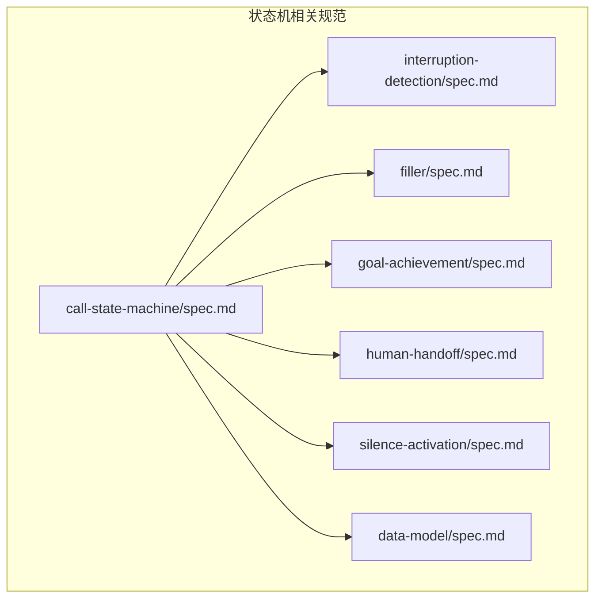
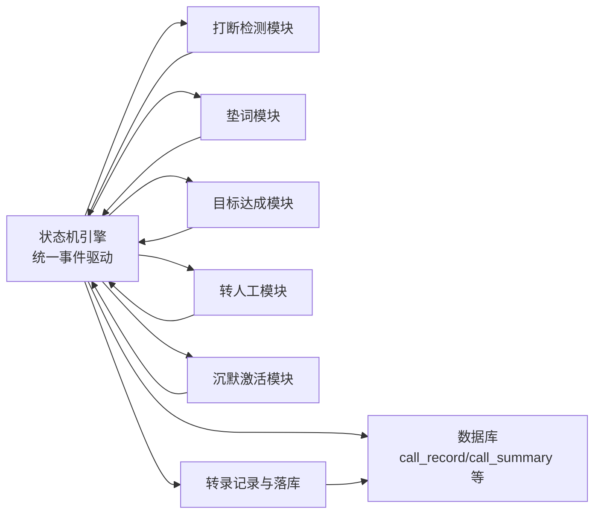
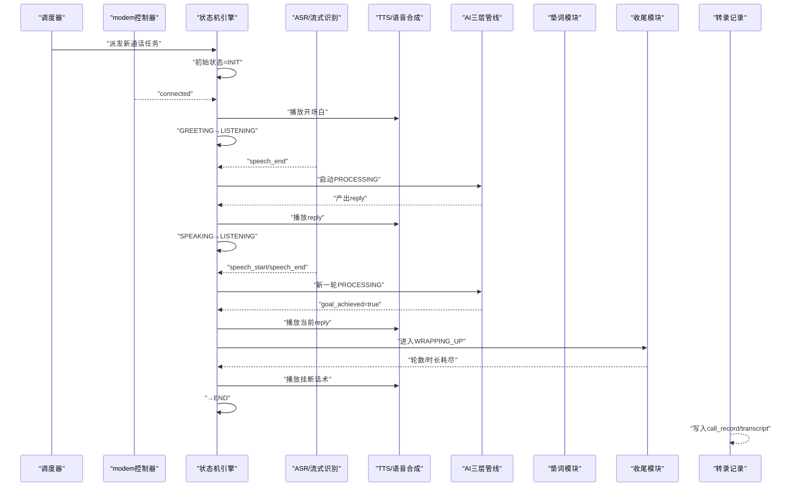
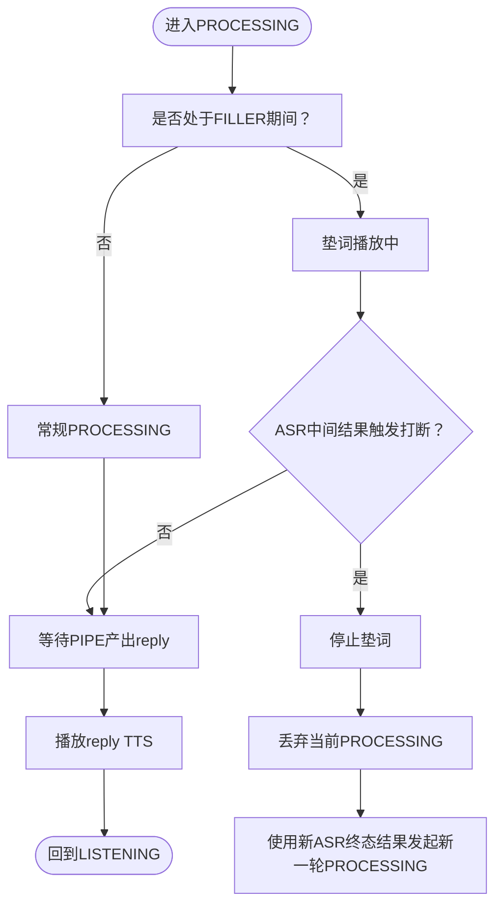
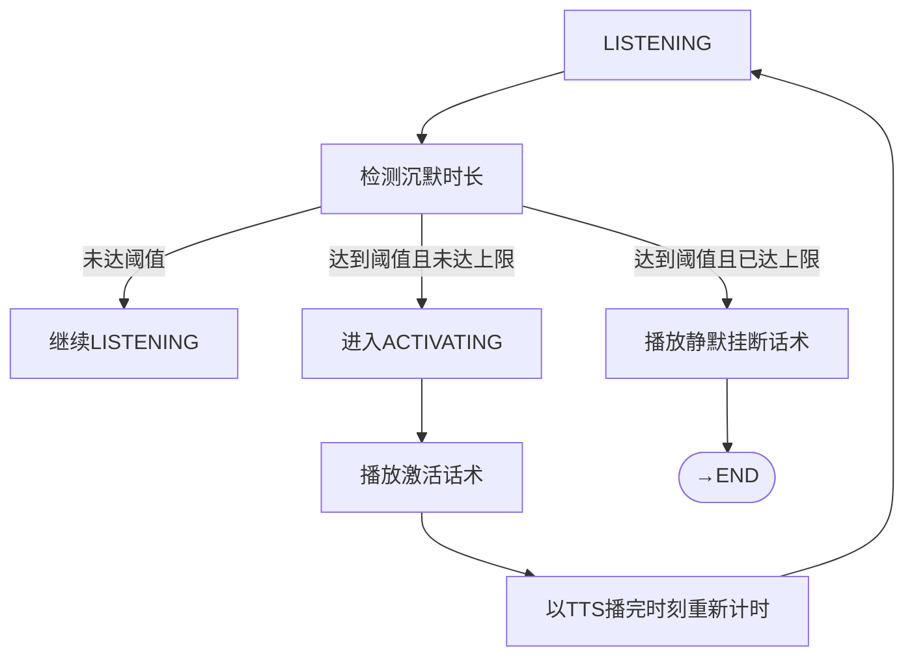
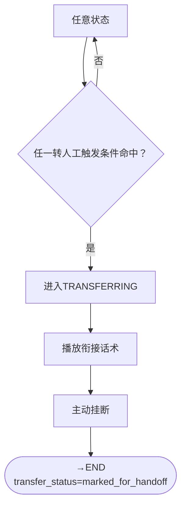
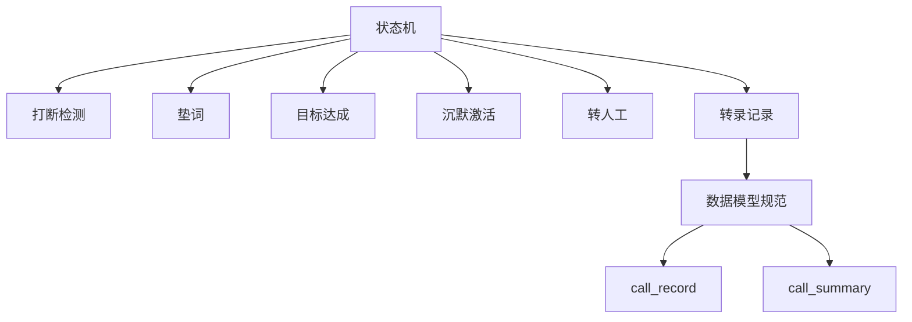

# 状态定义与分类

<cite>
**本文引用的文件**
- [call-state-machine/spec.md](file://openspec/specs/call-state-machine/spec.md)
- [interruption-detection/spec.md](file://openspec/specs/interruption-detection/spec.md)
- [filler/spec.md](file://openspec/specs/filler/spec.md)
- [goal-achievement/spec.md](file://openspec/specs/goal-achievement/spec.md)
- [human-handoff/spec.md](file://openspec/specs/human-handoff/spec.md)
- [silence-activation/spec.md](file://openspec/specs/silence-activation/spec.md)
- [data-model/spec.md](file://openspec/specs/data-model/spec.md)
</cite>

## 目录
1. [引言](#引言)
2. [项目结构](#项目结构)
3. [核心组件](#核心组件)
4. [架构总览](#架构总览)
5. [详细组件分析](#详细组件分析)
6. [依赖分析](#依赖分析)
7. [性能考虑](#性能考虑)
8. [故障排查指南](#故障排查指南)
9. [结论](#结论)
10. [附录](#附录)

## 引言
本文件面向iSales系统“通话状态定义与分类”，基于OpenSpec规范，系统化梳理11种通话状态的完整定义、职责、进入/退出条件与持续时间特征，并给出状态分类体系（基础状态、特殊状态、保护状态）的设计理念与实践建议。目标是帮助开发者准确把握每个状态在通话生命周期中的作用，确保状态机实现与运行时行为的一致性与可调试性。

## 项目结构
围绕状态机的规范分布在openspec/specs目录下，核心文件如下：
- 通话状态机主规范：定义状态集合、合法转移、终止条件与异常处理契约
- 特殊状态专项规范：打断检测、垫词、目标达成、转人工、沉默激活
- 数据模型规范：与状态机相关的表与字段，支撑状态持久化与事件记录

图表来源
- [call-state-machine/spec.md:1-190](file://openspec/specs/call-state-machine/spec.md#L1-L190)
- [interruption-detection/spec.md:1-94](file://openspec/specs/interruption-detection/spec.md#L1-L94)
- [filler/spec.md:1-132](file://openspec/specs/filler/spec.md#L1-L132)
- [goal-achievement/spec.md:1-126](file://openspec/specs/goal-achievement/spec.md#L1-L126)
- [human-handoff/spec.md:1-128](file://openspec/specs/human-handoff/spec.md#L1-L128)
- [silence-activation/spec.md:1-99](file://openspec/specs/silence-activation/spec.md#L1-L99)
- [data-model/spec.md:1-83](file://openspec/specs/data-model/spec.md#L1-L83)

章节来源
- [call-state-machine/spec.md:1-190](file://openspec/specs/call-state-machine/spec.md#L1-L190)
- [data-model/spec.md:1-83](file://openspec/specs/data-model/spec.md#L1-L83)

## 核心组件
- 状态集合与合法转移：定义11种状态及状态机的合法转移集合，非法转移将抛出异常并记录state_error事件
- 特殊状态：WRAPPING_UP（收尾）、TRANSFERRING（转人工）、ACTIVATING（沉默激活）具有独立的进入/退出条件与边界约束
- 事件驱动：所有状态转换由统一事件触发，转换时写入transcript，便于调试与审计
- 终止与落盘：进入END后落库并派发“通话结束”消息，不再发生状态转换

章节来源
- [call-state-machine/spec.md:5-31](file://openspec/specs/call-state-machine/spec.md#L5-L31)
- [call-state-machine/spec.md:46-190](file://openspec/specs/call-state-machine/spec.md#L46-L190)

## 架构总览
状态机作为engine核心，实时行为模块（打断、垫词、目标达成、转人工、沉默）通过状态转换接入。状态转换必须通过统一事件驱动API，确保transcript一致性与可测试性。

图表来源
- [call-state-machine/spec.md:187-190](file://openspec/specs/call-state-machine/spec.md#L187-L190)

章节来源
- [call-state-machine/spec.md:187-190](file://openspec/specs/call-state-machine/spec.md#L187-L190)

## 详细组件分析

### 状态定义与职责概览
- INIT：拨号尝试中，起始状态
- GREETING：开场白播放
- LISTENING：等待用户说话
- SPEAKING：TTS播放AI回复
- INTERRUPTED：用户说话被判定为打断（短暂中转）
- FILLER：垫词播放
- PROCESSING：AI三层管线运行中
- WRAPPING_UP：目标达成后的收尾对话
- ACTIVATING：沉默激活话术播放
- TRANSFERRING：转人工流程（v1：播衔接话术+标记派发+主动挂断）
- END：通话结束

章节来源
- [call-state-machine/spec.md:7-19](file://openspec/specs/call-state-machine/spec.md#L7-L19)

### 状态分类体系
- 基础状态：INIT、GREETING、LISTENING、SPEAKING、PROCESSING、FILLER
- 特殊状态：WRAPPING_UP、ACTIVATING、TRANSFERRING
- 保护状态：INTERRUPTED（打断保护）

设计理念：
- 基础状态覆盖常规对话生命周期，强调稳定与可预期
- 特殊状态承载边界行为（收尾、激活、转人工），需严格的进入/退出条件与边界约束
- 保护状态用于防止无限循环与异常状态，配合连续打断保护策略

章节来源
- [call-state-machine/spec.md:110-131](file://openspec/specs/call-state-machine/spec.md#L110-L131)

### 状态定义表格
- 状态名称与职责
  - INIT：拨号尝试中，起始状态
  - GREETING：开场白播放
  - LISTENING：等待用户说话
  - SPEAKING：TTS播放AI回复
  - INTERRUPTED：用户说话被判定为打断（短暂中转）
  - FILLER：垫词播放
  - PROCESSING：AI三层管线运行中
  - WRAPPING_UP：目标达成后的收尾对话
  - ACTIVATING：沉默激活话术播放
  - TRANSFERRING：转人工流程（v1：播衔接话术+标记派发+主动挂断）
  - END：通话结束

- 进入条件与退出条件
  - INIT → GREETING：modem-controller上报connected事件
  - GREETING → LISTENING：开场白播放完毕
  - LISTENING → PROCESSING：ASR上报speech_end且未达激活上限
  - SPEAKING → INTERRUPTED → PROCESSING：打断判定成立
  - PROCESSING → SPEAKING：管线产出reply（goal_achieved=false）
  - PROCESSING → SPEAKING → WRAPPING_UP：管线产出goal_achieved=true
  - WRAPPING_UP → END：轮数或时长计数器耗尽
  - LISTENING → ACTIVATING：沉默时长≥阈值且未达激活上限
  - ACTIVATING → END：达到激活上限（播放静默挂断话术）
  - 任一转人工触发条件命中 → TRANSFERRING → END
  - LISTENING → END：用户挂机
  - 其他业务超时/异常 → END

- 持续时间特征
  - LISTENING：以沉默计时器为基准，超过阈值触发ACTIVATING；若在阈值内有有效输入则复位
  - PROCESSING：受AI三层管线时延影响，通常与垫词并行
  - WRAPPING_UP：同时维护轮数计数器与时长计数器，任一耗尽即主动挂断
  - ACTIVATING：每次激活TTS播完后重新计时，不累加原始沉默时长

章节来源
- [call-state-machine/spec.md:50-108](file://openspec/specs/call-state-machine/spec.md#L50-L108)
- [silence-activation/spec.md:7-34](file://openspec/specs/silence-activation/spec.md#L7-L34)
- [goal-achievement/spec.md:63-76](file://openspec/specs/goal-achievement/spec.md#L63-L76)
- [interruption-detection/spec.md:26-53](file://openspec/specs/interruption-detection/spec.md#L26-L53)

### 状态语义说明
- INIT/GREETING/LISTENING/SPEAKING/PROCESSING/FILLER：常规对话状态，强调事件驱动与transcript一致性
- INTERRUPTED：打断保护的短暂中转，确保状态机清晰与不可回退
- WRAPPING_UP：简化管线（单角色LLM+润色），不启用PK/裁判/垫词
- ACTIVATING：与角色LLM上下文隔离，避免模型误以为“AI上一轮说过这句话”
- TRANSFERRING：v1不实时桥接，仅标记+派发+主动挂断，不存在转接成功/失败二级分支
- END：终止态，落库并派发“通话结束”消息

章节来源
- [call-state-machine/spec.md:128-145](file://openspec/specs/call-state-machine/spec.md#L128-L145)
- [goal-achievement/spec.md:53-62](file://openspec/specs/goal-achievement/spec.md#L53-L62)
- [silence-activation/spec.md:54-67](file://openspec/specs/silence-activation/spec.md#L54-L67)
- [human-handoff/spec.md:88-101](file://openspec/specs/human-handoff/spec.md#L88-L101)

### 状态转换序列图（关键流程）

图表来源
- [call-state-machine/spec.md:50-108](file://openspec/specs/call-state-machine/spec.md#L50-L108)
- [goal-achievement/spec.md:44-76](file://openspec/specs/goal-achievement/spec.md#L44-L76)
- [filler/spec.md:31-44](file://openspec/specs/filler/spec.md#L31-L44)

### 状态转换流程图（打断与垫词）

图表来源
- [filler/spec.md:45-48](file://openspec/specs/filler/spec.md#L45-L48)
- [interruption-detection/spec.md:26-34](file://openspec/specs/interruption-detection/spec.md#L26-L34)

### 状态转换流程图（沉默激活）

图表来源
- [silence-activation/spec.md:7-34](file://openspec/specs/silence-activation/spec.md#L7-L34)

### 状态转换流程图（转人工）

图表来源
- [human-handoff/spec.md:21-62](file://openspec/specs/human-handoff/spec.md#L21-L62)

## 依赖分析
- 状态机与实时行为模块的耦合
  - 打断检测：与SPEAKING/PROCESSING/WRAPPING_UP交互，触发INTERRUPTED→PROCESSING
  - 垫词：与PROCESSING并行，打断时丢弃当前PROCESSING并发起新一轮
  - 目标达成：PROCESSING产出goal_achieved=true时进入WRAPPING_UP
  - 沉默激活：LISTENING超过阈值进入ACTIVATING，达到上限后END
  - 转人工：任一触发条件命中进入TRANSFERRING，播放衔接话术后END
- 事件与数据模型
  - 状态转换写入transcript，落库至call_record
  - 结束后worker根据hangup_cause与目标达成标记派发回调与重试

图表来源
- [call-state-machine/spec.md:187-190](file://openspec/specs/call-state-machine/spec.md#L187-L190)
- [data-model/spec.md:28-51](file://openspec/specs/data-model/spec.md#L28-L51)

章节来源
- [call-state-machine/spec.md:187-190](file://openspec/specs/call-state-machine/spec.md#L187-L190)
- [data-model/spec.md:28-51](file://openspec/specs/data-model/spec.md#L28-L51)

## 性能考虑
- 并行处理：PROCESSING与FILLER并行启动，缩短感知延迟
- 快响应策略：即便PIPE快速返回，仍播完整段垫词以维持稳定节拍
- 计时与复位：ACTIVATING后以TTS播完时刻重新计时，避免累计沉默导致的误触发
- 简化管线：WRAPPING_UP期间走单角色LLM+润色，降低复杂度与延迟

章节来源
- [filler/spec.md:31-44](file://openspec/specs/filler/spec.md#L31-L44)
- [goal-achievement/spec.md:53-57](file://openspec/specs/goal-achievement/spec.md#L53-L57)
- [silence-activation/spec.md:26-34](file://openspec/specs/silence-activation/spec.md#L26-L34)

## 故障排查指南
- 非法状态转移
  - 现象：模块触发的转移目标不在当前状态的合法转移集合内
  - 处理：抛出IllegalTransition异常，并在transcript追加state_error事件
  - 可恢复：部分事件可忽略（如ASR partial在PROCESSING期间）
  - 不可恢复：如心跳丢失，强制进入END(reason="engine_internal_error")
- 调试要点
  - 通过transcript定位事件序列与状态变迁
  - 检查hangup_cause来源一致性（统一来自枚举）
  - 核对Campaign配置（打断阈值、沉默阈值、激活上限等）

章节来源
- [call-state-machine/spec.md:33-45](file://openspec/specs/call-state-machine/spec.md#L33-L45)
- [call-state-machine/spec.md:170-186](file://openspec/specs/call-state-machine/spec.md#L170-L186)

## 结论
iSales状态机以“事件驱动+统一契约”的方式，将打断、垫词、目标达成、转人工、沉默激活等实时行为有机整合。通过明确的11种状态、严格的合法转移与终止条件、以及完善的异常处理与调试契约，确保通话生命周期的稳定性与可观测性。开发者应重点关注特殊状态（WRAPPING_UP/ACTIVATING/TRANSFERRING）的边界约束与简化管线策略，确保实现与规范一致。

## 附录
- 相关配置字段（摘自各专项规范）
  - 打断检测：打断白名单、最小时长、连续打断上限、保护策略
  - 沉默激活：沉默阈值、最大激活次数、激活话术池、静默挂断话术
  - 目标达成：收尾轮数上限、收尾时长上限、收尾挂断话术池
  - 转人工：关键词触发、意图分类阈值、轮次阈值、独立LLM触发、衔接话术池

章节来源
- [interruption-detection/spec.md:82-94](file://openspec/specs/interruption-detection/spec.md#L82-L94)
- [silence-activation/spec.md:82-92](file://openspec/specs/silence-activation/spec.md#L82-L92)
- [goal-achievement/spec.md:110-122](file://openspec/specs/goal-achievement/spec.md#L110-L122)
- [human-handoff/spec.md:111-128](file://openspec/specs/human-handoff/spec.md#L111-L128)