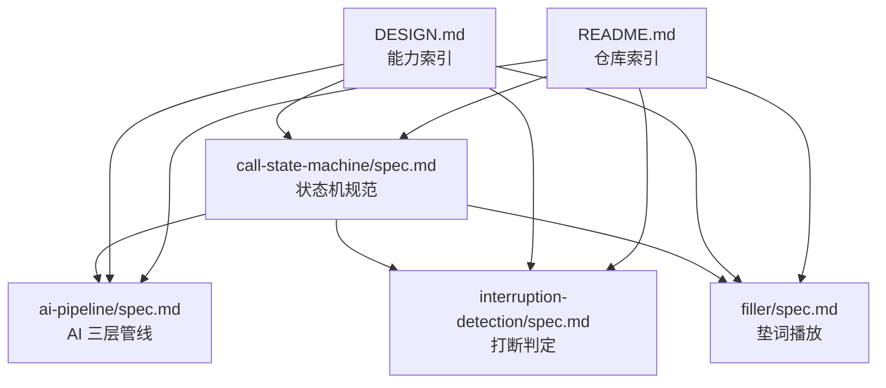
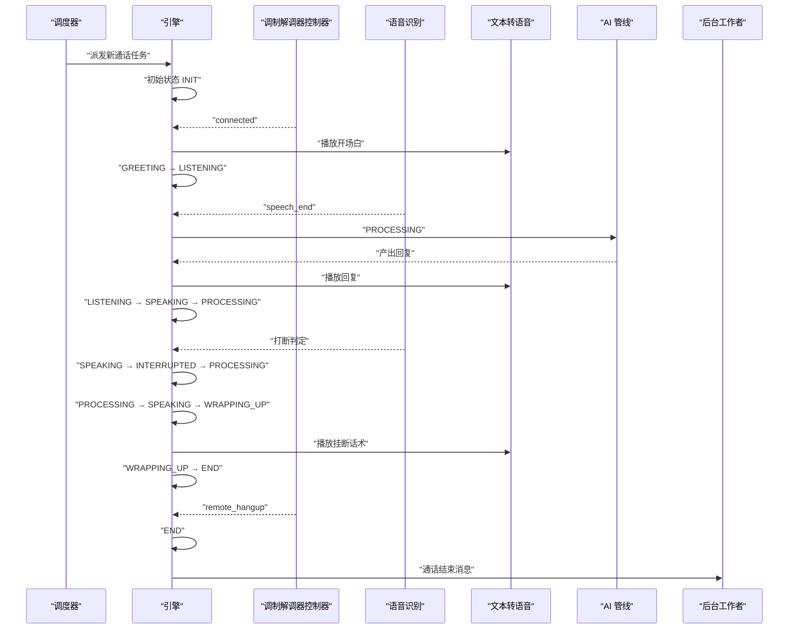
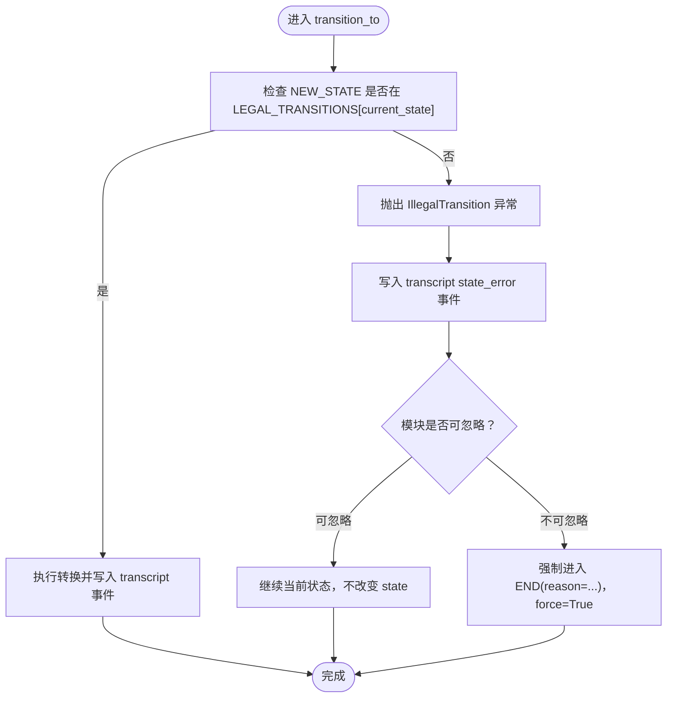
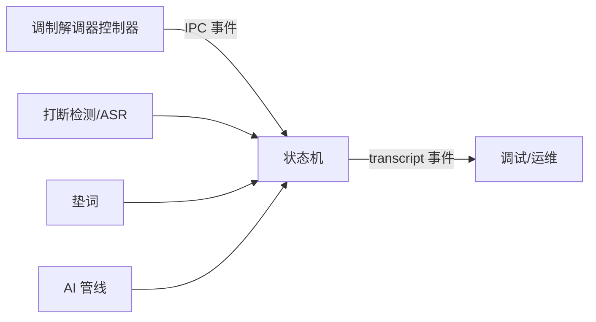

# 状态转换规则

<cite>
**本文引用的文件**
- [call-state-machine/spec.md](file://openspec/specs/call-state-machine/spec.md)
- [ai-pipeline/spec.md](file://openspec/specs/ai-pipeline/spec.md)
- [interruption-detection/spec.md](file://openspec/specs/interruption-detection/spec.md)
- [filler/spec.md](file://openspec/specs/filler/spec.md)
- [DESIGN.md](file://DESIGN.md)
- [README.md](file://README.md)
</cite>

## 目录
1. [简介](#简介)
2. [项目结构](#项目结构)
3. [核心组件](#核心组件)
4. [架构总览](#架构总览)
5. [详细组件分析](#详细组件分析)
6. [依赖分析](#依赖分析)
7. [性能考量](#性能考量)
8. [故障排查指南](#故障排查指南)
9. [结论](#结论)
10. [附录](#附录)

## 简介
本文件面向 iSales 系统的“状态转换规则”，基于 OpenSpec 规范与相关子系统文档，系统化梳理通话生命周期的状态机定义、合法转移集合、事件驱动机制、转换验证逻辑、非法转换处理与恢复策略，并给出状态转换图与转换矩阵，帮助开发者与运维人员准确理解与扩展状态机。

## 项目结构
iSales 采用多仓库协作与 OpenSpec 规范化管理，状态机规范位于 openspec/specs/call-state-machine/spec.md；AI 管线、打断检测、垫词等子系统分别在相应 spec 中定义，共同驱动状态机的事件与转换。

图表来源
- [call-state-machine/spec.md:1-190](file://openspec/specs/call-state-machine/spec.md#L1-L190)
- [ai-pipeline/spec.md:1-166](file://openspec/specs/ai-pipeline/spec.md#L1-L166)
- [interruption-detection/spec.md:1-94](file://openspec/specs/interruption-detection/spec.md#L1-L94)
- [filler/spec.md:1-132](file://openspec/specs/filler/spec.md#L1-L132)
- [DESIGN.md:1-75](file://DESIGN.md#L1-L75)
- [README.md:1-86](file://README.md#L1-L86)

章节来源
- [DESIGN.md:11-21](file://DESIGN.md#L11-L21)
- [README.md:7-14](file://README.md#L7-L14)

## 核心组件
- 状态集合与合法转移
  - 状态集合：INIT、GREETING、LISTENING、SPEAKING、INTERRUPTED、FILLER、PROCESSING、WRAPPING_UP、ACTIVATING、TRANSFERRING、END。
  - 合法转移集合 LEGAL_TRANSITIONS：由状态机维护，任何不在当前状态合法转移集合内的事件必须抛出非法转换异常，并在 transcript 中追加 state_error 事件。
- 事件驱动与转换验证
  - 统一事件驱动 API：session.transition_to(NEW_STATE, reason=...)；非法转移 → 抛 IllegalTransition，写 transcript state_error 事件兜底。
  - 转换验证：外层调用方 try 包裹，决定忽略或强制进入 END（force=True 跳过合法性校验）。
- 非法转换处理与恢复
  - 可忽略：如 PROCESSING 期间的 ASR partial 结果，模块捕获后继续，状态不改变。
  - 不可忽略：如 PROCESSING 期间心跳丢失，模块强制进入 END(reason="engine_internal_error")。
- 特殊状态与边界
  - WRAPPING_UP：收尾阶段走简化管线（单角色 LLM + 润色），不启用 PK/裁判/垫词。
  - TRANSFERRING：不调用 AI 管线，仅播放衔接话术并主动挂断，结束后进入 END。
  - ACTIVATING：沉默激活话术播放，受阈值与上限控制。
  - FILLER：与 PROCESSING 并行，被打断时立即停止垫词并丢弃当前 PROCESSING，使用新 ASR 终态结果作为新一轮输入。
- 真硬件 URC 驱动
  - 状态转换仅由 SerialATClient 翻译出的 ATEvent（经 IPC 上抛）触发，不因 ATD 命令 ACK/中间 URC 单独触发转换。
  - 拨号被拒绝：INIT → END，transcript 记录 state_error 事件以便分析。

章节来源
- [call-state-machine/spec.md:7-19](file://openspec/specs/call-state-machine/spec.md#L7-L19)
- [call-state-machine/spec.md:21](file://openspec/specs/call-state-machine/spec.md#L21)
- [call-state-machine/spec.md:33-44](file://openspec/specs/call-state-machine/spec.md#L33-L44)
- [call-state-machine/spec.md:119-127](file://openspec/specs/call-state-machine/spec.md#L119-L127)
- [call-state-machine/spec.md:137-145](file://openspec/specs/call-state-machine/spec.md#L137-L145)
- [call-state-machine/spec.md:146-159](file://openspec/specs/call-state-machine/spec.md#L146-L159)

## 架构总览
状态机作为 engine 的核心，所有实时行为模块（打断、垫词、目标达成、转人工、沉默）通过状态转换接入。统一的事件驱动 API 保证转换可追踪、可测试。

图表来源
- [call-state-machine/spec.md:23-31](file://openspec/specs/call-state-machine/spec.md#L23-L31)
- [call-state-machine/spec.md:50-58](file://openspec/specs/call-state-machine/spec.md#L50-L58)
- [call-state-machine/spec.md:60-78](file://openspec/specs/call-state-machine/spec.md#L60-L78)
- [call-state-machine/spec.md:79-83](file://openspec/specs/call-state-machine/spec.md#L79-L83)
- [call-state-machine/spec.md:85-98](file://openspec/specs/call-state-machine/spec.md#L85-L98)
- [call-state-machine/spec.md:100-108](file://openspec/specs/call-state-machine/spec.md#L100-L108)

## 详细组件分析

### 合法转移集合 LEGAL_TRANSITIONS
- 定义位置与职责
  - LEGAL_TRANSITIONS: dict[CallState, set[CallState]] 由状态机维护，作为“非法状态转移”的硬契约。
  - 任何模块触发的目标状态不在当前状态的合法转移集合内，必须抛出 IllegalTransition 异常，并在 transcript 中追加 state_error 事件。
- 转换验证流程
  - 调用 session.transition_to(NEW_STATE, reason=...)。
  - 若 NEW_STATE ∉ LEGAL_TRANSITIONS[current_state]，抛出异常并写入 state_error。
  - 外层模块捕获异常后，根据场景决定忽略（继续）或强制进入 END（force=True）。

图表来源
- [call-state-machine/spec.md:21](file://openspec/specs/call-state-machine/spec.md#L21)
- [call-state-machine/spec.md:33-44](file://openspec/specs/call-state-machine/spec.md#L33-L44)

章节来源
- [call-state-machine/spec.md:21](file://openspec/specs/call-state-machine/spec.md#L21)
- [call-state-machine/spec.md:33-44](file://openspec/specs/call-state-machine/spec.md#L33-L44)

### 关键状态转换与触发事件
- INIT → GREETING
  - 触发事件：modem-controller 上报 connected。
  - 前置条件：拨号成功，CONNECT URC 翻译为 IPC 事件。
  - 后置动作：启动开场白 TTS。
- GREETING → LISTENING
  - 触发事件：GREETING 的 TTS 播放完毕。
  - 前置条件：开场白播放完成。
  - 后置动作：进入 LISTENING 状态。
- SPEAKING → INTERRUPTED → PROCESSING
  - 触发事件：打断判定（详见打断检测）。
  - 前置条件：SPEAKING 状态下用户说话被判定为打断。
  - 后置动作：立刻停止 TTS，使用 ASR 终态结果作为新一轮输入。
- LISTENING → PROCESSING
  - 触发事件：ASR 上报 speech_end 且未达激活上限。
  - 前置条件：用户说话结束，且沉默激活未达上限。
  - 后置动作：启动 PROCESSING，并同时启动垫词（FILLER 与 PROCESSING 并行）。
- PROCESSING → SPEAKING
  - 触发事件：PROCESSING 完成且管线产出 reply（goal_achieved=false）。
  - 前置条件：AI 管线完成，产出回复。
  - 后置动作：TTS 开始播放 reply。
- PROCESSING → SPEAKING → WRAPPING_UP
  - 触发事件：PROCESSING 输出 goal_achieved=true。
  - 前置条件：目标达成。
  - 后置动作：先播放当前轮 reply，再进入 WRAPPING_UP。
- WRAPPING_UP → END
  - 触发事件：WRAPPING_UP 的轮数计数器或时长计数器耗尽。
  - 前置条件：收尾阶段完成。
  - 后置动作：播放挂断话术后进入 END。
- LISTENING → ACTIVATING
  - 触发事件：LISTENING 状态沉默时长 ≥ silence_threshold_ms 且未达激活上限。
  - 前置条件：沉默阈值满足。
  - 后置动作：播放沉默激活话术。
- ACTIVATING → END
  - 触发事件：沉默触发但激活次数已达上限。
  - 前置条件：激活次数达到上限。
  - 后置动作：播放 silence_hangup_phrase 后进入 END。
- TRANSFERRING → END
  - 触发事件：转人工触发条件命中。
  - 前置条件：转人工条件满足。
  - 后置动作：播放衔接话术 → 主动挂断 → END。
- LISTENING → END
  - 触发事件：用户挂机（remote_hangup）。
  - 前置条件：modem-controller 上报 remote_hangup。
  - 后置动作：进入 END，reason 为具体挂断原因。
- 长时间无进展 → END
  - 触发事件：用户一直说但都被判定为非打断/无效内容超过 max_no_progress_seconds。
  - 前置条件：超时。
  - 后置动作：主动挂断 → END。

章节来源
- [call-state-machine/spec.md:50-58](file://openspec/specs/call-state-machine/spec.md#L50-L58)
- [call-state-machine/spec.md:60-78](file://openspec/specs/call-state-machine/spec.md#L60-L78)
- [call-state-machine/spec.md:79-108](file://openspec/specs/call-state-machine/spec.md#L79-L108)
- [call-state-machine/spec.md:137-145](file://openspec/specs/call-state-machine/spec.md#L137-L145)

### 事件驱动机制与转换验证逻辑
- 统一事件驱动 API
  - session.transition_to(NEW_STATE, reason=...) 是唯一改 state 的入口。
  - 每次转换时将对应事件追加到 transcript，便于调试与审计。
- 转换验证
  - 内部维护 LEGAL_TRANSITIONS；非法转移 → 抛 IllegalTransition，写 transcript state_error。
  - 外层调用方可选择忽略或强制进入 END（force=True）。
- 真硬件 URC 驱动
  - 状态转换仅由 SerialATClient 翻译出的 ATEvent（经 IPC 上抛）触发。
  - ATD ACK 单独不触发转换，必须等待 CONNECT URC 翻译为 IPC 事件。

章节来源
- [call-state-machine/spec.md:187-189](file://openspec/specs/call-state-machine/spec.md#L187-L189)
- [call-state-machine/spec.md:146-159](file://openspec/specs/call-state-machine/spec.md#L146-L159)

### 非法状态转换处理与错误恢复策略
- 可忽略场景
  - 如 PROCESSING 期间的 ASR partial 结果，模块捕获 IllegalTransition 后继续，状态不改变。
- 不可忽略场景
  - 如 PROCESSING 期间心跳丢失，模块强制进入 END(reason="engine_internal_error")，force=True 跳过合法性校验。
- 拨号被拒绝的特殊路径
  - INIT → END，transcript 记录 state_error，便于分析“拨号被拒绝”路径。

章节来源
- [call-state-machine/spec.md:38-44](file://openspec/specs/call-state-machine/spec.md#L38-L44)
- [call-state-machine/spec.md:155-159](file://openspec/specs/call-state-machine/spec.md#L155-L159)

### 特殊状态与边界规则
- WRAPPING_UP 简化管线
  - 期间任何 PROCESSING 走简化管线（单角色 LLM + 润色），不启用 PK/裁判/垫词。
  - WRAPPING_UP 期间用户提出新问题，状态在 WRAPPING_UP 内闭环。
- TRANSFERRING 边界
  - 期间不调用 AI 管线；可保持 ASR 流式工作以补录最后一条 transcript。
  - 衔接话术播完后直接进入 END。
- FILLER 并行性
  - 与 PROCESSING 并行；被打断时立即停止垫词、丢弃当前 PROCESSING，使用新 ASR 终态结果作为新一轮输入。
- 连续打断保护
  - 当连续 INTERRUPTED → PROCESSING → SPEAKING → INTERRUPTED 循环超过 campaign.max_continuous_interruptions 时，触发保护策略（short_reply 或 listen_only）。

章节来源
- [call-state-machine/spec.md:128-136](file://openspec/specs/call-state-machine/spec.md#L128-L136)
- [call-state-machine/spec.md:137-145](file://openspec/specs/call-state-machine/spec.md#L137-L145)
- [call-state-machine/spec.md:110-118](file://openspec/specs/call-state-machine/spec.md#L110-L118)
- [filler/spec.md:31-49](file://openspec/specs/filler/spec.md#L31-L49)
- [ai-pipeline/spec.md:13-18](file://openspec/specs/ai-pipeline/spec.md#L13-L18)

### 与子系统的关系
- AI 三层管线
  - 每轮 PROCESSING 必须顺序经过三层 LLM；Layer 1 与垫词同时启动，覆盖管线延迟。
  - WRAPPING_UP 期间走简化管线（单角色 + 润色）。
- 打断检测
  - SPEAKING 状态下基于白名单与时长双条件判定打断；一旦判定为打断不可撤销。
  - 连续打断超过上限触发保护策略（short_reply/listen_only）。
- 垫词
  - 仅在常规对话 PROCESSING 下播放；与 PROCESSING 并行；被打断时立即停止并丢弃当前 PROCESSING。

章节来源
- [ai-pipeline/spec.md:7-18](file://openspec/specs/ai-pipeline/spec.md#L7-L18)
- [ai-pipeline/spec.md:65-69](file://openspec/specs/ai-pipeline/spec.md#L65-L69)
- [interruption-detection/spec.md:7-29](file://openspec/specs/interruption-detection/spec.md#L7-L29)
- [interruption-detection/spec.md:35-53](file://openspec/specs/interruption-detection/spec.md#L35-L53)
- [filler/spec.md:7-30](file://openspec/specs/filler/spec.md#L7-L30)
- [filler/spec.md:31-49](file://openspec/specs/filler/spec.md#L31-L49)

## 依赖分析
- 子系统依赖关系
  - call-state-machine 依赖打断检测、垫词、AI 管线等子系统提供的事件与行为。
  - 调制解调器控制器提供真实硬件事件（connected、remote_hangup），经 IPC 上抛后驱动状态转换。
- 耦合与内聚
  - 状态机与各子系统通过事件解耦，转换验证通过 LEGAL_TRANSITIONS 统一约束，内聚性高、耦合度可控。
- 外部依赖
  - 事件来源单一（ATEvent → IPC），避免中间状态与 ACK 导致的不一致。

图表来源
- [call-state-machine/spec.md:146-159](file://openspec/specs/call-state-machine/spec.md#L146-L159)
- [DESIGN.md:11-21](file://DESIGN.md#L11-L21)

章节来源
- [call-state-machine/spec.md:146-159](file://openspec/specs/call-state-machine/spec.md#L146-L159)
- [DESIGN.md:11-21](file://DESIGN.md#L11-L21)

## 性能考量
- 并行优化
  - FILLER 与 PROCESSING 并行启动，覆盖管线延迟，提升感知响应速度。
  - AI 三层管线 Layer 1 与垫词同时启动，减少整体等待时间。
- 降级与兜底
  - 全部裁判否决或全部候选解析失败时走默认回复兜底，不重试 LLM。
  - 润色失败时取“第一个通过裁判的候选”作为兜底，避免无限重试。
- 简化管线
  - WRAPPING_UP 期间走简化管线，降低计算开销，保证收尾阶段流畅性。

章节来源
- [filler/spec.md:31-44](file://openspec/specs/filler/spec.md#L31-L44)
- [ai-pipeline/spec.md:94-116](file://openspec/specs/ai-pipeline/spec.md#L94-L116)
- [ai-pipeline/spec.md:150-158](file://openspec/specs/ai-pipeline/spec.md#L150-L158)

## 故障排查指南
- 非法转换定位
  - 查看 transcript 中 state_error 事件，确认 attempted、from_state、to_state、ts 等字段，结合 LEGAL_TRANSITIONS 分析。
- 可忽略与不可忽略
  - 可忽略：如 ASR partial 在 PROCESSING 期间，模块捕获后继续。
  - 不可忽略：如 PROCESSING 期间心跳丢失，需强制进入 END。
- 真硬件事件异常
  - 若 INIT → GREETING 未发生，检查 IPC 是否收到 connected 事件，确认 CONNECT URC 翻译正确。
  - 拨号被拒绝路径：INIT → END，transcript 记录 state_error，便于定位。

章节来源
- [call-state-machine/spec.md:33-44](file://openspec/specs/call-state-machine/spec.md#L33-L44)
- [call-state-machine/spec.md:155-159](file://openspec/specs/call-state-machine/spec.md#L155-L159)

## 结论
iSales 状态机通过明确的状态集合、严格的合法转移集合、统一的事件驱动 API 与完善的非法转换处理机制，实现了通话生命周期的确定性与可观测性。配合打断检测、垫词与 AI 管线的协同，系统在复杂实时场景下保持稳定与高效。扩展时应遵循 LEGAL_TRANSITIONS 的约束与事件驱动原则，确保新功能与现有状态机兼容。

## 附录

### 状态转换矩阵（示意）
以下为基于规范整理的典型转换矩阵（状态行 × 目标列，✓ 表示允许）：

- INIT → GREETING：✓（connected）
- GREETING → LISTENING：✓（TTS 完成）
- LISTENING → PROCESSING：✓（speech_end 且未达激活上限）
- LISTENING → ACTIVATING：✓（沉默时长 ≥ 阈值且未达上限）
- SPEAKING → INTERRUPTED → PROCESSING：✓（打断判定）
- PROCESSING → SPEAKING：✓（产出 reply 且 goal_achieved=false）
- PROCESSING → SPEAKING → WRAPPING_UP：✓（goal_achieved=true）
- WRAPPING_UP → END：✓（计数器耗尽）
- ACTIVATING → END：✓（激活次数达上限）
- TRANSFERRING → END：✓（转人工触发）
- LISTENING → END：✓（remote_hangup）
- 其他：若不在 LEGAL_TRANSITIONS(current_state)，均为非法转换，需抛出异常并记录 state_error。

章节来源
- [call-state-machine/spec.md:50-108](file://openspec/specs/call-state-machine/spec.md#L50-L108)
- [call-state-machine/spec.md:21](file://openspec/specs/call-state-machine/spec.md#L21)