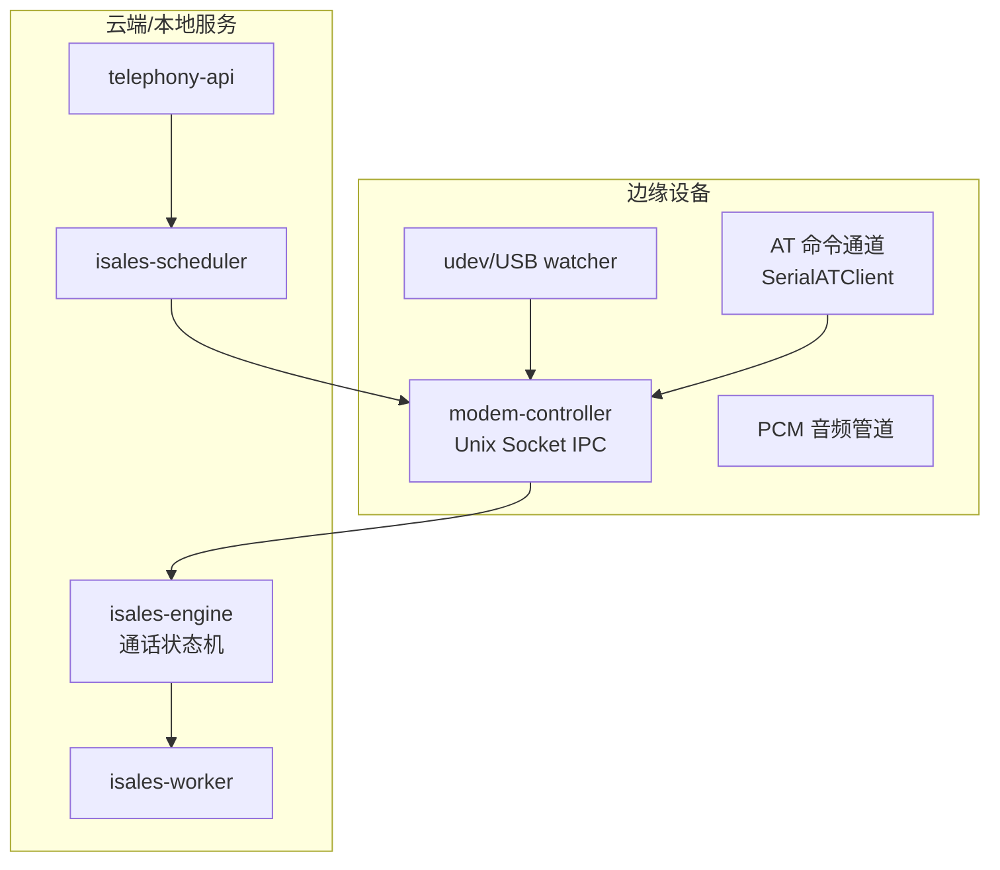
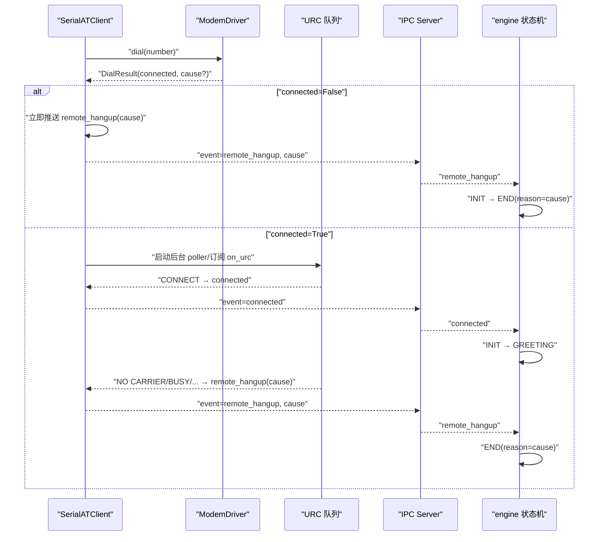
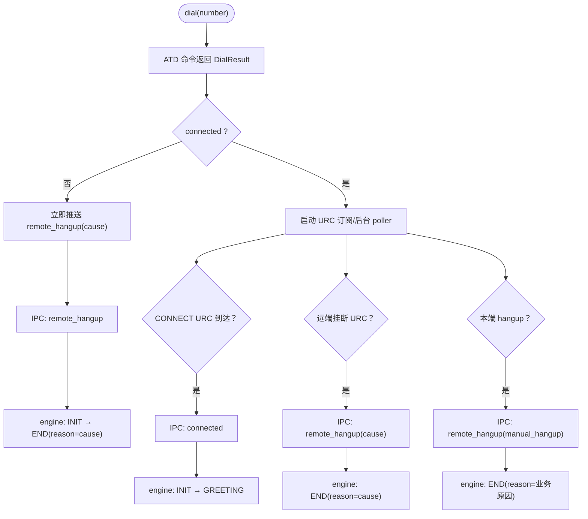
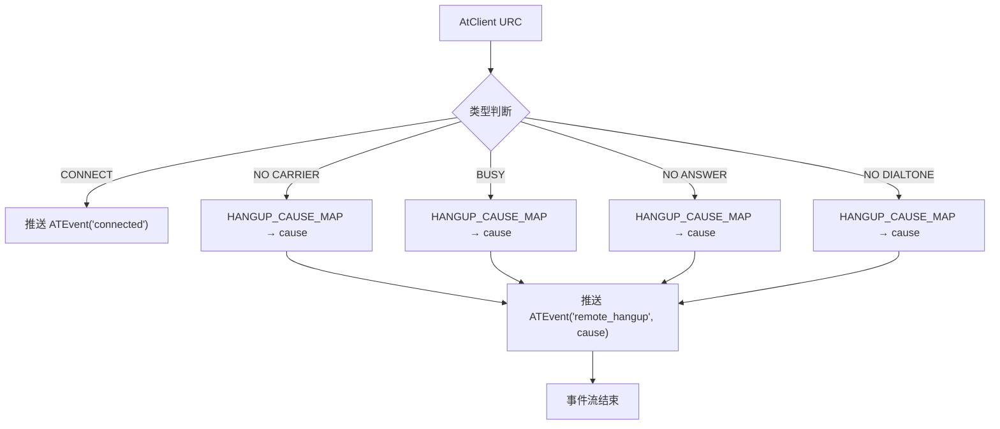
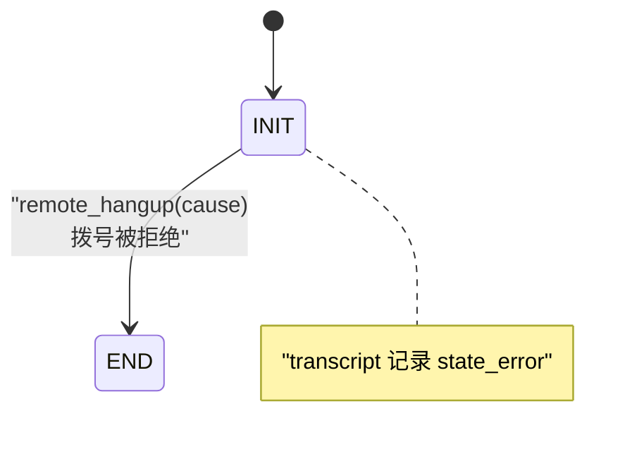
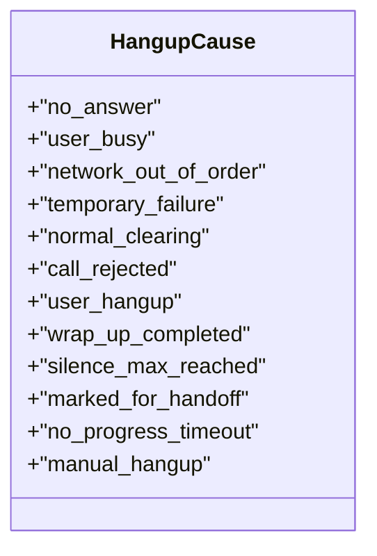
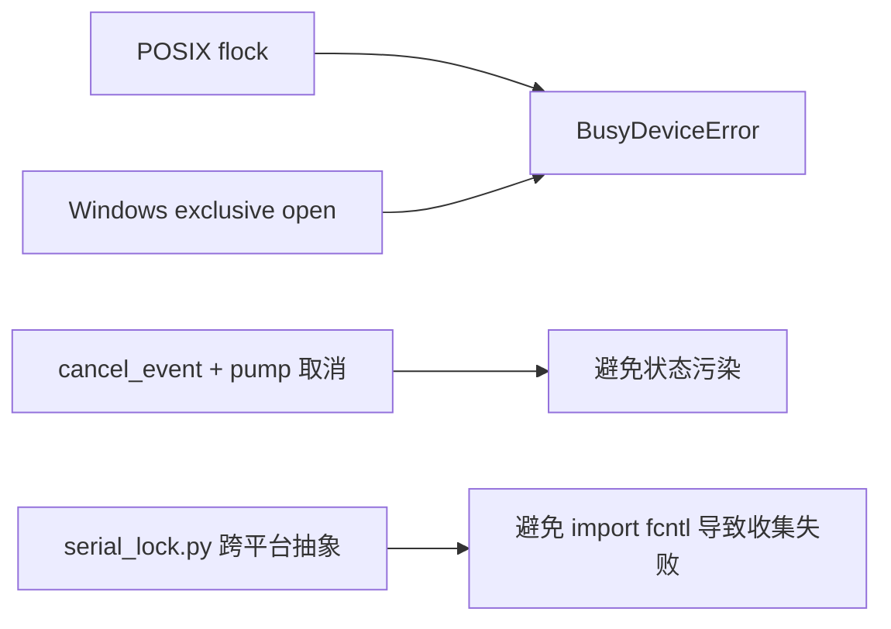

# 硬件事件集成

<cite>
**本文引用的文件**
- [README.md](file://README.md)
- [device-hardware 规格](file://openspec/specs/device-hardware/spec.md)
- [call-state-machine 规格](file://openspec/specs/call-state-machine/spec.md)
- [impl-real-at 任务清单](file://openspec/changes/archive/2026-05-17-impl-real-at/tasks.md)
- [device-hardware 规格（Windows 核心变体）](file://openspec/changes/archive/2026-05-17-windows-client-core/specs/device-hardware/spec.md)
- [prep-stage8-cleanup 任务清单](file://openspec/changes/archive/2026-05-09-prep-stage8-cleanup/tasks.md)
- [call-state-machine 规格（v1.0）](file://openspec/specs/call-state-machine/spec.md)
</cite>

## 目录
1. [简介](#简介)
2. [项目结构](#项目结构)
3. [核心组件](#核心组件)
4. [架构总览](#架构总览)
5. [详细组件分析](#详细组件分析)
6. [依赖关系分析](#依赖关系分析)
7. [性能考量](#性能考量)
8. [故障排查指南](#故障排查指南)
9. [结论](#结论)
10. [附录](#附录)

## 简介
本文件面向 iSales 系统的硬件事件集成，聚焦 ATD 链路的 IPC 事件抽象机制，系统性说明以下主题：
- connected 与 remote_hangup 事件的产生与传播路径
- SerialATClient 的 ATEvent 翻译契约与 URC 到 ATEvent 的映射规则
- 拨号被拒绝的处理逻辑与状态机保护机制
- hangup_cause 枚举的单一来源原则与跨模块一致性保证
- 硬件事件驱动状态转换的实现示例与调试指南

## 项目结构
iSales 主仓为 OpenSpec 规格与实施计划的聚合，实际代码分布在多个子仓中。硬件事件集成涉及的关键子仓与职责如下：
- isales-telephony：提供 modem-controller 守护进程，负责 USB 监听、AT 命令通道与 PCM 音频管道
- isales-engine：实时通话引擎，消费 IPC 事件驱动状态机
- isales-common：跨仓共享的 Pydantic/SQLAlchemy 模型与枚举（含 HangupCause）

**章节来源**
- [README.md: 项目概览与子仓分布:1-14](file://README.md#L1-L14)

## 核心组件
- SerialATClient：生产级 AT 命令通道实现，负责拨号、挂断、状态查询与 URC 翻译
- IPC 协议：engine ↔ modem-controller 的 Unix Socket NDJSON 协议，事件字段最小化
- call-state-machine：引擎侧有限状态机，以 connected/remote_hangup 为驱动进行状态转换
- hangup_cause 枚举：统一的 GSM-side 与应用层原因值，确保跨模块一致性

**章节来源**
- [device-hardware 规格: ATClient 实现策略:270-300](file://openspec/specs/device-hardware/spec.md#L270-L300)
- [call-state-machine 规格: 真硬件 URC 驱动状态转换:146-158](file://openspec/specs/call-state-machine/spec.md#L146-L158)

## 架构总览
ATD 链路的硬件事件集成遵循“底层 URC → ATEvent 翻译 → IPC 事件上报 → 状态机驱动”的闭环。

**图示来源**
- [impl-real-at 任务清单: SerialATClient.dial 实现要点:5-6](file://openspec/changes/archive/2026-05-17-impl-real-at/tasks.md#L5-L6)
- [device-hardware 规格: URC → ATEvent 翻译契约:301-333](file://openspec/specs/device-hardware/spec.md#L301-L333)
- [call-state-machine 规格: connected/remote_hangup 驱动状态转换:146-168](file://openspec/specs/call-state-machine/spec.md#L146-L168)

**章节来源**
- [device-hardware 规格: IPC 协议与事件字段最小化:106-146](file://openspec/specs/device-hardware/spec.md#L106-L146)
- [call-state-machine 规格: ATD ACK 后状态停留在 INIT:150-153](file://openspec/specs/call-state-machine/spec.md#L150-L153)

## 详细组件分析

### ATD 链路与 IPC 事件抽象
- connected 事件：由 CONNECT URC 翻译而来，触发 INIT → GREETING
- remote_hangup 事件：由 NO CARRIER/BUSY/NO ANSWER/NO DIALTONE 等 URC 翻译而来，或由本端 hangup 触发，最终导致 END
- 事件字段最小化：IPC 事件帧仅包含 event、session_id 与必要字段（如 cause），避免暴露内部 call_id

**图示来源**
- [impl-real-at 任务清单: URC → ATEvent 翻译与幂等 hangup:6-7](file://openspec/changes/archive/2026-05-17-impl-real-at/tasks.md#L6-L7)
- [device-hardware 规格: connected/remote_hangup 翻译契约:311-325](file://openspec/specs/device-hardware/spec.md#L311-L325)
- [call-state-machine 规格: 远端 hangup_cause 透传与本端 hangup 保护:160-168](file://openspec/specs/call-state-machine/spec.md#L160-L168)

**章节来源**
- [device-hardware 规格: IPC 事件格式与字段最小化:120-146](file://openspec/specs/device-hardware/spec.md#L120-L146)
- [call-state-machine 规格: ATD ACK 后状态停留在 INIT:150-153](file://openspec/specs/call-state-machine/spec.md#L150-L153)

### SerialATClient 的 ATEvent 翻译契约与映射规则
- URC → ATEvent 翻译：
  - CONNECT → ATEvent("connected")
  - NO CARRIER/BUSY/NO ANSWER/NO DIALTONE → ATEvent("remote_hangup", cause=drivers.HANGUP_CAUSE_MAP 映射)
  - 本端 hangup → ATEvent("remote_hangup", cause="manual_hangup")
- connected 去重与生命周期：
  - 同一生命周期内仅一次 connected
  - remote_hangup 后事件流结束
- dial 超时/拒绝：
  - DialResult.connected=False 时立即推送 remote_hangup(cause)，事件流结束

**图示来源**
- [impl-real-at 任务清单: URC → ATEvent 翻译与 _urc_stream 行为](file://openspec/changes/archive/2026-05-17-impl-real-at/tasks.md#L6)
- [device-hardware 规格: 远端挂断 URC 翻译与 cause 映射:316-320](file://openspec/specs/device-hardware/spec.md#L316-L320)

**章节来源**
- [device-hardware 规格: URC → ATEvent 翻译契约:301-333](file://openspec/specs/device-hardware/spec.md#L301-L333)
- [device-hardware 规格（Windows 核心变体）: 串口竞争互斥与平台差异:110-116](file://openspec/changes/archive/2026-05-17-windows-client-core/specs/device-hardware/spec.md#L110-L116)

### 拨号被拒绝的处理逻辑与状态机保护机制
- 场景：dial 返回事件流第一条即 remote_hangup(cause)
- 行为：modem-controller 通过 IPC 上报 remote_hangup；engine 从 INIT 直接 → END(reason=cause)，跳过 GREETING
- 保护：transcript 记录 state_error，标注 attempted: "connected", from_state: "INIT", to_state: "GREETING"，便于事后分析

**图示来源**
- [call-state-machine 规格: ATD 被拒绝立即结束通话:155-158](file://openspec/specs/call-state-machine/spec.md#L155-L158)

**章节来源**
- [call-state-machine 规格: 拨号被拒绝的保护与 transcript:155-158](file://openspec/specs/call-state-machine/spec.md#L155-L158)

### hangup_cause 枚举的单一来源原则与一致性保证
- 原则：hangup_cause 字段取值来自 isales_common.enums.HangupCause 枚举，禁止各模块自定义平行词汇表
- GSM-side 值：no_answer / user_busy / network_out_of_order / temporary_failure / normal_clearing / call_rejected / user_hangup
- 应用层值：wrap_up_completed / silence_max_reached / marked_for_handoff / no_progress_timeout / manual_hangup
- 例外：manual_hangup 不进入 retry-followup 重试逻辑

**图示来源**
- [call-state-machine 规格: hangup_cause 单一来源与枚举内容:170-180](file://openspec/specs/call-state-machine/spec.md#L170-L180)

**章节来源**
- [call-state-machine 规格: hangup_cause 单一来源与 manual_hangup 例外:170-185](file://openspec/specs/call-state-machine/spec.md#L170-L185)

### 硬件事件驱动状态转换的实现示例与调试指南
- 实现示例（概念性）：
  - dial(number) 返回 (call_id, event_stream)
  - 事件流订阅 URC：CONNECT → connected；NO CARRIER/BUSY/... → remote_hangup(cause)
  - 本端 hangup → remote_hangup(manual_hangup)
  - IPC 事件字段最小化：仅 session_id + 必要字段
- 调试建议：
  - 使用真硬件冒烟脚本独立验证 URC → ATEvent 翻译与事件流结束
  - 关注拨号被拒绝路径的 transcript 记录
  - 校验 hangup_cause 是否符合单一来源枚举

**章节来源**
- [device-hardware 规格: 真硬件冒烟脚本:335-342](file://openspec/specs/device-hardware/spec.md#L335-L342)
- [call-state-machine 规格: 事件驱动 API 与 transcript:187-189](file://openspec/specs/call-state-machine/spec.md#L187-L189)

## 依赖关系分析
- 串口竞争互斥：POSIX 使用 flock，Windows 依赖 OS 级 exclusive open；失败统一抛出 BusyDeviceError
- IPC 取消与泄漏防护：连接断开时通过 cancel_event 与 pump 任务取消，避免状态污染
- 平台抽象：serial_lock.py 提供跨平台独占访问抽象，避免 Windows pytest 收集失败

**图示来源**
- [device-hardware 规格（Windows 核心变体）: 串口竞争互斥与平台差异:110-116](file://openspec/changes/archive/2026-05-17-windows-client-core/specs/device-hardware/spec.md#L110-L116)
- [prep-stage8-cleanup 任务清单: 连接取消与 pump 取消:6-11](file://openspec/changes/archive/2026-05-09-prep-stage8-cleanup/tasks.md#L6-L11)

**章节来源**
- [device-hardware 规格: 串口竞争互斥与平台差异:327-333](file://openspec/specs/device-hardware/spec.md#L327-L333)
- [prep-stage8-cleanup 任务清单: 连接取消与 pump 取消:6-11](file://openspec/changes/archive/2026-05-09-prep-stage8-cleanup/tasks.md#L6-L11)

## 性能考量
- 事件流去重与及时结束：connected 去重与 remote_hangup 后事件流结束，避免冗余状态转换
- 并发 dial 拒绝：同一串口设备的并发 dial 拒绝与 BusyDeviceError 保障资源独占
- 心跳兜底：modem-controller 心跳与 watchdog 共同覆盖失联探测，降低 udev 漏报风险

**章节来源**
- [device-hardware 规格: 心跳与失联探测:208-235](file://openspec/specs/device-hardware/spec.md#L208-L235)
- [impl-real-at 任务清单: 并发 dial 拒绝与 BusyDeviceError](file://openspec/changes/archive/2026-05-17-impl-real-at/tasks.md#L10)

## 故障排查指南
- 拨号被拒绝：
  - 现象：INIT → END，transcript 记录 state_error
  - 排查：确认 DialResult.hangup_cause 与 IPC remote_hangup 的 cause 一致
- 事件流未结束：
  - 现象：connected 后仍有挂断事件
  - 排查：检查 _urc_stream 是否正确去重 connected 与在 remote_hangup 后 return
- 本端 hangup 未生效：
  - 现象：engine 未收到 remote_hangup(manual_hangup)
  - 排查：确认 hangup 幂等（active_call_id 匹配）与 IPC 事件字段最小化
- 串口被占用：
  - 现象：启动时报 BusyDeviceError
  - 排查：确认 flock/OS exclusive open 成功，避免多实例竞争

**章节来源**
- [call-state-machine 规格: 拨号被拒绝的保护与 transcript:155-158](file://openspec/specs/call-state-machine/spec.md#L155-L158)
- [impl-real-at 任务清单: URC → ATEvent 翻译与幂等 hangup:6-7](file://openspec/changes/archive/2026-05-17-impl-real-at/tasks.md#L6-L7)
- [device-hardware 规格: 串口竞争互斥与平台差异:327-333](file://openspec/specs/device-hardware/spec.md#L327-L333)

## 结论
iSales 的硬件事件集成通过 SerialATClient 将底层 URC 翻译为统一的 IPC 事件，再由 call-state-machine 驱动状态转换。该方案以“事件驱动 + 单一来源枚举”为核心，确保拨号被拒绝、远端挂断与本端挂断等关键路径的一致性与可追溯性。配合串口互斥、IPC 取消与心跳兜底，系统在真实硬件环境下具备良好的鲁棒性与可观测性。

## 附录
- 相关变更与验收：
  - impl-real-at：SerialATClient 落地与映射表对齐
  - prep-stage8-cleanup：IPC 取消与字段最小化
- 参考脚本：
  - 真硬件冒烟脚本：独立验证 URC → ATEvent 翻译与事件流结束

**章节来源**
- [impl-real-at 任务清单: 规范对齐与验收:31-40](file://openspec/changes/archive/2026-05-17-impl-real-at/tasks.md#L31-L40)
- [device-hardware 规格: 真硬件冒烟脚本:335-342](file://openspec/specs/device-hardware/spec.md#L335-L342)
- [prep-stage8-cleanup 任务清单: IPC 协议字段统一:20-24](file://openspec/changes/archive/2026-05-09-prep-stage8-cleanup/proposal.md#L20-L24)