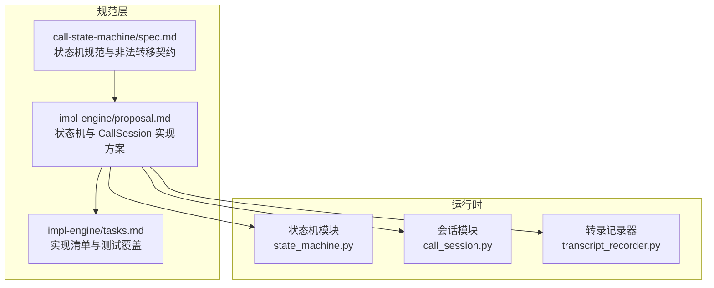
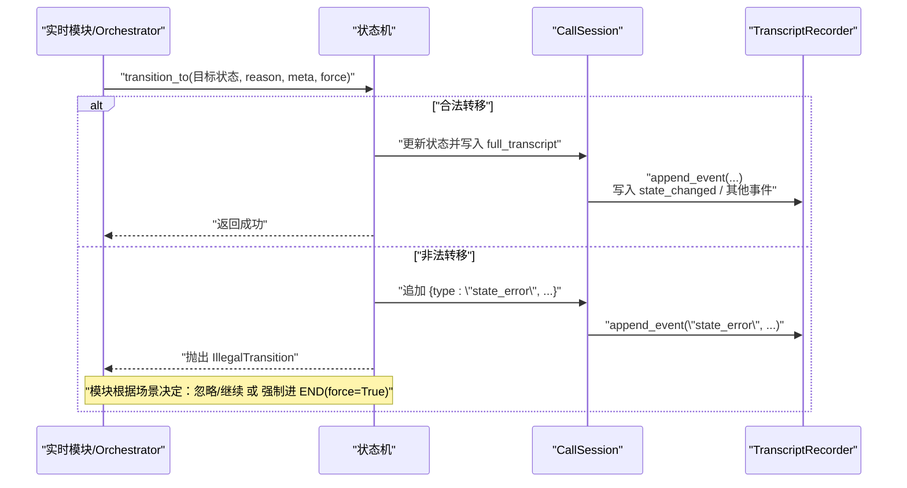
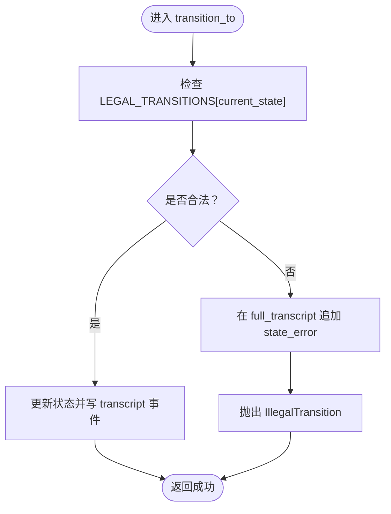
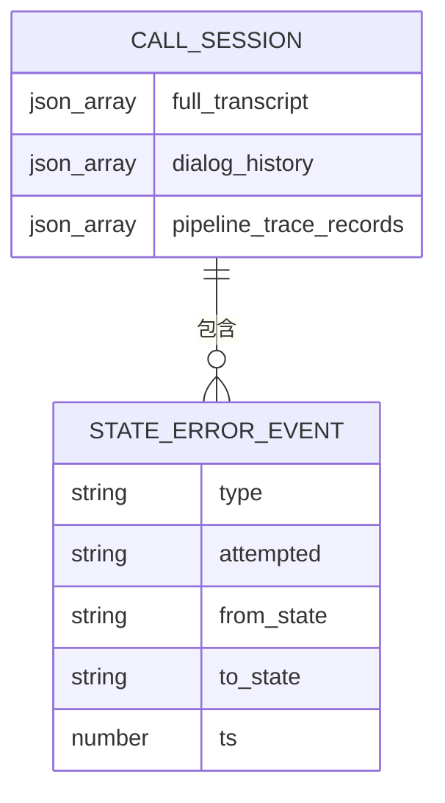
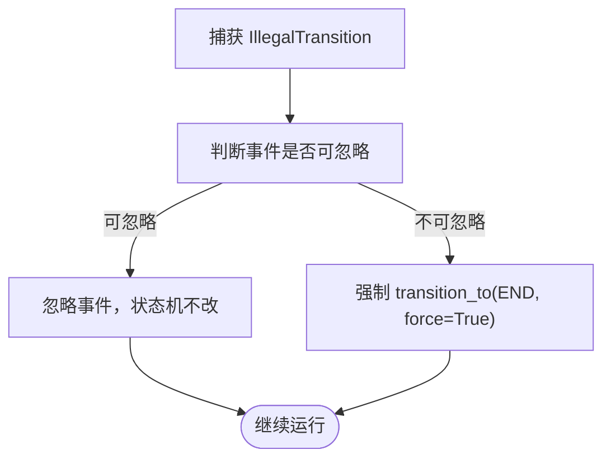
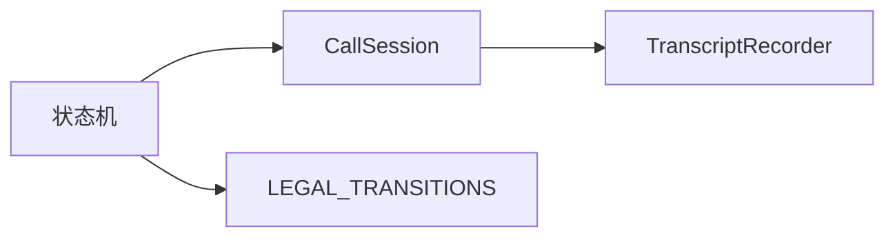

# 非法转换处理机制

<cite>
**本文引用的文件**
- [call-state-machine/spec.md](file://openspec/specs/call-state-machine/spec.md)
- [impl-engine/proposal.md](file://openspec/changes/archive/2026-05-07-impl-engine/proposal.md)
- [impl-engine/tasks.md](file://openspec/changes/archive/2026-05-07-impl-engine/tasks.md)
</cite>

## 目录
1. [引言](#引言)
2. [项目结构](#项目结构)
3. [核心组件](#核心组件)
4. [架构总览](#架构总览)
5. [详细组件分析](#详细组件分析)
6. [依赖分析](#依赖分析)
7. [性能考量](#性能考量)
8. [故障排查指南](#故障排查指南)
9. [结论](#结论)
10. [附录](#附录)

## 引言
本文件面向 iSales 系统的引擎侧（isales-engine），系统化阐述“非法转换处理机制”。重点覆盖：
- IllegalTransition 异常的触发条件与处理流程
- state_error 事件的生成机制与 transcript 记录格式
- 非法转换的可恢复与不可恢复区分标准
- 强制转换（force=True）的使用场景与安全考虑
- 非法转换检测与恢复的实现示例（模块级异常捕获与状态机级错误处理策略）

## 项目结构
围绕非法转换处理机制的相关规范与实现要点主要分布在以下位置：
- call-state-machine/spec.md：定义状态集合、合法转移、非法转移的硬契约与 state_error 事件格式
- impl-engine/proposal.md：状态机与 CallSession 的实现方案、统一事件驱动 API、非法转移抛异常与写 transcript 的设计
- impl-engine/tasks.md：状态机实现清单（含 IllegalTransition、transition_to(force)、transcript 写入等）

**图表来源**
- [call-state-machine/spec.md:1-190](file://openspec/specs/call-state-machine/spec.md#L1-L190)
- [impl-engine/proposal.md:18-22](file://openspec/changes/archive/2026-05-07-impl-engine/proposal.md#L18-L22)
- [impl-engine/tasks.md:16-26](file://openspec/changes/archive/2026-05-07-impl-engine/tasks.md#L16-L26)

**章节来源**
- [call-state-machine/spec.md:1-190](file://openspec/specs/call-state-machine/spec.md#L1-L190)
- [impl-engine/proposal.md:18-22](file://openspec/changes/archive/2026-05-07-impl-engine/proposal.md#L18-L22)
- [impl-engine/tasks.md:16-26](file://openspec/changes/archive/2026-05-07-impl-engine/tasks.md#L16-L26)

## 核心组件
- 状态机（StateMachine）
  - 维护合法转移集合 LEGAL_TRANSITIONS
  - 统一事件驱动 API：session.transition_to(NEW_STATE, reason, meta, force=False)
  - 非法转移时抛出 IllegalTransition，并在 full_transcript 中追加 state_error 事件
- CallSession
  - 承载单通通话上下文（dialog_history、full_transcript、pipeline_trace_records 等）
  - 提供 append_event(type, **fields) 自动写入相对时间戳与类型校验
- TranscriptRecorder
  - 负责 call_record 与 pipeline_trace 的持久化，保证事务性与可观测性

**章节来源**
- [impl-engine/proposal.md:18-22](file://openspec/changes/archive/2026-05-07-impl-engine/proposal.md#L18-L22)
- [impl-engine/tasks.md:16-26](file://openspec/changes/archive/2026-05-07-impl-engine/tasks.md#L16-L26)

## 架构总览
非法转换处理贯穿“状态机 → 会话 → 转录记录器”的链路，确保每次状态转换均通过统一入口进行合法性校验与事件记录。

**图表来源**
- [call-state-machine/spec.md:21-44](file://openspec/specs/call-state-machine/spec.md#L21-L44)
- [impl-engine/proposal.md:18-22](file://openspec/changes/archive/2026-05-07-impl-engine/proposal.md#L18-L22)

## 详细组件分析

### IllegalTransition 异常与触发条件
- 触发条件
  - 任何模块（filler / silence / transfer / orchestrator 等）尝试将状态转移到当前状态的 LEGAL_TRANSITIONS 集合之外
  - 触发后，状态机必须抛出 IllegalTransition 异常
- 异常抛出与事件记录
  - 状态机在非法转移时，必须在 full_transcript 中追加 state_error 事件
  - 事件字段包含 attempted（事件名）、from_state（当前状态）、to_state（意图目标状态）、ts（相对通话开始的毫秒时间戳）

**图表来源**
- [call-state-machine/spec.md:21-44](file://openspec/specs/call-state-machine/spec.md#L21-L44)

**章节来源**
- [call-state-machine/spec.md:21-44](file://openspec/specs/call-state-machine/spec.md#L21-L44)

### state_error 事件生成机制与 transcript 记录格式
- 生成机制
  - 非法转移发生时，状态机在 CallSession.full_transcript 中追加一条 state_error 事件
  - 事件自动携带相对时间戳 ts（相对于通话开始）
- 记录格式
  - 字段：type（固定为 "state_error"）、attempted（事件名）、from_state（当前状态）、to_state（意图目标状态）、ts（相对毫秒）
  - 该事件属于 full_transcript，用于调试与审计

**图表来源**
- [call-state-machine/spec.md:33-36](file://openspec/specs/call-state-machine/spec.md#L33-L36)

**章节来源**
- [call-state-machine/spec.md:33-36](file://openspec/specs/call-state-machine/spec.md#L33-L36)

### 非法转换的可恢复与不可恢复区分标准
- 可恢复（忽略事件）
  - 当模块捕获 IllegalTransition 时，若判断“事件可忽略”（例如 PROCESSING 期间的 ASR partial）
  - 处理策略：模块继续执行，状态机不改变状态
- 不可恢复（强制进 END）
  - 当模块捕获 IllegalTransition 时，若判断“事件不可忽略”（例如 PROCESSING 期间 telephony_client 心跳丢失）
  - 处理策略：模块强制进入 END（reason=engine_internal_error），通过 transition_to(END, reason=..., force=True) 跳过合法性校验

**图表来源**
- [call-state-machine/spec.md:38-44](file://openspec/specs/call-state-machine/spec.md#L38-L44)

**章节来源**
- [call-state-machine/spec.md:38-44](file://openspec/specs/call-state-machine/spec.md#L38-L44)

### 强制转换机制（force=True）的使用场景与安全考虑
- 使用场景
  - 当系统处于不可恢复的异常状态（如底层心跳丢失、资源不可用）时，为避免状态机卡死或数据不一致，允许模块绕过合法性校验直接进入 END
- 安全考虑
  - force=True 仅在“不可恢复”场景使用，不应滥用
  - 强制转换后应记录明确的 reason（如 engine_internal_error），便于后续审计与定位
  - 强制转换后应确保完成 call_record 与 pipeline_trace 的落库，避免数据丢失

**章节来源**
- [call-state-machine/spec.md:43-44](file://openspec/specs/call-state-machine/spec.md#L43-L44)
- [impl-engine/proposal.md:18-22](file://openspec/changes/archive/2026-05-07-impl-engine/proposal.md#L18-L22)

### 非法转换检测与恢复的实现示例
以下示例以“伪代码路径”形式展示模块级异常捕获与状态机级错误处理策略，便于对照实现：

- 模块级异常捕获（可恢复）
  - 捕获 IllegalTransition，判断事件是否可忽略（如 PROCESSING 期间的 ASR partial）
  - 若可忽略：记录日志并继续执行，不改变状态
  - 示例路径参考：[impl-engine/proposal.md:18-22](file://openspec/changes/archive/2026-05-07-impl-engine/proposal.md#L18-L22)
- 模块级异常捕获（不可恢复）
  - 捕获 IllegalTransition，判断事件不可忽略（如 PROCESSING 期间 telephony_client 心跳丢失）
  - 调用 transition_to(END, reason="engine_internal_error", force=True)，强制结束通话
  - 示例路径参考：[call-state-machine/spec.md:43-44](file://openspec/specs/call-state-machine/spec.md#L43-L44)
- 状态机级错误处理策略
  - transition_to 统一入口：负责合法性校验、非法转移时写 state_error、抛出 IllegalTransition
  - 示例路径参考：[impl-engine/tasks.md:16-26](file://openspec/changes/archive/2026-05-07-impl-engine/tasks.md#L16-L26)
- 事件写入与持久化
  - full_transcript 追加 state_error 事件
  - call_record 与 pipeline_trace 通过 TranscriptRecorder 持久化
  - 示例路径参考：[impl-engine/proposal.md:18-22](file://openspec/changes/archive/2026-05-07-impl-engine/proposal.md#L18-L22)

**章节来源**
- [call-state-machine/spec.md:33-44](file://openspec/specs/call-state-machine/spec.md#L33-L44)
- [impl-engine/proposal.md:18-22](file://openspec/changes/archive/2026-05-07-impl-engine/proposal.md#L18-L22)
- [impl-engine/tasks.md:16-26](file://openspec/changes/archive/2026-05-07-impl-engine/tasks.md#L16-L26)

## 依赖分析
- 状态机与会话
  - 状态机依赖 LEGAL_TRANSITIONS 与 CallSession 的 full_transcript
  - CallSession 依赖 TranscriptRecorder 的持久化能力
- 事件契约
  - 所有状态转换事件（含 state_error）均遵循 transcript 规范，确保跨模块一致性

**图表来源**
- [impl-engine/proposal.md:18-22](file://openspec/changes/archive/2026-05-07-impl-engine/proposal.md#L18-L22)

**章节来源**
- [impl-engine/proposal.md:18-22](file://openspec/changes/archive/2026-05-07-impl-engine/proposal.md#L18-L22)

## 性能考量
- 非法转移检测为 O(1) 查表（基于 LEGAL_TRANSITIONS），开销极低
- 事件写入采用 append_event 自动 ts 与类型校验，避免重复计算
- pipeline_trace 的写入采用独立 try/except 包裹，失败不影响通话主路径

**章节来源**
- [impl-engine/proposal.md:18-22](file://openspec/changes/archive/2026-05-07-impl-engine/proposal.md#L18-L22)

## 故障排查指南
- 如何定位非法转换
  - 检查 full_transcript 中是否存在 type="state_error" 的事件
  - 关注 attempted、from_state、to_state、ts 字段，结合业务逻辑判断是否合理
- 如何区分可恢复与不可恢复
  - 可恢复：事件可忽略（如中间态 ASR partial），模块继续执行
  - 不可恢复：底层资源异常（如心跳丢失），强制进 END
- 如何验证强制转换的安全性
  - 确认 force=True 仅在不可恢复场景使用
  - 检查 END.reason 是否明确，call_record/pipeline_trace 是否完整落库

**章节来源**
- [call-state-machine/spec.md:33-44](file://openspec/specs/call-state-machine/spec.md#L33-L44)
- [impl-engine/proposal.md:18-22](file://openspec/changes/archive/2026-05-07-impl-engine/proposal.md#L18-L22)

## 结论
非法转换处理机制通过“统一状态转换入口 + 合法性校验 + 强制转换兜底 + 事件可观测性”形成闭环，既保障了状态机的正确性，又提供了灵活的错误恢复策略。建议在实现中严格遵循：
- 所有状态转换必须通过 transition_to
- 非法转移一律写 state_error 并抛出 IllegalTransition
- 可恢复场景忽略事件，不可恢复场景使用 force=True 强制进 END
- 事件与数据落库必须可靠，确保审计与回溯能力

## 附录
- 相关规范与实现清单
  - call-state-machine/spec.md：状态机规范与非法转移契约
  - impl-engine/proposal.md：状态机与 CallSession 实现方案
  - impl-engine/tasks.md：实现清单与测试覆盖

**章节来源**
- [call-state-machine/spec.md:1-190](file://openspec/specs/call-state-machine/spec.md#L1-L190)
- [impl-engine/proposal.md:18-22](file://openspec/changes/archive/2026-05-07-impl-engine/proposal.md#L18-L22)
- [impl-engine/tasks.md:16-26](file://openspec/changes/archive/2026-05-07-impl-engine/tasks.md#L16-L26)