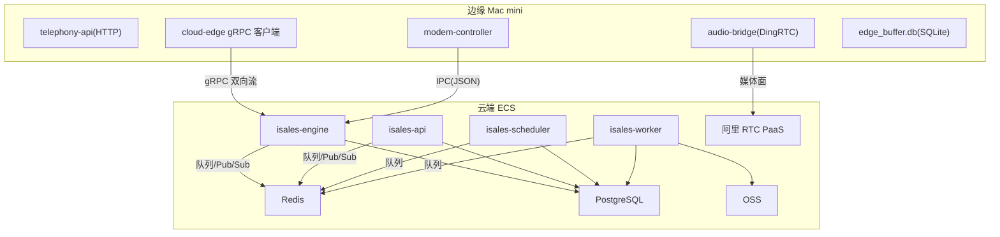
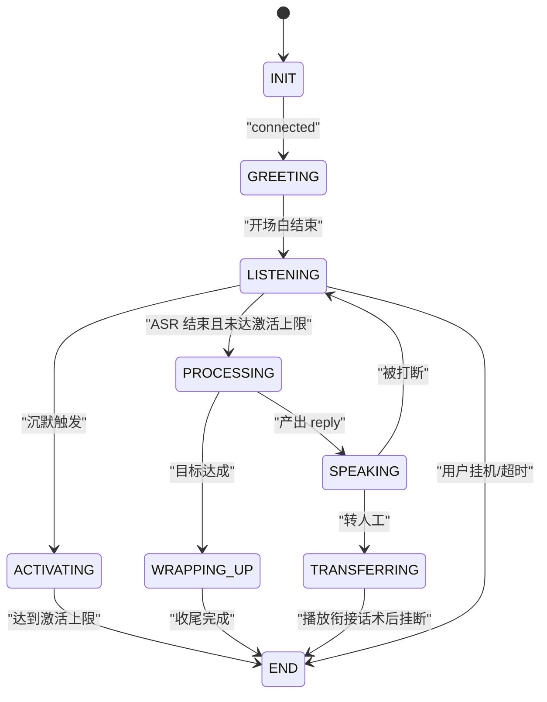
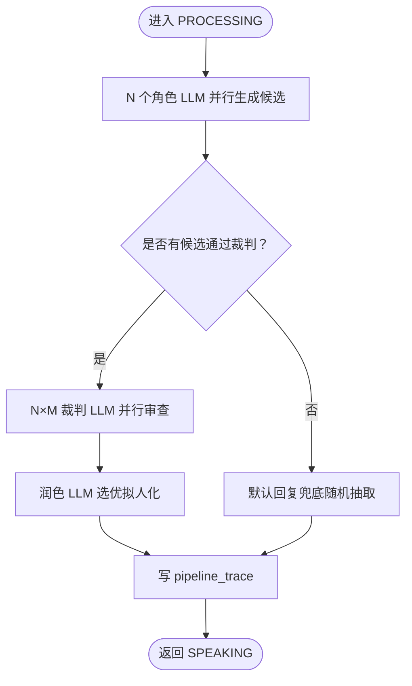
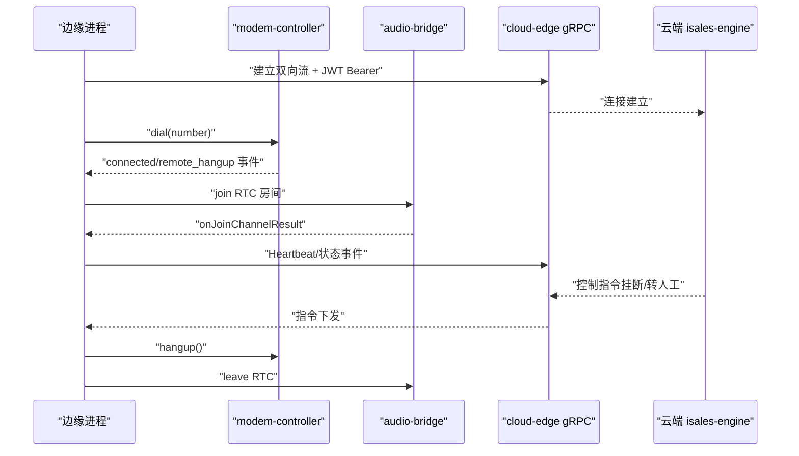
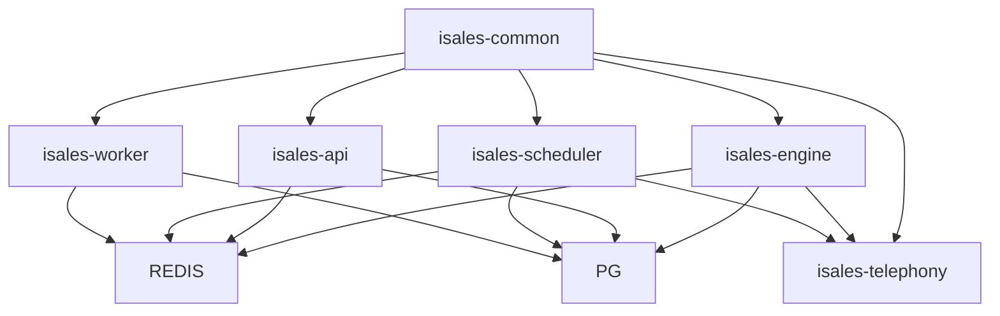

# 系统架构设计

<cite>
**本文档引用的文件**
- [README.md](file://README.md)
- [DESIGN.md](file://DESIGN.md)
- [deploy/cloud/README.md](file://deploy/cloud/README.md)
- [deploy/edge/README.md](file://deploy/edge/README.md)
- [openspec/specs/architecture/spec.md](file://openspec/specs/architecture/spec.md)
- [openspec/specs/deployment-topology/spec.md](file://openspec/specs/deployment-topology/spec.md)
- [openspec/specs/call-state-machine/spec.md](file://openspec/specs/call-state-machine/spec.md)
- [openspec/specs/ai-pipeline/spec.md](file://openspec/specs/ai-pipeline/spec.md)
- [openspec/specs/service-communication/spec.md](file://openspec/specs/service-communication/spec.md)
- [openspec/specs/device-hardware/spec.md](file://openspec/specs/device-hardware/spec.md)
- [openspec/specs/data-model/spec.md](file://openspec/specs/data-model/spec.md)
- [openspec/specs/message-contract/spec.md](file://openspec/specs/message-contract/spec.md)
- [deploy/cloud/STATE.md](file://deploy/cloud/STATE.md)
- [deploy/monitoring/README.md](file://deploy/monitoring/README.md)
- [deploy/RUNBOOK.md](file://deploy/RUNBOOK.md)
</cite>

## 目录
1. [简介](#简介)
2. [项目结构](#项目结构)
3. [核心组件](#核心组件)
4. [架构总览](#架构总览)
5. [详细组件分析](#详细组件分析)
6. [依赖关系分析](#依赖关系分析)
7. [性能考量](#性能考量)
8. [故障排查指南](#故障排查指南)
9. [结论](#结论)
10. [附录](#附录)

## 简介
本文件面向 iSales 系统的七仓库微服务架构，聚焦云-边分离部署模式的设计与实现，阐述系统边界、组件交互、数据流与集成模式，解释技术决策、权衡与约束条件。文档同时覆盖基础设施要求、可扩展性考虑、部署拓扑、安全与监控、灾难恢复，以及技术栈与第三方依赖的版本兼容性。重点突出状态机引擎、AI 三层管线与实时通话控制等核心架构组件。

## 项目结构
iSales 采用“七仓库”微服务架构，isales-common 作为共享库被其余六个服务依赖。各仓库职责清晰，跨仓库功能在设计阶段明确归属，避免职责分散与边界模糊。

- 仓库划分与职责
  - isales-common：Pydantic/SQLAlchemy 模型、Provider ABC、Alembic 迁移、工具库
  - isales-api：管理后台 + WebSocket 代理
  - isales-engine：实时通话引擎（状态机 + AI 三层管线 + 调制解调器控制）
  - isales-scheduler：线索调度（Campaign 启停/拨号队列）
  - isales-worker：后处理（摘要/回调/聚合）
  - isales-telephony：telephony-api + modem-controller（设备/调制解调器）
  - isales-web：Vue 3 管理界面

- 单主机部署与共享基础设施
  - v1 单主机部署（≤8 路并发），服务通过 systemd/launchd 管理
  - 共享 PostgreSQL 与 Redis，统一 Alembic 迁移管理
  - isales-common 仅包含跨服务共享的稳定接口，不包含特定业务逻辑

```mermaid
graph TB
subgraph "前端"
WEB["isales-web (Vue 3)"]
end
subgraph "云端 ECS"
API["isales-api (FastAPI + WS 代理)"]
ENGINE["isales-engine (实时通话引擎)"]
SCHED["isales-scheduler (线索调度)"]
WORKER["isales-worker (后处理)"]
REDIS["Redis"]
PG["PostgreSQL"]
end
subgraph "边缘 Mac mini"
TELEPHONY["isales-telephony<br/>telephony-api + modem-controller + audio-bridge"]
end
WEB --> API
API <- --> REDIS
ENGINE <- --> REDIS
SCHED <- --> REDIS
WORKER <- --> REDIS
ENGINE --> PG
API --> PG
SCHED --> PG
WORKER --> PG
ENGINE -. gRPC bidi .-> TELEPHONY
```

图表来源
- [openspec/specs/architecture/spec.md:130-168](file://openspec/specs/architecture/spec.md#L130-L168)
- [openspec/specs/deployment-topology/spec.md:1-120](file://openspec/specs/deployment-topology/spec.md#L1-L120)

章节来源
- [README.md:1-86](file://README.md#L1-L86)
- [openspec/specs/architecture/spec.md:1-168](file://openspec/specs/architecture/spec.md#L1-L168)
- [openspec/specs/deployment-topology/spec.md:1-120](file://openspec/specs/deployment-topology/spec.md#L1-L120)

## 核心组件
- 状态机引擎（isales-engine）
  - 单通通话生命周期的状态机，定义状态集合、转换规则与特殊状态（WRAPPING_UP/TRANSFERRING/ACTIVATING）
  - 与打断检测、垫词、沉默激活、目标达成、转人工等实时行为模块强耦合
  - 通过统一事件驱动 API 触发状态转换，便于 transcript 记录与单元测试

- AI 三层管线（isales-engine）
  - N 个角色 LLM 并行 PK → N×M 个裁判 LLM 并行审查 → 1 个润色 LLM 选优拟人化
  - 每轮 PROCESSING 写入 pipeline_trace，覆盖成功/兜底/降级/异常路径
  - WRAPPING_UP 状态走简化管线（单角色 + 润色）

- 实时通话控制（isales-telephony + isales-engine）
  - modem-controller：udev 监听 + AT 命令 + PCM 音频管道，IPC 与 engine 通信
  - audio-bridge：通过 AliRTC SDK（DingRTC）进行媒体面传输
  - cloud-edge gRPC：云端与边缘的双向控制面通道，边缘侧通过 JWT Bearer 校验

- 服务间通信（isales-api/scheduler/engine/worker/telephony）
  - Redis 队列：调度派发、通话结束、Campaign 启停
  - Redis Pub/Sub：实时事件广播（状态变更/ASR 文本）
  - HTTP：设备选择（scheduler → telephony-api）
  - 数据库直连：统一 PostgreSQL，通过 isales-common 模型访问

章节来源
- [openspec/specs/call-state-machine/spec.md:1-190](file://openspec/specs/call-state-machine/spec.md#L1-L190)
- [openspec/specs/ai-pipeline/spec.md:1-166](file://openspec/specs/ai-pipeline/spec.md#L1-L166)
- [openspec/specs/service-communication/spec.md:1-150](file://openspec/specs/service-communication/spec.md#L1-L150)
- [openspec/specs/device-hardware/spec.md:1-525](file://openspec/specs/device-hardware/spec.md#L1-L525)

## 架构总览
云-边分离部署模式将“管理与调度”置于云端 ECS，“设备与媒体”置于边缘 Mac mini。边缘进程包含 telephony-api、modem-controller、audio-bridge 与 cloud-edge gRPC 客户端，通过 gRPC 与云端引擎交互。控制面采用 JWT Bearer 校验，媒体面通过阿里 RTC PaaS。

- 云端（ECS）
  - isales-api：HTTP + WebSocket，提供管理后台与前端代理
  - isales-engine：实时通话引擎，gRPC 服务端（plaintext，v1.0 IP 直连）
  - isales-scheduler：线索派发与队列管理
  - isales-worker：后处理与回调
  - 中间件：PostgreSQL、Redis、阿里 RTC PaaS、OSS（预留）

- 边缘（Mac mini）
  - isales-telephony：telephony-api（HTTP）、modem-controller（守护）、audio-bridge（ARTC）、cloud-edge gRPC 客户端
  - 硬件：USB GSM modem、系统音频设备
  - 状态目录：SQLite edge_buffer.db、本地录音缓存



图表来源
- [deploy/cloud/README.md:1-118](file://deploy/cloud/README.md#L1-L118)
- [deploy/edge/README.md:1-99](file://deploy/edge/README.md#L1-L99)
- [openspec/specs/service-communication/spec.md:1-150](file://openspec/specs/service-communication/spec.md#L1-L150)

章节来源
- [deploy/cloud/README.md:1-118](file://deploy/cloud/README.md#L1-L118)
- [deploy/edge/README.md:1-99](file://deploy/edge/README.md#L1-L99)
- [openspec/specs/service-communication/spec.md:1-150](file://openspec/specs/service-communication/spec.md#L1-L150)

## 详细组件分析

### 状态机引擎（通话生命周期）
- 状态集合与转换
  - INIT/GREETING/LISTENING/SPEAKING/INTERRUPTED/FILLER/PROCESSING/WRAPPING_UP/ACTIVATING/TRANSFERRING/END
  - 合法转移集合由 LEGAL_TRANSITIONS 约束，非法转移抛出异常并记录 state_error
- 关键转换
  - connected → GREETING（开场白）
  - LISTENING → PROCESSING（ASR 结束且未达激活上限）
  - PROCESSING → SPEAKING（产出 reply）
  - WRAPPING_UP → END（收尾轮次/时长耗尽）
  - ACTIVATING → END（沉默激活上限）
  - TRANSFERRING → END（转人工衔接话术后主动挂断）
- 连续打断保护与 FILLER 并行
  - 连续打断计数器超过阈值触发保护策略（short_reply/listen_only）
  - FILLER 与 PROCESSING 并行，打断时停止垫词、丢弃当前 PROCESSING，开启新一轮



图表来源
- [openspec/specs/call-state-machine/spec.md:46-149](file://openspec/specs/call-state-machine/spec.md#L46-L149)

章节来源
- [openspec/specs/call-state-machine/spec.md:1-190](file://openspec/specs/call-state-machine/spec.md#L1-L190)

### AI 三层管线（实时对话编排）
- 三层并行编排
  - Layer 1：N 个角色 LLM 并行生成候选（强制 JSON Mode）
  - Layer 2：N×M 个裁判 LLM 并行审查（仅审查候选 reply 字段）
  - Layer 3：润色 LLM 选优并拟人化
- 兜底与降级
  - 全部裁判否决 → 默认回复兜底（随机抽取）
  - 润色失败 → 取第一个通过裁判的候选作为兜底
  - Layer 1 全部失败 → 写 pipeline_trace 标注 error
- 简化管线（WRAPPING_UP）
  - 单角色 + 润色，不启用 PK 与裁判



图表来源
- [openspec/specs/ai-pipeline/spec.md:7-166](file://openspec/specs/ai-pipeline/spec.md#L7-L166)

章节来源
- [openspec/specs/ai-pipeline/spec.md:1-166](file://openspec/specs/ai-pipeline/spec.md#L1-L166)

### 实时通话控制（modem-controller + audio-bridge + gRPC）
- modem-controller
  - udev 监听 USB GSM modem，AT 命令拨号/挂断，PCM 音频双向流转
  - 通过本地 Unix socket（JSON 帧）与 engine 通信，事件帧最小化
- audio-bridge
  - 通过 DingRTC SDK（macOS/Windows/云 Linux）接入阿里 RTC PaaS
  - 8kHz/16kHz 重采样与音频帧格式约定，端到端延迟 SLA
- cloud-edge gRPC
  - 边缘 client 与云端 server 建立双向流，JWT Bearer 校验
  - 云端 engine 监听心跳与控制指令，边缘上报设备状态与事件



图表来源
- [openspec/specs/device-hardware/spec.md:106-170](file://openspec/specs/device-hardware/spec.md#L106-L170)
- [openspec/specs/service-communication/spec.md:19-22](file://openspec/specs/service-communication/spec.md#L19-L22)
- [deploy/cloud/STATE.md:442-488](file://deploy/cloud/STATE.md#L442-L488)

章节来源
- [openspec/specs/device-hardware/spec.md:1-525](file://openspec/specs/device-hardware/spec.md#L1-L525)
- [openspec/specs/service-communication/spec.md:1-150](file://openspec/specs/service-communication/spec.md#L1-L150)
- [deploy/cloud/STATE.md:442-488](file://deploy/cloud/STATE.md#L442-L488)

### 服务间通信与数据流
- 通信通道矩阵
  - scheduler → engine：Redis 队列（DialRequest）
  - engine → worker：Redis 队列（CallEnded）
  - api ↔ engine：Redis Pub/Sub（EngineControl/EngineEvent）
  - api → scheduler：Redis 队列（CampaignControl）
  - scheduler → telephony-api：HTTP（设备选择）
  - engine ↔ modem-controller：本地 IPC（Unix socket/JSON）
  - worker → 外部：HTTP（Webhook 回调）
- 消息契约
  - 所有跨服务消息体集中定义于 isales-common，使用 Pydantic 模型序列化/反序列化
  - 消息包含 schema_version/message_id/created_at，支持非破坏性与破坏性演进

```mermaid
graph LR
SCHED["scheduler"] --> |Redis Queue| ENGINE["engine"]
ENGINE --> |Redis Queue| WORKER["worker"]
API["api"] < --> |Redis Pub/Sub| ENGINE
API --> |Redis Queue| SCHED
SCHED --> |HTTP| TEL["telephony-api"]
ENGINE < --> |IPC(JSON)| MODEM["modem-controller"]
WORKER --> |HTTP| EXT["外部系统"]
subgraph "共享存储"
PG["PostgreSQL"]
REDIS["Redis"]
end
ENGINE --> PG
API --> PG
SCHED --> PG
WORKER --> PG
```

图表来源
- [openspec/specs/service-communication/spec.md:7-44](file://openspec/specs/service-communication/spec.md#L7-L44)
- [openspec/specs/message-contract/spec.md:6-52](file://openspec/specs/message-contract/spec.md#L6-L52)

章节来源
- [openspec/specs/service-communication/spec.md:1-150](file://openspec/specs/service-communication/spec.md#L1-L150)
- [openspec/specs/message-contract/spec.md:1-85](file://openspec/specs/message-contract/spec.md#L1-L85)

### 数据模型与一致性
- 数据模型由 isales-common 统一管理，所有服务通过依赖访问
- 表归属明确，跨服务读写权由“数据库直连”与“跨服务读 vs 写”约束
- JSONB 字段用于半结构化配置/事件流，需在对应 capability spec 中提供 JSON schema

章节来源
- [openspec/specs/data-model/spec.md:1-83](file://openspec/specs/data-model/spec.md#L1-L83)

## 依赖关系分析
- 组件耦合与内聚
  - isales-common 作为共享库，提供稳定的跨服务接口，降低耦合
  - 服务间通过 Redis/HTTP/数据库直连交互，避免引入“数据网关”层
- 直接与间接依赖
  - engine 依赖 modem-controller（IPC）与 Redis/PG
  - scheduler 依赖 Redis 与 telephony-api（HTTP）
  - worker 依赖 Redis 与外部系统（HTTP）
  - api 依赖 Redis/PG/WS 代理
- 外部依赖
  - 阿里 RTC PaaS（媒体面）
  - DingRTC SDK（跨平台绑定）
  - PostgreSQL/Redis（托管/自管）



图表来源
- [openspec/specs/architecture/spec.md:70-90](file://openspec/specs/architecture/spec.md#L70-L90)
- [openspec/specs/deployment-topology/spec.md:35-90](file://openspec/specs/deployment-topology/spec.md#L35-L90)

章节来源
- [openspec/specs/architecture/spec.md:1-168](file://openspec/specs/architecture/spec.md#L1-L168)
- [openspec/specs/deployment-topology/spec.md:1-120](file://openspec/specs/deployment-topology/spec.md#L1-L120)

## 性能考量
- 并发控制
  - 全局并发通过 Redis 原子计数器控制，避免计数器泄漏
- 队列与 Pub/Sub
  - 队列用于“必须送达”的工作派发；Pub/Sub 用于“实时可丢失”的事件广播
- 延迟与吞吐
  - audio-bridge 端到端延迟 SLA（Windows 50 ms，macOS dev 形态另行约定）
  - 云端 engine 与边缘 client 的 gRPC keepalive 机制缓解空闲连接被中间层清理
- 存储与缓存
  - PostgreSQL/Redis 共享，Alembic 迁移统一管理
  - Redis 用作队列/Pub/Sub/全局计数器/缓存

章节来源
- [openspec/specs/service-communication/spec.md:45-105](file://openspec/specs/service-communication/spec.md#L45-L105)
- [openspec/specs/device-hardware/spec.md:394-398](file://openspec/specs/device-hardware/spec.md#L394-L398)
- [deploy/cloud/STATE.md:509-526](file://deploy/cloud/STATE.md#L509-L526)

## 故障排查指南
- 常见症状与处置
  - Redis OOM：检查内存使用，调整 maxmemory 或策略
  - modem-controller “设备断开”：检查 udev 事件与串口占用
  - engine:dial 队列堆积：检查 engine 是否存活
  - nginx 502：直连 127.0.0.1:8000 排查 api 服务
  - JWT 校验失败：核对 ISALES_JWT_SECRET 一致性
- 运维脚本与回滚
  - deploy.sh/rollback.sh 支持幂等与可逆部署
  - 备份恢复演练：PG/Redis 每日备份，保留 14 天
- 监控与告警
  - Prometheus/Grafana 模板（TODO：部分服务尚未实现 /metrics）
  - 基础告警：拨号队列积压、设备 flagged 比例、回调失败率、PG 连接压力

章节来源
- [deploy/RUNBOOK.md:163-394](file://deploy/RUNBOOK.md#L163-L394)
- [deploy/monitoring/README.md:1-65](file://deploy/monitoring/README.md#L1-L65)

## 结论
iSales 通过七仓库微服务架构与云-边分离部署，实现了清晰的职责边界与高内聚的组件设计。状态机引擎与 AI 三层管线为核心实时能力，结合 modem-controller 与 DingRTC SDK 的媒体面集成，形成从调度到通话再到后处理的完整闭环。通过 Redis/HTTP/数据库直连的通信契约与 isales-common 的消息契约，系统具备良好的可扩展性与可维护性。运维层面提供完善的监控、备份与回滚机制，保障生产稳定性。

## 附录

### 技术栈与版本兼容性
- 语言与运行时
  - Linux：Python 3.11（DingRTC binding ABI 锁定）
  - macOS：Python 3.12（Homebrew）
  - Node.js ≥ 20（构建 isales-web）
- 系统包与依赖
  - Ubuntu 22.04 LTS（amd64）或 Alibaba Cloud Linux 3（ECS）
  - nginx（云侧）、git/pkg-config/curl/ca-certificates/unzip
- 第三方依赖
  - 阿里 RTC PaaS（媒体面）
  - DingRTC SDK（跨平台绑定）
  - PostgreSQL 13/16（v1.0 使用 13，兼容 16）
  - Redis 6.2.x

章节来源
- [deploy/cloud/README.md:55-66](file://deploy/cloud/README.md#L55-L66)
- [deploy/edge/README.md:44-53](file://deploy/edge/README.md#L44-L53)
- [deploy/cloud/STATE.md:353-362](file://deploy/cloud/STATE.md#L353-L362)

### 安全与合规
- JWT 鉴权
  - isales-api 为唯一签发方，telephony-api 仅验证；HMAC 密钥通过环境变量注入
- gRPC 安全
  - v1.0 IP 直连形态使用 plaintext；TLS 与域名/备案路径为 v1.x 可选升级路径
- 密钥管理
  - provider 凭据从环境变量迁移到 DB SSOT（Fernet 加密），避免明文泄露

章节来源
- [openspec/specs/architecture/spec.md:96-129](file://openspec/specs/architecture/spec.md#L96-L129)
- [deploy/cloud/STATE.md:527-548](file://deploy/cloud/STATE.md#L527-L548)

### 可扩展性与演进
- v1 单实例限制
  - 云端单 ECS 实例，边缘单进程（macOS launchd 单 plist）
- v2 扩展方向
  - 多实例/HA、跨实例消息广播、域名/TLS、容器化/编排
  - 本节为概念性说明，不对应具体代码文件

章节来源
- [openspec/specs/deployment-topology/spec.md:133-150](file://openspec/specs/deployment-topology/spec.md#L133-L150)
- [openspec/specs/architecture/spec.md:45-58](file://openspec/specs/architecture/spec.md#L45-L58)