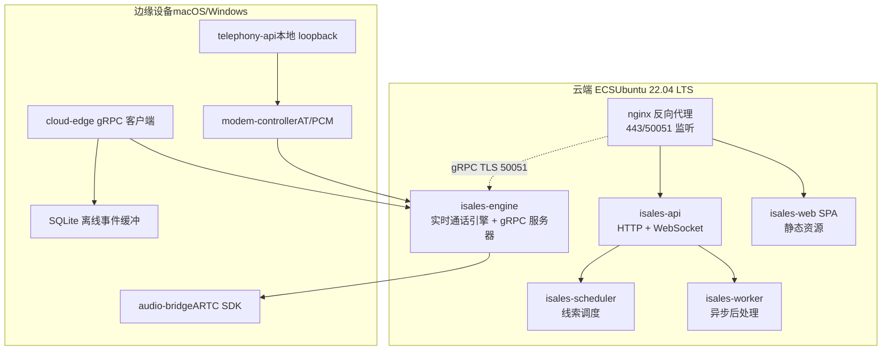
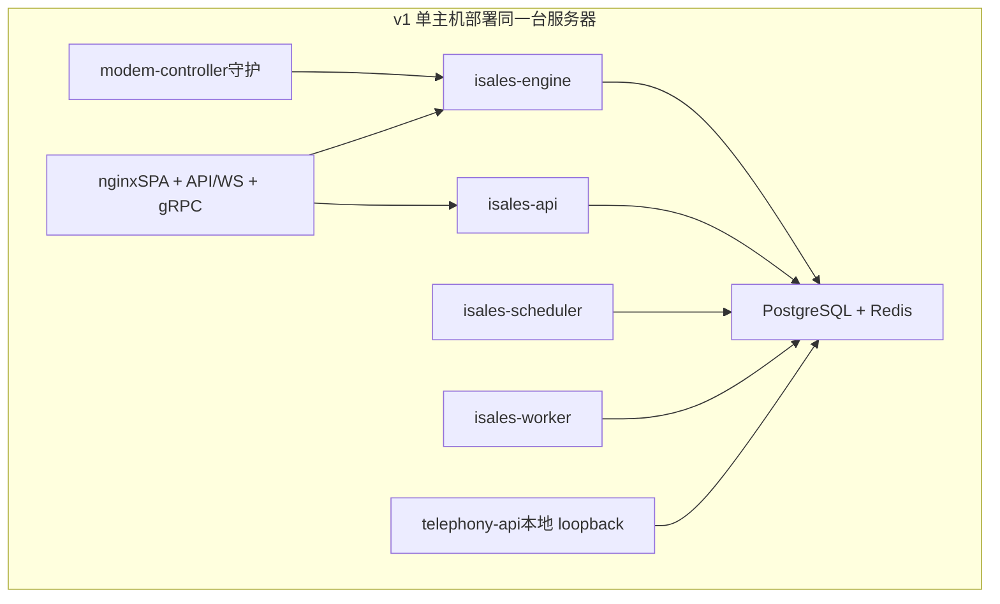
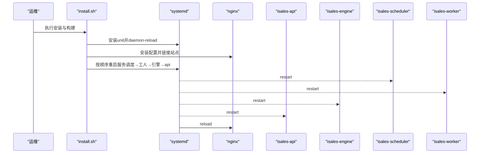
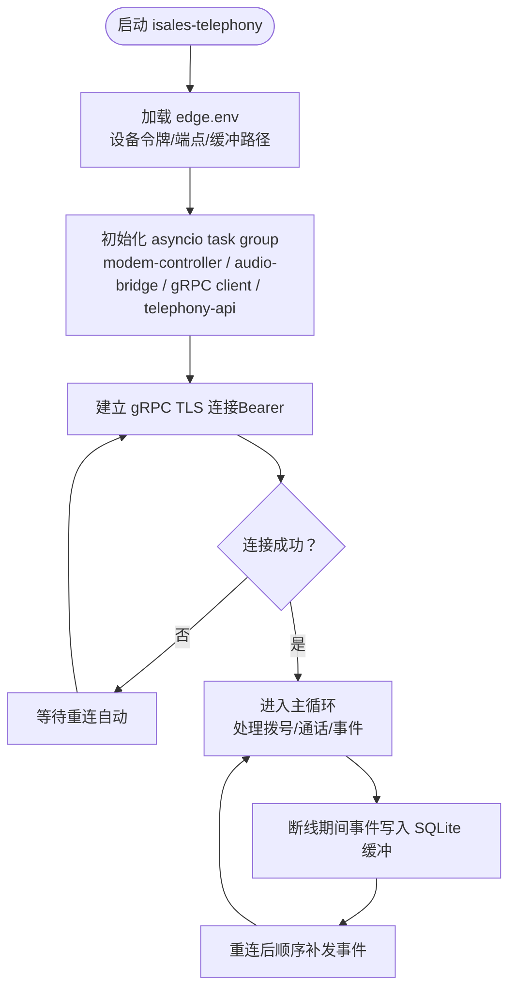
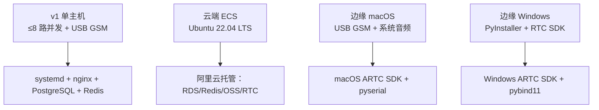

# 部署拓扑设计

<cite>
**本文引用的文件**
- [openspec/specs/deployment-topology/spec.md](file://openspec/specs/deployment-topology/spec.md)
- [openspec/changes/arch-cloud-edge-split/specs/deployment-topology/spec.md](file://openspec/changes/arch-cloud-edge-split/specs/deployment-topology/spec.md)
- [openspec/specs/architecture/spec.md](file://openspec/specs/architecture/spec.md)
- [deploy/cloud/systemd/isales-api.service](file://deploy/cloud/systemd/isales-api.service)
- [deploy/cloud/systemd/isales-engine.service](file://deploy/cloud/systemd/isales-engine.service)
- [deploy/cloud/systemd/isales-scheduler.service](file://deploy/cloud/systemd/isales-scheduler.service)
- [deploy/cloud/systemd/isales-worker.service](file://deploy/cloud/systemd/isales-worker.service)
- [deploy/edge/launchd/com.isales.telephony.plist](file://deploy/edge/launchd/com.isales.telephony.plist)
- [deploy/cloud/nginx/isales.conf](file://deploy/cloud/nginx/isales.conf)
- [deploy/cloud/env/api.env](file://deploy/cloud/env/api.env)
- [deploy/env/modem-controller.env.example](file://deploy/env/modem-controller.env.example)
- [deploy/env/telephony-api.env.example](file://deploy/env/telephony-api.env.example)
- [deploy/edge/env/edge.env.example](file://deploy/edge/env/edge.env.example)
- [deploy/cloud/scripts/install.sh](file://deploy/cloud/scripts/install.sh)
- [deploy/linux/scripts/deploy.sh](file://deploy/linux/scripts/deploy.sh)
- [deploy/cloud/README.md](file://deploy/cloud/README.md)
- [deploy/edge/README.md](file://deploy/edge/README.md)
</cite>

## 目录
1. [简介](#简介)
2. [项目结构](#项目结构)
3. [核心组件](#核心组件)
4. [架构总览](#架构总览)
5. [详细组件分析](#详细组件分析)
6. [依赖分析](#依赖分析)
7. [性能考虑](#性能考虑)
8. [故障排查指南](#故障排查指南)
9. [结论](#结论)
10. [附录](#附录)

## 简介
本文件面向iSales系统v1版本，提供两种部署拓扑设计：单主机部署模型与云-边分离部署模式。前者将7个服务进程统一部署在一台Linux主机上，后者将云端ECS与边缘设备（macOS/Windows）分离，通过gRPC双向流进行控制面通信，并结合阿里RTC提供媒体面互通。本文重点阐述v1单主机部署模型的进程隔离策略、systemd单元配置与启动顺序，以及云-边分离部署模式的差异与联系，并给出部署拓扑图、网络连接与数据交换路径、硬件要求、软件依赖与配置参数。

## 项目结构
- 云端（ECS）部署：包含systemd单元、nginx配置、集中化环境变量模板与安装脚本，服务包括api、engine、scheduler、worker与web nginx。
- 边缘（macOS/Windows）部署：包含launchd配置（macOS）或Windows启动项（D1规划），单进程内包含modem-controller、audio-bridge、cloud-edge gRPC client与本地telephony-api loopback。
- 共享规范：openspec中关于部署拓扑、架构与云-边分离的规范文档，定义了服务职责、进程划分、环境变量契约、启动顺序与网络端口策略。

图表来源
- [deploy/cloud/nginx/isales.conf:1-103](file://deploy/cloud/nginx/isales.conf#L1-L103)
- [openspec/specs/deployment-topology/spec.md:1-414](file://openspec/specs/deployment-topology/spec.md#L1-L414)
- [openspec/changes/arch-cloud-edge-split/specs/deployment-topology/spec.md:1-213](file://openspec/changes/arch-cloud-edge-split/specs/deployment-topology/spec.md#L1-L213)

章节来源
- [deploy/cloud/README.md:1-118](file://deploy/cloud/README.md#L1-L118)
- [deploy/edge/README.md:1-99](file://deploy/edge/README.md#L1-L99)

## 核心组件
- 云端服务（v1.0云-边拆分形态）：
  - isales-api：管理后台API与WebSocket代理，监听127.0.0.1:8000（nginx反代至443/50051）。
  - isales-engine：实时通话引擎，内置cloud-edge gRPC双向流服务器，监听127.0.0.1:50051（nginx终止TLS）。
  - isales-scheduler：线索调度器，负责拨号前的派发与时间窗口管理。
  - isales-worker：异步后处理，负责通话结束后的摘要、字段提取与回调。
  - nginx：反代isales-web静态资源与API/WS，gRPC入口通过独立监听端口。
- 边缘服务（macOS/Windows）：
  - isales-telephony：单进程内包含modem-controller、audio-bridge、cloud-edge gRPC client与本地telephony-api loopback。
  - edge.env：边缘设备的设备标识、令牌与云端gRPC端点等配置。
- 共享依赖：
  - isales-common：6个服务共享的Python包，统一数据模型与公共能力。
  - PostgreSQL与Redis：云端托管（RDS/Redis/Tair），或单主机部署时本地服务。

章节来源
- [openspec/specs/architecture/spec.md:1-168](file://openspec/specs/architecture/spec.md#L1-L168)
- [openspec/specs/deployment-topology/spec.md:1-414](file://openspec/specs/deployment-topology/spec.md#L1-L414)
- [openspec/changes/arch-cloud-edge-split/specs/deployment-topology/spec.md:1-213](file://openspec/changes/arch-cloud-edge-split/specs/deployment-topology/spec.md#L1-L213)

## 架构总览
- v1单主机部署模型：7个服务进程（含telephony-api与modem-controller两个入口）在同一台服务器上，通过systemd管理，PostgreSQL与Redis作为同主机系统服务，nginx反向代理静态资源与API/WS。
- 云-边分离部署模式：云端ECS（4-8核/16-32G RAM）运行5个服务，边缘设备（macOS/Windows）运行1个进程，进程内包含modem-controller、audio-bridge、cloud-edge gRPC client与本地telephony-api loopback，不暴露公网端口，通过出向TLS连接云端。

图表来源
- [openspec/specs/deployment-topology/spec.md:6-38](file://openspec/specs/deployment-topology/spec.md#L6-L38)
- [openspec/specs/architecture/spec.md:45-58](file://openspec/specs/architecture/spec.md#L45-L58)

章节来源
- [openspec/specs/deployment-topology/spec.md:6-38](file://openspec/specs/deployment-topology/spec.md#L6-L38)
- [openspec/specs/architecture/spec.md:45-58](file://openspec/specs/architecture/spec.md#L45-L58)

## 详细组件分析

### v1 单主机部署模型（7服务同主机）
- 进程划分与职责：
  - isales-api：管理后台API与WebSocket代理，监听127.0.0.1:8000，由nginx统一反代。
  - isales-engine：实时通话引擎，内置cloud-edge gRPC双向流服务器，监听127.0.0.1:50051，nginx终止TLS。
  - isales-scheduler：线索调度，依赖数据库与Redis队列。
  - isales-worker：异步后处理，依赖数据库与Redis队列。
  - telephony-api：本地loopback HTTP服务，供同主机内服务调用，免JWT（v1单主机）。
  - modem-controller：守护进程，负责USB GSM AT命令与PCM音频，通过本地IPC与engine通信。
  - nginx：反代SPA静态资源与API/WS，gRPC入口独立监听。
- 进程隔离策略：
  - 每个服务独立systemd单元，独立用户（isales）与工作目录，独立环境变量文件。
  - 通过NoNewPrivileges、ProtectSystem、PrivateTmp等systemd安全特性强化隔离。
- 启动顺序与依赖：
  - 云端install.sh定义的重启顺序：isales-scheduler → isales-worker → isales-engine → isales-api；nginx使用reload而非restart。
  - deploy.sh在非低峰时段重启isales-engine会中断活跃通话，需显式--force确认。
- 环境变量契约：
  - /etc/isales/env/<service>.env集中化管理，敏感信息权限0640 root:isales。
  - 跨服务一致性：ISALES_DATABASE_URL、ISALES_REDIS_URL、ISALES_JWT_SECRET在多处取值一致。

章节来源
- [openspec/specs/deployment-topology/spec.md:62-74](file://openspec/specs/deployment-topology/spec.md#L62-L74)
- [openspec/specs/deployment-topology/spec.md:40-56](file://openspec/specs/deployment-topology/spec.md#L40-L56)
- [deploy/cloud/systemd/isales-api.service:1-35](file://deploy/cloud/systemd/isales-api.service#L1-L35)
- [deploy/cloud/systemd/isales-engine.service:1-42](file://deploy/cloud/systemd/isales-engine.service#L1-L42)
- [deploy/cloud/systemd/isales-scheduler.service:1-31](file://deploy/cloud/systemd/isales-scheduler.service#L1-L31)
- [deploy/cloud/systemd/isales-worker.service:1-31](file://deploy/cloud/systemd/isales-worker.service#L1-L31)
- [deploy/linux/scripts/deploy.sh:10-16](file://deploy/linux/scripts/deploy.sh#L10-L16)
- [deploy/linux/scripts/deploy.sh:80-114](file://deploy/linux/scripts/deploy.sh#L80-L114)

### 云-边分离部署模式（A2形态）
- 云端ECS（Ubuntu 22.04 LTS）：
  - 5个服务进程：isales-api、isales-engine、isales-scheduler、isales-worker、nginx。
  - 托管中间件：RDS PostgreSQL 16、Redis Tair/标准版、OSS、阿里RTC PaaS。
  - 网络策略：仅暴露443/50051，PG/Redis不直接暴露公网。
- 边缘设备（macOS/Windows）：
  - 单进程isales-telephony，包含modem-controller、audio-bridge、cloud-edge gRPC client、本地telephony-api loopback。
  - edge.env包含设备令牌、云端gRPC端点、SQLite离线缓冲路径等。
  - 不暴露公网端口，仅出向访问云端gRPC TLS端点与阿里RTC UDP端口。
- 云-边通信：
  - nginx在云端终止gRPC TLS，转发至127.0.0.1:50051；边缘通过Bearer令牌认证连接。
  - 边缘断线自动重连，离线事件通过SQLite缓冲顺序补发。

章节来源
- [openspec/changes/arch-cloud-edge-split/specs/deployment-topology/spec.md:3-11](file://openspec/changes/arch-cloud-edge-split/specs/deployment-topology/spec.md#L3-L11)
- [openspec/changes/arch-cloud-edge-split/specs/deployment-topology/spec.md:12-36](file://openspec/changes/arch-cloud-edge-split/specs/deployment-topology/spec.md#L12-L36)
- [openspec/changes/arch-cloud-edge-split/specs/deployment-topology/spec.md:173-194](file://openspec/changes/arch-cloud-edge-split/specs/deployment-topology/spec.md#L173-L194)
- [deploy/edge/README.md:1-99](file://deploy/edge/README.md#L1-L99)
- [deploy/cloud/README.md:1-118](file://deploy/cloud/README.md#L1-L118)

### systemd单元与启动顺序
- 云端systemd单元：
  - isales-api：HTTP + WebSocket，监听127.0.0.1:8000，EnvironmentFile=/etc/isales/env/api.env。
  - isales-engine：实时通话引擎 + cloud-edge gRPC服务器，监听127.0.0.1:50051，注入ARTC SDK路径。
  - isales-scheduler：线索调度，EnvironmentFile=/etc/isales/env/scheduler.env。
  - isales-worker：异步后处理，EnvironmentFile=/etc/isales/env/worker.env。
- 启动顺序：
  - install.sh定义：isales-scheduler → isales-worker → isales-engine → isales-api；nginx reload。
  - deploy.sh在非低峰时段重启isales-engine需--force，因会中断活跃通话。

图表来源
- [deploy/cloud/scripts/install.sh:65-94](file://deploy/cloud/scripts/install.sh#L65-L94)
- [deploy/cloud/scripts/install.sh:203-222](file://deploy/cloud/scripts/install.sh#L203-L222)
- [deploy/cloud/scripts/install.sh:245-278](file://deploy/cloud/scripts/install.sh#L245-L278)
- [deploy/linux/scripts/deploy.sh:80-114](file://deploy/linux/scripts/deploy.sh#L80-L114)

章节来源
- [deploy/cloud/systemd/isales-api.service:6-34](file://deploy/cloud/systemd/isales-api.service#L6-L34)
- [deploy/cloud/systemd/isales-engine.service:8-41](file://deploy/cloud/systemd/isales-engine.service#L8-L41)
- [deploy/cloud/systemd/isales-scheduler.service:6-30](file://deploy/cloud/systemd/isales-scheduler.service#L6-L30)
- [deploy/cloud/systemd/isales-worker.service:6-30](file://deploy/cloud/systemd/isales-worker.service#L6-L30)
- [deploy/cloud/scripts/install.sh:65-94](file://deploy/cloud/scripts/install.sh#L65-L94)
- [deploy/linux/scripts/deploy.sh:80-114](file://deploy/linux/scripts/deploy.sh#L80-L114)

### 边缘设备（macOS）进程与配置
- 单进程isales-telephony：
  - 包含modem-controller（USB GSM AT + PCM）、audio-bridge（ARTC SDK macOS via mock或真SDK）、cloud-edge gRPC client（Bearer认证，自动重连，SQLite缓冲）、telephony-api loopback（127.0.0.1）。
  - launchd LaunchAgent，开机自启，崩溃自动重启。
- 配置文件edge.env：
  - ISALES_EDGE_DEVICE_TOKEN：云端签发的设备令牌。
  - ISALES_CLOUD_EDGE_ENDPOINT：云端gRPC TLS端点（域名或ECS公网IP）。
  - ISALES_EDGE_EVENT_BUFFER_PATH：离线事件SQLite缓冲路径。
  - ISALES_MODEM_SERIAL_PATH：可选显式串口路径（默认udev自动探测）。
  - ISALES_EDGE_AUDIO_BACKEND：macos或linux（mock回退）。
  - ISALES_LOG_LEVEL：日志级别。

图表来源
- [deploy/edge/launchd/com.isales.telephony.plist:1-75](file://deploy/edge/launchd/com.isales.telephony.plist#L1-L75)
- [deploy/edge/env/edge.env.example:1-34](file://deploy/edge/env/edge.env.example#L1-L34)

章节来源
- [deploy/edge/launchd/com.isales.telephony.plist:1-75](file://deploy/edge/launchd/com.isales.telephony.plist#L1-L75)
- [deploy/edge/env/edge.env.example:1-34](file://deploy/edge/env/edge.env.example#L1-L34)

### 网络连接与数据交换路径
- 云端：
  - nginx监听443/50051，443反代API/WS，50051反代engine gRPC（TLS终止）。
  - isales-api监听127.0.0.1:8000，isales-engine监听127.0.0.1:50051。
  - isales-web静态资源位于/var/www/isales-web/，权限与SELinux上下文设置正确。
- 边缘：
  - 仅出向访问云端gRPC TLS端点与阿里RTC UDP端口，不监听公网端口。
  - 本地telephony-api仅监听loopback，供同主机内服务调用。

章节来源
- [deploy/cloud/nginx/isales.conf:1-103](file://deploy/cloud/nginx/isales.conf#L1-L103)
- [openspec/changes/arch-cloud-edge-split/specs/deployment-topology/spec.md:173-194](file://openspec/changes/arch-cloud-edge-split/specs/deployment-topology/spec.md#L173-L194)
- [openspec/specs/deployment-topology/spec.md:317-383](file://openspec/specs/deployment-topology/spec.md#L317-L383)

### 配置参数与环境变量
- 云端API环境变量示例（/etc/isales/env/api.env）：
  - 数据库URL、Redis URL、JWT密钥、管理员账户凭据、Fernet主密钥、时区。
- 边缘环境变量示例（~/.config/isales/edge.env）：
  - 设备令牌、云端gRPC端点、SQLite缓冲路径、可选串口路径、音频后端、日志级别。
- modem-controller环境变量（/etc/isales/env/modem-controller.env）：
  - 数据库URL、modem IPC套接字路径、可选udev开关与模拟拨号参数。

章节来源
- [deploy/cloud/env/api.env:1-18](file://deploy/cloud/env/api.env#L1-L18)
- [deploy/edge/env/edge.env.example:1-34](file://deploy/edge/env/edge.env.example#L1-L34)
- [deploy/env/modem-controller.env.example:1-15](file://deploy/env/modem-controller.env.example#L1-L15)
- [deploy/env/telephony-api.env.example:1-12](file://deploy/env/telephony-api.env.example#L1-L12)

## 依赖分析
- 硬件要求：
  - v1单主机：≤8路并发目标，USB GSM modem直插主机。
  - 云端ECS：4-8核/16-32G RAM，Ubuntu 22.04 LTS，公网可达。
  - 边缘macOS：macOS 14+，USB GSM modem，系统音频设备。
  - 边缘Windows：Windows 10 21H2+/11 x64，PyInstaller冻结包，注册表启动项。
- 软件依赖：
  - v1单主机：systemd、PostgreSQL、Redis、nginx、python3.12、nodejs>=20、libudev-dev、libasound2-dev、pkg-config、git。
  - 云端ECS：nginx、python3.12、python3.12-venv、nodejs>=20、pkg-config、git、grpcio编译依赖。
  - 边缘macOS：python3.12、pyserial、阿里ARTC SDK for macOS Python wrapper。
  - 边缘Windows：PyInstaller冻结包、pystray、PySide6、qasync、sounddevice、pyserial、pywin32、grpcio、阿里ARTC SDK Windows native binary。
- 目录与权限：
  - /opt/isales/releases/<ts>/：原子发布目录，current软链指向最新发布。
  - /etc/isales/env/：集中化环境变量（0640 root:isales）。
  - ~/Library/Application Support/isales/：边缘状态目录（macOS）。
  - /var/www/isales-web/：SPA静态资源，nginx拥有，SELinux上下文设置。

图表来源
- [openspec/specs/deployment-topology/spec.md:10-38](file://openspec/specs/deployment-topology/spec.md#L10-L38)
- [openspec/changes/arch-cloud-edge-split/specs/deployment-topology/spec.md:12-54](file://openspec/changes/arch-cloud-edge-split/specs/deployment-topology/spec.md#L12-L54)
- [deploy/cloud/README.md:55-66](file://deploy/cloud/README.md#L55-L66)
- [deploy/edge/README.md:44-53](file://deploy/edge/README.md#L44-L53)

章节来源
- [openspec/specs/deployment-topology/spec.md:10-38](file://openspec/specs/deployment-topology/spec.md#L10-L38)
- [openspec/changes/arch-cloud-edge-split/specs/deployment-topology/spec.md:12-54](file://openspec/changes/arch-cloud-edge-split/specs/deployment-topology/spec.md#L12-L54)
- [deploy/cloud/README.md:55-66](file://deploy/cloud/README.md#L55-L66)
- [deploy/edge/README.md:44-53](file://deploy/edge/README.md#L44-L53)

## 性能考虑
- 低峰时段部署：engine重启会中断活跃通话，应在低峰时段执行，或通过--force确认。
- nginx超时配置：API/WS与gRPC均设置较长超时，保障长连接稳定性。
- ARTC SDK：engine需加载共享库与Python绑定，内存保护策略适度放宽以支持运行时代码生成。
- 监控与告警：Prometheus抓取云端服务指标，Grafana仪表板展示关键KPI，告警覆盖队列深度、设备标记比例、回调失败率与PG连接数。

章节来源
- [openspec/specs/deployment-topology/spec.md:71-74](file://openspec/specs/deployment-topology/spec.md#L71-L74)
- [openspec/specs/deployment-topology/spec.md:95-113](file://openspec/specs/deployment-topology/spec.md#L95-L113)
- [deploy/cloud/systemd/isales-engine.service:27-38](file://deploy/cloud/systemd/isales-engine.service#L27-L38)
- [deploy/cloud/nginx/isales.conf:84-101](file://deploy/cloud/nginx/isales.conf#L84-L101)

## 故障排查指南
- systemd单元检查：
  - 使用systemctl status/unit查看状态与MainPID，journalctl -u unit -n 50查看最近日志。
- nginx配置校验：
  - nginx -t校验配置，reload生效；若502则返回grpc-unavailable提示engine不可用。
- 环境变量一致性：
  - /etc/isales/env/*.env权限0640 root:isales，确保ISALES_DATABASE_URL、ISALES_REDIS_URL、ISALES_JWT_SECRET跨服务一致。
- 边缘重连与离线缓冲：
  - edge.env中ISALES_EDGE_EVENT_BUFFER_PATH指定SQLite缓冲文件，断线后重连顺序补发事件。
- 回滚策略：
  - install.sh支持--activate原子切换current软链；rollback.sh仅切回历史release并重启服务，不自动降级数据库schema。

章节来源
- [deploy/linux/scripts/deploy.sh:90-103](file://deploy/linux/scripts/deploy.sh#L90-L103)
- [deploy/cloud/nginx/isales.conf:95-101](file://deploy/cloud/nginx/isales.conf#L95-L101)
- [openspec/specs/deployment-topology/spec.md:114-132](file://openspec/specs/deployment-topology/spec.md#L114-L132)
- [openspec/specs/deployment-topology/spec.md:140-149](file://openspec/specs/deployment-topology/spec.md#L140-L149)

## 结论
v1部署拓扑提供了两种可行方案：单主机部署模型适合快速验证与小规模场景，云-边分离部署模式更适合生产环境的高可用与扩展性。两者均强调进程隔离、集中化环境变量、严格的启动顺序与网络端口策略，并通过nginx统一反代与TLS终止，保障云端服务的稳定性与安全性。边缘设备通过gRPC双向流与阿里RTC实现云-边协同，不暴露公网端口，具备自动重连与离线缓冲能力。

## 附录
- 快速开始（云端ECS）：
  - provision → 安装DingRTC SDK → 编辑集中化env → install.sh → migrate.sh → install.sh --activate。
- 快速开始（边缘macOS）：
  - provision → 编辑edge.env → install.sh → launchctl注册与启动 → 查看日志。
- 监控与告警：
  - Prometheus抓取job：isales-api、isales-engine、isales-scheduler、isales-worker、node_exporter、postgres_exporter；Grafana仪表板展示关键面板；告警覆盖队列深度、设备标记比例、回调失败率与PG连接数。

章节来源
- [deploy/cloud/README.md:69-92](file://deploy/cloud/README.md#L69-L92)
- [deploy/edge/README.md:55-75](file://deploy/edge/README.md#L55-L75)
- [openspec/specs/deployment-topology/spec.md:95-113](file://openspec/specs/deployment-topology/spec.md#L95-L113)