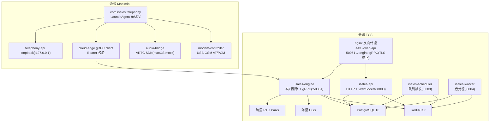
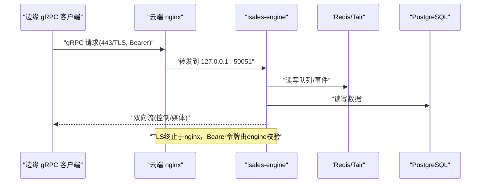
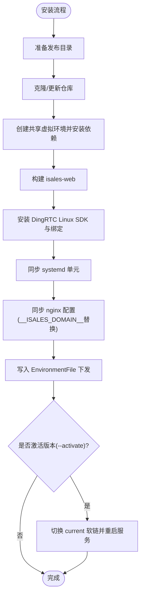
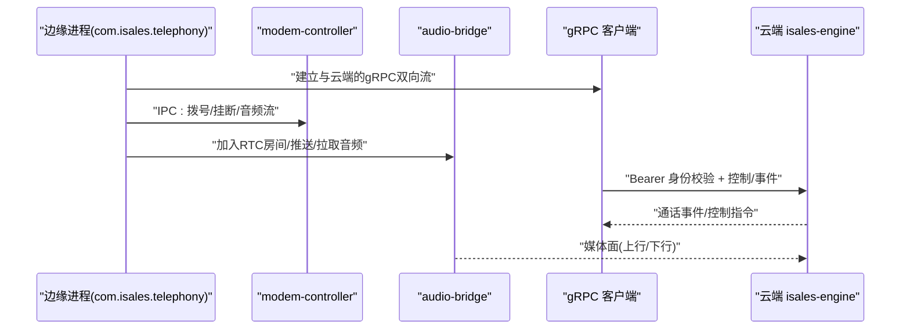
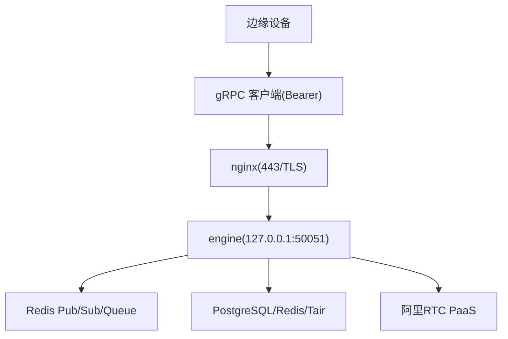

# 云-边分离部署

<cite>
**本文引用的文件**
- [deploy/cloud/README.md](file://deploy/cloud/README.md)
- [deploy/edge/README.md](file://deploy/edge/README.md)
- [deploy/cloud/nginx/isales.conf](file://deploy/cloud/nginx/isales.conf)
- [deploy/cloud/env/README.md](file://deploy/cloud/env/README.md)
- [deploy/cloud/monitoring/README.md](file://deploy/cloud/monitoring/README.md)
- [openspec/specs/architecture/spec.md](file://openspec/specs/architecture/spec.md)
- [openspec/specs/deployment-topology/spec.md](file://openspec/specs/deployment-topology/spec.md)
- [openspec/specs/service-communication/spec.md](file://openspec/specs/service-communication/spec.md)
- [openspec/specs/device-hardware/spec.md](file://openspec/specs/device-hardware/spec.md)
- [deploy/cloud/systemd/isales-api.service](file://deploy/cloud/systemd/isales-api.service)
- [deploy/cloud/systemd/isales-engine.service](file://deploy/cloud/systemd/isales-engine.service)
- [deploy/cloud/systemd/isales-scheduler.service](file://deploy/cloud/systemd/isales-scheduler.service)
- [deploy/cloud/systemd/isales-worker.service](file://deploy/cloud/systemd/isales-worker.service)
- [deploy/edge/launchd/com.isales.telephony.plist](file://deploy/edge/launchd/com.isales.telephony.plist)
- [deploy/cloud/monitoring/prometheus.yml.example](file://deploy/cloud/monitoring/prometheus.yml.example)
- [deploy/cloud/monitoring/alert_rules.yml.example](file://deploy/cloud/monitoring/alert_rules.yml.example)
- [deploy/cloud/scripts/install.sh](file://deploy/cloud/scripts/install.sh)
- [deploy/edge/scripts/install.sh](file://deploy/edge/scripts/install.sh)
</cite>

## 目录
1. [简介](#简介)
2. [项目结构](#项目结构)
3. [核心组件](#核心组件)
4. [架构总览](#架构总览)
5. [详细组件分析](#详细组件分析)
6. [依赖分析](#依赖分析)
7. [性能考虑](#性能考虑)
8. [故障排查指南](#故障排查指南)
9. [结论](#结论)
10. [附录](#附录)

## 简介
本指南面向iSales云-边分离部署，聚焦云端ECS（api、engine、scheduler、worker服务）与边缘设备（modem-controller、audio-bridge）的完整部署与运维。文档详细说明云边通信架构、gRPC双向通信、TLS终止与Bearer校验机制、nginx反向代理配置、服务发现与负载均衡策略、环境变量与依赖安装、服务启动与监控设置，并覆盖云边同步机制、数据一致性与网络拓扑要求等关键要点。

## 项目结构
- 云端部署（Ubuntu 22.04 LTS）：ECS上运行api、engine、scheduler、worker四类服务，配合nginx反向代理与TLS终止，统一管理isales-web静态资源与API/WebSocket入口。
- 边缘部署（macOS 14+）：单进程LaunchAgent承载modem-controller、audio-bridge、cloud-edge gRPC client与本地telephony-api loopback，通过gRPC + 阿里RTC与云端交互，不暴露公网端口。



图表来源
- [deploy/cloud/README.md:10-53](file://deploy/cloud/README.md#L10-L53)
- [deploy/edge/README.md:10-40](file://deploy/edge/README.md#L10-L40)
- [openspec/specs/architecture/spec.md:130-168](file://openspec/specs/architecture/spec.md#L130-L168)

章节来源
- [deploy/cloud/README.md:1-118](file://deploy/cloud/README.md#L1-L118)
- [deploy/edge/README.md:1-99](file://deploy/edge/README.md#L1-L99)
- [openspec/specs/architecture/spec.md:1-168](file://openspec/specs/architecture/spec.md#L1-L168)

## 核心组件
- 云端服务
  - isales-api：管理后台与WebSocket代理，监听8000端口，通过nginx反代443。
  - isales-engine：实时通话引擎，内置gRPC服务（默认127.0.0.1:50051），由nginx终止TLS并转发至本地50051。
  - isales-scheduler：线索派发器，依赖Redis队列与PostgreSQL。
  - isales-worker：异步后处理，依赖Redis与PostgreSQL。
- 边缘进程
  - com.isales.telephony：单进程包含modem-controller、audio-bridge、cloud-edge gRPC client、本地telephony-api loopback。
  - modem-controller：USB GSM AT命令与PCM音频控制。
  - audio-bridge：通过ARTC SDK接入阿里RTC，与云端engine进行媒体面互通。
  - cloud-edge gRPC client：与云端engine建立双向流，使用Bearer令牌进行身份校验。
  - telephony-api loopback：仅监听127.0.0.1，供本地CLI查询。

章节来源
- [deploy/cloud/systemd/isales-api.service:1-35](file://deploy/cloud/systemd/isales-api.service#L1-L35)
- [deploy/cloud/systemd/isales-engine.service:1-42](file://deploy/cloud/systemd/isales-engine.service#L1-L42)
- [deploy/cloud/systemd/isales-scheduler.service:1-31](file://deploy/cloud/systemd/isales-scheduler.service#L1-L31)
- [deploy/cloud/systemd/isales-worker.service:1-31](file://deploy/cloud/systemd/isales-worker.service#L1-L31)
- [deploy/edge/launchd/com.isales.telephony.plist:1-75](file://deploy/edge/launchd/com.isales.telephony.plist#L1-L75)

## 架构总览
- 云边通信采用gRPC双向流，云端nginx在50051端口终止TLS并转发至engine本地端口；边缘client通过Bearer令牌进行设备身份校验。
- nginx同时提供443端口的web静态资源与API/WebSocket反向代理，证书由Let's Encrypt签发。
- 服务间通信以Redis队列与Pub/Sub为主，数据库统一由PostgreSQL与Redis/Tair支撑。
- 监控采用Prometheus抓取各服务指标，结合Grafana仪表盘与告警规则。



图表来源
- [deploy/cloud/nginx/isales.conf:71-102](file://deploy/cloud/nginx/isales.conf#L71-L102)
- [openspec/specs/service-communication/spec.md:106-131](file://openspec/specs/service-communication/spec.md#L106-L131)

章节来源
- [deploy/cloud/nginx/isales.conf:1-103](file://deploy/cloud/nginx/isales.conf#L1-L103)
- [openspec/specs/service-communication/spec.md:1-150](file://openspec/specs/service-communication/spec.md#L1-L150)

## 详细组件分析

### 云端ECS部署（api、engine、scheduler、worker）
- 目录与运行时
  - /opt/isales/releases/<ts>/：按次发布目录，current为原子软链。
  - /etc/isales/env/：集中化环境变量，权限0640，root:isales。
  - systemd单元：api/engine/scheduler/worker，均通过EnvironmentFile=/etc/isales/env/<service>.env注入。
- 依赖与安装
  - Python 3.11（DingRTC绑定要求），Node.js >= 20（构建web），系统包nginx、git、pkg-config、curl、ca-certificates、unzip。
  - DingRTC Linux SDK通过OS级脚本安装至/opt/isales/vendor/，项目内pybind11绑定构建到release venv。
- nginx配置
  - 443端口：web静态资源与/api反代到isales-api:8000，WebSocket通过升级头透传。
  - 50051端口：gRPC双向流，TLS终止于nginx，转发至127.0.0.1:50051；错误页映射为gRPC UNAVAILABLE。
- 数据库与中间件
  - PostgreSQL 16、Redis/Tair、阿里OSS、阿里RTC PaaS。
- 监控
  - Prometheus抓取各服务/metrics端点；Grafana仪表盘与告警规则模板。



图表来源
- [deploy/cloud/scripts/install.sh:20-300](file://deploy/cloud/scripts/install.sh#L20-L300)

章节来源
- [deploy/cloud/README.md:55-118](file://deploy/cloud/README.md#L55-L118)
- [deploy/cloud/scripts/install.sh:1-300](file://deploy/cloud/scripts/install.sh#L1-L300)
- [deploy/cloud/systemd/isales-api.service:1-35](file://deploy/cloud/systemd/isales-api.service#L1-L35)
- [deploy/cloud/systemd/isales-engine.service:1-42](file://deploy/cloud/systemd/isales-engine.service#L1-L42)
- [deploy/cloud/systemd/isales-scheduler.service:1-31](file://deploy/cloud/systemd/isales-scheduler.service#L1-L31)
- [deploy/cloud/systemd/isales-worker.service:1-31](file://deploy/cloud/systemd/isales-worker.service#L1-L31)

### 边缘设备部署（modem-controller、audio-bridge）
- 进程与职责
  - com.isales.telephony：单进程内包含modem-controller、audio-bridge、cloud-edge gRPC client、telephony-api loopback。
  - modem-controller：udev监听、AT命令通道、PCM音频管道，与engine通过本地IPC通信。
  - audio-bridge：macOS平台通过mock会话接入阿里RTC，与engine进行媒体面互通。
  - cloud-edge gRPC client：使用设备令牌(Bearer)进行身份校验，自动重连，离线事件缓冲至SQLite。
  - telephony-api loopback：仅监听127.0.0.1，供本地CLI查询。
- 硬件与网络
  - USB GSM modem（A7670E类）→ /dev/tty.usb*；系统声音设备用于麦克风/扬声器。
  - 不暴露公网端口，仅443/TCP（gRPC + OCSP）与阿里RTC UDP公网端口。
- 状态目录
  - ~/Library/Application Support/isales/：sqlite/edge_buffer.db、vendor/、recordings/等。



图表来源
- [openspec/specs/device-hardware/spec.md:106-170](file://openspec/specs/device-hardware/spec.md#L106-L170)
- [deploy/edge/launchd/com.isales.telephony.plist:6-20](file://deploy/edge/launchd/com.isales.telephony.plist#L6-L20)

章节来源
- [deploy/edge/README.md:44-99](file://deploy/edge/README.md#L44-L99)
- [openspec/specs/device-hardware/spec.md:1-525](file://openspec/specs/device-hardware/spec.md#L1-L525)
- [deploy/edge/launchd/com.isales.telephony.plist:1-75](file://deploy/edge/launchd/com.isales.telephony.plist#L1-L75)

### 云边通信与gRPC架构
- 双向流与TLS
  - nginx在50051端口终止TLS，转发至engine本地50051；gRPC元数据中携带Bearer令牌，engine负责校验设备身份。
  - 云端engine监听127.0.0.1:50051，确保公网仅通过nginx可达。
- Bearer校验机制
  - 边缘设备令牌在nginx层透传，engine侧进行有效性校验；失败时返回gRPC UNAVAILABLE。
- 服务发现与负载均衡
  - v1.0单实例部署，engine重启约30-60秒中断；HA与多实例扩展不在本变更范围内。
- 云边同步与一致性
  - 通话事件通过Redis Pub/Sub推送至前端；engine与worker通过Redis队列进行异步处理。
  - 边缘心跳与失联探测：modem-controller每30s心跳，worker每30swatchdog将超过120s无心跳的设备置为offline。



图表来源
- [deploy/cloud/nginx/isales.conf:71-102](file://deploy/cloud/nginx/isales.conf#L71-L102)
- [openspec/specs/service-communication/spec.md:106-131](file://openspec/specs/service-communication/spec.md#L106-L131)

章节来源
- [openspec/specs/service-communication/spec.md:1-150](file://openspec/specs/service-communication/spec.md#L1-L150)
- [deploy/cloud/nginx/isales.conf:1-103](file://deploy/cloud/nginx/isales.conf#L1-L103)

### nginx反向代理与TLS
- 443端口
  - 提供isales-web静态资源与/api反代；WebSocket通过Upgrade头透传，超时配置满足长连接需求。
- 50051端口
  - gRPC双向流，TLS终止于nginx，错误页映射为gRPC UNAVAILABLE；超时配置适配engine心跳与长连接。
- 证书与域名
  - 使用Let's Encrypt证书；通过install.sh替换配置中的域名占位符。

章节来源
- [deploy/cloud/nginx/isales.conf:1-103](file://deploy/cloud/nginx/isales.conf#L1-L103)

### 环境变量与依赖安装
- 云端
  - /etc/isales/env/下集中化管理api/engine/scheduler/worker的环境变量，权限0640；敏感密钥不提交到git。
  - DingRTC Linux SDK与项目内pybind11绑定构建到release venv；engine.env包含RTC AppId/AppKey、LD_LIBRARY_PATH/PYTHONPATH、gRPC绑定地址等。
- 边缘
  - ~/.config/isales/edge.env：设备ID、令牌、云端gRPC端点、RTC AppId等；权限0600。
  - macOS依赖：Homebrew + git；GSM modem驱动通常由系统提供；Python 3.12 via Homebrew。

章节来源
- [deploy/cloud/env/README.md:1-106](file://deploy/cloud/env/README.md#L1-L106)
- [deploy/edge/README.md:33-86](file://deploy/edge/README.md#L33-L86)

### 服务启动与监控
- 云端
  - systemd单元：isales-api、isales-engine、isales-scheduler、isales-worker；engine通过EnvironmentFile注入DingRTC SDK路径与gRPC绑定。
  - install.sh完成发布、构建、安装单元与nginx配置后，可选择--activate切换current并重启服务。
- 边缘
  - install.sh完成发布、venv、LaunchAgent同步与状态目录初始化；首次激活需编辑edge.env并bootstrap/kickstart。
- 监控
  - Prometheus抓取各服务/metrics端点；Grafana仪表盘与告警规则模板；云边专用指标包括engine的cloud-edge流计数、心跳时间、断线次数、ARTC会话数与推送反压等。

章节来源
- [deploy/cloud/scripts/install.sh:1-300](file://deploy/cloud/scripts/install.sh#L1-L300)
- [deploy/edge/scripts/install.sh:1-222](file://deploy/edge/scripts/install.sh#L1-L222)
- [deploy/cloud/monitoring/README.md:1-37](file://deploy/cloud/monitoring/README.md#L1-L37)
- [deploy/cloud/monitoring/prometheus.yml.example:1-77](file://deploy/cloud/monitoring/prometheus.yml.example#L1-L77)
- [deploy/cloud/monitoring/alert_rules.yml.example:1-116](file://deploy/cloud/monitoring/alert_rules.yml.example#L1-L116)

## 依赖分析
- 服务间通信
  - Redis队列：scheduler→engine（拨号）、engine→worker（通话结束）。
  - Redis Pub/Sub：api↔engine（实时控制/事件推送）。
  - HTTP：scheduler→telephony-api（拨号前选device）。
  - 数据库：PostgreSQL与Redis/Tair直连。
- 云边通信
  - gRPC双向流：控制面（engine↔edge）+ 媒体面（audio-bridge↔engine）。
  - TLS与Bearer：nginx终止TLS，engine校验Bearer令牌。
- 硬件与平台
  - modem-controller：udev监听、AT命令、PCM音频；Windows/macOS/Linux平台后端分离。
  - audio-bridge：macOS mock会话；Windows通过pybind11接入阿里RTC SDK。

```mermaid
graph LR
SCHED["scheduler"] --> |队列| ENGINE["engine"]
ENGINE --> |队列| WORKER["worker"]
API["api"] <- --> |Pub/Sub| ENGINE
API --> |队列| SCHED
SCHED --> |HTTP| TAPI["telephony-api(loopback)"]
ENGINE --> |直连| PG["PostgreSQL"]
ENGINE --> |直连| REDIS["Redis/Tair"]
EDGE["边缘 gRPC 客户端"] --> |gRPC| ENGINE
EDGE --> |RTC| RTC["阿里RTC PaaS"]
```

图表来源
- [openspec/specs/service-communication/spec.md:7-25](file://openspec/specs/service-communication/spec.md#L7-L25)
- [openspec/specs/device-hardware/spec.md:106-170](file://openspec/specs/device-hardware/spec.md#L106-L170)

章节来源
- [openspec/specs/service-communication/spec.md:1-150](file://openspec/specs/service-communication/spec.md#L1-L150)
- [openspec/specs/device-hardware/spec.md:1-525](file://openspec/specs/device-hardware/spec.md#L1-L525)

## 性能考虑
- 延迟预算
  - 引擎首TTS P95延迟预算为800ms；超过阈值触发降级策略（如降低多角色并发）。
- 媒体面
  - ARTC SDK推送音频缓冲满载告警阈值：30s窗口内>3次；指示云边链路拥塞或TTS提供方突发。
- 连接与超时
  - nginx gRPC读写超时与engine心跳周期匹配，保障长连接稳定性。
- 并发与限流
  - 跨engine实例的全局并发通过Redis原子计数器控制，避免超限派发。

章节来源
- [deploy/cloud/monitoring/alert_rules.yml.example:69-86](file://deploy/cloud/monitoring/alert_rules.yml.example#L69-L86)
- [deploy/cloud/nginx/isales.conf:84-87](file://deploy/cloud/nginx/isales.conf#L84-L87)

## 故障排查指南
- nginx 502错误
  - nginx映射到/gRPC UNAVAILABLE，检查engine进程状态与gRPC绑定；engine不可用时返回grpc-status 14。
- gRPC断线风暴
  - 持续断线（5分钟内>5次）：检查WAN稳定性或令牌轮换不一致；核对nginx error.log与edge grpc_client日志。
- ARTC推送缓冲满
  - TTS拉取速度超过SDK编码/发送速率；检查engine日志中OnPushAudioFrameBufferFull回调频率。
- 设备离线
  - 边缘120s无心跳：engine watchdog将设备置为offline；检查edge进程、SQLite缓冲与网络连通性。
- 数据库连接数过高
  - PG连接数超过max_connections*0.8：检查慢查询与连接池配置。

章节来源
- [deploy/cloud/nginx/isales.conf:95-102](file://deploy/cloud/nginx/isales.conf#L95-L102)
- [deploy/cloud/monitoring/alert_rules.yml.example:12-68](file://deploy/cloud/monitoring/alert_rules.yml.example#L12-L68)

## 结论
iSales云-边分离部署通过nginx统一反向代理与TLS终止、gRPC双向流实现云边控制面与媒体面的协同，结合Redis/PostgreSQL实现高可靠的服务间通信与数据一致性。边缘以单进程LaunchAgent承载modem与音频桥接，不暴露公网端口，满足安全与合规要求。监控体系覆盖云边专用指标与延迟预算，为运维提供可观测性保障。

## 附录
- 快速开始（云端）
  - 主机准备、安装DingRTC SDK、编辑集中化env、安装新release、数据库迁移、切换current并重启。
- 快速开始（边缘）
  - 准备Mac mini、编辑用户级env、安装新release、注册并启动launchd、查看日志。
- 监控与告警
  - Prometheus抓取模板、Grafana仪表盘、告警规则；云边专用指标与延迟预算阈值。

章节来源
- [deploy/cloud/README.md:69-93](file://deploy/cloud/README.md#L69-L93)
- [deploy/edge/README.md:55-75](file://deploy/edge/README.md#L55-L75)
- [deploy/cloud/monitoring/README.md:26-37](file://deploy/cloud/monitoring/README.md#L26-L37)