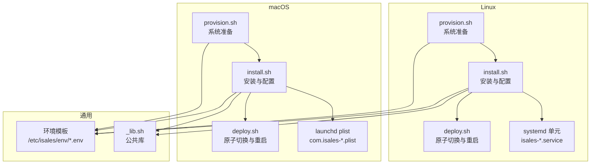
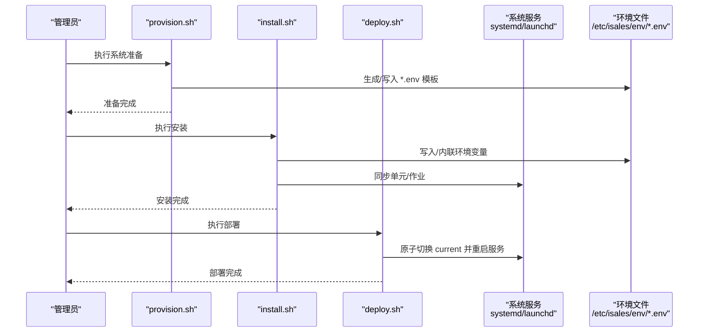
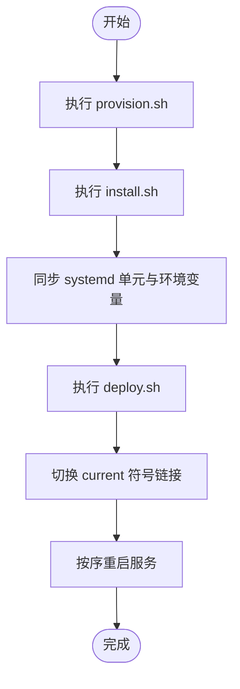
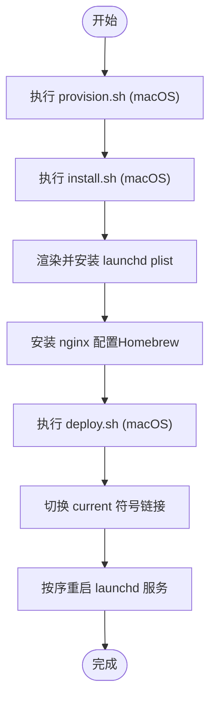
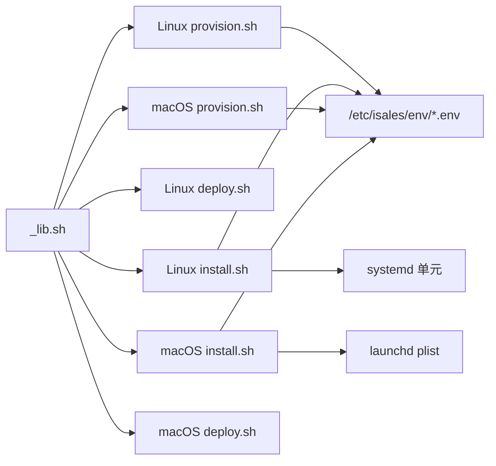

# 单主机部署

<cite>
**本文引用的文件**
- [deploy/linux/scripts/provision.sh](file://deploy/linux/scripts/provision.sh)
- [deploy/macos/scripts/provision.sh](file://deploy/macos/scripts/provision.sh)
- [deploy/common/_lib.sh](file://deploy/common/_lib.sh)
- [deploy/linux/scripts/install.sh](file://deploy/linux/scripts/install.sh)
- [deploy/macos/scripts/install.sh](file://deploy/macos/scripts/install.sh)
- [deploy/cloud/systemd/isales-api.service](file://deploy/cloud/systemd/isales-api.service)
- [deploy/env/api.env.example](file://deploy/env/api.env.example)
- [deploy/env/engine.env.example](file://deploy/env/engine.env.example)
- [deploy/env/scheduler.env.example](file://deploy/env/scheduler.env.example)
- [deploy/env/worker.env.example](file://deploy/env/worker.env.example)
- [deploy/env/modem-controller.env.example](file://deploy/env/modem-controller.env.example)
- [deploy/linux/scripts/deploy.sh](file://deploy/linux/scripts/deploy.sh)
- [deploy/macos/scripts/deploy.sh](file://deploy/macos/scripts/deploy.sh)
- [deploy/macos/plist/com.isales.api.plist](file://deploy/macos/plist/com.isales.api.plist)
- [deploy/edge/launchd/com.isales.telephony.plist](file://deploy/edge/launchd/com.isales.telephony.plist)
</cite>

## 目录
1. [简介](#简介)
2. [项目结构](#项目结构)
3. [核心组件](#核心组件)
4. [架构总览](#架构总览)
5. [详细组件分析](#详细组件分析)
6. [依赖关系分析](#依赖关系分析)
7. [性能考虑](#性能考虑)
8. [故障排查指南](#故障排查指南)
9. [结论](#结论)
10. [附录](#附录)

## 简介
本指南面向在单台主机上部署 iSales 的运维与开发人员，覆盖 Linux systemd 与 macOS launchd 两种托管方式。内容包括系统准备、依赖安装、服务配置、环境变量设置、安装脚本解析、服务启动顺序、健康检查机制、macOS 平台特有注意事项以及部署验证与常见问题排查。

## 项目结构
iSales 的单主机部署由“准备（provision）—安装（install）—部署（deploy）”三步构成，分别对应 Linux 与 macOS 的脚本实现，并通过统一的环境模板生成各服务所需的环境变量文件。

图表来源
- [deploy/linux/scripts/provision.sh:1-224](file://deploy/linux/scripts/provision.sh#L1-L224)
- [deploy/macos/scripts/provision.sh:1-280](file://deploy/macos/scripts/provision.sh#L1-L280)
- [deploy/linux/scripts/install.sh:1-275](file://deploy/linux/scripts/install.sh#L1-L275)
- [deploy/macos/scripts/install.sh:1-417](file://deploy/macos/scripts/install.sh#L1-L417)
- [deploy/linux/scripts/deploy.sh:1-139](file://deploy/linux/scripts/deploy.sh#L1-L139)
- [deploy/macos/scripts/deploy.sh:1-201](file://deploy/macos/scripts/deploy.sh#L1-L201)
- [deploy/common/_lib.sh:1-181](file://deploy/common/_lib.sh#L1-L181)

章节来源
- [deploy/linux/scripts/provision.sh:1-224](file://deploy/linux/scripts/provision.sh#L1-L224)
- [deploy/macos/scripts/provision.sh:1-280](file://deploy/macos/scripts/provision.sh#L1-L280)
- [deploy/common/_lib.sh:1-181](file://deploy/common/_lib.sh#L1-L181)

## 核心组件
- 系统准备（provision）
  - Linux：安装系统包、创建服务用户、初始化目录结构、配置 Redis AOF、初始化 PostgreSQL 角色与数据库、生成随机密钥并写入环境模板。
  - macOS：使用 Homebrew 安装软件包、创建服务用户、初始化目录结构、配置 Redis AOF、初始化 PostgreSQL 角色与数据库、生成随机密钥并写入环境模板。
- 安装（install）
  - Linux：克隆/更新源码、构建共享虚拟环境、构建前端、同步 systemd 单元、写入环境变量 drop-in、安装备份计划任务。
  - macOS：克隆/更新源码、构建共享虚拟环境、构建前端、渲染并安装 launchd plist（内联环境变量）、安装 nginx 配置。
- 部署（deploy）
  - Linux：原子切换 current 符号链接，按依赖顺序重启服务，可选重启调制解调器控制器，最后输出状态摘要。
  - macOS：原子切换 current 符号链接，按依赖顺序确保并重启 launchd 服务，可选重启调制解调器控制器，最后输出状态摘要。

章节来源
- [deploy/linux/scripts/provision.sh:1-224](file://deploy/linux/scripts/provision.sh#L1-L224)
- [deploy/macos/scripts/provision.sh:1-280](file://deploy/macos/scripts/provision.sh#L1-L280)
- [deploy/linux/scripts/install.sh:1-275](file://deploy/linux/scripts/install.sh#L1-L275)
- [deploy/macos/scripts/install.sh:1-417](file://deploy/macos/scripts/install.sh#L1-L417)
- [deploy/linux/scripts/deploy.sh:1-139](file://deploy/linux/scripts/deploy.sh#L1-L139)
- [deploy/macos/scripts/deploy.sh:1-201](file://deploy/macos/scripts/deploy.sh#L1-L201)

## 架构总览
下图展示单主机部署的总体流程与关键文件交互：

图表来源
- [deploy/linux/scripts/provision.sh:1-224](file://deploy/linux/scripts/provision.sh#L1-L224)
- [deploy/macos/scripts/provision.sh:1-280](file://deploy/macos/scripts/provision.sh#L1-L280)
- [deploy/linux/scripts/install.sh:1-275](file://deploy/linux/scripts/install.sh#L1-L275)
- [deploy/macos/scripts/install.sh:1-417](file://deploy/macos/scripts/install.sh#L1-L417)
- [deploy/linux/scripts/deploy.sh:1-139](file://deploy/linux/scripts/deploy.sh#L1-L139)
- [deploy/macos/scripts/deploy.sh:1-201](file://deploy/macos/scripts/deploy.sh#L1-L201)

## 详细组件分析

### Linux 部署流程（systemd）
- 系统准备
  - 安装系统包、创建 isales 用户、初始化 /opt/isales 与 /etc/isales/env 目录、启用 Redis AOF、初始化 PostgreSQL 角色与数据库、生成随机密钥并写入各服务的环境模板。
- 安装
  - 克隆/更新 7 个仓库到发布目录，创建共享虚拟环境，构建前端，同步 systemd 单元至 /etc/systemd/system/，重写 ExecStart 与 WorkingDirectory 指向 /opt/isales/current，写入各服务的 EnvironmentFile drop-in，安装备份计划任务。
- 部署
  - 原子切换 current 符号链接，按依赖顺序重启服务（telephony-api → scheduler → worker → engine → api），可选重启 modem-controller，最后输出状态摘要。

图表来源
- [deploy/linux/scripts/provision.sh:1-224](file://deploy/linux/scripts/provision.sh#L1-L224)
- [deploy/linux/scripts/install.sh:1-275](file://deploy/linux/scripts/install.sh#L1-L275)
- [deploy/linux/scripts/deploy.sh:1-139](file://deploy/linux/scripts/deploy.sh#L1-L139)

章节来源
- [deploy/linux/scripts/provision.sh:1-224](file://deploy/linux/scripts/provision.sh#L1-L224)
- [deploy/linux/scripts/install.sh:1-275](file://deploy/linux/scripts/install.sh#L1-L275)
- [deploy/cloud/systemd/isales-api.service:1-35](file://deploy/cloud/systemd/isales-api.service#L1-L35)
- [deploy/linux/scripts/deploy.sh:1-139](file://deploy/linux/scripts/deploy.sh#L1-L139)

### macOS 部署流程（launchd）
- 系统准备
  - 使用 Homebrew 安装软件包、创建 _isales 用户、初始化目录结构、配置 Redis AOF、初始化 PostgreSQL 角色与数据库、生成随机密钥并写入各服务的环境模板。
- 安装
  - 克隆/更新 7 个仓库到发布目录，创建共享虚拟环境，构建前端，渲染并安装 launchd plist（将 /etc/isales/env/<svc>.env 内容内联到 <key>EnvironmentVariables</key>），安装 nginx 配置（端口与文档根路径适配 Homebrew）。
- 部署
  - 原子切换 current 符号链接，按依赖顺序确保并重启 launchd 服务（telephony-api → scheduler → worker → engine → api），可选重启 modem-controller，最后输出状态摘要。

图表来源
- [deploy/macos/scripts/provision.sh:1-280](file://deploy/macos/scripts/provision.sh#L1-L280)
- [deploy/macos/scripts/install.sh:1-417](file://deploy/macos/scripts/install.sh#L1-L417)
- [deploy/macos/scripts/deploy.sh:1-201](file://deploy/macos/scripts/deploy.sh#L1-L201)

章节来源
- [deploy/macos/scripts/provision.sh:1-280](file://deploy/macos/scripts/provision.sh#L1-L280)
- [deploy/macos/scripts/install.sh:1-417](file://deploy/macos/scripts/install.sh#L1-L417)
- [deploy/macos/plist/com.isales.api.plist:1-37](file://deploy/macos/plist/com.isales.api.plist#L1-L37)
- [deploy/edge/launchd/com.isales.telephony.plist:1-75](file://deploy/edge/launchd/com.isales.telephony.plist#L1-L75)
- [deploy/macos/scripts/deploy.sh:1-201](file://deploy/macos/scripts/deploy.sh#L1-L201)

### systemd 服务单元配置要点
- 运行用户与组：服务以 isales 用户运行，限制权限。
- 可执行入口：ExecStart 指向 /opt/isales/current/venv/bin/ 下的服务可执行文件。
- 工作目录：WorkingDirectory 指向 /opt/isales/current/<service>。
- 环境变量：通过 EnvironmentFile 引用 /etc/isales/env/<service>.env。
- 重启策略：on-failure，带退避间隔。
- 安全加固：NoNewPrivileges、ProtectSystem、PrivateTmp、Restrict* 等。

章节来源
- [deploy/cloud/systemd/isales-api.service:1-35](file://deploy/cloud/systemd/isales-api.service#L1-L35)
- [deploy/env/api.env.example:1-14](file://deploy/env/api.env.example#L1-L14)
- [deploy/env/engine.env.example:1-21](file://deploy/env/engine.env.example#L1-L21)
- [deploy/env/scheduler.env.example:1-21](file://deploy/env/scheduler.env.example#L1-L21)
- [deploy/env/worker.env.example:1-20](file://deploy/env/worker.env.example#L1-L20)
- [deploy/env/modem-controller.env.example:1-15](file://deploy/env/modem-controller.env.example#L1-L15)

### launchd 作业配置要点
- 作业位置：/Library/LaunchDaemons/（系统级）或 ~/Library/LaunchAgents/（用户会话）。
- 用户与组：macOS 使用 _isales 用户与组。
- 可执行入口：ProgramArguments 指向 /opt/isales/current/venv/bin/<service>。
- 环境变量注入：install.sh 将 /etc/isales/env/<svc>.env 内容内联到 <key>EnvironmentVariables</key>。
- 运行行为：RunAtLoad=true，KeepAlive 控制进程存活策略。
- 日志路径：StandardOutPath/StandardErrorPath 指向 /opt/isales/logs 或用户日志目录。

章节来源
- [deploy/macos/plist/com.isales.api.plist:1-37](file://deploy/macos/plist/com.isales.api.plist#L1-L37)
- [deploy/edge/launchd/com.isales.telephony.plist:1-75](file://deploy/edge/launchd/com.isales.telephony.plist#L1-L75)

### 环境变量与安全
- 数据库连接：ISALES_DATABASE_URL 在所有服务间必须一致。
- 缓存连接：ISALES_REDIS_URL 在 api/scheduler/worker 间必须一致。
- 加密密钥：ISALES_JWT_SECRET 用于 HS256 签名/验签一致性；ISALES_FERNET_KEY 用于 worker 加解密。
- 管理员凭据：API 服务需设置 ISALES_ADMIN_USER 与 ISALES_ADMIN_PASSWORD_HASH。
- 时区：TZ 设置为 Asia/Shanghai。

章节来源
- [deploy/env/api.env.example:1-14](file://deploy/env/api.env.example#L1-L14)
- [deploy/env/engine.env.example:1-21](file://deploy/env/engine.env.example#L1-L21)
- [deploy/env/scheduler.env.example:1-21](file://deploy/env/scheduler.env.example#L1-L21)
- [deploy/env/worker.env.example:1-20](file://deploy/env/worker.env.example#L1-L20)
- [deploy/env/modem-controller.env.example:1-15](file://deploy/env/modem-controller.env.example#L1-L15)

### 服务启动顺序与健康检查
- Linux（systemd）：按 telephony-api → scheduler → worker → engine → api 顺序重启；nginx 使用 reload；可选重启 modem-controller。
- macOS（launchd）：按 telephony-api → scheduler → worker → engine → api 顺序重启；nginx 使用 brew services reload；可选重启 modem-controller。
- 健康检查：脚本在重启后读取服务状态并输出 PID；如失败则打印最近日志定位问题。

章节来源
- [deploy/linux/scripts/deploy.sh:1-139](file://deploy/linux/scripts/deploy.sh#L1-L139)
- [deploy/macos/scripts/deploy.sh:1-201](file://deploy/macos/scripts/deploy.sh#L1-L201)

## 依赖关系分析
- 脚本依赖
  - 所有脚本均通过公共库 _lib.sh 提供日志、参数解析、命令检查、文件写入等能力。
  - Linux install.sh 依赖 systemd 与 nginx；macOS install.sh 依赖 Homebrew、Python 与 Node。
- 环境模板
  - provision.sh 与 install.sh 均依赖 /etc/isales/env/ 下的模板文件，install.sh 在 Linux 中写入 drop-in，在 macOS 中内联到 plist。
- 服务单元
  - Linux 使用 systemd 单元；macOS 使用 launchd plist；两者均指向 /opt/isales/current/venv/bin/ 与 /opt/isales/current/<service>。

图表来源
- [deploy/common/_lib.sh:1-181](file://deploy/common/_lib.sh#L1-L181)
- [deploy/linux/scripts/provision.sh:1-224](file://deploy/linux/scripts/provision.sh#L1-L224)
- [deploy/macos/scripts/provision.sh:1-280](file://deploy/macos/scripts/provision.sh#L1-L280)
- [deploy/linux/scripts/install.sh:1-275](file://deploy/linux/scripts/install.sh#L1-L275)
- [deploy/macos/scripts/install.sh:1-417](file://deploy/macos/scripts/install.sh#L1-L417)
- [deploy/linux/scripts/deploy.sh:1-139](file://deploy/linux/scripts/deploy.sh#L1-L139)
- [deploy/macos/scripts/deploy.sh:1-201](file://deploy/macos/scripts/deploy.sh#L1-L201)

章节来源
- [deploy/common/_lib.sh:1-181](file://deploy/common/_lib.sh#L1-L181)

## 性能考虑
- Redis AOF：Linux 通过 include 方式启用 AOF；macOS 直接写入配置块并尝试在线生效，避免不必要的重启。
- PostgreSQL：仅在需要时初始化角色与数据库，避免重复操作。
- 前端构建：统一在安装阶段进行，减少部署时的构建开销。
- 低峰窗口：部署脚本默认在低峰时段重启引擎以避免中断通话；可通过强制标志绕过。

章节来源
- [deploy/linux/scripts/provision.sh:97-127](file://deploy/linux/scripts/provision.sh#L97-L127)
- [deploy/macos/scripts/provision.sh:146-190](file://deploy/macos/scripts/provision.sh#L146-L190)
- [deploy/linux/scripts/deploy.sh:51-68](file://deploy/linux/scripts/deploy.sh#L51-L68)
- [deploy/macos/scripts/deploy.sh:60-77](file://deploy/macos/scripts/deploy.sh#L60-L77)

## 故障排查指南
- 权限与用户
  - Linux：确认 isales 用户存在且拥有 /opt/isales 与 /etc/isales/env 权限。
  - macOS：确认 _isales 用户存在且拥有 /opt/isales 与 /etc/isales/env 权限。
- 环境变量
  - 检查 /etc/isales/env/*.env 是否存在且内容正确；必要时重新生成模板。
- systemd
  - 查看单元状态与日志：systemctl status <service>、journalctl -u <service> -n 50。
  - 确认 EnvironmentFile 与 ExecStart/WorkingDirectory 已被 install.sh 正确重写。
- launchd
  - 查看服务状态与日志：launchctl print system/<label>、log show --predicate "subsystem == '<label>'" --last 5m。
  - 确认 plist 已安装到 /Library/LaunchDaemons/ 且通过 plutil -lint 校验通过。
- nginx
  - Linux：nginx -t；macOS：使用 brew nginx -t 并确保文档根与端口配置正确。
- 低峰窗口
  - 若非低峰时间重启引擎导致失败，可在部署时添加强制标志或调整 LOW_PEAK_* 环境变量。

章节来源
- [deploy/linux/scripts/deploy.sh:90-106](file://deploy/linux/scripts/deploy.sh#L90-L106)
- [deploy/macos/scripts/deploy.sh:119-171](file://deploy/macos/scripts/deploy.sh#L119-L171)
- [deploy/macos/scripts/install.sh:289-320](file://deploy/macos/scripts/install.sh#L289-L320)

## 结论
通过 provision → install → deploy 三步法，iSales 在 Linux 与 macOS 上实现了标准化、可重复的单主机部署。Linux 使用 systemd，macOS 使用 launchd，二者均通过统一的环境模板与严格的权限控制保障安全性与一致性。遵循本文档的步骤与注意事项，可高效完成部署并快速定位问题。

## 附录
- 常用命令速查
  - Linux：systemctl status/restart/reload、journalctl -u、nginx -t
  - macOS：launchctl print/bootstrap/kickstart、brew services reload nginx、log show
- 环境变量模板位置
  - /etc/isales/env/api.env、engine.env、scheduler.env、worker.env、modem-controller.env
- 服务可执行与工作目录
  - /opt/isales/current/venv/bin/<service>、/opt/isales/current/<service>